<!--
author:   Your Name

email:    your@mail.org

icon:     img/icon.png

version:  0.0.1

language: de

narrator: US English Female

comment:  Try to write a short comment about
          your course, multiline is also okay.

link:     style.css

script:   https://cdnjs.cloudflare.com/ajax/libs/PapaParse/5.3.1/papaparse.min.js

@onload

const baseURL = (new URL("img", window.location.search.substr(1))).href

window["fish"] = {
  "body.typical": null,
  "body.flattened": null,
  "body.long": null,

  "mouth.inferior": null,
  "mouth.superior": null,
  "mouth.elongated": null,
  "mouth.terminal": null,

  "barbel.one": null,
  "barbel.several": null,
  "barbel.absent": null,

  "sucking_disc.present": null,
  "sucking_disc.absent": null,

  "color.black": null,
  "color.blue": null,
  "color.brown": null,
  "color.green": null,
  "color.grey": null,
  "color.red": null,
  "color.silver": null,
  "color.white": null,
  "color.yellow": null,

  "pattern.circles": null,
  "pattern.dots": null,
  "pattern.irregular": null,
  "pattern.spots": null,
  "pattern.stripes": null,
  "pattern.uniform": null,

  "fin.dorsal.one": null,
  "fin.dorsal.two": null,
  "fin.dorsal.three": null,
  "fin.dorsal.with_adipose": null,
  "fin.dorsal.with_finlets": null,
  "fin.dorsal.with_spines": null,

  "fin.pelvic.pelvic": null,
  "fin.pelvic.pectoral": null,
  "fin.pelvic.jugular": null,
  "fin.pelvic.absent": null,

  "fin.caudal.forked": null,
  "fin.caudal.straight": null,
  "fin.caudal.rounded": null,
  "fin.caudal.pointed": null,
  "fin.caudal.not_symmetric": null,
}

window["button"] = function(title, active, image) {
  const color = active ? '#f0842c' : "black" 
  return `

    <h4>${title}</h4>
    
  
`
}

window.fish_filter = function() {
  if (window.fish) {
    let items = []
    for (const [item, selected] of Object.entries(window.fish)) {
      if (selected) {
        items.push(item)
      }
    }

    let result_often = []
    let result_seldom = []

    for (const fish of window.fish_db) {      
      let rslt = true

      for (const item of items) {
        if (!fish[item]) {
          rslt = false
          break
        }
      }

      if (rslt) {
        console.log("ssssssssssssssssss", fish["amount.often"])
        if (fish["amount.often"]) {
          result_often.push(fish.name)
        } else {
          result_seldom.push(fish.name)
        }
      }
    }

    const div = document.getElementById("results")

    if (div) {
      let list = ""

      if (result_often.length > 0) {
        list += " <h3>Häufig und regelmäßig in der Ostsee</h3>"
      }

      for(const fish of result_often) {
        let url = fish.toLocaleLowerCase().replace(/ /g, "-")
        let url_ = 
        list += `<a style="display: inline-flex; padding: 1rem; margin: 1rem; border: 1px solid black" href="#${url}"><h4>${fish}</h4></a>`
      }

      if (result_seldom.length > 0) {
        list += "<h3>Selten und als Irrgast in der Ostsee</h3>"
      }

      for(const fish of result_seldom) {
        let url = fish.toLocaleLowerCase().replace(/ /g, "-")
        let url_ = 
        list += `<a style="display: inline-flex; padding: 1rem; margin: 1rem; border: 1px solid black" href="#${url}"><h4>${fish}</h4></a>`
      }

      div.innerHTML = list
    }
  }
}

const CSV=`name,color.green,fin.dorsal.two,fin.dorsal.with_adipose,fin.caudal.forked,color.red,amount.often,pattern.uniform,color.brown,fin.dorsal.one,fin.pelvic.jugular,barbel.absent,fin.dorsal.with_spines,body.typical,color.silver,mouth.superior,body.flattened,pattern.dots,fin.dorsal.three,pattern.irregular,sucking_disc.present,fin.pelvic.pelvic,color.black,fin.caudal.pointed,fin.caudal.not_symetric,fin.pelvic.pectoral,color.grey,mouth.terminal,fin.caudal.straight,color.blue,pattern.spots,sucking_disc.absent,body.long,barbel.one,fin.pelvic.absent,fin.caudal.rounded,pattern.circles,color.yellow,mouth.elongated,pattern.stripes,fin.dorsal.with_finlets,mouth.inferior,barbel.several,color.white
Aal,,,,,,true,true,true,true,,true,,,true,true,,,,,,,true,true,,,true,true,,,,true,true,,true,,,true,,,,,,true
Aalmutter,,,,,,true,,true,true,true,true,,,,,,,,,,,true,true,,,true,true,,,true,true,true,,,,,true,,true,,,,
Adlerfisch,,true,,,,false,true,true,true,,true,,true,true,,,,,,,,true,,,true,true,true,true,,,true,,,,,,,,,,,,
Ährenfisch,,true,,true,,true,true,,,,true,,true,true,true,,,,,,,,,,true,,,,true,,true,,,,,,,,,,,,
Aland,,,,true,true,true,true,true,true,,true,,true,true,,,,,,,true,,,,,true,true,,,,true,,,,,,,,,,,,
Atlantischer Stör,,,,,,false,true,true,true,,,,true,,,,,,,,true,,,true,,true,,,,,true,true,,,,,,,,,true,true,true
Bachschmerle,,,,,,true,,true,true,,,,true,,,,,,true,,true,true,,,,true,,true,,true,true,true,,,,,,,,,true,true,true
Barbe,,,,true,true,false,true,true,true,,,,true,,,,,,,,true,,,,,true,,,,,true,,,,,,true,,,,true,true,true
Bitterling,true,,,true,true,false,true,true,true,,true,,true,true,,,,,,,true,,,,,true,true,,true,,true,,,,,,true,,true,,true,,
Blauer Wittling,,,,true,,true,true,,,true,true,,true,true,true,,,true,,,,,,,,,true,true,true,,true,,,,,,,,,,,,true
Blauhai,,true,,,,false,true,,,,true,,true,,,,,,,,true,,,true,,true,,,true,,true,,,,,,,,,,true,,true
Brachsen,,,,true,,true,true,,true,,true,,true,true,,,,,,,true,,,,,true,true,,,,true,,,,,,,,,,true,,
Brachsenmakrele,,,,true,,false,true,,true,,true,,true,true,true,,,,,,,true,,,true,true,true,,,,true,,,,,,,,,,,,
Brandbrassen,,,,true,,false,true,true,true,,true,,true,true,,,,,,,,,,,true,true,true,,,,true,,,,,,true,,true,,,,
Buckellachs,,,true,true,true,false,,true,,,true,,true,true,,,true,,,,true,,,,,true,true,true,true,,true,,,,,,,,,,,,
Butterfisch,,,,,,true,,true,true,true,true,,,,,,,,,,,true,,,,true,true,,,true,true,true,,,true,true,,,,,,,
Chagrinrochen,,true,,,,false,true,true,,,true,,,,,true,true,,,,true,true,true,,true,true,,,,true,true,,,,,true,,,,,true,,true
Conger,,,,,,false,true,,true,,true,,,true,,,,,,,,,true,,,true,,,,,true,true,,true,,,,,,,true,,true
Dicklippige Meeräsche,,true,,true,,true,true,,,,true,,true,true,,,,,,,,,,,true,true,true,,true,,true,,,,,,,,true,,,,
Döbel,,,,true,true,false,,true,true,,true,,true,true,,,,,,,true,,,,,true,true,,,,true,,,,,,true,,,,,,
Doggerscharbe,,,,,,false,true,true,true,true,true,,,,,true,true,,true,,,,,,,true,true,,,,true,,,,true,,,,,,,,true
Dorsch,true,,,,,true,,true,,true,,,true,,,,true,true,true,,,,,,,,,true,,,true,,true,,,,true,,,,true,,true
Dreistachliger Stichling,true,,,,true,true,true,true,,,true,true,true,true,,,,,,,true,,,,true,true,true,true,,,true,,,,,,,,,,,,true
Dünnlippige Meeräsche,,true,,true,,true,true,,,,true,,true,true,,,,,,,,,,,true,true,true,,true,,true,,,,,,,,,,,,
Einfarbiger Pelamide,,true,,true,,false,true,,,,true,,true,true,,,,,,,,,,,true,true,true,,true,,true,,,,,,,,,true,,,true
Finte,,,,true,,false,true,,true,,true,,true,true,,,,,,,true,true,,,,true,true,,true,true,true,,,,,,,,,,,,
Fleckengrundel,,true,,,true,true,,true,,,true,,true,,true,,true,,true,true,,true,,,true,true,true,,true,true,,,,,true,,true,,true,,,,true
Fleckhai,,true,,,,false,,true,,,true,,true,,,,,,true,,true,true,,true,,,,,,true,true,,,,,,,,,,true,,true
Flunder,,,,,true,true,true,true,true,true,true,,,,,true,,,true,,,true,,,,true,true,,,true,true,,,,true,,,,,,,,true
Flussbarsch,,true,,true,true,true,,true,,,true,,true,,,,,,,,,true,,,true,true,true,,,,true,,,,,,true,,true,,,,
Flussneunauge,,true,,,,true,true,,,,true,,,true,,,,,true,,,true,true,,,true,,,,,true,true,,true,,,,,,,true,,true
Franzosendorsch,,,,,,false,true,true,,true,,,true,true,,,,true,,,,true,,,,true,,true,,true,true,,true,,,,,,true,,true,,
Froschdorsch,,true,,,,true,true,true,,true,,,true,,,,,,,,,true,,,,,,,,,true,,true,,true,,,,,,true,,
Fuchshai,,true,,,,false,true,,,,true,,true,,,,,,,,true,,,true,,true,,,true,,true,,,,,,,,,,true,,true
Gabeldorsch,,true,,,,false,true,true,,true,,,true,,,,,,,,,,,,,true,,true,,,true,,true,,,,,,,,true,,true
Gabelmakrele,,,,true,,false,true,,,,true,true,true,true,,,,,,,,true,,,true,true,true,,,true,true,,,,,,,,,,,,true
Gefleckter Lippfisch,true,,,,true,true,,true,true,,true,,true,,,,true,,true,,,true,,,true,,true,true,,true,true,,,,true,,true,,true,,,,true
Gemeiner Dornhai,,true,,,,false,true,true,,,true,,true,,,,true,,,,true,,,true,,true,,,,,true,,,,,,,,,,true,,true
Gemeiner Seeteufel,,true,,,,false,true,true,,true,true,true,,,true,true,,,true,,,,,,,true,,true,,,true,,,,true,,,,,,,,true
Gemeine Seezunge,,,,,,true,true,true,true,true,true,,,,,true,true,,true,,,true,,,,true,,,,true,true,,,,true,,,,,,true,true,true
Gestreifeter Leierfisch,,true,,,,false,,true,,true,true,,true,,,,,,true,,,,,,,,true,true,true,true,true,,,,true,,true,,true,,true,,true
Gestreifter Seewolf,,,,,,false,,,true,,true,,true,,,,,,,,,true,,,,true,true,true,true,,true,true,,true,true,,,,true,,,,
Gewöhnlicher Stechrochen,,,,,,false,true,true,,,true,true,,,,true,,,,,true,true,true,,true,true,,,,,true,,,,,,,,,,true,,true
Giebel,,,,true,,false,true,true,true,,true,,true,true,,,,,,,true,,,,,true,true,,true,,true,,,,,,true,,,,,,
Glasgrundel,,true,,,,true,true,,,,true,,true,,true,,true,,,true,,true,,,true,true,true,true,,,,,,,true,,,,,,,,true
Glattbutt,,,,,,true,,true,true,true,true,,,,,true,true,,true,,,true,,,,true,true,,,true,true,,,,true,,true,,,,,,
Glattrochen,,true,,,,false,,true,,,true,,,,,true,true,,true,,true,true,true,,,true,,,,true,true,,,,,true,true,,,,true,,true
Goldmaid,true,,,,true,true,,true,true,,true,,true,,,,,,true,,,true,,,true,,true,true,,true,true,,,,true,,true,,true,,,,
Goldmeeräsche,,true,,true,,false,true,,,,true,,true,true,,,,,,,,,,,true,true,true,,,,true,,,,,,true,,,,,,
Graskarpfen,,,,true,,false,true,true,true,,true,,true,,,,,,,,true,,,,,true,true,,,,true,,,,,,,,,,,,true
Grasnadel,true,,,,,true,true,true,true,,true,,,,true,,,,,,,,,,,,,,,true,true,true,,true,true,,true,true,true,,,,
Grauer Knurrhahn,,true,,true,true,true,true,true,,,true,,true,true,,,,,true,,true,true,,,true,true,,true,,,true,,,,,,,,,,true,,true
Grauhai,,,,,,false,true,true,true,,true,,true,,,,,,,,true,,,true,,true,,,,,true,,,,,,,,,,true,,true
Grosser Sandaal,,,,true,,true,true,,true,,true,,,true,true,,,,,,,true,,,,true,true,,true,true,true,true,,true,,,,,,,,,
Großer Scheibenbauch,,,,,,true,true,true,true,,true,,true,,,,,,true,true,,,,,true,true,,,,true,,,,,true,,true,,true,,true,,true
Grosse Schlangennadel,,,,,true,false,,true,true,,true,,,true,true,,,,true,,,,true,,,true,,,true,true,true,true,,true,true,,true,true,true,,,,
Grosse Seenadel,true,,,,true,true,true,true,true,,true,,,,true,,,,,,,,,,,true,,,,true,true,true,,true,true,,true,true,true,,,,
Gründling,,,,true,,false,,true,true,,,,true,,,,true,,,,true,true,,,,,,,true,true,true,,,,,,true,,,,true,true,
Güster,,,,true,true,true,true,,true,,true,,true,true,,,,,,,true,,,,,true,true,,,,true,,,,,,,,,,true,,
Haarbutt,,,,,,true,,true,true,true,true,,,,,true,true,,true,,,true,,,,true,true,,,true,true,,,,true,true,,,,,,,true
Hasel,,,,true,true,false,true,true,true,,true,,true,true,,,,,,,true,,,,,true,,,,,true,,,,,,,,,,true,,
Hecht,true,,,true,,true,,true,true,,true,,true,,,,true,,true,,true,,,,,,true,,,true,true,true,,,,,true,true,true,,,,true
Heilbutt,,,,,,false,true,true,true,true,true,,,,,true,,,,,,,,,,true,true,true,,,true,,,,,,,,,,,,true
Hering,,,,true,,true,true,,true,,true,,true,true,true,,,,,,true,true,,,,,,,true,,true,,,,,,,,,,,,
Heringshai,,true,,,,false,true,,,,true,,true,,,,,,,,true,true,,true,,true,,,true,,true,,,,,,,,,,true,,true
Heringskönig,,true,,,,false,,true,true,,true,,true,,true,,,,true,,,true,,,true,true,,,,true,true,,,,true,true,true,,,,,,
Hornhecht,true,,,true,,true,true,,true,,true,,,true,,,,,,,true,,,,,true,,,true,,true,true,,,,,,true,,,,,
Hundszunge,,,,,,false,true,true,true,true,true,,,,,true,true,,true,,,,,,,true,true,,,,true,,,,true,,,,,,,,true
Karausche,,,,true,,true,true,true,true,,true,,true,true,,,,,,,true,,,,,true,true,true,,true,true,,,,,,true,,,,,,
Karpfen,true,,,true,,false,true,true,true,,,,true,,,,,,,,true,,,,,true,true,,,,true,,,,,,true,,,,,true,
Kaulbarsch,,,,true,,true,,true,true,,true,,true,,,,true,,,,,true,,,true,,true,,,true,true,,,,,,true,,,,,,true
Kleine Maräne,,,true,true,,true,true,,,,true,,true,true,true,,,,,,true,,,,,,,,,,true,,,,,,,,,,,,
Kleiner Sandaal,true,,,true,,false,true,,true,,true,,,true,true,,,,,,,,,,,true,true,,true,,true,true,,true,,,,,,,,,
Kleiner Scheibenbauch,,,,,true,false,true,true,true,,true,,true,,,,,,true,true,,,,,true,true,true,,,true,,,,,true,,true,,true,,,,true
Kleine Schlangennadel,true,,,,true,true,true,true,true,,true,,,,true,,,,true,,,true,true,,,true,,,true,,true,true,,true,,,true,true,true,,,,
Kleine Seenadel,true,,,,,true,true,true,true,,true,,,,true,,,,,,,,,,,true,,,,true,true,true,,true,true,,true,true,true,,,,
Kleingefleckter Katzenhai,,true,,,,true,,true,,,,,true,,,,true,,,,true,true,,true,,,,,,true,,true,,,,,,,,,true,,true
Kliesche,,,,,true,true,true,true,true,true,true,,,,,true,true,,,,,,,,,true,true,,,true,true,,,,true,,,,,,,,true
Klippenbarsch,true,,,,true,true,true,true,true,,true,,true,,,,,,,,,,,,true,true,true,true,,true,true,,,,true,,,,,,,,true
Köhler,true,,,true,,true,true,true,,true,true,,true,,true,,,true,,,,,,,,true,,,true,,true,,true,,,,,,,,,,
Lachs,,,true,true,,true,,true,,,true,,true,true,,,true,,,,true,true,,,,true,true,true,true,,true,,,,,,true,,true,,,,
Lammzunge,,,,,,false,,true,true,true,true,,,,,true,,,true,,,,,,,true,true,,,true,true,,,,true,,,,,,,,true
Langflossen Brachsenmakrele,,,,true,,false,true,,true,,true,,true,true,true,,,,,,,true,,,true,true,true,,,,true,,,,,,,,,,,,
Leng,,true,,,,false,true,true,,true,,,true,,,,,,,,,,,,,true,true,,,,true,true,true,,true,,true,,,,,,true
Maifisch,,,,true,,false,true,,true,,true,,true,true,,,,,,,true,true,,,,true,true,,true,true,true,,,,,,,,,,,,
Makrele,,,,true,,true,,,,,true,,true,true,,,,,,,,true,,,true,true,true,,true,,true,,,,,,,,true,true,,,true
Makrelenhecht,true,,,true,,false,true,,,,true,,,true,,,,,,,true,,,,,true,,,,,true,true,,,,,,true,,true,,,true
Marmorkarpfen,,,,true,,false,true,true,true,,true,,true,true,true,,,,true,,true,true,,,,true,,,,,true,,,,,,,,,,,,true
Meerengel,,true,,true,,false,,true,,,true,,,,,true,,,true,,true,true,,true,,true,true,,,,true,,,,,,,,,,,,true
Meerforelle,,,true,true,true,true,,true,,,true,,true,true,,,true,,,,true,true,,,,true,true,true,true,,true,,,,,,true,,,,,,
Meerneunauge,,true,,,,true,,,,,true,,,,,,,,true,,,true,true,,,true,,,true,true,true,true,,true,,,true,,,,true,,true
Moderlieschen,,,,true,,true,true,,true,,true,,true,true,true,,,,,,true,,,,,true,,,true,,true,,,,,,true,,,,,,
Mondfisch,,,,,,false,true,true,true,,true,,true,true,,,,,,,,,,,,true,true,,,true,true,,,true,true,,,,,,,,true
Nagelrochen,,true,,,,false,,true,,,true,,,,,true,true,,true,,true,true,true,,,true,,,,true,true,,,,,true,,,,,true,,true
Nördliche Seequappe,,true,,,,true,true,true,,true,,,true,,,,,,,,,,,,,true,,,,,true,,,,true,,,,,,true,true,
Ostseeschnäpel,,,true,true,,false,true,,,,true,,true,true,,,,,,,true,,,,,,,,,,true,,,,,,,,,,true,,
Petermännchen,,true,,true,,true,,true,,true,true,,true,,true,,,,true,,,true,,,,true,,true,true,,true,,,,,,,,true,,,,true
Plötze,,,,true,true,true,true,,true,,true,,true,true,,,,,,,true,,,,,true,true,,,,true,,,,,,,,,,,,
Pollack,,,,true,,true,true,true,,true,true,,true,true,true,,,true,,,,true,,,,true,,true,true,,true,,,,,,true,,true,,,,
Quappe,,true,,,,false,,true,,true,,,true,,,,,,true,,,true,,,,true,true,,,,true,true,true,,true,,true,,,,true,,
Rapfen,,,,true,true,true,true,true,true,,true,,true,true,true,,,,,,true,,,,,true,true,,true,,true,,,,,,true,,,,,,true
Regenbogenforelle,,,true,true,true,false,,,,,true,,true,true,,,true,,,,true,true,,,,true,true,true,true,,true,,,,,,,,true,,,,
Rote Fleckbrassen,,,,true,true,false,true,,true,,true,,true,true,,,,,,,,true,,,true,,true,,,true,true,,,,,,,,,,,,
Roter Knurrhahn,,true,,true,true,true,true,true,,true,true,,true,,,,,,true,,,,,,true,,,true,true,true,true,,,,,,true,,,,true,,true
Roter Thunfisch,,true,,true,,false,true,,,,true,,true,true,,,,,,,,true,,,true,true,true,,true,,true,,,,,,true,,,true,,,true
Rotfeder,,,,true,true,true,true,true,true,,true,,true,true,true,,,,,,true,,,,,true,true,,,,true,,,,,,,,,,,,
Rotzunge,,,,,true,false,,true,true,true,true,,,,,true,,,true,,,,,,,,true,,,,true,,,,true,,true,,,,,,true
Sandgrundel,,true,,,,true,true,true,,,true,,true,,true,,true,,,true,,true,,,true,true,true,,,true,,,,,true,,true,,true,,,,true
Sardelle,,,,true,,true,true,,true,,true,,true,true,,,,,,,true,,,,,,,,true,,true,,,,,,,,,,true,,true
Schellfisch,true,,,true,,true,true,,,true,,,true,true,,,,true,,,,true,,,,true,,true,,true,true,,true,,,,,,,,true,,true
Schiffshalter,,true,,true,,false,true,true,true,,true,,true,,true,,,,,true,,true,,,true,true,,,,,true,,,,,,,,,,,,
Schlammpeitzger,,,,,,false,,true,true,,,,true,,,,true,,true,,true,true,,,,,,,,,true,true,,,true,,,,true,,true,true,
Schleie,true,,,true,,true,true,true,true,,,,true,,,,,,,,true,,,,,true,true,true,,,true,,,,,,true,,,,,true,
Scholle,true,,,,true,true,,true,true,true,true,,,,,true,true,,,,,,,,,true,true,,,true,true,,,,true,,true,,,,,,true
Schwarzer Seeteufel,,true,,,,false,true,true,,true,true,true,,,true,true,,,true,,,true,,,,true,,true,,,true,,,,true,,,,,,,,true
Schwarzgrundel,,true,,,,true,true,true,,,true,,true,,,,true,,true,true,,true,,,true,true,true,,,true,,,,,true,,true,,,,,,
Schwarzmaulgrundel,,true,,,,true,,true,,,true,,true,,,,,,true,true,,true,,,true,true,true,,,true,,,,,true,,,,,,,,true
Schwertfisch,,true,,true,,false,true,,,,true,,true,true,,,,,,,,,,,true,true,,,true,,true,,,,,,,true,,,,,
Schwimmgrundel,true,true,,,true,true,,true,,,true,,true,,true,,true,,,true,,true,,,true,,true,true,true,true,,,,,true,,true,,true,,,,true
Seebull,true,true,,,true,true,,true,,,true,,true,,,,,,true,,,true,,,true,,true,,,true,true,,,,true,,true,,true,,,true,true
Seehase,true,true,,,true,true,true,true,true,,true,,true,,,,true,,,true,,,,,true,true,true,true,,true,,,,,true,,true,,,,,,
Seehecht,,true,,,,true,true,,,true,true,,true,true,true,,,,,,,,,,,true,true,true,,,true,,,,,,,,,,,,true
Seeskorpion,,true,,,true,true,,true,,,true,,true,,,,,,true,,,true,,,true,,true,true,,true,true,,,,,,true,,true,,,,true
Seestichling,true,,,,,true,,true,,,true,true,true,true,,,,,true,,true,,,,true,true,true,,,true,true,true,,,true,,true,,true,,,,
Segelflossen-Brachsenmakrele,,,,true,,false,true,true,true,,true,,true,true,true,,,,,,,true,,,true,true,true,,,,true,,,,,,,,,,,,
Sibirischer Stör,,,,,,false,true,true,true,,,,true,,,,,,,,true,,,true,,true,,,,,true,true,,,,,,,,,true,true,true
Silberbrassen,,,,true,,false,true,true,true,true,true,,true,true,true,,,,,,,true,,,,true,,,,,true,,,,,,,,,,,,
Silberkarpfen,,,,true,,false,true,,true,,true,,true,true,true,,,,true,,true,true,,,,true,true,,,,true,,,,,,,,,,,,true
Spitzschwanz-Schlangenstachelrücken,,,,,,true,,true,true,true,true,,,,,,,,true,,,true,true,,,true,true,,,true,true,true,,,true,,,,,,,,
Sprotte,,,,true,,true,true,,true,,true,,true,true,true,,,,,,true,,,,,true,,,true,,true,,,,,,,,,,,,
Steinbeißer,,,,,,true,,true,true,,,,true,,,,true,,true,,true,true,,,,true,,true,,true,true,true,,,true,,true,,true,,true,true,
Steinbutt,true,,,,,true,,true,true,true,true,,,,,true,true,,true,,,,,,,true,true,,,true,true,,,,true,true,true,,,,,,true
Steinpicker,,true,,,true,true,,true,,,,,true,,,,,,true,,,true,,,true,,,,,,true,true,,,true,,,,true,,true,true,true
Sterlet,true,,,,,false,true,true,true,,,,true,,,,,,,,true,,,true,,true,,,,,true,true,,,,,,,,,true,true,true
Sternrochen,,true,,,,false,,true,,,true,,,,,true,true,,true,,true,,true,,true,,,,,true,true,,,,,,,,,,true,,true
Stint,true,,true,true,,true,true,true,,,true,,true,true,true,,,,,,true,,,,,,true,,,,true,,,,,,,,,,,,
Stintdorsch,,,,true,,true,true,true,,true,,,true,true,true,,,true,,,,,,,,true,,true,,,true,,true,,,,,,,,,,true
Stöcker,,true,,true,,true,true,,,,true,,true,true,,,,,,,,true,,,true,true,true,,true,true,true,,,,,,,,,,,,
Strandgrundel,,true,,,,true,,true,,,true,,true,,true,,true,,,true,,true,,,true,true,true,,,true,,,,,true,,true,,true,,,,true
Streifenbarbe,,true,,true,true,true,,true,,,,,true,,,,,,,,,,,,true,,true,,,true,true,,,,,,true,,true,,,true,true
Tobiasfisch,true,,,true,,true,true,,true,,true,,,true,true,,,,,,,,,,,true,true,,true,,true,true,,true,,,,,,,,,
Ukelei,true,,,true,,true,true,,true,,true,,true,true,true,,,,,,true,,,,,true,,,,,true,,,,,,true,,,,,,
Vierbärtige Seequappe,,true,,,,true,true,true,,true,,,true,,,,,,,,,true,,,,true,,,,true,true,true,,,true,,,,,,true,true,true
Vierhörniger Seeskorpion,,true,,,,false,,true,,,true,,true,,,,,,true,,,true,,,true,,true,true,,true,true,,,,true,,,,true,,,,true
Waxdick,true,,,,,false,true,true,true,,,,true,,,,,,,,true,,,true,,true,,,,,true,true,,,,,,,,,true,true,true
Wels,,,,,,false,true,true,true,,,,true,,true,,,,true,,true,true,,,,true,true,true,,,true,,,,,,,,,,,true,
Wittling,,,,,,true,true,,,true,true,,true,true,,,true,true,,,,,,,,true,true,true,,,true,,true,,,,,,,,true,,true
Wolfsbarsch,true,true,,true,,true,true,,,,true,,true,true,,,,,,,,,,,true,true,true,,true,true,true,,,,,,true,,,,,,
Zährte,,,,true,true,false,true,true,true,,true,,true,true,,,,,,,true,,,,,true,,,,,true,,,,,,,,,,true,,
Zander,,true,,true,,true,,true,,,true,,true,true,,,true,,,,,true,,,true,true,true,,,true,true,,,,,,true,,true,,,,true
Ziege,,,,true,,false,true,,true,,true,,true,true,true,,,,,,true,,,,,true,,,,,true,,,,,,,,,,,,
Zope,,,,true,,true,true,,true,,true,,true,true,true,,,,,,true,,,,,true,true,,,,true,,,,,,,,,,,,true
Zwergdorsch,,,,,,false,true,true,,true,,,true,true,,,,true,,,,,,,,true,,true,,,true,,true,,,,,,true,,true,,
Zwergstichling,true,,,,,true,true,true,,,,true,true,true,,,,,,,,,,,true,true,true,true,,,,,,,,,,,,,,,true
Zwergwels,,true,true,,,false,true,true,,,,,true,,,,,,true,,true,true,,,,true,true,true,,,true,,,,,,,,,,,true,true
Zwergzunge,,,,,,true,,true,true,true,true,,,,,true,true,,true,,,,,,,,,,,true,true,,,,true,,true,,,,true,,true
`

Papa.parse(CSV, {
  quotes: false,
  header: true,
  dynamicTyping: true,
  complete: function(data){
    window.fish_db = data.data

    setTimeout(window.filter_fish, 2000)
  }
})

@end

@button

@end

-->

# Fischbestimmer
<!--
persistent: true
-->

 Körper 

__Körperform__

@[button(body.typical,normal fischförmig)](img/_button/body/typical.png)
@[button(body.long,lang und dünn)](img/_button/body/long.png)
@[button(body.flattened,abgeplattet)](img/_button/body/flattened.png)

__Maulstellung__

@[button(mouth.terminal,endständig)](img/_button/mouth/terminal.png)
@[button(mouth.superior,oberständig)](img/_button/mouth/superior.png)
@[button(mouth.inferior,unterständig)](img/_button/mouth/inferior.png)
@[button(mouth.elongated,lang ausgezogen)](img/_button/mouth/elongated.png)

---

 Flossen 

__Rückenflosse__

@[button(fin.dorsal.one,eine Rückenflosse)](img/_button/fin/dorsal/one.png)
@[button(fin.dorsal.two,zwei Rückenflossen)](img/_button/fin/dorsal/two.png)
@[button(fin.dorsal.three,drei Rückenflossen)](img/_button/fin/dorsal/three.png)
@[button(fin.dorsal.with_adipose,mit Fettflosse)](img/_button/fin/dorsal/with_adipose.png)
@[button(fin.dorsal.with_finlets,mit Flösselchen)](img/_button/fin/dorsal/with_finlets.png)
@[button(fin.dorsal.with_spines,mit freien Stacheld)](img/_button/fin/dorsal/with_spines.png)

__Bauchflosse__

@[button(fin.pelvic.pelvic,bauchständig)](img/_button/fin/pelvic/pelvic.png)
@[button(fin.pelvic.pectoral,brustständig)](img/_button/fin/pelvic/pectoral.png)
@[button(fin.pelvic.jugular,kehlständig)](img/_button/fin/pelvic/jugular.png)
@[button(fin.pelvic.absent,fehlend)](img/_button/fin/pelvic/absent.png)

__Schwanzflosse__

@[button(fin.caudal.forked,bauchständig)](img/_button/fin/caudal/forked.png)
@[button(fin.caudal.straight,brustständig)](img/_button/fin/caudal/straight.png)
@[button(fin.caudal.rounded,kehlständig)](img/_button/fin/caudal/rounded.png)
@[button(fin.caudal.pointed,spitz zulaufend)](img/_button/fin/caudal/pointed.png)
@[button(fin.caudal.not_symmetric,fehlend)](img/_button/fin/caudal/not_symetric.png)

---

 Färbung 

__Farbe__

@[button(color.silver,silbern)](img/_button/color/silver.png)
@[button(color.grey,grau)](img/_button/color/grey.png)
@[button(color.brown,braun)](img/_button/color/brown.png)
@[button(color.black,schwarz)](img/_button/color/black.png)
@[button(color.white,weiss)](img/_button/color/white.png)
@[button(color.green,grün)](img/_button/color/green.png)
@[button(color.yellow,geln)](img/_button/color/yellow.png)
@[button(color.red,rot)](img/_button/color/red.png)
@[button(color.blue,blau)](img/_button/color/blue.png)

__Musterung__

@[button(pattern.uniform,einheitelich)](img/_button/pattern/uniform.png)
@[button(pattern.stripes,Streifen)](img/_button/pattern/stripes.png)
@[button(pattern.dots,Punkte)](img/_button/pattern/dots.png)
@[button(pattern.spots,Flecken)](img/_button/pattern/spots.png)
@[button(pattern.circles,Kreise)](img/_button/pattern/circles.png)
@[button(pattern.irregular,unregelmäßig)](img/_button/pattern/irregular.png)

---

 Sonstiges 

__Barteln__

@[button(barbel.one,genau eine)](img/_button/barbel/one.png)
@[button(barbel.several,mehrere)](img/_button/barbel/several.png)
@[button(barbel.absent,keine)](img/_button/barbel/absent.png)

__Saugscheibe__

@[button(sucking_disc.present,mit Saugscheibe)](img/_button/sucking_disc/present.png)
@[button(sucking_disc.absent,ohne Saugscheibt)](img/_button/sucking_disc/absent.png)

## Dorsch

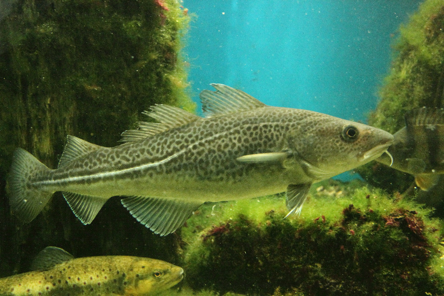
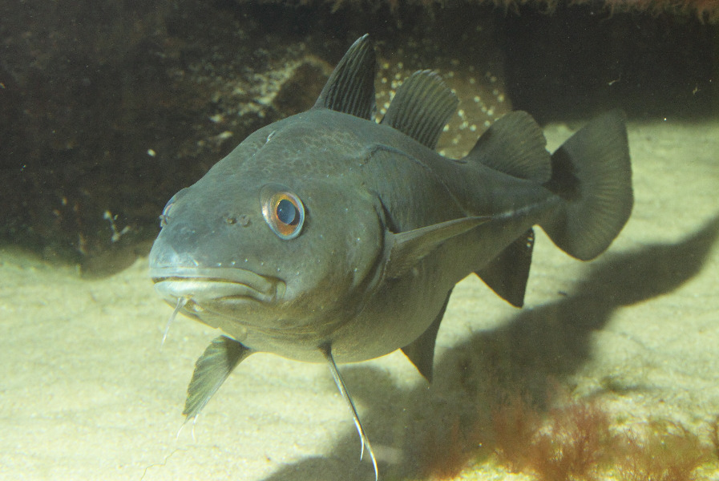
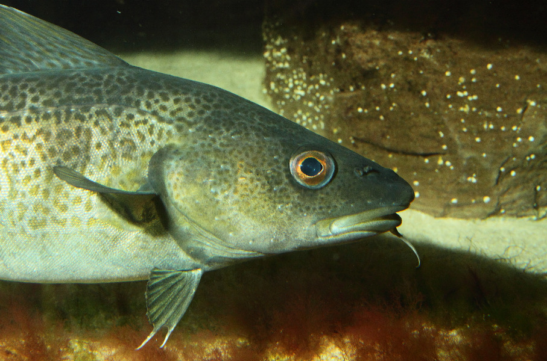

<article class="main-info">

_D-Dorsch, Kabeljau;_
_GB-Cod; DK-Torsk;_
_PL-Dorz; LT-Mence;_
_LV-Menca;_
_EST-Tursk;_
_RU-Атлантическая треска;_
_FIN-Turska;_
_S-Torsk_

### Erkennungsmerkmale

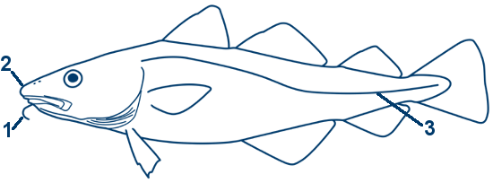

1. Lange Bartel am Kinn.
2. Maul deutlich unterständig.
3. Seitenlinie deutlich hell hervorgehoben.

* 3 Rücken- und 2 Afterflossen.
* Hellbraun, gelblich oder grünlich mit markantem dunkelbraunem Fleckenmuster.
  Meist 40 bis 70 cm, früher bis 200 cm Länge und über 95 kg Gewicht.

### Ähnliche Arten

* [Wittling](#wittling) - Bartel sehr klein oder fehlend; Seitenlinie nicht weiß.
* [Schellfisch](#schellfisch) - Bartel kleiner; Seitenlinie nicht weiß; mit markantem schwarzen Fleck über der Brustflosse.
* [Franzosendorsch](#franzosendorsch) - Schnauze nur etwa so lang wie Augendurchmesser; Seitenlinie nicht weiß.
* [Zwergdorsch](#zwergdorsch) - Schnauze nur etwa so lang wie Augendurchmesser; Seitenlinie nicht weiß.

### Lebensweise

Meist in Schwärmen bodennah in bis zu 600 m Tiefe.
Laicht im Frühjahr mit bis zu 5 Millionen Eier pro Weibchen.
Jungfische meist in flacherem Wasser.
Die Lebensweisen der verschiedenen Stämme im Atlantik, der Ostsee und Pazifik unterscheidet sich stark.
In der Ostsee stellt das Bornholmer Becken während der Sommermonate den wichtigsten Laichgrund dar.
Lebenserwartung bis 25 Jahre.

### Ernährung

Kleinere Fische, wie Heringe und Sandaale, Krabben, Garnelen, Würmer und Muscheln.

### Bedeutung

Als beliebter Speisefisch kommerziell stark genutzt; in der Ostsee einer der wichtigsten Nutzfischarten.
Früher vor allem getrocknet als "Stockfisch" und "Klippfisch" gehandelt.

### Gefährdung

Bestände rückläufig; vor allem durch Fischerei, aber auch wegen Gewässerverschmutzung und Habitatzerstörung.

</article>

<!-- class="sub-info" -->
> #### Gadus morhua
>
> __Familie:__ Gadidae
>
> __Ordnung:__ Gadiformes
>
> 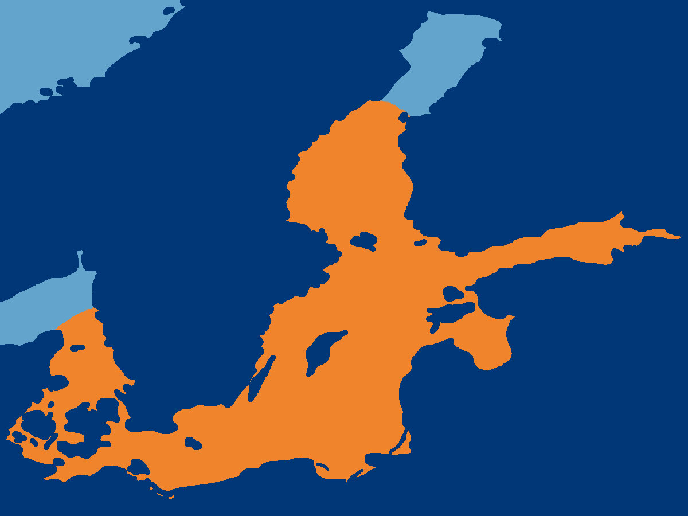
>
> __Verbreitung:__ Gesamte Ostsee, außer im nördlichen Bottnischen Meerbusen.
>
> __Häufigkeit:__ sehr häufig
>
> __Gefährdung:__ nicht gefährdet

## Seehase

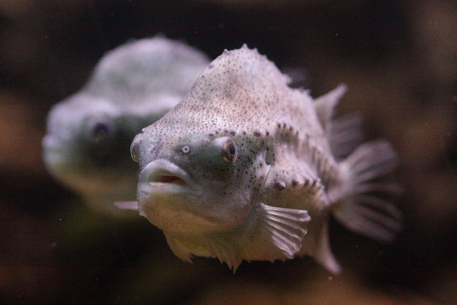
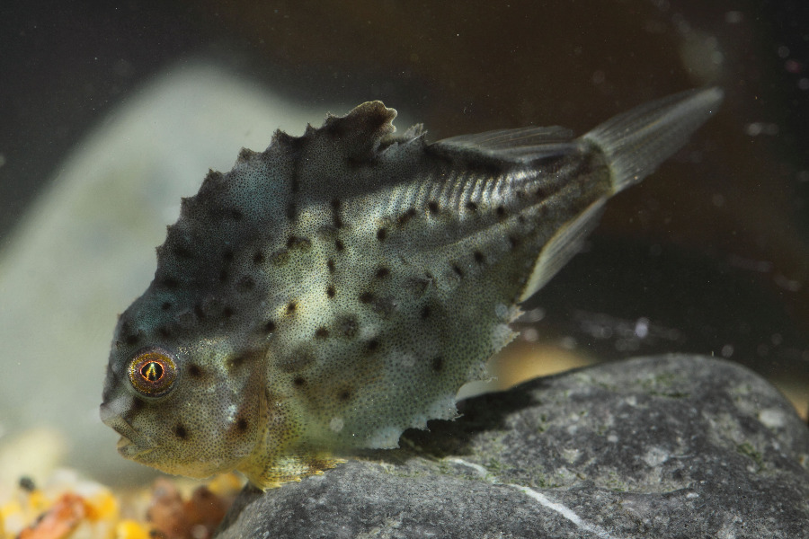
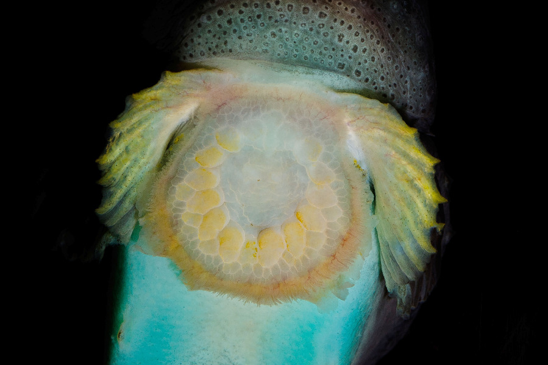
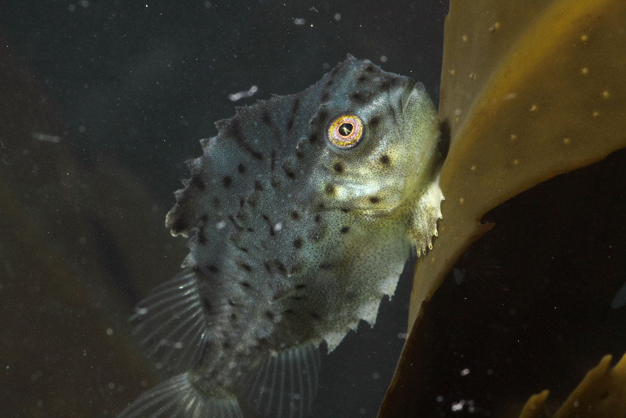

<article class="main-info">

_D-Seehase;_
_GB-Lumpsucker, Lumpfish;_
_DK-Stenbider;_
_PL-Tasza;_
_LT-Ciegorius;_
_LV-Zaķzivs;_
_EST-Merivarblane;_
_RU-Пинагор;_
_FIN-Rasvakala;_
_S-Sjurygg_

### Erkennungsmerkmale

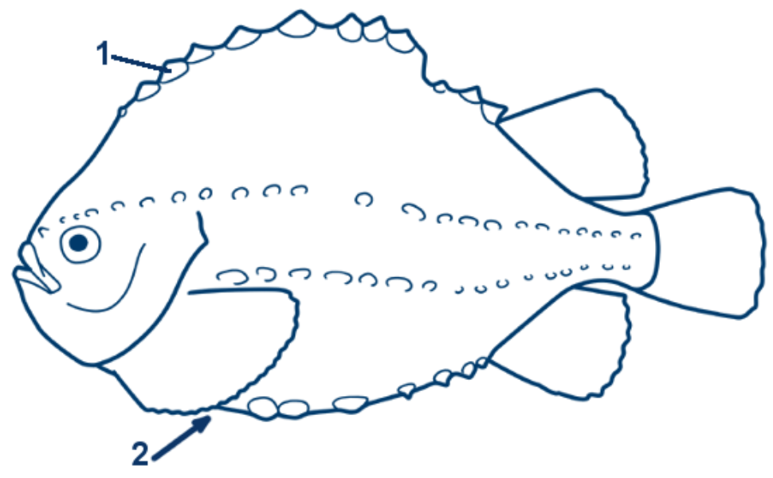

1. Reihen von Knochendornen auf Rücken und Flanken.
2. Bauchflossen sind zu einer Saugscheibe umgewandelt.

* Jungtiere mit zwei Rückenflossen; die erste wird während des Wachstums von einem Hautkamm umwachsen.
* Körper massig und hochrückig.
  Männchen meist 30 bis 40 cm, Weibchen meist über 50 cm, max. 61cm Länge; in der Ostsee meist kleiner bleibend.

### Ähnliche Arten

Unverwechselbar

### Lebensweise

Lebt auf steinigen bis felsigen Böden in 20 bis 200m, max. 400 m Tiefe, wo er sich mit seiner Saugscheibe festsaugen kann.
Laicht im Frühjahr, das Gelege von bis zu 350.000 Eiern wird vom Männchen bewacht.
Die Wintermonate verbringen sie in größeren Tiefen.

### Ernährung

Krebstiere, Rippenquallen und kleine Fische; gelegentlich pflanzliches Material.

### Bedeutung

Wirtschaftliche Bedeutung als Speisefisch; seine Eier werden als "deutscher Kaviar" gehandelt.

### Gefährdung

Vermutlich nicht gefährdet.

### Bermerkung

Meist sind Seehasen gräulich oder grünlich gefärbt, doch während der Fortpflanzungszeit werden die Männchen leuchtend rot.

</article>

<!-- class="sub-info" -->
> #### Cyclopterus lumpus
>
> __Familie:__ Cyclopteridae
>
> __Ordnung:__ Scorpaeniformes
>
> 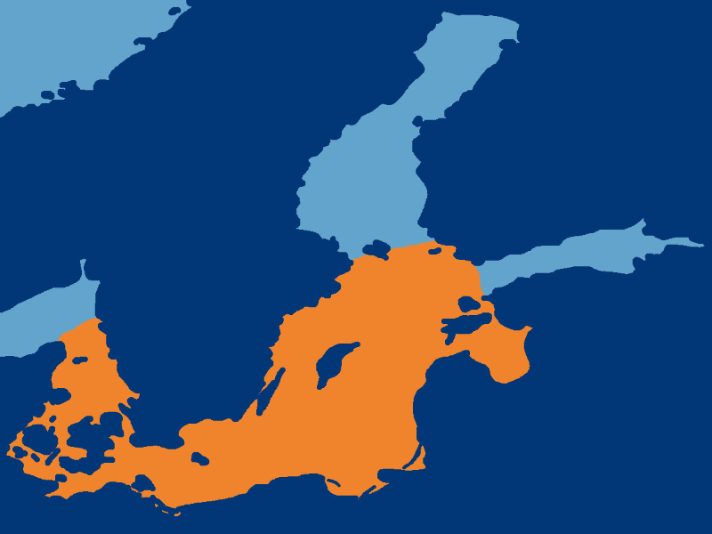
>
> __Verbreitung:__ Häufig in der gesamten Ostsee mit Ausnahme des finnischen und bottnischen Meerbusens.
>
> __Häufigkeit:__ sehr häufig
>
> __Gefährdung:__ nicht gefährdet

## Meerneunauge

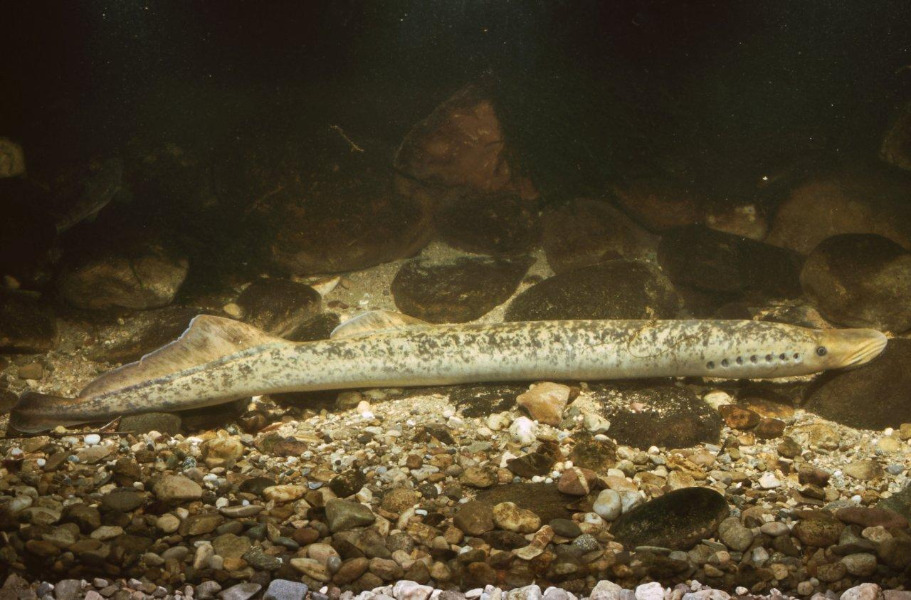
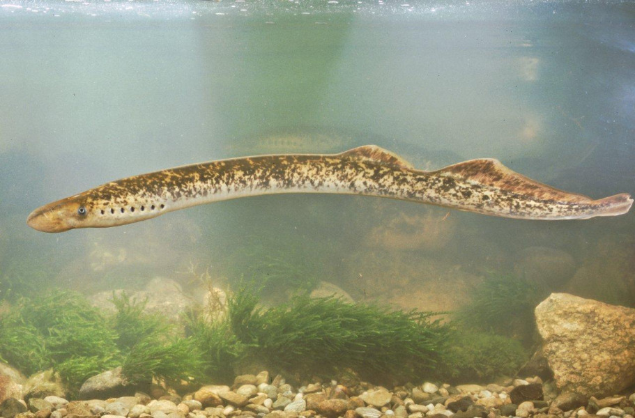
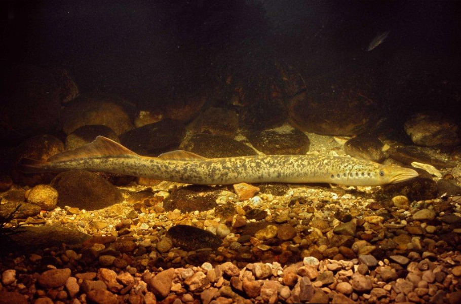
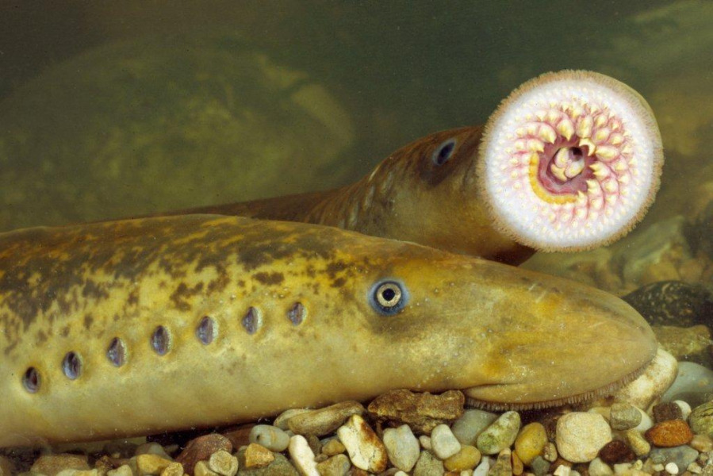

<article class="main-info">

_D-Meerneunauge;_
_GB-Sea lamprey, great sea lamprey, green sea lamprey;_
_DK-Havlempret;_
_PL-Minóg morski;_
_LT-Upinė nėgė;_
_LV-Jūras nēģis;_
_EST-Merisutt;_
_RU-Минога морская;_
_FIN-Merinahkiainen;_
_S-Havsnejonöga_

### Erkennungsmerkmale

1. Mundscheibe mit zahlreichen kleinen Hornzähne.

* 7 Kiemenöffnungen (pro Seite) und eine einzelne Nasenöffnung.
* Keine paarigen Flossen.
* Körper meist deutlich marmoriert.

Meist 70 bis 90 cm, selten bis 120 cm; etwa 5 cm im Durchmesser.

### Ähnliche Arten

* [Flussneunauge](#flussneunauge) - drei Paar große Hornzähne beiderseits der Maulöffnung; Körper einheitlich gefärbt; nur etwa daumendick.
* [Aal](#aal) - paarige Brustflossen; Kiemendeckel und nur eine äußere Kiemenöffnung.
* [Conger](#conger) - paarige Brustflossen; Kiemendeckel und nur eine äußere Kiemenöffnung.

### Lebensweise

Die laichreifen Erwachsenen wandern flussaufwärts.
Sie pflanzen sich nur einmal im Leben fort.
Die Larven, die sogenannten Querder, leben drei bis fünf Jahre in Sand- oder Schlammgrund eingegraben und ernähren sich filtrierend von Kleinstpartikeln.
Nach der Umwandlung zum Erwachsenen wandern sie zurück ins Meer und leben dort bis zur Geschlechtsreife etwa drei bis vier Jahre lang.

### Ernährung

Saugt sich mit der Mundscheibe an Fische an, um sich von deren Blut und kleingeraspelten Gewebe zu ernähren.
Kleinere Fische werden teilweise auch komplett gefressen.

### Bedeutung

Geschätzter Speisefisch; wegen seiner geringen Bestände jedoch kaum wirtschaftlich nutzbar.

### Gefährdung

Gefährdet durch Flussverbauung (z.B. Wasserkraftwerke) und Gewässerverschmutzung.

</article>

<!-- class="sub-info" -->
> #### Petromyzon marinus
>
> __Familie:__ Petromyzontidae
>
> __Ordnung:__ Petromyzontiformes
>
> 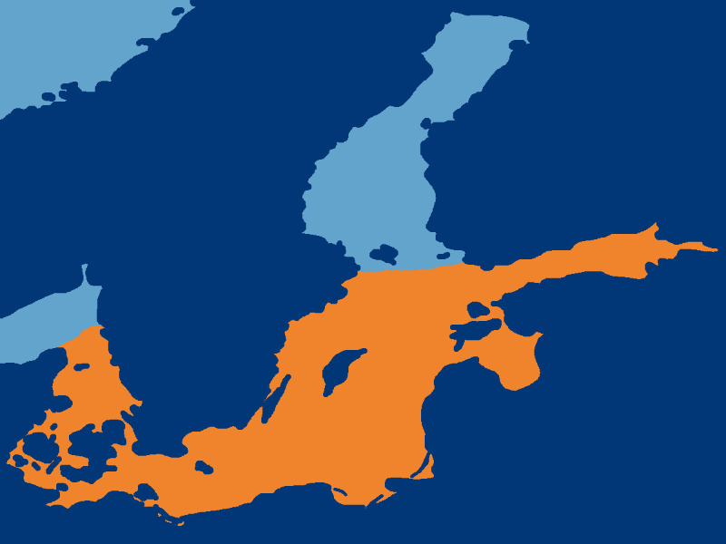
>
> __Verbreitung:__ Ostsee, mit Ausnahme des bottnischen Meerbusens
>
> __Häufigkeit:__ regelmäßig
>
> __Gefährdung:__ gefährdet

## Blauhai

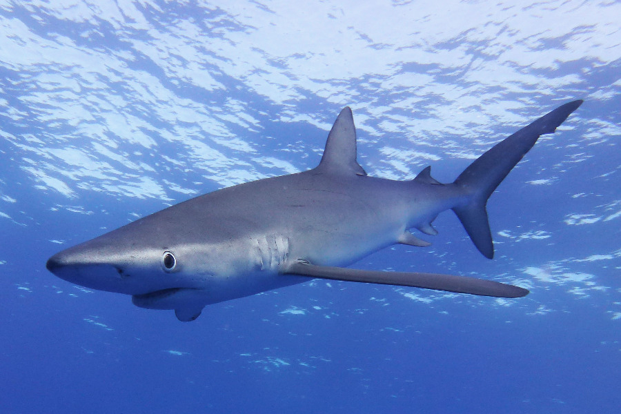
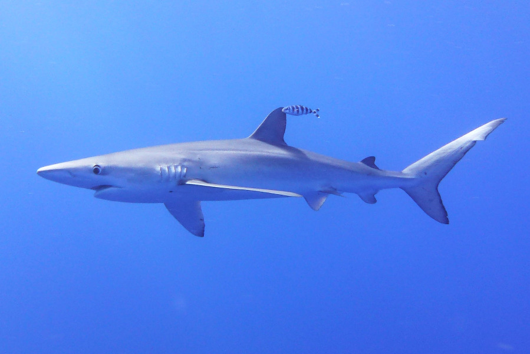
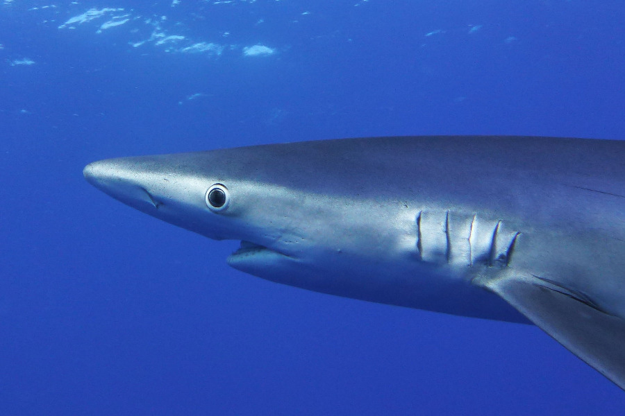

<article class="main-info">

_D-Blauhai;_
_GB-Blue shark, blue pointer;_
_DK-Blåhaj;_
_PL-Zarlacz blekitny;_
_LT-Melsvasis ryklys;_
_EST-Sinihai;_
_RU-Синяя акула;_
_FIN-Sinihai;_
_S-Blåhaj_

### Erkennungsmerkmale

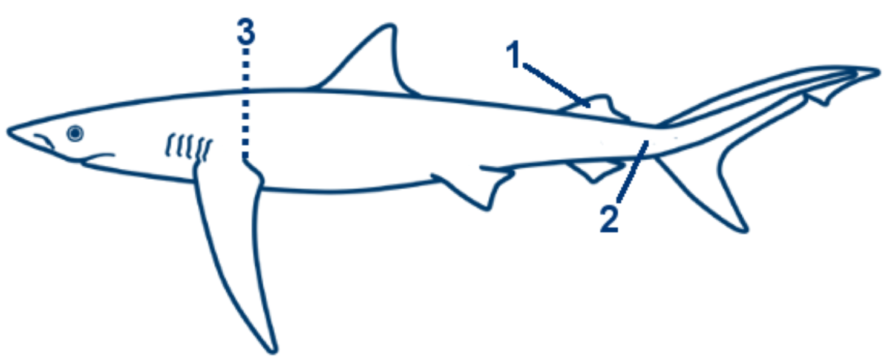

1. Zweite Rückenflosse sehr viel kleiner als die erste.
2. Schwanzstiel ohne seitlichen Kiel.
3. Brustflosse endet deutlich vor der Rückenflosse.

* 5 Kiemenspalten, schlanker Körper.
* Rücken leuchtend blau (nach dem Tod zu grau erblassend), Bauch weiß.
  Meist unter 3 m, max. 3,8 m Länge

### Ähnliche Arten

* [Heringshai](#heringshai) - Körper deutlich massiger; Brustflosse endet unter dem Beginn der Rückenflosse, mit stark ausgebildetem seitlichen Schwanzkiel.
* [Gemeiner Dornhai](#gemeiner-dornhai) - mit Dornen an den Rückenflossen; ohne Afterflosse.

### Lebensweise

Lebt oberflächennah im offenen Meer und ist hauptsächlich nachtaktiv.
Nach einer Tragzeit von 9 bis 12 Monaten schwankt die Zahl der lebend geborenen Jungen sehr stark, zwischen 4 und 135 Stück.

### Ernährung

Vor allem Schwarmfisch wie Hering und Makrele, aber auch Kalmare, andere Wirbellose und gelegentlich kleinere Haie.

### Bedeutung

Beliebte Zielart von Sportanglern.
Als Speisefisch von geringer Bedeutung, jedoch häufig zur Gewinnung von Haiflossen gefangen.

### Gefährdung

Stark befischte Haiart; außerdem sehr häufiger Beifang von Langleinenfischerei, Schlepp- und Kiemennetzen.

</article>

<!-- class="sub-info" -->
> #### Prionace glauca
>
> __Familie:__ Carcharhinidae
>
> __Ordnung:__ Carchariniformes
>
> 
>
> __Verbreitung:__ Irrgast in der westlichen Ostsee
>
> __Häufigkeit:__ sehr selten
>
> __Gefährdung:__ nicht gefährdet

## Flussneunauge

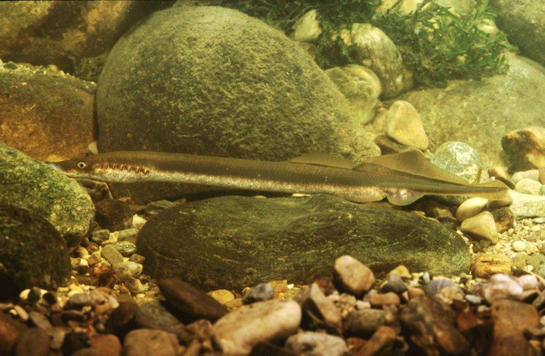
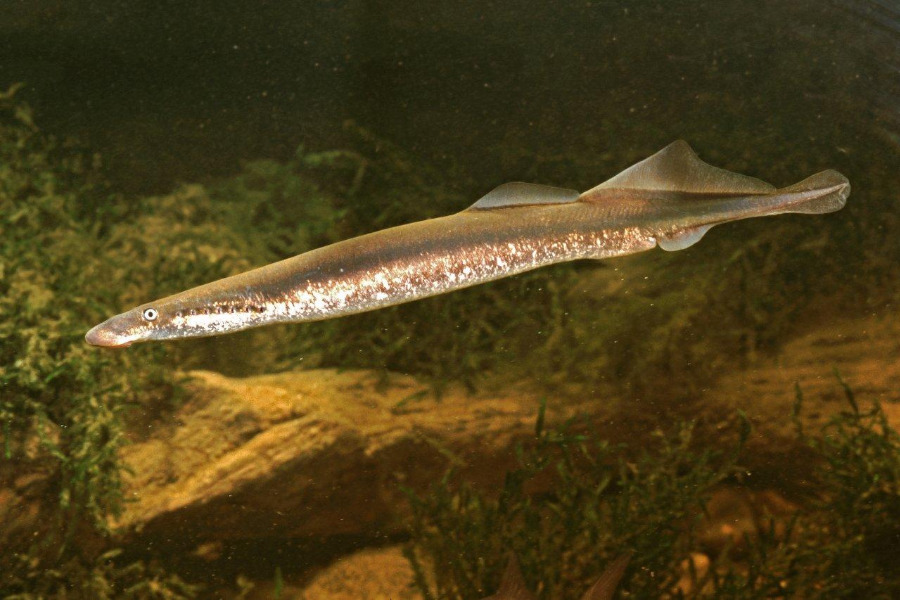
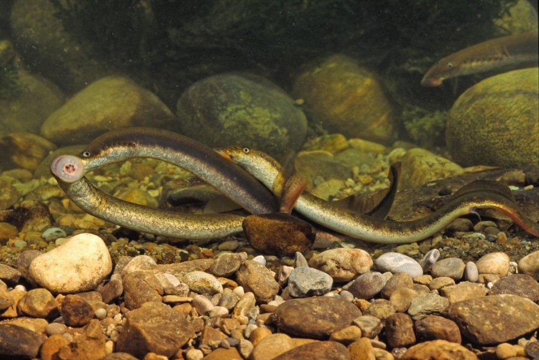

<article class="main-info">

_D-Flussneunauge;_
_GB-River lamprey;_
_DK-Almindelig flodlampret;_
_PL-Minóg rzeczny;_
_LT-Upinė nėgė;_
_LV-Upes nēģis;_
_EST-Jõesilm;_
_RU-Речная минога;_
_FIN-Nahkiainen;_
_S-Flodnejonöga_

### Erkennungsmerkmale

1. Beiderseits der Mundöffnung drei große Hornzähne.

* Sieben Kiemenöffnungen (pro Seite) und eine einzelne Nasenöffnung.
* Keine paarigen Flossen.
* Körper ohne Musterung; bläulicher bis bräunlicher Rücken scharf vom hellen Bauch abgegrenzt.

Meist 30 bis 40 cm, selten bis 50 cm Länge; etwa daumendick.

### Ähnliche Arten

* [Meerneunauge](#meerneunauge) - sehr viele kleine Hornzähne auf der Mundscheibe; Körper meist marmoriert;
  deutlich größer und dicker werdend.
* [Aal](#aal) - paarige Brustflossen; Kiemendeckel und nur eine äußere Kiemenöffnung.
* [Conger](#conger) - paarige Brustflossen; Kiemendeckel und nur eine äußere Kiemenöffnung.

### Lebensweise

Die laichreifen Erwachsenen wandern flussaufwärts.
Sie pflanzen sich nur einmal im Leben fort.
Die Larven, die sogenannten Querder, leben bis zu vier Jahre in Sand- oder Schlammgrund eingegraben und ernähren sich filtrierend von Kleinstpartikeln.
Nach der Umwandlung zum Erwachsenen leben sie bis zur Geschlechtsreife etwa zwei Jahre im küstennahen Meer.

### Ernährung

Saugt sich mit der Mundscheibe an Fische an, um sich von deren Blut und kleingeraspeltem Gewebe zu ernähren.

### Bedeutung

Nur in wenigen Regionen von wirtschaftlicher Bedeutung, z.B. in Lettland.

### Gefährdung

Laichwanderungen werden durch Flussverbauungen (z.B. Wasserkraftwerke) stark behindert.
Durch ihre Langlebigkeit sind die Larven sehr empfindlich gegenüber Wasserverschmutzung.

</article>

<!-- class="sub-info" -->
> #### Lampetra fluviatilis
>
> __Familie:__ Petromyzontidae
>
> __Ordnung:__ Petromyzontiformes
>
> 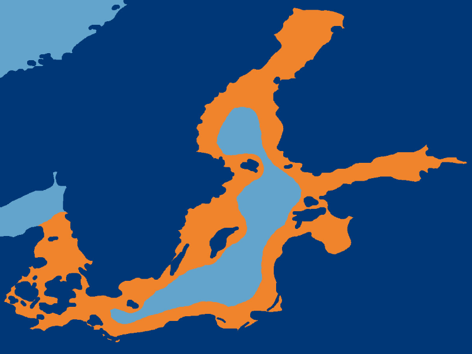
>
> __Verbreitung:__ in der gesamten Ostsee, vor allem küstennah
>
> __Häufigkeit:__ regelmäßig
>
> __Gefährdung:__ gefährdet

## Heringshai

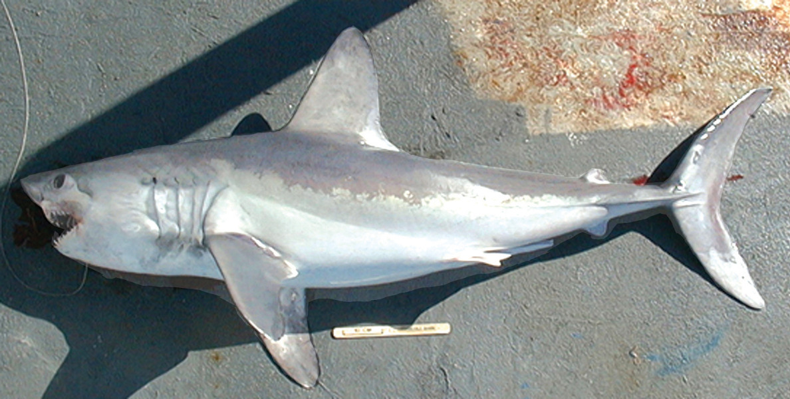

<article class="main-info">

_D-Heringshai;_
_GB-Porbeagle;_
_DK-Sildehaj;_
_PL-Lamna śledziowa;_
_EST-Harilik heeringahai;_
_RU-Атлантическая сельдевая акула;_
_FIN-Sillihai;_
_S-Håbrand_

### Erkennungsmerkmale

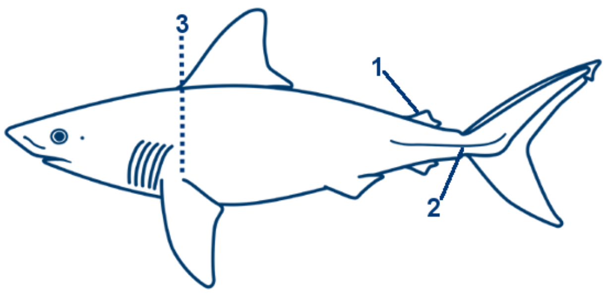

1. Zweite Rückenflosse sehr viel kleiner als die erste.
2. Schwanzstiel mit starkem seitlichen Kiel.
3. Brustflosse endet direkt unter der Rückenflosse.

* 5 Kiemenspalten, massiger Körper.
* Rücken dunkel- bis blau-grau, Bauch weiß.

Meist 2,2 bis 2,6 m, max. 3,7 m Länge und 200 kg Gewicht.

### Ähnliche Arten

* [Blauhai](#blauhai) - viel schlanker; Brustflosse endet deutlich vor dem Beginn der Rückenflosse; ohne Schwanzkiel.
* [Gemeiner Dornhai](#gemeiner-dornhai) - mit Dornen an den Rückenflossen; ohne Schwanzkiel; ohne Afterflosse.

### Lebensweise

Lebt oberflächennah im offenen Meer, gelegentlich auch bis in 700 m Tiefe.
Nach einer Tragzeit von 8 Monaten werden 1 bis 5 Junge mit bis zu 60 cm Länge geboren.
Die Jungen ernähren sich im Mutterleib von unbefruchteten Eiern.

### Ernährung

Vor allem Schwarmfische, wie Heringe und Makrelen, zuweilen aber auch Dornhaie, Dorsche und Plattfische.
Jagt gelegentlich in Gruppen.

### Bedeutung

Beliebter Speisefisch mit hoher wirtschaftlicher Bedeutung.

### Gefährdung

Durch seine langsame Reproduktionsrate und ungeregelte Fangraten gefährdet.
Häufiger Beifang bei Netz- und Langleinenfischerei.

</article>

<!-- class="sub-info" -->
> #### Lamna nasus
>
> __Familie:__ Lamnidae
>
> __Ordnung:__ Lamniformes
>
> 
>
> __Verbreitung:__ sehr selten in der westlichen Ostsee, als Irrgast bis in die zentrale Ostsee
>
> __Häufigkeit:__ sehr selten
>
> __Gefährdung:__ nicht gefährdet

## Fuchshai

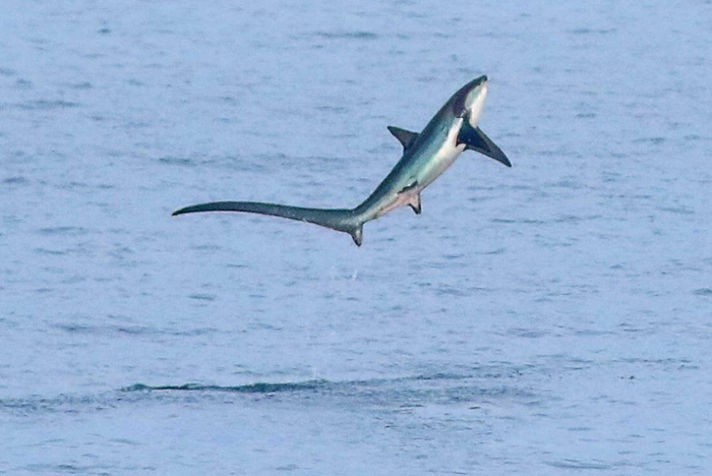
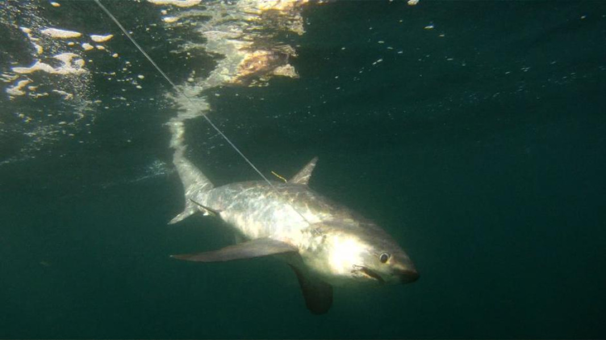

<article class="main-info">

_D-Fuchshai, Drescherhai;_
_GB-Tresher shark, common tresher;_
_DK-Rævehaj;_
_PL-Kosogon;_
_EST-Harilik rebashai;_
_RU-Обыкновенная морская лисица;_
_FIN-Kettuhai;_
_S-Rävhaj_

### Erkennungsmerkmale

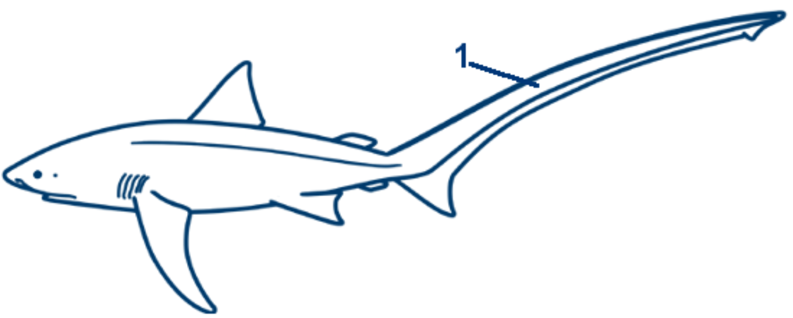

1. Oberer Schwanzlappen erreicht etwa die Länge des restlichen Körpers. 

* Rückenfärbung variabel bläulich, gräulich, bräunlich bis schwärzlich; Bauch hell.

Männchen meist bis 4 m, Weibchen meist bis 5,5 m, max. 6 m Länge.

### Ähnliche Arten

### Lebensweise

Lebt oberflächennah in offen Meer und ist tagaktiv; Jungtiere sind häufiger in Küstennähe.
Nach 9 bis 12 Monaten Tragzeit werden 2 bis 4 Jungen lebend geboren.
Gilt als menschenscheu.

### Ernährung

Hauptsächlich von kleineren Schwarmfischen wie Makrelen und Heringen, jedoch auch Kalmaren und Krebstieren.

### Bedeutung

Hoher wirtschaftlicher Nutzen der Flossen und als Speisefisch.

### Gefährdung

Durch steigende wirtschaftliche Nutzung als weltweit gefährdet eingeschätzt.

</article>

<!-- class="sub-info" -->
> #### Alopias vulpinus
>
> __Familie:__ Alopiidae
>
> __Ordnung:__ Lamniformes
>
> 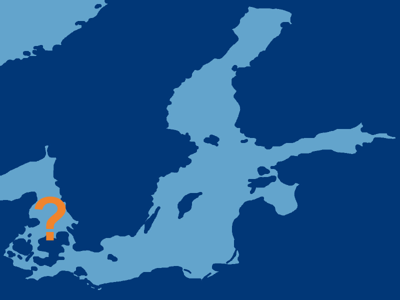
>
> __Verbreitung:__ Sehr selten im Kattegat.
>
> __Häufigkeit:__ sehr selten
>
> __Gefährdung:__ gefährdet

## Glattrochen

<article class="main-info">

_D-Glattrochen;_
_GB-Common skate, blue skate;_
_DK-Skade;_
_PL-Płaszczka naga, raja gładka;_
_EST-Sile tiibrai;_
_RU-Гладкий скат;_
_FIN-Silorausku;_
_S-Slätrocka_

### Erkennungsmerkmale

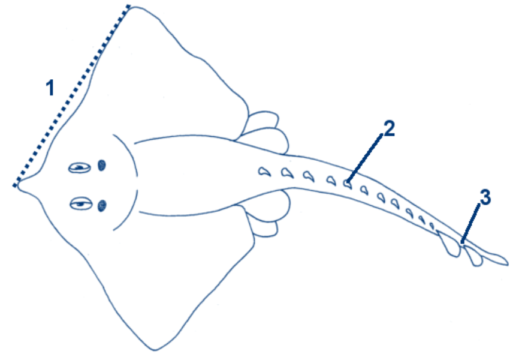

1. Schnauze spitz (der vordere Körperrand berührt eine Linie von den Flügelspitzen zur Schnauze nicht).
2. nur eine Reihe Dornen auf dem Schwanzrücken (nicht auf dem Körperrücken; Jungtiere ohne Dornen).
3. auch zwischen den beiden Rückenflossen stehen Dornen.

* Oberseite variabel gefärbt, bräunlich mit hellen Flecken; Unterseite hellgrau.

Meist 100 cm, bis max. 150 cm Länge.

### Ähnliche Arten

* [Chagrinrochen](#chagrinrochen) - eine Reihe Dornen auf dem Nacken und zwei parallele Dornenreihen auf dem Schwanz.
* [Nagelrochen](#nagelrochen) - Schnauze stumpf; eine kräftige Dornenreihe auf Rücken und Schwanz.
* [Sternrochen](#sternrochen) - Schnauze stumpf; eine kräftige Dornenreihe auf Rücken und Schwanz.

### Lebensweise

Bodenbewohner auf Sand- und Weichböden meist bis 200 m tiefe.
Langsam wachsend, erreichen der Geschlechtsreife erst nach 11 Jahren.
Jungtiere schlüpfen nach 5 bis 10 Monaten aus Eiern.

### Ernährung

Als Jungtiere vorwiegend von bodenbewohnenden Weichtieren, als ausgewachsene Tiere hauptsächlich von Fischen.

### Bedeutung

Wirtschaftlich wichtigste Rochenart als Speisefisch in Nordwesteuropa.
In Deutschland unter dem Namen "Seeforelle" vermarktet.

### Gefährdung

Durch starke wirtschaftliche Nutzung und sehr langsamer Reproduktionsrate selten geworden.

</article>

<!-- class="sub-info" -->
> #### Dipturus batis
>
> __Familie:__ Rajidae
>
> __Ordnung:__ Rajiformes
>
> 
>
> __Verbreitung:__ Kattegat; sehr selten in der westlicher Ostsee.
>
> __Häufigkeit:__ selten
>
> __Gefährdung:__ unklar

## Atlantischer Stör

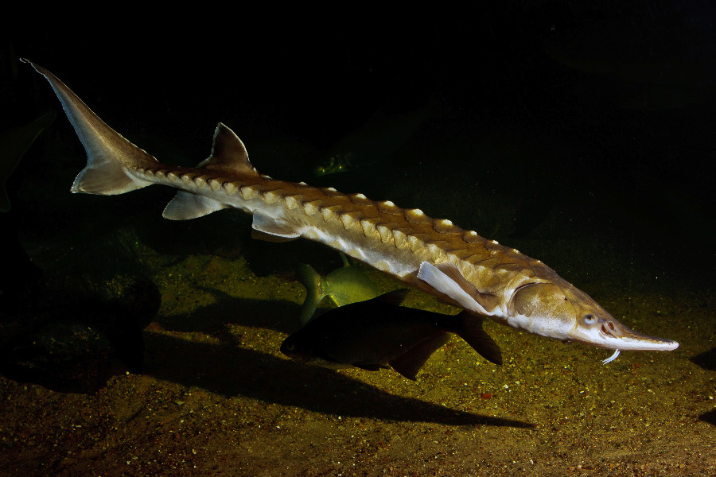
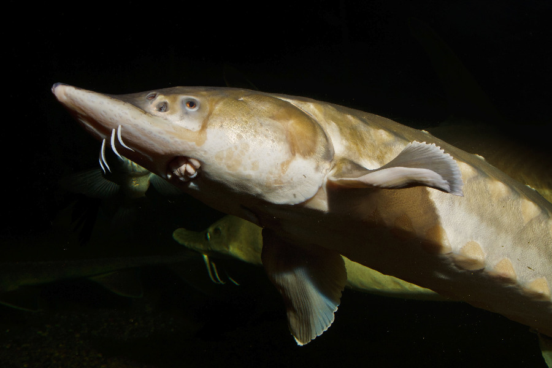
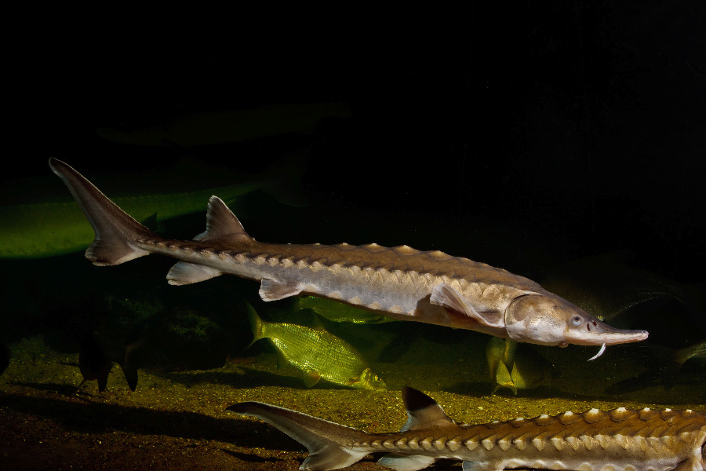
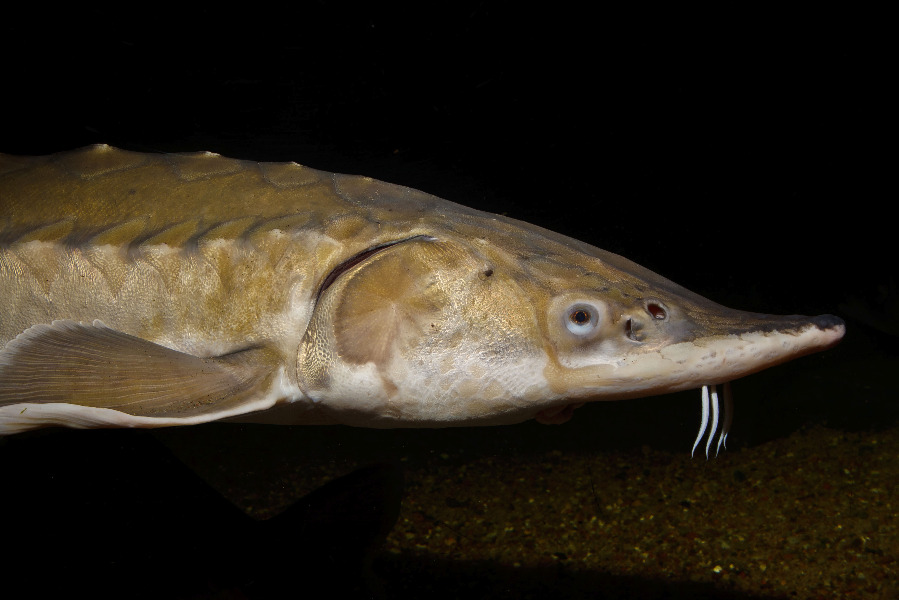

<article class="main-info">

_D-Atlantischer Stör;_
_GB-Atlantic sturgeon;_
_DK-Vestatlantisk stør;_
_PL-Jesiotr ostronosy;_
_LT-Aštriašnipis eršketas;_
_EST-Atlandi tuur;_
_RU-Американский атлантический осётр;_
_FIN-Sinisampi;_
_S-Atlantisk stör_

### Erkennungsmerkmale

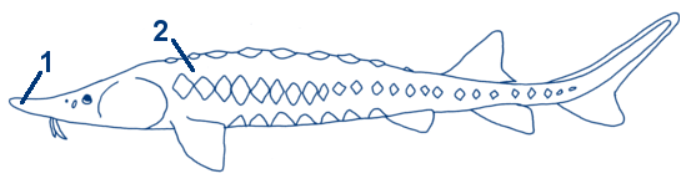

1. Schnauze eher lang (Strecke von der Schnauzenspitze bis zum Auge etwa gleich lang wie vom Auge bis zum Ende des Kiemendeckels).
2. zahlreiche Hautverknöcherungen (Dentikel) an der Flanke zwischen den Rücken- und Seitenschildern.

* Vier nicht-gefiederte Barteln an der Schnauzenunterseite.

Meistens 2 bis 3 m, bis max. 4,3 m Länge.

### Ähnliche Arten

* [Sibirischer Stör](#sibirischer-stör) - keine Dentikel zwischen Rücken- und Seitenschildern.
* [Waxdick](#waxdick) - Schnauze kurz.
* [Sterlet](#sterlet) - Barteln gefiedert.

### Lebensweise

Erwachsene Tiere wandern zum Laichen vom Meer flussaufwärts.
Je Saison können 800.000 bis 2.400.000 Eier über steinigem Grund abgegeben werden.
Nach 1 bis 3 Jahren wandern die Jungstöre ins Meer.
Erst nach 8 bis 30 Jahren erreichen sie die Geschlechtsreife.

### Ernährung

Weichtiere, Krebstiere, Würmer, Sandaale und Mückenlarven.

### Bedeutung

Bis Ende des 19. Jahrhunderts stark wirtschaftlich als Speisefisch und wegen des Kaviars genutzt.

### Gefährdung

Durch Flüssverschmutzung und -verbauung, Überfischung und sehr langsame Reproduktionsrate als weltweit stark gefährdet eingestuft.
In der Ostsee ausgestorben.

### Bermerkung

Für die Aquakultur wurden Stör-Hybriden (Kreuzungen von verschiedenen Arten) gezüchtet, die auch als Gefangenschaftsflüchtlinge vereinzelt in der Ostsee vorkommen.
Oft kann nur der Fachmann diese Hybriden erkennen und bestimmen.
Aktuell gibt es Wiederansiedlungsprojekte in Deutschland.

</article>

<!-- class="sub-info" -->
> #### Acipenser oxyrinchus
>
> __Familie:__ Acipenseridae
>
> __Ordnung:__ Acipenseriformes
>
> 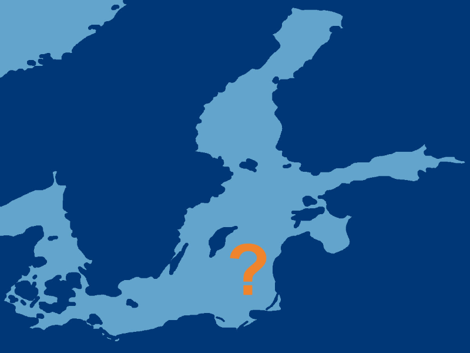
>
> __Verbreitung:__ Ehemals gesamte küstennahe Ostsee, seit den 1980er Jahren hier ausgestorben; Einzelnachweis 1996 bei der Insel Saareema / Estland.
>
> __Häufigkeit:__ sehr selten
>
> __Gefährdung:__ gefährdet

## Aal

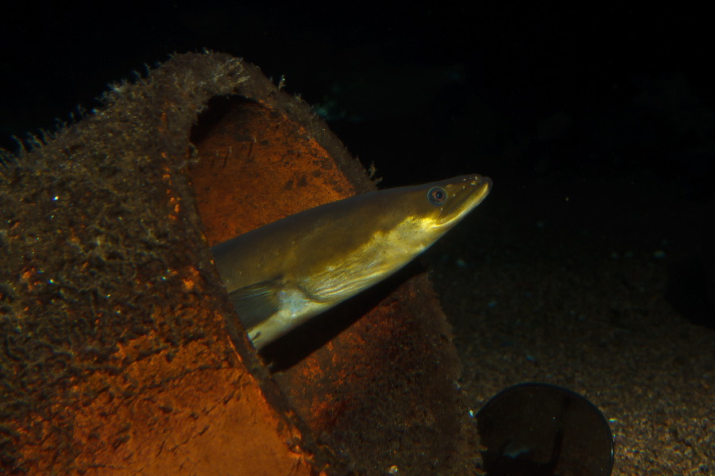
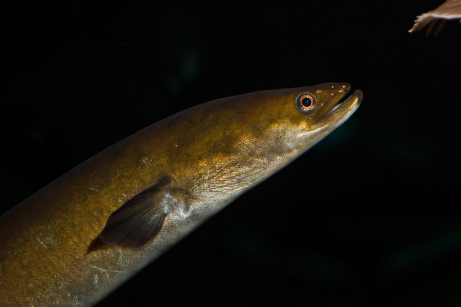
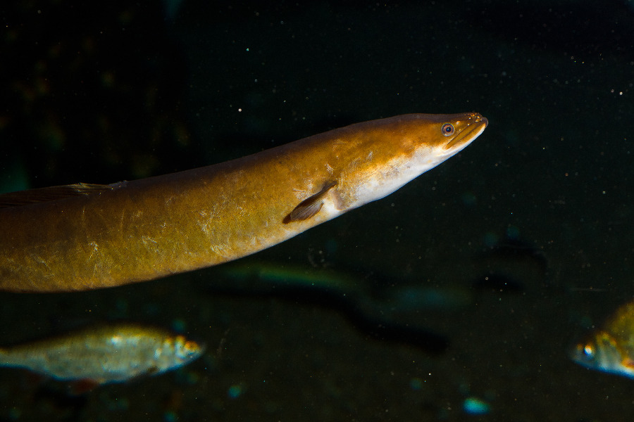

<article class="main-info">

_D-Aal, Flussaal, Gelbaal, Blankaal;_
_GB-Eel, common eel, european eel;_
_DK-Ål;_
_PL-Węgorz europejski;_
_LT-Ungurys;_
_LV-Zutis;_
_EST-Angerjas;_
_RU-Речной угорь;_
_FIN-Ankerias;_
_S-Europeisk ål_

### Erkennungsmerkmale

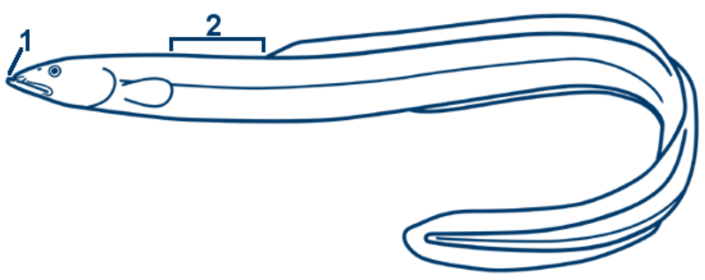

1. Maul oberständig (der Unterkiefer überragt den Oberkiefer).
2. die Rückenflosse beginnt weit hinter dem Ende der Brustflosse.

* Kopfform variabel: zugespitzt oder breit; Färbung von hellgrau, bis dunkelgrau und gelb, Bauch heller.

Meist 30 bis 50 cm, max. bis 130 cm Länge.

### Ähnliche Arten

* [Conger](#conger) - Maul unterständig; Rückenflosse beginnt etwa da wo die Brustflosse endet.
* [Meerneunauge](#meerneunauge) - sieben äußere Kiemenöffnungen, keine Brustflossen.
* [Flussneunauge](#flussneunauge) - sieben äußere Kiemenöffnungen, keine Brustflossen.

### Lebensweise

Die laichreifen Erwachsenen wandern flussabwärts ins Meer und ziehen in die über 5.000 km entfernte Sargassosee.
Sie pflanzen sich nur einmal im Leben fort und sterben danach.
Die Larven driften mit dem Golfstrom nach Europa; die Jungaale wandern in die Flüsse und deren Mündungsbereiche und wachsen dort heran.

### Ernährung

Alle Arten von bodenlebenden Organismen, Fischlaich, Fische und Aas.

### Bedeutung

Hohe wirtschaftliche Bedeutung als Speisefisch.

### Gefährdung

Durch wirtschaftliche Nutzung, sehr langsame Reproduktionsraten und Flussverbauungen, die die Laichwanderungen stark behindern, ist der Flussaal stark gefährdet.
Der Aal kann nicht in Gefangenschaft nachgezogen werden.

</article>

<!-- class="sub-info" -->
> #### Anguilla anguillla
>
> __Familie:__ Anguillidae
>
> __Ordnung:__ Anguilliformes
>
> 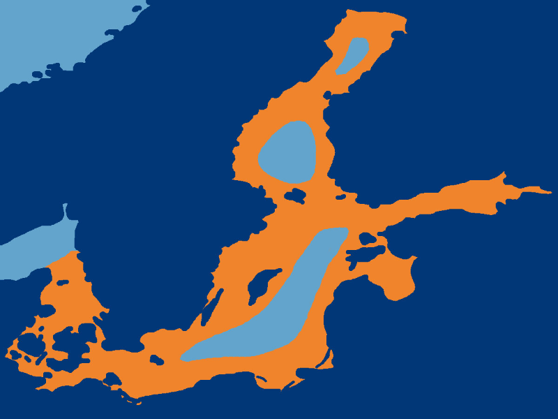
>
> __Verbreitung:__ gesamte Ostsee mit Ausnahme der zentralen Bereiche
>
> __Häufigkeit:__ regelmäßig
>
> __Gefährdung:__ gefährdet

## Conger

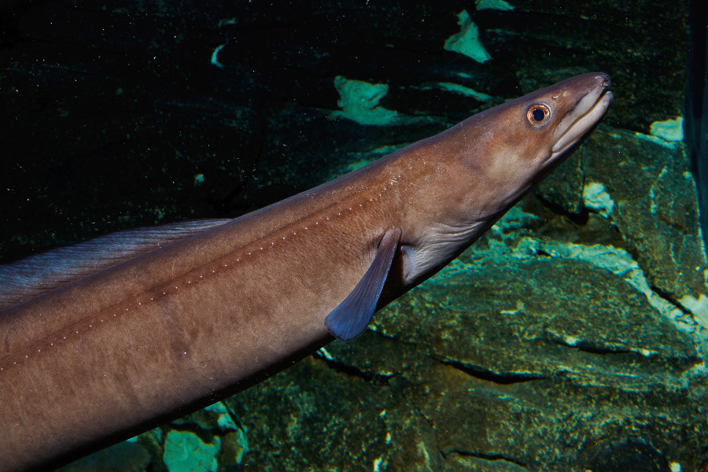
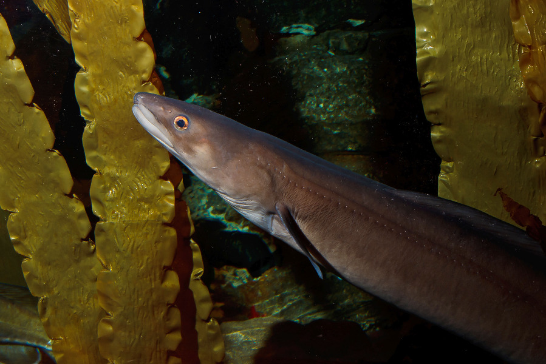
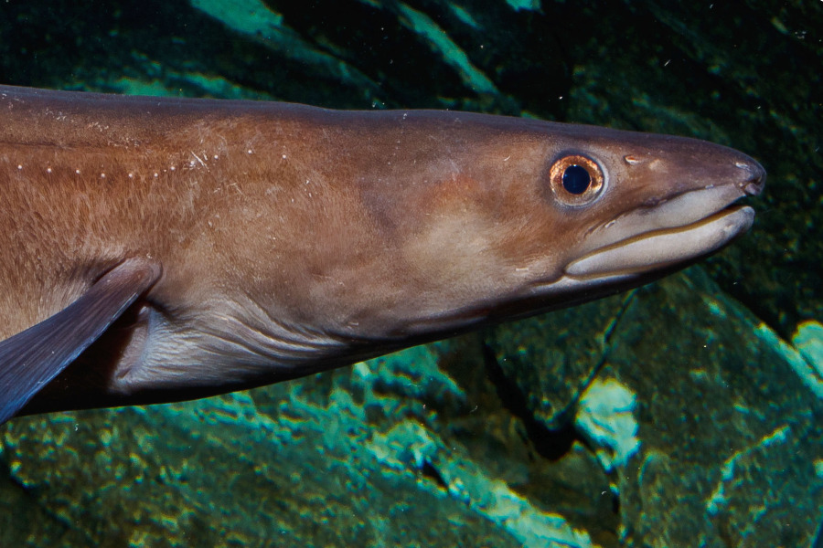

<article class="main-info">

_D-Conger, Meeraal;_
_GB-Conger, european conger;_
_DK-Conger;_
_PL-Conger;_
_EST-Harilik meriangerjas;_
_RU-Конгеры;_
_FIN-Meriankerias;_
_S-Havsål, conger_

### Erkennungsmerkmale

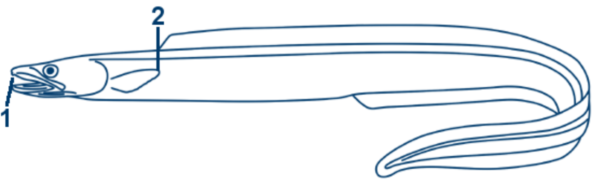

1. Maul unterständig (der Oberkiefer überragt den Unterkiefer).
2. Rückenflosse beginnt etwa am Ende der Brustflosse.

Meist 1 bis 1,5 m, bis max. 3 m Länge.

### Ähnliche Arten

* [Aal](#aal) - Maul oberständig; Rückenflosse beginnt weit hinter dem Ende der Brustflosse.
* [Meerneunauge](#meerneunauge) - sieben äußere Kiemenöffnungen, keine Brustflossen.
* [Flussneunauge](#flussneunauge) - sieben äußere Kiemenöffnungen, keine Brustflossen.

### Lebensweise

Erreichen der Geschlechtsreife mit 5 bis 15 Jahren.
Die Elterntiere sterben nach dem Laichen im offenen Meer.
Nach dem Schlüpfen 1 bis 2 jähriges Larvenstadium im Freiwasser.
Ab einer Länge von 15 cm deutliche Aalgestalt.

### Ernährung

Fische, Krebse und Tintenfische.

### Bedeutung

Kommerzielle Nutzung als Speisefisch.

### Gefährdung

Vermutlich nicht gefährdet.

</article>

<!-- class="sub-info" -->
> #### Conger conger
>
> __Familie:__ Congridae
>
> __Ordnung:__ Anguilliformes
>
> 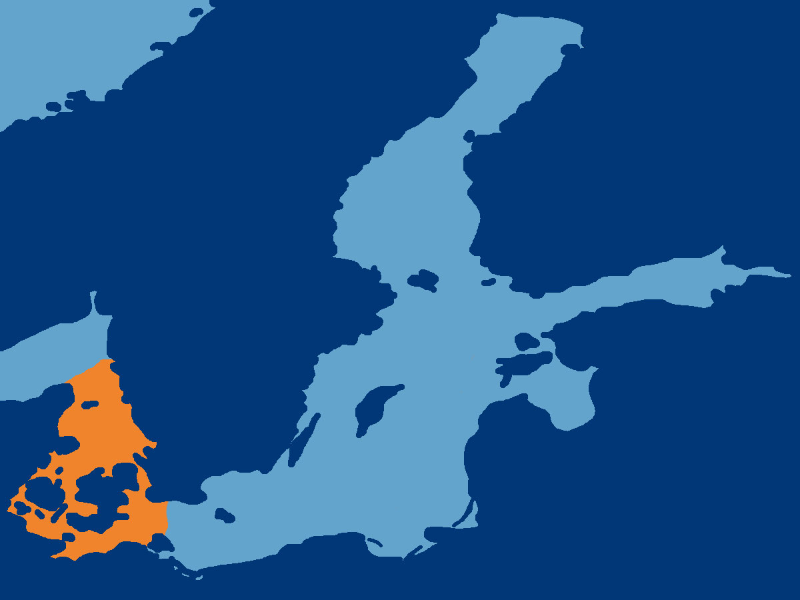
>
> __Verbreitung:__ westliche Ostsee
>
> __Häufigkeit:__ selten
>
> __Gefährdung:__ unklar

## Gründling

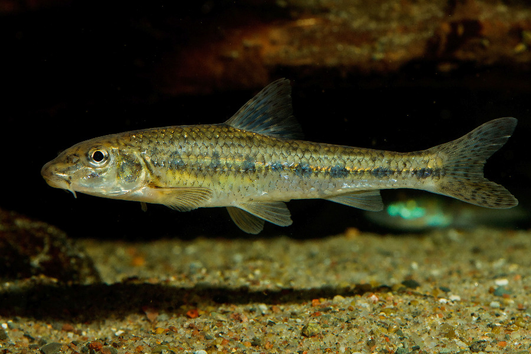
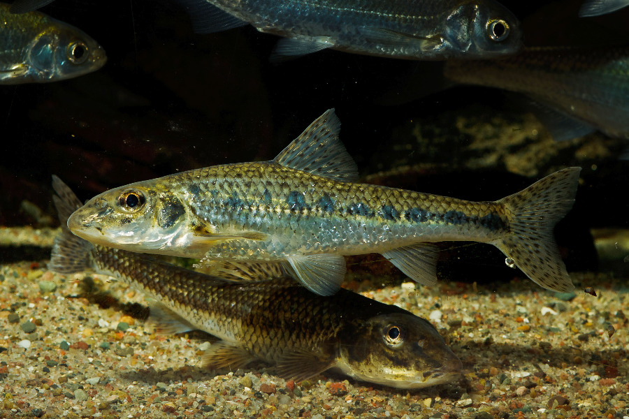
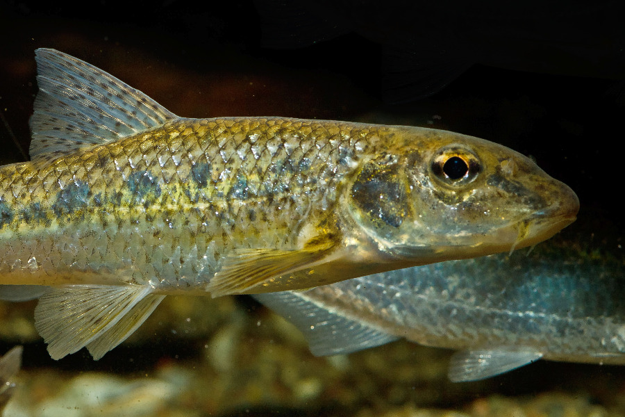

<article class="main-info">

_D-Gründling;_
_GB-Gudgeon;_
_DK-Grundling;_
_PL-Kiełb;_
_LT-Gružlys;_
_LV-Grundulis;_
_EST-Rünt;_
_RU-Обыкновенный пескарь;_
_FIN-Törö;_
_S-Sandkrypare_

### Erkennungsmerkmale

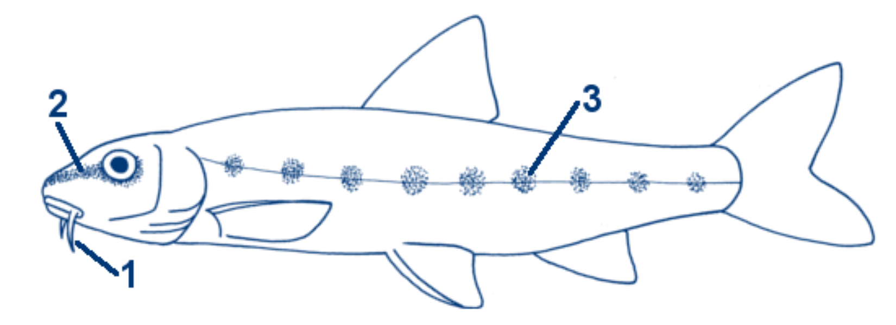

1. 1 Paar lange Barteln am Hinterende des Oberkiefers.
2. Dunkler Streifen vor dem Auge zum Oberkiefer.
3. Große dunkle Flecken entlang der Seitenlinie.

* Körper sehr schlank und leicht seitlich zusammengedrückt im Querschnitt.
* Bräunliche Grundfärbung mit zahlreichen dunklen Flecken auf dem Rücken und an der Flanke; Rücken- und Schwanzflosse mit dunkler Musterung.

Meist 8 bis 15 cm, max. 20 cm Länge.

### Ähnliche Arten

* [Barbe](#barbe) - zwei Paar Barteln am Oberkiefer; längster Rückenflossenstrahl stachelartig und am Hinterrand gesägt; ohne Streifen vor dem Auge; deutlich größer werdend.

### Lebensweise

Lebt tagaktiv sehr bodenorientiert, meist in Schwärmen bevorzugt in klaren, fließenden Gewässern.
Laicht im Sommer an sandigen Uferbereichen.

### Ernährung

Kleine Bodentiere und Algen.

### Bedeutung

Trotz geringer Größe ein Speisefisch.
Häufig als Köderfisch verwendet.

### Gefährdung

Nicht gefährdet.

</article>

<!-- class="sub-info" -->
> #### Gobio gobio
>
> __Familie:__ Cyprinidae
>
> __Ordnung:__ Cypriniformes
>
> 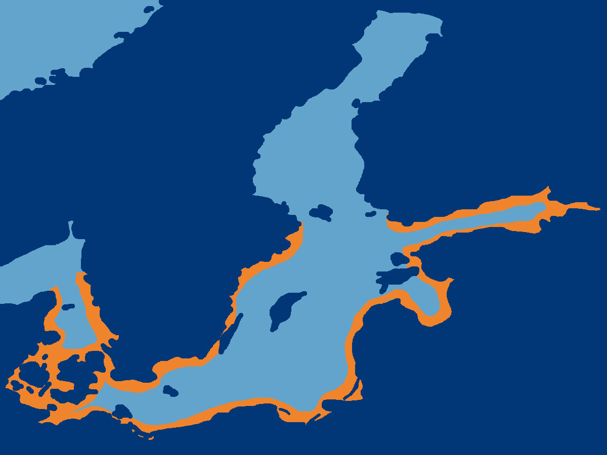
>
> __Verbreitung:__ Selten in den südlichen und östlichen küstennahen Gebieten der Ostsee.
>
> __Häufigkeit:__ selten
>
> __Gefährdung:__ nicht gefährdet

## Grauhai

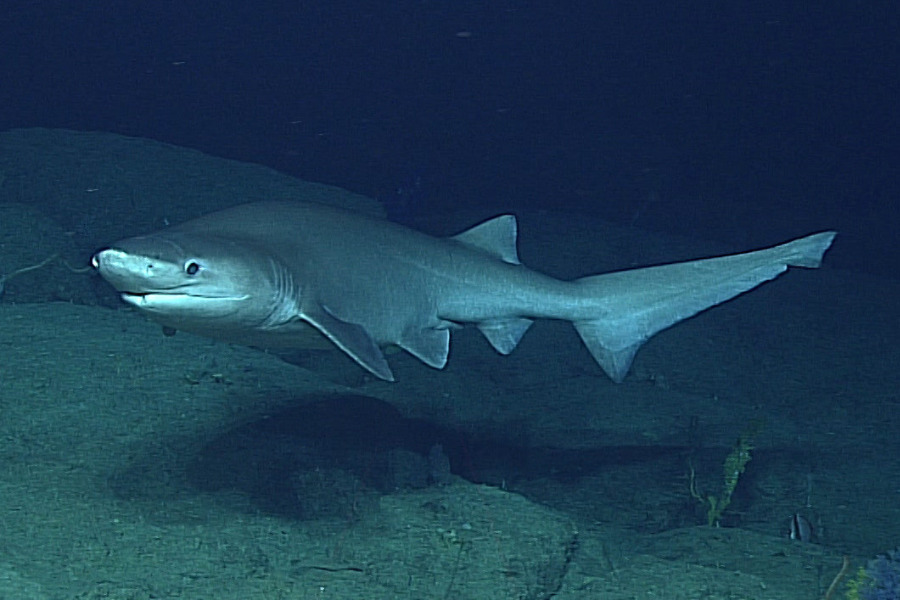
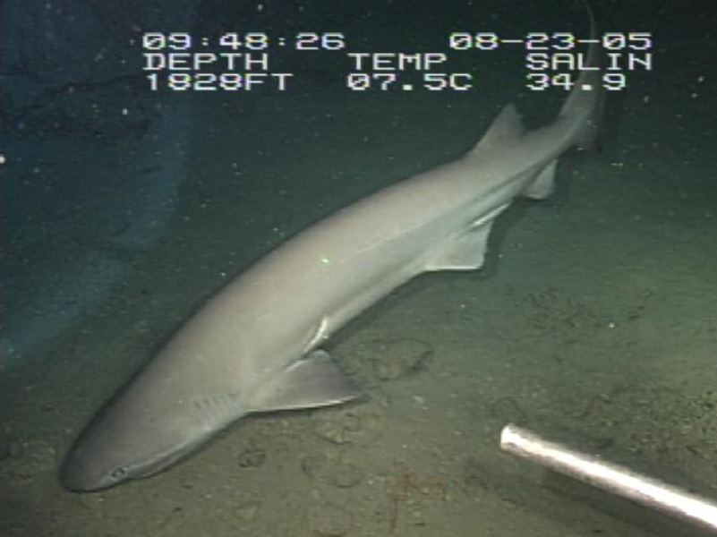
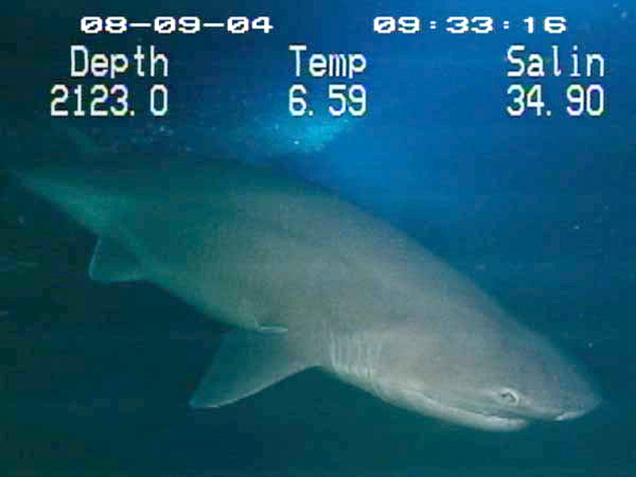

<article class="main-info">

_D-Grauhai, Sechskiemer;_
_GB-Bluntnose six-gill shark, cow shark;_
_DK-Seksgællet haj;_
_PL-Sześcioszpar szary;_
_EST-Kammhai;_
_RU-Шестижаберная акула;_
_FIN-Kidushai;_
_S-Sexbågig kamtandhaj_

### Erkennungsmerkmale

1. Nur eine Rückenflosse.
2. 6 Kiemenspalten.

* Unterer Lappen der Schwanzflosse kaum ausgebildet.
* Rücken meist dunkel gräulich oder bräunlich; Bauch heller.

Meist um 3 m, bis max. 4,8 m Länge und 590 kg Gewicht.

### Ähnliche Arten

* [Heringshai](#heringshai) - 2 Rückenflossen; nur 5 Kiemenspalten.
* [Blauhai](#blauhai) - 2 Rückenflossen; nur 5 Kiemenspalten.

### Lebensweise

Lebt bodennah meist in 100 bis 2000 m Tiefe und ist nachtaktiv.
Je Wurf werden 22 bis 108 Junge lebend geboren.

### Ernährung

Alle Arten von Boden bewohnenden Weichtieren und Fischen, auch Rochen, andere Haie, Aas und gelegentlich auch Robben.

### Bedeutung

Keine hohe wirtschaftliche Nutzung, jedoch lokale Nutzung als Speisefisch, zur Fischmehl- und Fischölgewinnung.

### Gefährdung

Häufiger Beifang in Langleinen-, Schlepp- und Stellnetzfischerei und gilt als anfällig für Überfischung, da erst sehr spät geschlechtsreif werdend:
Männchen ab etwa 3 m, Weibchen erst ab etwa 4 m Länge.

</article>

<!-- class="sub-info" -->
> #### Hexanchus griseus
>
> __Familie:__ Hexanchidae
>
> __Ordnung:__ Hexanchiformes
>
> 
>
> __Verbreitung:__ Irrgast in der westlichen Ostsee.
>
> __Häufigkeit:__ sehr selten
>
> __Gefährdung:__ unklar

## Gemeiner Dornhai

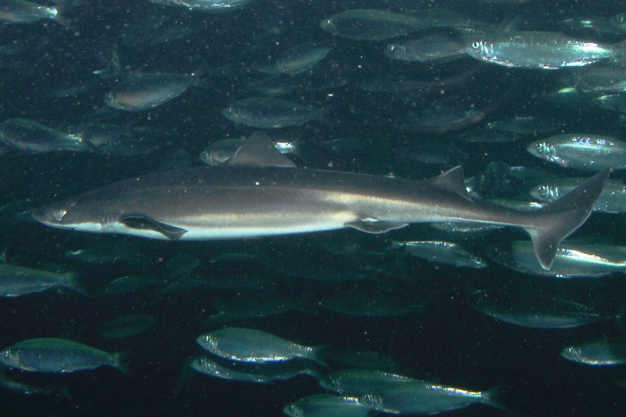
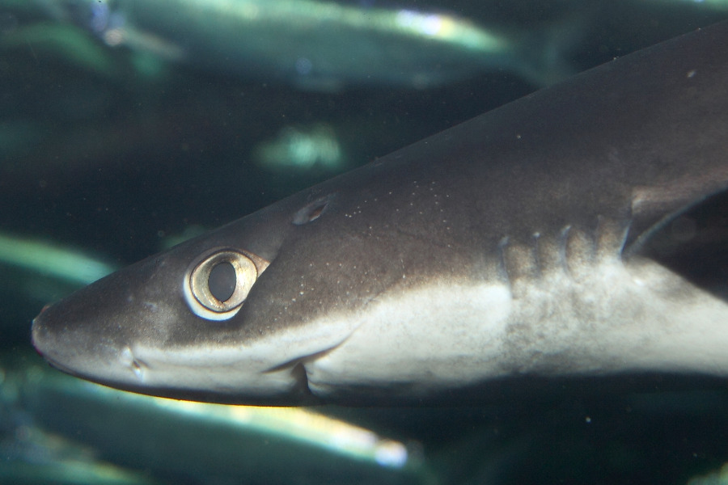
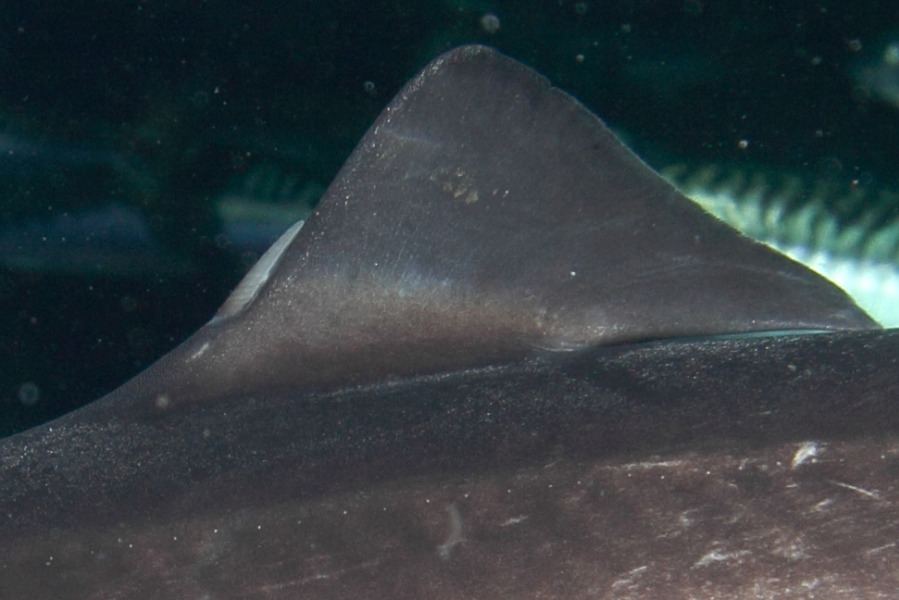

<article class="main-info">

_D-Gemeiner Dornhai;_
_GB-Spurdog;_
_DK-Pighaj;_
_PL-Koleń pospolity, koleń;_
_LV-dzelkņu haizivs;_
_EST-Harilik ogahai;_
_RU-Катран;_
_FIN-Piikkihai;_
_S-Pigghaj_

### Erkennungsmerkmale

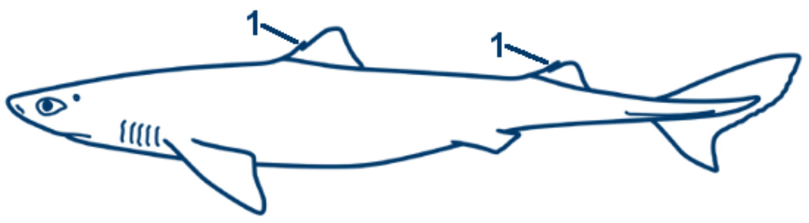

1. Dornen an beiden Rückenflossen.

* 5 Kiemenspalten, keine Afterflosse.
* Rücken gräulich bis bräunlich; gelegentlich mit hellen Flecken.

Weibchen meist 75 bis 105 cm; Männchen 60 bis 90 cm Länge.

### Ähnliche Arten

* [Heringshai](#heringshai) - ohne Dornen an der Rückenflosse; mit Afterflosse.
* [Blauhai](#blauhai) - ohne Dornen an der Rückenflosse; mit Afterflosse.

### Lebensweise

Lebt meist in großen Schulen über Weichgrund bis in 200 m Tiefe.
2 bis 11 Eier werden im Mutterleib über einen Zeitraum von 18 bis 22 Monaten ausgebrütet.

### Ernährung

Vor allem Fische, daneben auch Tintenfische und Krebstiere.

### Bedeutung

Eingelegtes Fleisch wird als "Seeaal" und die geräucherten Bauchlappen als "Schillerlocke" gehandelt.

### Gefährdung

Wegen langsamer Reproduktionsrate stark anfällig gegen Überfischung.
Die europäischen Bestände sind bereits stark überfischt.
"Dornhai"-Produkte werden mittlerweile aus ähnlichen Arten aus anderen Gebieten der Welt gewonnen.

</article>

<!-- class="sub-info" -->
> #### Squalus acanthias
>
> __Familie:__ Squalidae
>
> __Ordnung:__ Squaliformes
>
> 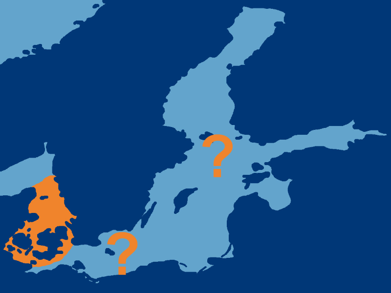
>
> __Verbreitung:__ sehr selten in der westlicher Ostsee; als Irrgast bis Rügen; Einzelnachweise sogar bis Finnland
>
> __Häufigkeit:__ selten
>
> __Gefährdung:__ gefährdet

## Fleckhai

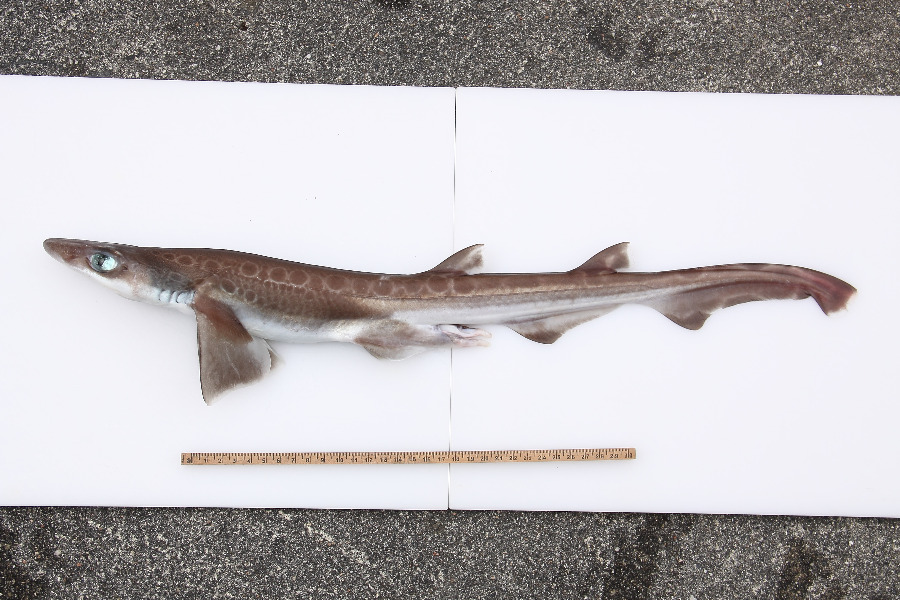
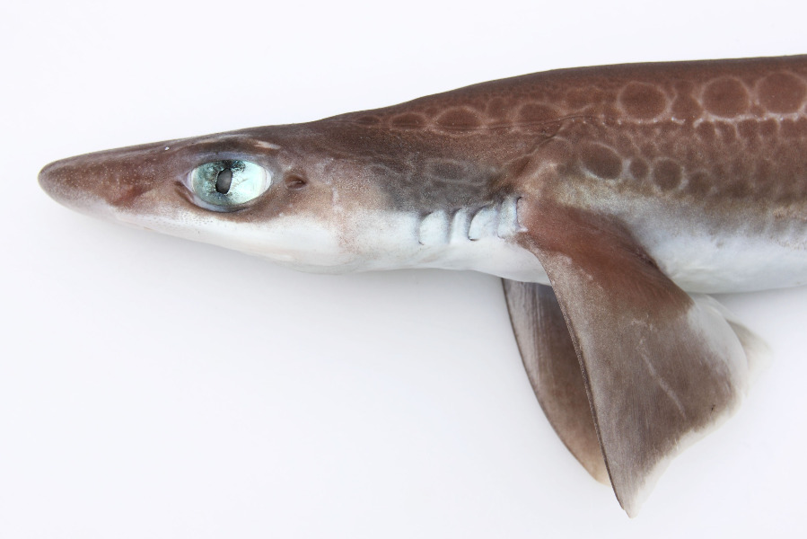
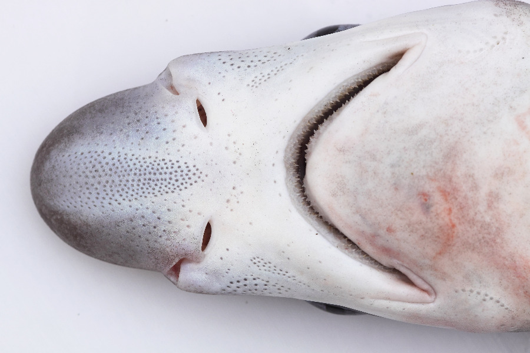
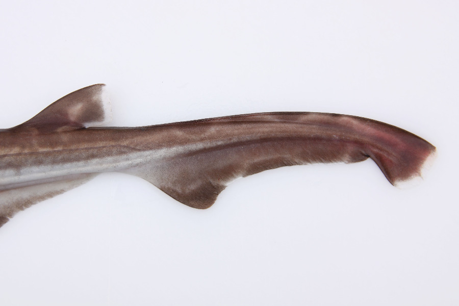

<article class="main-info">

_D-Fleckhai;_
_GB-Blackmouth shark;_
_DK- Ringhaj;_
_PL-Piłogon;_
_EST-Mustsuu-saagsabahai;_
_RU-Испанская акула-пилохвост;_
_FIN-Rengashai;_
_S-Hågäl_

### Erkennungsmerkmale

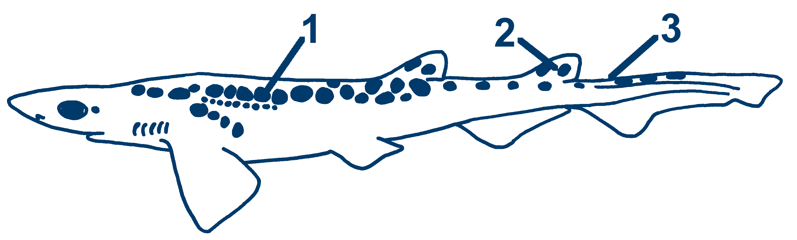

1. Charakteristische Fleckenfärbung.
2. Zweite Rückenflosse wenig kleiner als erste Rückenflosse.
3. Stark gesägter oberer Rand am Schwanzstiel.

* 5 Kiemenspalten.
* Maul-Innenseiten schwarz.

Weibchen bis 90 cm, Männchen bis 60 cm Länge

### Ähnliche Arten

* [Kleingefleckter Katzenhai](#kleingefleckter-katzenhai) - ohne Sägekante am oberen Rand des Schwanzstieles; Maulinnenseiten nicht schwarz.

### Lebensweise

Lebt meist im Tiefenwasser unterhalb von 200 m Tiefe, gelegentlich bis in nur 50 m Tiefe; eierlegend.

### Ernährung

Muscheln, Tintenfische, Krebstiere und Fische.

### Bedeutung

Keine wirtschaftliche Bedeutung.

### Gefährdung

Häufiger Beifang in Schleppnetzen und an Langleinen, aber vermutlich nicht gefährdet.

</article>

<!-- class="sub-info" -->
> #### Galeus melastomus
>
> __Familie:__ Scyliorhinidae
>
> __Ordnung:__ Carchariniformes
>
> 
>
> __Verbreitung:__ Irrgast in der westlichen Ostsee.
>
> __Häufigkeit:__ sehr selten
>
> __Gefährdung:__ nicht gefährdet

## Kleingefleckter Katzenhai

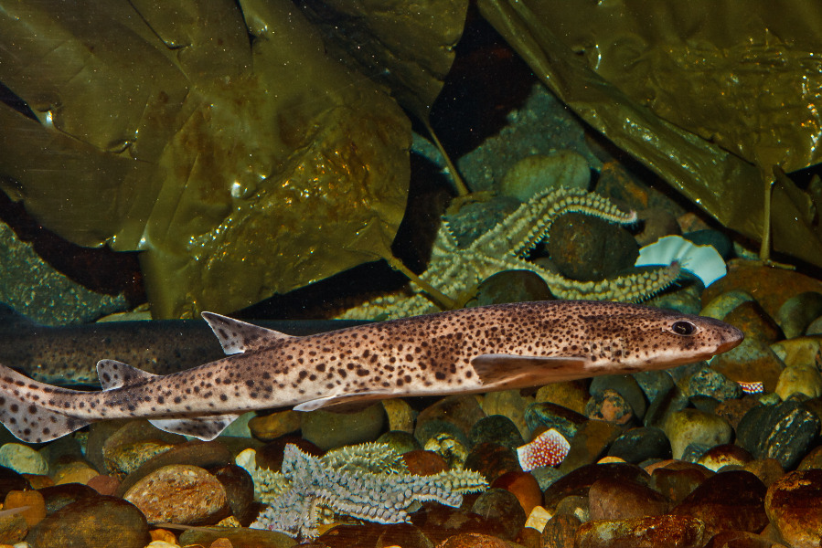
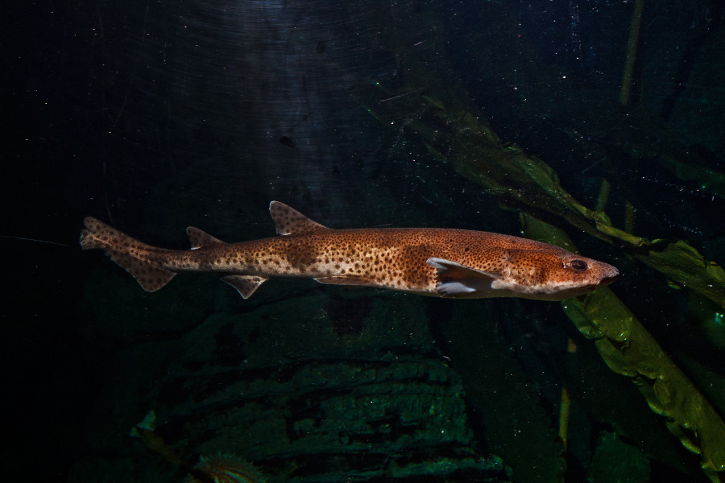
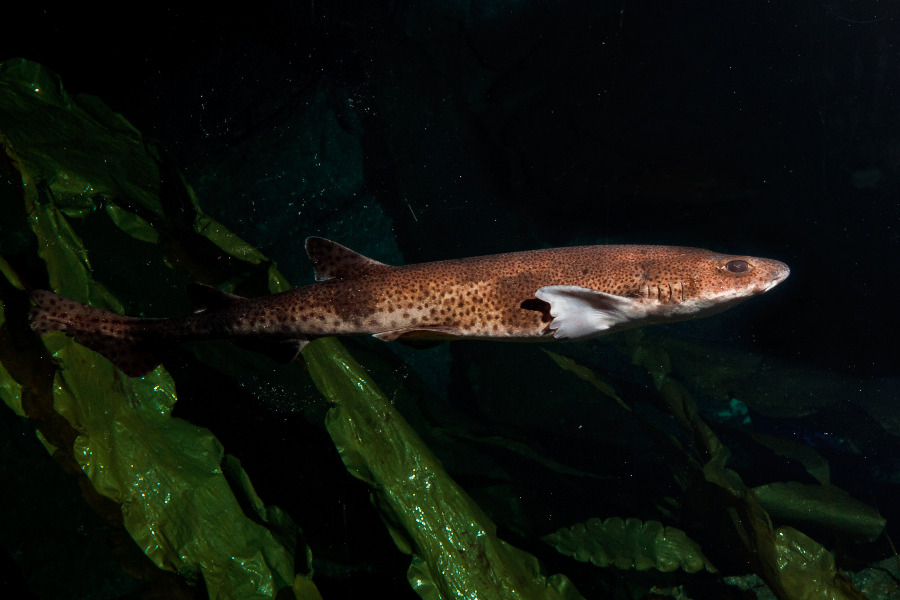
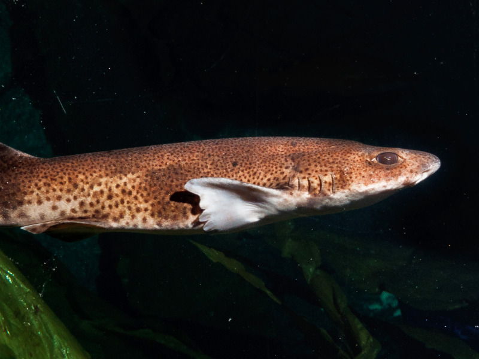

<article class="main-info">

_D-Kleingefleckter Katzenhai;_
_GB-Smallspotted catshark;_
_DK-Småplettet rødhaj;_
_PL-Rekinek psi;_
_EST-Koerhai;_
_RU-Обыкновенная кошачья акула;_
_FIN-Pistepunahai;_
_S-Småfläckig rödhaj_

### Erkennungsmerkmale

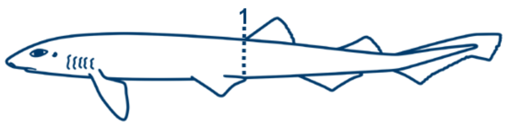

1. Erste Rückenflosse beginnt hinter dem Ansatz der Bauchflossen.

* 5 Kiemenspalten.
* hellbraune Körperfärbung mit zahlreichen kleinen, dunklen Punkten.

Meist 75 cm, bis max. 100 cm Länge.

### Ähnliche Arten

* [Fleckhai](#fleckhai) - mit Sägekante am oberen Rand des Schwanzstieles, Maulinnenseiten schwarz.

### Lebensweise

Bodenbewohner bis max. 550 m Tiefe, meist jedoch zwischen 50 m und 250 m Tiefe, Eierlegend, 90 bis 115 pro Jahr, die ganzjährig, meist an Tangen oder Seegras, abgelegt werden.

### Ernährung

Bodenlebende Wirbellose und kleinere Fische.

### Bedeutung

Geringe Bedeutung.
In England gelegentlich als "Rock Salmon" und in Südfrankreich als "Saumonette" gehandelt.

### Gefährdung

Nicht gefährdet.

</article>

<!-- class="sub-info" -->
> #### Scyliorhinus canicula
>
> __Familie:__ Scyliorhinidae
>
> __Ordnung:__ Carchariniformes
>
> 
>
> __Verbreitung:__ Kattegat; Irrgast in der Beltsee.
>
> __Häufigkeit:__ regelmäßig
>
> __Gefährdung:__ nicht gefährdet

## Gewöhnlicher Stechrochen

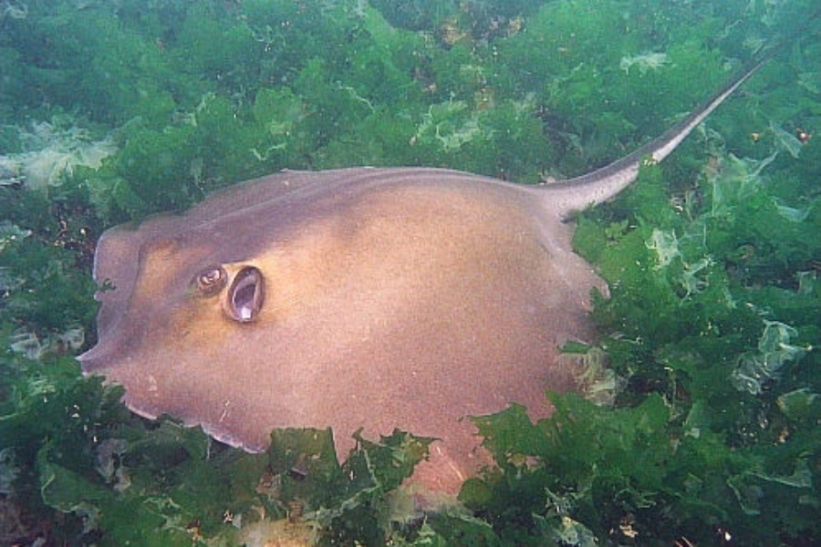
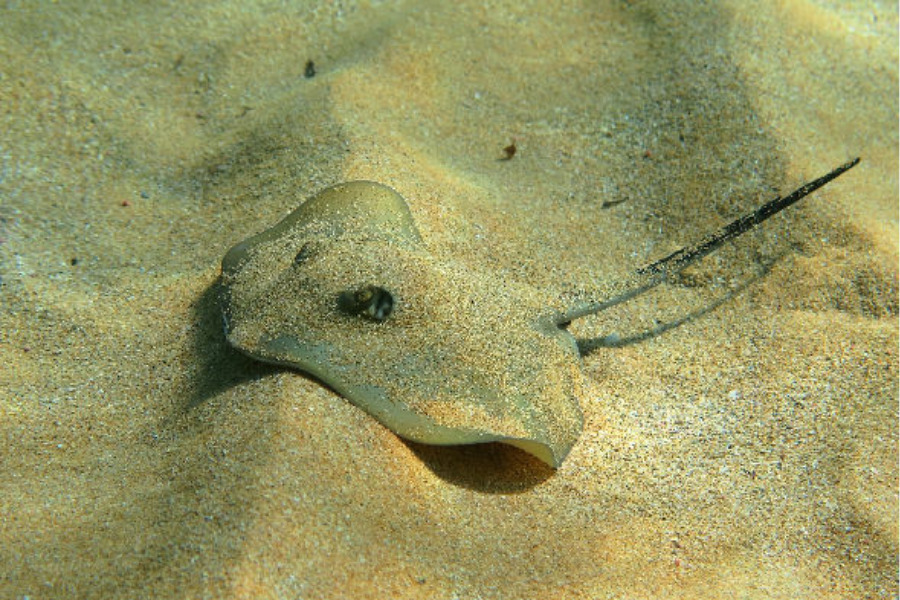

<article class="main-info">

_D-Gewöhnlicher Stechrochen;_
_GB-Common stingray;_
_DK-Pigrokke;_
_PL-Ogończa pastynak;_
_EST-Harilik astelrai;_
_RU-Морской кот;_
_FIN-Keihäsrausku;_
_S-Spjutrocka_

### Erkennungsmerkmale

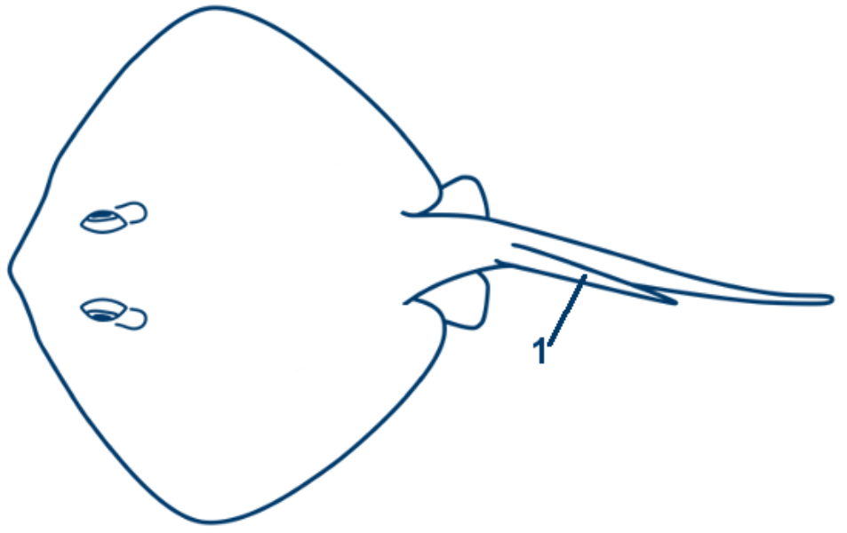

1. Ein oder zwei Stacheln an der Schwanzbasis (kann bei manchen Individuen abgebrochen sein).

* Körperscheibe annähernd rund.

Meist 40 bis 150 cm, bis max. 200 cm Länge.

### Ähnliche Arten

### Lebensweise

Nachtaktiver Bodenbewohner auf Sand- und Weichböden bis 200 m Tiefe.
Nach einer Tragzeit von 4 Monaten werden meist 4 bis 9 Junge lebend geboren.
Es sind 2 Würfe pro Jahr möglich.

### Ernährung

Bodenbewohnende Wirbellose und Fische.

### Bedeutung

Kommerzielle Nutzung im Mittelmeer und im Schwarzem Meer.

### Gefährdung

Häufiger Beifang beim Fang von bodennahen Fischen.

</article>

<!-- class="sub-info" -->
> #### Dasyatis pastinaca
>
> __Familie:__ Dasyatidae
>
> __Ordnung:__ Myliobatiformes
>
> 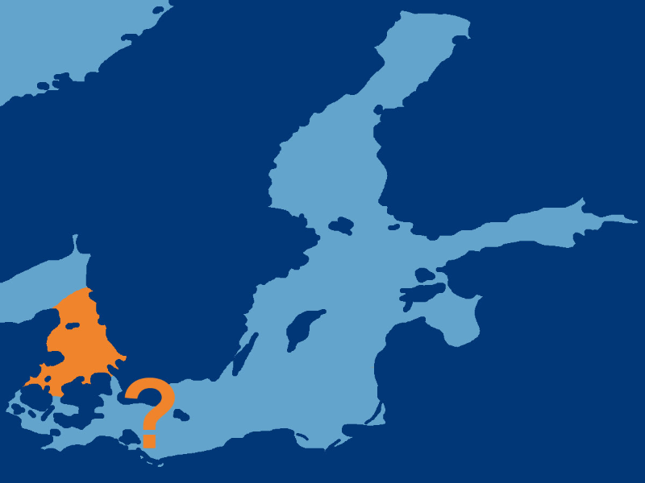
>
> __Verbreitung:__ Westliche Ostsee
>
> __Häufigkeit:__ sehr selten
>
> __Gefährdung:__ unklar

## Nagelrochen

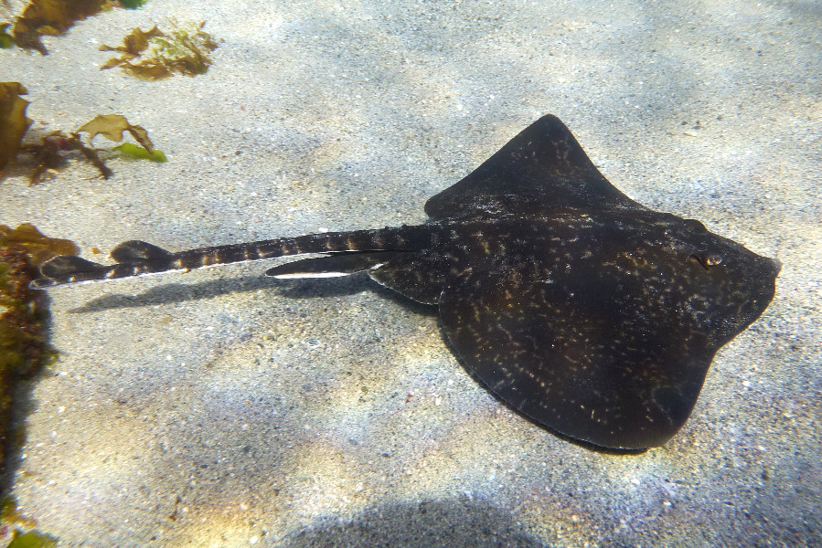
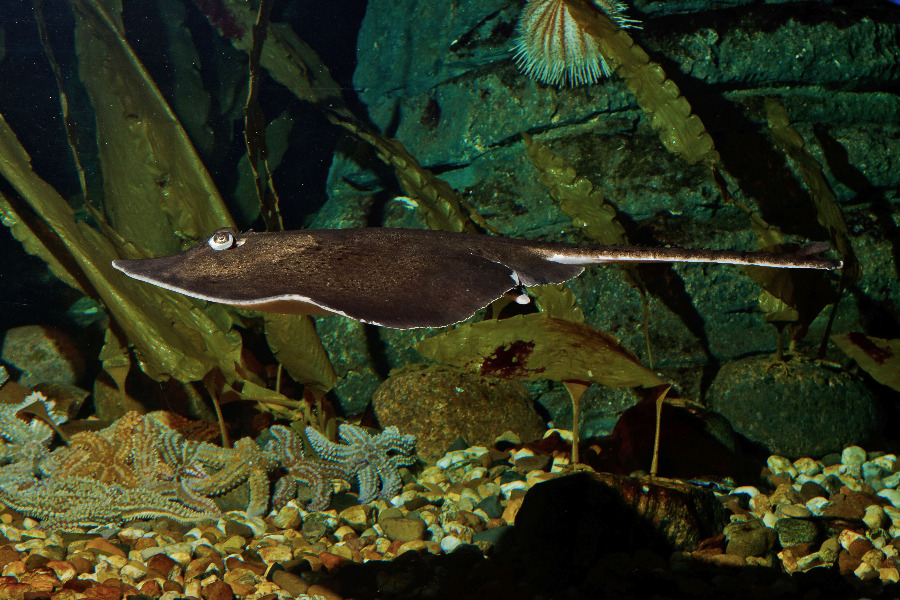
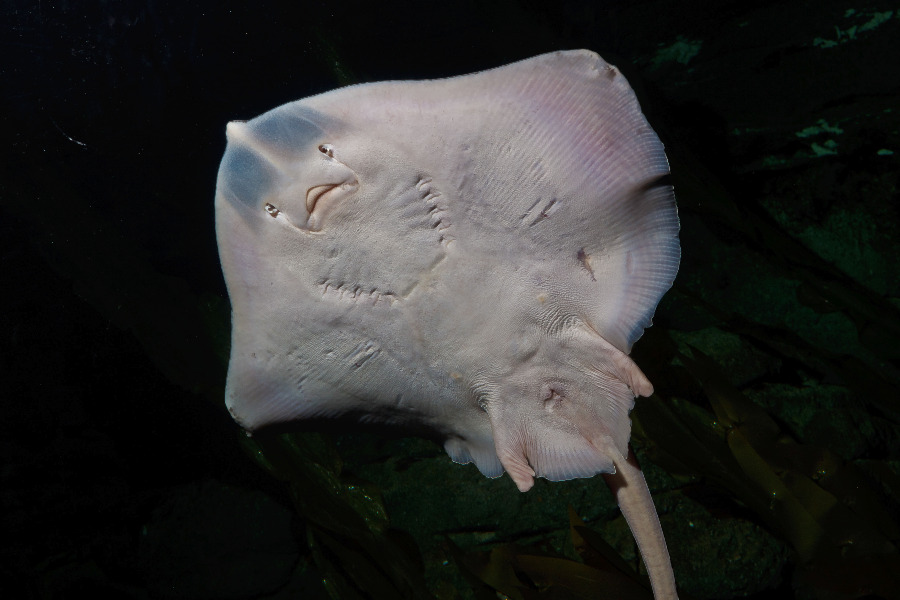
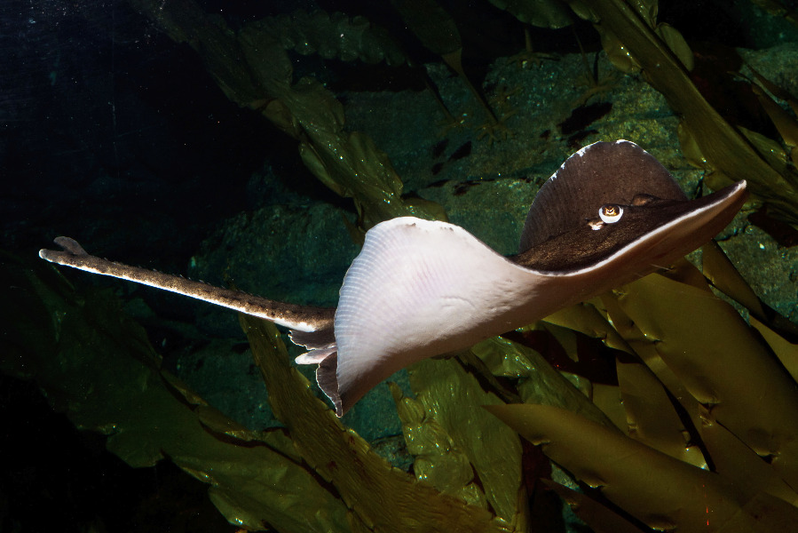
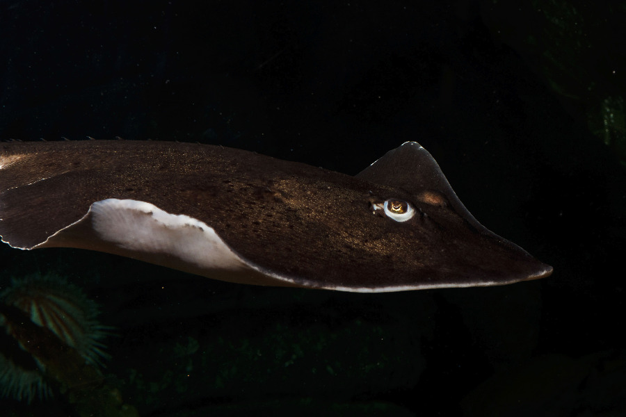

<article class="main-info">

_D-Nagelrochen;_
_GB-Thornback ray;_
_DK-Sømrokke;_
_PL-Raja nabijana;_
_EST-Ogarai;_
_RU-Морская лисица;_
_FIN-Okarausku;_
_S-Knaggrocka_

### Erkennungsmerkmale

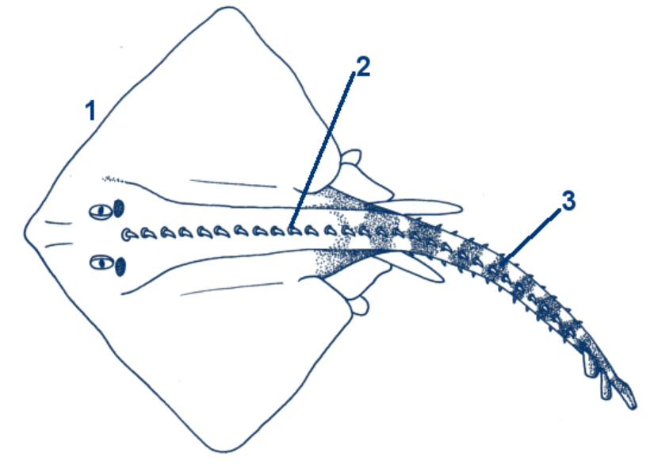

1. Schnauze stumpf (der vordere Körperrand läuft entlang einer Linie von den Flügelspitzen zur Schnauze).
2. eine Reihe Dornen vom Rücken auf den Schwanz laufend.
3. auffälliges Streifenmuster auf dem Schwanz.

* Weitere Dornenreihen auf dem Schwanz; die einzelnen Dornen haben eine glatte Basis.
* Oberseite hellbraun mit lebhafter Musterung (Flecken und Augenflecken).

Meist 80 bis 90 cm, bis max. 120 cm Länge.

### Ähnliche Arten

* [Sternrochen](#sternrochen) - Schwanz ohne Streifenmuster; Dornen mit geriffelter Basis.
* [Glattrochen](#glattrochen) - Schwanz ohne Streifenmuster; Schnauze spitz; nur eine Reihe Dornen auf den Schwanz begrenzt.
* [Chagrinrochen](#chagrinrochen) - Schwanz ohne Streifenmuster; eine Reihe Dornen auf dem Nacken und zwei parallele Dornenreihen auf dem Schwanz.

### Lebensweise

Vorwiegend nachtaktive Bodenbewohner bevorzugt auf Sand und Weichgrund bis 700m Tiefe.
Erreichen der Geschlechtsreife nach 9 Jahren.
Pro Jahr können 141 bis 167 Eikapseln gelegt werden.

### Ernährung

Bevorzugt von Krebstieren, jedoch auch von anderen Wirbellosen und Fischen.

### Bedeutung

Kommerziell genutzte Art in Nordwesteuropa, sowie im Mittel- und Schwarzen Meer.

### Gefährdung

Starker Rückgang der Bestände, durch langsame Reproduktionsraten und wirtschaftliche Nutzung.

</article>

<!-- class="sub-info" -->
> #### Raja clavata
>
> __Familie:__ Rajidae
>
> __Ordnung:__ Rajiformes
>
> 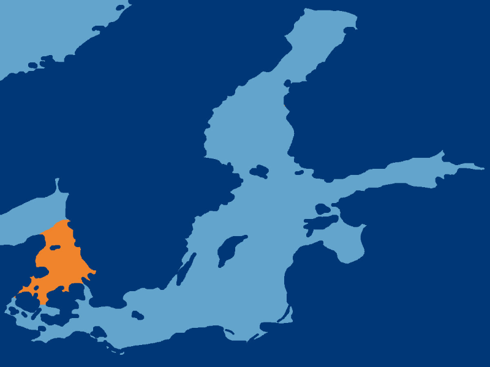
>
> __Verbreitung:__ Sehr selten in der westliche Ostsee.
>
> __Häufigkeit:__ sehr selten
>
> __Gefährdung:__ unklar

## Sternrochen

<article class="main-info">

_D-Sternrochen;_
_GB-Starry ray, thorny ray;_
_DK-Tærbe;_
_PL-Płaszczka gwiaździsta;_
_EST-Täht-sünkrai;_
_RU-Zvezdchatiy skat;_
_FIN-Kynsirausku;_
_S-Klorocka_

### Erkennungsmerkmale

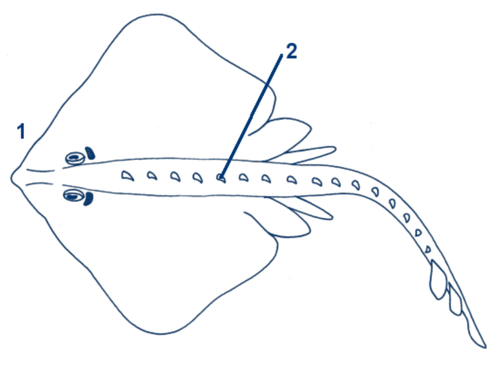

1. Schnauze stumpf (der vordere Körperrand läuft entlang einer Linie von den Flügelspitzen zur Schnauze).
2. eine Reihe sehr großer Dornen vom Rücken bis auf den Schwanz laufend.

* Oberseite braun bis dunkelbraun ohne Musterung.

Meist bis 60 cm, max. bis 100 cm Länge.

### Ähnliche Arten

* [Nagelrochen](#nagelrochen) - gemusterte Oberseite; Schwanz mit Streifenmuster
* [Glattrochen](#glattrochen) - Schnauze spitz; nur eine Reihe Dornen auf den Schwanz begrenzt.
* [Chagrinrochen](#chagrinrochen) - eine Reihe Dornen auf dem Nacken und zwei parallele Dornenreihen auf dem Schwanz; Färbung auf der Oberseite eher grau.

### Lebensweise

Bodenbewohner auf Weich- und Felsgrund, meist zwischen 50 bis 100 m, max. bis 1000 m Tiefe; eierlegend.

### Ernährung

Vorwiegend von Krebstieren und kleineren Fischen.

### Bedeutung

Speisefisch, jedoch kaum wirtschaftliche Bedeutung.

### Gefährdung

Sinkende Bestände vor allem durch Beifang.

</article>

<!-- class="sub-info" -->
> #### Amblyraja radiata
>
> __Familie:__ Rajidae
>
> __Ordnung:__ Rajiformes
>
> 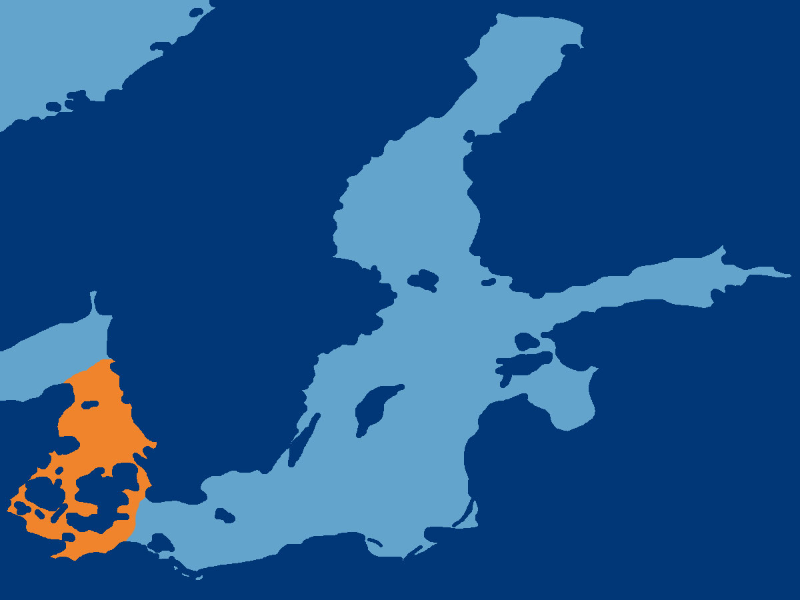
>
> __Verbreitung:__ Kattegat; sehr selten in der westlichen Ostsee.
>
> __Häufigkeit:__ selten
>
> __Gefährdung:__ gefährdet

## Chagrinrochen

<article class="main-info">

_D-Chagrinrochen;_
_GB-Shagreenray;_
_DK-Gøgerokke;_
_PL-Raja kosmata;_
_EST-Šagrään-helerai;_
_RU-Шагреневый скат;_
_S-Näbbrocka_

### Erkennungsmerkmale

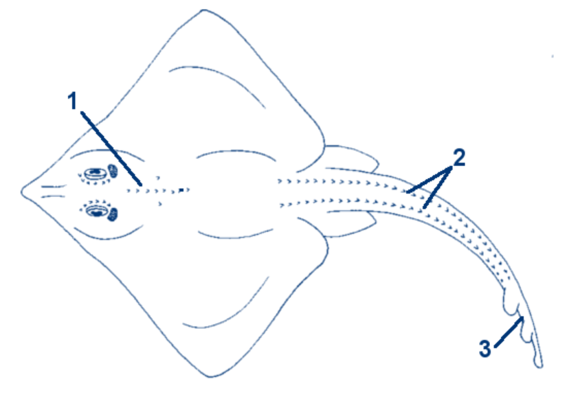

1. Eine Dornenreihe auf dem Rücken.
2. zwei parallele Dornenreihen auf dem Schwanz.
3. keine Dornen zwischen den beiden Rückenflossen.

* Schnauze eher spitz.
* Oberseite einheitlich grau bis dunkelgrau ohne Musterung.

Meist 30 bis 70 cm, bis max. 120 cm Länge.

### Ähnliche Arten

* [Glattrochen](#glattrochen) - nur eine Reihe Dornen auf den Schwanz begrenzt; Dornen auch zwischen den Rückenflossen.
* [Nagelrochen](#nagelrochen) - Schnauze stumpf; gemusterte Oberseite; stark ausgebildete Dornenreihe vom Rücken bis auf den Schwanz ziehend.
* [Sternrochen](#sternrochen) - Schnauze stumpf; stark ausgebildete Dornenreihe vom Rücken bis auf den Schwanz ziehend; eher braun gefärbt.

### Lebensweise

Bodenbewohner auf Hart-, Geröll- und gelegentlich Weichböden, bevorzugt kältere Wasserschichten in 30 bis 550 m Tiefe; eierlegend.

### Ernährung

Bevorzugt von Fischen, aber auch von bodenbewohnenden Wirbellosen und Krebstieren.

### Bedeutung

Keine wirtschaftliche Bedeutung, wird nur lokal befischt.

### Gefährdung

Häufiger Beifang der Schlepp- und Langleinenfischerei.

</article>

<!-- class="sub-info" -->
> #### Leucoraja fullonica
>
> __Familie:__ Rajidae
>
> __Ordnung:__ Rajiformes
>
> 
>
> __Verbreitung:__ Irrgast in der westlichen Ostsee (Einzelfund von 1890).
>
> __Häufigkeit:__ sehr selten
>
> __Gefährdung:__ gefährdet

## Lachs

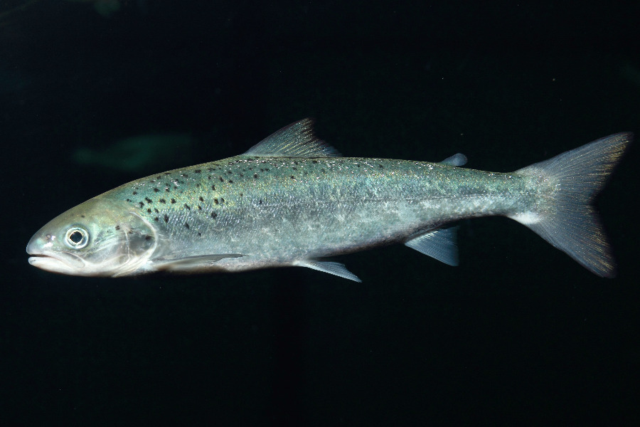
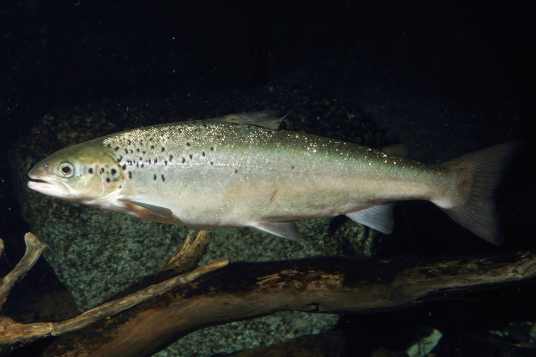
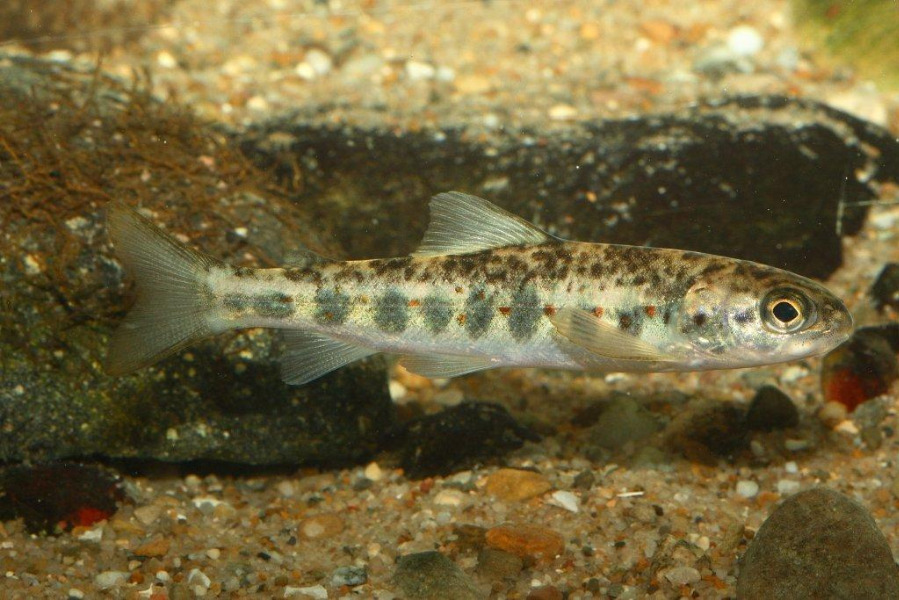
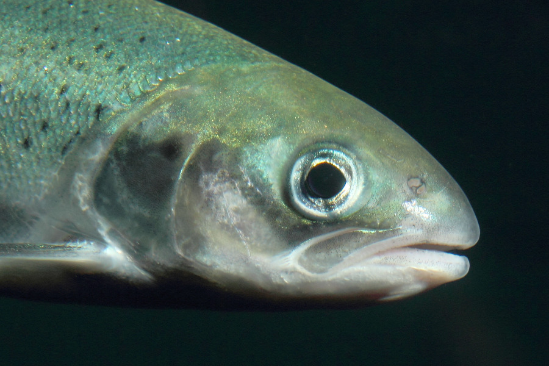

<article class="main-info">

_D-Lachs;_
_GB-Atlantic salmon;_
_DK-Laks;_
_PL-Lõhe;_
_LT-Lašiša;_
_LV-Lasis;_
_EST-Lõhe;_
_RU-Атлантический лосось;_
_FIN-Lohi;_
_S-Atlantlax_

### Erkennungsmerkmale

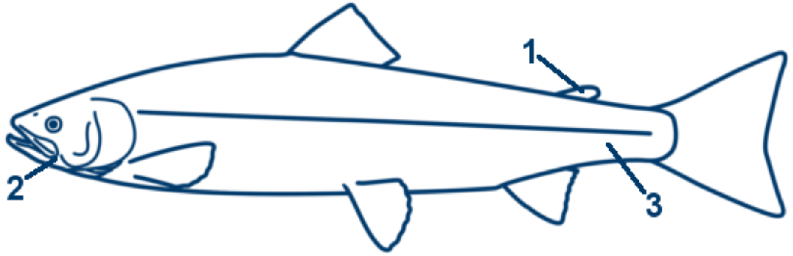

1. Fettflosse vorhanden, meist nur gräulich ohne Rotanteile.
2. Maulspalte sehr groß, (meist) bis hinter das Auge reichend.
3. Schwanzstiel eher lang und schmal.

* Zahlreiche dunkle Punkte auf dem Körper (nicht auf der Schwanzflosse); Jungtiere auch mit dunklen, vertikalen Streifen.

Meist 30 bis 40 cm, bis max. 120 cm Länge.

### Ähnliche Arten

* [Meerforelle](#meerforelle) - Fettflosse oft rötlich-braun; Schwanzstiel kürzer und dicker.
* [Buckellachs](#buckellachs) - schwarze Flecken auf der Schwanzflosse.
* [Regenbogenforelle](#regenbogenforelle) - rötlich-rosa Kiemendecken und Streifen auf der Flanke.
* [Rapfen](#rapfen) - ohne Fettflosse.

### Lebensweise

1 bis 4 jährige Fress- und Wachstumsphase im Meer als Vorbereitung auf die Laichwanderung in die Flüsse.
Keine Nahrungsaufnahme während der gesamten Aufstiegs- und Laichphase.
8.000 - 25.000 Eier werden je Weibchen in Laichgruben gelegt.
Nur ein geringer Anteil der Lachse wandert zurück ins Meer, viele Tiere sterben an Überanstrengung.

### Ernährung

Kleinere Fische wie Heringe, Sandaale und Stichlinge, aber auch Krebstiere.

### Bedeutung

Sehr starke kommerzielle Nutzung als Speisefisch; häufig in Aquakultur gehalten; beliebter Angelfisch.

### Gefährdung

Steigende Gefährdung und Beeinflussung von wildlebenden Populationen durch Wasserverunreinigung, Flussverbauung (= Verhinderung der Laichwanderung) und Überfischung.

</article>

<!-- class="sub-info" -->
> #### Salmo salar
>
> __Familie:__ Salmonidae
>
> __Ordnung:__ Salmoniformes
>
> 
>
> __Verbreitung:__ Gesamte küstennahe Ostsee und einmündende Flüsse.
>
> __Häufigkeit:__ regelmäßig
>
> __Gefährdung:__ gefährdet

## Meerforelle

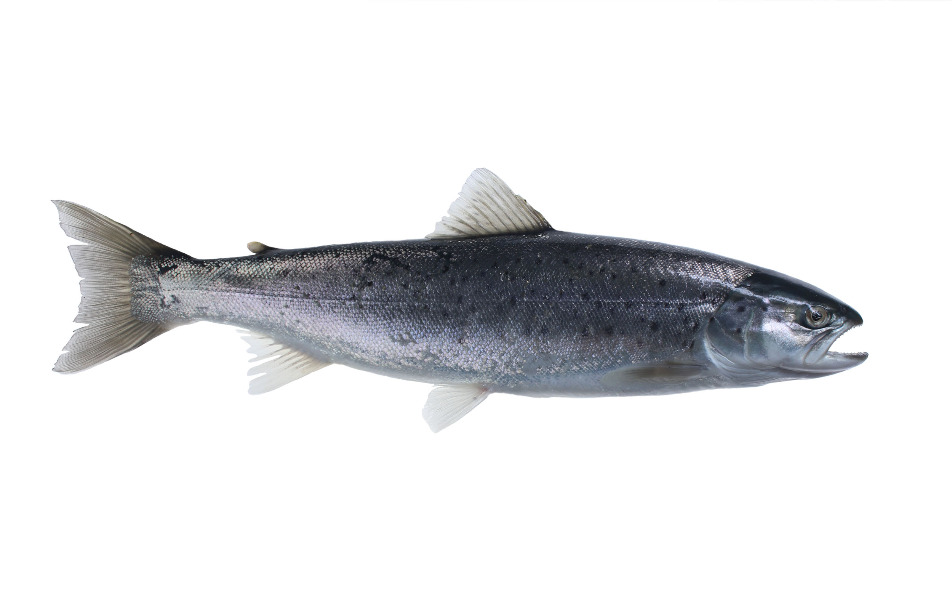
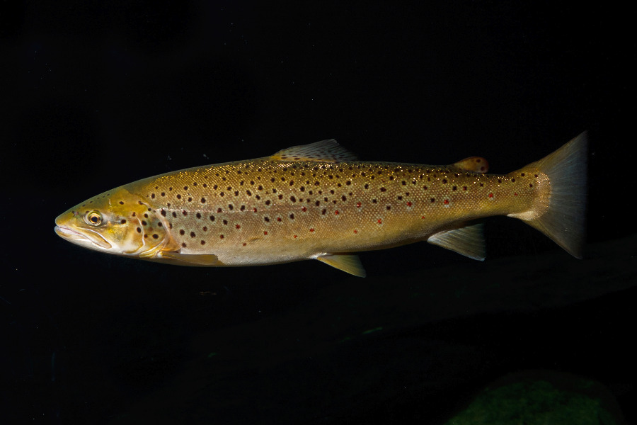
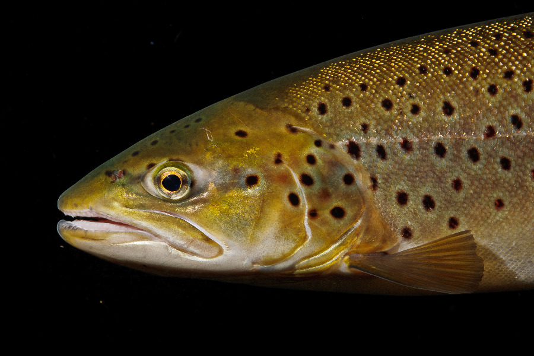

<article class="main-info">

_D-Meerforelle;_
_GB- Sea trout;_
_Brown trout;_
_DK-Havørred;_
_PL-Troć wędrowna;_
_LT-Šlakis;_
_LV-Taimiņš;_
_EST-Meriforell;_
_RU-Кумжа;_
_FIN-Taimen;_
_S-Öring_

### Erkennungsmerkmale

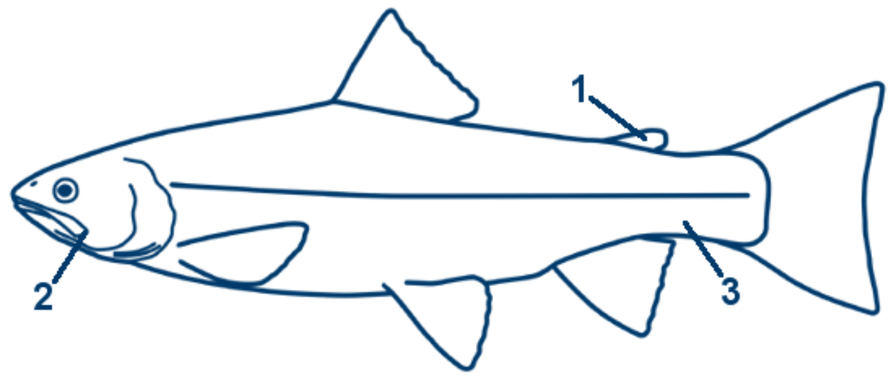

1. Fettflosse vorhanden und oft leicht rot-bräunlich gefärbt.
2. Maulspalte groß, meist bis unter das Auge reichend.
3. Schwanzstiel eher kurz und dick.

Meist 70 cm, max. bis 140cm Länge.

### Ähnliche Arten

* [Lachs](#lachs) - Schwanzstiel länger und dünner; Fettflosse gräulich (nicht rötlich-bräunlich)
* [Regenbogenforelle](#regenbogenforelle) - rötlich-rosa Kiemendecken und Streifen auf der Flanke.
* [Buckellachs](#buckellachs) - schwarze Flecken auf der Schwanzflosse.
* [Rapfen](#rapfen) - ohne Fettflosse.

### Lebensweise

Nach Erreichen der Laichreife mit ca. 2 Jahren wandern sie flussaufwärts.
Bis 10.000 Eier werden, ähnlich wie beim Lachs, in Laichgruben gelegt.
Die meisten Tiere überleben die Laichwanderung, kehren zurück ins Meer und können noch mehrmals zum Laichen wandern.

### Ernährung

Im Meer Fische wie Heringe, Sandaale, Stichlinge, aber auch Krebstiere; im Süßwasser vorwiegend Insektenlarven und Weichtiere.

### Bedeutung

Hoher wirtschaftlicher Wert: beliebter Speise- und Angelfisch.

### Gefährdung

Steigende Gefährdung und Beeinflussung durch Wasserverunreinigung, Flussverbauung (= Verhinderung der Laichwanderung) und Überfischung.

</article>

<!-- class="sub-info" -->
> #### Salmo trutta trutta
>
> __Familie:__ Salmonidae
>
> __Ordnung:__ Salmoniformes
>
> 
>
> __Verbreitung:__ Gesamte küstennahe Ostsee und einmündende Flüsse.
>
> __Häufigkeit:__ häufig
>
> __Gefährdung:__ unklar

## Regenbogenforelle

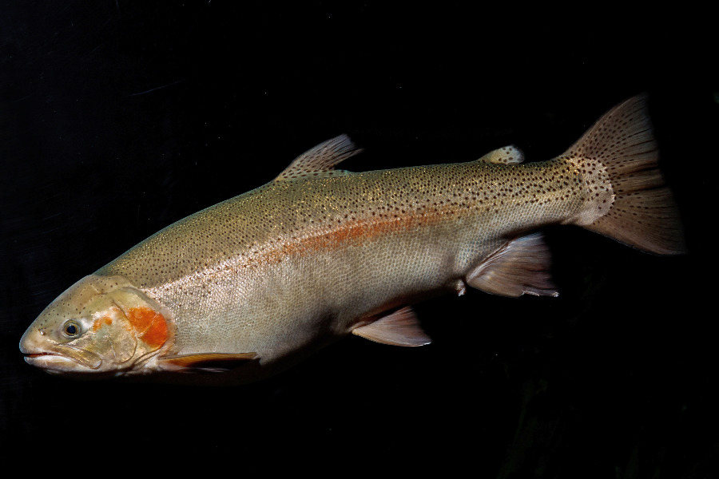
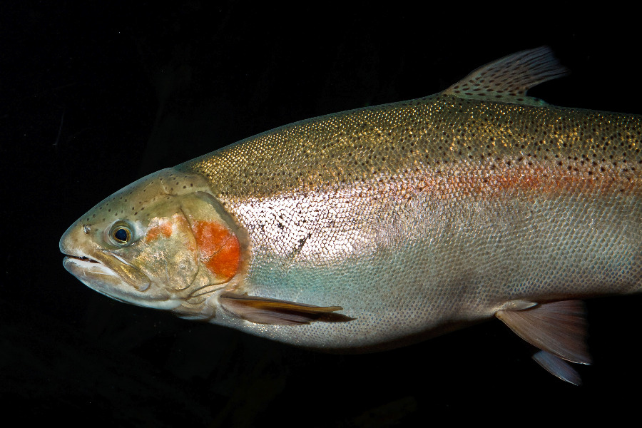

<article class="main-info">

_D-Regenbogenforelle;_
_GB-Rainbow trout, steelhead;_
_DK-Regnbueørred;_
_PL-Pstrąg tęczowy;_
_LT-Vaivorykštinis upėtakis;_
_LV-Varavīksnes forele;_
_EST-Vikerforell;_
_RU-Микижа;_
_FIN-Kirjolohi;_
_S-Regnbåge_

### Erkennungsmerkmale

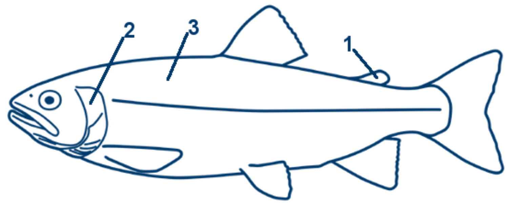

1. Fettflosse vorhanden.
2. rötlich schillernder Kiemendeckel und Seitenband.
3. gesamter Rücken und Flanken dunkel punktiert (auch Rücken-, Fett- und Schwanzflosse); Bauch heller.

Meist 60 bis 70 cm, max. 120 cm Länge

### Ähnliche Arten

* [Buckellachs](#buckellachs) - ohne rötlich-rosa Streifen auf der Flanke.
* [Lachs](#lachs) - ohne rötlich-rosa Streifen auf der Flanke; Schwanzflosse ohne schwarze Punkte.
* [Meerforelle](#meerforelle) - ohne rötlich-rosa Streifen auf der Flanke; Schwanzflosse ohne schwarze Punkte.
* [Rapfen](#rapfen) - ohne Fettflosse.

### Lebensweise

Wildbestände mit natürlicher Fortpflanzung in Europa sehr selten; natürlich vorkommend in Nordamerika und Nordostasien.

### Ernährung

Vorwiegend Weichtiere, aber auch kleinere Fische.

### Bedeutung

Hohe wirtschaftliche Bedeutung als Speisefisch; sehr häufig in Aquakultur gehalten.

### Gefährdung

Nicht gefährdet; nicht heimisch im Ostseegebiet.

</article>

<!-- class="sub-info" -->
> #### Oncorhynchus mykiss
>
> __Familie:__ Salmonidae
>
> __Ordnung:__ Salmoniformes
>
> 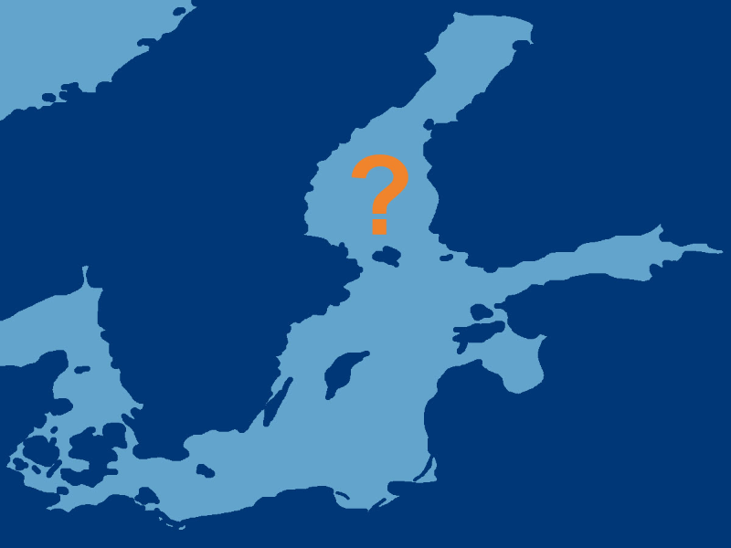
>
> __Verbreitung:__ Durch Besatzmaßnahmen regelmäßig in gesamter küstennaher Ostsee und einmündenden Flüssen.
>
> __Häufigkeit:__ sehr selten
>
> __Gefährdung:__ nicht gefährdet

## Ostseeschnäpel

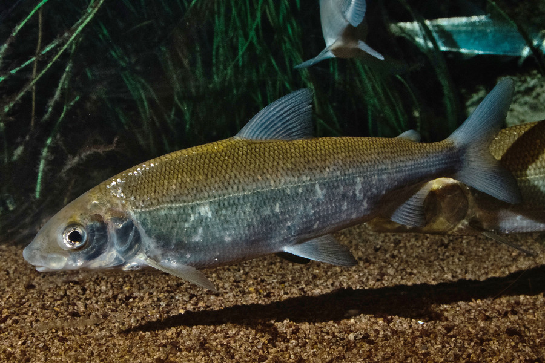
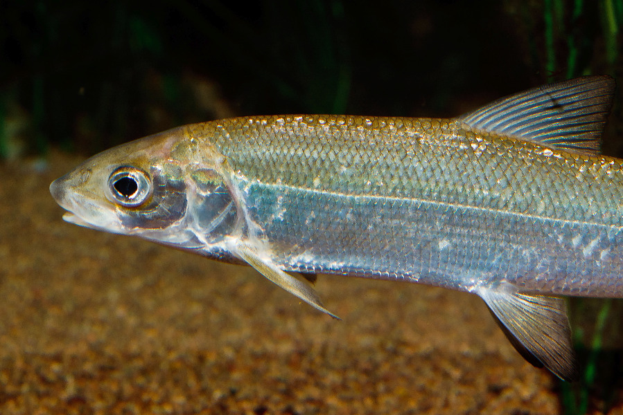
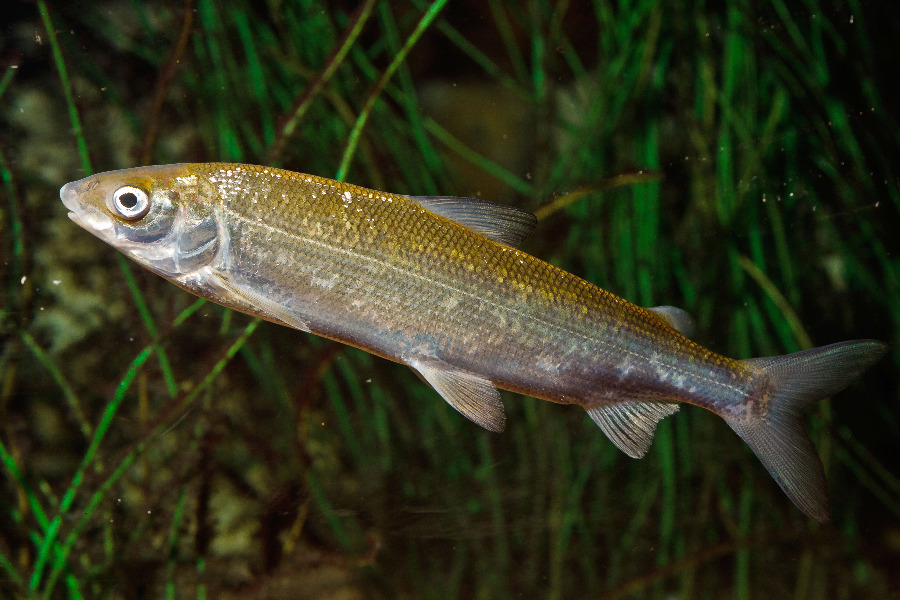
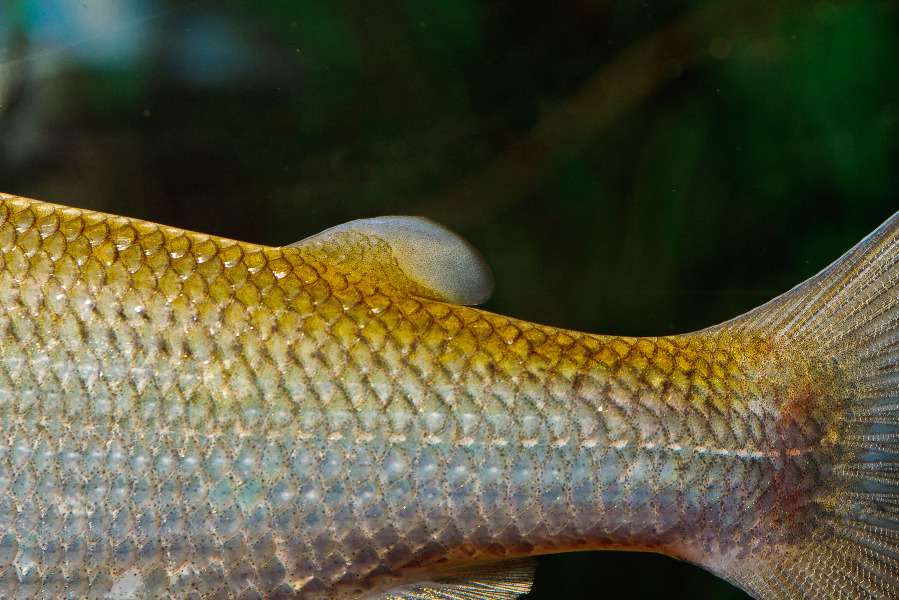
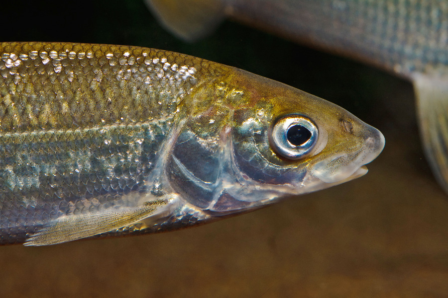

<article class="main-info">

_D-Ostseeschnäpel;_
_GB-Maraena, whitefish;_
_DK-Helt;_
_PL-Sieja;_
_EST-Merisiig;_
_RU-сея;_
_FIN-Siika;_
_S-Älvsik_

### Erkennungsmerkmale

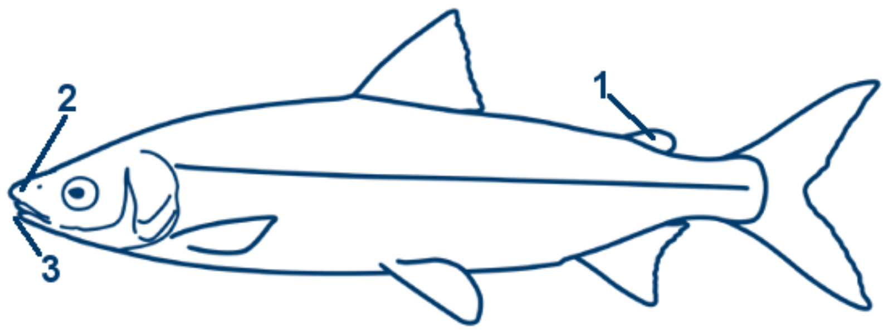

1. Fettflosse.
2. "nasenförmige" Schnauze.
3. kleines, unterständiges Maul.

* Körper mit einheitlich silbrig glänzende Schuppen bedeckt.

Meist 40 bis 50 cm, max. 75cm Länge.

### Ähnliche Arten

* [Zährte](#zährte) - ohne Fettflosse; Körper deutlich höher; Afterflosse viel länger.
* [Kleine Maräne](#kleine-maräne) - Maul klein, end- bis oberständig; Schnauze nicht nasenartig verlängert.

### Lebensweise

Nach erreichen der Laichreife mit 3 bis 5 Jahren wandern die Tiere flussaufwärts und überwintern oft in den Flussarmen, wo sie dann auch laichen.
Die Jungtiere wandern auf der Futtersuche ins Meer.

### Ernährung

Zooplankton wie Krebstiere und Larven, bodenbewohnende Wirbellose, und gelegentlich kleinere Fische.

### Bedeutung

Geringe Bedeutung als Speisefisch.

### Gefährdung

Deutlich sinkende Bestände durch Wasserverunreinigung, Flussverbauung, und Überfischung.
Die Eier reagieren empfindlich auf Sauerstoffarmut (diese entsteht durch Algenblüten in überdüngten Gewässern).

### Bermerkung

Durch Besatzmaßnahmen wird versucht die Bestände in Europa zu stabilisieren.
Spezialisten unterscheiden mehrere Formen, die teils als eigene Arten angesehen werden, z.B. Coregonus widegreni, die deutlich schlanker ist und eine weniger stark ausgebildete Schnauze besitzt als C. maraena.
Schnäpel werden oft in eine eigene Familie gestellt, die Coregonidae.

</article>

<!-- class="sub-info" -->
> #### Coregonus maraena
>
> __Familie:__ Coregonidae
>
> __Ordnung:__ Salmoniformes
>
> 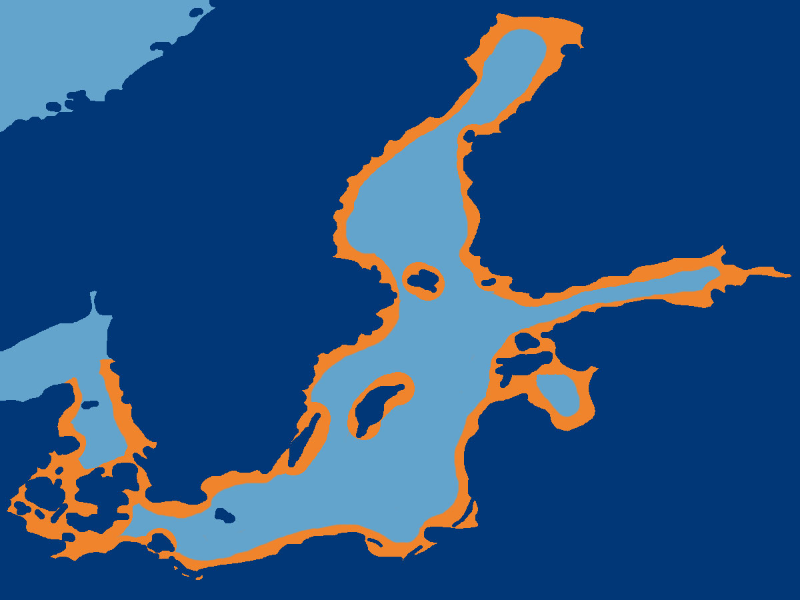
>
> __Verbreitung:__ Gesamte küstennahe Ostsee und einmündende Flüsse.
>
> __Häufigkeit:__ selten
>
> __Gefährdung:__ gefährdet

## Kleine Maräne

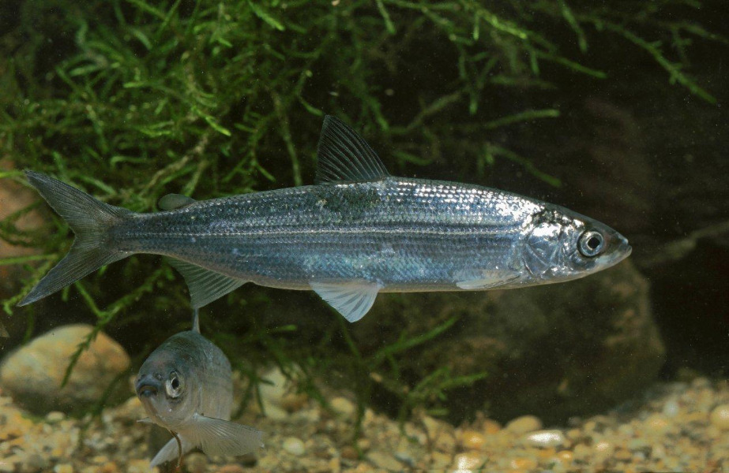
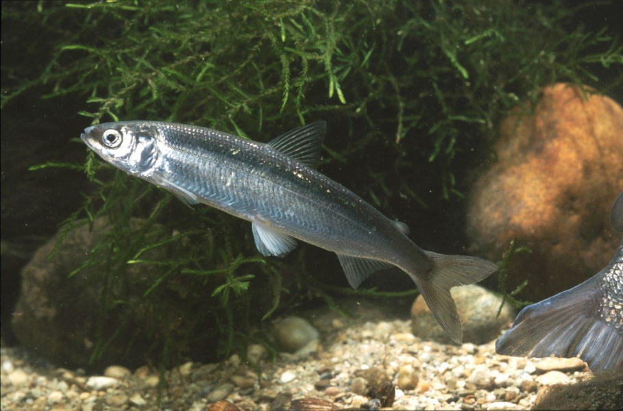

<article class="main-info">

_D-Kleine Maräne;_
_GB-Vendace, Baltic cisco;_
_DK-Heltling;_
_PL-Sielawa;_
_LT-Seliava;_
_LV-Repsis;_
_EST-Varavīksnes forele;_
_RU-Европейская ряпушка;_
_FIN-Muikku;_
_S-Siklöja_

### Erkennungsmerkmale

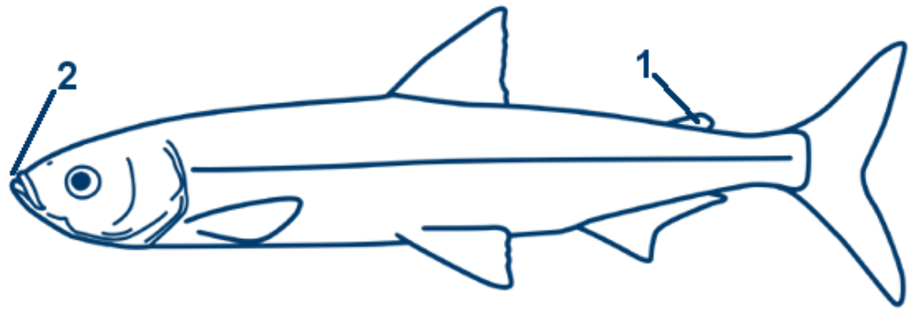

1. Fettflosse vorhanden.
2. Maul klein und end- bis leicht oberständig.

* silbrig glänzend, Flanken meist blau-grün gefärbt.

Meist 15 bis 20 cm, max. 40 cm Länge.

### Ähnliche Arten

* [Ostseeschnäpel](#ostseeschnäpel) - nasenartige Schnauze.
* [Ukelei](#ukelei) - ohne Fettflosse; Afterflosse viel länger (länger als Rückenflosse).
* [Hering](#hering) - ohne Fettflosse; Maul größer und stärker oberständig.
* [Stint](#stint) - Maul deutlich größer; Seitenlinie unvollständig.

### Lebensweise

Sowohl Süß-, als auch Salzwasser-bewohnende Arten; oft auch Migrationen von Salz- in Süßwasser aus Fortpflanzungsgründen; erreichen der Laichreife mit 2 bis 5 Jahren.

### Ernährung

Vor allem kleines Zooplankton wie Krebstiere und deren Larven.

### Bedeutung

Wirtschaftliche Nutzung als Speisefisch.

### Gefährdung

Vermutlich nicht gefährdet.

</article>

<!-- class="sub-info" -->
> #### Coregonus albula
>
> __Familie:__ Coregonidae
>
> __Ordnung:__ Salmoniformes
>
> 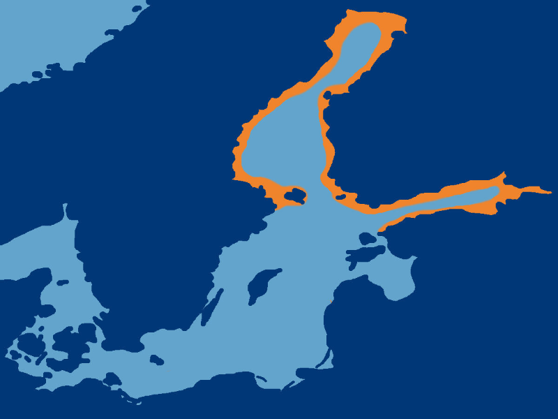
>
> __Verbreitung:__ Im Golf von Finnland und Bottnischen Meerbusen; küstennah und einmündende Flüsse.
>
> __Häufigkeit:__ regelmäßig
>
> __Gefährdung:__ unklar

## Stint

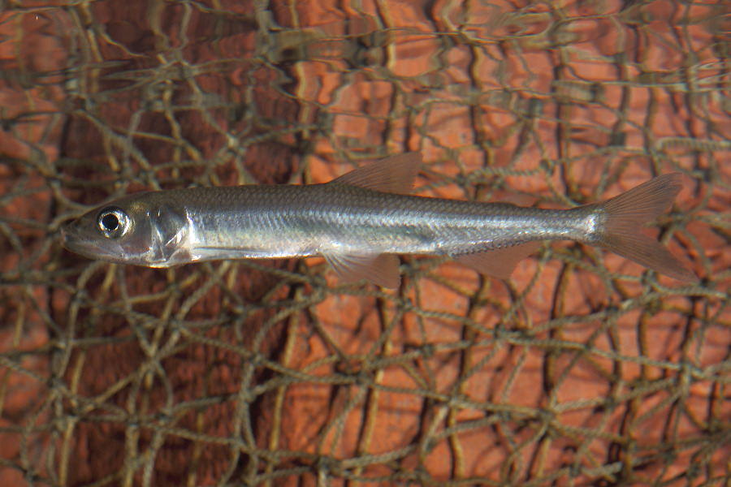
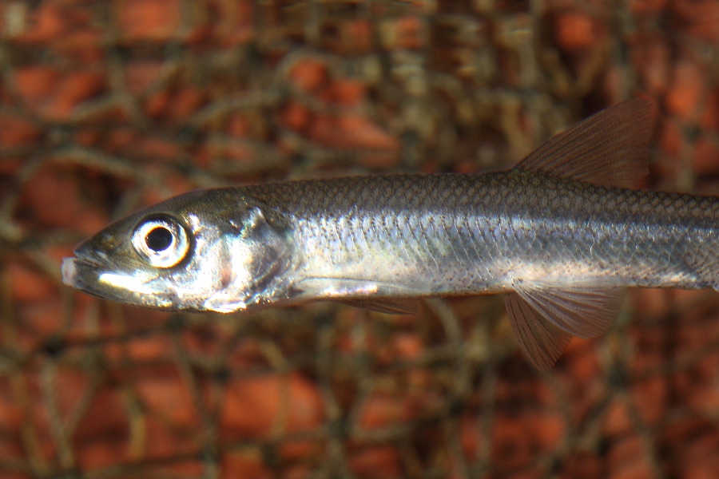

<article class="main-info">

### Erkennungsmerkmale

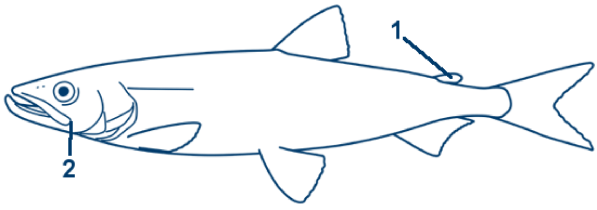

1. Fettflosse
2. lange Maulspalte, reicht bis unter das Auge.

* schlanker Körper mit relativ großen Schuppen (im Vergleich mit Lachsen und Forellen).
* charakteristischer 'gurkenartiger' Geruch.
* nie mit Flecken auf den Flossen.
* Seitenlinie unvollständig.

Meist 8 bis 16 cm, max. 30 cm Länge.

### Ähnliche Arten

* [Kleine Maräne](#kleine-maräne) - Maul deutlich kleiner; Seitenlinie vollständig.

### Lebensweise

Küstennaher Schwarmfisch in 12 bis 30 m Tiefe; nach ereichen der Laichzeit, mit 1 bis 2 Jahren, wandern sie flussaufwärts; Weibchen legen 8.000 bis 50.000 Eier über sandigem oder kiesigem Grund.
Viele Tiere sterben nach dem Laichen.

### Ernährung

Zooplankton; meist Krebstiere, deren Larven und verschiedene andere Larven, selten auch Jungfische.

### Bedeutung

Wirtschaftliche Bedeutung als Speisefisch, zur Öl- und Futtermittelherstellung.

### Gefährdung

Generell vermutlich nicht gefährdet; jedoch sind viele lokal begrenzte Populationen durch Verbauung und Verschmutzung der Gewässer bedroht.

</article>

<!-- class="sub-info" -->
> #### Osmerus eperlanus
>
> __Familie:__ Osmeridae
>
> __Ordnung:__ Osmeriformes
>
> 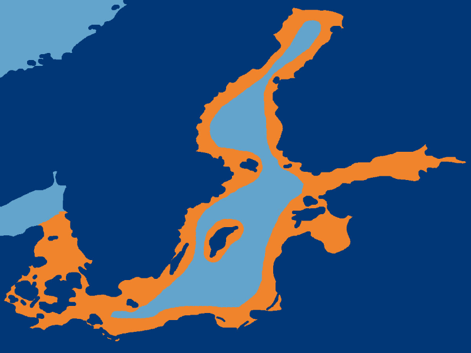
>
> __Verbreitung:__ Gesamte küstennahe Ostsee und einmündende Flüsse.
>
> __Häufigkeit:__ sehr häufig
>
> __Gefährdung:__ nicht gefährdet

## Buckellachs

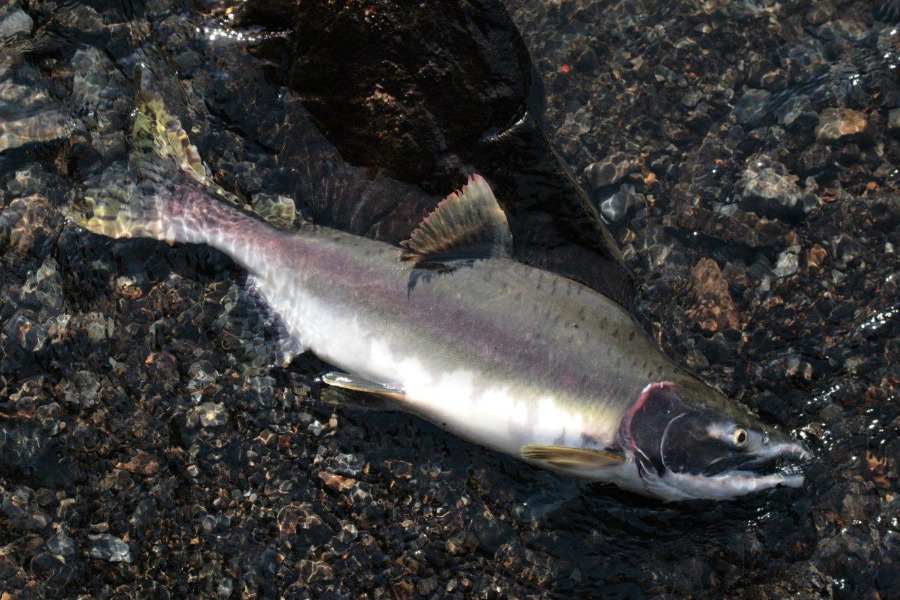
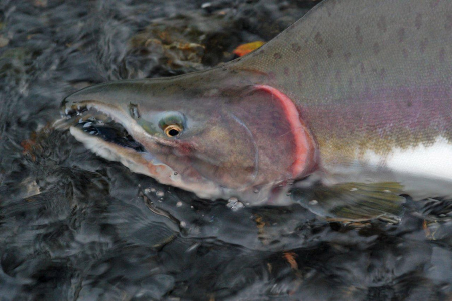
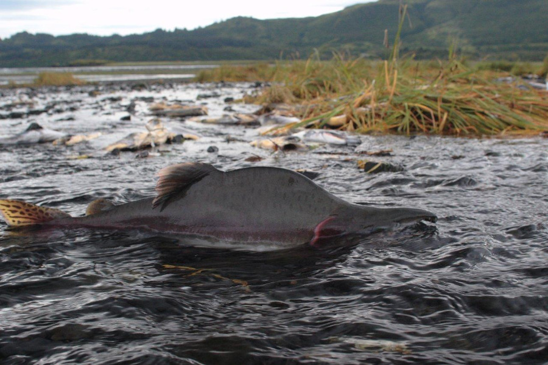

<article class="main-info">

_D-Buckellachs;_
_GB-Pink salmon;_
_DK-Pukkellaks;_
_PL-Gorbusza;_
_EST-Gorbuuša;_
_RU-Горбуша;_
_FIN-Kyttyrälohi;_
_S-Puckellax_

### Erkennungsmerkmale

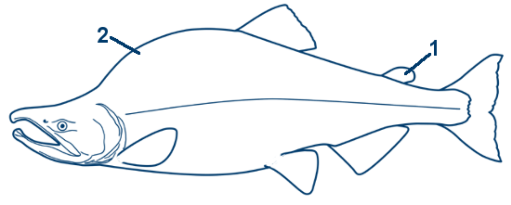

1. Fettflosse vorhanden.
2. Männchen während der Laichzeit mit ausgeprägtem Buckel.

* Schwarze Flecken auf der Schwanzflosse.
* Flanken silbern bis grau, braun oder grün, aber ohne rötliches Band.

Meist 50 cm, max. 76 cm Länge

### Ähnliche Arten

* [Regenbogenforelle](#regenbogenforelle) - rötlich-rosa Kiemendecken und Streifen auf der Flanke.
* [Lachs](#lachs) - Schwanzflosse ohne schwarze Flecken.
* [Meerforelle](#meerforelle) - Schwanzflosse ohne schwarze Flecken.

### Lebensweise

Nach erreichen der Geschlechtsreife mit 2 Jahren, wandern die Tiere flussaufwärts.
Die Weibchen bauen 1 bis 4 Nester auf dem Grund, in die jeweils 50 bis 1200 Eier gelegt werden.
Männchen und Weibchen bewachen die Nester.
Nach dem Laichen sterben alle Tiere.

### Ernährung

Fisch, Weich- und Krebstiere.

### Bedeutung

Sehr hohe wirtschaftliche Bedeutung als Speisefisch, in Aquakultur und als Angelfisch.

### Gefährdung

Nicht heimisch in der Ostsee.

</article>

<!-- class="sub-info" -->
> #### Oncorhynchus gorbuscha
>
> __Familie:__ Salmonidae
>
> __Ordnung:__ Salmoniformes
>
> 
>
> __Verbreitung:__ Sehr selten, nur durch Besatzmaßnahmen.
>
> __Häufigkeit:__ sehr selten
>
> __Gefährdung:__ nicht gefährdet

## Mondfisch

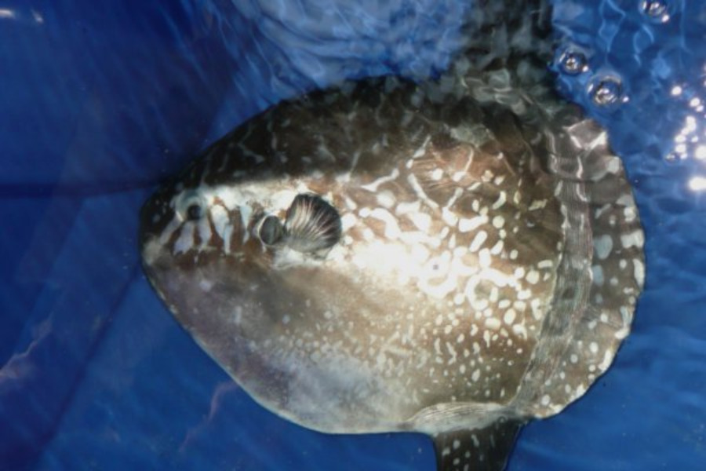
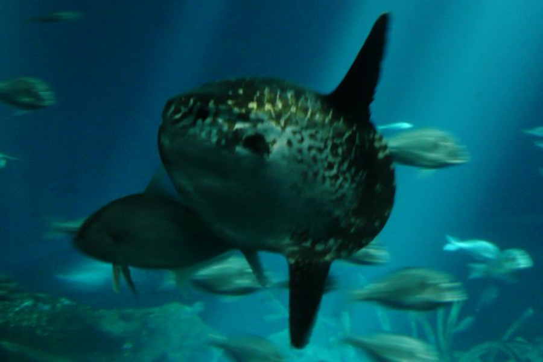
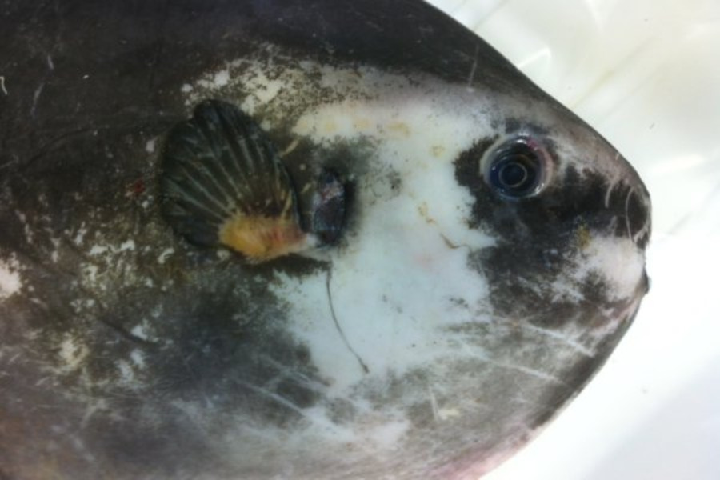

<article class="main-info">

_D-Mondfisch;_
_GB-Ocean sunfish;_
_DK-Klumpfisk;_
_PL-Samogłów;_
_LT-Paprastoji mėnulžuvė;_
_LV-Kuukala;_
_EST-Kuukala;_
_RU-Обыкновенная луна-рыба;_
_FIN-Möhkäkala;_
_S-Klumpfisk_

### Erkennungsmerkmale

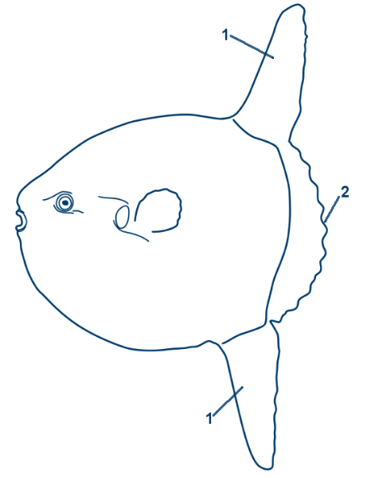

1. Rücken- und Afterflosse lang ausgezogen.
2. Echte Schwanzflosse fehlend.

* Bauchflossen fehlend.
* seitlich abgeflachter, scheibenförmiger Körper.

Bis max. 3 m Länge und bis über 2000 kg Gewicht.

### Ähnliche Arten

Unverwechselbar

### Lebensweise

Lebt im Freiwasser tieferer Meeresbereiche, kann zuweilen aber auch seitlich an der Wasseroberfläche liegend beobachtet werden.
Es können bis zu 300 Millionen Eier abgegeben werden.

### Ernährung

Quallen, Larven von Quallen, Aalen und Kopffüßlern, sowie seltener kleine Fische.

### Bedeutung

Keine wirtschaftliche Bedeutung.

### Gefährdung

Vermutlich nicht gefährdet.

</article>

<!-- class="sub-info" -->
> #### Mola mola
>
> __Familie:__ Molidae
>
> __Ordnung:__ Tetraodontiformes
>
> 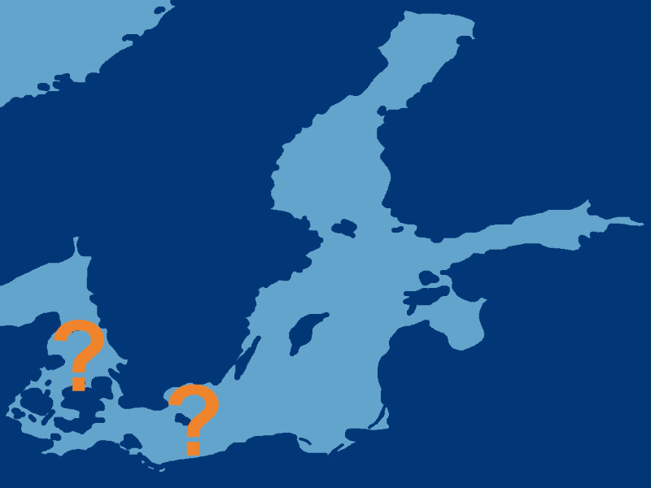
>
> __Verbreitung:__ sehr seltener Irrgast in der Ostsee
>
> __Häufigkeit:__ sehr selten
>
> __Gefährdung:__ nicht gefährdet

## Schwarzer Seeteufel

<article class="main-info">

_D-Schwarzer Seeteufel;_
_GB-Black angler, blackbellied angler;_
_DK- Sort havtaske;_
_PL-Żabnica afrykańska;_
_EST- Mustkõht-merikurat;_
_RU- Чернобрюхий удильщик;_
_FIN- Mustavatsakrotti;_
_S- Mindre marulk_

### Erkennungsmerkmale

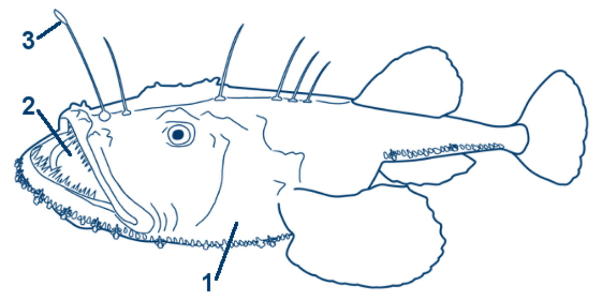

1. Kopf sehr groß und breit.
2. Maul sehr groß, halbkreisförmig.
3. Erster Rückenflossenstrahl zu einer Angel umgebildet.

* Körper abgeflacht; ohne Schuppen.
* 9 bis 10 Strahlen in der 2. Rückenflosse; schwarzes Bauchfell in der Leibeshöhle

Meistens 50 cm, max. 1 m Länge.

### Ähnliche Arten

* [Gemeiner Seeteufel](#gemeiner-seeteufel) - meist deutlich größer; 11 bis 12 Strahlen in der zweiten Rückenflosse; Bauchfell (innen) weiß.

### Lebensweise

Bodenfische auf Sand- und Schlammboden, oft auch teilweise eingegraben.
Vorkommen bis in 1000 m Tiefe.

### Ernährung

Vor allem Fische, die mit seiner Angel angelockt werden.

### Bedeutung

Wirtschaftliche Bedeutung als beliebter und teurer Speisefisch.

### Gefährdung

Vermutlich stark gefährdet durch Überfischung.

</article>

<!-- class="sub-info" -->
> #### Lophius budegassa
>
> __Familie:__ Lophiidae
>
> __Ordnung:__ Lophiiformes
>
> 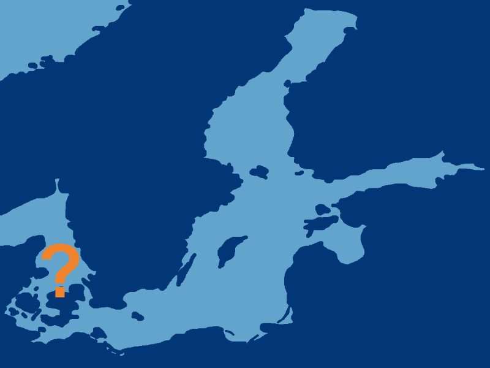
>
> __Verbreitung:__ Seltener Irrgast in der westlichen Ostsee.
>
> __Häufigkeit:__ sehr selten
>
> __Gefährdung:__ stark gefährdet

## Gemeiner Seeteufel

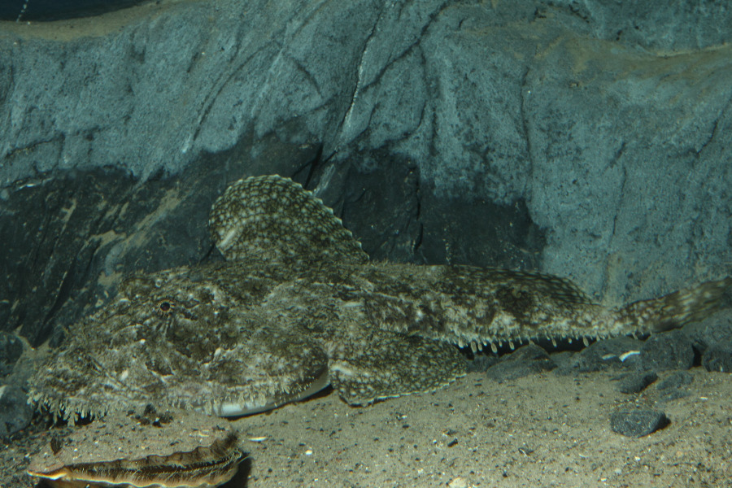

<article class="main-info">

_D-Gemeiner Seeteufel;_
_GB-White angler;_
_DK-Havtaske;_
_PL-Żabnica nawęd;_
_EST-Euroopa merikurat;_
_RU-Европейский удильщик;_
_FIN-Merikrotti;_
_S-Marulk_

### Erkennungsmerkmale

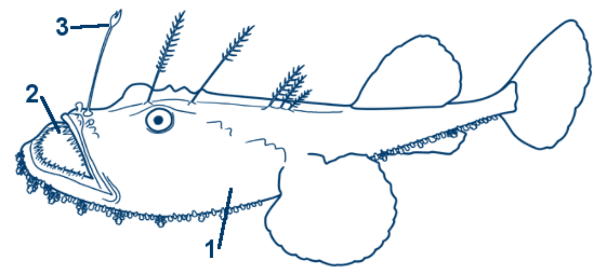

1. Kopf sehr groß und breit.
2. Maul sehr groß, halbkreisförmig.
3. Erster Rückenflossenstrahl zu einer Angel umgebildet.

* Körper abgeflacht; ohne Schuppen.
* 11 bis 12 Strahlen in der 2. Rückenflosse; weißes Bauchfell in der Leibeshöhle.

Meistens 1 m, max. 2 m Länge.

### Ähnliche Arten

Schwarzer Seeteufel - meist deutlich kleiner; 9 bis 10 Strahlen in der zweiten Rückenflosse; Bauchfell (innen) schwarz.

### Lebensweise

Bodenfische auf Sand- und Schlammböden, oft auch teilweise eingegraben.
Vorkommen bis 1000 m Tiefe.
Männchen erreichen mit 4, Weibchen mit 6 Jahren die Geschlechtsreife.
Die etwa 1 Millionen Eier werden durch ein Laichband zusammen gehalten.

### Ernährung

Vor allem Fische, die mit seiner Angel angelockt werden.

### Bedeutung

Wirtschaftliche Bedeutung als beliebter und teurer Speisefisch.

### Gefährdung

In vielen Gebieten stark gefährdet durch Überfischung.

</article>

<!-- class="sub-info" -->
> #### Lophius piscatorius
>
> __Familie:__ Lophiidae
>
> __Ordnung:__ Lophiiformes
>
> 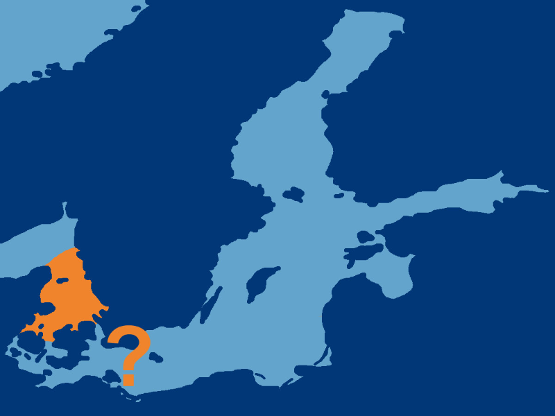
>
> __Verbreitung:__ Selten im Kattegat; Irrgast in der westlichen Ostsee.
>
> __Häufigkeit:__ selten
>
> __Gefährdung:__ gefährdet

## Heringskönig

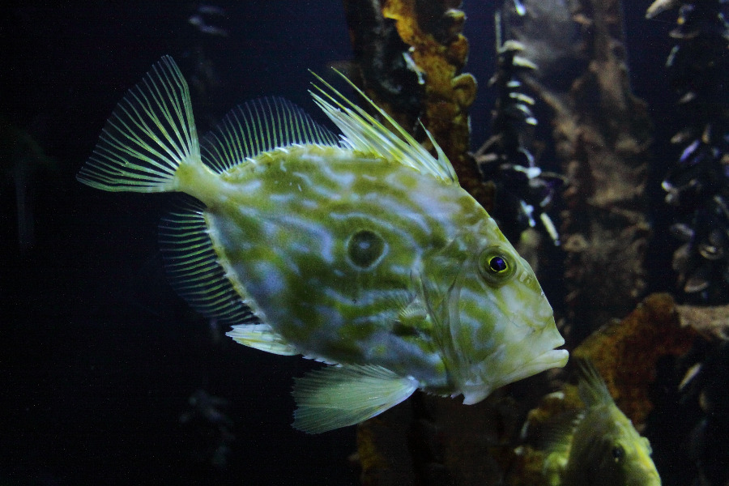
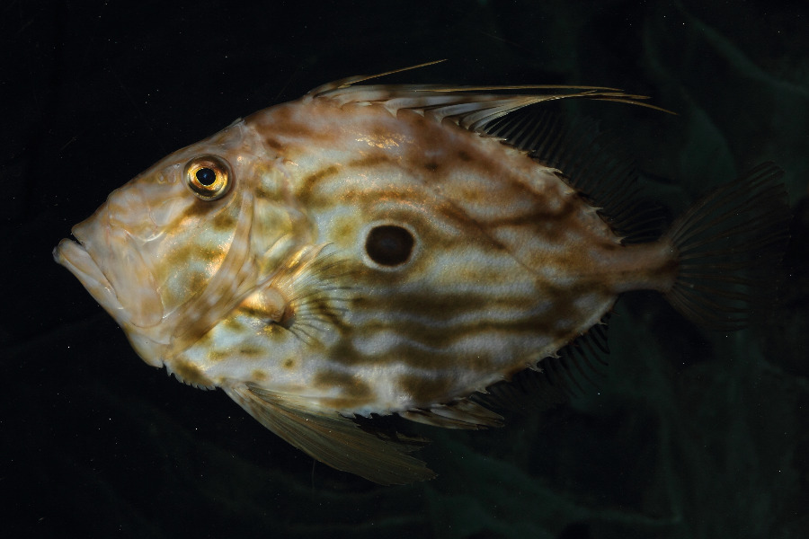

<article class="main-info">

_D-Heringskönig, Petersfisch;_
_GB-John dory;_
_DK-Sankt Petersfisk;_
_PL-Piotrosz, paszczak;_
_EST-Harilik peetrikala;_
_RU-Обыкновенный солнечник;_
_FIN-Pietarinkala;_
_S-Sanktpersfisk_

### Erkennungsmerkmale

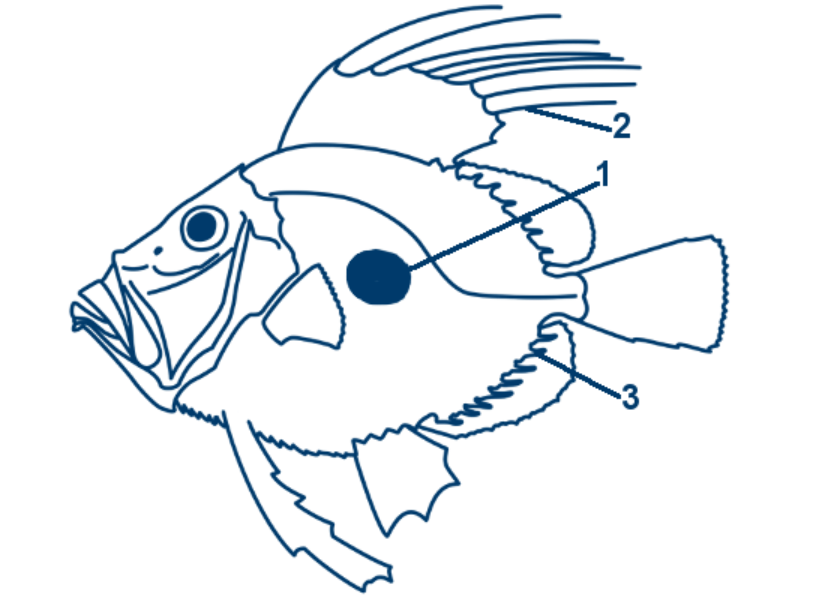

1. großer dunkler Fleck mit hellem Außenring auf der Körperseite.
2. fadenartige Verlängerung der vorderen Rückenflossenhäute.
3. spitze Knochenhöcker entlang der Ansatzstelle der After- und Rückenflosse.

* Maul sehr groß.
* Körper stark seitlich abgeplattet.

Meist 30 bis 40 cm, max. bis 90 cm Länge.

### Ähnliche Arten

Unverwechselbar

### Lebensweise

Lebt als Einzelgänger oder in kleineren Gruppen im offenen Wasser, meist in 50 bis 150 m, max. 400 m Tiefe.
Gilt als guter und ausdauernder Schwimmer.

### Ernährung

Kleine Schwarmfische und Krebs- und Weichtiere, die durch sein vorstülpbares Maul eingesaugt werden.

### Bedeutung

Wirtschaftliche Bedeutung als beliebter und teurer Speisefisch.

### Gefährdung

Unklar.

</article>

<!-- class="sub-info" -->
> #### Zeus faber
>
> __Familie:__ Zeidae
>
> __Ordnung:__ Zeiformes
>
> 
>
> __Verbreitung:__ Seltener Irrgast in der Ostsee.
>
> __Häufigkeit:__ selten
>
> __Gefährdung:__ unklar

## Sibirischer Stör

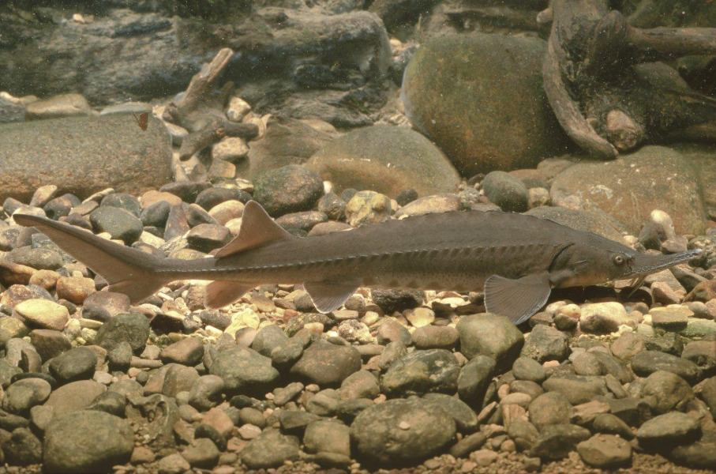
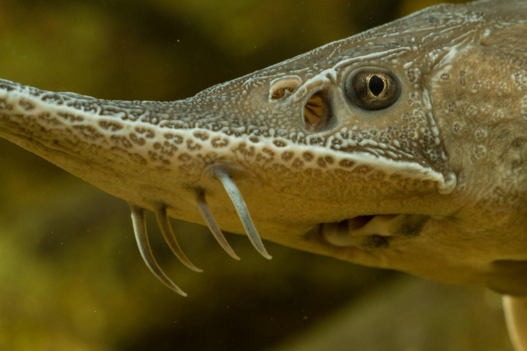
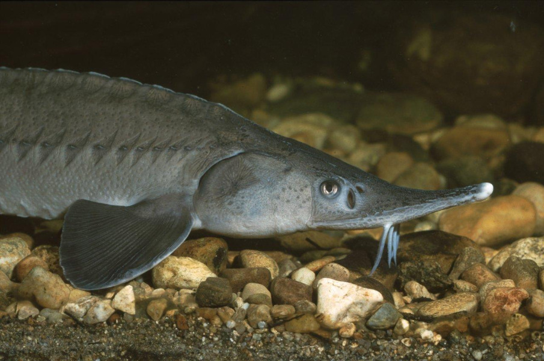

<article class="main-info">

_D-Sibirischer Stör;_
_GB-Sibirian sturgeon;_
_DK-Sibirisk stør;_
_PL-Jesiotr syberyjski;_
_EST-Siberi tuur;_
_RU-Сибирский осётр;_
_FIN-Siperiansampi;_
_S-Sibirisk stör_

### Erkennungsmerkmale

1. Schnauze eher lang (Strecke von der Schnauzenspitze bis zum Auge etwa gleich lang wie vom Auge bis zum Ende des Kiemendeckels).
2. Seitenschilder eher klein.
3. keine Hautverknöcherungen (Dentikel) zwischen Rücken- und Seitenschildern.

Bis max. 2 m Länge.

### Ähnliche Arten

* [Atlantischer Stör](#atlantischer-stör) - Dentikel zwischen Rücken- und Seitenschildern.
* [Waxdick](#waxdick) - Schnauze kurz; Dentikel zwischen Rücken- und Seitenschildern.
* [Sterlet](sterlet) - Barteln gefiedert.

### Lebensweise

Heimisch in tieferen Bereichen großer nordrussischer und sibirischer Flusssysteme.
Die Geschlechtsreife erreichen die Männchen mit 11 bis 24 und die Weibchen sogar erst mit 20 bis 28 Jahren.
Es gibt sowohl ortsgebundene, als auch wandernde Formen.

### Ernährung

Bodenorganismen wie Krebstiere und Mückelarven.

### Bedeutung

Wirtschaftliche Bedeutung als Speisefisch und zur Kaviarproduktion; teilweise in Aquakultur.

### Gefährdung

In der Ostee nicht gefährdet, da dort nicht heimisch.

</article>

<!-- class="sub-info" -->
> #### Acipenser baerii
>
> __Familie:__ Acipenseridae
>
> __Ordnung:__ Acipenseriformes
>
> 
>
> __Verbreitung:__ Nicht heimisch in der Ostsee, jedoch regelmäßige Gefangenschaftsflüchtlinge.
>
> __Häufigkeit:__ sehr selten
>
> __Gefährdung:__ stark gefährdet

## Waxdick

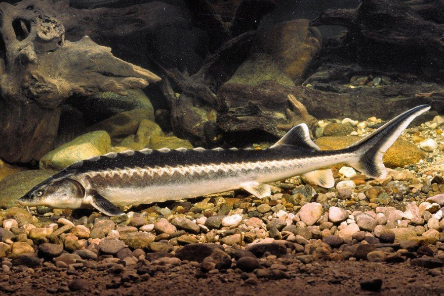

<article class="main-info">

_D-Waxdick;_
_GB-Danube sturgeon, Russian sturgeon;_
_DK-Russisk stør;_
_PL-Jesiotr rosyjski;_
_LT-Rusiškasis eršketas;_
_EST-Vene tuur;_
_RU-Русский осётр;_
_FIN-Venäjänsampi;_
_S-Rysk stör_

### Erkennungsmerkmale

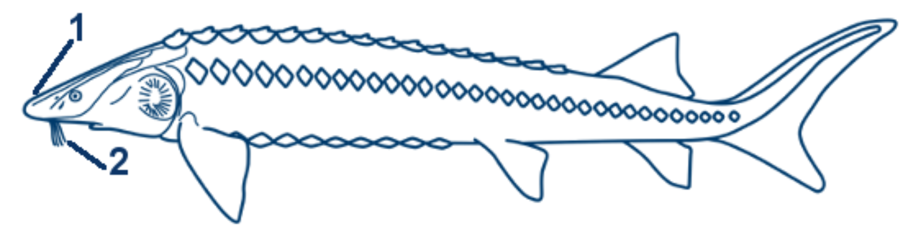

1. Schnauze kurz (Strecke von der Schnauzenspitze bis zum Auge viel kürzer als vom Auge bis zum Ende des Kiemendeckels).
2. Ansatz der vier nicht-gefiederten Barteln näher an der Schnauzenspitze, als am Maul.

* Zahlreiche sternförmige Hautverknöcherungen (Dentikel) zwischen Rücken- und Seitenschildern.
* Flanken häufig von mit goldener Färbung

Normalerweise kleiner als 2 m; früher vielleicht über 3 m.

### Ähnliche Arten

* [Atlantischer Stör](#atlantischer-stör) - Schnauze lang.
* [Sibirischer Stör](#sibirischer-stör) - Schnauze lang.
* [Sterlet](#sterlet) - Schnauze lang; Barteln gefiedert.

### Lebensweise

In Flüssen, als auch Brackwasserbeeichen vom Schwarzen und Kaspischen Meer.
Erreichen der Geschlechtsreife mit 8 bis 13 Jahren bei den Männchen und erst 10 bis 16 Jahren bei den Weibchen.

### Ernährung

Hauptsächlich bodenbewohnende Weichtiere, aber auch Krebstiere und kleine Fische.

### Bedeutung

Sehr hohe wirtschaftliche Bedeutung als Speisefisch und zur Kaviarproduktion: Handelsname des Kaviar "Ossietra".

### Gefährdung

Nicht heimisch in der Ostsee.
In seinem natürlichen Verbreitungsgebieten (Schwarzes Meer und Kaspisches Meer) durch Überfischung vom Aussterben bedroht.

</article>

<!-- class="sub-info" -->
> #### Acipenser gueldenstaedtii
>
> __Familie:__ Acipenseridae
>
> __Ordnung:__ Acipenseriformes
>
> 
>
> __Verbreitung:__ Nicht heimisch in der Ostsee, nur Gefangenschaftsflüchtlinge.
>
> __Häufigkeit:__ sehr selten
>
> __Gefährdung:__ stark gefährdet

## Sterlet

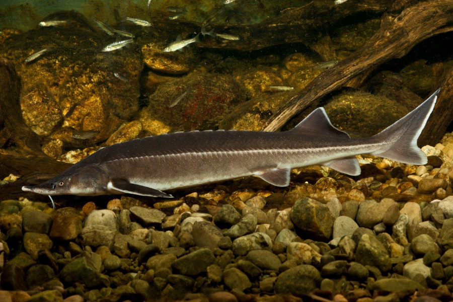
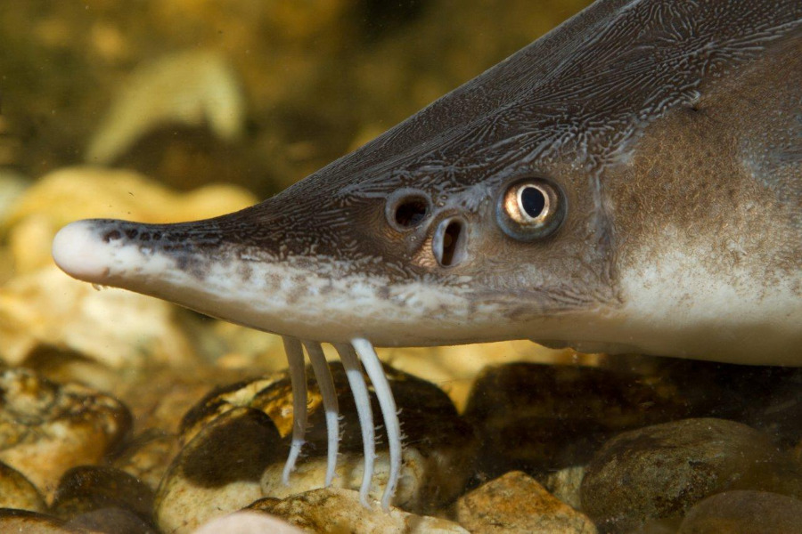
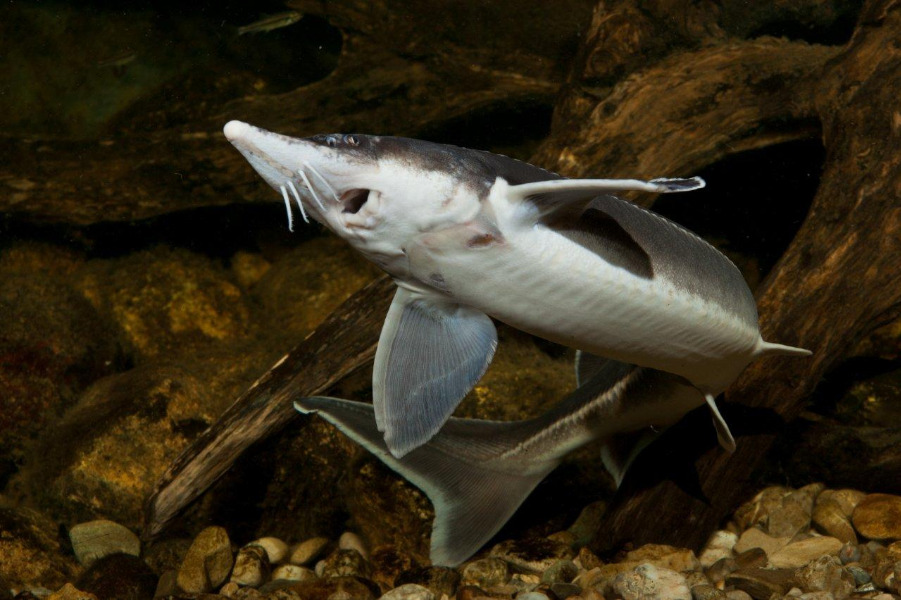

<article class="main-info">

_D-Sterlet;_
_GB-Sterlet, sterlet sturgeon;_
_DK-Sterlet;_
_PL-Sterlet;_
_EST-Sterlet;_
_RU-Стерлядь;_
_FIN-Sterletti;_
_S-Sterlett_

### Erkennungsmerkmale

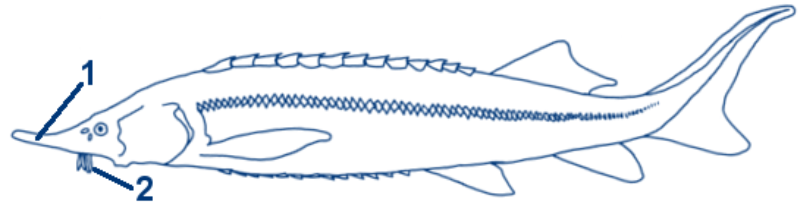

1. Schnauze lang (Strecke von der Schnauzenspitze bis zum Auge länger als vom Auge bis zum Ende des Kiemendeckels).
2. vier gefiederte Barteln an der Schnauzenunterseite.

* Seitenschilder klein und zahlreich (56 bis 71).
* keine Hautverknöcherungen (Dentikel) zwischen Rücken- und Seitenschildern.

Meist um 40 cm, max. bis 1,2 m Länge und 16 kg Gewicht.

### Ähnliche Arten

* [Atlantischer Stör](#atlantischer-stör) - ungefiederte Barteln; große Seitenschilder; Dentikel zwischen Rücken- und Seitenschildern.
* [Sibirischer Stör](#sibirischer-stör) - ungefiederte Barteln.
* [Waxdick](#waxdick) - Schnauze kurz; ungefiederte Barteln.

### Lebensweise

Ortsgebundener Süßwasserbewohner, bis auf wenige Ausnahmen im nördlichen Teil des Kaspischen Meeres.
Nach erreichen der Geschlechtsreife, Männchen nach 3 bis 5 und Weibchen nach 5 bis 8 Jahren, können bis zu 135.000 Eier gelegt werden.

### Ernährung

Bodenlebende Insektenlarven, andere Wirbellose und auch Fischlaich.

### Bedeutung

Wir
tschaftliche Bedeutung zur Fleisch- und Kaviarproduktion; häufiger Zuchtfisch in Aquakulturen.
### Gefährdung

Nicht heimisch in der Ostsee.
Im ursprünglichen Verbreitungsgebiet durch Überfischung und den Verlust von Laichgründen gefährdet.

</article>

<!-- class="sub-info" -->
> #### Acipenser ruthenus
>
> __Familie:__ Acipenseridae
>
> __Ordnung:__ Acipenseriformes
>
> 
>
> __Verbreitung:__ Nicht heimisch in der Ostsee, nur Gefangenschaftsflüchtlinge.
>
> __Häufigkeit:__ sehr selten
>
> __Gefährdung:__ gefährdet

## Maifisch

<article class="main-info">

_D-Maifisch, Alse;_
_GB-Allis shad;_
_DK-Majsild;_
_PL-Aloza;_
_LT-Alsė;_
_LV-Aloza;_
_EST-Aloosa;_
_RU-европейская алоза;_
_FIN-Pilkkusilli;_
_S-Majfisk_

### Erkennungsmerkmale

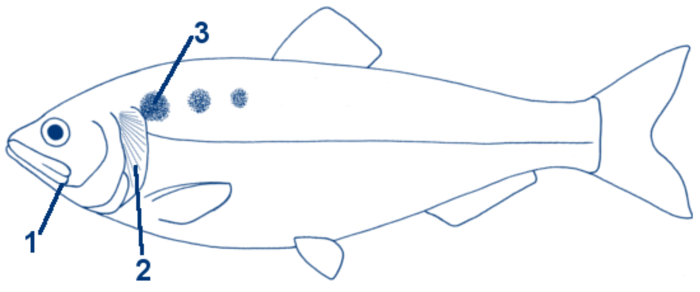

1. Maulspalte reicht bis zur Höhe des Augenhinterrandes.
2. Kiemendeckel mit Streifung.
3. 1 bis 6 schwarze Flecken auf der Seite.

* Bauchkante mit leichtem Kiel.
* Maul leicht oberständig (der Unterkiefer ragt weiter vor als der Oberkiefer).
* 90 bis 120 Kiemenreusendornen und 70 bis 80 Schuppen in der Seitenlinie.

Meist um 40 cm Länge, max. bis 80 cm Länge und 4 kg Gewicht.

### Ähnliche Arten

* [Finte](#finte) - 6 bis 10 schwarze Flecken auf der Seite; 40 bis 60 Kiemenreusendornen; 60 bis 65 Schuppen entlang der Seite.
* [Hering](#hering) - Maulspalte kürzer, reicht nicht bis zur Höhe des Augenhinterrandes.
* [Sprotte](#sprotte) - Maulspalte kürzer, reicht nicht bis zur Höhe des Augenhinterrandes.

### Lebensweise

Lebt in Schwärmen in tieferen Freiwasserzonen; zum Laichen wandern sie sehr weit flussaufwärts.
Erreichen der Laichreife der Männchen mit 3 bis 9 Jahren und der Weibchen mit 4 bis 12 Jahren.
Viele Individuen sterben nach dem Laichen.

### Ernährung

Zooplankton, meist kleine Krebstiere und deren Larven.

### Bedeutung

Früher große wirtschaftliche Bedeutung als Speisefisch, heute vor allem durch geringe Bestände nur noch von lokaler Bedeutung in einigen Mittelmeerregionen.

### Gefährdung

Durch Gewässerverschmutzung, Verbauung und langsame Reproduktionsrate sehr selten geworden.

</article>

<!-- class="sub-info" -->
> #### Alosa alosa
>
> __Familie:__ Clupeidae
>
> __Ordnung:__ Clupeiformes
>
> 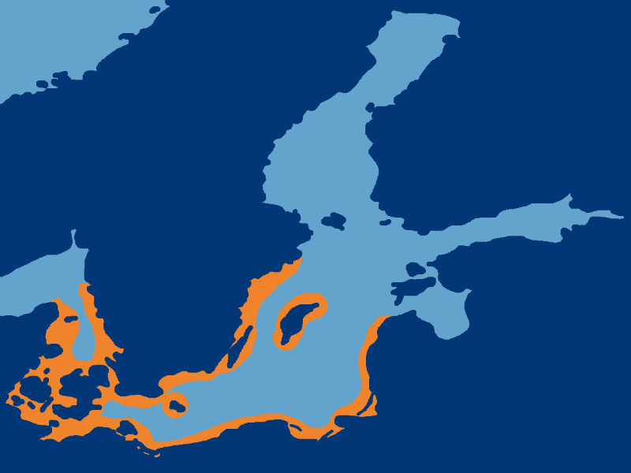
>
> __Verbreitung:__ Sehr selten in der Ostsee.
>
> __Häufigkeit:__ sehr selten
>
> __Gefährdung:__ gefährdet

## Finte

<article class="main-info">

_D-Finte;_
_GB-Twaite shad, twait shad;_
_DK-Stamsild;_
_PL-Parposz;_
_LT-Perpelė;_
_LV-Palede;_
_EST-Vintaloosa;_
_RU-Финта;_
_FIN-Täpläsilli;_
_S-Staksill_
### Erkennungsmerkmale

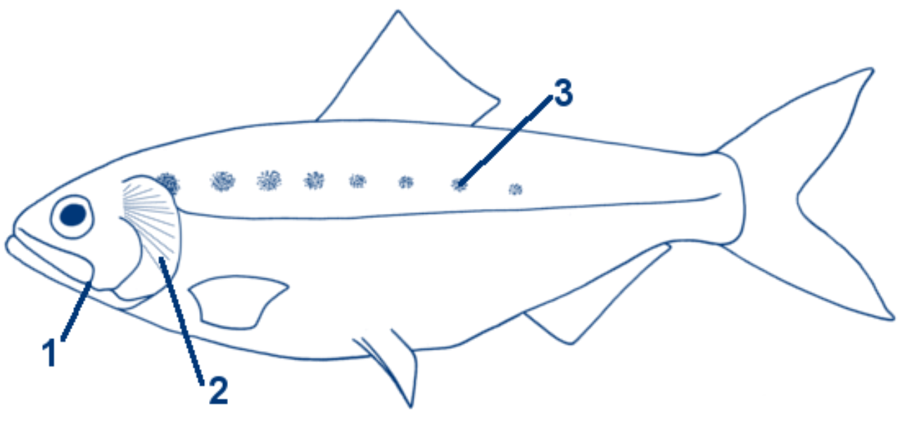

1. Maulspalte reicht bis zur Höhe es Augenhinterrandes.
2. Kiemendeckel mit Streifung.
3. 6 bis 10 schwarze Flecken auf der Seite.

* Bauchkante mit leichtem Kiel.
* Maul leicht oberständig (der Unterkiefer ragt weiter vor als der Oberkiefer).
* 40 bis 60 Kiemenreusendornen und 60 bis 65 Schuppen in der Seitenlinie.

Meist um 40 cm Länge, max. bis 60 cm Länge und 1,5 kg Gewicht.

### Ähnliche Arten

* [Maifisch](#maifisch) - 1-6 schwarze Flecken auf der Seite; 90-120 Kiemenreusendornen; 70-80 Schuppen in einer Längsreihe.
* [Hering](#hering) - Maulspalte kürzer, reicht nicht bis zum Augenhinterrand.
* [Sprotte](#sprotte) - Maulspalte kürzer, reicht nicht bis zum Augenhinterrand.

### Lebensweise

Lebt küstennah in Schwärmen; zum Laichen wandern sie in Flussmündungen oder flussaufwärts.
Nach dem Laichen kehren sie zurück ins Meer.
Die Eier und später die Jungfische verbleiben im Süßwasser bis sie eine Größe von ca. 5 bis 10 cm erreicht haben.

### Ernährung

Zooplankton: meist kleine Krebstiere und deren Larven, aber auch kleine Fische.

### Bedeutung

Früher mäßige wirtschaftliche Nutzung, heute nur noch lokal in einigen Mittelmeerregionen.

### Gefährdung

Durch Gewässerverschmutzung und Verbauung sind die Bestände stark zurück gegangen.

</article>

<!-- class="sub-info" -->
> #### Alosa fallax
>
> __Familie:__ Clupeidae
>
> __Ordnung:__ Clupeiformes
>
> 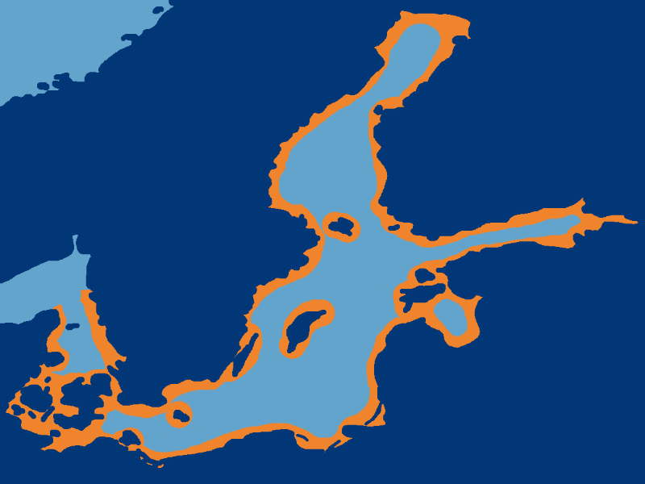
>
> __Verbreitung:__ Selten in der Ostsee.
>
> __Häufigkeit:__ selten
>
> __Gefährdung:__ gefährdet

## Hering

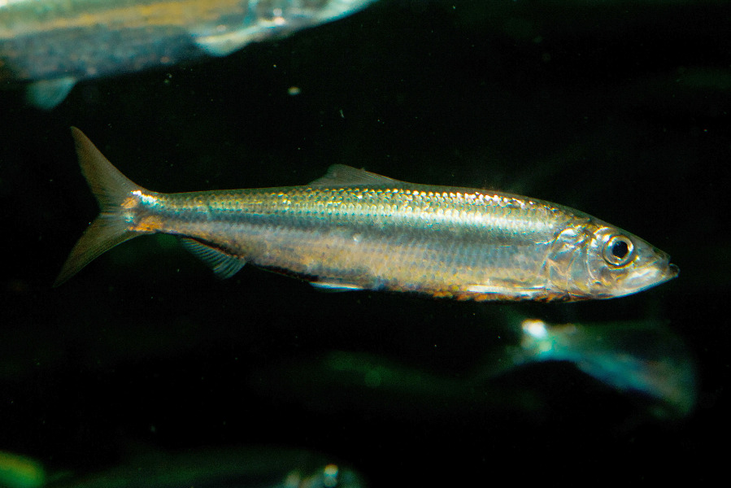
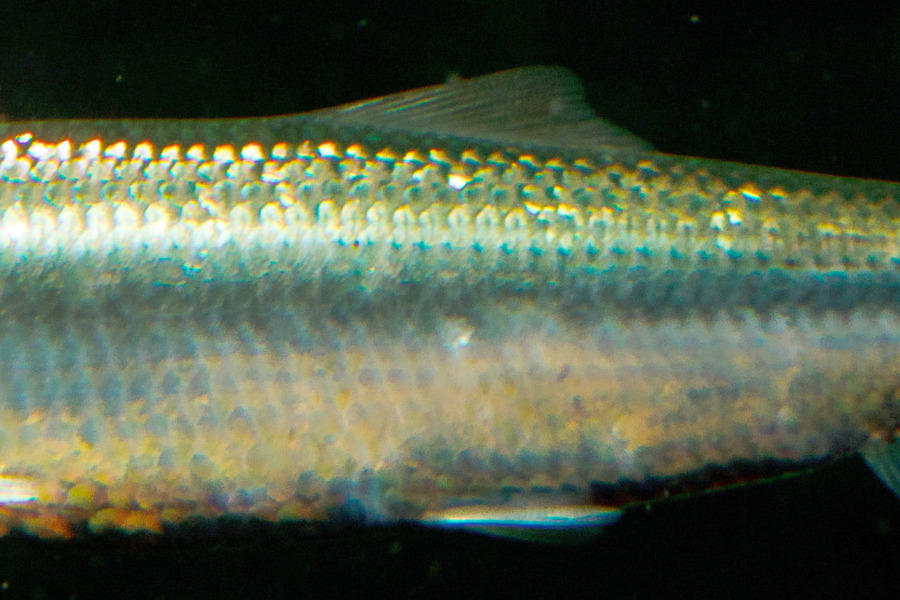
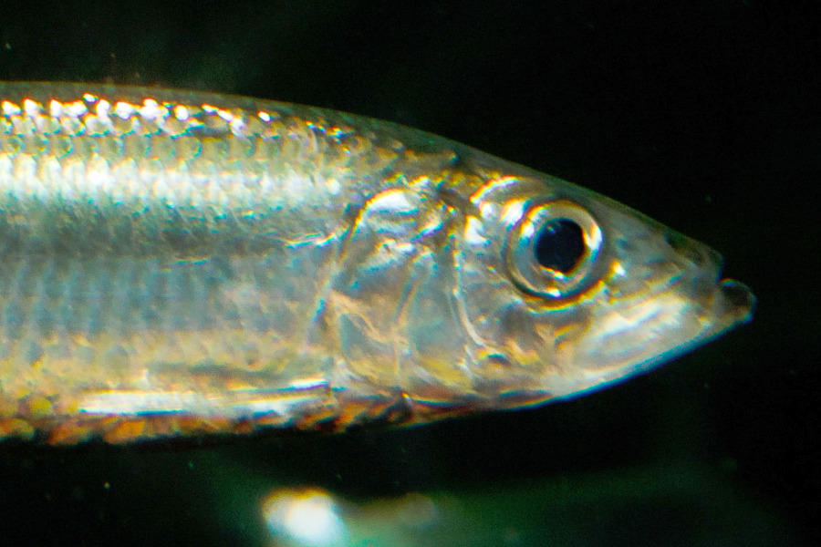

<article class="main-info">

_D-Hering;_
_GB-Herring;_
_DK-Sild;_
_PL-Śledź oceaniczny;_
_LT-Silkė;_
_LV-Siļķe;_
_EST-Heeringas;_
_RU-Атлантическая сельдь;_
_FIN-Silli;_
_S-Sill_

### Erkennungsmerkmale

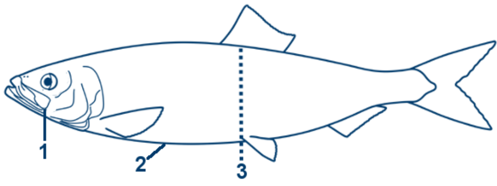

1. Maulspalte reicht nicht bis zur Höhe es Augenhinterrandes.
2. Bauchkante nicht gesägt.
3. Ansatz der Bauchflossen hinter dem Ansatz der Rückenflosse.

* Maul oberständig (der Unterkiefer ragt weiter vor als der Oberkiefer).
* Körper bläulich oder grünlich silbern, Rücken dunkler.

Meist um 30 cm Länge, max. bis 45 cm Länge und 1 kg Gewicht.

### Ähnliche Arten

* [Sprotte](#sprotte) - Bauchflossenansatz vor dem Rückenflossenansatz; Bauchkante gesägt.
* [Maifisch](#maifisch) - Maulspalte größer, reicht bis zur Höhe des Augenhinterrandes.
* [Finte](#finte) - Maulspalte größer, reicht bis zur Höhe des Augenhinterrandes.
* [Sardelle](#sardelle) - Maul stark unterständig.

### Lebensweise

Lebt in großen Schwärmen im Freiwasser, bis in 200 m Tiefe.
Tagsüber häufig in tiefen Bereichen, nachts oberflächennah auf Futtersuche.
Nach dem Laichen sinken die Eier auf den Meeresgrund und bilden dort häufig dicke Schichten.

### Ernährung

Weich- und Krebstiere und deren Larven.

### Bedeutung

Sehr hohe wirtschaftliche Bedeutung als Speisfisch, in der Fischölproduktion und zur Fischmehlherstellung.
Über 300.000 t Hering werden jährlich in der Ostsee gefangen.

### Gefährdung

Starke Befischung und Einflüsse des Klimawandels führen zu rückläufiger Entwicklung der Bestände.

</article>

<!-- class="sub-info" -->
> #### Clupea harengus
>
> __Familie:__ Clupeidae
>
> __Ordnung:__ Clupeiformes
>
> 
>
> __Verbreitung:__ Gesamte Ostsee.
>
> __Häufigkeit:__ sehr häufig
>
> __Gefährdung:__ unklar

## Sprotte

<article class="main-info">

_D-Sprotte;_
_GB-Sprat, european sprat;_
_DK-Brisling;_
_PL-Szprot;_
_LT-Šprotas;_
_LV-Brētliņa;_
_EST-Kilu, läänemere kilu;_
_RU-Европейский шпрот;_
_FIN-Kilohaili;_
_S-Skarpsill_

### Erkennungsmerkmale

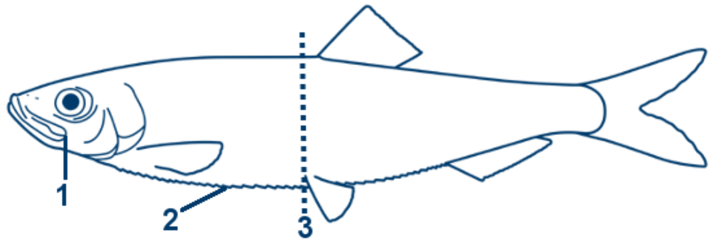

1. Maulspalte reicht nicht bis zur Höhe des Augenhinterrandes.
2. Bauchkante gesägt.
3. Ansatz der Bauchflossen vor dem Ansatz der Rückenflosse.

* Maul oberständig (der Unterkiefer ragt weiter vor als der Oberkiefer).

Meist um 12 cm Länge, max. bis 16 cm Länge.

### Ähnliche Arten

* [Hering](#hering) - Bauchflossenansatz hinter dem Rückenflossenansatz; Bauchkante nicht gesägt.
* [Sardelle](#sardelle) - Maul stark unterständig.
* [Maifisch](#maifisch) - Maulspalte größer, reicht bis hinter den Augenhinterrand.
* [Finte](#finte) - Maulspalte größer, reicht bis hinter den Augenhinterrand.

### Lebensweise

Leben in Schwärmen im küstennahen Freiwasser; meist in 5 bis 50 m Tiefe; tagsüber in Bodennähe, nachts zur Oberfläche aufsteigend.
Laichreife tritt meist nach 2 Jahren ein.

### Ernährung

Zooplankton: meist Krebstiere und deren Larven.

### Bedeutung

Sehr hohe wirtschaftliche Bedeutung als Speisfisch, Köderfisch, in der Fischölproduktion und zur Fischmehlherstellung.

### Gefährdung

Nicht gefährdet.

</article>

<!-- class="sub-info" -->
> #### Sprattus sprattus
>
> __Familie:__ Clupeidae
>
> __Ordnung:__ Clupeiformes
>
> 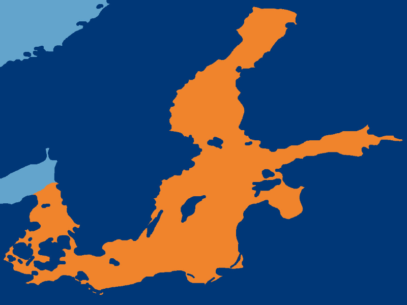
>
> __Verbreitung:__ Sehr häufig in der gesamten Ostsee.
>
> __Häufigkeit:__ sehr häufig
>
> __Gefährdung:__ unklar

## Sardelle

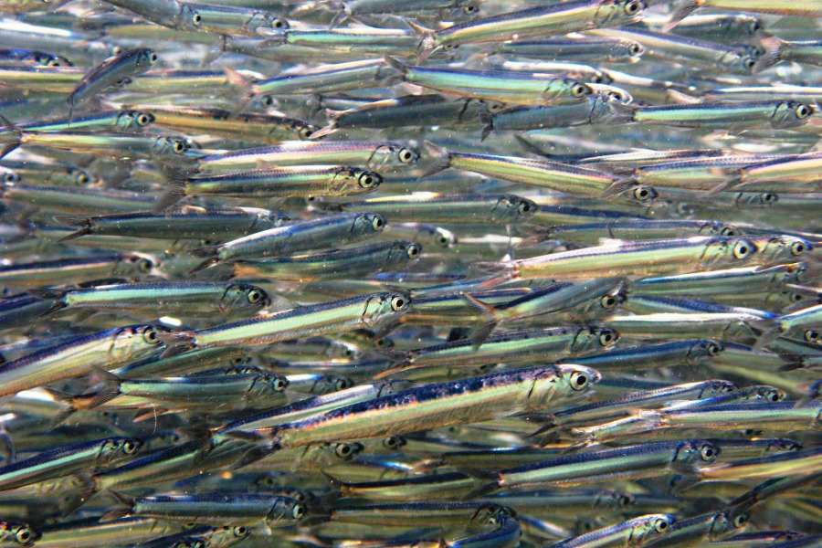

<article class="main-info">

_D-Sardelle;_
_GB-European anchovy;_
_DK-Ansjos; PL-Sardela europejska, chamsa, sardela;_
_LT-Ančiuvis;_
_LV-Anšovs;_
_EST-Anšoovis;_
_RU-Европейский анчоус;_
_FIN-Sardelli;_
_S-Ansjovis_

### Erkennungsmerkmale

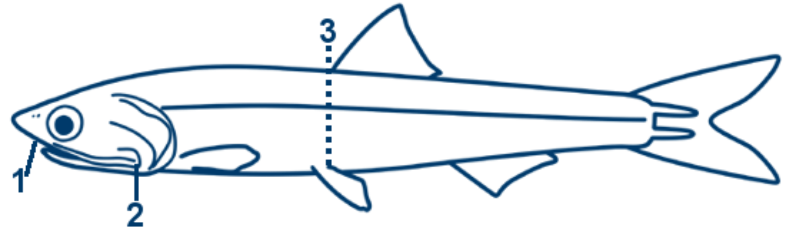

1. Maul deutlich unterständig (der Oberkiefer überragt den Unterkiefer).
2. Maulspalte reicht weit hinter das Auge.
3. Ansatz der Bauchflossen deutlich vor dem Ansatz der Rückenflosse.

Meist um 13 cm Länge, max. bis 20 cm Länge.

### Ähnliche Arten

* [Hering](#hering) - Maul oberständig, Maulspalte kürzer.
* [Sprotte](#sprotte) - Maul oberständig, Maulspalte kürzer.

### Lebensweise

Leben in Schwärmen im Freiwasser, während der Sommermonate halten sie sich in Küstennähe und häufig auch im Brackwasser auf; erreichen der Laichreife mit 2 Jahren.

### Ernährung

Zooplankton.

### Bedeutung

Im üblichen Verbreitungsgebiet sehr hohe wirtschaftliche Bedeutung als Speisefisch, Köderfisch, in der Fischölproduktion und zur Fischmehlherstellung.

### Gefährdung

Vermutlich nicht gefährdet.

</article>

<!-- class="sub-info" -->
> #### Engraulis encrasicolus
>
> __Familie:__ Engraulidae
>
> __Ordnung:__ Clupeiformes
>
> 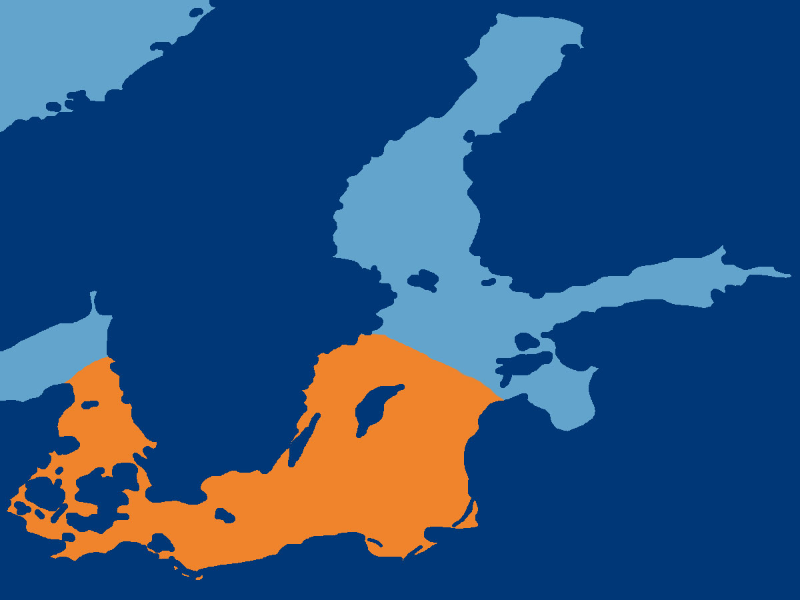
>
> __Verbreitung:__ Regelmäßig vorkommender Gast in der Ostsee.
>
> __Häufigkeit:__ regelmäßig
>
> __Gefährdung:__ nicht gefährdet

## Plötze

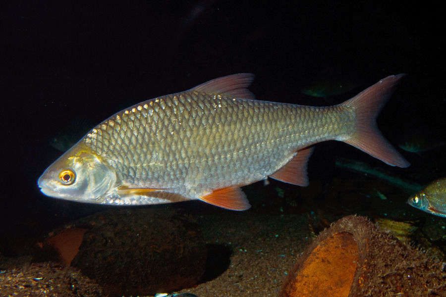
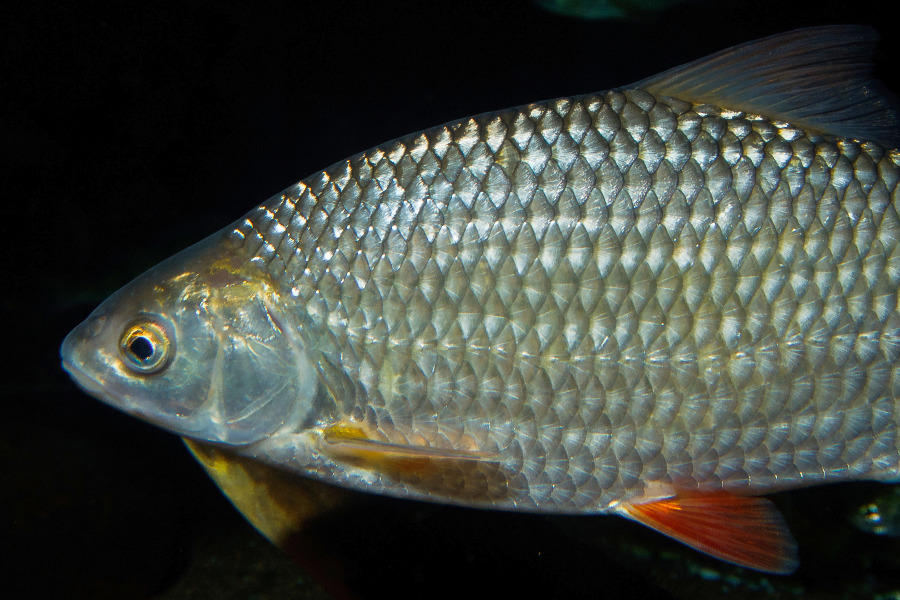
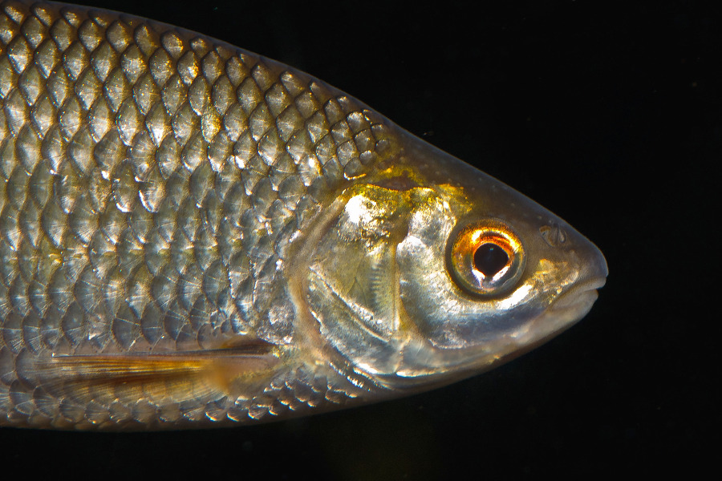

<article class="main-info">

_D-Plötze, Rotauge;_
_GB-Roach;_
_DK-Skalle, gråskalle;_
_PL-Płoć, plotka;_
_LT-Kuoja;_
_LV-Rauda;_
_EST-Särg;_
_RU-Обыкновенная плотва;_
_FIN-Särki, särkien;_
_S-Mört_

### Erkennungsmerkmale

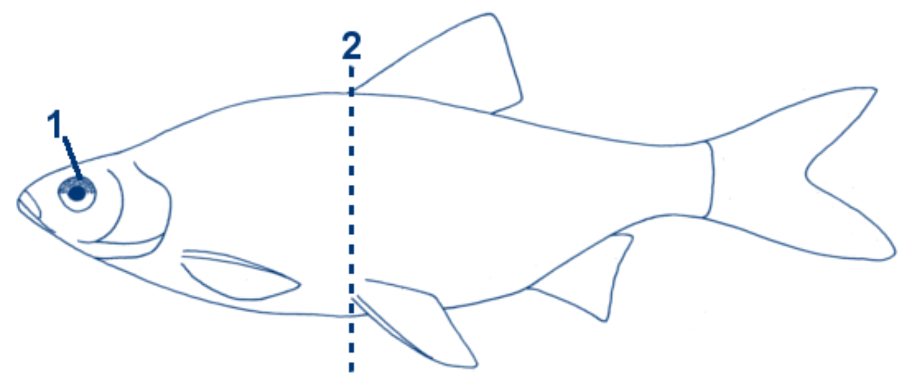

1. Obere Hälfte der Iris rot gefärbt.
2. Bauchflossen und Rückenflosse beginnen auf derselben Höhe.

* Meist relativ hochrückig- die Körperform hängt jedoch stark von der Ernährung ab.
* Körper einheitlich silbern; Brust-, Bauch- und Afterflosse rötlich.

Meist 20 bis 30 cm, max. 40 cm Länge.

### Ähnliche Arten

* [Rotfeder](#rotfeder) -
  Rückenflosse beginnt hinter dem Ansatz der Bauchflossen;
  zwischen Bauch- und Afterflossen verläuft ein Reihe gekielter Schuppen;
  Mundspalte viel steiler nach oben gestellt, als bei der Plötze.
* [Aland](#aland) -
  meist schlanker;
  kleinere Schuppen, 55-61 in der Seitenlinie (39-48 bei der Plötze)
* [Güster](#güster) -
  Basis der Afterflosse mindestens doppelt so lang, wie die Basis der Rückenflosse.

### Lebensweise

Lebt in Schwärmen in stehenden oder langsam fließenden Gewässern, häufig auch in Mündungs- und Brackwasserbereichen.
Hohe Toleranz gegenüber organischer Wasserverschmutzung.
In der Laichzeit versammeln sie sich in großen Gruppen an stark bewachsenen Uferzonen.

### Ernährung

Weiche Pflanzenteile, seltener Bodentiere.

### Bedeutung

Wirtschaftliche Bedeutung als Angel-, Köder- und lokal als Speisefisch.

### Gefährdung

Nicht gefährdet.

</article>

<!-- class="sub-info" -->
> #### Rutilus rutilus
>
> __Familie:__ Cyprinidae
>
> __Ordnung:__ Cypriniformes
>
> 
>
> __Verbreitung:__ Im gesamtem küstennahen Bereich der Ostsee.
>
> __Häufigkeit:__ sehr häufig
>
> __Gefährdung:__ nicht gefährdet

## Rotfeder

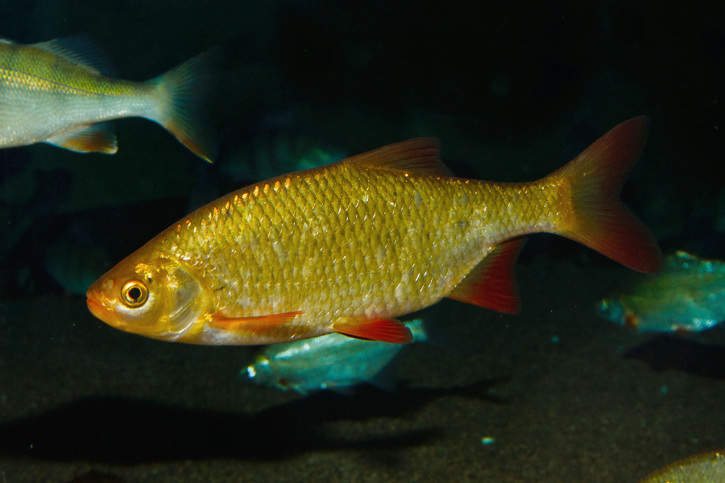
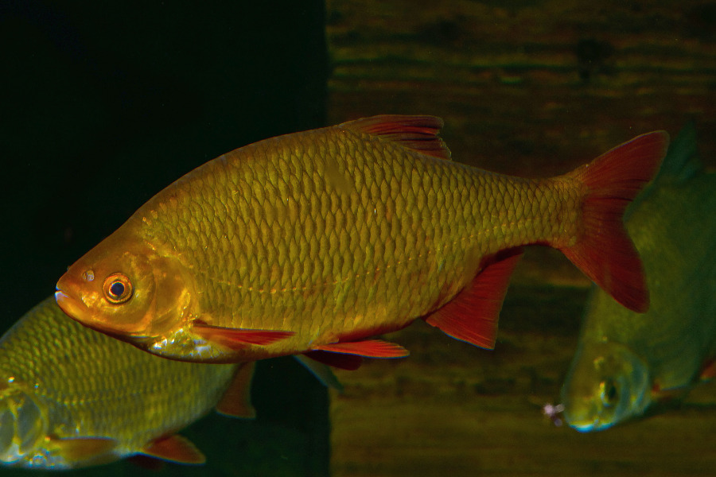
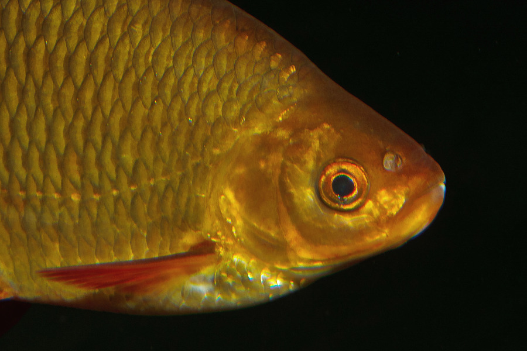

<article class="main-info">

_D-Rotfeder;_
_GB-Rudd;_
_DK-Rudskalle;_
_PL-Wzdręga;_
_LT-Raudė;_
_LV-Rudulis;_
_EST-Roosärg;_
_RU-Краснопёрка;_
_FIN-Sorva;_
_S-Sarv_

### Erkennungsmerkmale

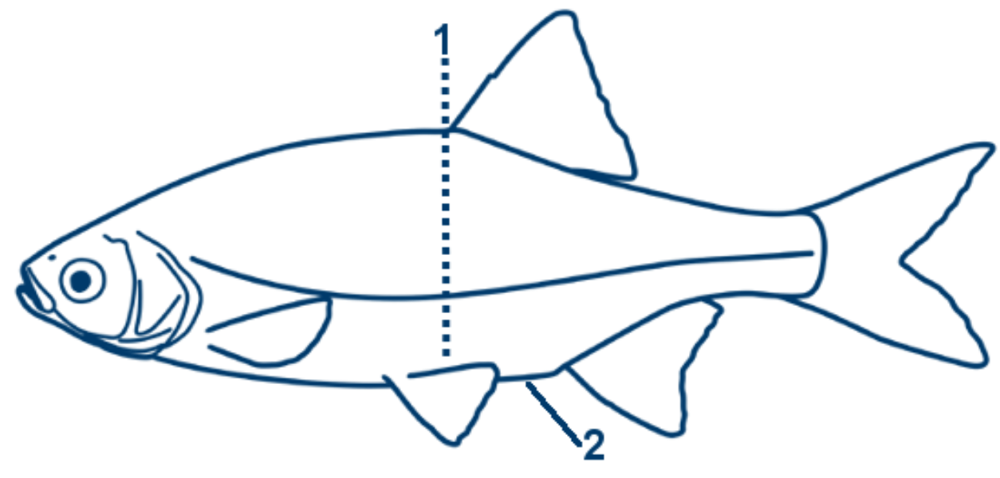

1. Rückenflosse beginnt deutlich hinter dem Ansatz der Bauchflossen.
2. eine Reihe gekielter Schuppen zwischen Bauch- und Afterflosse.

* Relativ hochrückig.
* Körper einheitlich silbern; Bauch- und Afterflossen kräftig rot gefärbt; Augen meist gelblich.

Meist 20 bis 30 cm, max. 45 cm Länge.

### Ähnliche Arten

* [Plötze](#plötze) -
  Rückenflosse und Bauchflossen beginnen auf derselben Höhe;
  kein Kiel zwischen Bauch- und Afterflossen;
  Mundspalte nur leicht nach oben gerichtet.
* [Aland](#aland) -
  schlanker;
  kleinere Schuppen, 55 bis 61 in der Seitenlinie (40 bis 43 bei der Rotfeder).
* [Güster](#güster) -
  Basis der Afterflosse mindestens doppelt so lang, wie die Basis der Rückenflosse.

### Lebensweise

Lebt in kleinen Gruppen in ruhigen, flachen, stark bewachsenen Uferbereichen von großen Flüssen und Seen mit weichem Grund, aber auch in Flussmündungen und Brackwasserbereichen.

### Ernährung

Pflanzliche Nahrung, selten auch Kleintiere.

### Bedeutung

Bedeutung als Speisefisch gering, wird jedoch als Angel- und Köderfisch genutzt.

### Gefährdung

Nicht gefährdet.

</article>

<!-- class="sub-info" -->
> #### Scardinius erythrophthalmus
>
> __Familie:__ Cyprinidae
>
> __Ordnung:__ Cypriniformes
>
> 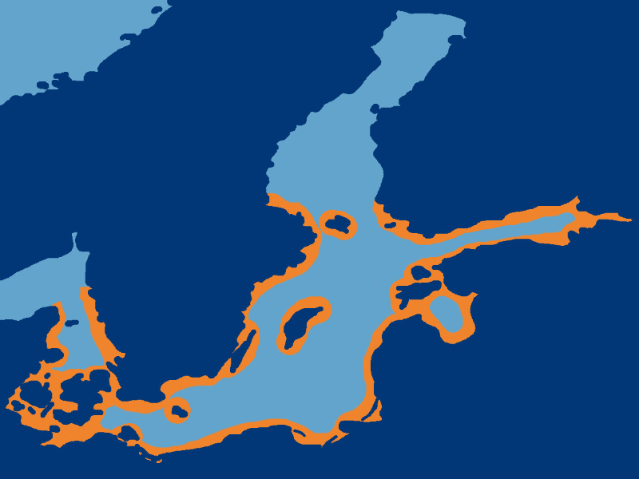
>
> __Verbreitung:__ Südliche und östliche küstennahe Bereiche der Ostsee.
>
> __Häufigkeit:__ regelmäßig
>
> __Gefährdung:__ nicht gefährdet

## Aland

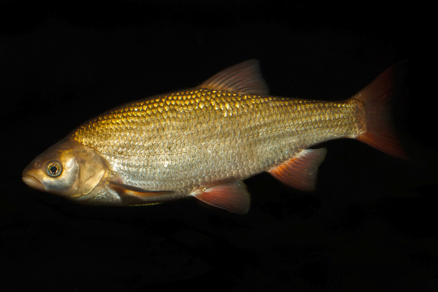
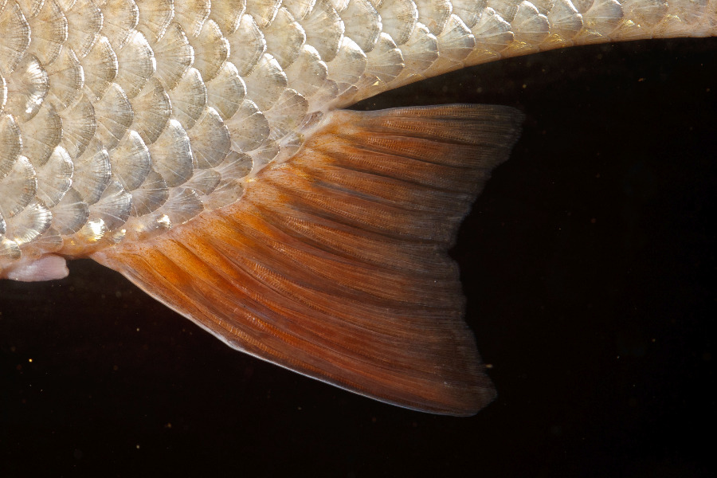
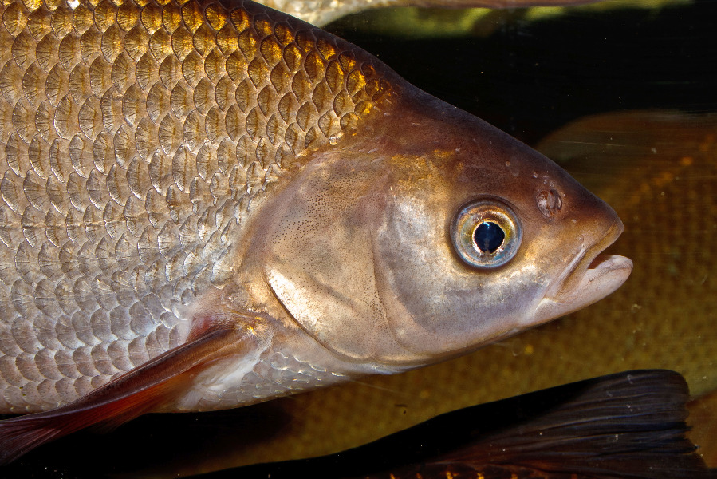

<article class="main-info">

_D-Aland, Nerfling, Orfe;_
_GB-Ide;_
_DK-Rimte, emde;_
_PL-Jaź;_
_LT-Meknė;_
_LV-Ālants;_
_EST-Säinas;_
_RU-Язь;_
_FIN-Säyne;_
_S-Id_

### Erkennungsmerkmale

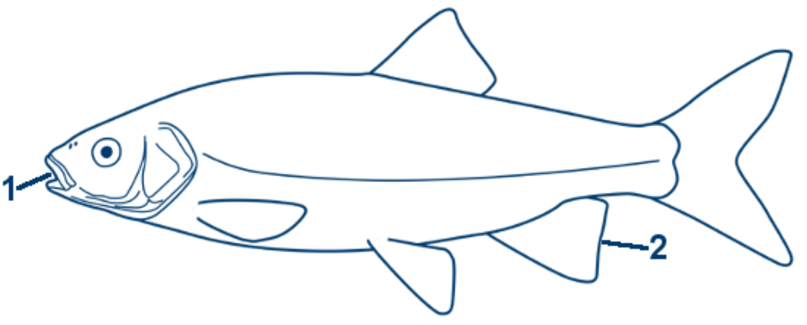

1. Maul endständig, mit kleiner nach oben gerichteter Maulspalte.
2. Außenrand der Afterflosse leicht nach innen gebogen.

* Mäßig hochrückig und seitlich abgeflacht.
* Bräunlich bis silbern; Bauch heller; vor allem bei Jungtieren rote Bauch- und Afterflosse.

Meist 30 bis 50 cm, max. 80 cm Länge.

### Ähnliche Arten

* [Döbel](#döbel) -
  Außenrand der Afterflosse nach außen gebogen;
  mit größeren Schuppen, 44 bis 46 in der Seitenlinie (55 bis 61 beim Aland);
  vor allem Alttiere fast rund im Querschnitt.
* [Hasel](#hasel) -
  Maul leicht unterständig, mit fast waagerechter Maulspalte;
  Körper schlanker;
  47 bis 53 Schuppen in der Seitenlinie (55 bis 61 beim Aland).
* [Plötze](#plötze) - hochrückiger, mit größeren Schuppen, 39 bis 48 in der Seitenlinie (55 bis 61 beim Aland).
* [Rotfeder](#rotfeder) - hochrückiger, mit größeren Schuppen, 40 bis 43 in der Seitenlinie (55 bis 61 beim Aland).

### Lebensweise

Lebt vorzugsweise in oberen, schneller fließenden Flussregionen, ist aber durchaus auch in Mündungsbereichen und Brackwasserzonen zu finden.
In der Laichzeit wandern sie flussaufwärts, da sie an kiesig-sandige Untergründe für die Eiablage gebunden sind.

### Ernährung

Kleine Wirbellose und pflanzliche Nahrung.

### Bedeutung

Wirtschaftlicher Bedeutung als Speise-, Zucht- und Angelfisch.

### Gefährdung

Starker Rückgang der Bestände vor allem durch Flussverbauung und damit Fehlen geeigneter Laichgründe.

</article>

<!-- class="sub-info" -->
> #### Leuciscus idus
>
> __Familie:__ Cyprinidae
>
> __Ordnung:__ Cypriniformes
>
> 
>
> __Verbreitung:__ Gesamte küstennahe Bereiche der Ostsee.
>
> __Häufigkeit:__ häufig
>
> __Gefährdung:__ nicht gefährdet

## Hasel

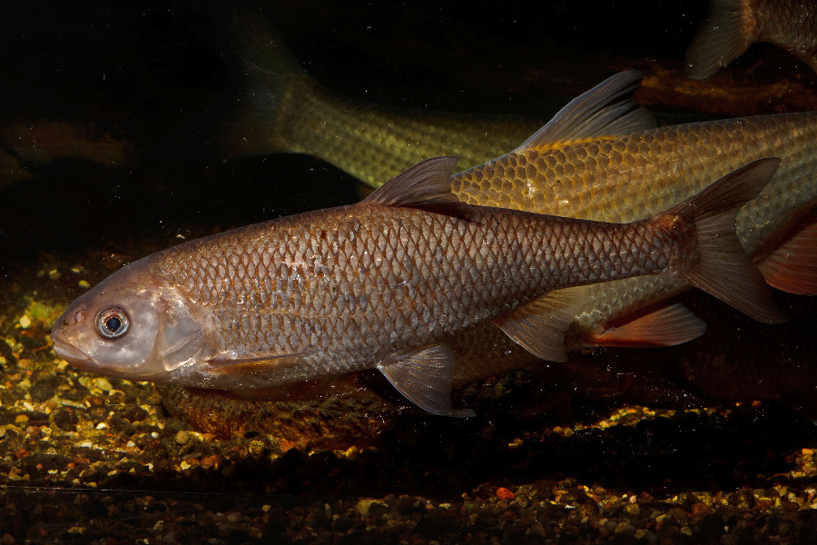
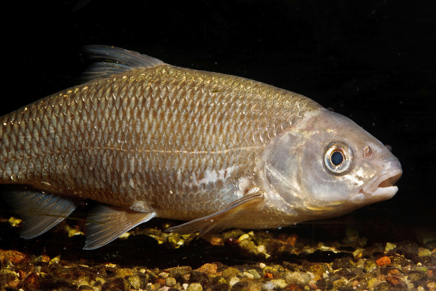

<article class="main-info">

_D-Hasel;_
_GB-Common dace;_
_DK-Strømskalle;_
_PL-Jelec pospolity;_
_LT-Paprastasis strepetys;_
_LV-Baltais sapals;_
_EST-Teib, eselkas;_
_RU-Елец;_
_FIN-Seipi;_
_S-Stäm_

### Erkennungsmerkmale

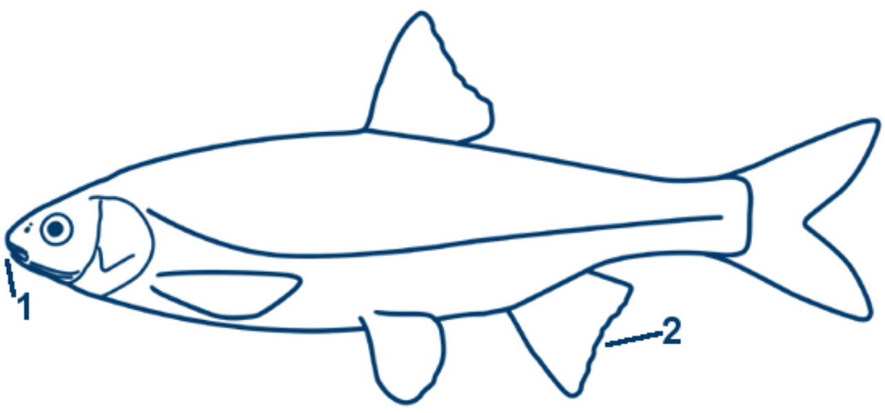

1. Maul leicht unterständig, mit fast waagerechter, kleiner Maulspalte.
2. Außenrand der Afterflosse leicht nach innen gebogen.

* Körper langgestreckt.
* Rücken silbern, bläulich oder gräulich; Bauch weißlich; Bauch- und Afterflosse nur leicht rötlich bis gelblich.

Meist 15 bis 20 cm, max. 30 cm Länge.

### Ähnliche Arten

* [Aland](#aland) -
  Maul endständig, mit nach oben gerichteter Maulspalte;
  Körper etwas hochrückiger;
  55 bis 61 Schuppen in der Seitenlinie (47 bis 53 beim Hasel).
* [Döbel](#döbel) -
  Außenrand der Afterflosse nach außen gebogen;
  endständige, längere Maulspalte (reicht fast bis zum Auge).
* [Graskarpfen](#graskarpfen) -
  oberer Rand der Rückenflose nach außen gewölbt;
  42 bis 45 Schuppen in der Seitenlinie (47 bis 53 beim Hasel).
* [Plötze](#plötze) -
  Mundspalte endständig und leicht nach oben gerichtet;
  obere Augenhälfte rot; hochrückiger als Hasel.
* [Rotfeder](#rotfeder) -
  Mundspalte endständig und deutlich nach oben gerichtet;
  Bauchflosse beginnt vor dem Ansatz der Rückenflosse;
  hochrückiger als Hasel;
  40-43 Schuppen in der Seitenlinie (47 bis 53 beim Hasel).

### Lebensweise

Lebt im Schwarm oberflächennah in strömungsreichen, klaren Flüssen und Bächen mit kiesigem und steinigem Grund.
Weibchen legen ihre Eier in gemachte Gruben im Kiesgrund.

### Ernährung

Wirbellose Kleintiere, seltener Pflanzen.

### Bedeutung

Geringe wirtschaftliche Bedeutung als Angelfisch.

### Gefährdung

Vermutlich nicht gefährdet, jedoch seltener werdend durch die geringe Anzahl sauberer, schnell fließender Gewässer.

</article>

<!-- class="sub-info" -->
> #### Leuciscus leuciscus
>
> __Familie:__ Cyprindiae
>
> __Ordnung:__ Cypriniformes
>
> 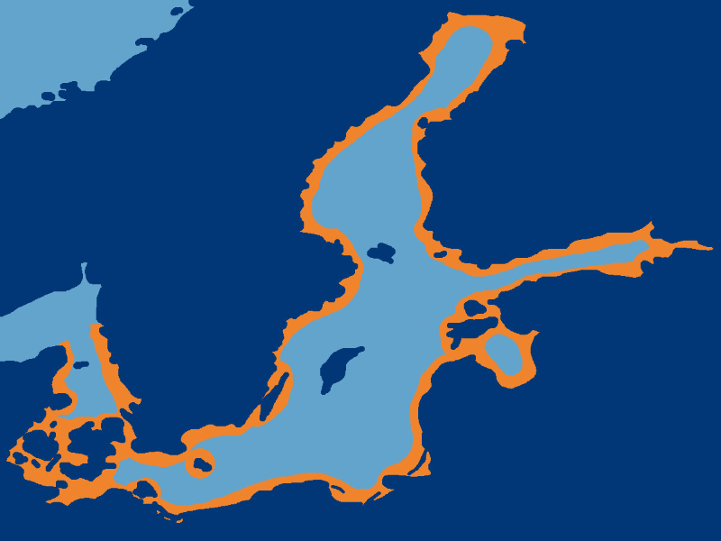
>
> __Verbreitung:__ Seltener Gast der gesamten küstennahen Bereiche der Ostsee.
>
> __Häufigkeit:__ selten
>
> __Gefährdung:__ nicht gefährdet

## Döbel

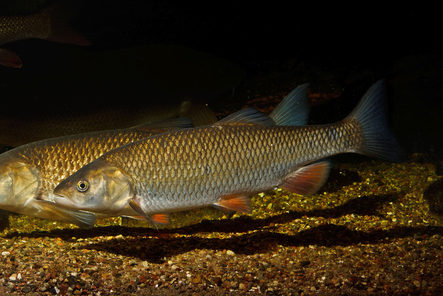
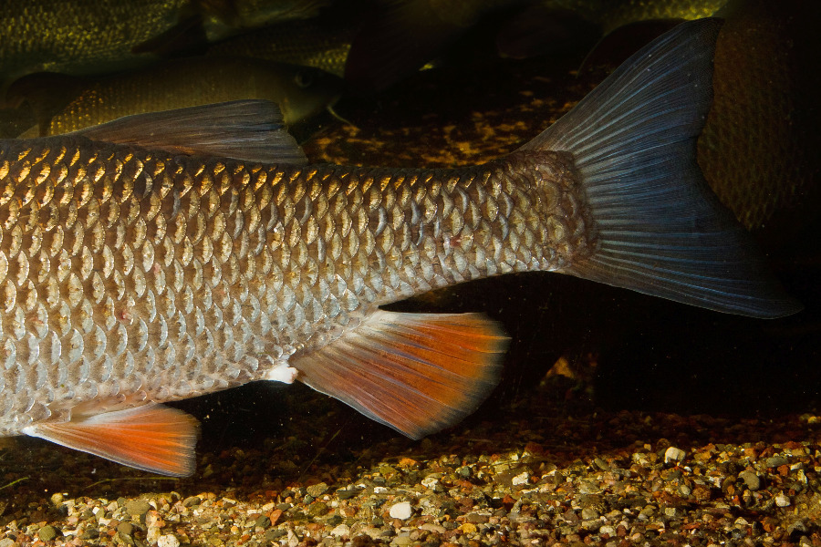
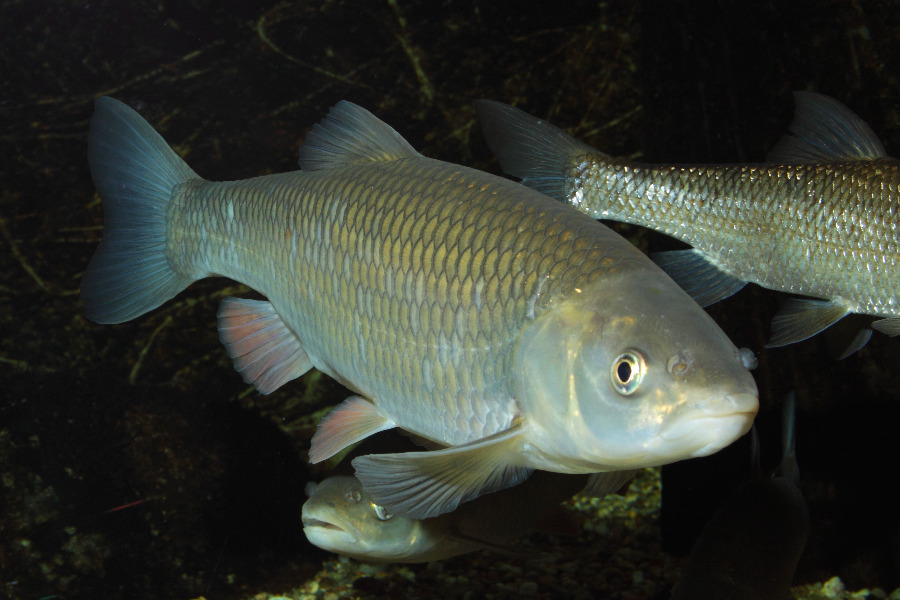
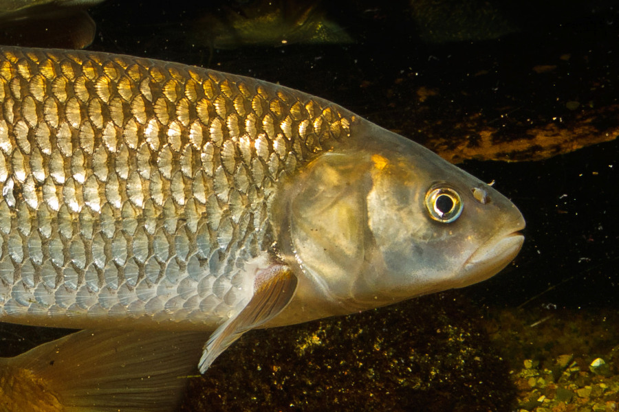

<article class="main-info">

_D-Döbel, Aitel;_
_GB-Chub;_
_DK-Døbel;_
_PL-Kleń;_
_LT-Šapalas;_
_LV-Sapals;_
_EST-Turb;_
_RU-Голавль;_
_FIN-Turpa;_
_S-Färna_

### Erkennungsmerkmale

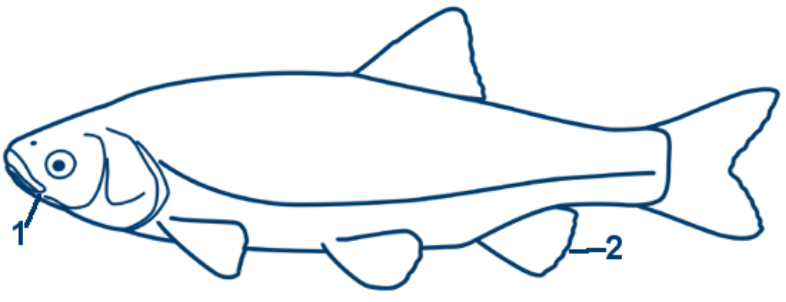

1. Maul endständig, mit langer Maulspalte, die fast bis unter das Auge reicht.
2. Außenrand der Afterflosse deutlich nach außen gebogen.

* Körper langgestreckt und fast rund im Querschnitt, Kopf vor allem bei älteren Tieren sehr breit.
* Körper golden mit dunkler Netzzeichnung, Rücken dunkler, Bauch heller; Bauch- und Afterflosse rötlich.

Meist 30 bis 40 cm, max. 70 cm Länge.

### Ähnliche Arten

* [Graskarpfen](#graskarpfen) -
  oberer Rand der Rückenflosse nach außen gewölbt;
  äußerer Rand der Afterflosse gerade; Maulspalte leicht unterständig.
* [Aland](#aland) -
  kleine nach oben gerichtete Maulspalte;
  Schuppen kleiner, 55 bis 61 in der Seitenlinie (44 bis 46 beim Döbel).
* [Hasel](#hasel) - Maul leicht unterständig, mit kurzer Maulspalte; Außenrand der Afterflosse leicht nach innen gebogen.

### Lebensweise

Lebt oberflächennah in fließenden, großen Gewässern, ist jedoch relativ anspruchslos an seine Umgebung und kommt so auch in Flussunterläufen und Seen vor.
Als Jungfische in Schwärmen lebend, später eher einzelgängerisch.

### Ernährung

Jüngere Tiere vor allem von Wirbellosen; mit zunehmender Größe mehr und mehr kleine Fische und sogar kleine Säugetiere und Frösche.

### Bedeutung

Keine wirtschaftliche Bedeutung als Speisefisch, jedoch beliebter Angelfisch.

### Gefährdung

Vermutlich nicht gefährdet.

</article>

<!-- class="sub-info" -->
> #### Squalius cephalus
>
> __Familie:__ Cyprinidae
>
> __Ordnung:__ Cypriniformes
>
> 
>
> __Verbreitung:__ Sehr seltener Irrgast in der Ostsee.
>
> __Häufigkeit:__ sehr selten
>
> __Gefährdung:__ nicht gefährdet

## Karpfen

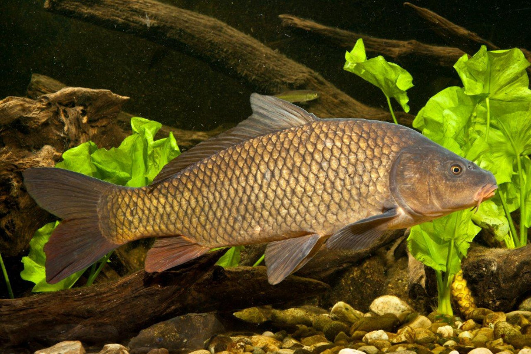
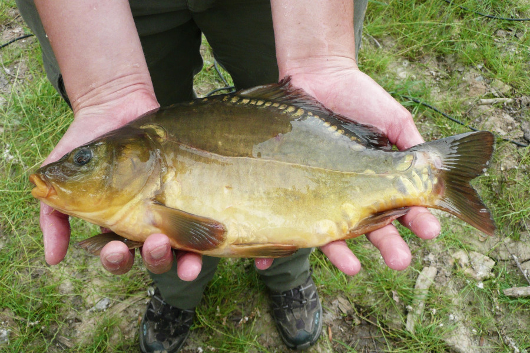
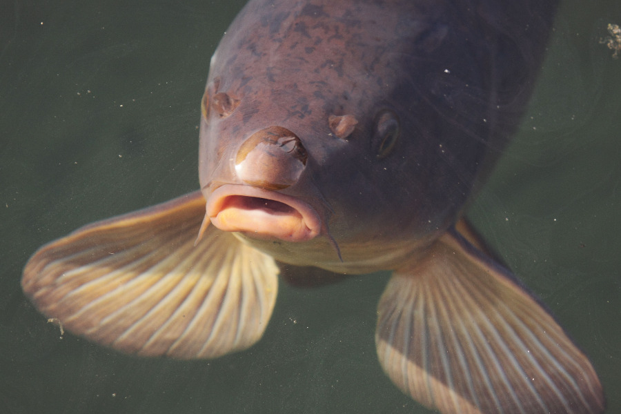
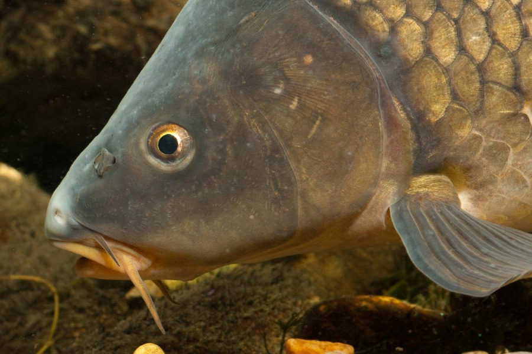
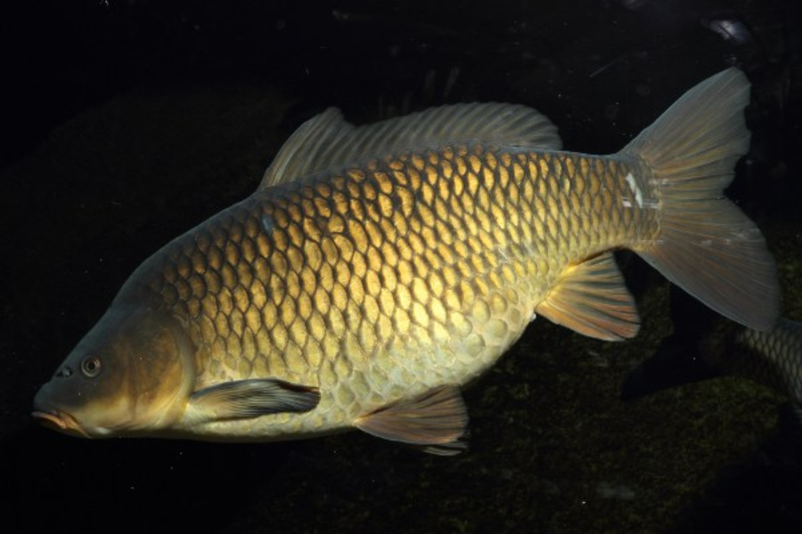
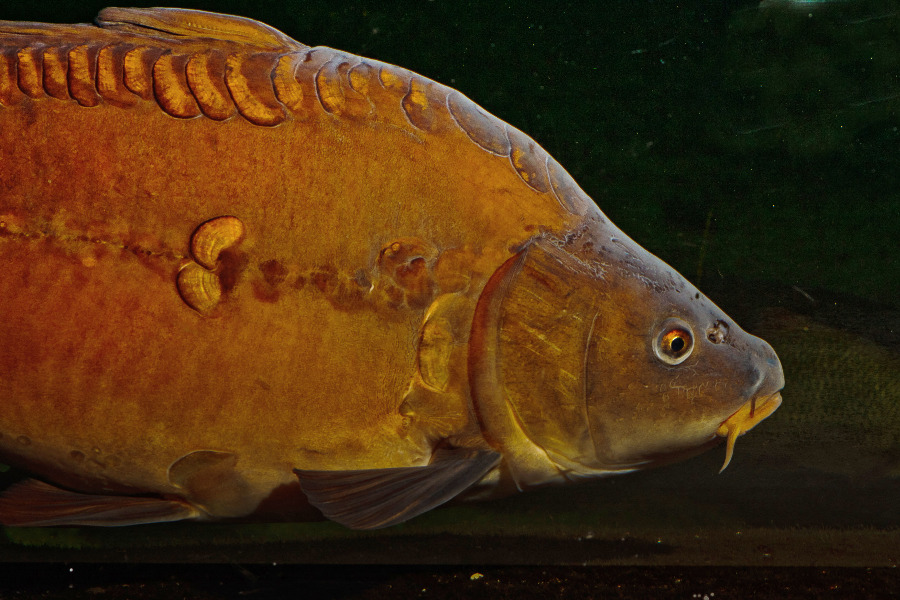

<article class="main-info">

_D-Karpfen;_
_GB-Carp;_
_DK-Karpe;_
_PL-Karp;_
_LT-Karpis;_
_LV-Karpa;_
_EST-Karpkala;_
_RU-Сазан;_
_FIN-Karppi;_
_S-Karp_

### Erkennungsmerkmale

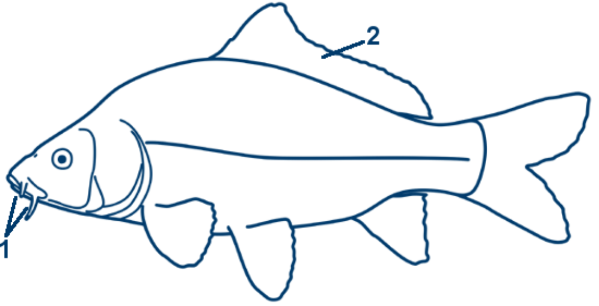

1. Zwei Paar Barteln am Oberkiefer.
2. Sehr lange Rückenflosse (Basis der Rückenflosse etwa vier mal so lang wie die Basis der Afterflosse; Rückenflosse mit 20 bis 28 Strahlen).

Meist 30 bis 70 cm, max. 110 cm Länge.

### Ähnliche Arten

* [Schleie](#schleie) - sehr kleine Schuppen; deutlich kleinere Rückenflosse; Schwanzflosse nur ein wenig eingebuchtet
* [Karausche](#karausche) - ohne Barteln
* [Giebel](#giebel) - ohne Barteln

### Lebensweise

Lebt in langsam fließenden, oder stehenden, tiefen und warmen Gewässern.
Tagsüber meist ruhend in tieferen Gewässerschichten, erst bei Dämmerung aktiv.
Für die natürliche Fortpflanzung benötigen sie zeitweilig überschwemmte, flache Gebiete, in die sie zum Laichen vordringen.

### Ernährung

Im Weichgrund lebende wirbellose Kleintiere.

### Bedeutung

Wirtschaftlich sehr stark genutzt als Speisefisch.
Farbformen (= Kois) sind beliebte Teichfische mit teilweise hohen Wert.

### Gefährdung

Wildpopulationen sind gefährdet durch die Kreuzung mit Zuchtformen, sowie den Verlust von Laichgründen durch Gewässerverbauungen.
Starker Rückgang und Gefährdung der Wildpopulationen.

</article>

<!-- class="sub-info" -->
> #### Cyprinus carpio
>
> __Familie:__ Cyprinidae
>
> __Ordnung:__ Cypriniformes
>
> 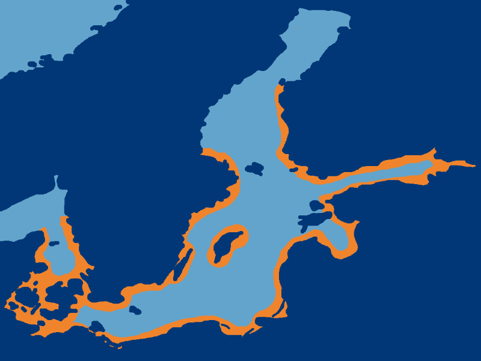
>
> __Verbreitung:__ Fast gesamte Flüsse der Ostseeanrainer und küstennahe Gewässer durch Besatz mit Zuchtformen.
>
> __Häufigkeit:__ selten
>
> __Gefährdung:__ unklar

## Schleie

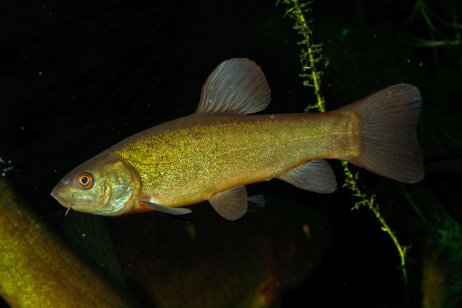
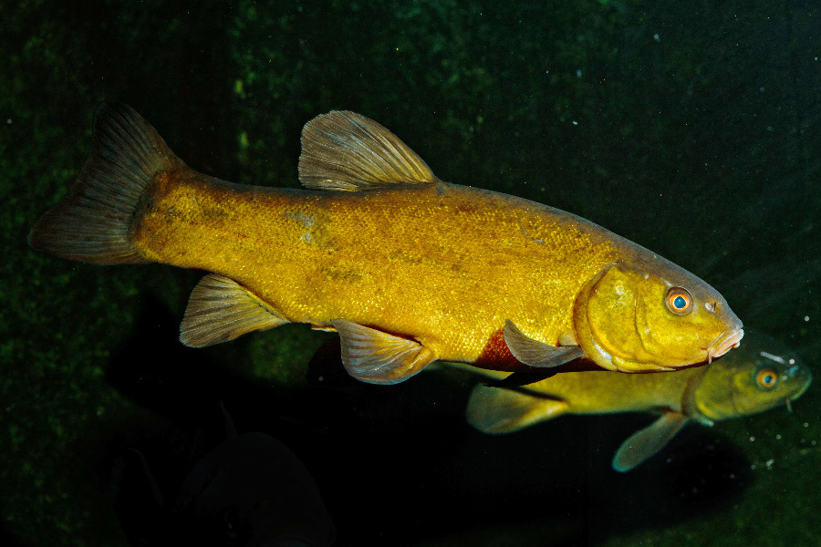
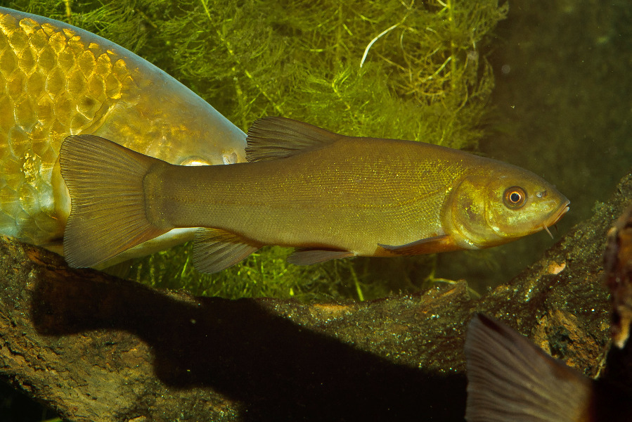
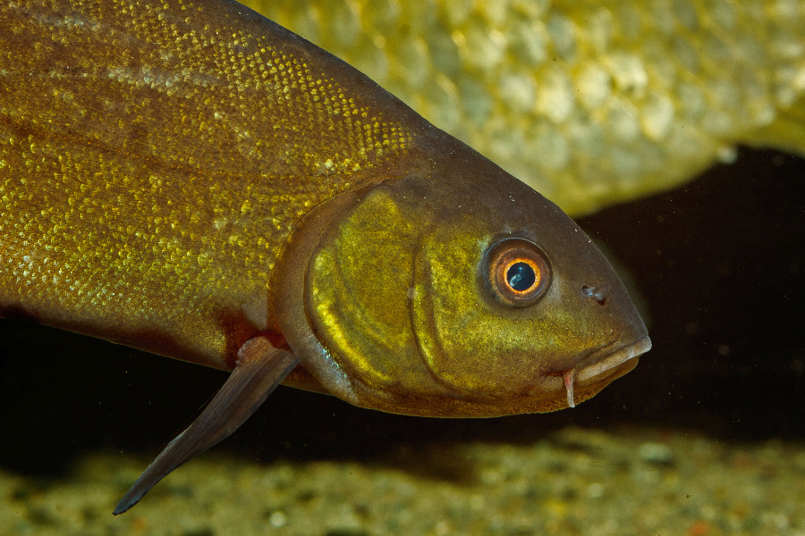

<article class="main-info">

_D-Schleie, Schlei;_
_GB-Tench;_
_DK-Suder;_
_PL-Lin;_
_LT-Lynas;_
_LV-Līnis;_
_EST-Linask;_
_RU-Линь;_
_FIN-Suutari;_
_S-Sutare_

### Erkennungsmerkmale

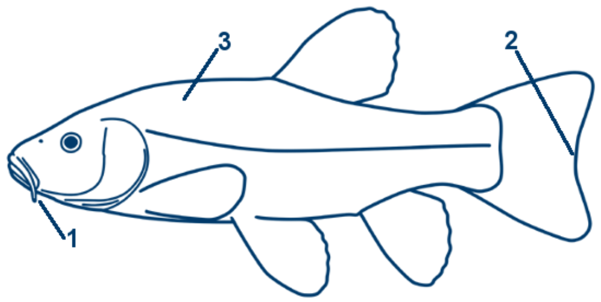

1. Ein Paar Barteln.
2. Schwanzflosse nur leicht eingebuchtet.
3. Sehr kleine Schuppen (95 bis 100 entlang der Seitenlinie).

* Schwanzstiel sehr hoch.
* Die Bauchflossen der Männchen sind hinten abgerundet und reichen bis an die Afterflosse; die Bauchflossen der Weibchen laufen spitz aus und sind kürzer.
* Körper dunkelgrünlich mit goldenem Glanz, Flossen schwärzlich

Meist 20 bis 40 cm, max. 70 cm Länge.

### Ähnliche Arten

* [Karpfen](#karpfen) - vier Barteln; sehr lange Rückenflosse; viel größere Schuppen.

### Lebensweise

Einzelgängerische Bodenbewohner; leben meist in sauerstoffarmen, flachen, stark bewachsenen Seen mit schlammigen Böden.
Sehr anpassungsfähig, können oft extreme Temperaturen und sehr geringen Sauerstoffanteil durch eine Art Starre überdauern.

### Ernährung

Wirbellose Kleintiere und weiche Pflanzenteile.

### Bedeutung

Wirtschaftlich genutzt als Speisefisch.

### Gefährdung

Nicht gefährdet.

</article>

<!-- class="sub-info" -->
> #### Tinca tinca
>
> __Familie:__ Cyprinidae
>
> __Ordnung:__ Cypriniformes
>
> 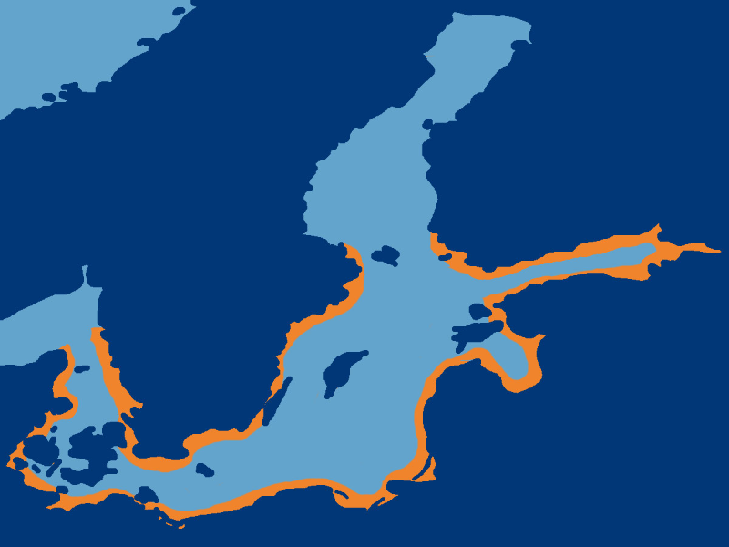
>
> __Verbreitung:__ Regelmäßig in den Süßgewässern der Ostseeanrainer und küstennaher Gewässer.
>
> __Häufigkeit:__ regelmäßig
>
> __Gefährdung:__ nicht gefährdet

## Karausche

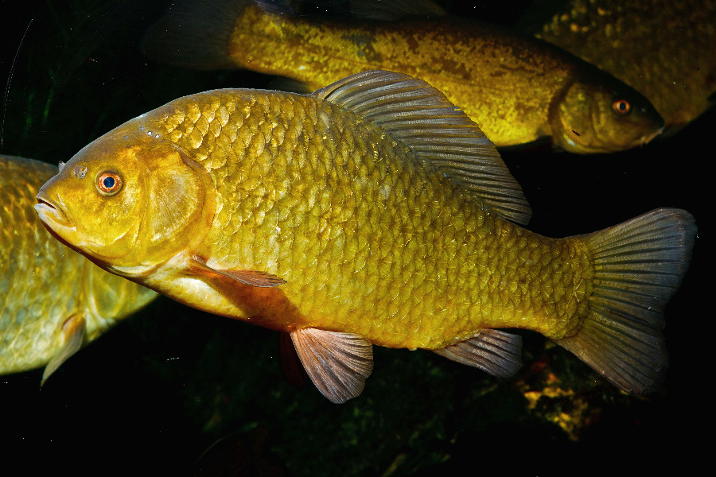
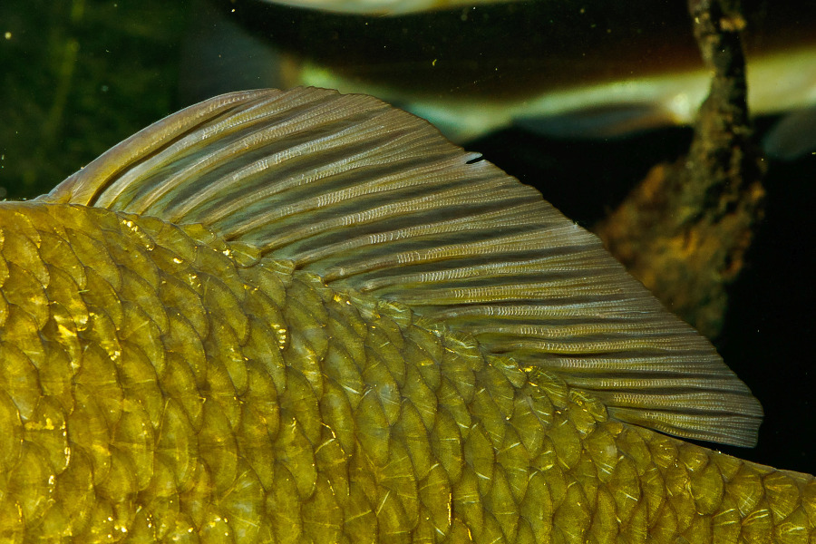
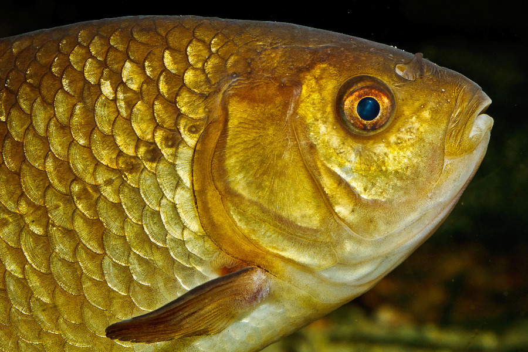

<article class="main-info">

_D-Karausche;_
_GB-Crucian carp;_
_DK-Karusse;_
_PL-Karaś;_
_LT-Karosas;_
_LV-Karūsa;_
_EST-Koger;_
_RU-Золотой карась;_
_FIN-Ruutana;_
_S-Ruda_

### Erkennungsmerkmale

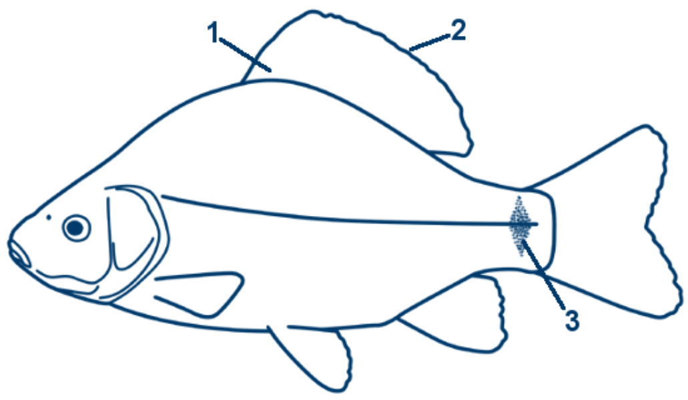

1. Lange Rückenflosse (Basis etwa drei mal so lang, wie die Basis der Afterflosse).
2. Oberer Rand der Rückenflosse nach außen gebogen.
3. Meist mit dunklem Fleck auf dem Schwanzsstiel.

* Sehr hochrückiger Körper; keine Barteln.

Meist 15 bis 30 cm, max. 70 cm Länge.

### Ähnliche Arten

* [Giebel](#giebel) - oberer Rand der Rückenflosse gerade oder sogar zum Körper hin eingebuchtet; nie mit dunklem Fleck auf dem Schwanzstiel.
* [Karpfen](#karpfen) - vier Barteln; sehr lange Rückenflosse; viel größere Schuppen.
* [Bitterling](#bitterling) - meist nur etwa 6 cm lang, längere Afterflosse (nur etwas kürzer als Rückenflosse), Seitenlinie nur auf 5 bis 6 Schuppen (bei der Karausche vollständig, vom Kopf bis zum Schwanzstiel).

### Lebensweise

Sehr anpassungsfähig gegenüber Wasserbedingungen, bevorzugt aber kleine, stille, flache Seen oder Tümpel mit viel Pflanzenbewuchs.
Erreichen der Laichreife mit 2 Jahren.
Ein Weibchen kann bis zu 300.000 Eier ablegen.

### Ernährung

Wirbellose Kleintiere und Pflanzen.

### Bedeutung

Wirtschaftlich genutzt als Speisefisch.

### Gefährdung

Nicht gefährdet.

</article>

<!-- class="sub-info" -->
> #### Carassius carassius
>
> __Familie:__ Cyprinidae
>
> __Ordnung:__ Cypriniformes
>
> 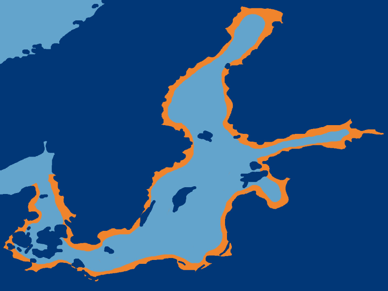
>
> __Verbreitung:__ Regelmäßig in den Süßgewässern der Ostseeanrainer und küstennaher Gewässer.
>
> __Häufigkeit:__ regelmäßig
>
> __Gefährdung:__ nicht gefährdet

## Giebel

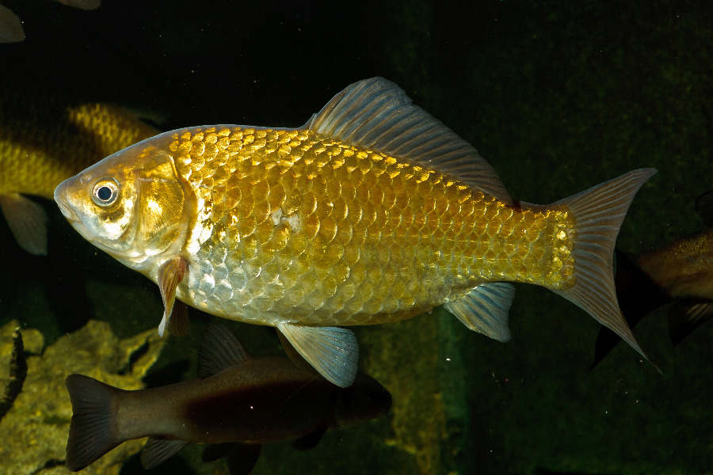
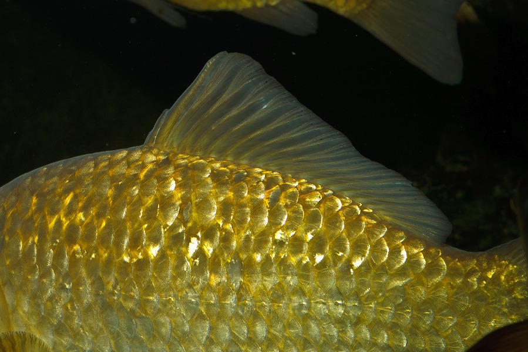
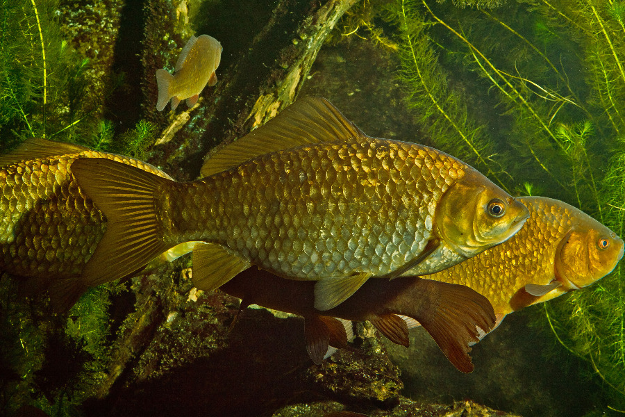
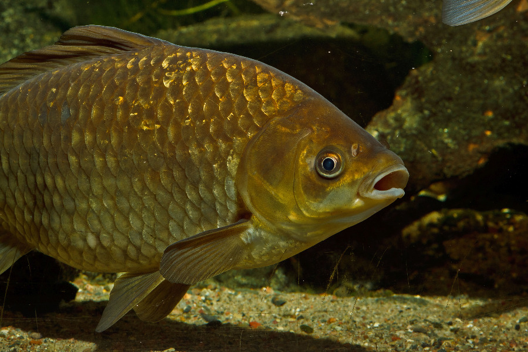

<article class="main-info">

_D-Giebel, Silberkarausche;_
_GB-Prussian carp;_
_DK-Damkaruds;_
_PL-Karaś srebrzysty;_
_LT-Sidabrinis karosas;_
_LV-Sudrabkarūsa;_
_EST-Hõbekoger;_
_RU-Серебряный карась;_
_FIN-Hopearuutana;_
_S-Silverruda_

### Erkennungsmerkmale

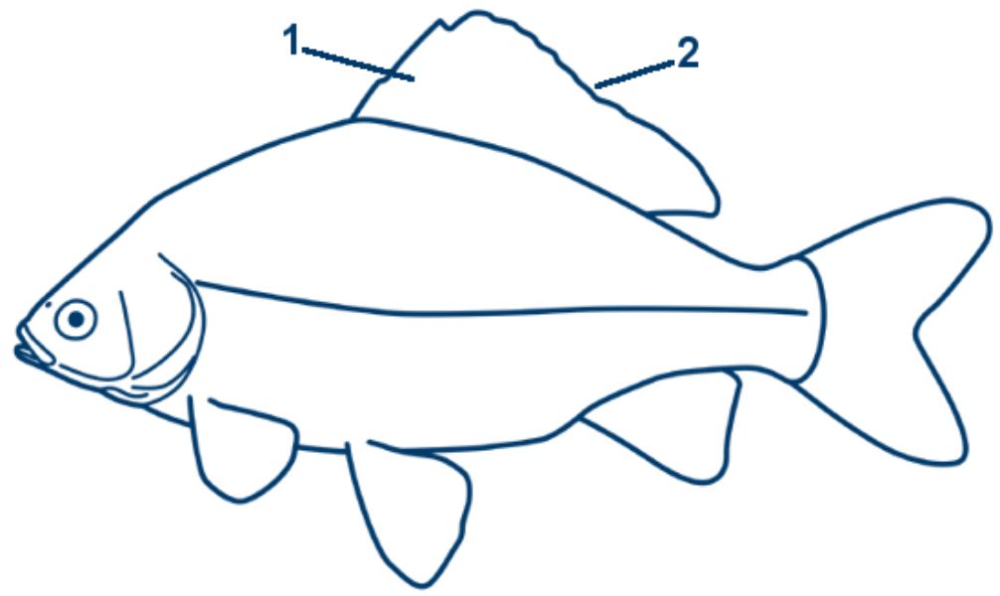

1. Lange Rückenflosse (Basis etwa drei mal so lang, wie die Basis der Afterflosse).
2. Oberer Rand der Rückenflosse gerade oder leicht nach innen gebogen.

* Hochrückiger Körper; keine Barteln.

Meist 15 bis 20 cm, max. 45 cm Länge.

### Ähnliche Arten

* [Karausche](#karausche) - oberer Rand der Rückenflosse nach außen gebogen; meist mit dunklem Fleck auf dem Schwanzstiel
* [Karpfen](#karpfen) - 4 Barteln; sehr lange Rückenflosse; viel größere Schuppen
* [Bitterling](#bitterling) - meist nur etwa 6 cm lang, längere Afterflosse (nur etwas kürzer als Rückenflosse), Seitenlinie nur auf 5 bis 6 Schuppen (beim Giebel vollständig, vom Kopf bis zum Schwanzstiel)

### Lebensweise

Sehr Anpassungsfähig gegenüber Wasserbedingungen, bevorzugt kleine, stille, flache Seen oder Tümpel mit viel Pflanzenbewuchs, kommt aber durchaus auch in langsam fließenden Gewässern vor.

### Ernährung

Wirbellose Kleintiere und Pflanzen.

### Bedeutung

Geringe wirtschaftliche Bedeutung als Speisefisch.

### Gefährdung

Nicht gefährdet.

</article>

<!-- class="sub-info" -->
> #### Carassius gibelio
>
> __Familie:__ Cyprinidae
>
> __Ordnung:__ Cypriniformes
>
> 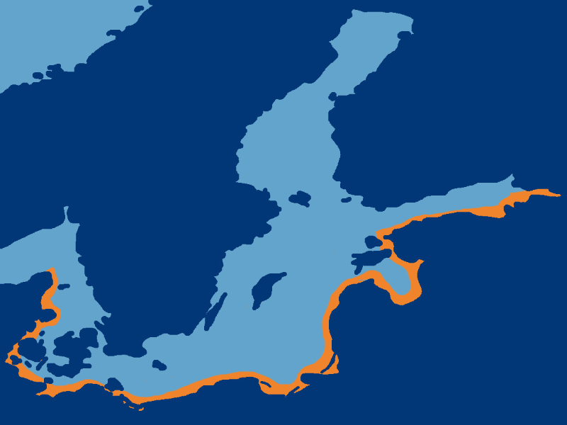
>
> __Verbreitung:__ Selten vorkommende Gastart in der Ostsee.
>
> __Häufigkeit:__ selten
>
> __Gefährdung:__ nicht gefährdet

## Bitterling

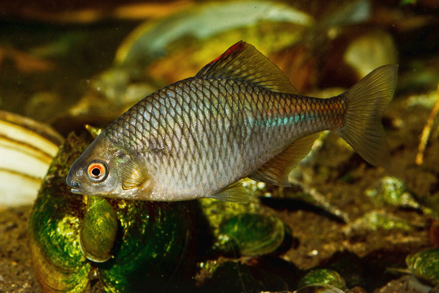
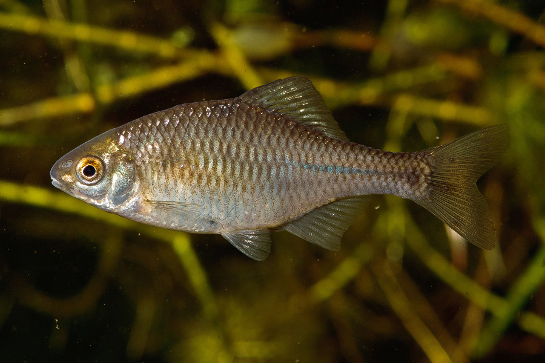
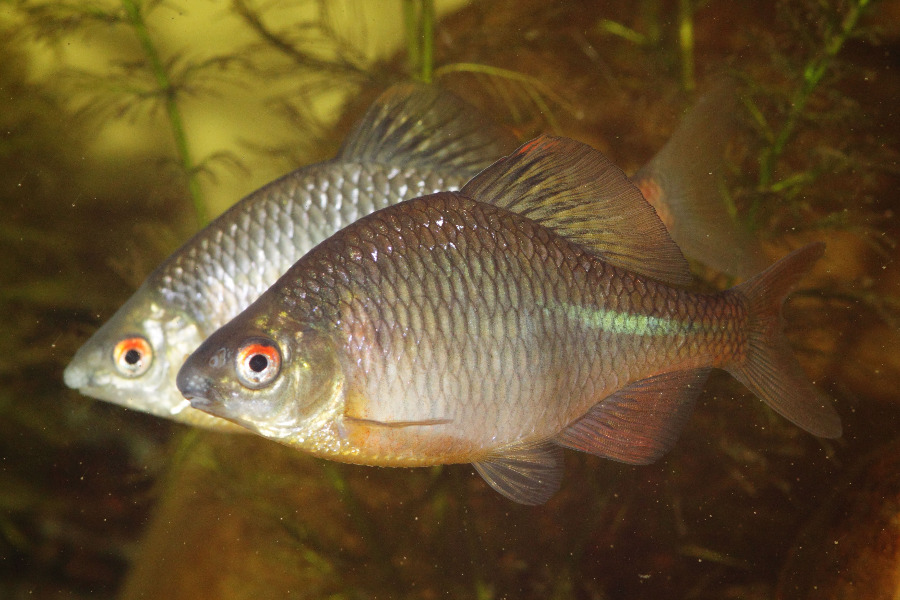
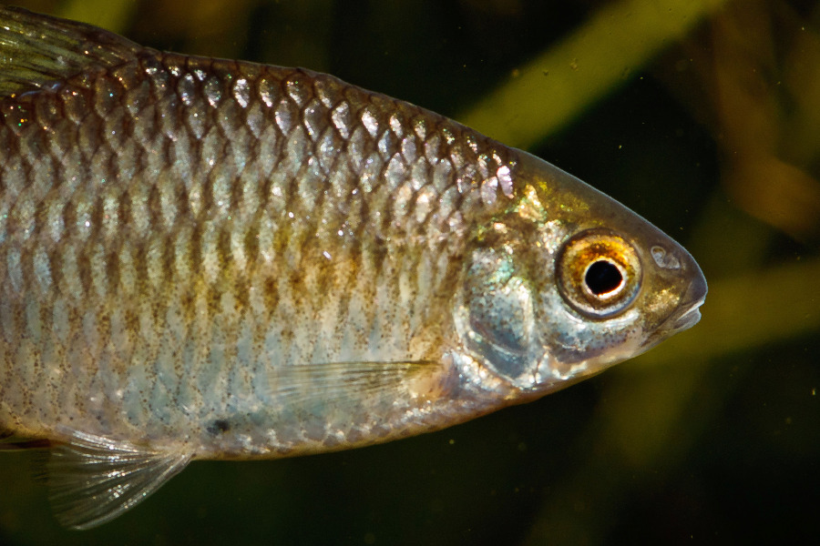

<article class="main-info">

_D-Bitterling;_
_GB-Bitterling;_
_DK-Amurbitterling;_
_PL-Różanka;_
_LT-Kartuolės;_
_LV-Spidiļķi;_
_EST-Harilik mõrukas;_
_RU-Горчаки;_
_FIN-Katkerokala;_
_S-Bitterling_

### Erkennungsmerkmale

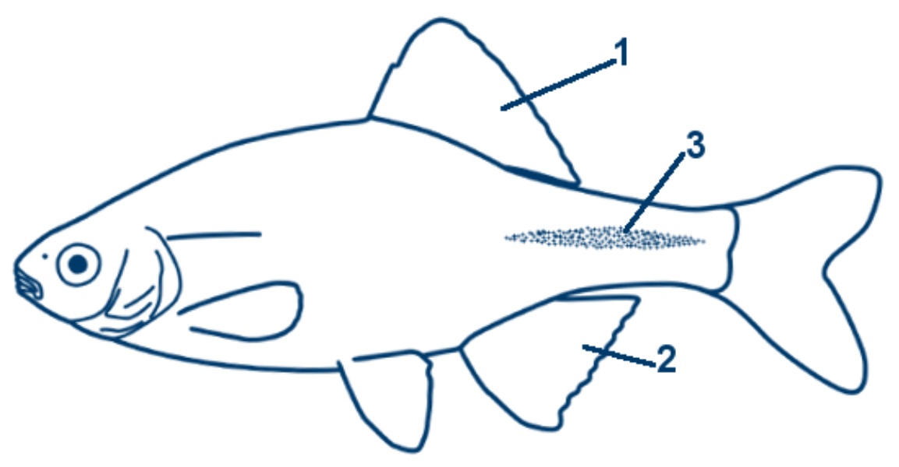

1. Lange Rückenflosse (über etwa die Hälfe des Rückens).
2. lange Afterflosse (nur wenig kürzer als die Rückenflosse).
3. Längsstreifen auf dem Schwanzstiel (beim Weibchen dunkel, beim Männchen blaugrün).
 
* Hochrückiger Körper.

Meist 5 bis 6 cm, max. 9 cm Länge.

### Ähnliche Arten

unverwechselbar

### Lebensweise

Lebt in kleinen Schwärmen in stark bewachsenen, flachen, stehenden oder langsam fließenden Gewässern.
Die Entwicklung der Eier ist nur mit Hilfe von Muscheln möglich.
Dabei legt das Weibchen 1 bis 4 Eier über eine in der Paarungszeit ausgebildete Legeröhre in die Kiemen der Muscheln.
Das Männchen gibt den Samen danach hinzu.
Die Entwicklung bis zum Freischwimmen der Larven läuft in der Muschel ab.

### Ernährung

Vorwiegend Algen und weiche Pflanzenteile, aber auch wirbellose Kleintiere.

### Bedeutung

Beliebter Zierfisch.

### Gefährdung

Starke Rückläufigkeit der Bestände; durch Gewässerverbauung und Verschmutzung fallen zuerst die Muscheln, welche eine gute Wasserqualität benötigen weg, womit den Bitterlingen die Fortpflanzungsgrundlage genommen wird.

</article>

<!-- class="sub-info" -->
> #### Rhodeus amarus
>
> __Familie:__ Cyprinidae
>
> __Ordnung:__ Cypriniformes
>
> 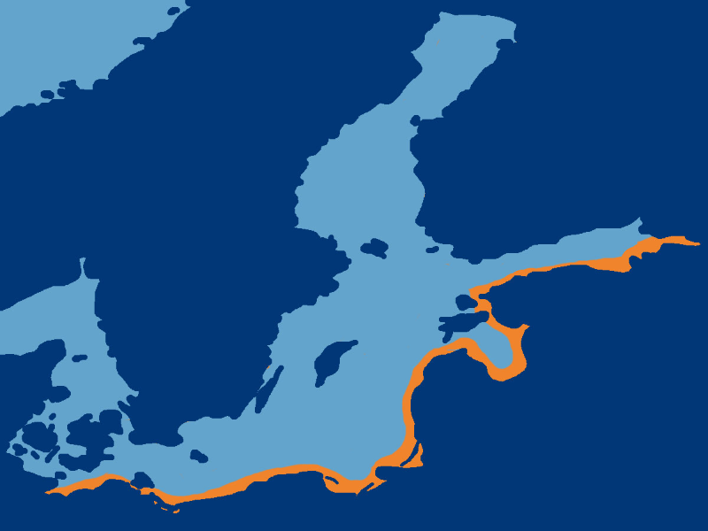
>
> __Verbreitung:__ Sehr seltener Irrgast in der südlichen küstennahen Ostsee.
>
> __Häufigkeit:__ sehr selten
>
> __Gefährdung:__ gefährdet

## Barbe

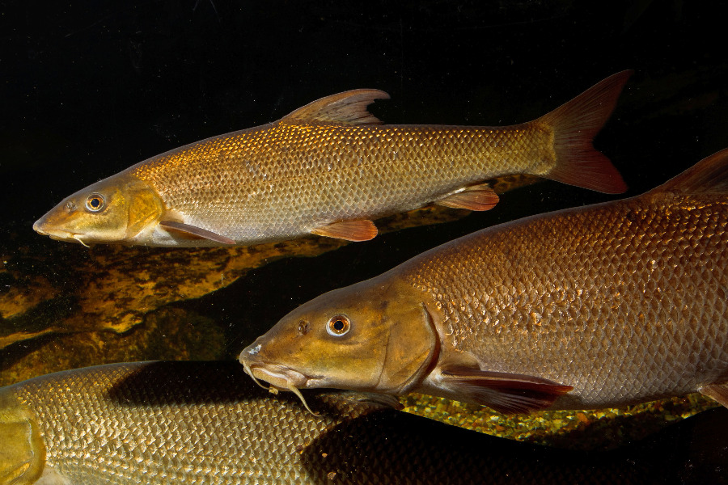
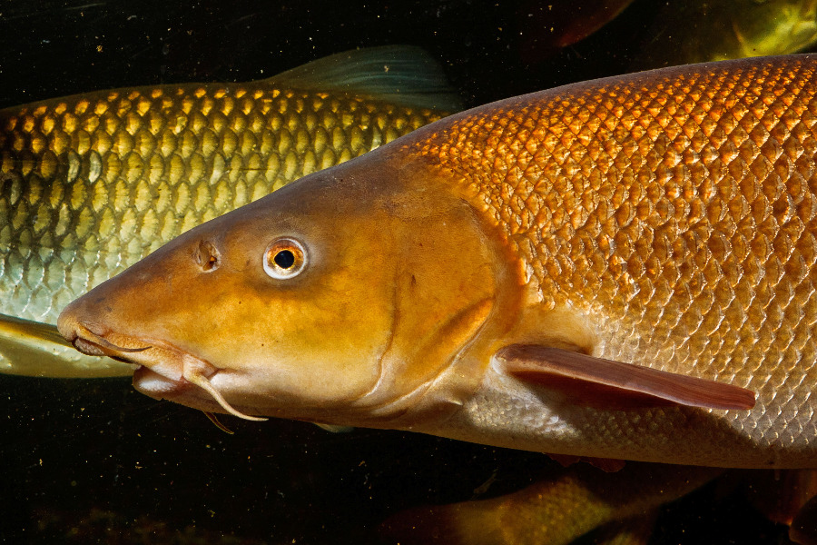
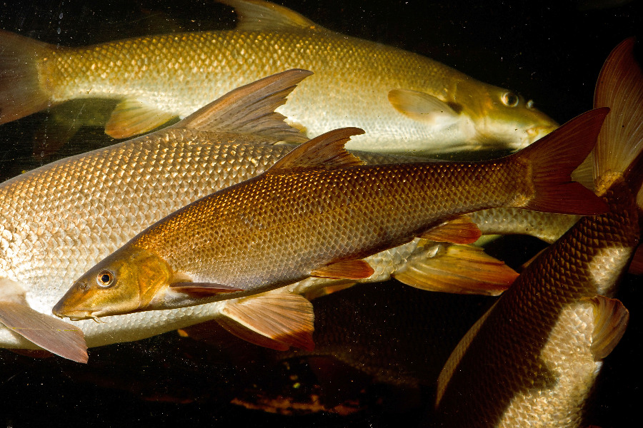

<article class="main-info">

_D-Barbe;_
_GB-Berbel;_
_DK-Barbe;_
_PL-Brzana;_
_LT-Ūsorius;_
_LV-Barbe;_
_EST-Harilik pardkala;_
_RU-Обыкновенный усач;_
_FIN-Jokibarbi;_
_S-Flodbarb_

### Erkennungsmerkmale

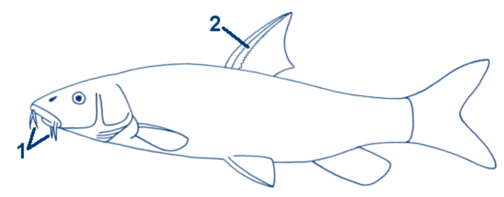

1. 2 Paar kräftige Barteln am Oberkiefer.
2. Längster Strahl in der Rückenflosse stachelartig und am Hinterrand gesägt.

* Körper schlank und annähernd rund im Querschnitt.
* Golden-bräunlich bis gräulich; Rücken dunkler, Bauch heller; Jungtiere mit unregelmäßigen dunklen Fleckungen.

Meist 30 bis 50 cm, max. 90 cm Länge.

### Ähnliche Arten

* [Gründling](#gründling) - nur ein Paar Barteln; regelmäßiges Fleckenmuster entlang der Seite; charakteristischer dunkler Streifen vor dem Auge; deutlich kleiner bleibend.

### Lebensweise

Bewohnt in kleinen Gruppen tiefere Bereiche großer, klarer, rasch fließender Flüsse.
Zeigt einen ausgeprägten Wandertrieb zur Futtersuche und zu Fortpflanzungsgründen.
Zur Laichzeit wandern sie flussaufwärts um auf flacherem Kiesgrund die Eier abzulegen.
Die Jungfische wandern wiederum flussabwärts.

### Ernährung

Bodenbewohnende kleine Wirbellose.

### Bedeutung

Wirtschaftliche Bedeutung als Speisefisch.

### Gefährdung

Starker Rückgang der Bestände durch Gewässerverbauung und Verschlammung der Laichgründe.

</article>

<!-- class="sub-info" -->
> #### Barbus barbus
>
> __Familie:__ Cyprinidae
>
> __Ordnung:__ Cypriniformes
>
> 
>
> __Verbreitung:__ Sehr seltener Irrgast in der südlichen küstennahen Ostsee.
>
> __Häufigkeit:__ sehr selten
>
> __Gefährdung:__ gefährdet

## Rapfen

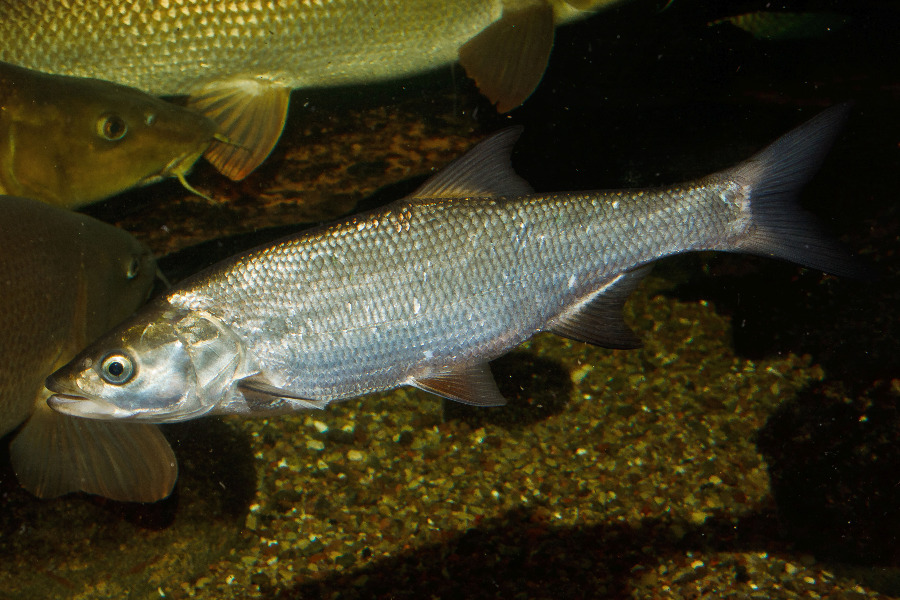
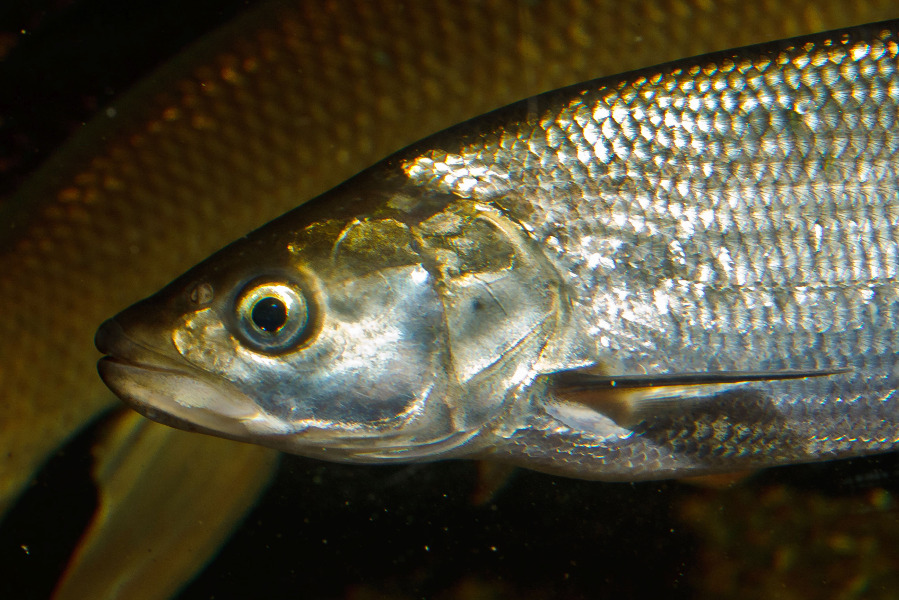
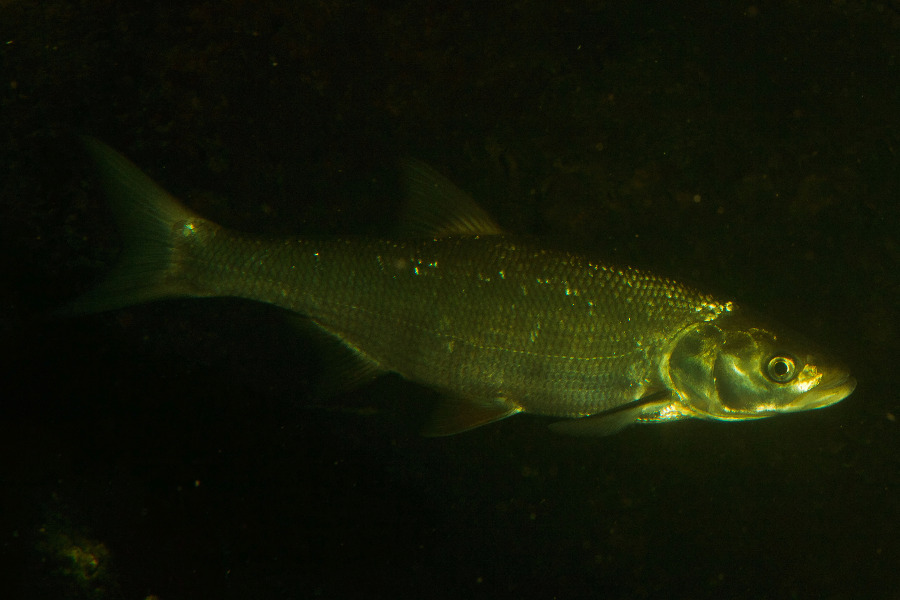

<article class="main-info">

_D-Rapfen, Schied;_
_GB-Asp;_
_DK-Asp;_
_PL-Boleń, chwat, rap;_
_LT-Salatis;_
_LV-Salate;_
_EST-Tõugjas;_
_RU-Жерех;_
_FIN-Toutain;_
_S-Asp_

### Erkennungsmerkmale

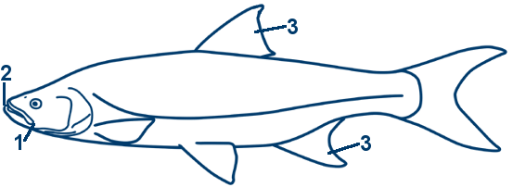

1. Lange Maulspalte reicht bis unter das Auge.
2. Unterkiefer mit Haken, der in eine Aussparung im Oberkiefer passt.
3. Rücken- und Afterflosse sichelartig ausgezogen.

* Gestreckter, kräftiger Körper.

Meist 50 bis 70 cm, max. 120 cm Länge und 12 kg Gewicht.

### Ähnliche Arten

* [Döbel](#döbel) - Maulspalte kürzer; größere Schuppen: 44 bis 46 in der Seitenlinie (beim Rapfen 64 bis 76); Afterflosse nach außen gebogen.
* [Lachs](#lachs) - mit Fettflosse.
* [Meerforelle](#meerforelle) - mit Fettflosse.
* [Buckellachs](#buckellachs) - mit Fettflosse.

### Lebensweise

Tagaktiver oberflächenorientierter Raubfisch; Einzelgänger oder in kleinen Trupps.
Laicht im Frühjahr über Kiesgrund mit starker Strömung.

### Ernährung

Vor allem Oberflächenfische, wie Ukelei; daneben Frösche, Mäuse und kleine Wasservögel.
Jungtiere bis etwa 20 cm ernähren sich von kleinen Wirbellosen.

### Bedeutung

Beliebter Angelfisch, sonst eher geringe wirtschaftliche Bedeutung.

### Gefährdung

Gefährdet vor allem durch das fehlen geeigneter Laichgewässer durch Flussverbauung.

</article>

<!-- class="sub-info" -->
> #### Aspius aspius
>
> __Familie:__ Cyprinidae
>
> __Ordnung:__ Cypriniformes
>
> 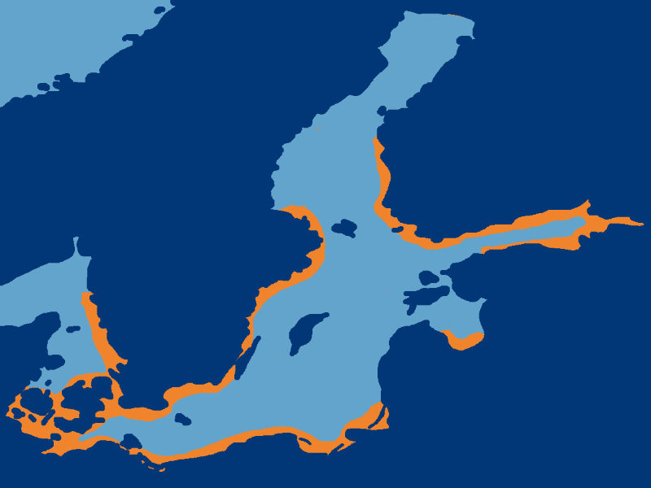
>
> __Verbreitung:__ Küstennah vor allem in der südlichen Ostsee; nach Norden hin seltener werdend.
> Im oberen bottnischen Meerbusen fehlend.
>
> __Häufigkeit:__ regelmäßig
>
> __Gefährdung:__ unklar

## Zährte

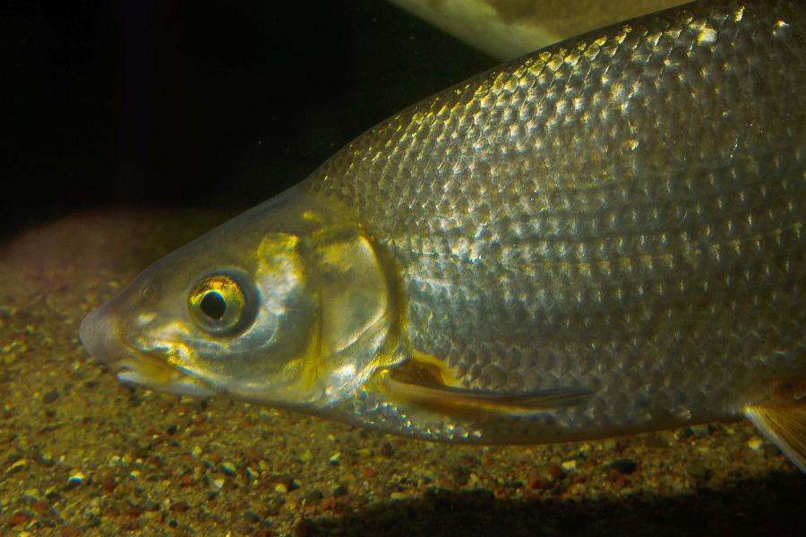
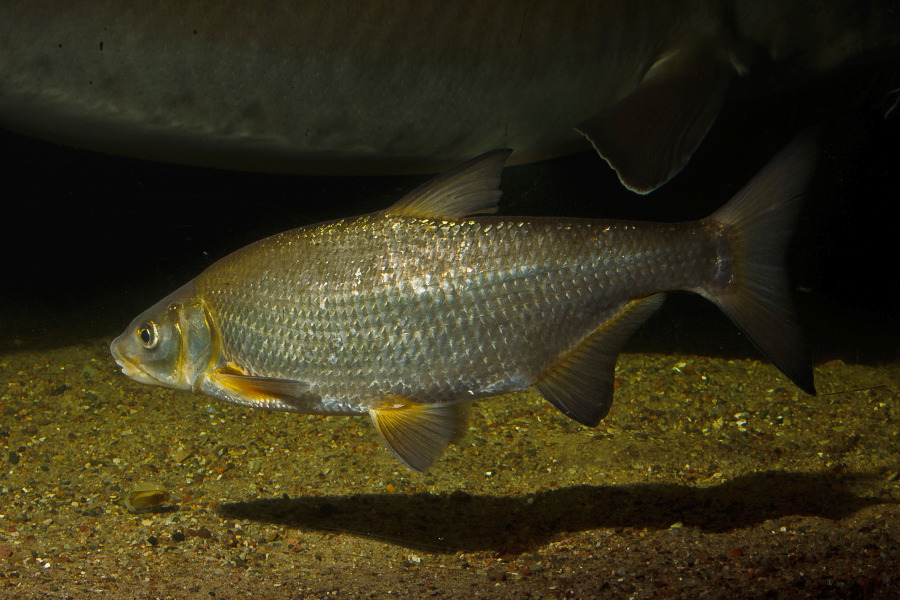
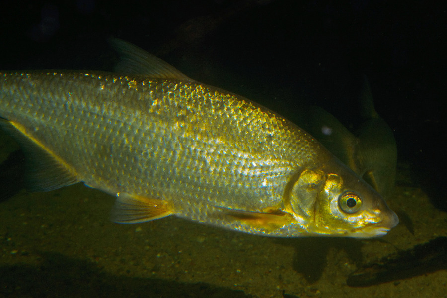

<article class="main-info">

_D-Zährte;_
_GB-Vimba;_
_DK-Certa;_
_PL-Certa;_
_LT-Žiobris;_
_LV-Vimba;_
_EST-Vimb;_
_RU-Рыбец;_
_FIN-Vimpa;_
_S-Vimma_

### Erkennungsmerkmale

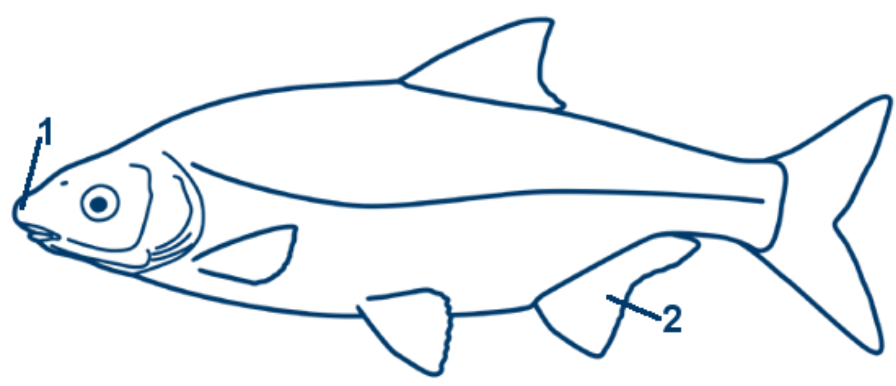

1. Schnauze nasenartig verlängert.
2. Afterflosse lang (etwa 2 mal die Länge der Rückenflosse).

* Körper mäßig hochrückig.
* Meist silber mit dunkler "Nase"; während der Fortpflanzungszeit Rücken dunkelgrau bis schwarz und Bauch leuchtend orange.

Meist 20 bis 30 cm, max. 50 cm Länge.

### Ähnliche Arten

* [Zope](#zope) - Schnauze nicht nasenartig.
* [Ostseeschnäpel](#ostseeschnäpel) - mit Fettflosse.

### Lebensweise

Lebt in Schwärmen in Mündungs- und Brackwasserbereichen, kommt aber auch in Seen vor.
Zur Laichzeit wandern sie flussaufwärts, um an flachen, sandigen Uferbereichen ihre Eier abzulegen.

### Ernährung

Bodenbewohnende Wirbellose, wie Schnecken und Insektenlarven.

### Bedeutung

Geringe wirtschaftliche Bedeutung.

### Gefährdung

Durch Gewässerverbauung und Verschmutzung starker Rückgang und Gefährdung der Populationen.

</article>

<!-- class="sub-info" -->
> #### Vimba vimba
>
> __Familie:__ Cyprinidae
>
> __Ordnung:__ Cypriniformes
>
> 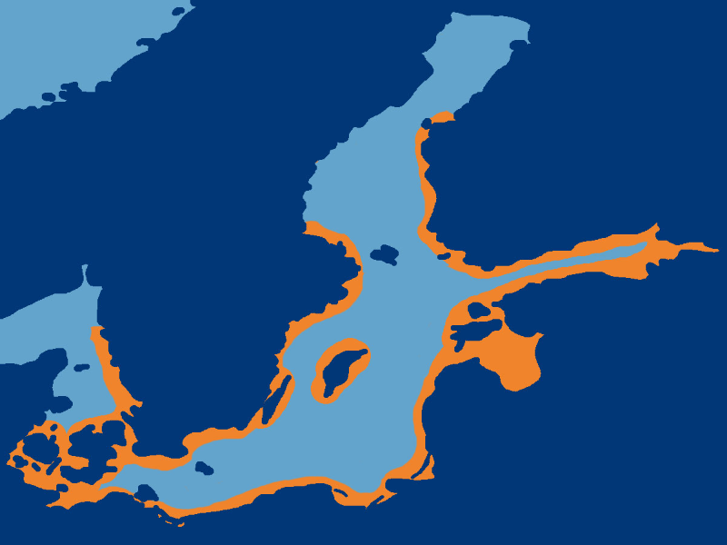
>
> __Verbreitung:__ Selten in den südlichen Brackwasserbereichen der Küste, nach Norden sehr selten werdend.
>
> __Häufigkeit:__ selten
>
> __Gefährdung:__ gefährdet

## Silberkarpfen

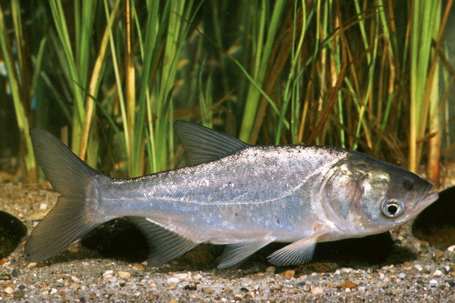
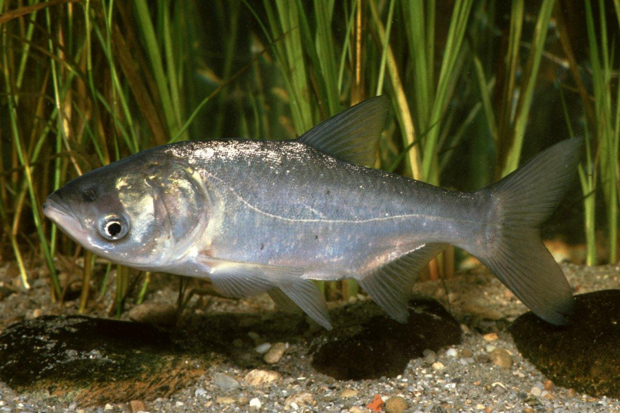

<article class="main-info">

_D-Silberkarpfen;_
_GB-Silver carp;_
_DK-Sølvkarpe;_
_PL-Tołpyga biała;_
_LT-Baltasis plačiakaktis;_
_LV-Baltais platpieris;_
_EST-Harilik pakslaup;_
_RU-Белый толстолобик;_
_FIN-Hopeakarppi;_
_S-Silverkarp_

### Erkennungsmerkmale

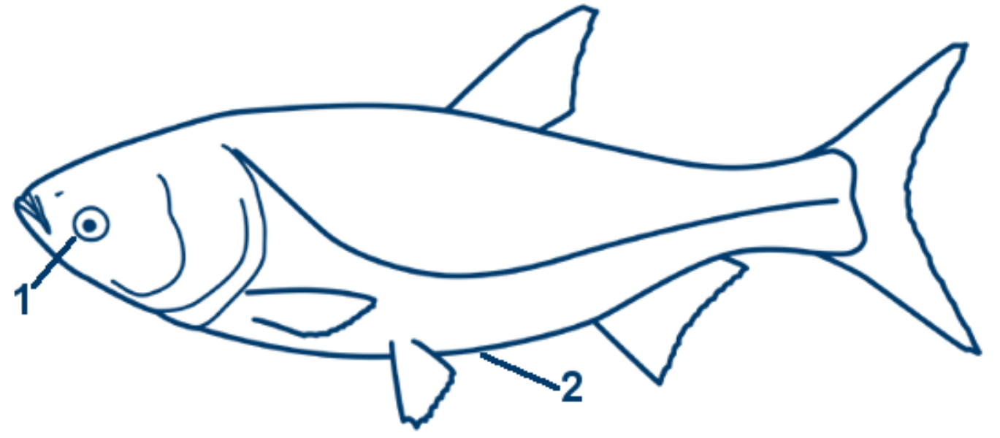

1. Auge sehr tief sitzend (in der unteren Körperhälfte).
2. Gekielter Bauch vom Kopf bis zur Afterflosse.

* Kopf groß, Körper mäßig hochrückig.
* Schuppen sehr klein (110 bis 124 in der Seitenlinie).
* Meist einheitlich silbern.

Bis etwa 100 cm Länge und 50 kg Gewicht.

### Ähnliche Arten

* [Marmorkarpfen](#marmorkarpfn) - Bauchlinie nur zwischen Bauch- und Afterflosse gekielt; marmorierte Körperfärbung; 13 Rückenflossenstrahlen (10 beim Silberkarpfen).

### Lebensweise

Nicht heimisch in Europa: hier keine natürliche Vermehrung möglich.
Empfindlich auf niedrige Temperaturen (< 5°C).

### Ernährung

Larven ernähren sich zunächst von wirbellosen Kleintieren; Jungfische und Erwachse von pflanzlichen Kleinstpartikeln (Phytoplankton), die mit Hilfe ihres Kiemenreusenapparats gefiltert werden.

### Bedeutung

Wurde ab ca. 1960 eingeführt, um Algenblüten in der Teichwirtschaft zu kontrollieren, jedoch nur mit mäßigem Erfolg;
wirtschaftliche Bedeutung in der Aquakultur.

### Gefährdung

In der Ostee nicht gefährdet, da dort nicht heimisch.

</article>

<!-- class="sub-info" -->
> #### Hypophthalmichthys molitrix
>
> __Familie:__ Cyprinidae
>
> __Ordnung:__ Cypriniformes
>
> 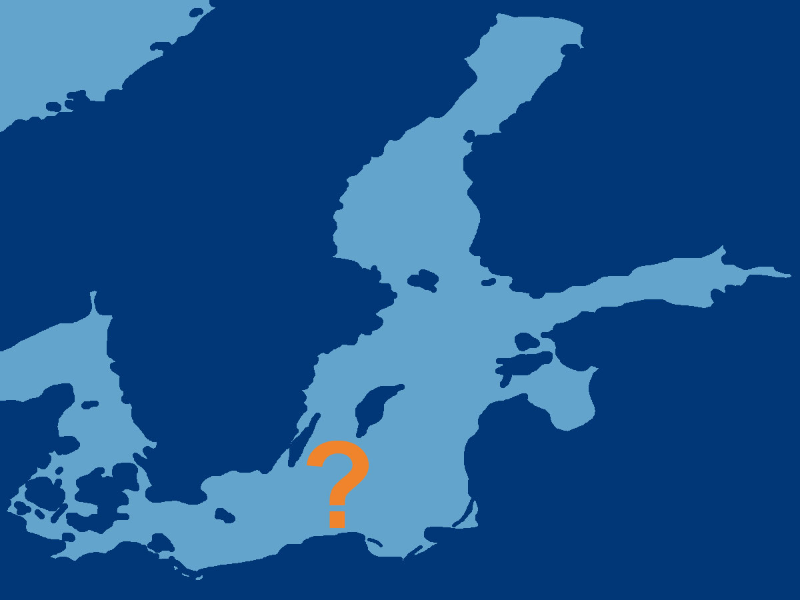
>
> __Verbreitung:__ Selten vorkommend; nur durch Besatzmaßnahmen.
>
> __Häufigkeit:__ sehr selten
>
> __Gefährdung:__ nicht gefährdet

## Marmorkarpfen

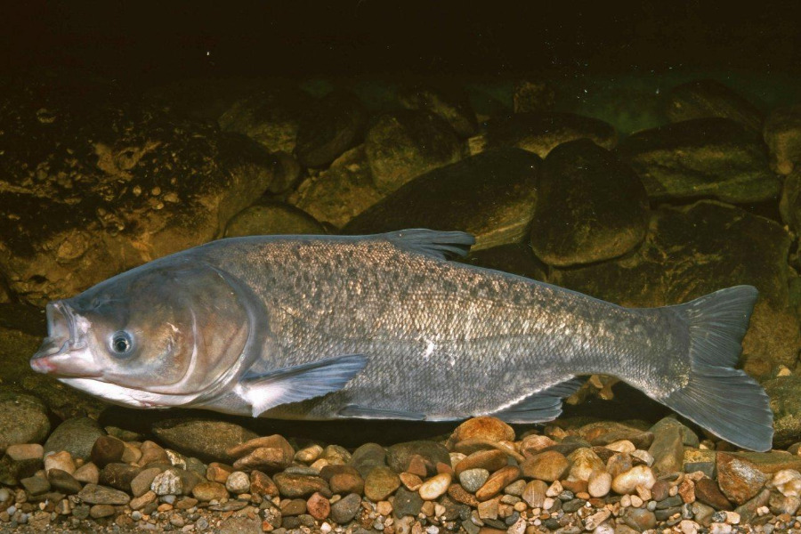
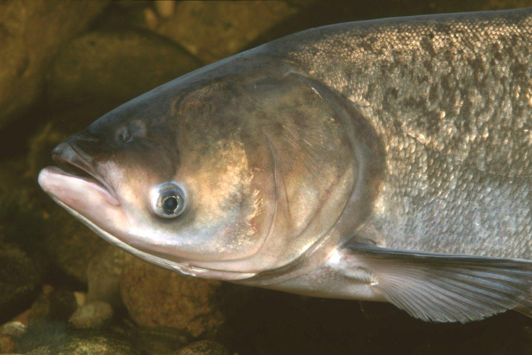

<article class="main-info">

_D-Marmorkarpfen;_
_GB-Bighead carp;_
_DK-Marmorkarpe;_
_PL-Tołpyga pstra;_
_LT-Margasis plačiakaktis;_
_LV-Raibais platpieris;_
_EST-Jämepea;_
_RU-Пёстрый толстолобик;_
_FIN-Marmoripaksuotsa;_
_S-Пёстрый толстолобик_

### Erkennungsmerkmale

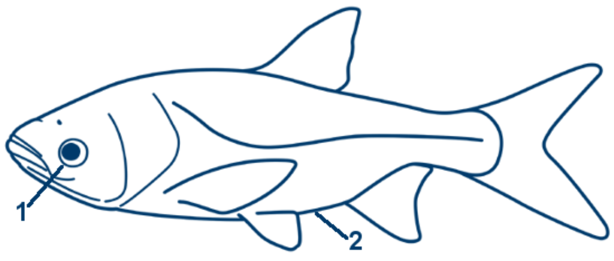

1. Auge sehr tief sitzend (in der unteren Körperhälfte).
2. Gekielter Bauch zwischen Bauch- und Afterflosse.

* Kopf groß, Körper mäßig hochrückig.
* Schuppen sehr klein (110 bis 124 in der Seitenlinie).
* Meist einheitlich silbern mit dunklerem unregelmäßigem Muster.

Meist etwa 60 cm, bis max. 150 cm Länge und 40 kg Gewicht.

### Ähnliche Arten

* [Silberkarpfen](#silberkarpfen) - Bauchlinie vom Kopf bis zur Afterflosse gekielt; einheitlich silberne Körperfärbung; 10 Rückenflossenstrahlen (13 beim Marmorkarpfen).

### Lebensweise

Nicht heimisch in Europa, keine natürliche Vermehrung möglich.
Erwachsene kommen auch im Brackwasser zurecht.

### Ernährung

Tierisches Plankton wie Larven und kleine Krebstiere, sowie Schnecken und gelegentlich Pflanzen.

### Bedeutung

Wurde eingeführt, um Algenblüten in der Teichwirtschaft zu kontrollieren, jedoch nur mit mäßigem Erfolg, da er sich hauptsächlich von tierischem Plankton ernährt.

### Gefährdung

In der Ostee nicht gefährdet, da dort nicht heimisch.

</article>

<!-- class="sub-info" -->
> #### Hypophthalmichthys nobilis
>
> __Familie:__ Cyprinidae
>
> __Ordnung:__ Cypriniformes
>
> 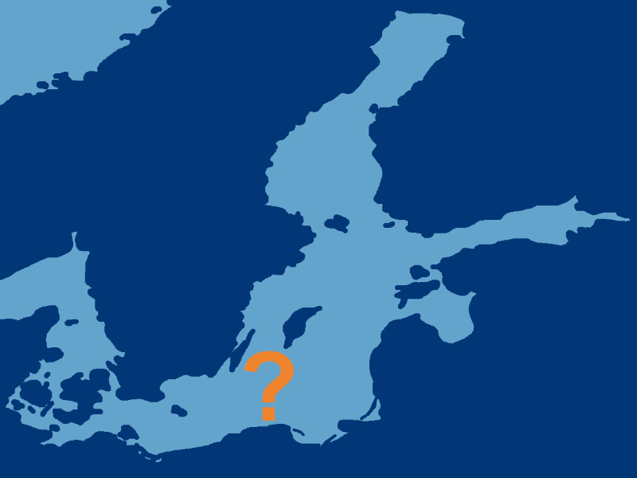
>
> __Verbreitung:__ Selten vorkommend: nur durch Besatzmaßnahmen.
>
> __Häufigkeit:__ sehr selten
>
> __Gefährdung:__ nicht gefährdet

## Zope

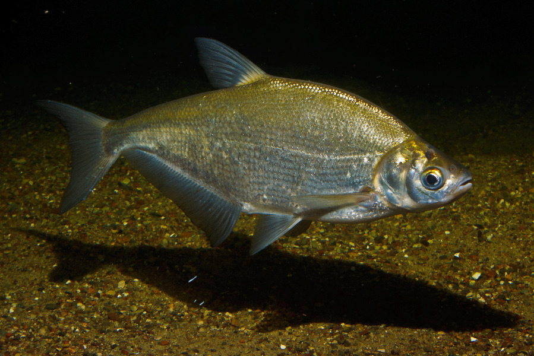
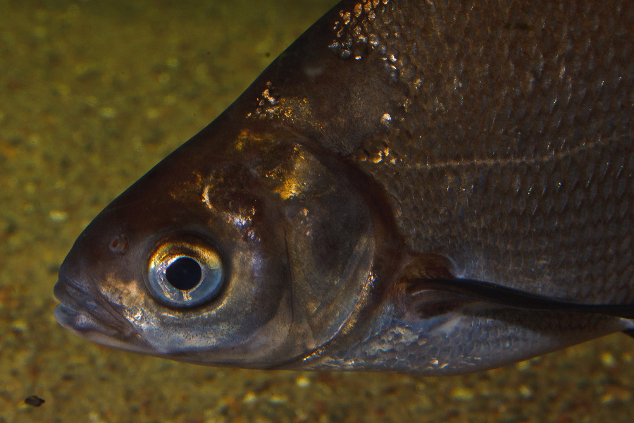
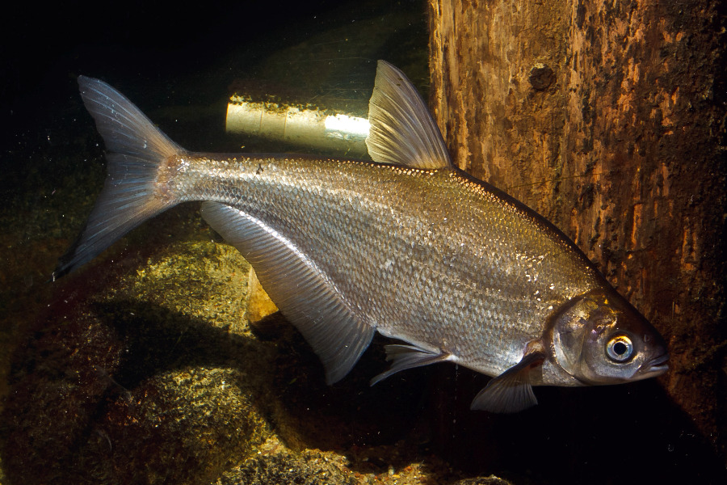

<article class="main-info">

_D-Zope;_
_GB-Blue bream, zope;_
_DK-Brasenflire;_
_PL-Rozpiór, siniec;_
_LT-Sparis;_
_LV-Spāres;_
_EST-Abakala;_
_RU-Синец;_
_FIN-Sulkava;_
_S-Faren_

### Erkennungsmerkmale

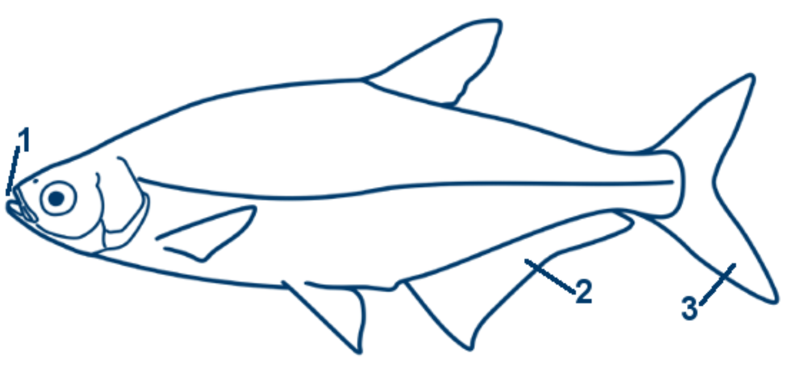

1. Maul end- bis leicht oberständig.
2. Afterflosse sehr lang.
3. Unterer Schwanzflossenlappen länger als oberer.

* Körper mäßig hochrückig.
* Einheitlich silbern; Rücken-, Schwanz- und Afterflosse meist dunkel gesäumt.

Meist 20 bis 30 cm, max. 50 cm Länge.

### Ähnliche Arten

* [Güster](#güster) - Maulspalte end- bis leicht unterständig; Afterflosse kürzer, 22 bis 26 Strahlen (39 bis 46 bei der Zope); Flossenränder nicht dunkel gesäumt.
* [Brachsen](#brachsen) - Maulspalte end- bis leicht unterständig; Afterflosse kürzer, 26 bis 31 Strahlen (39 bis 46 bei der Zope); Flossenränder nicht dunkel gesäumt.
* [Zährte](#zährte) - Schnauze nasenartig.

### Lebensweise

Lebt in kleinen Gruppen im Freiwasser langsam strömender Gewässer- und Mündungsbereichen; seltener auch in Seen zu finden.
In der Laichzeit wandern sie flussaufwärts und bevorzugen stark bewachsene flache Uferbereiche zur Eiablage.

### Ernährung

Zooplankton, kleine Bodentiere und Algen.

### Bedeutung

Keine wirtschaftliche Bedeutung.

### Gefährdung

Starker Rückgang und Gefährdung der Bestände wegen hoher Anfälligkeit auf Gewässerverschmutzungen.

</article>

<!-- class="sub-info" -->
> #### Ballerus ballerus
>
> __Familie:__ Cyprinidae
>
> __Ordnung:__ Cypriniformes
>
> 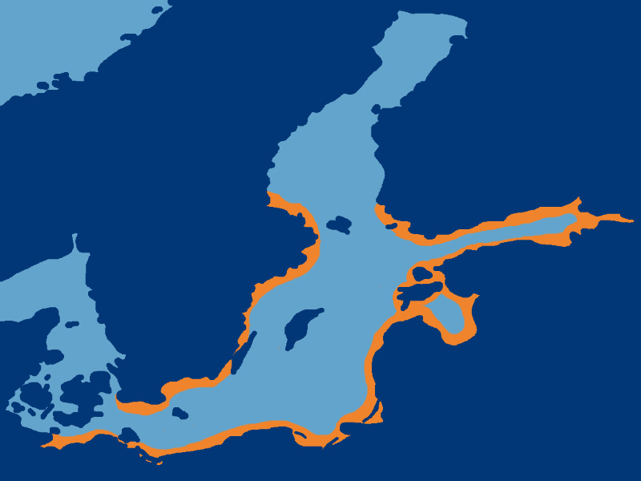
>
> __Verbreitung:__ Vorkommend im küstennahen Gebiet der Ostsee, ausgenommen Südschwedens und dem nördlichen Bereich des bottnischen Meerbusens.
>
> __Häufigkeit:__ regelmäßig
>
> __Gefährdung:__ gefährdet

## Güster

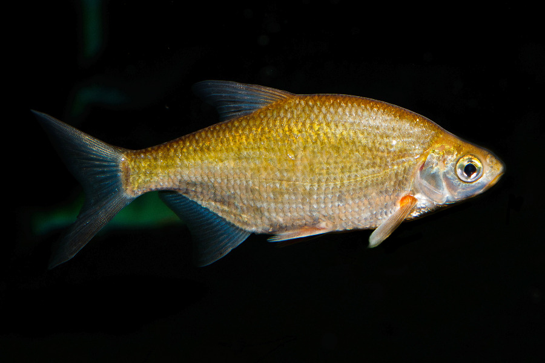
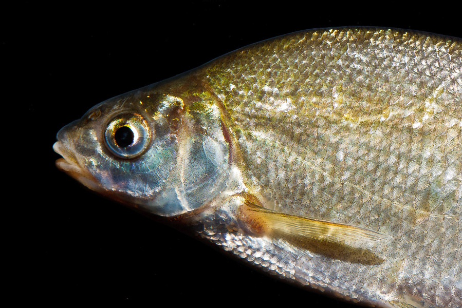
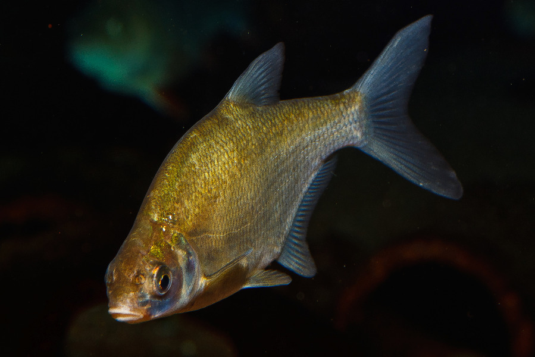

<article class="main-info">

_D-Güster, Blicke;_
_GB-Silver bream, white bream;_
_DK-Flire;_
_PL-Krąp;_
_LT-Plakis;_
_LV-Plicis;_
_EST-Nurg;_
_RU-Густера;_
_FIN-Pasuri;_
_S-Björkna_

### Erkennungsmerkmale

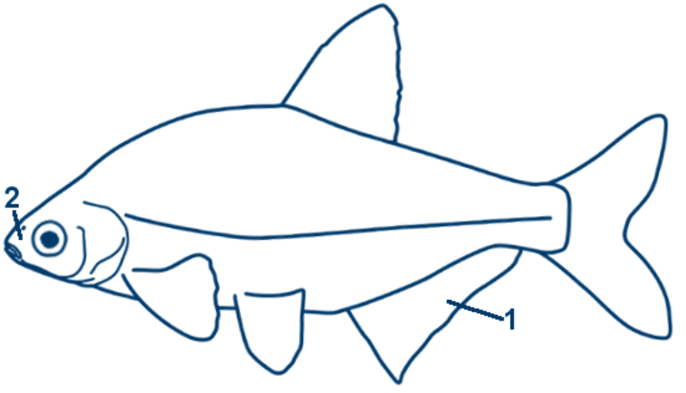

1. Lange Afterflosse.
2. Schnauze nur so lang wie Augendurchmesser.

* Maulspalte end- bis leicht unterständig.
* Hochrückiger, stark seitlich abgeflachter Körper.
* Einheitlich silbern, Ansätze der Brust- und Bauchflossen meist rötlich.

Meist 20 bis 30 cm, max. 36 cm Länge.

### Ähnliche Arten

* [Brachsen](#brachsen) - Schnauze deutlich länger als Augendurchmesser; Ansätze von Brust- und Bauchflossen nie rötlich.
* [Zope](#zope) - Afterflosse noch länger, 39 bis 46 Strahlen (22 bis 26 Strahlen beim Güster); Flossenränder dunkel gesäumt.
* [Zährte](#zährte) - Schnauze nasenartig.
* [Plötze](#plötze) - Basis der Afterflosse etwas kürzer als Basis der Rückenflosse.

### Lebensweise

Lebt in kleinen Gruppen an stark bewachsenen Uferbereichen langsam fließender oder stehender Gewässer; diese dienen ihnen auch als Laichplätze.

### Ernährung

Nahrungsspektrum sehr breit, vor allem tierisches und pflanzliches Plankton.

### Bedeutung

Geringe lokale wirtschaftliche Bedeutung, vorwiegend in Osteuropa.

### Gefährdung

Nicht gefährdet.

</article>

<!-- class="sub-info" -->
> #### Blicca bjoerkna
>
> __Familie:__ Cyprinidae
>
> __Ordnung:__ Cypriniformes
>
> 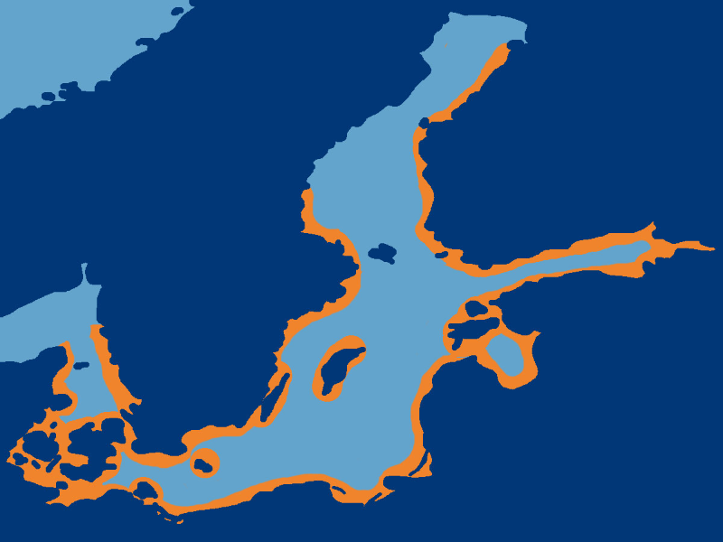
>
> __Verbreitung:__ Küstennah in der gesamten Ostsee, nur im nördlichen bottnischen Meerbusen fehlend.
>
> __Häufigkeit:__ sehr häufig
>
> __Gefährdung:__ nicht gefährdet

## Brachsen

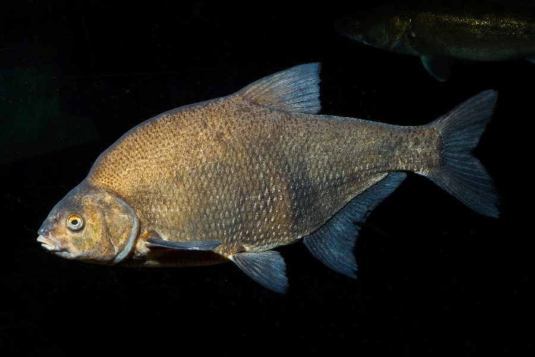
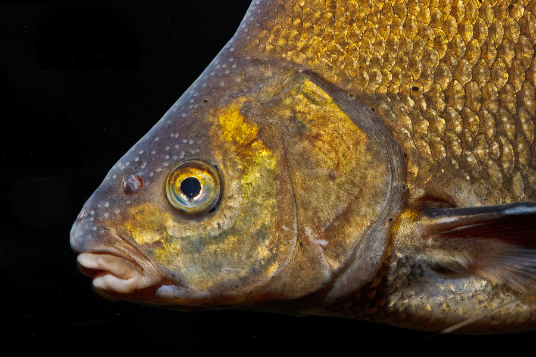
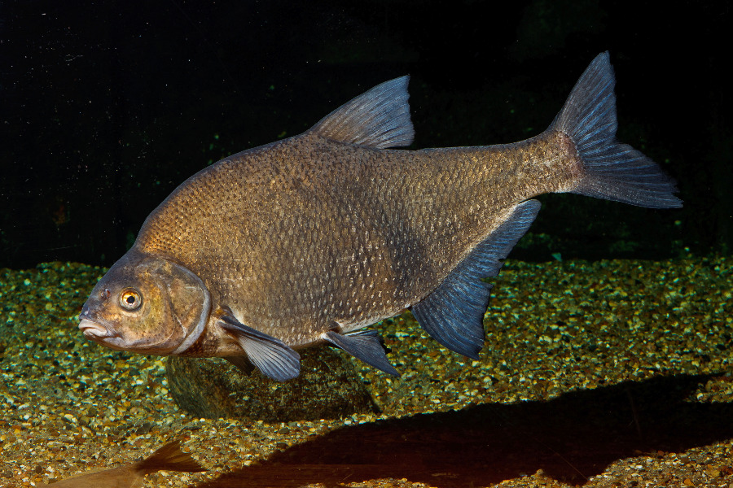
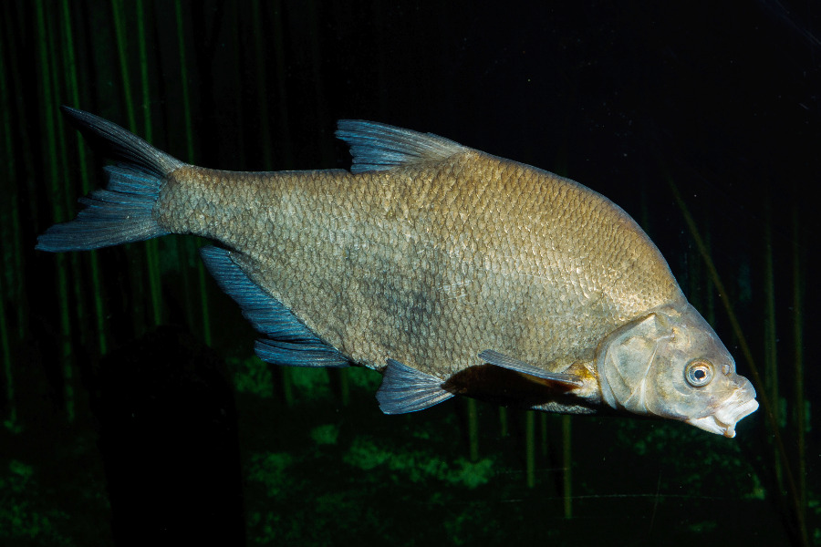

<article class="main-info">

_D-Brachsen, Brasse, Blei;_
_GB-Bream;_
_DK-Brasen;_
_PL-Leszcz;_
_LT-Karšis;_
_LV-Plaudis;_
_EST-Latikas;_
_RU-Лещ;_
_FIN-Lahna;_
_S-Braxen_

### Erkennungsmerkmale

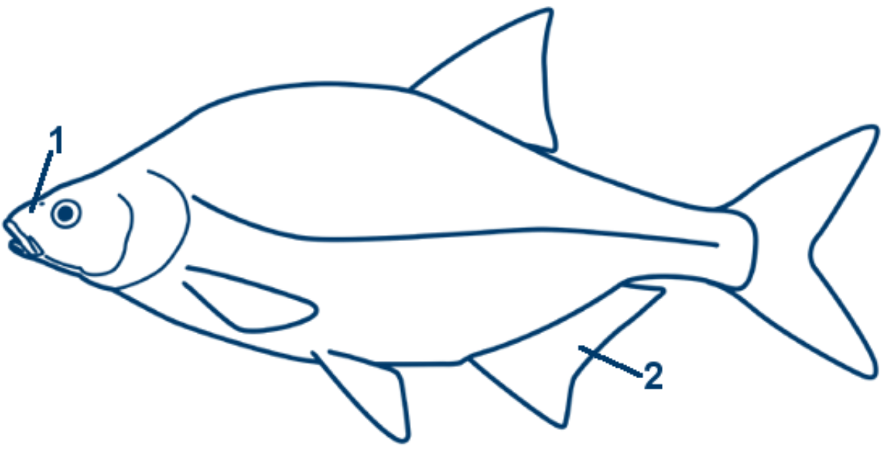

1. Lange Afterflosse.
2. Schnauze deutlich länger als Augendurchmesser.

* Maulspalte end- bis leicht unterständig.
* Maul weit rüsselartig vorstülpbar.
* Hochrückiger, stark seitlich abgeflachter Körper.
  Einheitlich silbern, grünlich oder bräunlich.

Meist 25 bis 40 cm, max. 90 cm Länge und 10 kg Gewicht.

### Ähnliche Arten

* [Güster](#güster) - Schnauze nur so lange wie Augendurchmesser; Ansätze der Brust- und Bauchflossen meist rötlich.
* [Zope](#zope) - Afterflosse noch länger, 39 bis 46 Strahlen (26 bis 31 Strahlen beim Brachsen); Flossenränder dunkel gesäumt.
* [Zährte](#zährte) - Schnauze nasenartig.

### Lebensweise

Lebt in kleinen Gruppen an bewachsenen Uferzonen mit weichem Grund von stehenden oder langsam fließenden Gewässern, in Mündungs- und Brackwasserbereichen und häufig auch in Seen.
Zum laichen versammeln sie sich im Frühsommer in großen Schwärmen im ufernahen Flachwasserbereich.

### Ernährung

Bodenbewohnende Kleintiere wie Insektenlarven, Muscheln, Schnecken und Krebstiere.

### Bedeutung

Wirtschaftliche Bedeutung als Speisefisch.

### Gefährdung

Nicht gefährdet.

</article>

<!-- class="sub-info" -->
> #### Abramis brama
>
> __Familie:__ Cyprinidae
>
> __Ordnung:__ Cypriniformes
>
> 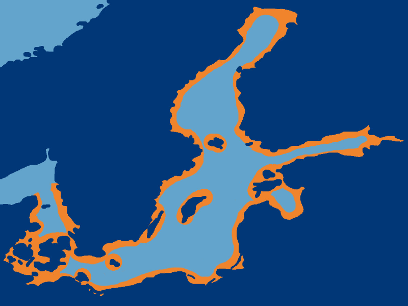
>
> __Verbreitung:__ Im gesamtem küstennahen Bereich der Ostsee.
>
> __Häufigkeit:__ sehr häufig
>
> __Gefährdung:__ nicht gefährdet

## Großer Scheibenbauch

<article class="main-info">

_D-Grosser Scheibenbauch;_
_GB-Sea snail, Striped seasnail;_
_DK-Ringbug;_
_PL-Dennik;_
_LT-Gleivys;_
_LV-Plūkšņzivs;_
_EST-Pullukala;_
_RU-Европейский липарис;_
_FIN-Imukala;_
_S-Ringbuk_

### Erkennungsmerkmale

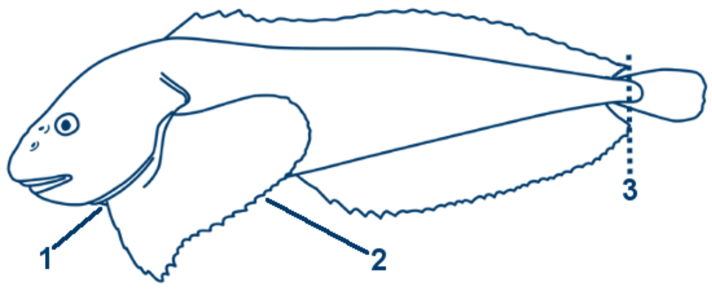

1. Brustflossenansatz reicht bis unter den Kopf.
2. Bauchflossen zu einer runden Saugscheibe umgewandelt.
3. Rücken- und Afterflosse überragen den Ansatz der Schwanzflosse.

* Körper kaulquappenförmig

Meist 12 bis 15 cm, max. 18 cm Länge.

### Ähnliche Arten

* [Kleiner Scheibenbauch](#kleiner-scheibenbauch) - Enden von Rücken- und Afterflosse überlappen nicht den Ansatz der Schwanzflosse.

### Lebensweise

Bodenbewohner in Flachwasserbereichen von Algenregionen, aber auch über Geröll, bis max. 300 m Tiefe.
Laicht in den Wintermonaten; häufig auch in der Nähe von Flussmündungen.

### Ernährung

Wirbellose Kleintiere, vor allem Krebstiere.

### Bedeutung

Keine wirtschaftliche Bedeutung.

### Gefährdung

Rückgang der Bestände durch Lebensraumverlust und steigende Gewässerverschmutzung.

</article>

<!-- class="sub-info" -->
> #### Liparis liparis
>
> __Familie:__ Liparidae
>
> __Ordnung:__ Scorpaeniformes
>
> 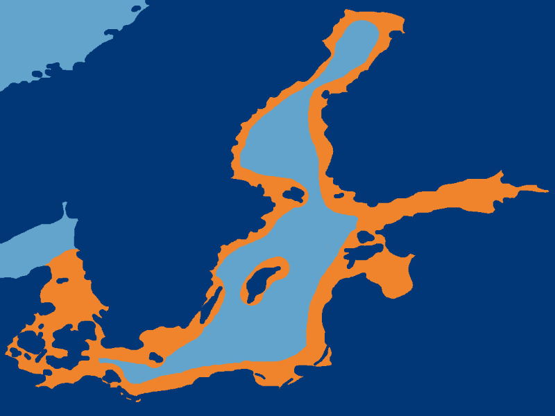
>
> __Verbreitung:__ Verbreitung: Regelmäßig im gesamten Küstennahen Bereich der Ostsee.
>
> __Häufigkeit:__ regelmäßig
>
> __Gefährdung:__ unklar

## Kleiner Scheibenbauch

<article class="main-info">

_D-Kleiner Scheibenbauch;_
_GB-Montagu‘s seasnail;_
_DK-Særfinnet Ringbug;_
_PL-Tlusciel;_
_EST-Montagu kulleskala;_
_S-Tångringbuk_

### Erkennungsmerkmale

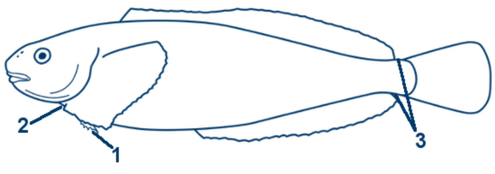

1. Bauchflossen zu einer runden Saugscheibe umgewandelt.
2. Brustflossenansatz reicht bis unter den Kopf.
3. Rücken- und Afterflosse enden vor dem Ansatz der Schwanzflosse.

* Körper kaulquappenförmig.

Meist etwa 9 cm, max. bis 12 cm Länge.

### Ähnliche Arten

* [Großer Scheibenbauch](#großer-scheibenbauch) - Enden von Rücken- und Afterflosse überlappen den Ansatz der Schwanzflosse.

### Lebensweise

Bodenbewohner meist in sehr flachem Wasser mit dichtem Algenbewuchs, aber auch über Geröll, bis 30 m Tiefe; häufig auch in Gezeitenzonen; Laichzeit ist im Frühjahr und Frühsommer.

### Ernährung

Wirbellose Kleintiere.

### Bedeutung

Keine wirtschaftliche Bedeutung.

### Gefährdung

Rückgang der Bestände durch Lebensraumverlust und steigende Gewässerverschmutzung.

</article>

<!-- class="sub-info" -->
> #### Liparis montagui
>
> __Familie:__ Liparidae
>
> __Ordnung:__ Scorpaeniformes
>
> 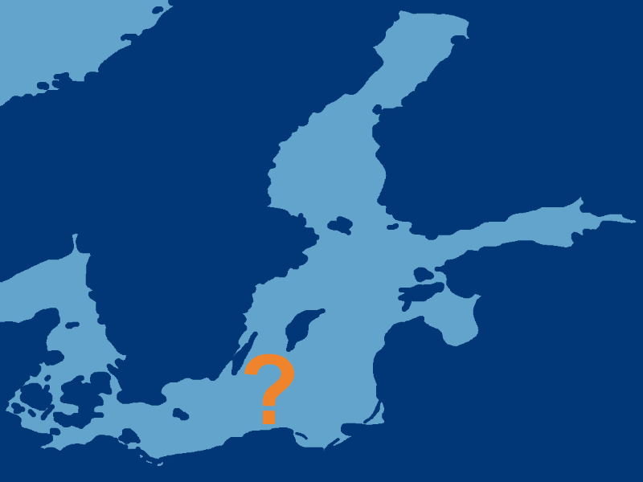
>
> __Verbreitung:__ Sehr selten in der Ostsee.
>
> __Häufigkeit:__ sehr selten
>
> __Gefährdung:__ unklar

## Graskarpfen

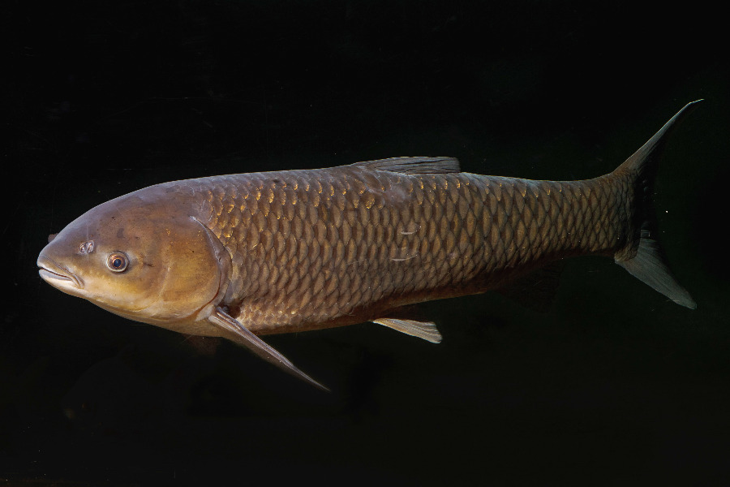
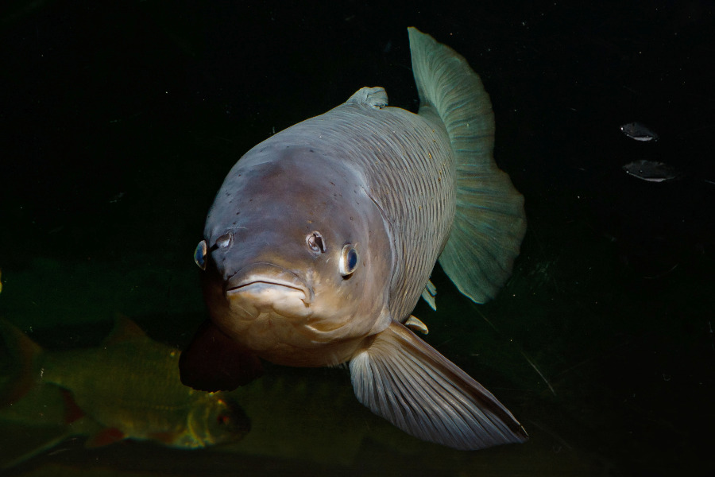
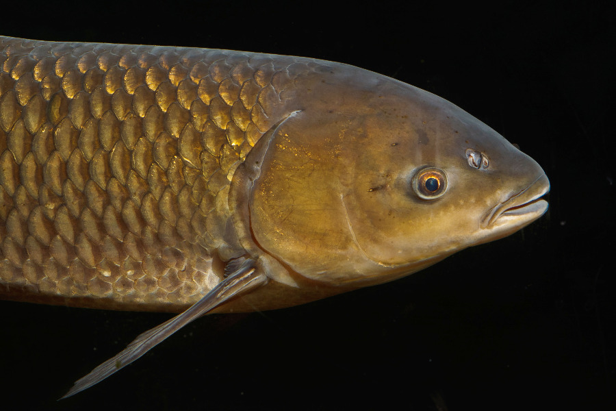
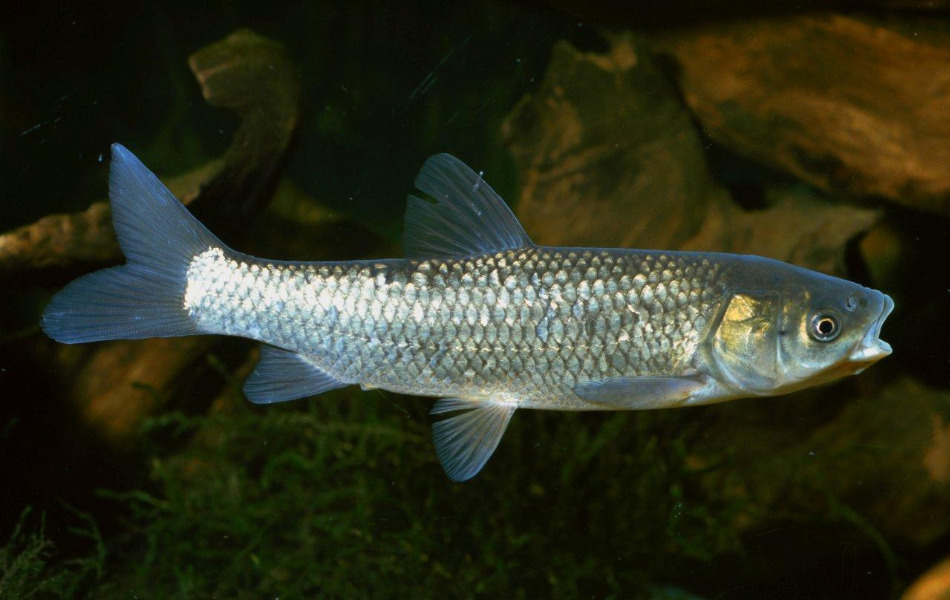
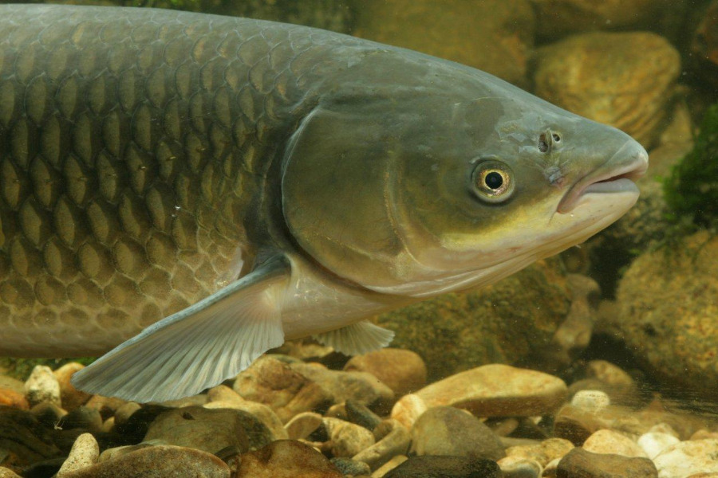

<article class="main-info">

_D-Graskarpfen;_
_GB-Grass carp;_
_DK-Græskarpe;_
_PL-Amur biały;_
_LT-Baltais amūrs;_
_LV-Baltasis amūras;_
_EST-Valgeamuur;_
_RU-Белый амур;_
_FIN-Ruohokarppi;_
_S-Gräskarp_

### Erkennungsmerkmale

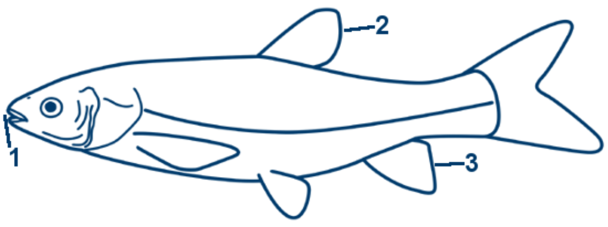

1. Maul groß und leicht unterständig.
2. Äußerer Rand der Rückenflosse nach außen gebogen.
3. Äußerer Rand der Afterflosse gerade.

* Körper langgestreckt; fast kreisrund im Durchschnitt.
* Rücken bräunlich-grünlich, Flanken golden, Bauch heller.

Bis max. 120 cm Länge.

### Ähnliche Arten

* [Döbel](#döbel) - oberer Rand der Rückenflosse nach innen gewölbt; äußerer Rand der Afterflosse deutlich nach außen gewölbt; Maulspalte endständig.
* [Hasel](#hasel) - Außenrand der Afterflosse nach innen gebogen; Schuppen kleiner, 47 bis 53 in der Seitenlinie (42 bis 45 beim Graskarpfen); ohne Netzmuster.
* [Aland](#aland) - kleine, nach oben gerichtete Maulspalte; Schuppen kleiner, 55 bis 61 in der Seitenlinie (42 bis 45 beim Graskarpfen).

### Lebensweise

Nicht heimisch in Europa; Vorkommen durch Besatzmaßnahmen; natürliche Vermehrung möglicherweise in der Donau, der Wolga und im Ural.

### Ernährung

Ernährt sich ausschließlich von Pflanzen.

### Bedeutung

Im natürlichen Verbreitungsgebiet von wichtiger wirtschaftlicher Bedeutung.

### Gefährdung

In der Ostee nicht gefährdet, da dort nicht heimisch.

</article>

<!-- class="sub-info" -->
> #### Ctenopharyngodon idella
>
> __Familie:__ Cyprinidae
>
> __Ordnung:__ Cypriniformes
>
> 
>
> __Verbreitung:__ Selten, nur durch Besatzmaßnahmen.
>
> __Häufigkeit:__ sehr selten
>
> __Gefährdung:__ nicht gefährdet

## Ziege

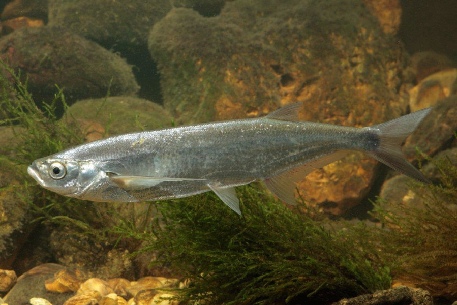
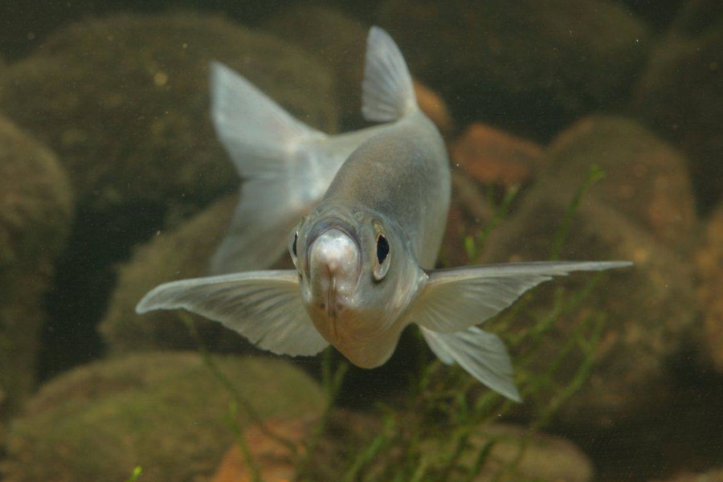
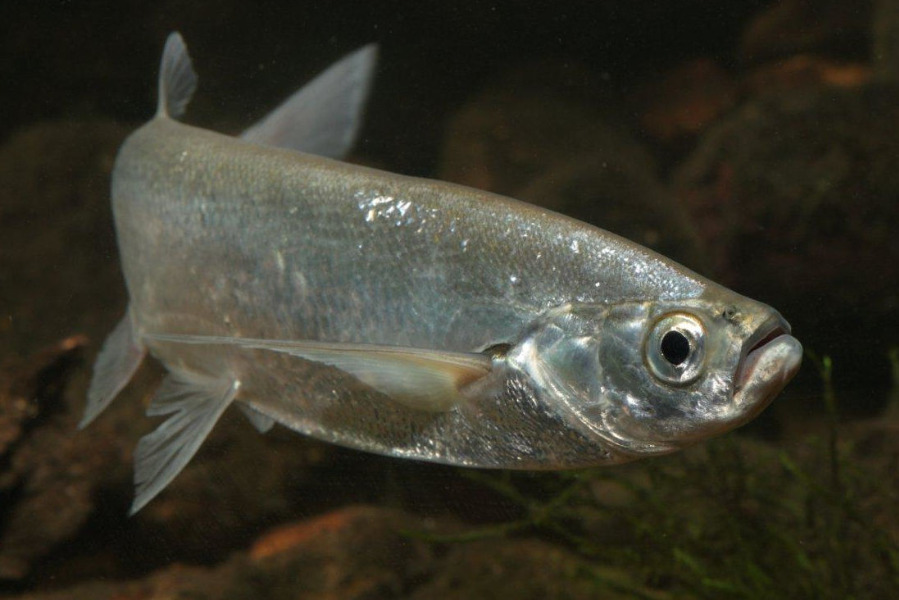

<article class="main-info">

_D-Ziege, Siechling;_
_GB-Razorfish;_
_DK-Sabelkarpe;_
_PL-Ciosa;_
_LT-Ožka;_
_LV-Kaze;_
_EST-Nugakala;_
_RU-Чехонь;_
_FIN-Miekkasärki;_
_S-Skärkniv_

### Erkennungsmerkmale

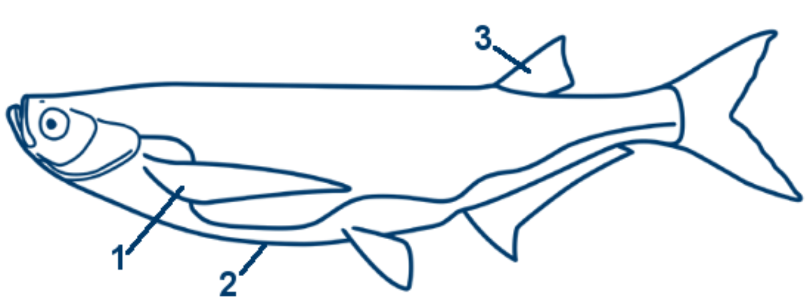

1. Sehr große, flügelartige Brustflossen.
2. Kielartige Bauchlinie.
3. Kleine, weit hinten liegende Rückenflosse.

* Maul oberständig.
* Körper lang gestreckt mit einheitlich silberner Färbung.

Meist etwa 25 bis 35 cm, bis max. 60 cm Länge.

### Ähnliche Arten

\- unverwechselbar

### Lebensweise

Lebt im Schwarm oberflächennah im offenen Wasser langsam fließender Flussunterläufe, großer Seen und Brackwasserbereichen.
Zur Laichzeit wandern sie in großen Schwärmen flussaufwärts, um ein abdriften ins Meer der ins Freiwasser abgegeben Eier zu verhindern.

### Ernährung

Zooplankton wie Krebstiere, Larven und Insekten.
Als Erwachsenentiere häufig auch kleine Fische.

### Bedeutung

Geringe wirtschaftliche Bedeutung.

### Gefährdung

Im Verbreitungsgebiet Ostsee sehr selten und stark gefährdet, in anderen Teilen des Verbreitungsgebietes gilt die Art als nicht gefährdet.

</article>

<!-- class="sub-info" -->
> #### Pelecus cultratus
>
> __Familie:__ Cyprinidae
>
> __Ordnung:__ Cypriniformes
>
> 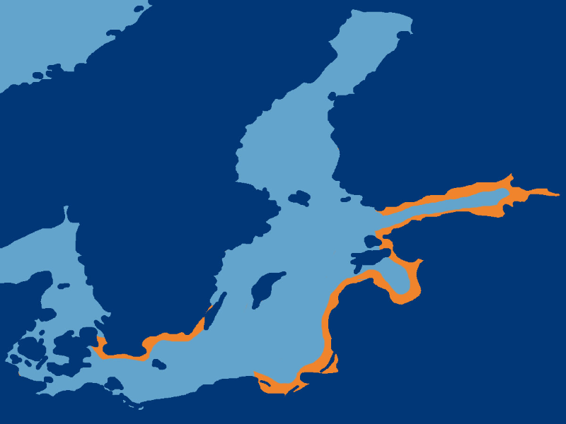
>
> __Verbreitung:__ Im südlichen und östlichen Bereich der Ostsee und im südlichen Teil Schwedens.
>
> __Häufigkeit:__ selten
>
> __Gefährdung:__ nicht gefährdet

## Ukelei

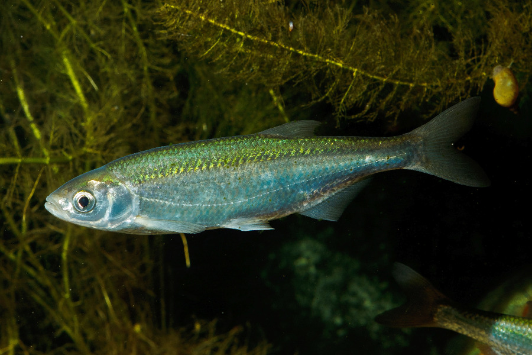
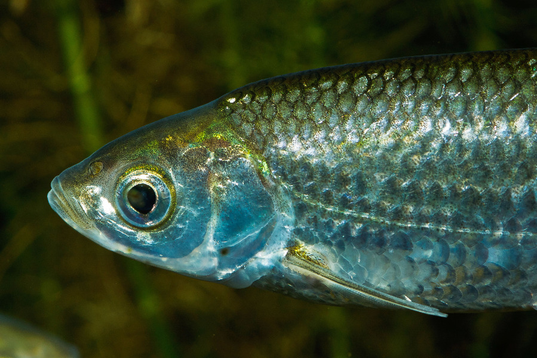
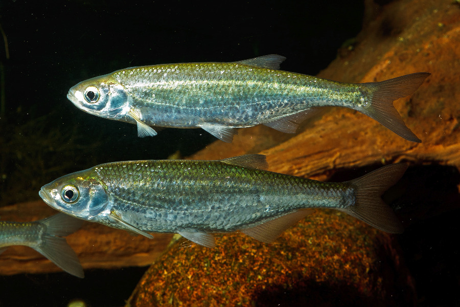
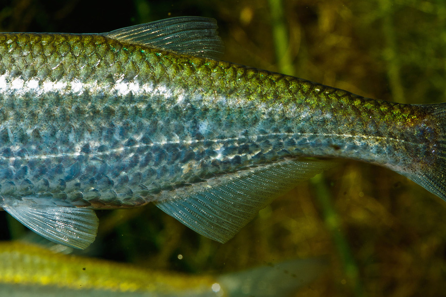

<article class="main-info">

_D-Ukelei, Laube, Zwiebelfisch;_
_GB-Bleak;_
_DK-Løje;_
_PL-Ukleja;_
_LT-Aukšlė;_
_LV-Vīķe;_
_EST-Viidikas;_
_RU-Уклейка;_
_FIN-Salakka;_
_S-Löja_

### Erkennungsmerkmale

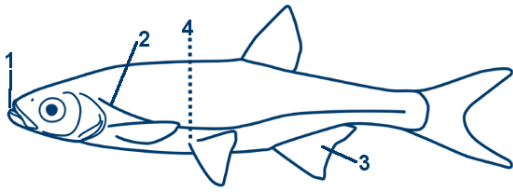

1. Oberständige, steil stehende Maulspalte.
2. Durchgängige Seitenlinie.
3. Lange Afterflosse.
4. Bauchflossen beginnen deutlich vor der Rückenflosse.

* Lang gestreckter Körper; graugrün mit starkem Silberglanz auf Seiten und Bauch; hell oder golden reflektierender Streifen auf den Flanken.

Meist 12 bis 15 cm, bis max. 25 cm Länge.

### Ähnliche Arten

* [Moderlieschen](#moderlieschen) - Seitenlinie nicht vollständig; Afterflosse kürzer (weniger als die Hälfte der Strecke Ansatz Afterflosse bis Ansatz Schwanzflosse einnehmend).
* [Kleine Maräne](#kleine-maräne) - mit Fettflosse; Bauchflossen stehen unter der Rückenflosse.
* [Hering](#hering) - größere, weniger steile Maulspalte, Bauchflosse stehen hinter dem Ansatz der Rückenflosse.
* [Sprotte](#sprotte) - größere, weniger steile Maulspalte; gesägte Bauchkante; Afterflosse beginnt weit hinter dem Ende der Rückenflosse.

### Lebensweise

Lebt im Schwarm oberflächennah im freien Wasser langsam fließender und stehender Gewässer, sowie in Brackwasserbereichen.
Laicht an flachen Uferstellen über Hart- und Kiesgrund, seltener über Wasserpflanzen.

### Ernährung

Tierisches und pflanzliches Plankton, sowie Insekten.

### Bedeutung

Früher wirtschaftliche Bedeutung als Speisefisch, heute vorwiegend als Köderfisch genutzt.

### Gefährdung

Vermutlich nicht gefährdet, jedoch wurden in Norddeutschland starke, ungeklärte Rückgänge verzeichnet.

</article>

<!-- class="sub-info" -->
> #### Alburnus alburnus
>
> __Familie:__ Cyprinidae
>
> __Ordnung:__ Cypriniformes
>
> 
>
> __Verbreitung:__ Regelmäßig in küstennahen Brackwasserbereichen der gesamten Ostsee.
>
> __Häufigkeit:__ sehr häufig
>
> __Gefährdung:__ nicht gefährdet

## Moderlieschen

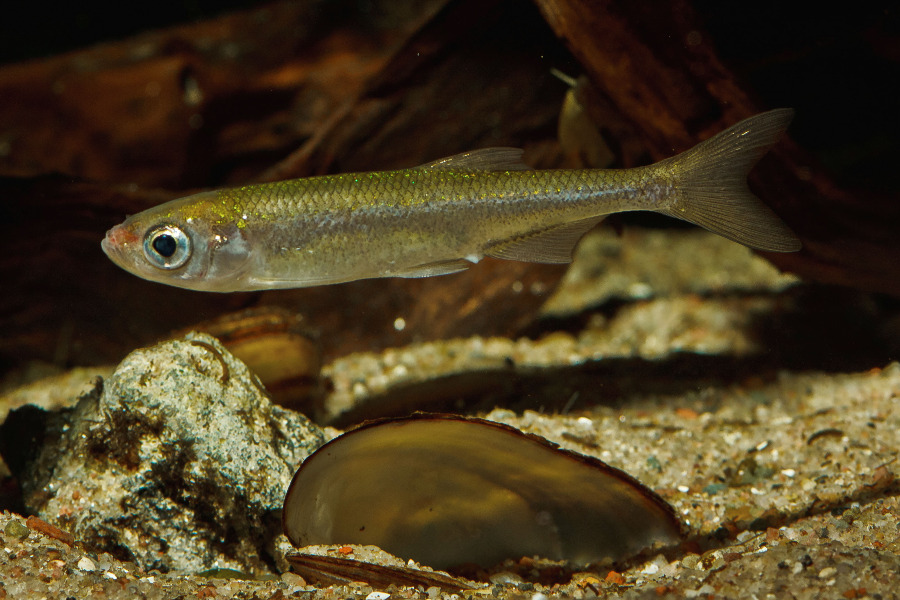
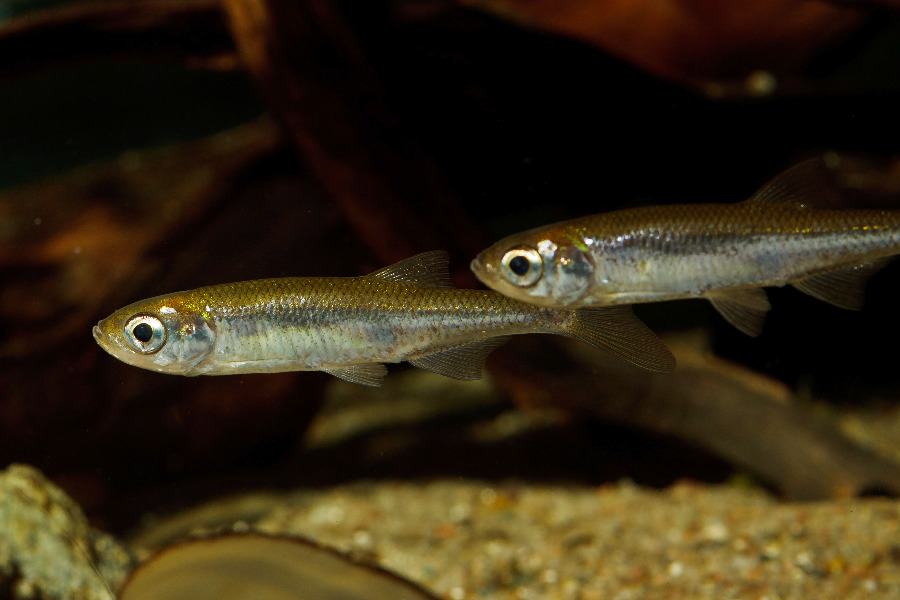
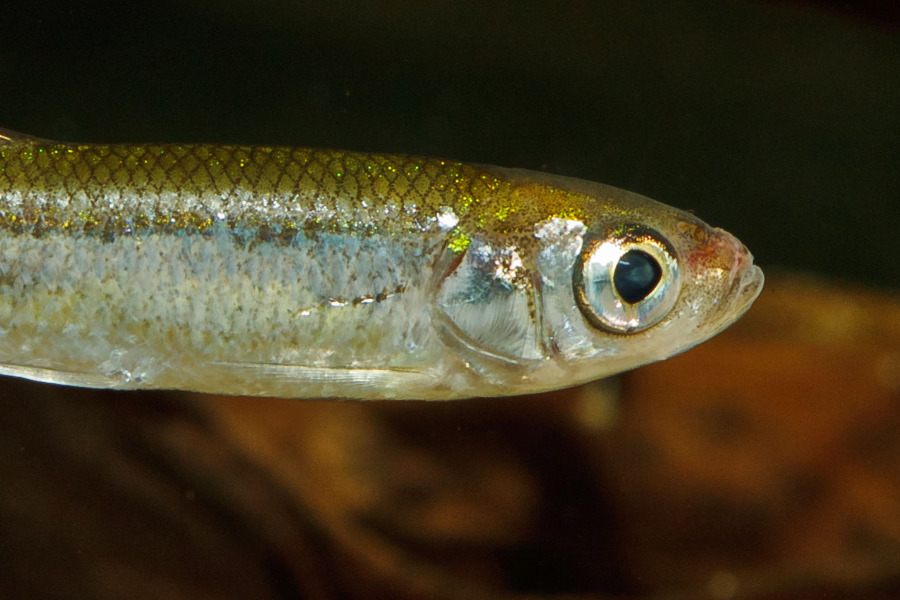

<article class="main-info">

_D-Moderlieschen;_
_GB-Sunbleak, belica;_
_DK-Regnløje;_
_PL-Pospolita, owsianka;_
_LT-Saulažuvė;_
_LV-Ausleja;_
_EST-Mudamaim;_
_RU-Верховка;_
_FIN-Allikkosalakka;_
_S-Groplöja_

### Erkennungsmerkmale

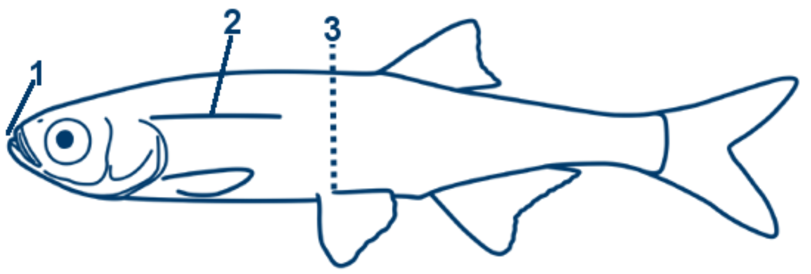Erkennungsmerkmale

1. Oberständige Maulspalte.
2. Seitenlinie unvollständig (zieht nicht über die gesamte Seite).
3. Bauchflossenansatz endet vor dem Beginn der Rückenflosse.

* Sehr langgestreckter Körper; einheitlich silbern mit dunklem, bläulichem Band auf der hinteren Hälfte der Flanken.

Meist 6 bis 8 cm, bis max. 12 cm Länge.

### Ähnliche Arten

* [Ukelei](#ukelei) - Seitenlinie vollständig; Afterflosse viel länger (mehr als die Hälfte der Strecke Ansatz Afterflosse bis Ansatz Schwanzflosse einnehmend).
* [Kleine Maräne](#kleine-maräne) - mit Fettflosse.
* [Hering](#hering) - größere, weniger steile Maulspalte; Bauchflosse stehen hinter dem Ansatz der Rückenflosse.
* [Sprotte](#sprotte) - größere, weniger steile Maulspalte; gesägte Bauchkante; Afterflosse beginnt weit hinter dem Ende der Rückenflosse.

### Lebensweise

Lebt oberflächennah im Schwarm, meist in Nähe dichter Vegetation in langsam fließenden oder stehenden Kleingewässern.
In der Laichzeit finden sie sich paarweise zusammen.
Die Weibchen geben ihre etwa 150 Eier in Form eines Bandes an Pflanzenstängel ab; die Männchen betreiben Brutpflege.

### Ernährung

Tierisches und pflanzliches Plankton, sowie Insekten.

### Bedeutung

Keine wirtschaftliche Bedeutung.

### Gefährdung

Vermutlich nicht gefährdet.

</article>

<!-- class="sub-info" -->
> #### Leucaspius delineatus
>
> __Familie:__ Cyprinidae
>
> __Ordnung:__ Cypriniformes
>
> 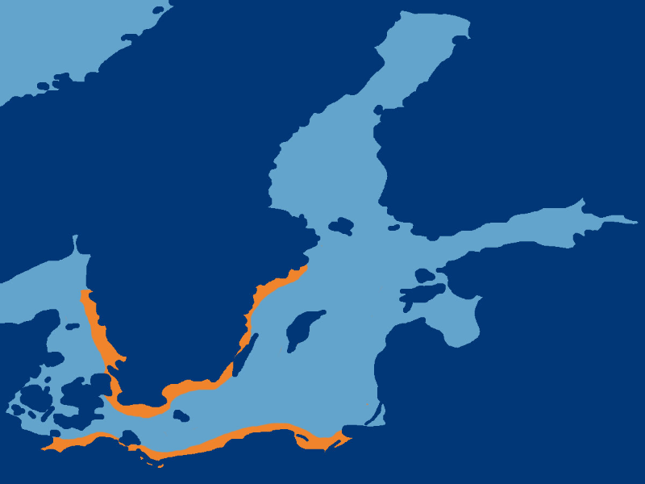
>
> __Verbreitung:__ Regelmäßig im südlichen und östlichen küstennahen Bereich der Ostsee und Bereichen Südschwedens; im bottnischen und finnischen Meerbusen fehlend.
>
> __Häufigkeit:__ regelmäßig
>
> __Gefährdung:__ unklar

## Hecht

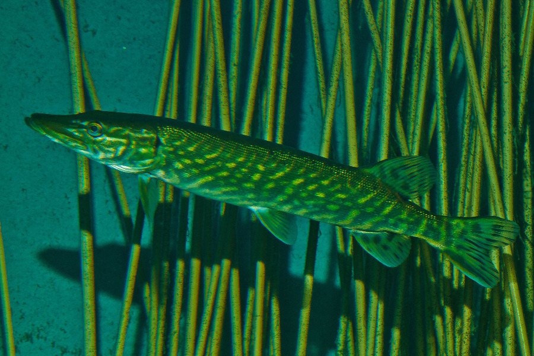
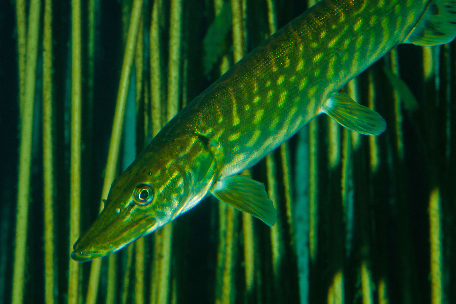
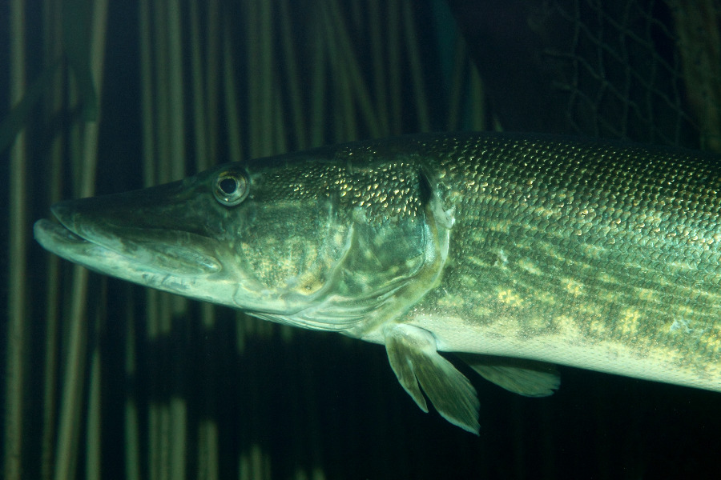
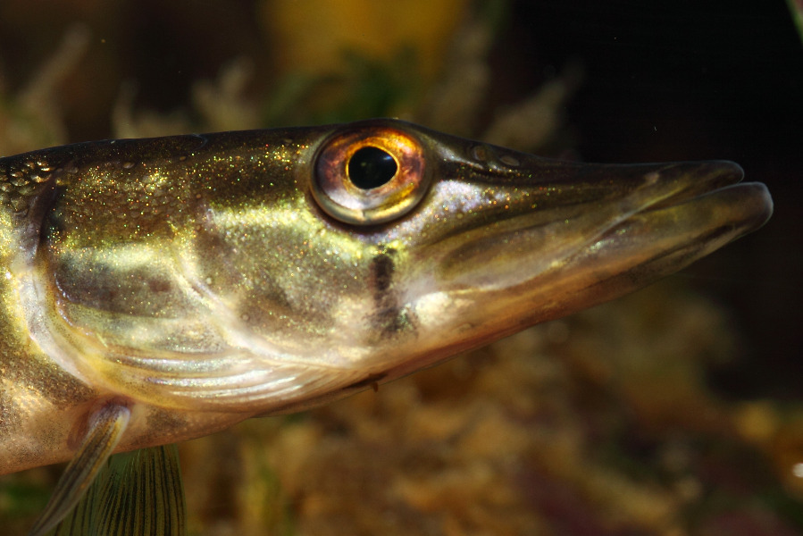

<article class="main-info">

_D-Hecht;_
_GB-Pike;_
_DK-Gedde;_
_PL-Szczupak;_
_LT-Lydeka;_
_LV-Līdaka;_
_EST-Haug;_
_RU-Щука;_
_FIN-Hauki;_
_S-Gädda_

### Erkennungsmerkmale

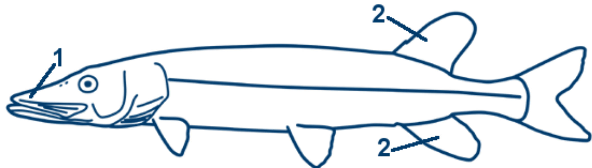

1. Maul entenschnabelförmig und oberständig.
2. Gleichgroße, weit hinten ansetzende Rücken- und Afterflosse.

* Langgestreckter Körper.
* Gelb-grünlich, marmorierte Grundfärbung mit gelben Flecken oder Streifen, Bauch heller.

Meist 40 bis 60 cm, bis max. 137 cm Länge.

### Ähnliche Arten

\- unverwechselbar

### Lebensweise

Tagaktiver Lauerjäger; bevorzugt dichtbewachsene, langsam fließende Gewässer.
Erreichen der Geschlechtsreife nach 3 bis 4 Jahren.
Weibchen können bis zu 300.000 Eier produzieren.

### Ernährung

Bevorzugt Karpfenfische, aber auch Frösche, kleine Vögel und Säugetiere.

### Bedeutung

Keine hohe wirtschaftliche Bedeutung als Speisefisch, jedoch beliebter Angelfisch.

### Gefährdung

Nicht gefährdet.

</article>

<!-- class="sub-info" -->
> #### Esox lucius
>
> __Familie:__ Esocidae
>
> __Ordnung:__ Esociformes
>
> 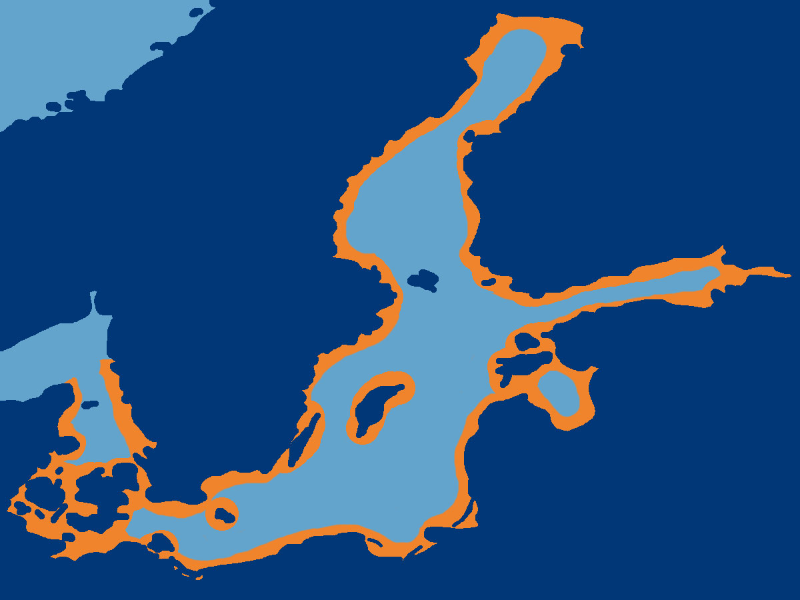
>
> __Verbreitung:__ Entlang der gesamten Ostseeküste.
>
> __Häufigkeit:__ sehr häufig
>
> __Gefährdung:__ nicht gefährdet

## Wels

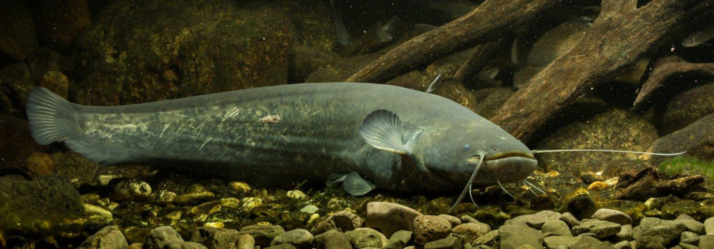
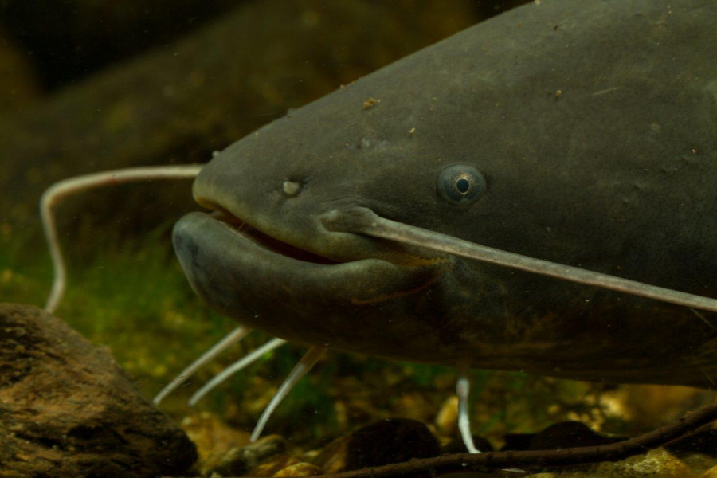
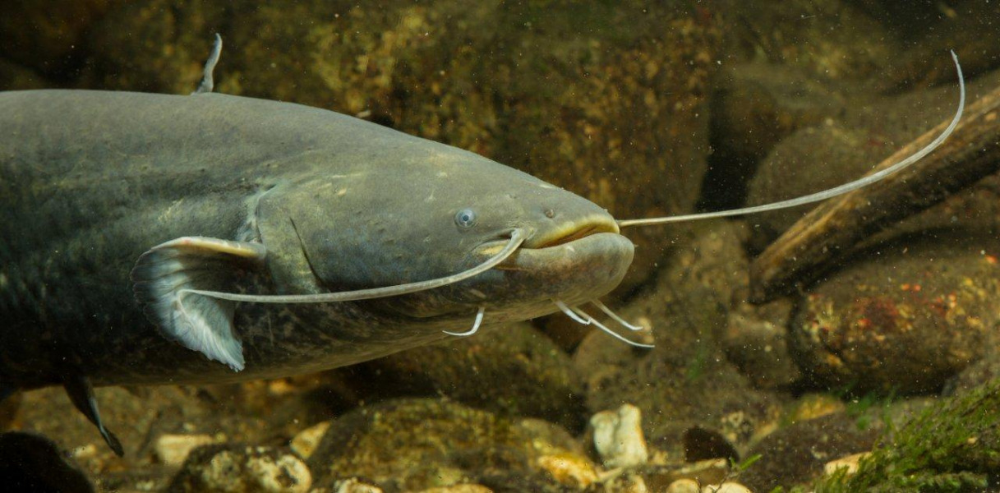

<article class="main-info">

_D-Wels, Waller;_
_GB-Catfish, wels catfish;_
_DK-Malle;_
_PL-Sum;_
_LT-Šamas;_
_LV-Sams;_
_EST-Säga;_
_RU-Обыкновенный сом;_
_FIN-Monni;_
_S-Mal_

### Erkennungsmerkmale

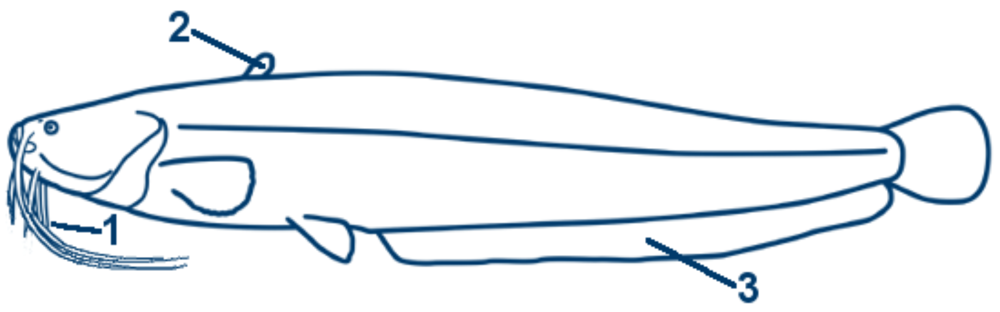

1. 3 Paar Barteln, 1 Paar sehr lange Barteln seitlich am Oberkiefer und 2 Paar kürzere an der Kopfunterseite.
2. Sehr kleine Rückenflosse.
3. Sehr lange Afterflosse, mehr als halbe Körperlänge.

* Körper langgestreckt und schuppenlos.
* Färbung meist dunkel, häufig marmoriert, Bauchseite heller.

Meist 2 bis 3 m, bis max. 5m Länge und über 300 kg Gewicht.

### Ähnliche Arten

* [Zwergwels](#zwergwels) - 4 Paar Barteln; ein zusätzliches Paar an der Kopfoberseite; Fettflosse vorhanden.

### Lebensweise

Nachtaktiver Bodenbewohner, bevorzugt langsam fließende oder stehende Gewässer.
Während der Paarungszeit bauen Männchen grubenartige Nester.
Stark reduzierte Augen, dafür sehr guter Geruchs-, Geschmacks-, Tast- und Gehörsinn.

### Ernährung

Fische, Amphibien, Wasservögel und Kleinsäuger.
Die Beute wird auch mit Hilfe von Elektrorezeptoren aufgespürt.

### Bedeutung

Lokal sehr unterschiedlich, zum Teil wirtschaftliche Bedeutung und beliebter Angelfisch, anderen Orts als Schadfisch angesehen.

### Gefährdung

Vermutlich nicht gefährdet.

</article>

<!-- class="sub-info" -->
> #### Silurus glanis
>
> __Familie:__ Siluridae
>
> __Ordnung:__ Siluriformes
>
> 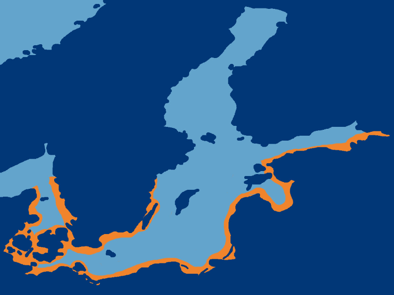
>
> __Verbreitung:__ Küstenregion der gesamten süd-östlichen Ostsee.
>
> __Häufigkeit:__ selten
>
> __Gefährdung:__ nicht gefährdet

## Zwergwels

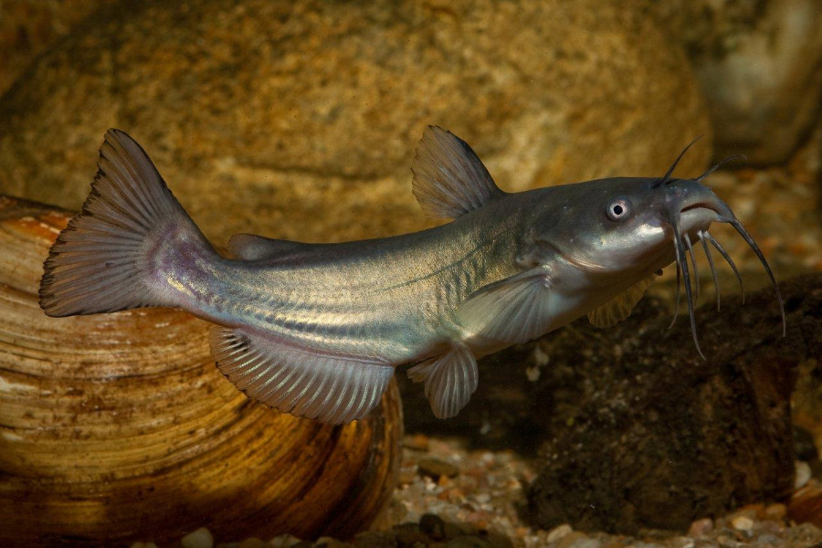
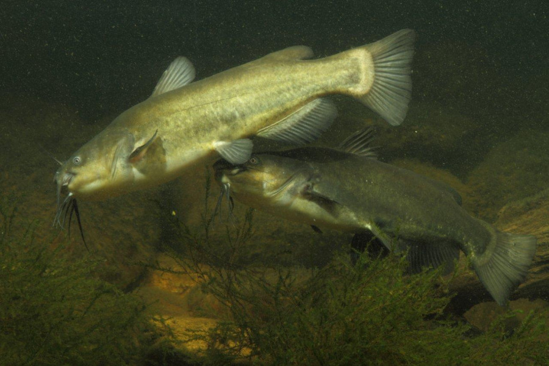
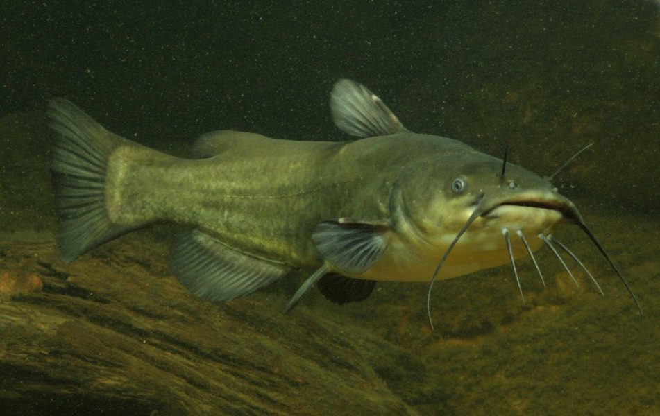

<article class="main-info">

_D-Katzenwels, Zwergwels;_
_GB-Brown bullhead;_
_DK-Dværgmalle;_
_PL-Sumik karłowaty;_
_EST-Harilik kasssäga;_
_RU-Американский сомик;_
_FIN-Piikkimonni;_
_S-Dvärgmal_

### Erkennungsmerkmale

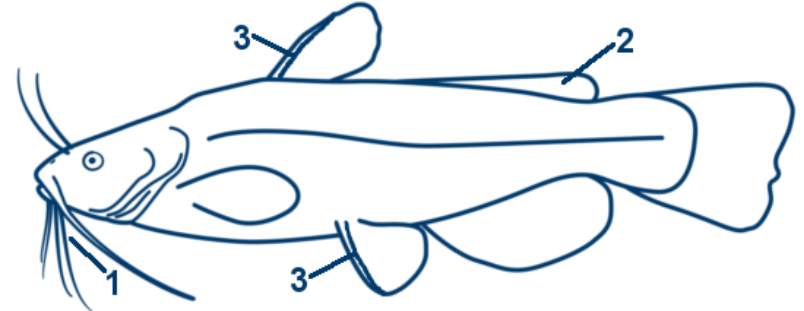

1. 8 Barteln, je 2 Paar an Kopfober- und Kopfunterseite.
2. Fettflosse vorhanden.
3. erster Strahl von Rücken- und Bauchflosse zu Knochenstachel umgebildet;

* Haut ohne Schuppen; Seitenlinienorgan gut sichtbar.

Meist 20 bis 30 cm, bis max. 50 cm Länge.

### Ähnliche Arten

* [Wels](#wels) - nur 1 Paar Barteln auf der Kopfoberseite; keine Fettflosse.

### Lebensweise

Nachtaktiver Bodenbewohner klarer, stark bewachsener, still und langsam fließender Gewässer.
Elterntiere legen grubenartige Nester an, in denen die Eier und die Jungfische von den Männchen bewacht werden.

### Ernährung

Kleine Wirbellose, Krebstiere, kleine Fische und Fischlaich, aber auch pflanzliches Material, wie Algen.

### Bedeutung

Lokal wirtschaftliche Nutzung als beliebter Speisefisch, anderorts als Fischereischädling bekannt.

### Gefährdung

Nicht heimisch.

</article>

<!-- class="sub-info" -->
> #### Ameiurus nebulosus
>
> __Familie:__ Ictaluridae
>
> __Ordnung:__ Siluriformes
>
> 
>
> __Verbreitung:__ Sehr selten, küstennah.
>
> __Häufigkeit:__ sehr selten
>
> __Gefährdung:__ nicht gefährdet

## Hornhecht

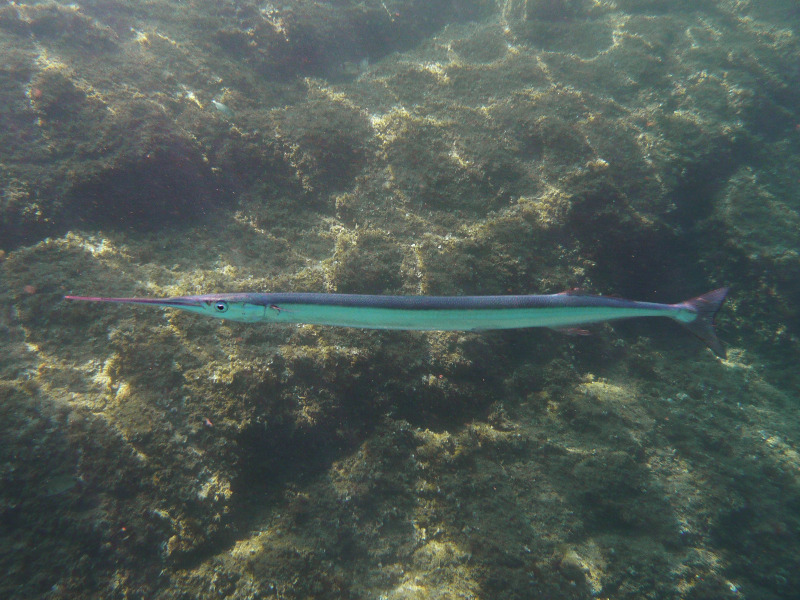
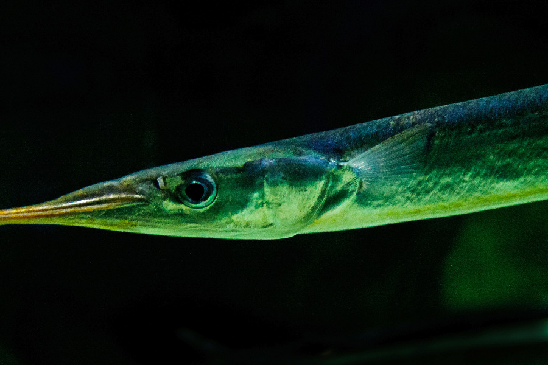
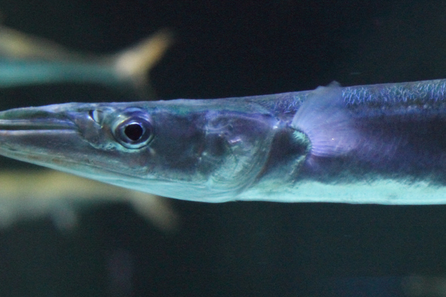
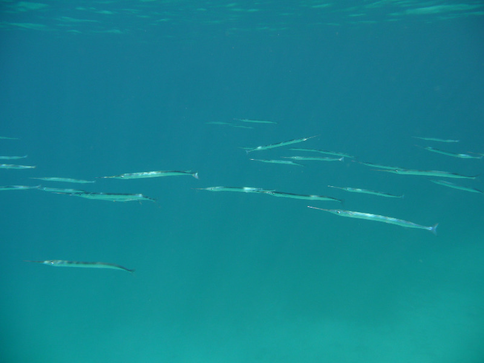

<article class="main-info">

_D-Hornhecht;_
_GB-Garfish;_
_DK-Hornfisk;_
_PL-Belona;_
_LT-Vėjažuvė;_
_LV-Vējzivs;_
_EST-Tuulehaug;_
_RU-Cарган;_
_FIN-Nokkakala;_
_S-Näbbgädda_

### Erkennungsmerkmale

1. Schnabelartig verlängertes Maul.
2. Rückenflosse setzt sehr weit hinten an.

* Körper sehr langgestreckt und rundlich.
* Rücken dunkelblau bis grün; Flanken silbrig; Bauchseite weiß.

Meist 40 bis 70 cm, max. 90 cm Länge.

### Ähnliche Arten

* [Makrelenhecht](#makrelenhecht) - 5 bis 7 Flösselchen hinter Rücken- und Afterflosse.

### Lebensweise

Tagaktiver, Schwärme bildender Fisch des offenen Wassers, der große Wanderungen unternimmt.
Zum Laichen ziehen sie in Küstennähe; Eier werden an langen Klebefäden an Steine und Pflanzen angeheftet.

### Ernährung

Kleine Schwarmfische wie Junghering, Sprotte, Ährenfische und Sandaale, aber auch Wirbellose; (außerhalb der Ostsee auch häufig Tintenfische).

### Bedeutung

Bedeutung als Speisefisch.

### Gefährdung

Nicht gefährdet.

</article>

<!-- class="sub-info" -->
> #### Belone belone
>
> __Familie:__ Belonidae
>
> __Ordnung:__ Beloniformes
>
> 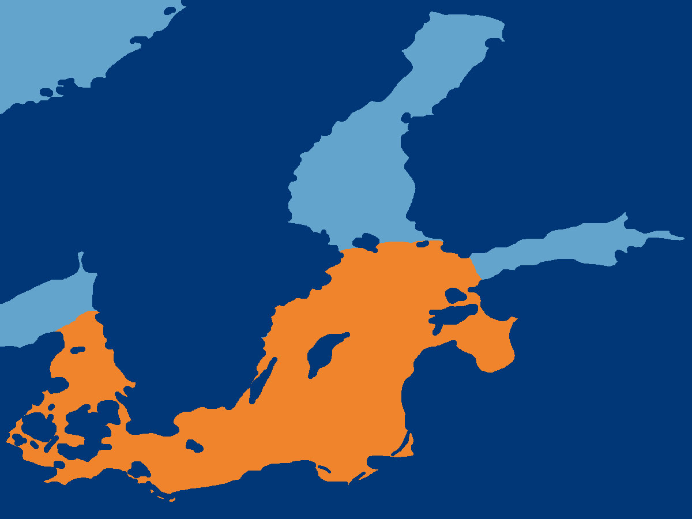
>
> __Verbreitung:__ Häufig in der Ostsee, außer im finnischen und bottnischen Meerbusen.
>
> __Häufigkeit:__ sehr häufig
>
> __Gefährdung:__ nicht gefährdet

## Makrelenhecht

<article class="main-info">

### Erkennungsmerkmale

_D-Makrelenhecht;_
_GB-Atlantic saury;_
_DK-Makrelgedde;_
_PL-Makrelosz;_
_EST-Makrellhaug;_
_RU-Атлантическая сайра;_
_FIN-Makrillihauki;_
_S-Makrillgädda_

1. Schnabelartig verlängertes Maul.
2. Weit hinten ansetzende After- und Rückenflosse. 
3. 5 bis 7 Flössel vorhanden.

* Körper sehr langgestreckt und schmal.
* Rücken bläulich oder olivfarben; Bauchseite gold bis silbrig.

Meist 30 cm Länge, bis max. 50 cm Länge.

### Ähnliche Arten

* [Hornhecht](#hornhecht) - ohne Flösselchen hinter Rücken- und Afterflosse.

### Lebensweise

Schwarmbildender Freiwasserfisch, der sich meist dicht unter der Wasseroberfläche aufhält; das Laichen geschieht im offenen Wasser, die Eier werden durch Klebefäden an treibenden Tang angehaftet.

### Ernährung

Vorwiegend freischwimmende Krebstiere, aber auch kleinere Fische.

### Bedeutung

Geringe wirtschaftliche Bedeutung.

### Gefährdung

Vermutlich nicht gefährdet.

</article>

<!-- class="sub-info" -->
> #### Scomberesox saurus
>
> __Familie:__ Scomberexocidae
>
> __Ordnung:__ Beloniformes
>
> 
>
> __Verbreitung:__ Sehr seltener Irrgast in der Ostsee.
>
> __Häufigkeit:__ sehr selten
>
> __Gefährdung:__ unklar

## Seestichling

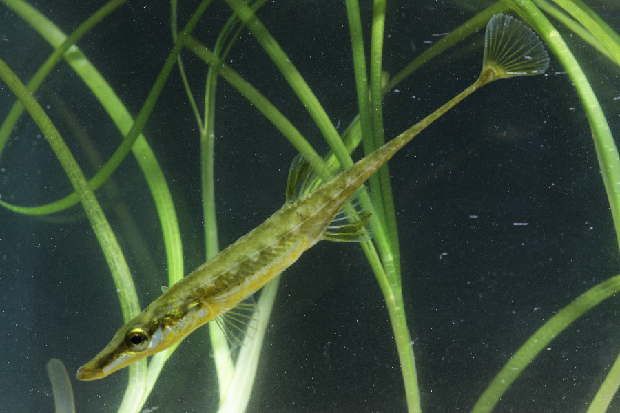
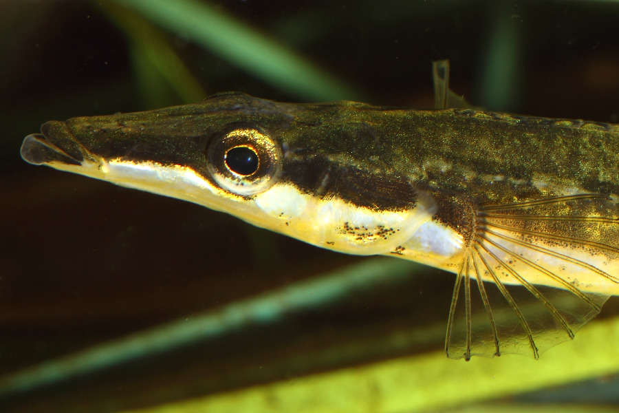
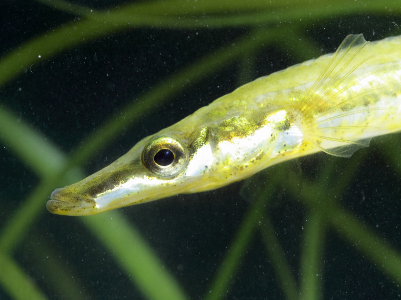
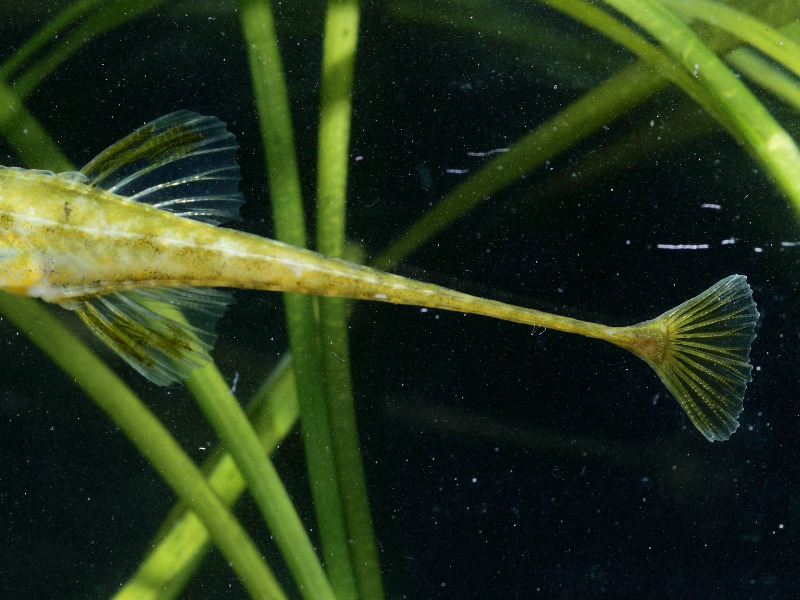
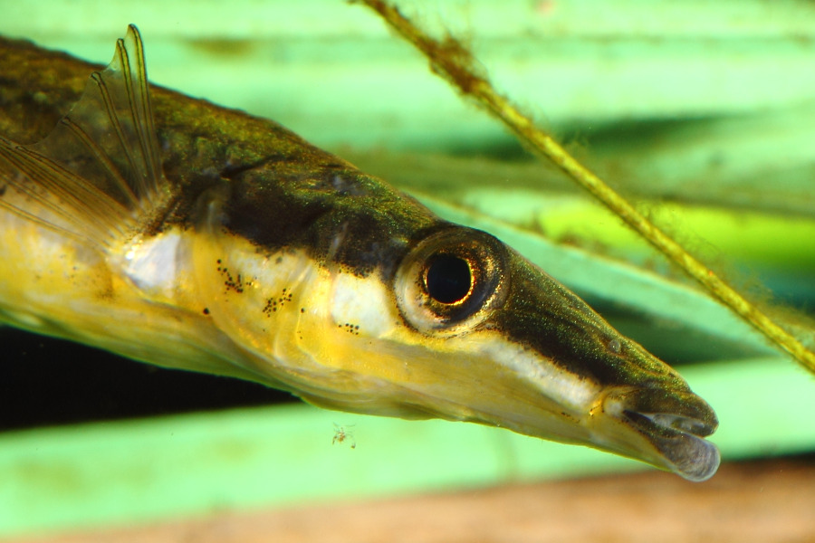

<article class="main-info">

_D-Seestichling;_
_GB-Fifteen-spined stickleback, Sea stickleback;_
_DK-Tangsnarre;_
_PL-Pocierniec;_
_LT-Jūrinė dyglė;_
_LV-Jūrasstagars;_
_EST-Pocierniec;_
_RU-Морская колюшка;_
_FIN-Vaskikala;_
_S-Tångspigg_

### Erkennungsmerkmale

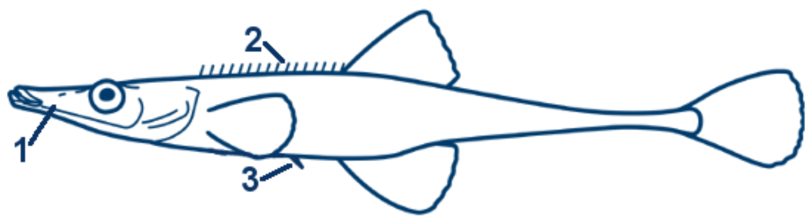

1. längliche Schnauze.
2. 14-17 freie Stacheln am Rücken (oft angelegt und schwer zu sehen).
3. Bauchflossen stachelartig.

* Körper langgestreckt.
* Färbung bräunlich-silbrig.

Meist bis 20 cm, max. 25 cm Länge.

### Ähnliche Arten

* [Dreistachliger Stichling](#dreistachliger-stichling) - nur 3 freie Stacheln auf dem Rücken; Schnauze kurz; Schwanzstiel kurz.
* [Zwergstichling](#zwergstichling) - 9 bis 11 Rückenstacheln; Schnauze kurz; Schwanzstiel kürzer.

### Lebensweise

Meist an Seegraswiesen und Algenwiesen gebunden, auch in Gezeitentümpeln und Flussmündungen anzutreffen; bis in 10 m Tiefe.
Das Männchen baut ein Nest aus Algenteilen und körpereigenem Sekret für ein Gelege von 150-200 Eiern; betreibt Brutpflege.
Im Gegensatz zu den kleineren Stichlingsarten rein marin.

### Ernährung

Krebse und kleine Fische.

### Bedeutung

Keine wirtschaftliche Bedeutung.

### Gefährdung

Vermutlich nicht gefährdet.

</article>

<!-- class="sub-info" -->
> #### Spinachia spinachia
>
> __Familie:__ Gasterosteidae
>
> __Ordnung:__ Gasterosteiformes
>
> 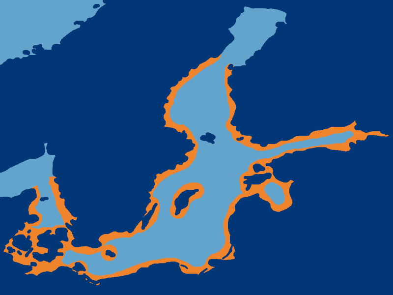
>
> __Verbreitung:__ Gesamte küstennahe Ostsee, bis auf den nördlichen bottnischen Meerbusen.
>
> __Häufigkeit:__ häufig
>
> __Gefährdung:__ nicht gefährdet

## Dreistachliger Stichling

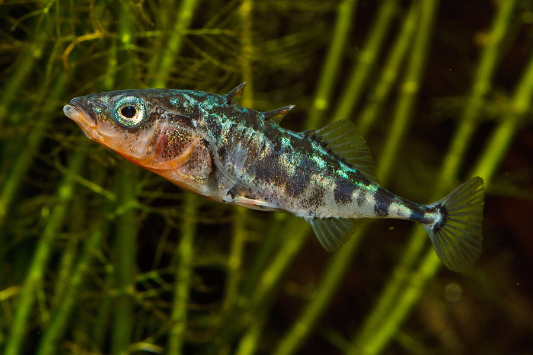
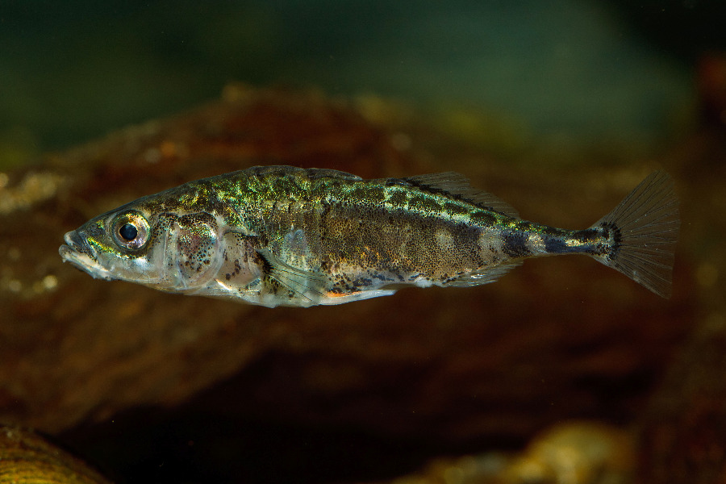
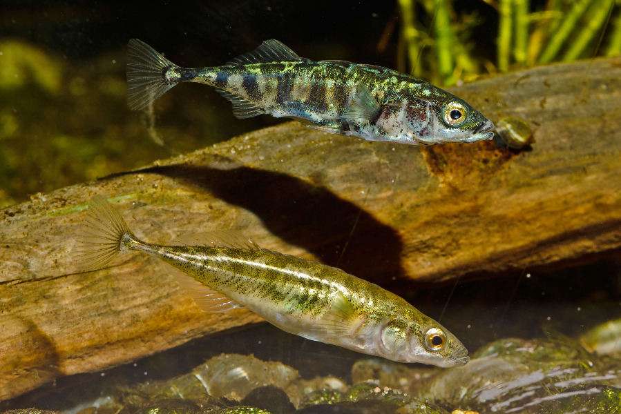
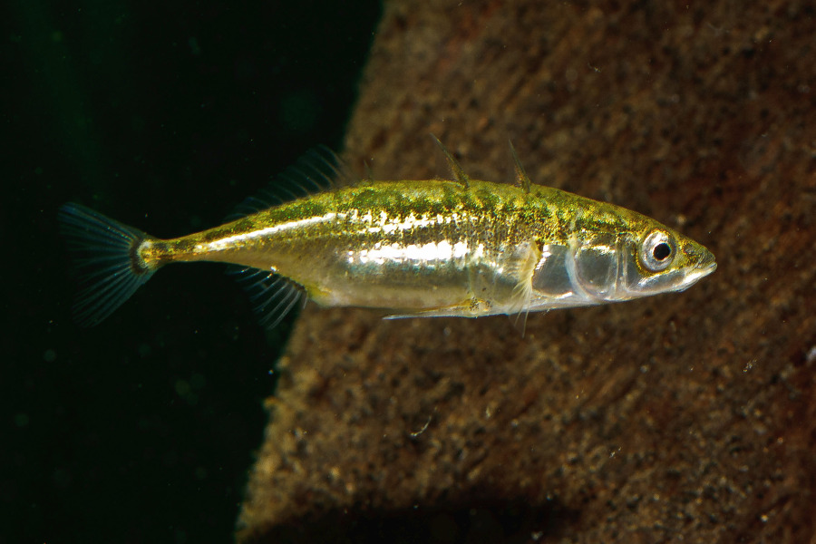
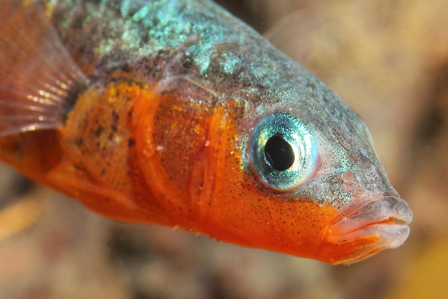

<article class="main-info">

_D-Dreistachliger Stichling;_
_GB-Three-spined stickleback;_
_DK-Trepigget hundestejle;_
_PL-Ciernik;_
_LT-Trispyglė dyglė;_
_LV-Trīsadatu stagars;_
_EST-Ogalik;_
_RU-Трёхиглая колюшка;_
_FIN-Kolmipiikki;_
_S-Storspigg_

### Erkennungsmerkmale

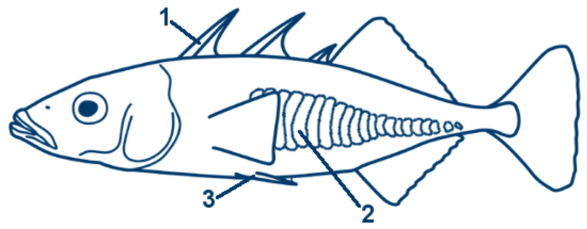

1. 3 (selten 4) freie Stacheln vor der Rückenflosse.
2. Körperseiten von auffälligen Knochenplatten bedeckt.
3. Bauchflossen stachelartig.

Bis max. 8 bis 11 cm Länge, meist kleiner bleibend.

### Ähnliche Arten

* [Zwergstichling](#zwerstichling) - 9 bis 11 Rückenstacheln; Abstand vom Ende der Brustflosse bis zum Anfang der Rückenflosse etwa so lange, wie die Brustflosse selbst (beim dreistachligen Stichling kürzer).
* [Seestichling](#seestichling) - Körper langestreckt; 14 bis 17 freie Rückenflossenstacheln; sehr langer Schwanzstiel.

### Lebensweise

Fortpflanzung im Süßwasser, kommt jedoch teilweise auch im Küstenbereich vor.
Das Männchen baut zur Laichzeit (März - Juli) am Grund ein Nest aus Pflanzenmaterial, worin die Weibchen ihre Eier ablegen, die daraufhin vom Männchen befruchtet und bewacht werden.
Das Männchen ist zu dieser Zeit durch einen deutlich rot gefärbten Bauch (Hochzeitskleid) zu erkennen.
Außerhalb der Laichzeit bilden die Tiere dichte Schwärme.

### Ernährung

Kleintiere und Fischlaich.

### Bedeutung

Keine wirtschaftliche Bedeutung.

### Gefährdung

Nicht gefährdet.

</article>

<!-- class="sub-info" -->
> #### Gasterosteus aculeatus
>
> __Familie:__ Gasterosteidae
>
> __Ordnung:__ Gasterosteiformes
>
> 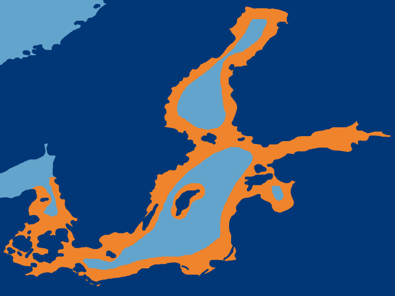
>
> __Verbreitung:__ Gesamte Ostsee, außer einige zentraler Bereiche.
>
> __Häufigkeit:__ sehr häufig
>
> __Gefährdung:__ nicht gefährdet

## Zwergstichling

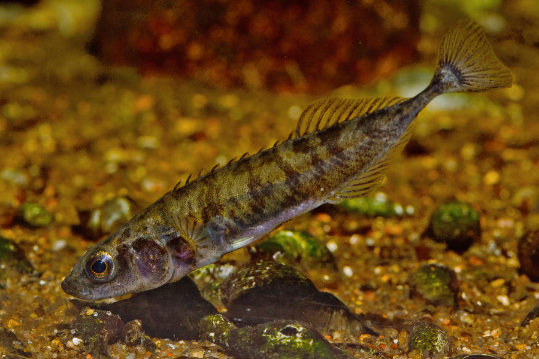
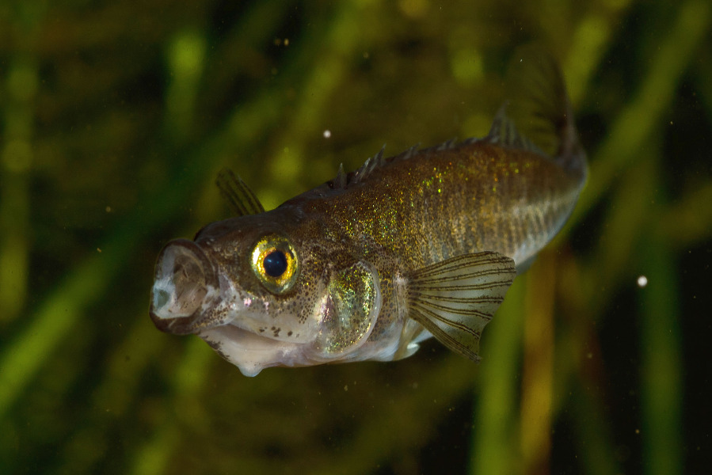
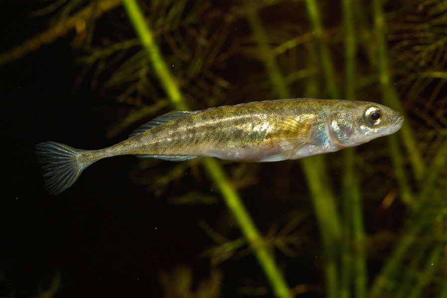
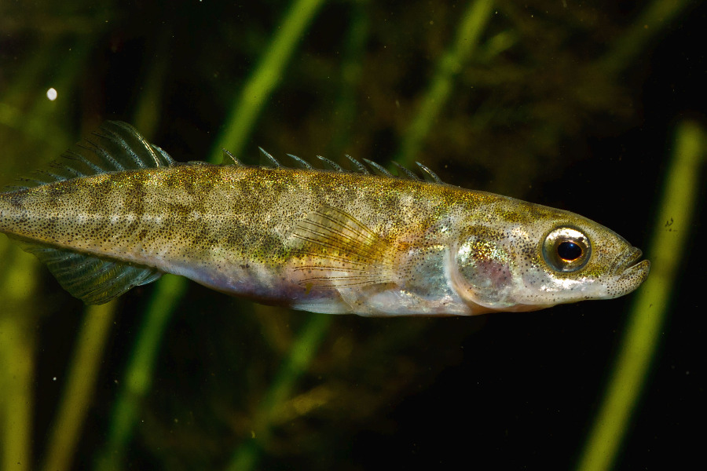

<article class="main-info">

_D-Zwergstichling, Neunstachliger Stichling;_
_GB-Ninespine stickleback;_
_DK-Nipigget hundestejle;_
_PL-Cierniczek północny;_
_LT-Devynspyglė dyglė;_
_LV-Deviņadatu stagars;_
_EST-Luukarits;_
_RU-Девятииглая колюшка;_
_FIN-Kymmenpiikki;_
_S-Småspigg_

### Erkennungsmerkmale

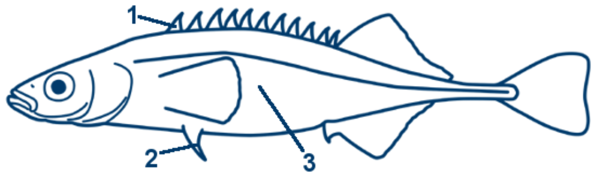

1. 9-11 freie Stacheln am Rücken
2. Bauchflossen stachelartig
3. Körperseiten nackt oder von nur wenigen kleinen Knochenschildern bedeckt.

* Färbung sehr variabel.

Meist 4 bis 5 cm, max. 7 cm Länge.

### Ähnliche Arten

* [Dreistachliger Stichling](#dreistachliger-stichling) - nur 3 freie Stacheln auf dem Rücken; Abstand vom Ende der Brustflosse bis zum Beginn der Rückenflosse länger als die Brustflosse (beim dreistachligen Stichling kürzer).
* [Seestichling](#seestichling) - Körper langestreckt; 14 bis 17 freie Rückenflossenstacheln; sehr langer Schwanzstiel.

### Lebensweise

Hauptsächlich Süßwasser, wandert jedoch selten entlang der Küsten.
Wie die anderen Stichlingsarten wird das männliche Tier zur Laichzeit (April-August) territorial und baut ein Nest aus Pflanzenresten.
Während der Dreistachlige Stichling sein Nest am Grund baut, hängt der Neunstachlige Stichling sein Nest zwischen Wasserpflanzen.

### Ernährung

Tierisches Plankton und Kleintiere.

### Bedeutung

Keine wirtschaftliche Bedeutung.

### Gefährdung

Nicht gefährdet.

</article>

<!-- class="sub-info" -->
> #### Pungitius pungitius
>
> __Familie:__ Gasterosteidae
>
> __Ordnung:__ Gasterosteiformes
>
> 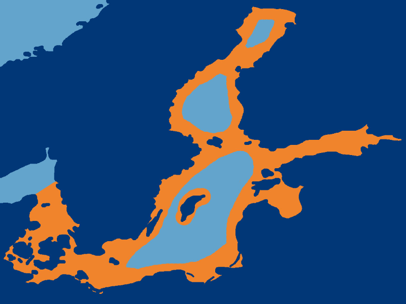
>
> __Verbreitung:__ Gesamte Ostsee, außer einige zentrale Bereiche.
>
> __Häufigkeit:__ sehr häufig
>
> __Gefährdung:__ nicht gefährdet

## Bachschmerle

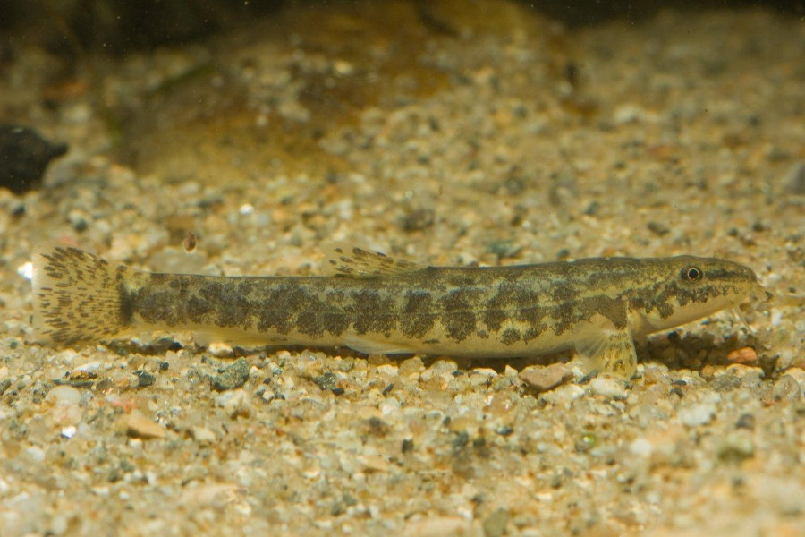
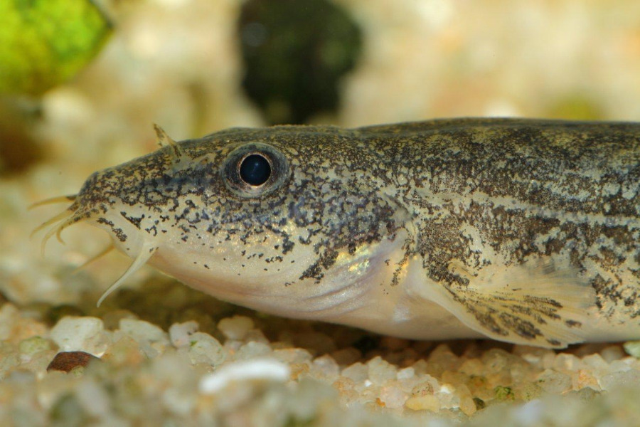
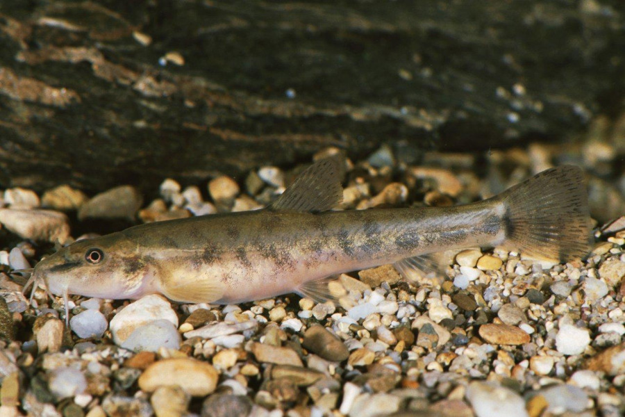
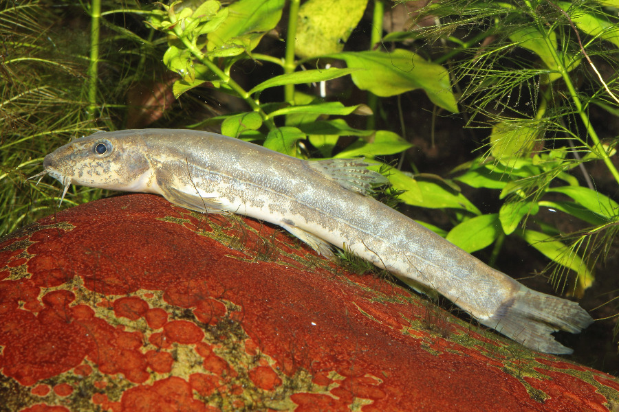
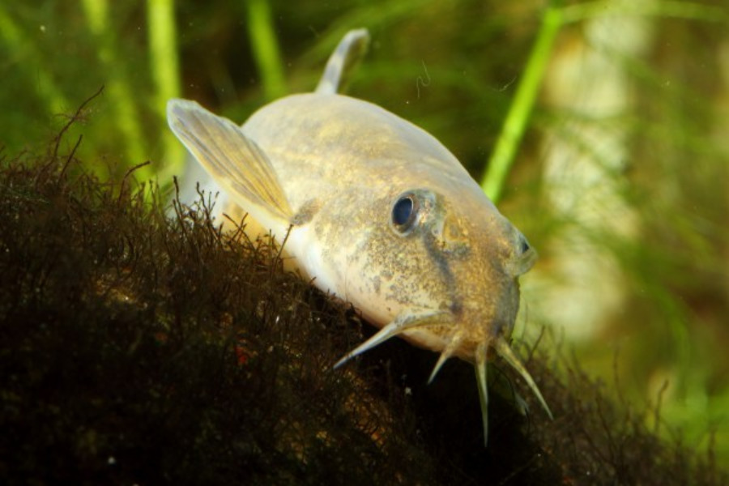
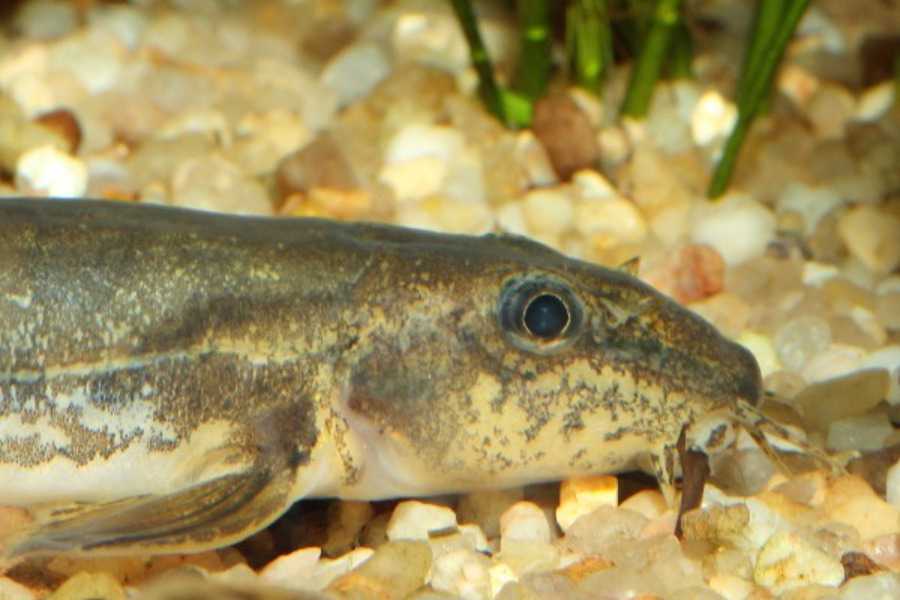

<article class="main-info">

_D-Bachschmerle;_
_GB-Stone loach;_
_DK-Smerling;_
_PL-Śliz;_
_LT-Šlyžys;_
_LV-Bārdainais akmeņgrauzis;_
_EST-Trulling;_
_RU-Усатый голец;_
_FIN-Kivennuoliainen;_
_S-Grönling_

### Erkennungsmerkmale

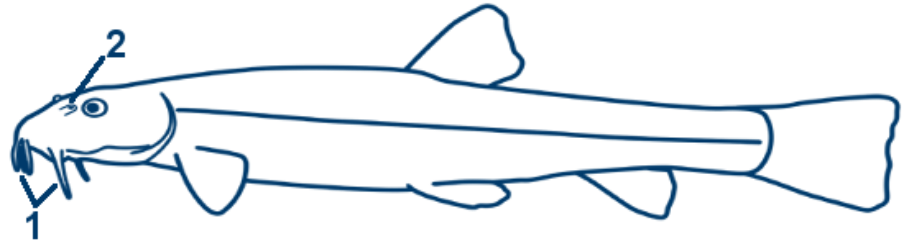

1. Maulspalte klein und unterständig mit 3 Paar Barteln am Oberkiefer.
2. Nasenöffnung röhrenförmig verlängert.

* Rücken und Seiten unregelmäßig dunkel marmoriert.
* Bauch meist weißlich.
* Körper langgestreckt und fast rund.

Meist etwa 8 bis 12 cm, max. 16 cm Länge

### Ähnliche Arten

* [Steinbeißer](#steinbeißer) - Kopf seitlich abgeflacht (fast rund bei der Bachschmerle); aufrichtbarer, zweispitziger Stachel unterhalb des Auges.
* [Schlammpeitzger](#schlammpeitzger) - markanter Streifen auf der Flanke; 5 Paar Barteln; aufrichtbarer, zweispitziger Stachel unterhalb des Auges.

### Lebensweise

Nachaktiver Bodenbewohner kleinerer, schnell fließender Gewässer mit steinigem bis kiesigem Grund.
Laichzeit im Frühjahr zwischen März und Mai; Gelege wird vom Männchen bewacht.
Kurzlebig, meist nur ca. 6 Jahre.

### Ernährung

Bodenbewohnende kleine Wirbellose.

### Bedeutung
Teilweise Nutzung als Köderfisch und geringe Bedeutung als Speisefisch.

### Gefährdung

Vermutlich nicht gefährdet.

</article>

<!-- class="sub-info" -->
> #### Barbatula barbatula
>
> __Familie:__ Balitoridae
>
> __Ordnung:__ Cypriniformes
>
> 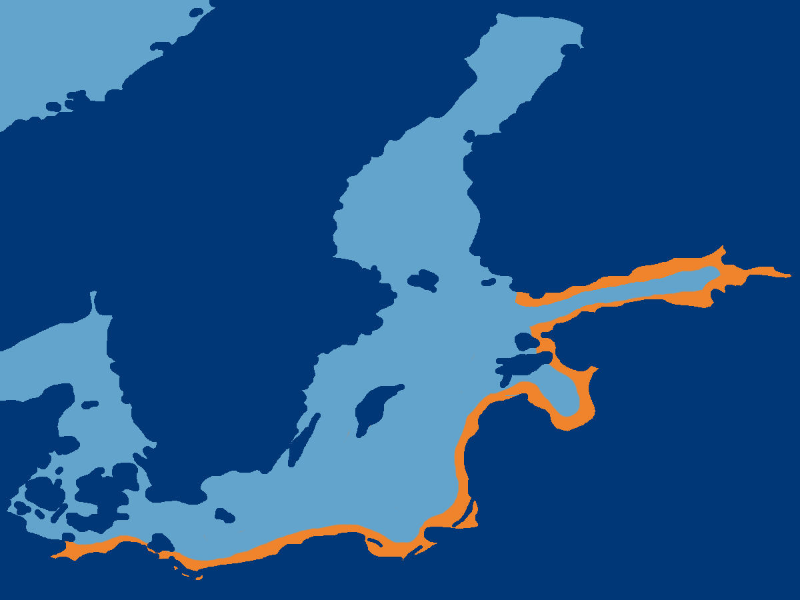
>
> __Verbreitung:__ Im südlichen küstennahen Ostseebereich.
>
> __Häufigkeit:__ regelmäßig
>
> __Gefährdung:__ nicht gefährdet

## Steinbeißer

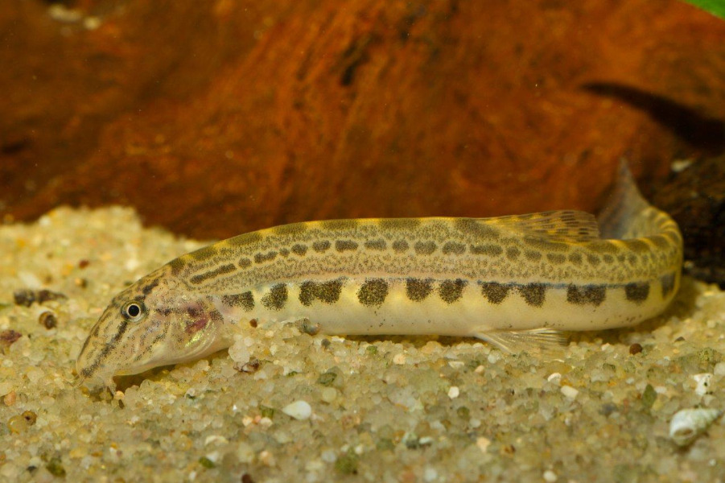
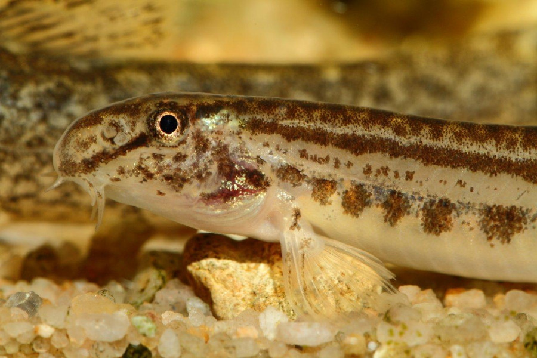
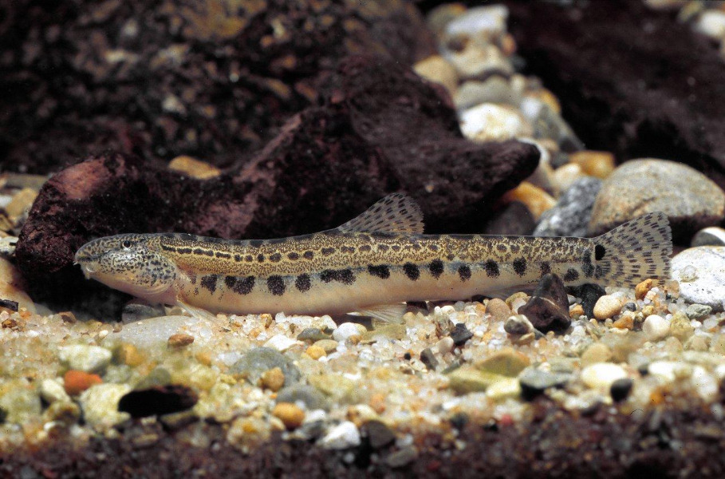
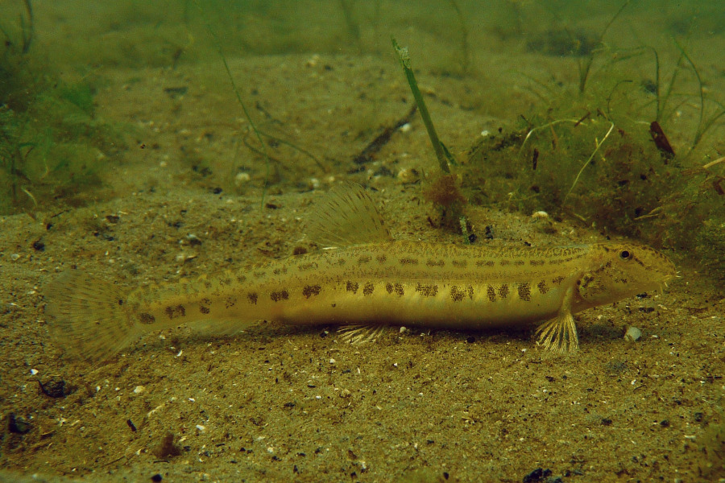

<article class="main-info">

_D-Steinbeißer;_
_GB-Spined loach;_
_DK-Pigsmerling;_
_PL-Koza pospolita;_
_LT-Kirtiklis;_
_LV-Akmeņgrauzis;_
_EST-Harilik hink;_
_RU-Обыкновенная щиповка;_
_FIN-Rantanuoliainen;_
_S-Nissöga_

### Erkennungsmerkmale

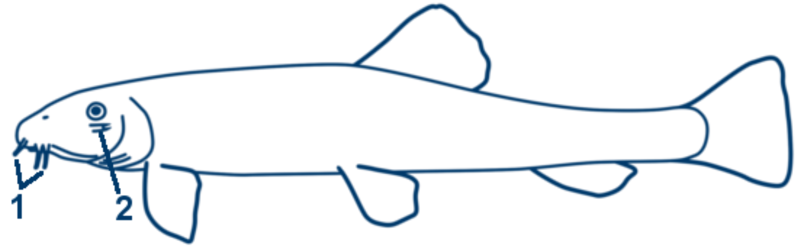

1. 3 Paar Barteln am Mundrand.
2. Aufstellbare zweispitzige Dornen unter den Augen.

* Körper langgestreckt und seitlich abgeflacht.
* Rücken und Seiten braun-gelblich marmoriert, Bauch meist etwas heller.

Meist 5 bis 8 cm, max. 9,5 cm Länge.

### Ähnliche Arten

* [Schlammpeitzger](#schlammpeitzger) - 5 Paare von Barteln; prominentes dunkles Band auf der Flanke; meist größer.
* [Bachschmerle](#bachschmerle) - kein aufrichtbarer Stachel unter dem Auge; Kopf im Schnitt rund (beim Steinbeißer seitlich abgeflacht).

### Lebensweise

Nachtaktive, einzelgängerische Bodenbewohner, sind tagsüber meist im Sandgrund klarer, langsam fließender oder stehender Gewässer eingegraben.
In der Laichzeit zwischen April und Juni legen sie ihre Eier über Sand oder Pflanzen ab.

### Ernährung

Auf der Suche nach bodenbewohnenden Kleintieren nehmen sie auch Sand auf, der gekaut und durch die Kiemen wieder abgegeben wird, was ihm den Namen gab.

### Bedeutung

Keine wirtschaftliche Bedeutung.

### Gefährdung

Vermutlich nicht gefährdet.

</article>

<!-- class="sub-info" -->
> #### Cobitis taenia
>
> __Familie:__ Cobitidae
>
> __Ordnung:__ Cypriniformes
>
> 
>
> __Verbreitung:__ Im küstennahen Ostseebereich, mit Ausnahme des bottnischen Meerbusens.
>
> __Häufigkeit:__ regelmäßig
>
> __Gefährdung:__ unklar

## Schlammpeitzger

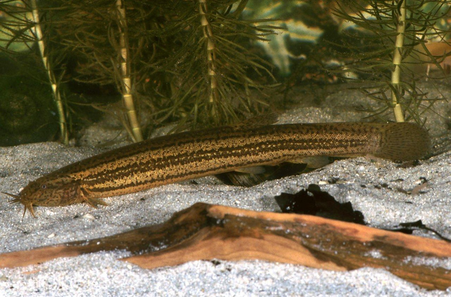
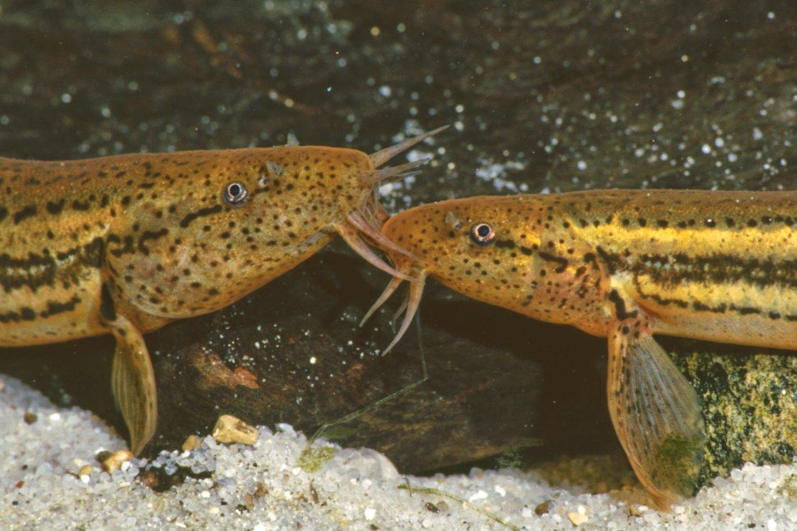
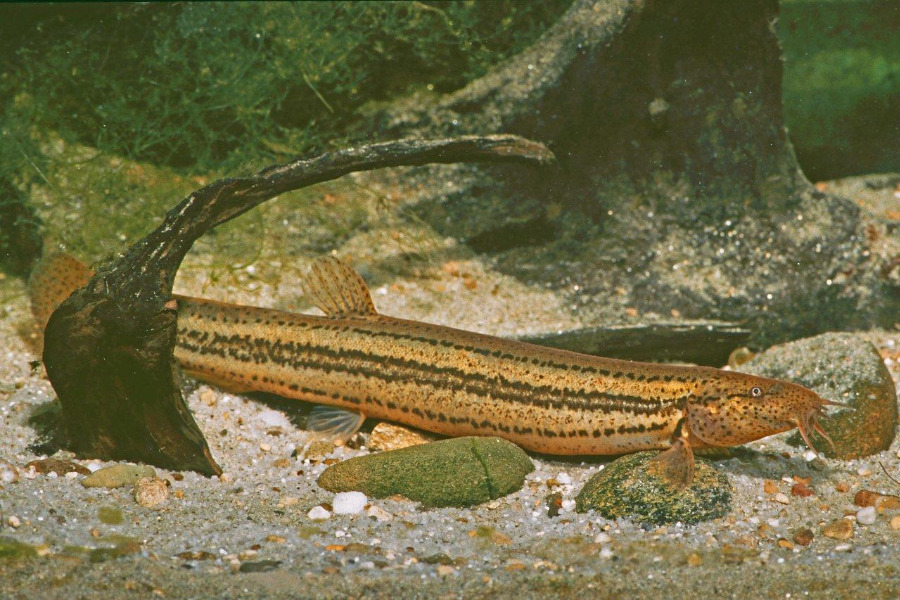

<article class="main-info">

_D-Schlammpeitzger;_
_GB-Weather loach, weatherfish;_
_DK-Dyndsmerling;_
_PL-Piskorz;_
_LT-Vijūnas;_
_LV-Pīkste;_
_EST-Vingerjas;_
_RU-Обыкновенный вьюн;_
_FIN-Mutakala;_
_S-Slampiskare_

### Erkennungsmerkmale

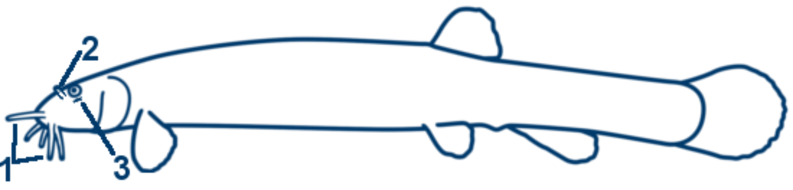

1. Maulspalte klein und unterständig mit 3 Paar Barteln am Oberkiefer und 2 Paar Barteln am Unterkiefer.
2. Nasenöffnung röhrenförmig verlängert.
3. aufstellbarer, zweispitziger Dorn unter jedem Auge.

* Körper langgestreckt und rundlich.
* deutliches Streifenmuster an Rücken und Seiten, Bauch heller.

Meist 15 bis 20 cm, max. 27 cm Länge.

### Ähnliche Arten

* [Steinbeißer](#steinbeißer) - nur 3 Paar Barteln; eine Reihe dunkler Vierecke auf der Flanke, aber nie ein durchgängiges, breites, dunkles Band.
* [Bachschmerle](#bachschmerle) - nur 3 Paar Barteln; kein aufrichtbarer Stachel unter dem Auge.

### Lebensweise

Nachaktiver Bodenbewohner kleinerer stehender oder langsam fließender Gewässer mit dichter Vegetation und weichem, schlammigem Grund.
Bei Austrocknen des Gewässers kann er sich eingraben und so längere Zeit überdauern.

### Ernährung

Bodenbewohnende wirbellose Kleintiere, vor allem Schnecken.

### Bedeutung

Nutzung als Köderfisch, keine wirtschaftliche Bedeutung als Speisefisch.

### Gefährdung

Lebensraumverlust durch Sumpftrockenlegung und Gewässerregulierung trägt zum starken Rückgang bei.

</article>

<!-- class="sub-info" -->
> #### Misgurnus fossilis
>
> __Familie:__ Cobitidae
>
> __Ordnung:__ Cypriniformes
>
> 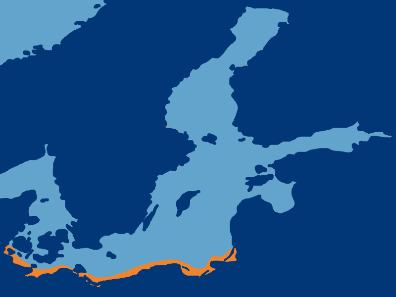
>
> __Verbreitung:__ In südlichen küstennahen Ostseebereichen.
>
> __Häufigkeit:__ sehr selten
>
> __Gefährdung:__ gefährdet

## Petermännchen

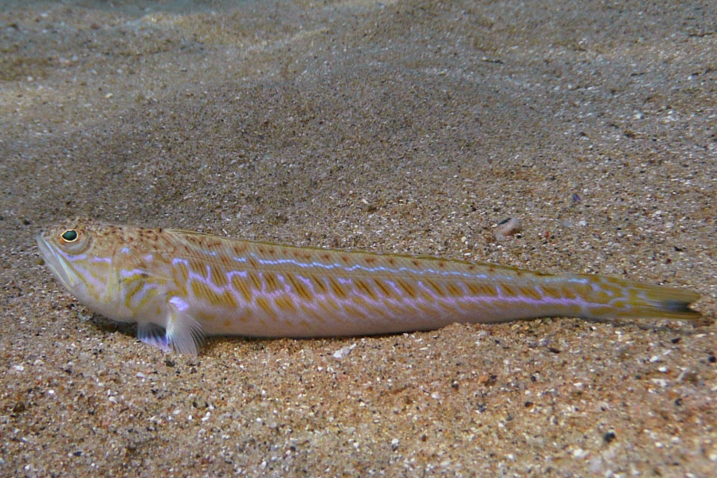
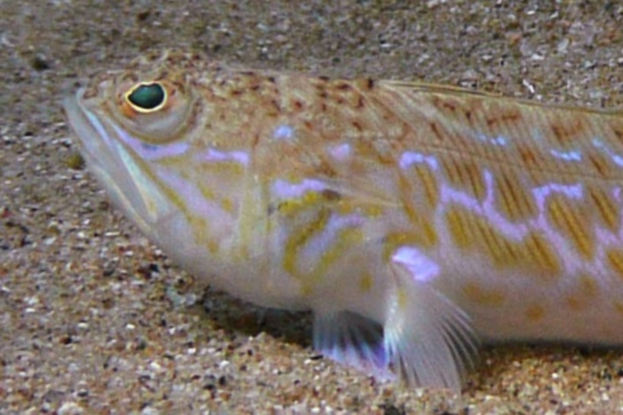
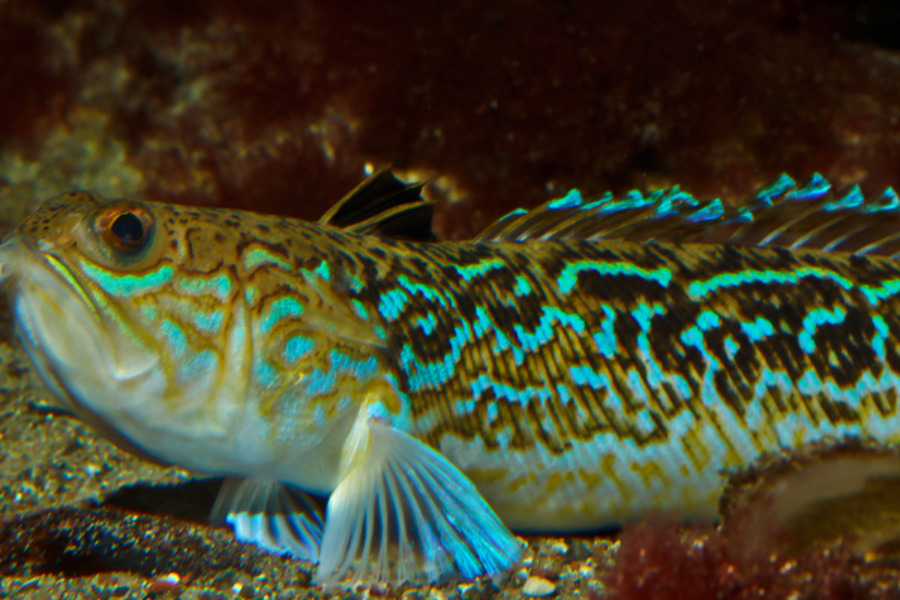
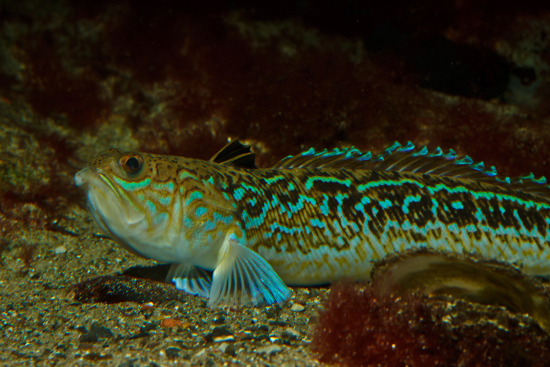

<article class="main-info">

_D-Petermännchen;_
_GB-Greater weever;_
_DK-Fjæsing;_
_PL-Ostrosz;_
_EST-Harilik merilohe;_
_RU-Большой морской дракон;_
_FIN-Louhikala;_
_S-Fjärsing_

### Erkennungsmerkmale

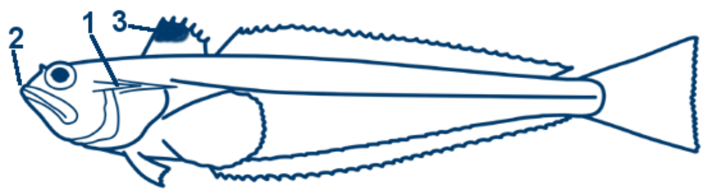

1. Giftstachel auf dem Kiemendeckel.
2. Großes Maul mit nach oben gerichteter Öffnung.
3. Dunkler Fleck auf der ersten Rückenflosse.

* Färbung: hell mit schrägen, blauen Streifen.

30 bis 40 cm lang.

### Ähnliche Arten

* [Gestreifeter Leierfisch](#gestreifeter-leierfisch) - nach unten gerichtetes Maul; Schnauze länger.

### Lebensweise

Nachtaktiv; tags im Sand vergraben, sodass nur die Augen sichtbar sind.
Lebt im Flachwasser bis in eine Tiefe von 150 m

### Ernährung

Frisst kleine Wirbellose und Fische.

### Bedeutung

Geringe wirtschaftliche Bedeutung.

### Gefährdung

Häufiger Beifang.

</article>

<!-- class="sub-info" -->
> #### Trachinus draco
>
> __Familie:__ Trachinidae
>
> __Ordnung:__ Perciformes
>
> 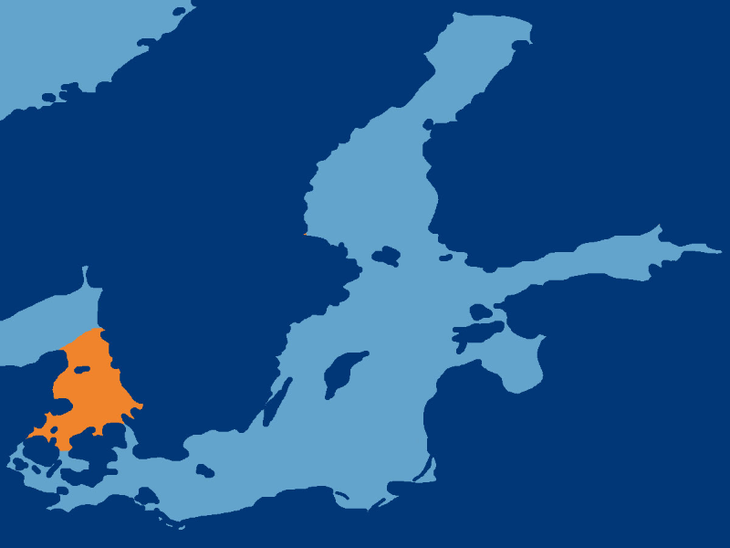
>
> __Verbreitung:__ Kommt nur in der westlichen Ostsee vor.
>
> __Häufigkeit:__ regelmäßig
>
> __Gefährdung:__ nicht gefährdet

## Gestreifeter Leierfisch

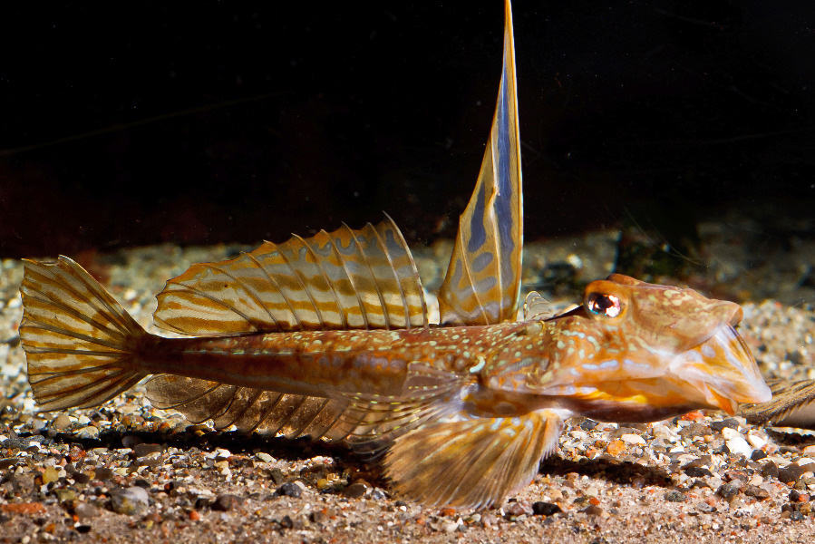
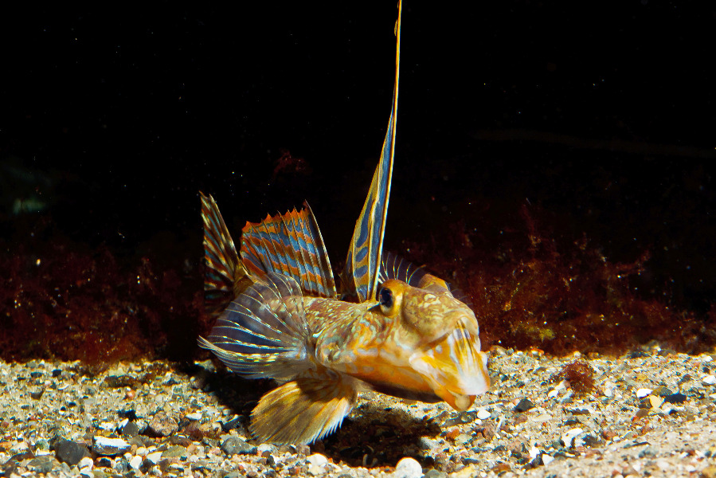
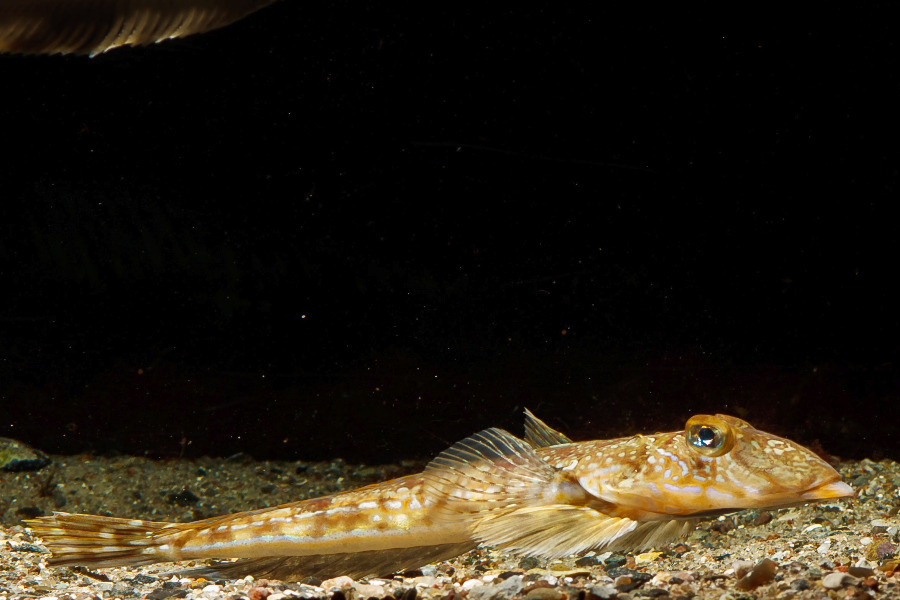
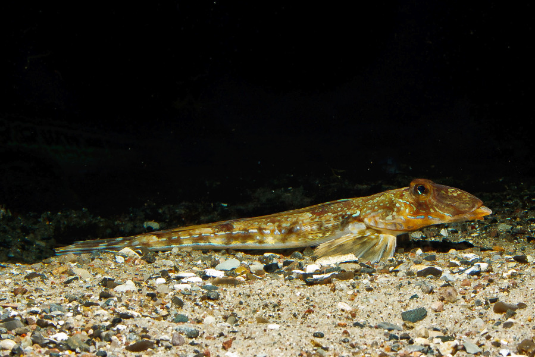

<article class="main-info">

_D-Gestreifter Leierfisch;_
_GB-Dragonet;_
_DK-Stribet Fløjfisk;_
_PL-Lira;_
_EST-Vöödiline lüürakala;_
_RU-Пескарка полосатая;_
_FIN-Isomerikokki;_
_S-Randig sjökock_

### Erkennungsmerkmale

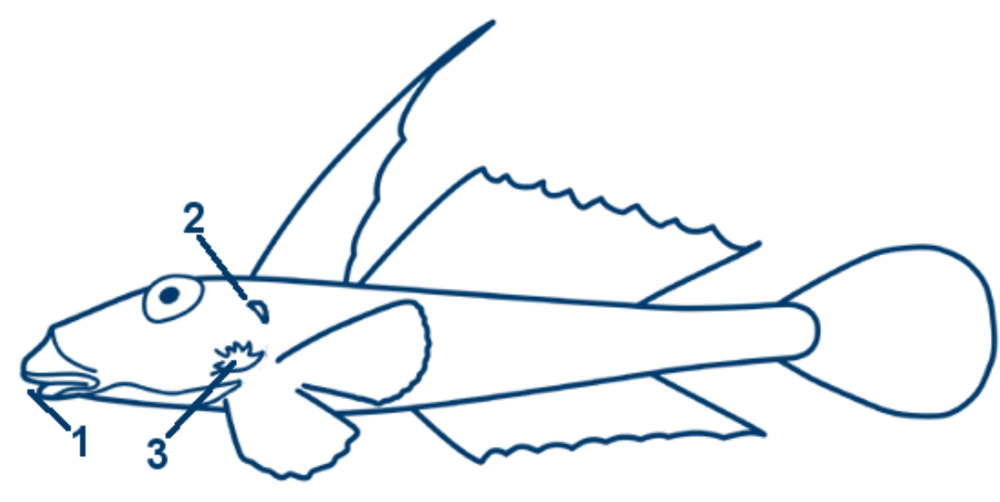

1. Kussmaul.
2. Kiemenöffnung auf ein nach oben gerichtetes Loch verkleinert.
3. Vorkiemendeckel mit Dorn.

* Bauchflossen kehlständig.
* Weibchen hellbraun bis weiß mit Flecken; Männchen gelb, mit blauen Längsstreifen auf Körper und Flossen und mit verlängerter erster Rückenflosse.

Männchen selten größer als 30 cm; Weibchen nur bis 20 cm Länge.

### Ähnliche Arten

* [Petermännchen](#petermännchen) - nach oben gerichtetes Maul.
* [Schwarzgrundel](#schwarzgrundel) - Bauchflossen zu Saugscheibe verbunden; ohne Dorn am Vorkiemendeckel.
* [Schwarzmaulgrundel](#schwarzmaulgrundel) - Bauchflossen zu Saugscheibe verbunden; ohne Dorn am Vorkiemendeckel.

### Lebensweise

Bodenbewohnend, bevorzugt auf Weichgrund.
In der Laichzeit zwischen Januar und August führt das Männchen einen Hochzeitstanz vor dem Weibchen auf, woraufhin das Paar gemeinsam zur Oberfläche aufsteigt und währenddessen ablaicht.
Die Eier und Larven verbleiben zunächst im Freiwasser, bevor die Jungfische zur bodenbezogenen Lebensweise übergehen.

### Ernährung

Kleine Krebse und andere kleine Bodentiere.

### Bedeutung

Keine wirtschaftliche Bedeutung.

### Gefährdung

Beifang in Schleppnetzen.

</article>

<!-- class="sub-info" -->
> #### Callionymus lyra
>
> __Familie:__ Callionymidae
>
> __Ordnung:__ Perciformes
>
> 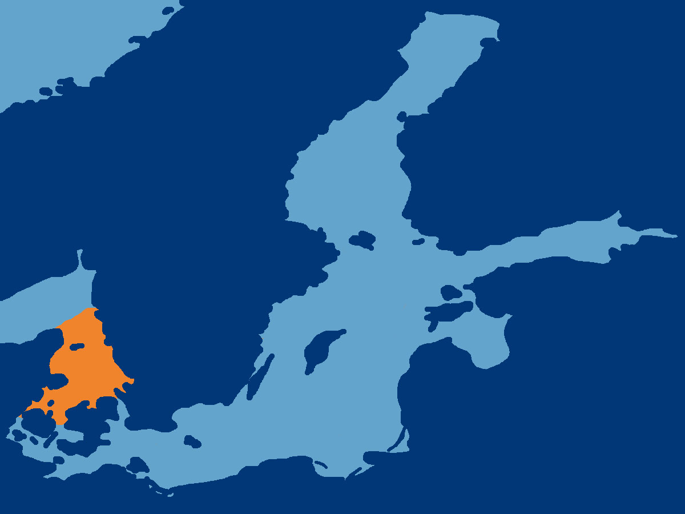
>
> __Verbreitung:__ Selten in der westlichen Ostsee.
>
> __Häufigkeit:__ selten
>
> __Gefährdung:__ unklar

## Makrele

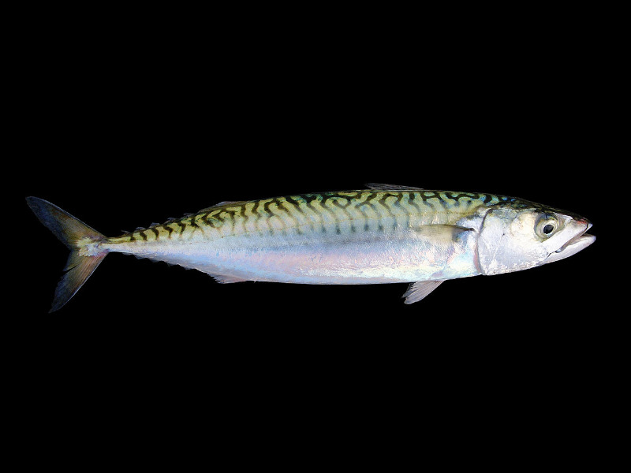
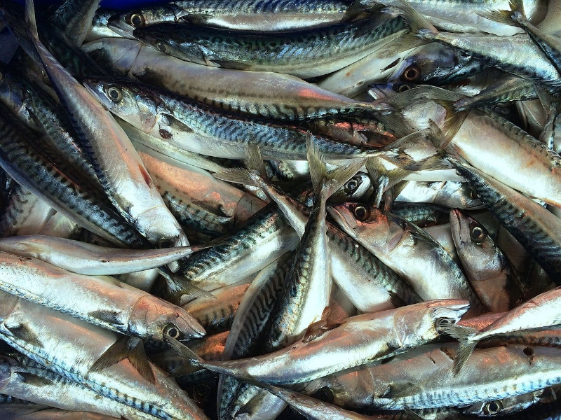

<article class="main-info">

_D-Makrele, Atlantische Makrele;_
_GB-Atlantic mackerel;_
_DK-Makrel;_
_PL-Makrela atlantycka;_
_LT-Atlantinė skumbrė;_
_LV-Atlantijas makrele;_
_EST-Makrell;_
_RU-Атлантическая скумбрия;_
_FIN-Makrilli;_
_S-Makrill_

### Erkennungsmerkmale

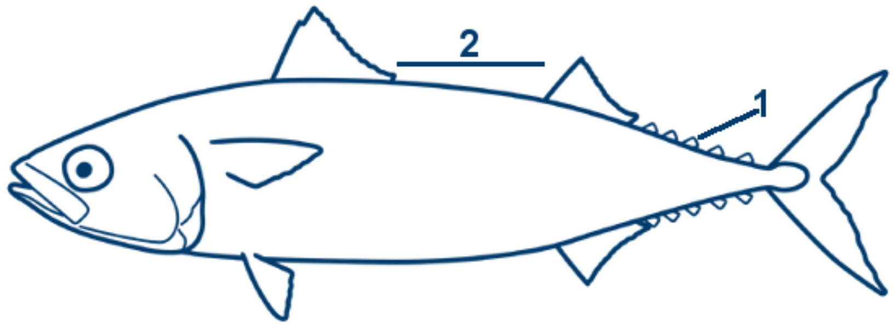

1. Mehrere Flössel hinter Rücken- und Afterflosse.
2. Beide Rückenflossen sehr weit voneinander getrennt.

* Charakteristische, blaue Zeichnung auf dem Rücken.

Meist bis 45 cm, selten bis 60 cm Länge und 1,8 kg Gewicht.

### Ähnliche Arten

* [Einfarbiger Pelamide](#einfarbiger-pelamide) - eng beieinander stehende Rückenflossen; ohne Rückenzeichnung.
* [Stöcker](#stöcker) - ohne Flösselchen; ohne Streifen.
* [Roter Thunfisch](#roter-thunfisch) - eng beieinander stehende Rückenflossen; ohne Rückenzeichnung.

### Lebensweise

Schwarmfisch der oberen Wasserschichten. Laicht zwischen Mai und Juli; die Eier treiben im Freiwasser.

### Ernährung

Kleine Fische und Wirbellose.

### Bedeutung

Große wirtschaftliche Bedeutung; als Speisefisch sehr beliebt.

### Gefährdung

Durch gezielter Fischerei und durch Beifang beeinträchtigt.

</article>

<!-- class="sub-info" -->
> #### Scomber scombrus
>
> __Familie:__ Scombridae
>
> __Ordnung:__ Perciformes
>
> 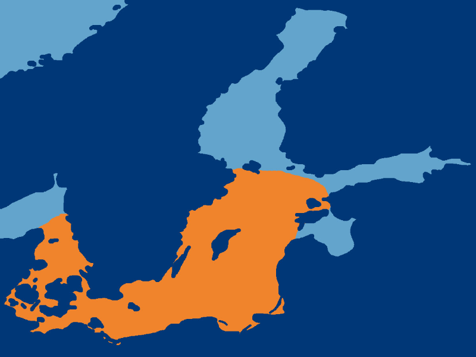
>
> __Verbreitung:__ Ostsee bis auf Bottnischen und Finnischen Meerbusen und Golf von Riga
>
> __Häufigkeit:__ regelmäßig
>
> __Gefährdung:__ nicht gefährdet

## Einfarbiger Pelamide

<article class="main-info">

_D-Einfarbiger Pelamide;_
_GB-Plain bonito;_
_DK-Ustribet pelamide;_
_PL-Orcyn;_
_RU-Одноцветный бонито;_
_FIN-Juovaton sarda;_
_S-Ostrimmig pelamid_

### Erkennungsmerkmale

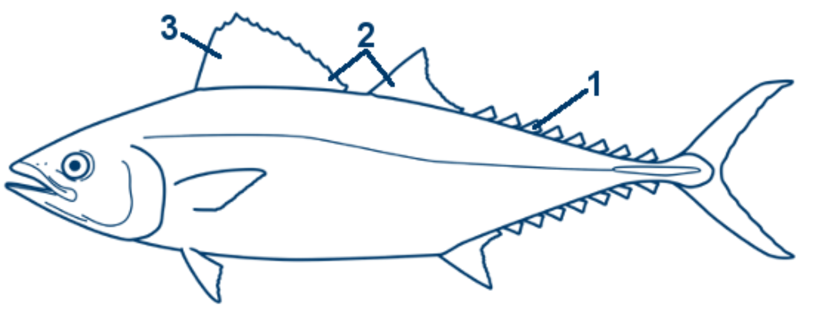

1. mehrere Flössel hinter Rücken- und Afterflosse.
2. die beiden Rückenflossen nahe beeinander stehend.
3. erste Rückenflosse schwarz gefärbt.

* 13-15 Stacheln in der ersten Rückenflosse.

Meist etwa 70 cm, bis max. 130 cm Länge und über 13 kg Gewicht.

### Ähnliche Arten

* [Roter Thunfisch](#roter-thunfisch) - nur 11-12 Stacheln in der ersten Rückenflosse; Schwanzstiel mit einem großen Kiel (statt drei gleich großer beim Pelamide).
* [Makrele](#makrele) - mit Streifenmuster auf dem Rücken; sehr weit getrennte Rückenflossen.

### Lebensweise

Lebt in Verbänden im Freiwasser.
Eier und Larven sind ebenfalls pelagisch.

### Ernährung

Vor allem Heringsfische wie Sardinen und Sardellen.

### Bedeutung

Kommerziell genutzt, in Dosen und tiefgekühlt vermarktet; bedeutender Sportfisch.

</article>

<!-- class="sub-info" -->
> #### Orcynopsis unicolor
>
> __Familie:__ Scombridae
>
> __Ordnung:__ Perciformes
>
> 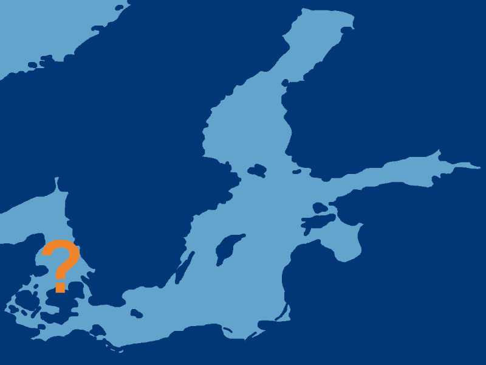
>
> __Verbreitung:__ Irrgast in der westlichen Ostsee; dort nur von Einzelfunden bekannt.
>
> __Häufigkeit:__ sehr selten
>
> __Gefährdung:__ unklar

## Roter Thunfisch

<article class="main-info">

_D-Roter Thunfisch;_
_GB-Atlantic bluefin tuna;_
_DK-Atlantisk tun;_
_PL-Tuńczyk;_
_EST-Harilik tuun;_
_RU-Обыкновенный тунец;_
_FIN-Tonnikala;_
_S-Tonfisk_

### Erkennungsmerkmale

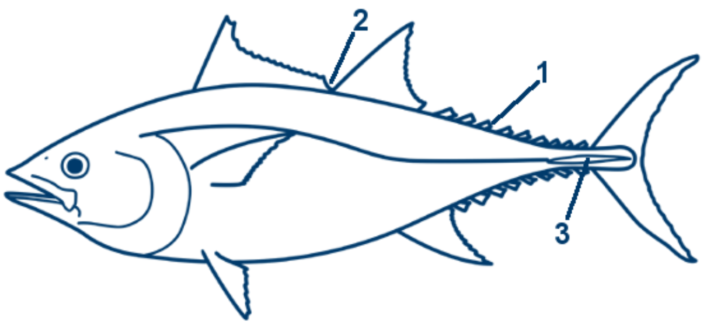

1. mehrere Flössel hinter Rücken- und Afterflosse.
2. beide Rückenflossen nahe beinander stehend.
3. großer, kräftiger Kiel am Schwanzstiel.

* 11-12 Stacheln in der ersten Rückenflosse.
* Rücken gräulichblau bis schwarz, Bauch hell.

Übliche Größe bis 2 m, früher bis über 3 m Länge und bis 560 kg Gewicht.

### Ähnliche Arten

* [Einfarbiger Pelamide](#einfarbiger-pelamide) - erste Rückenflosse schwarz; Schwanzstiel mit drei gleich großen Kielen (statt einem großen Kiel beim roten Thunfisch).
* [Makrele](#makrele) - mit Streifenmuster auf dem Rücken; sehr weit getrennte Rückenflossen.

### Lebensweise

Lebt in Verbänden gleichgroßer Tiere im Freiwasser und unternimmt saisonale Wanderungen.
Die Körpergröße der erwachsenen Tiere schränkt die Zahl der natürlichen Feinde auf Schwert- und Grindwale ein.

### Ernährung

Andere Fische und Tintenfische.

### Bedeutung

Hohe wirtschaftliche Bedeutung: sehr beliebter und sehr teurer Speisefisch.

### Gefährdung

Durch Überfischung vom Aussterben bedroht.

</article>

<!-- class="sub-info" -->
> #### Thunnus thynnus
>
> __Familie:__ Scombridae
>
> __Ordnung:__ Perciformes
>
> 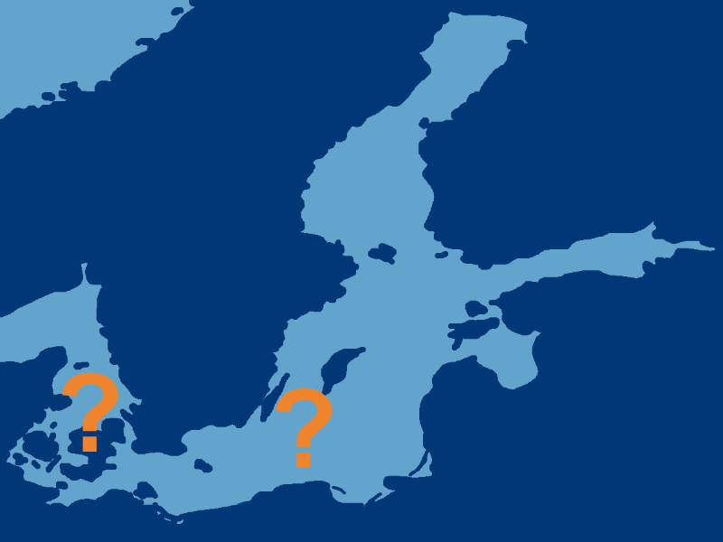
>
> __Verbreitung:__ Als Irrgast bis in die zentrale Ostsee
>
> __Häufigkeit:__ sehr selten
>
> __Gefährdung:__ stark gefährdet

## Schwertfisch

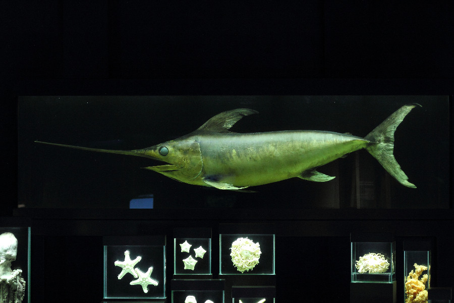
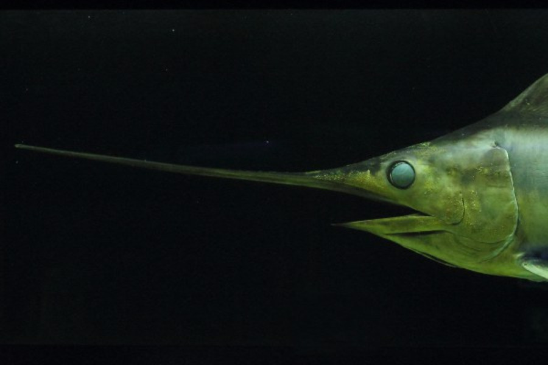

<article class="main-info">

_D-Schwertfisch;_
_GB-Swordfish;_
_DK-Sværdfisk;_
_PL-Włócznik, miecznik;_
_LT-Durklažuvė;_
_LV-Zobenzivs;_
_EST-Mõõkkala;_
_RU-Меч-рыба;_
_FIN-Miekkakala;_
_S-Svärdfisk_

### Erkennungsmerkmale

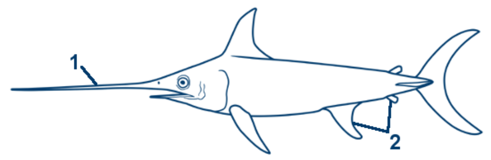

1. Oberkiefer zu einem „Schwert“ ausgezogen.
2. 2 Afterflossen.

* keine Bauchflossen.

Meist zwischen 2,5 und 3,5 m, maximal 4,5 m Länge und 650 kg Gewicht.

### Ähnliche Arten

\- Unverwechselbar

### Lebensweise

Einzelgänger im Freiwasser, oft an der Oberfläche, jedoch auch bis 800 m Tiefe; unternimmt Wanderungen; benutzt sein Schwert um seine Beute zu erlegen.

### Ernährung

Schwarmfische, wie Hering und Makrele, sowie Tintenfische.

### Bedeutung

Kommerziell bedeutend und durch Sportfischer genutzt.

</article>

<!-- class="sub-info" -->
> #### Xiphias gladius
>
> __Familie:__ Xiphiidae
>
> __Ordnung:__ Perciformes
>
> 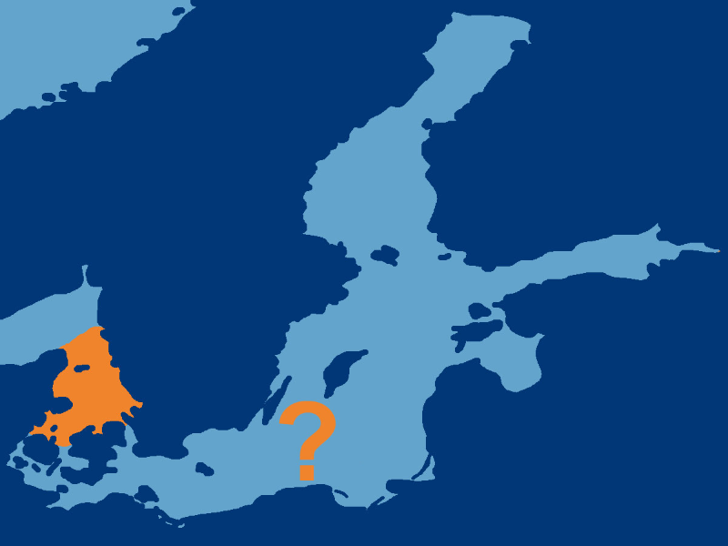
>
> __Verbreitung:__ Sehr selten in der westlichen Ostsee; als Irrgast bis in die zentrale Ostsee.
>
> __Häufigkeit:__ sehr selten
>
> __Gefährdung:__ unklar

## Lammzunge

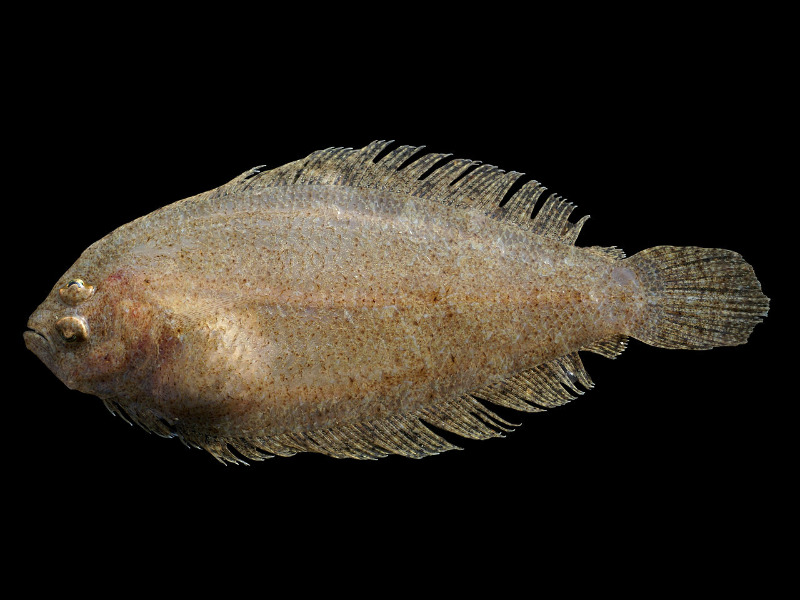
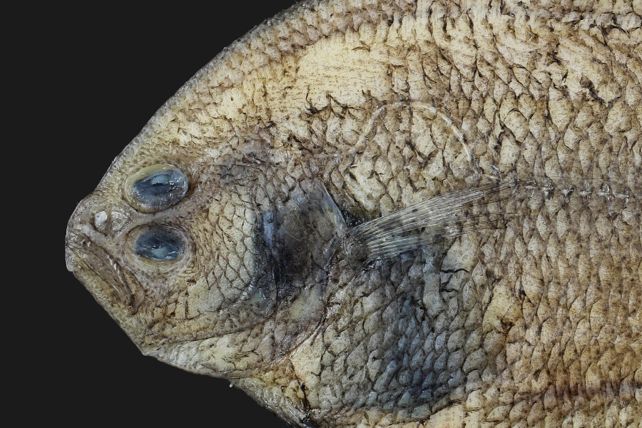
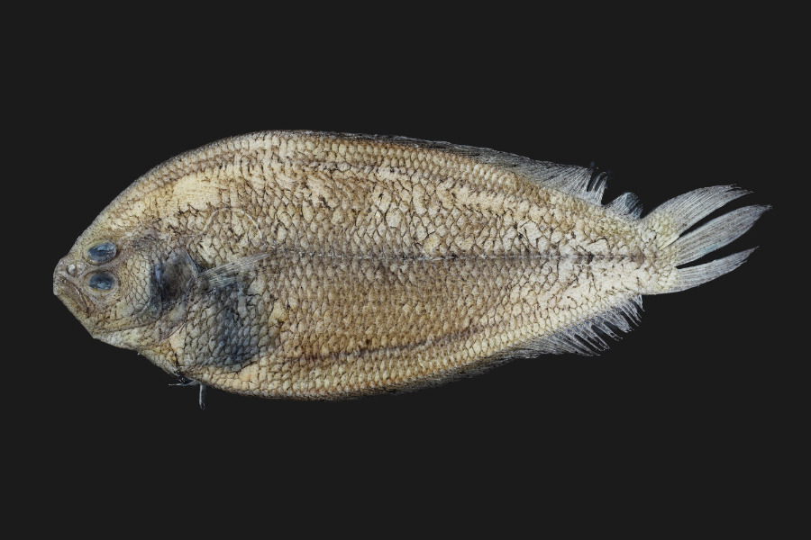
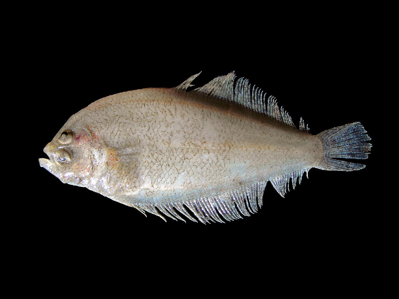
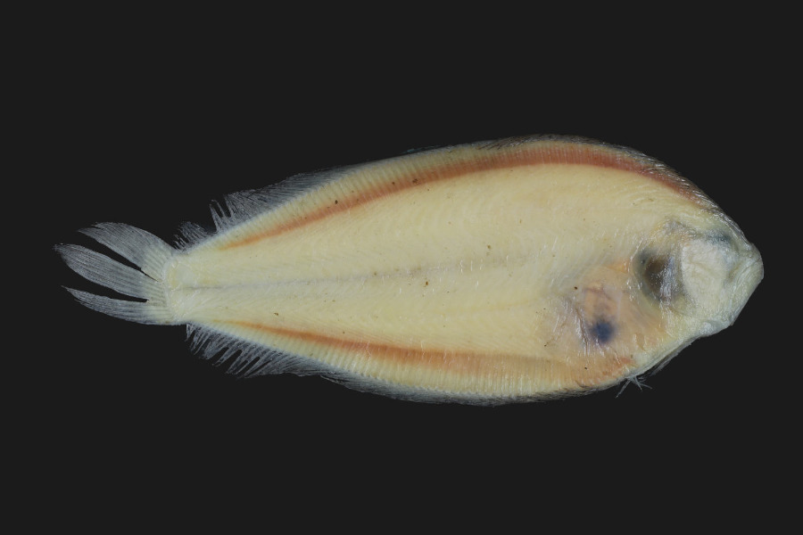

<article class="main-info">

_D-Lammzunge;_
_GB-Scaldfish;_
_DK-Tungehvarre;_
_PL-Laterna;_
_EST-Euroopa kotkakeel;_
_RU-Европейская арноглосса;_
_FIN-Suomukampela;_
_S-Tungevar_

### Erkennungsmerkmale

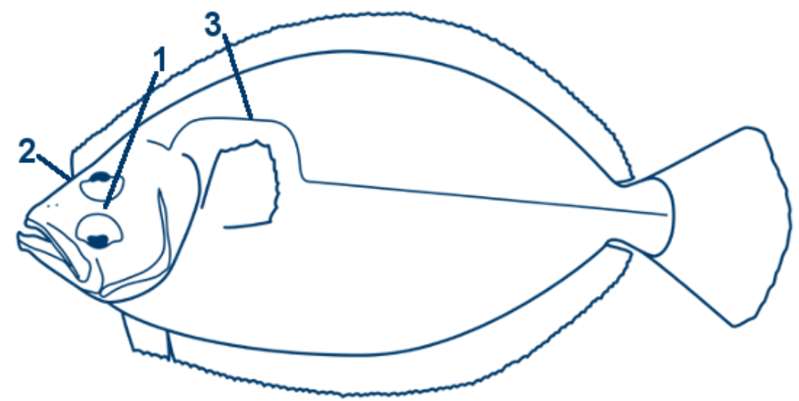

1. Augen stehen dicht beieinander (weniger als ein Augendurchmesser Abstand).
2. Rückenflosse beginnt bereits vor den Augen.
3. Seitenlinie auf Höhe der Brustflossen gebogen.

* Beide Augen auf der linken Körperseite.
* Blindseite ohne Seitenlinie.
* Beide Bauchflossen etwa gleich groß.
* Sandfarbene Körperfärbung.

Meist um 12 cm, maximal bis 22 cm Länge.

### Ähnliche Arten

* Die meisten anderen Plattfische haben die Augen auf der rechten Körperseite.
* [Glattbutt](#glattbutt) - deutlich rundere Körperform; Augen weiter auseinanderliegend (mehr als einen Augendurchmesser Abstand).
* [Steinbutt](#steinbutt) - deutlich rundere Körperform; Augen weiter auseinanderliegend (mehr als einen Augendurchmesser Abstand).
* [Haarbutt](#haarbutt) - Körper höher, fast quadratisch; Rückenflosse beginnt am Oberkiefer; Bauch- und Afterflossen verwachsen; Rücken- und Afterflosse mit Schwanzflosse verbunden.

### Lebensweise

Bevorzugt schlammigem Grund in 10 bis 400 m Tiefe.
Laicht zwischen Juli und September.

### Ernährung

Kleine Bodentiere wie Würmer und Krebstiere.

### Bedeutung

Ohne wirtschaftliche Bedeutung.

</article>

<!-- class="sub-info" -->
> #### Arnoglossus laterna
>
> __Familie:__ Bothidae
>
> __Ordnung:__ Pleuronectiformes
>
> 
>
> __Verbreitung:__ westliche Ostsee
>
> __Häufigkeit:__ sehr selten
>
> __Gefährdung:__ unklar

## Doggerscharbe

<article class="main-info">

_D-Doggerscharbe;_
_GB-Long rough dab, American plaice;_
_DK-Håising;_
_PL-Niegładzica;_
_EST-Harilik karelest;_
_RU-Камбала-ерш;_
_FIN-Liejukampela;_
_S-Lerskädda_

### Erkennungsmerkmale

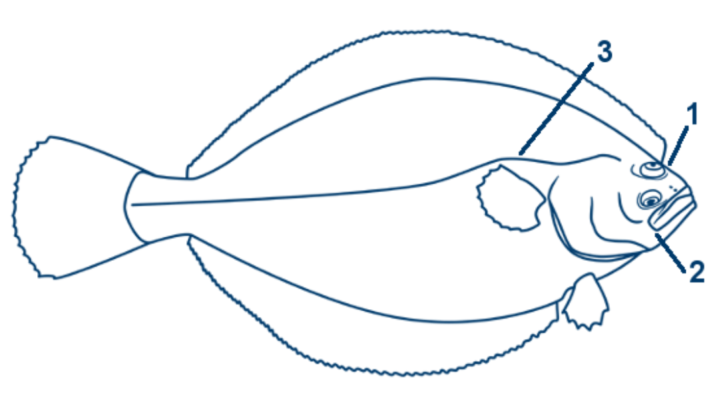

1. Beide Augen auf der rechten Körperseite.
2. Große Maulspalte (reicht bis unter das Auge).
3. Seitenlinie kaum gebogen.

* Rückenflosse beginnt über dem Auge.
* Rauhe Schuppen.
* Oberseite graubraun; Blindseite hell.

Meist unter 45 cm, maximal bis 80 cm Länge.

### Ähnliche Arten

* Die meisten Plattfische mit beiden Augen auf der rechten Seite haben ein viel kleineres Maul (Maul endet vor den Augen).
* [Heilbutt](#heilbutt) - dunkler gefärbt; Seitenlinie mit markanter Kurve überhalb der Brustflosse; Schwanzflosse gerade oder leicht nach innnen gebogen.

### Lebensweise

Bevorzugt kühle Gewässer, im Meer und Brackwasser auf lockerem Untergrund in 10 - 400 m Tiefe.
Wird bis zu 30 Jahre alt.

### Ernährung

Kleine Bodentiere wie Schlangensterne, Krebstiere und Würmer, aber auch Sandaale und Jungdorsche.

### Bedeutung

Kommerziell zur Fischmehlherstellung gefangen, sonst als Beifang angesehen.

### Gefährdung

Nicht gefährdet.

</article>

<!-- class="sub-info" -->
> #### Hippoglossoides platessoides
>
> __Familie:__ Pleuronectidae
>
> __Ordnung:__ Pleuronectidae
>
> 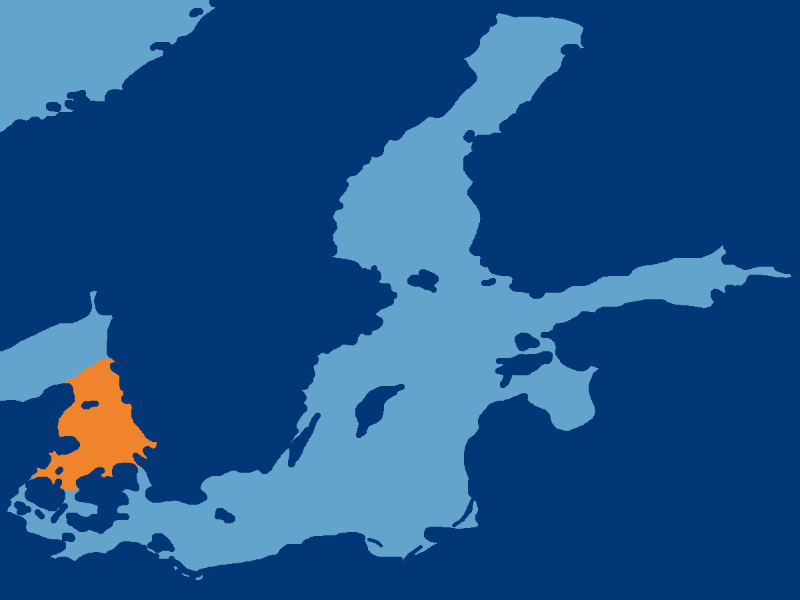
>
> __Verbreitung:__ Sehr selten in der westlichen Ostsee.
>
> __Häufigkeit:__ sehr selten
>
> __Gefährdung:__ unklar

## Heilbutt

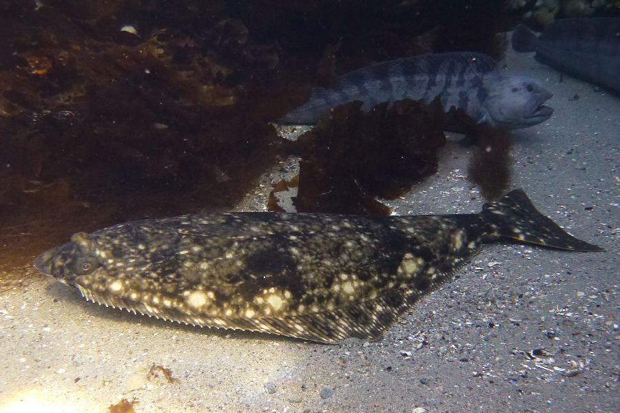
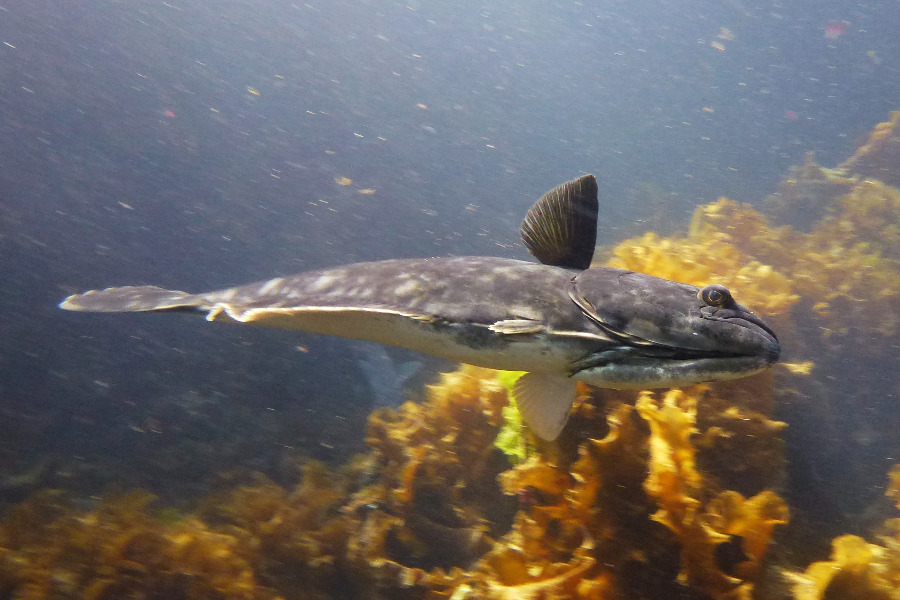
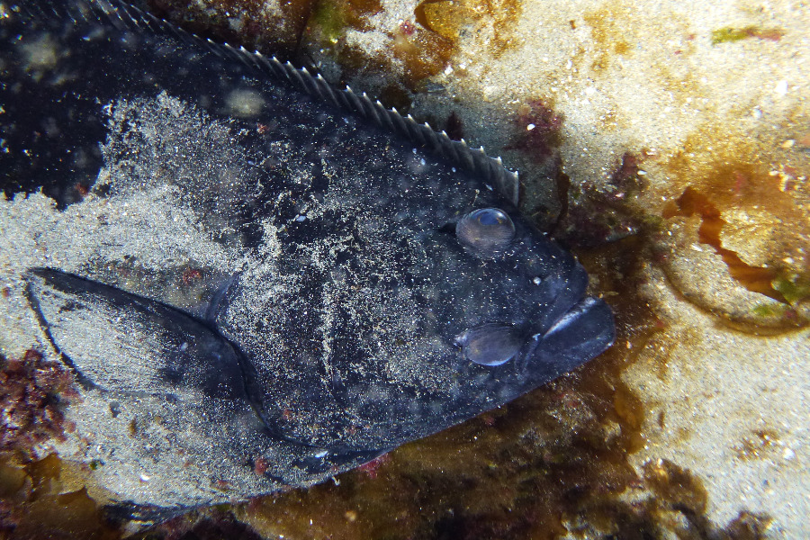

<article class="main-info">

_D-Heilbutt;_
_GB-Halibut;_
_DK-Helleflynder;_
_PL-Halibut atlantycki;_
_LT-Baltasis paltusas;_
_EST-Harilik hiidlest;_
_RU-Атлантический белокорый палтус;_
_FIN-Ruijanpallas;_
_S-Hälleflundra_

### Erkennungsmerkmale

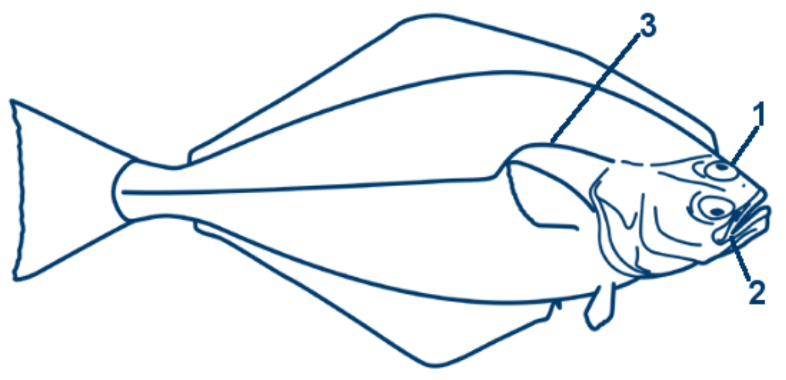

1. Beide Augen auf der rechten Körperseite.
2. Große Maulspalte (reicht bis unter das Auge).
3. Seitenlinie über der Brustflosse deutlich.

* Rückenflosse beginnt über dem Auge.
* Oberseite dunkel, grünlich-grau; Blindseite hell; Jungfische getüpfelt.

Meist bis 200 cm, früher vielleicht bis 470 cm Länge.

### Ähnliche Arten

* Die meisten Plattfische mit beiden Augen auf der rechten Seite haben ein viel kleineres Maul (Maul endet vor den Augen).
* [Doggerscharbe](#doggerscharbe) - heller gefärbt; Seitenlinie über der Brustflosse nur wenig gebogen; Schwanzflosse nach außen gebogen (beim Heilbutt gerade oder nach innen gebogen).

### Lebensweise

Streift am Meeresgrund zwischen 50 m und 2000 m umher.
Wird erst mit 7-18 Jahren geschlechtsreif und bis zu 50 Jahre alt.

### Ernährung

Ernährt sich räuberisch von Fischen (v.a. Dorsche, Schellfische, Sandaale und Heringe), Tintenfischen und Krebstieren; jagt auch im Freiwasser.

### Bedeutung

Sehr geschätzter Speisefisch; wird auch in Aquakultur nachgezogen.

### Gefährdung

Gefährdet durch Überfischung (durch langsames Wachstum und späte Geschlechtsreife).

</article>

<!-- class="sub-info" -->
> #### Hippoglossus hippoglosus
>
> __Familie:__ Pleuronectidae
>
> __Ordnung:__ Pleuronectiformes
>
> 
>
> __Verbreitung:__ Als Irrgast in der westlichen Ostsee.
>
> __Häufigkeit:__ sehr selten
>
> __Gefährdung:__ nicht gefährdet

## Dicklippige Meeräsche

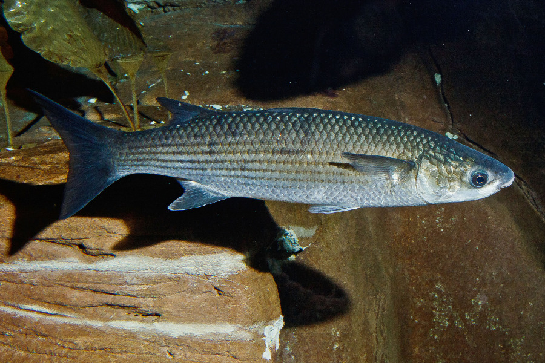
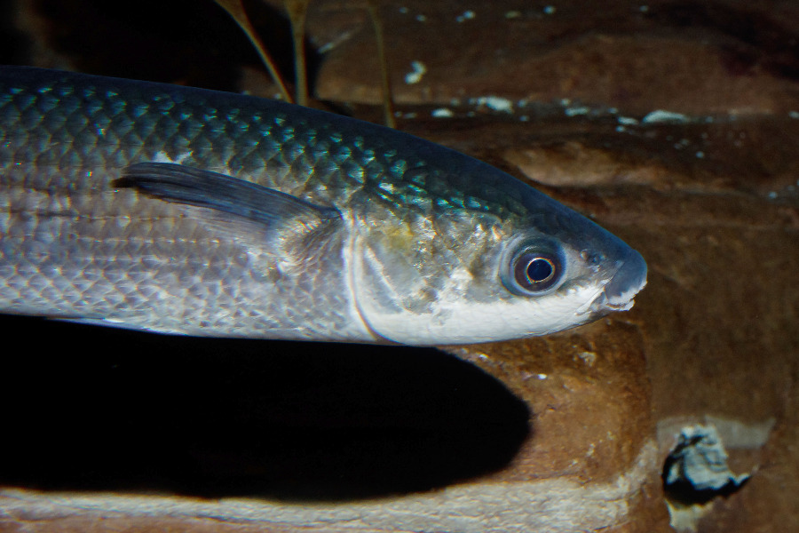

<article class="main-info">

_D-Dicklippige Meeräsche;_
_GB-Thicklip rey mullet;_
_DK-Tyklæbet multe;_
_PL-Tępogłów grubowargi;_
_EST-Pakshuul-heloon;_
_RU-Губач;_
_FIN-Paksuhuulikeltti;_
_S-Tjockläppad multe_

### Erkennungsmerkmale

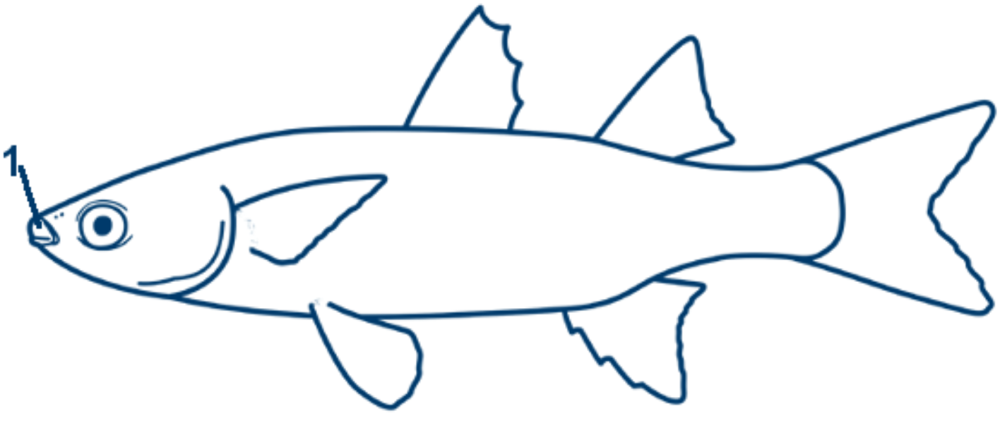

1. Dicke Oberlippe mit Reihen kleiner Papillen.
2. Maul klein (erreicht nicht das Auge).

* Zwei weit entfernt stehende Rückenflossen (die erste wird während dem Schwimmen oft angelegt).
* Flanken silbern, oft mit dunklen Längsstreifen; Rücken gräulich; Bauch heller.

Meist unter 60 cm, maximal bis zu 75 cm Länge und 5 kg Gewicht.

### Ähnliche Arten

* [Dünnlippige Meeräsche](#dünnlippige-meeräsche) - Oberlippe dünn; schwarzer Fleck am Ansatz der Brustflosse.
* [Goldmeeräsche](#goldmeeräsche) - Oberlippe dünn; gold-gelber Fleck auf dem Kiemendeckel.

### Lebensweise

Küstennah lebender Schwarmfisch, teils auch in Ästuaren; Jungtiere dringen auch ins Süßwasser vor; kommt auch mit stark kontaminierten Gewässern zurecht.
Laicht im Frühjahr im Meer; wegen eines Öltropfens schwimmen die Eier an der Oberfläche.
Wird bis zu 9 Jahre alt.

### Ernährung

Allesfresser: organische Partikel der oberen Bodenschichten, ebenso wie Aufwuchs, der mit den Lippen abgeraspelt wird.

### Bedeutung

Speißefisch; wird auch in Aquakultur gehalten.

### Gefährdung

Nicht gefährdet.

</article>

<!-- class="sub-info" -->
> #### Chelon labrosus
>
> __Familie:__ Mugilidae
>
> __Ordnung:__ Mugiliformes
>
> 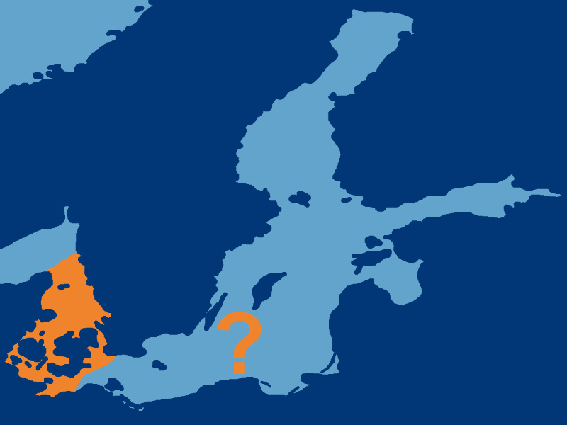
>
> __Verbreitung:__ Kommt regelmäßig in der westlichen Ostsee vor; in den letzten Jahren häufiger werdend; als Irrgast auch bis in die zentrale Ostsee vorkommend.
>
> __Häufigkeit:__ häufig
>
> __Gefährdung:__ nicht gefährdet

## Dünnlippige Meeräsche

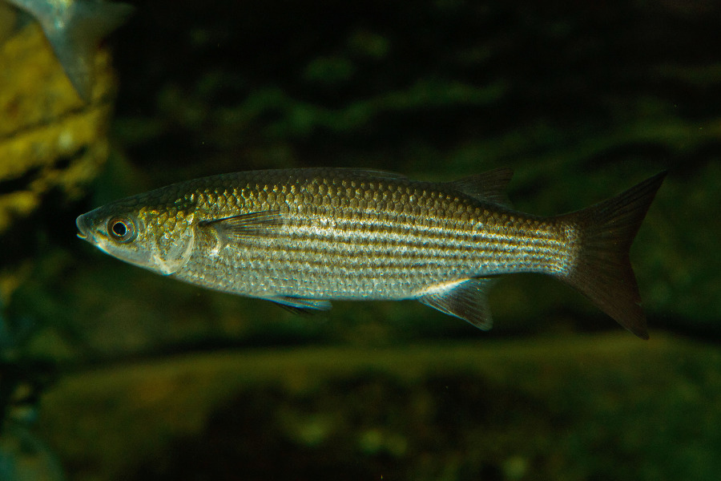
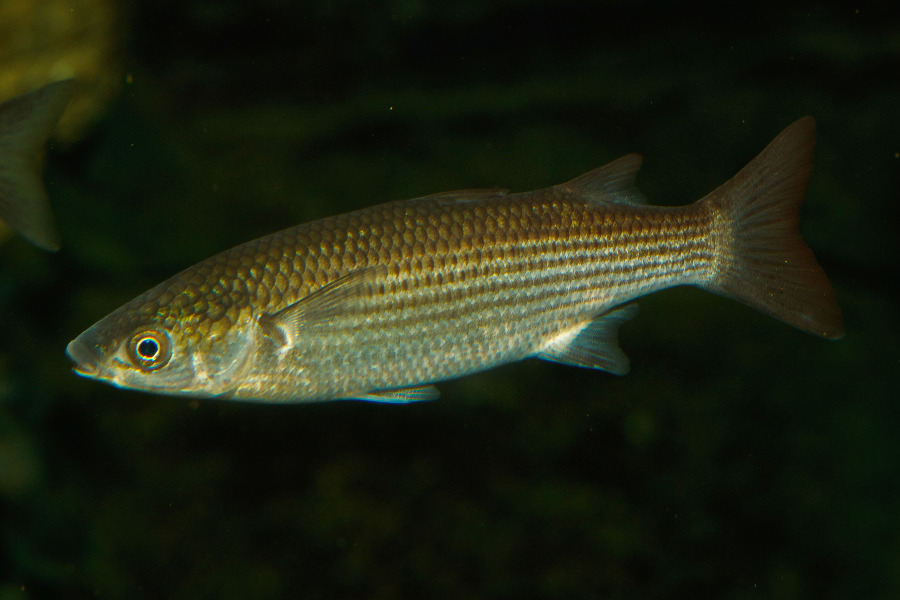
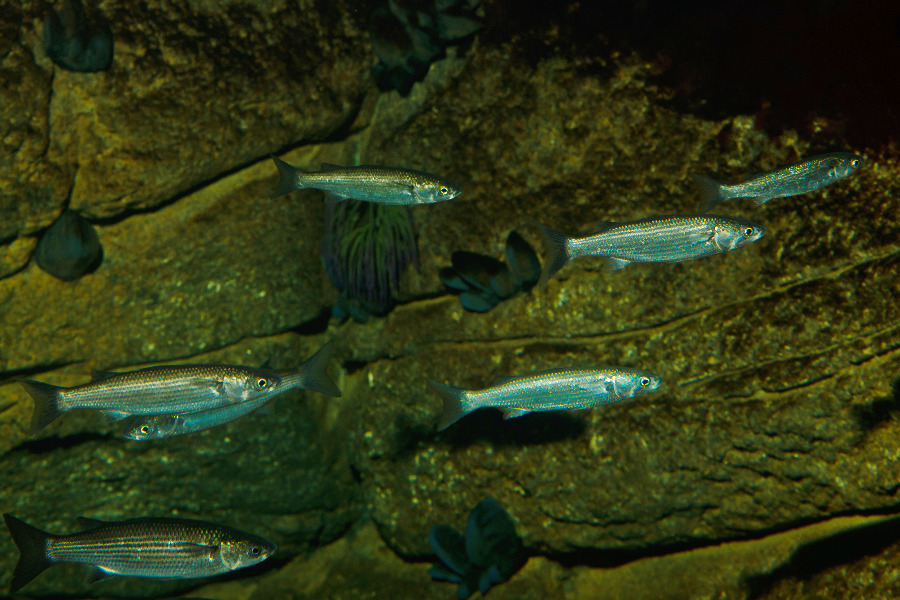
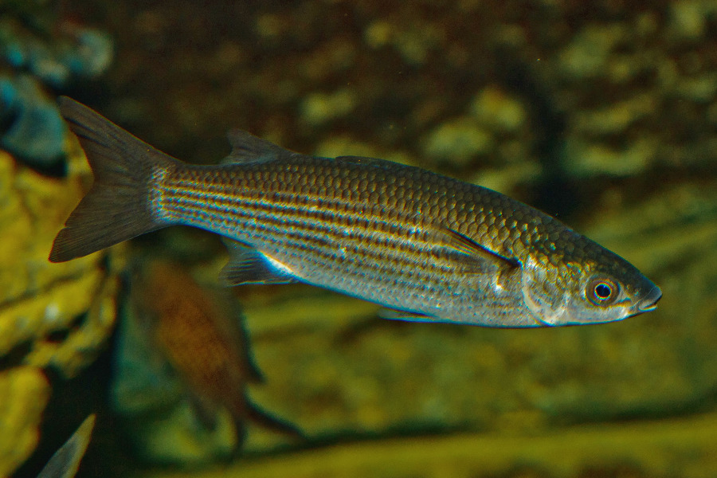

<article class="main-info">

_D-Dünnlippige Meeräsche;_
_GB-Thinlip grey mullet;_
_DK-Tyndlæbet multe;_
_PL-Cefal cienkowargi;_
_EST-Kitsashuul-tintkefaal;_
_RU-Кефаль-рамада;_
_FIN-Ohuthuulikeltti;_
_S-Tunnläppad multe_

### Erkennungsmerkmale

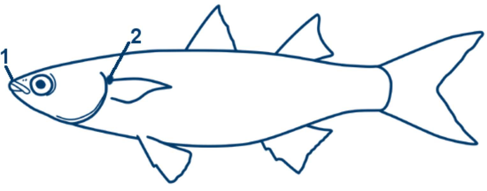

1. Oberlippe nicht verdickt.
2. Häufig ein schwarzer Punkt an der Basis der Brustflosse.

* Kleine Maulöffnung (reicht nicht bis an das Auge).
* Zwei weit getrennte Rückenflossen.
* Körper silbern; Bauchseite heller.

Meist unter 40 cm, maximal bis zu 70 cm lang und bis zu 3 kg schwer.

### Ähnliche Arten

* [Goldmeeräsche](#goldmeeräsche) - goldgelber Fleck am Kiemendeckel; Brustflosse spitzer auslaufend.
* [Dicklippige Meeräsche](#dicklippige-meeräsche) - Oberlippe dick mit kräftigen Papillen.

### Lebensweise

Küstennah lebender Schwarmfisch; vor allem im Frühjahr auch in Ästuaren; Jungtiere dringen oft ins Süßwasser vor; auch in stark verschmutztem Wasser.
Laicht im nördlichen Verbreitungsgebiet im Frühling; durch einen Öltropfen schwimmen die Eier an der Oberfläche.
Wird bis zu 9 Jahre alt.

### Ernährung

Allesfresser: vor allem organische Partikel der oberen Bodenschicht.

### Bedeutung

Speißefisch; wird auch in Aquakultur gehalten.

### Gefährdung

Nicht gefährdet.

</article>

<!-- class="sub-info" -->
> #### Liza ramada
>
> __Familie:__ Mugilidae
>
> __Ordnung:__ Mugiliformes
>
> 
>
> __Verbreitung:__ Regelmäßig in der westlichen Ostsee; in den letzten Jahren häufiger werdend.
>
> __Häufigkeit:__ regelmäßig
>
> __Gefährdung:__ nicht gefährdet

## Goldmeeräsche

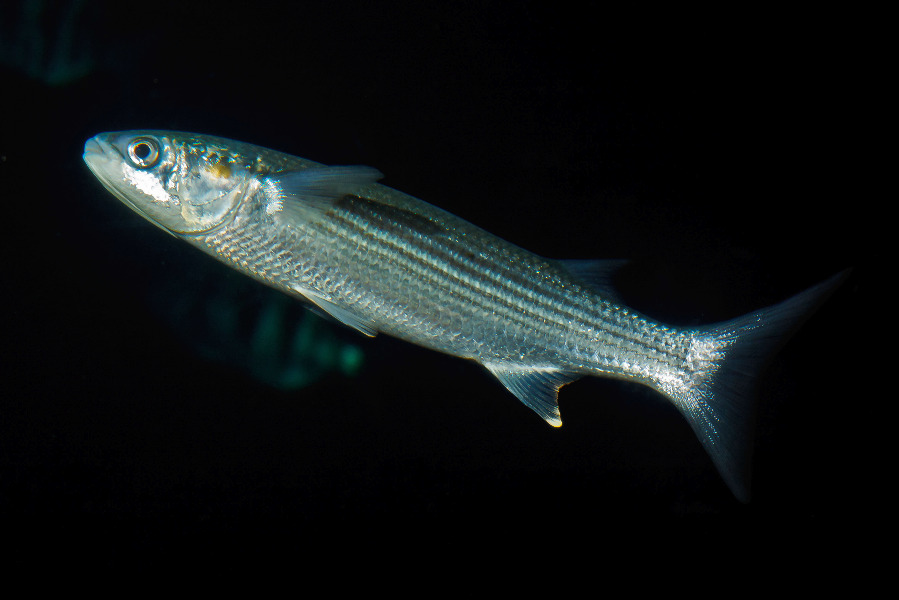
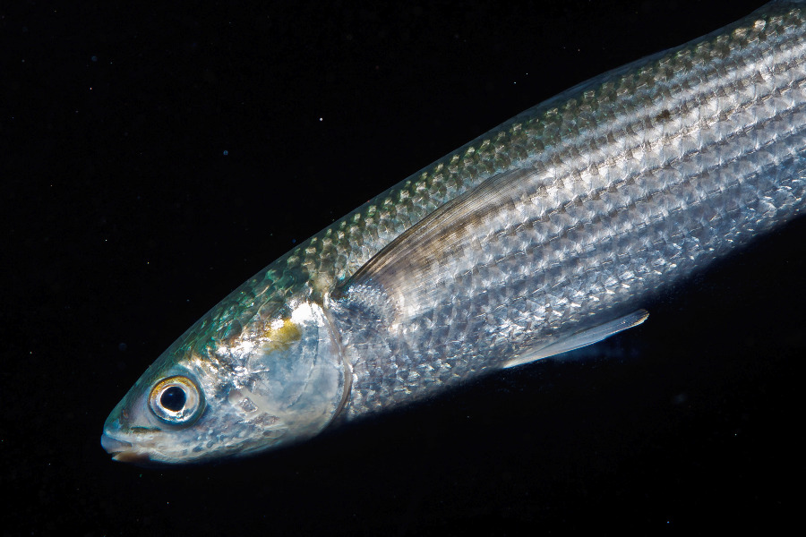
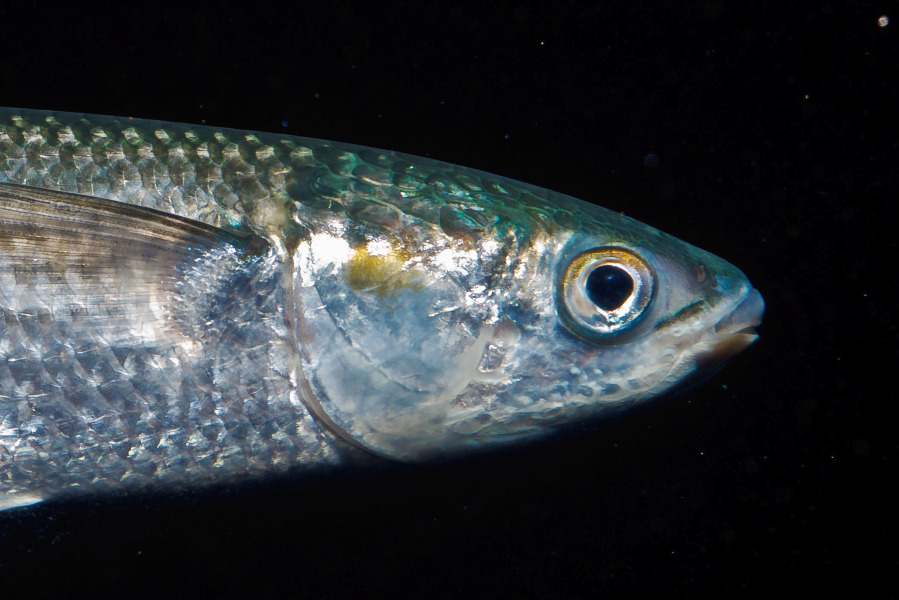

<article class="main-info">

_D-Goldmeeräsche;_
_GB-Golden grey mullet;_
_DK-Guldmulte;_
_PL-Cefal złocisty;_
_EST-Kuld-tintkefaal;_
_RU-Сингиль;_
_FIN-Kultakeltti;_
_S-Guldmulte_

### Erkennungsmerkmale

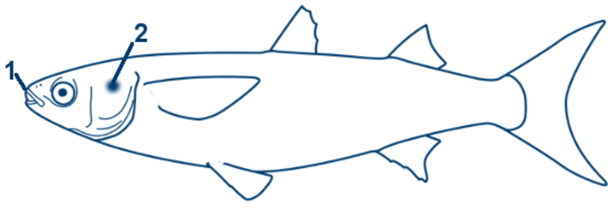

1. Oberlippe nicht verdickt.
2. Goldgelber Fleck auf dem Kiemendeckel.

* Kleine Maulöffnung (reicht nicht bis an das Auge).
* Zwei klar getrennte Rückenflossen.
* Körper silbern, Kopf und vorderer Körperteil oft golden schimmernd; Bauchseite heller.

Meist unter 35 cm, maximal bis zu 50 cm lang.

### Ähnliche Arten

* [Dünnlippige Meeräsche](#dünnlippige-meeräsche) - Schwarzer Fleck am Ansatz der Brustflosse; Brustflosse weniger spitz zulaufend.
* [Dicklippige Meeräsche](#dicklippige-meeräsche) - Oberlippe dick mit kräftigen Papillen

### Lebensweise

Küstennah lebender Schwarmfisch, der sich meist oberflächennah auffhält.
Kommt auch in Ästuaren vor, dringt aber nicht ins Süßwasser vor; auch in stark verschmutzten Gewässern.
Fortpflanzungszeit: Juli bis November; Eier schwimmen durch einen Öltropfen an der Wasseroberfläche.
Wird bis zu 9 Jahre alt.

### Ernährung

Allesfresser: vor allem organische Partikel der oberen Bodenschicht.

### Bedeutung

Speißefisch; wird auch in Aquakultur gehalten.

### Gefährdung

Nicht gefährdet.

</article>

<!-- class="sub-info" -->
> #### Liza aurata
>
> __Familie:__ Mugilidae
>
> __Ordnung:__ Mugiliformes
>
> 
>
> __Verbreitung:__ Kommt selten in der westlichen Ostsee vor.
>
> __Häufigkeit:__ selten
>
> __Gefährdung:__ nicht gefährdet

## Grasnadel

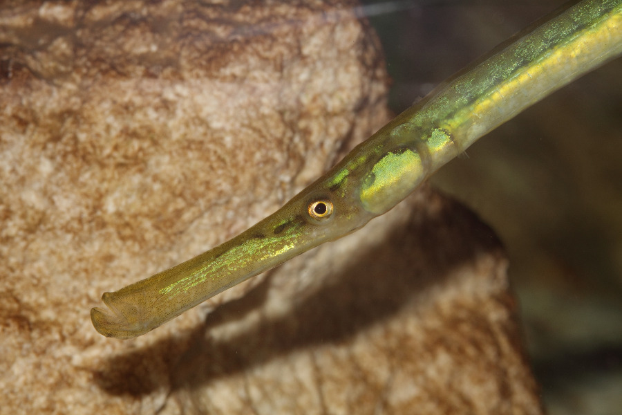
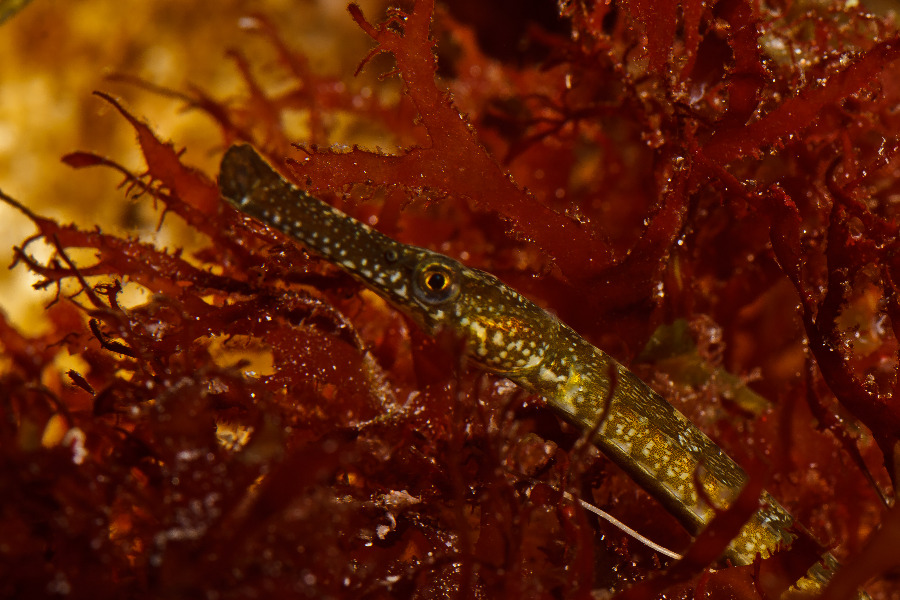
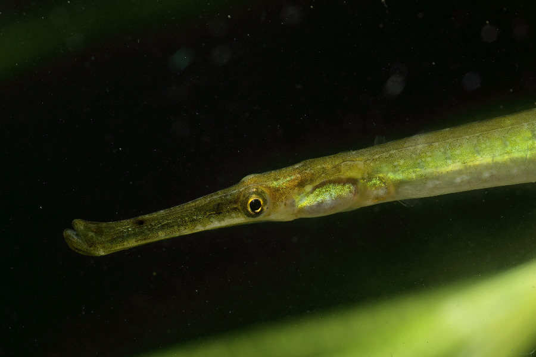
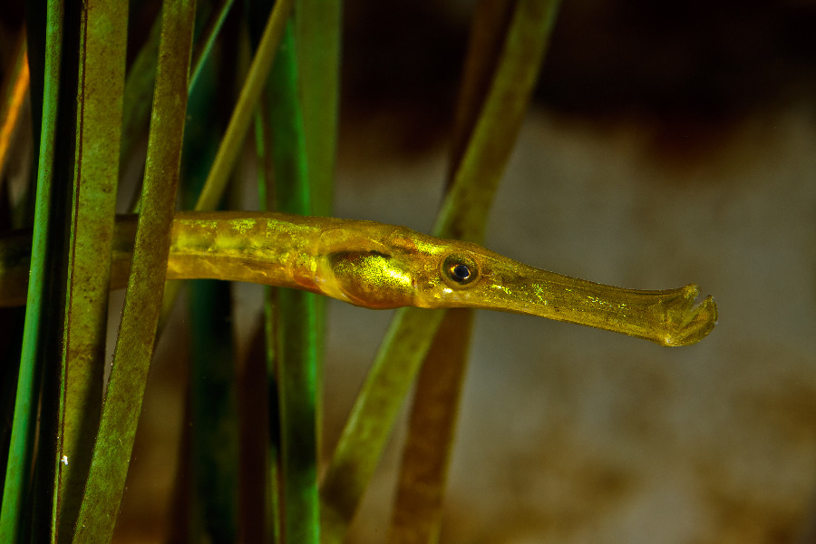

<article class="main-info">

_D-Grasnadel;_
_GB-Deep-snouted pipefish, Broadnosed pipefish;_
_DK-Tangnål;_
_PL-Iglicznia;_
_LT-Jūrų adata;_
_LV-Adatzivs;_
_EST-Merinõel;_
_RU-Длиннорылая рыба-игла;_
_FIN-Särmäneula;_
_S-Tångsnälla_

### Erkennungsmerkmale

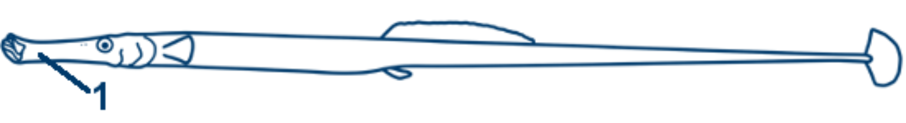

1. Schnauze sehr hoch (oft so hoch wie der restliche Kopf); Schnauze seitlich stark zusammengepresst.

* Schwanz- und Brustflossen vorhanden; Bauchflossen fehlend.
* Körperfärbung variable grünlich bis bräunlich.

Maximal bis zu 35 cm lang.

### Ähnliche Arten

* [Grosse Seenadel](#grosse-seenadel) - Schnauze im Querschnitt rund und weniger hoch.
* [Kleine Seenadel](#kleine-seenadel) - Schnauze im Querschnitt rund und weniger hoch.
* [Grosse Schlangennadel](#grosse-schlangennadel) - ohne Brustflossen; Schwanzflosse sehr klein, kaum sichtbar.
* [Kleine Schlangennadel](#kleine-schlangennadel) - Brust- und Schwanzflosse fehlen.
* [Seestichling](#seestichling) - Bauchflossen vorhanden; 14 bis 17 Rückenstacheln.

### Lebensweise

Begrenzt auf Algen- und Seegrasbestände im Flachwasser; kommt auch in Brackwasser vor.
Schwimmt oft mit dem Schwanz nach unten zwischen Blättern; Färbung passt sich dem Lebensraum an; im Sommer legen die Weibchen 100 bis 250 Eier in die Bruttasche des Männchens; 25 mm große Jungtiere werden nach 4 Wochen geboren.
Wird 2 bis 3 Jahre alt.

### Ernährung

Frisst kleinere Krebstiere und Fischbrut.

### Bedeutung

Kein Speißefisch; gelegentlich in Aquarien gehalten.

</article>

<!-- class="sub-info" -->
> #### Syngnathus typhle
>
> __Familie:__ Syngnathidae
>
> __Ordnung:__ Syngnathiformes
>
> 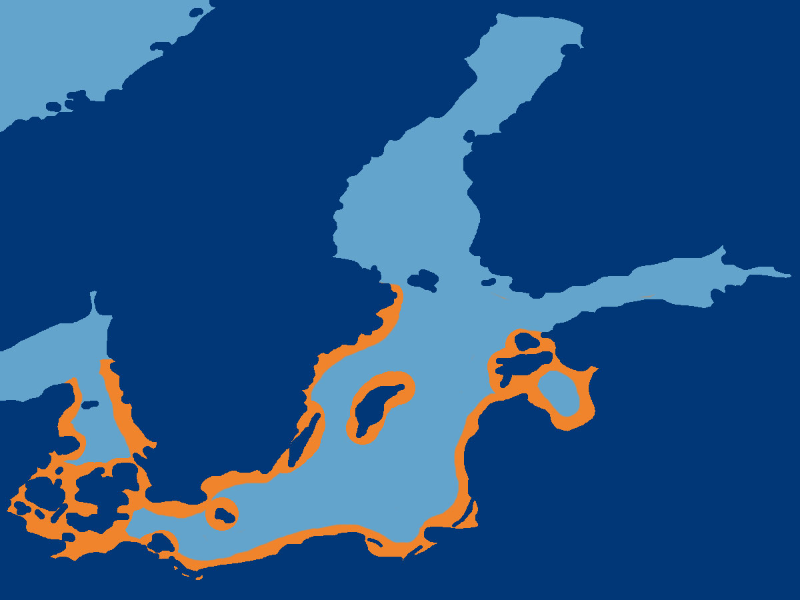
>
> __Verbreitung:__ In küstennahen Regionen der Ostsee, mit Ausnahme des finnischen und bottnischen Meerbusens.
>
> __Häufigkeit:__ häufig
>
> __Gefährdung:__ nicht gefährdet

## Grosse Seenadel

<article class="main-info">

_D-Grosse Seenadel;_
_GB-Greater pipefish;_
_DK-Stor Tangnål;_
_PL-Iglicznia większa;_
_EST-Suur merinõel;_
_RU-Обыкновенная морская игла;_
_FIN-Isoneula;_
_S-Större kantnål_

### Erkennungsmerkmale

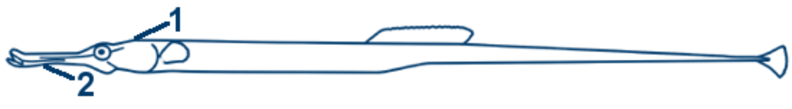

1. Höcker auf dem Nacken.
2. Lange röhrenförmige Schnauze (mehr als die Hälfte der Kopflänge).

* Schwanz- und Brustflossen vorhanden; Bauchflossen fehlend.
* Körper bräunlich, oft mit dunklen Querstreifen und grünlichem Glanz.

Maximal bis zu 45 cm lang.

### Ähnliche Arten

* [Grasnadel](#grasnadel) - Schnauze seitlich zusammengedrückt und meist hoch.
* [Kleine Seenadel](#kleine-seenadel) - Schnauze nicht länger als halbe Kopflänge; "Nacken" nicht erhöht.
* [Kleine Schlangennadel](#kleine-schlangennadel) - ohne Schwanz- und Brustflossen.
* [Grosse Schlangennadel](#grosse-schlangennadel) - ohne Brustflossen; Schwanzflosse sehr klein, kaum sichtbar.
* [Seestichling](#seestichling) - Bauchflossen vorhanden; 14 bis 17 Rückenstacheln.

### Lebensweise

Beschränkt auf Algen- und Seegrasbestände in Tiefen von 3 bis 12 m.
Im Frühling oder Sommer legt das Weibchen 100 bis 150 Eier in die Bruttasche des Männchens.
Das Männchen brütet die Eier aus; 30 mm lange Jungtiere werden nach 5 Wochen geboren.
Wird 2 bis 3 Jahre alt.

### Ernährung

Frisst kleinere Krebstiere und Fischbrut.

### Bedeutung

Ohne wirtschaftliche Bedeutung.

</article>

<!-- class="sub-info" -->
> #### Syngnathus acus
>
> __Familie:__ Syngnathidae
>
> __Ordnung:__ Syngnathiformes
>
> 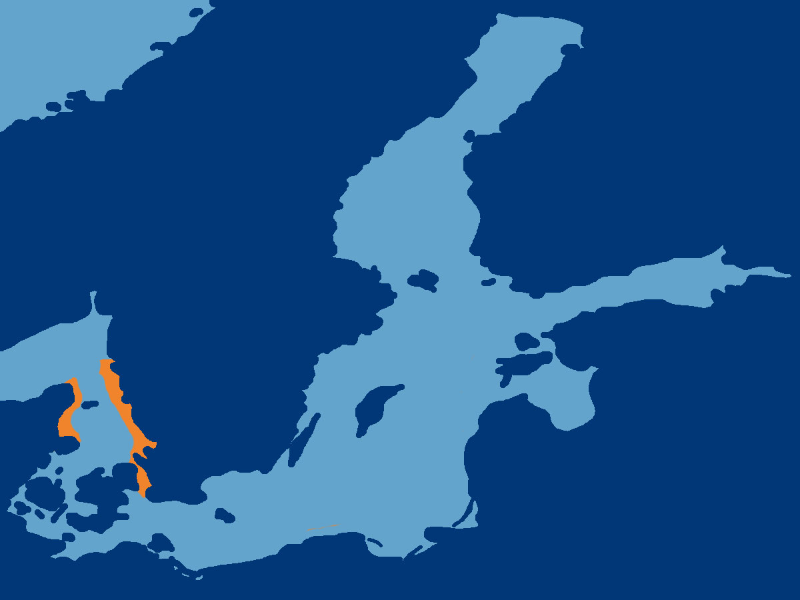
>
> __Verbreitung:__ Kommt im Kattegat und Öresund vor.
>
> __Häufigkeit:__ regelmäßig
>
> __Gefährdung:__ unklar

## Kleine Seenadel

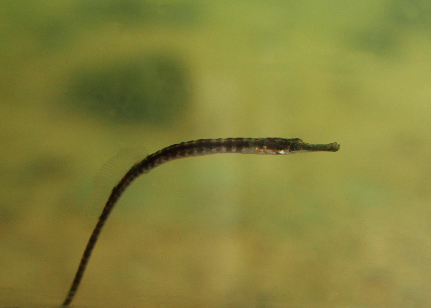

<article class="main-info">

_D-Kleine Seenadel;_
_GB-Lesser pipefish;_
_DK-Lille tangnål, kleine zeenaald;_
_PL-Iglicznia mała;_
_RU-Малоносая рыба-игла;_
_FIN-Pikkuneula;_
_S-Mindre kantnål_

### Erkennungsmerkmale

1. Schnauze kürzer als halbe Kopflänge; Schnauze im Querschnitt rund.
2. Kleine Schwanzflosse deutlich ausgeprägt.

* Brustflossen vorhanden; Bauchflossen fehlend.
* Körper bräunlich, gelegentlich mit dunklen Querstreifen und silbernem Schimmer.

Maximal bis zu 17 cm lang.

### Ähnliche Arten

* [Grosse Seenadel](#grosse-seenadel) - Schnauze länger als die halbe Kopflänge; Buckel am "Nacken".
* [Kleine Schlangennadel](#kleine-schlangennadel) - ohne Schwanz- und Brustflossen.
* [Grasnadel](#grasnadel) - Schnauze seitlich zusammengedrückt und meist hoch.
* [Grosse Schlangennadel](#grosse-schlangennadel) - ohne Brustflossen; Schwanzflosse sehr klein, kaum sichtbar.

### Lebensweise

Oft bodennah in Algen- und Seegrasbeständen, aber auch an sandigen Stränden und schwimmenden Pflanzenmaterial.
Das Männchen brütet die Eier aus.
Wird 2 bis 3 Jahre alt.

### Ernährung

Frisst kleinere Krebstiere und Fischbrut.

### Bedeutung

Ohne wirtschaftliche Bedeutung.

</article>

<!-- class="sub-info" -->
> #### Syngnathus rostellatus
>
> __Familie:__ Syngnathidae
>
> __Ordnung:__ Syngnathiformes
>
> 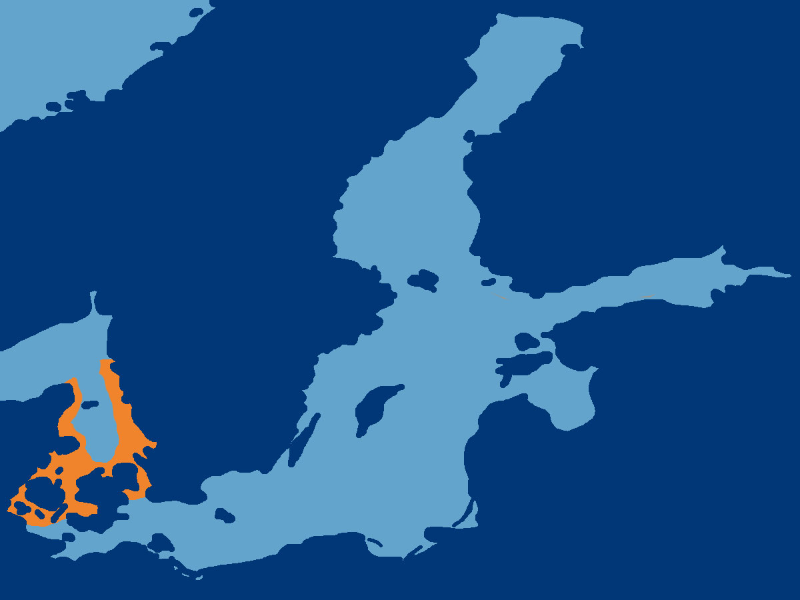
>
> __Verbreitung:__ Kommt in der westlichen Ostsee vor.
>
> __Häufigkeit:__ häufig
>
> __Gefährdung:__ unklar

## Kleine Schlangennadel

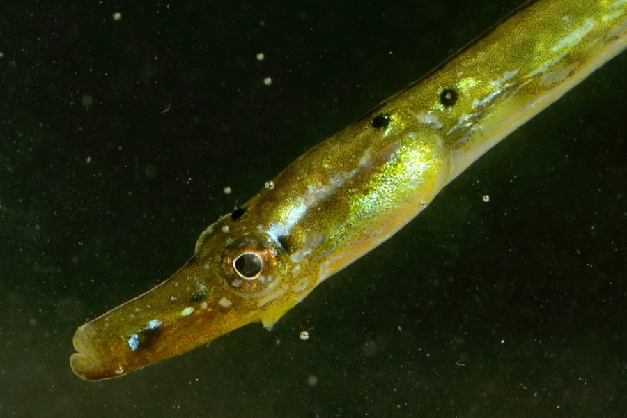
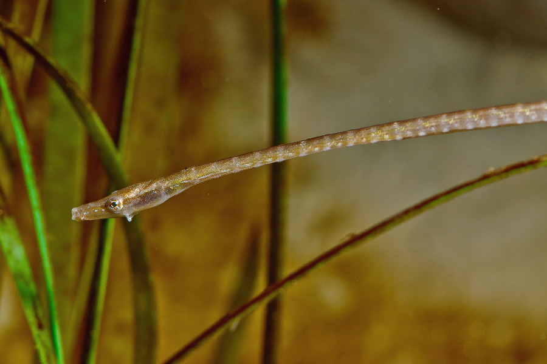
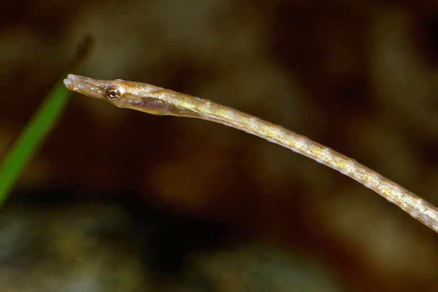
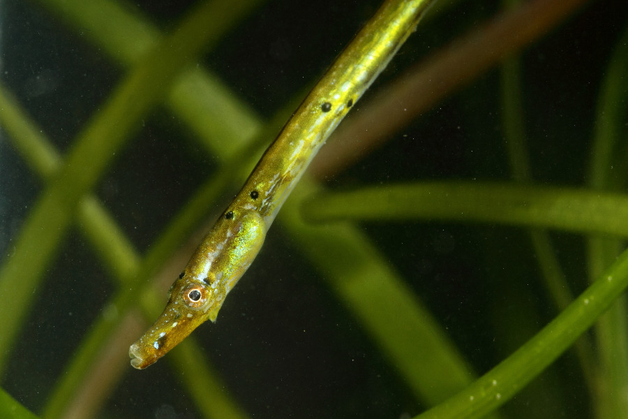
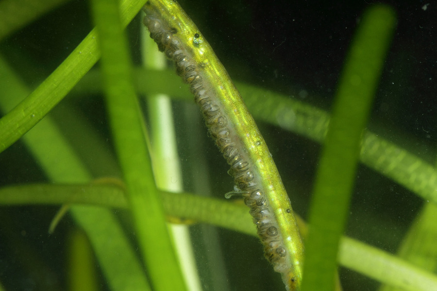
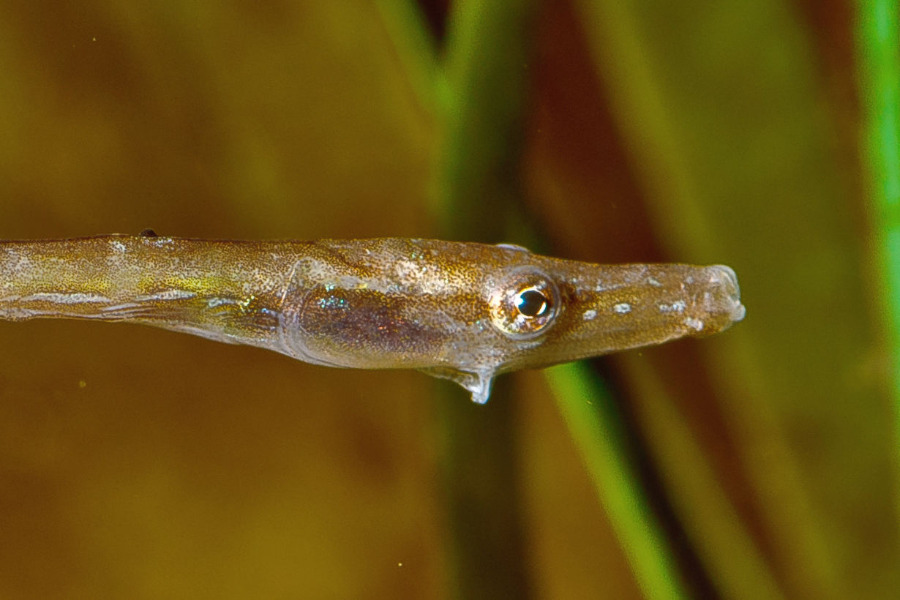

<article class="main-info">

_D-Kleine Schlangennadel;_
_GB-Straightnose pipefish;_
_DK-Stor næbsnog;_
_PL-Wężynka;_
_LT-Gyvatadatė, jūrų yla;_
_LV-čūskzivs;_
_EST-Madunõel;_
_RU-Морское шило;_
_FIN-Siloneula;_
_S-Mindre havsnål_

### Erkennungsmerkmale

1. Schnauze weniger als die halbe Kopflänge lang.
2. Schwanz zugespitzt ohne Schwanzflosse.
3. Anus auf derselben Höhe, wie der Ansatz der Rückenflosse.

* Ohne Brust- und Bauchflossen.
* Körper grünglich-bräunlich mit blauen Punkten; während der Fortpflanzungszeit mit leuchtend blauen Streifen.

Bis maximal 30 cm Länge, meist deutlich kleiner.

### Ähnliche Arten

* [Grosse Schlangennadel](#grosse-schlangennadel) - markanter braun-roter Streifen durch das Auge; Schwanzflosse sehr klein, kaum sichtbar; After auf Höhe des Endes der Rückenflosse.
* [Kleine Seenadel](#kleine-seenadel) - Schnauze etwas länger; Schwanz- und Brustflossen vorhanden.
* [Grosse Seenadel](#grosse-seenadel) - Schnauze deutlich länger; Schwanz- und Brustflossen vorhanden.
* [Grasnadel](#grasnadel) - Schnauze zusammengedrückt und meist hoch; Schwanz- und Brustflossen vorhanden.

### Lebensweise

Kommt in Algen- und Seegrasbeständen vor, aber auch an Sandstränden und im Brackwasser, meist in 1 bis 15 m Tiefe.
Laicht im Sommer; die Weibchen legen 120-150 gelbliche Eier in zwei Reihen an die Bauchseite des Männchens; nach 3 Wochen schlüpfen die Jungen.

### Ernährung

Frisst kleinere Krebstiere und Fischbrut.

### Bedeutung

Ohne wirtschaftliche Bedeutung.

</article>

<!-- class="sub-info" -->
> #### Nerophis ophidion
>
> __Familie:__ Syngnathidae
>
> __Ordnung:__ Syngnathiformes
>
> 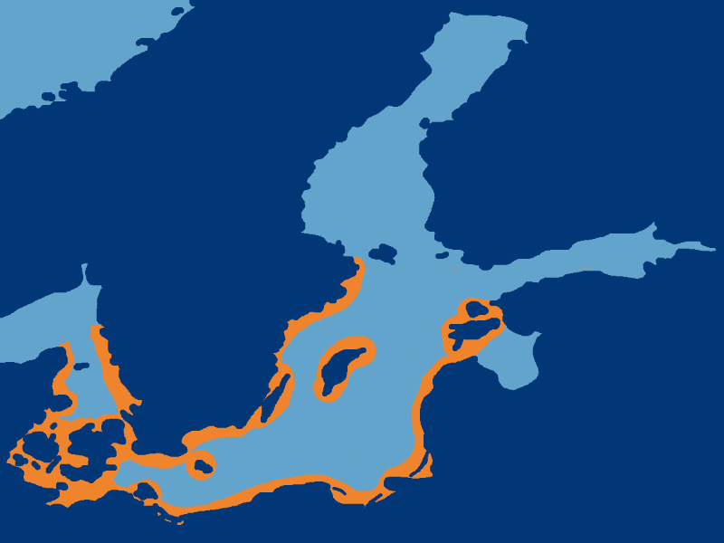
>
> __Verbreitung:__ Kommt küstennah in der gesamten Ostsee vor, mit Ausnahme des Bottnischen Meerbusens und dem Golf von Finland.
>
> __Häufigkeit:__ sehr häufig
>
> __Gefährdung:__ nicht gefährdet

## Grosse Schlangennadel

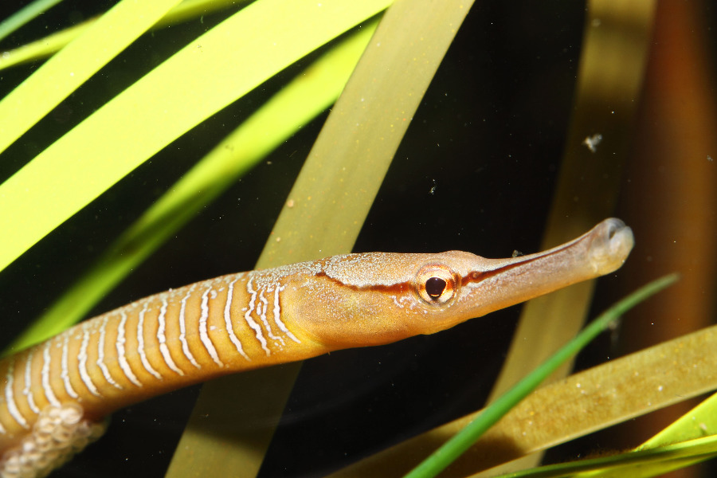
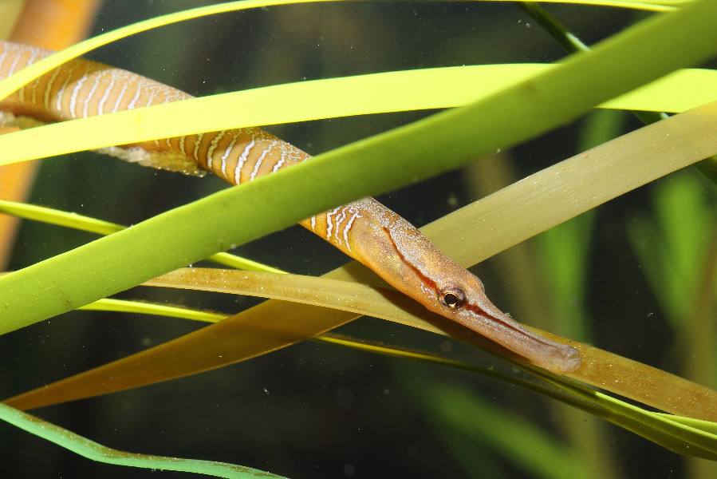
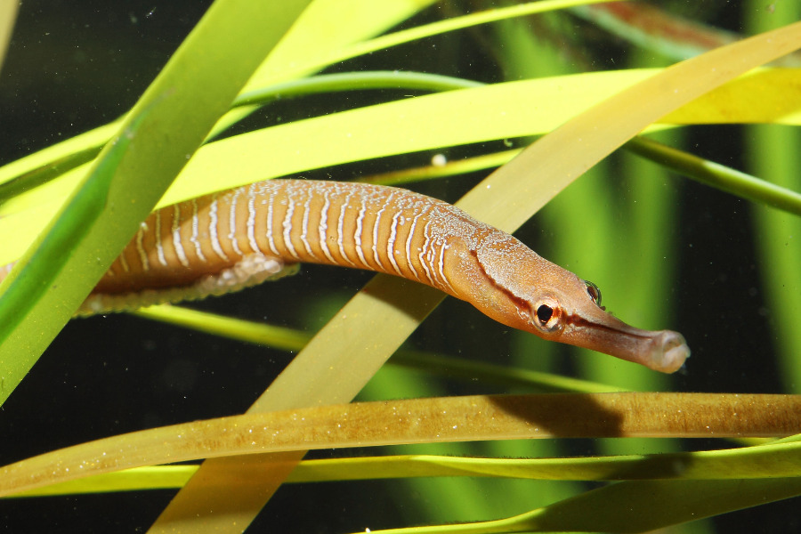

<article class="main-info">

_D-Grosse Schlangennadel;_
_GB-Snake pipefish;_
_DK-Adderzeenaald;_
_PL-Wężyna;_
_EST-Sargassumnõel;_
_RU-Zmeevidnaya ryba-igla;_
_FIN-Merineula;_
_S-Större havsnål_
### Erkennungsmerkmale

1. Schnauze länger als halbe Kopflänge.
2. Auffälliger Streifen über Auge und Schnauze.
3. Schwanz zugespitzt, mit sehr kleiner, kaum sichtbarer Schwanzflosse.
4. After auf der Höhe des Endes der Rückenflosse.

* Ohne Brust- und Bauchflossen.
* Mit blauen Streifen auf dem Körper.

Maximal bis zu 60 cm lang.

### Ähnliche Arten

* [Kleine Schlangennadel](#kleine-schlangennadel) - Schnauze kürzer; After auf der Höhe des Anfangs der Rückenflosse; Schwanzflosse fehlt vollständig.
* [Kleine Seenadel](#kleine-seenadel) - Schnauze etwas länger; Schwanz- und Brustflossen vorhanden.
* [Grosse Seenadel](#grosse-seenadel) - Schnauze deutlich länger; Schwanz- und Brustflossen vorhanden.
* [Grasnadel](#grasnadel) - Schnauze zusammengedrückt und meist hoch; Schwanz- und Brustflossen vorhanden.

### Lebensweise

Lebt in Algen- und Seegrasbeständen, aber auch im Freiwasser, meist von 5 bis 30 m Tiefe; maximal bis zu 100 m Tiefe.
Laicht im Sommer: das Weibchen heftet 400 bis 1000 Eier an die Bäuche mehrerer Männchen.

### Ernährung

Frisst kleinere Krebstiere und Fischbrut.

### Bedeutung

Ohne wirtschaftliche Bedeutung.

</article>

<!-- class="sub-info" -->
> #### Entelurus aequoreus
>
> __Familie:__ Syngnathidae
>
> __Ordnung:__ Syngnathiformes
>
> 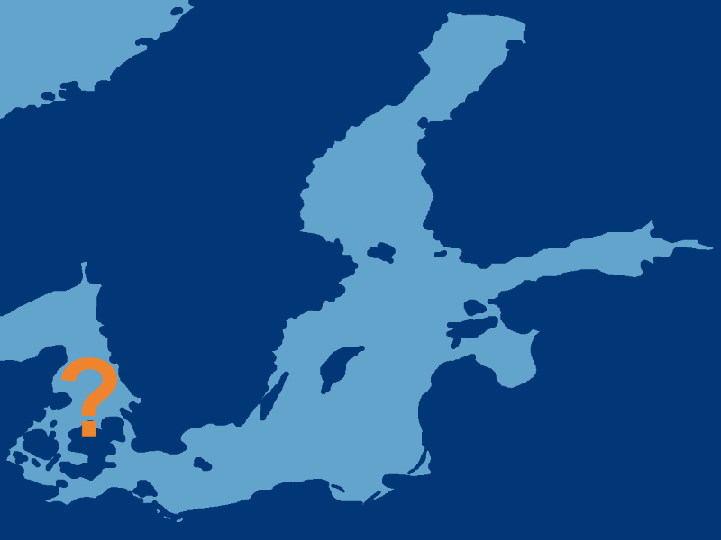
>
> __Verbreitung:__ Als Irrgast in der westlichen Ostsee.
>
> __Häufigkeit:__ selten
>
> __Gefährdung:__ unklar

## Schellfisch

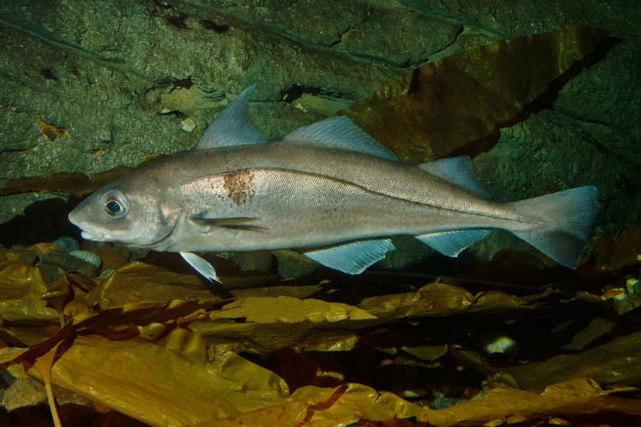
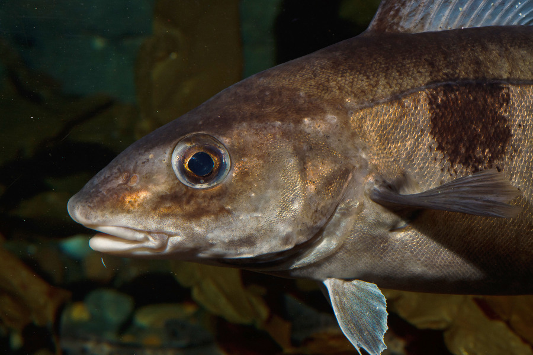
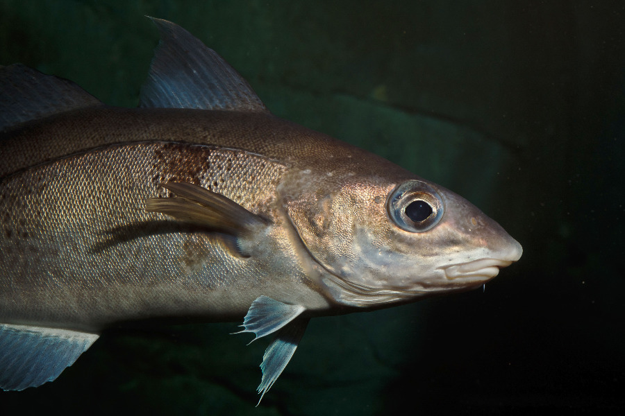

<article class="main-info">

_D-Schellfisch;_
_GB-Haddock;_
_DK-Kuller;_
_PL-Plamiak;_
_LT-Juodadėmė menkė;_
_LV-Pikša;_
_EST-Pikša;_
_RU-Пикша;_
_FIN-Kolja;_
_S-Kolja_
### Erkennungsmerkmale

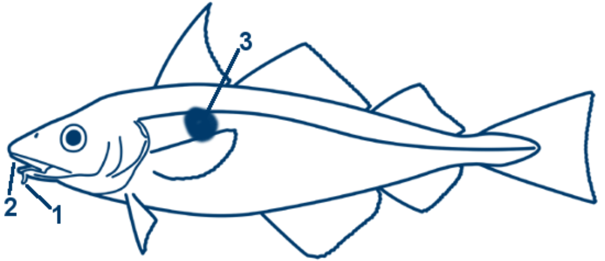Erkennungsmerkmale

1. Kurze Bartel am Kinn.
2. Maul unterständig.
3. Auffallender schwarzer Fleck über den Brustflossen.

* 3 Rücken- und 2 Afterflossen.
* Seiten silbern, Rücken dunkel grünlich, Bauchseite heller.

Meist 50 bis 75 cm, maximal 112 cm lang.

### Ähnliche Arten

* [Wittling](#wittling) - Bartel sehr klein oder fehlend; ohne großen schwarzen Fleck über der Mitte der Brustflosse (nur ein kleiner über dem Ansatz der Brustflosse).
* [Dorsch](#dorsch) - Bartel länger; Seitenlinie weiß hervorgehoben; mit bräunlichem Fleckenmuster.
* [Köhler](#köhler) - Maul oberständig.
* [Pollack](#pollack) - Maul oberständig.

### Lebensweise

Lebt bodennah in Schwärmen von 10 bis 200 m Tiefe.
Pflanzt sich in der ersten Hälfte des Jahers fort, mit bis zu 1,5 Millionen Eiern pro Weibchen.
Wird bis zu 20 Jahre alt.

### Ernährung

Frisst vor allem bodenlebende Wirbellose, kleine Fische und Fischbrut.

### Bedeutung

Beliebter Speisefisch mit hoher ökonomischer Bedeutung.

</article>

<!-- class="sub-info" -->
> #### Melanogrammus aeglefinus
>
> __Familie:__ Gadidae
>
> __Ordnung:__ Gadiformes
>
> 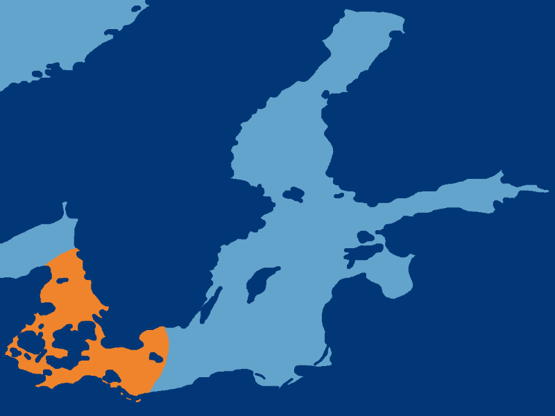
>
> __Verbreitung:__ Westliche Ostsee bis Bornholm.
>
> __Häufigkeit:__ regelmäßig
>
> __Gefährdung:__ nicht gefährdet

## Wittling

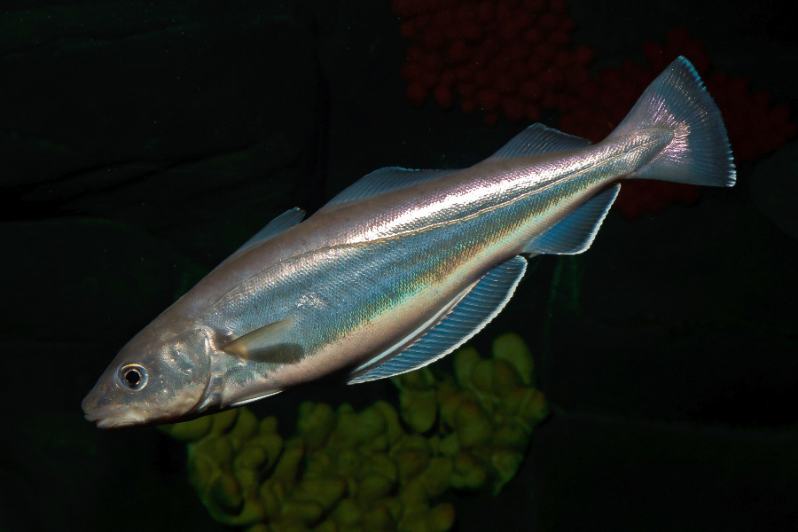
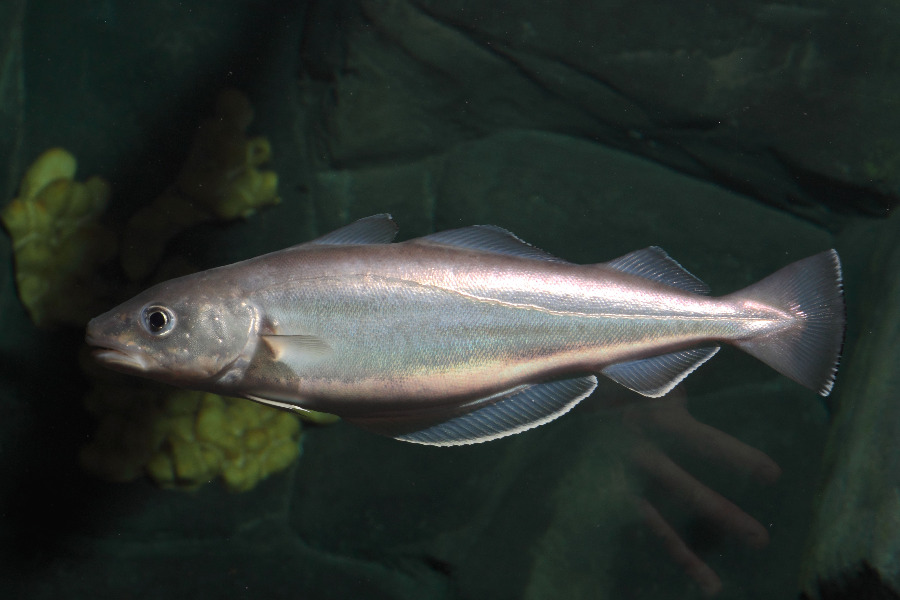
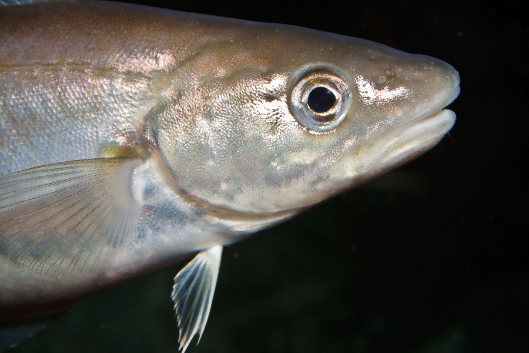

<article class="main-info">

_D-Wittling, Merlan;_
_GB-Whiting, merling;_
_DK-Hvilling;_
_PL-Witlinek;_
_LV-Merlangs;_
_EST-Merlang;_
_RU-Мерланг;_
_FIN-Valkoturska;_
_S-Vitling_

### Erkennungsmerkmale

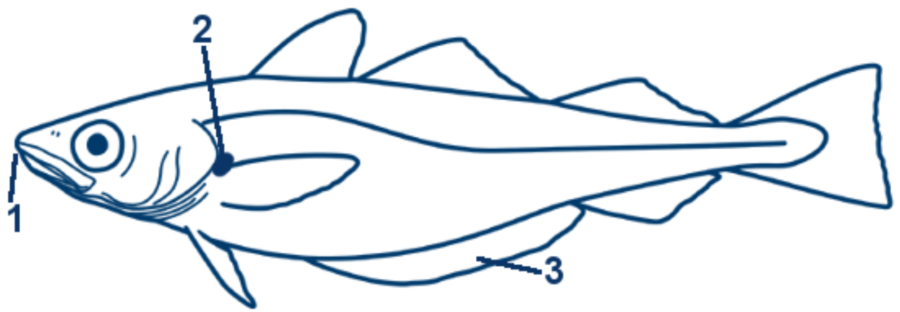

1. Maul unterständig.
2. Kleiner schwarzer Fleck an der Basis der Brustflosse.
3. Erste Afterflosse etwa eineinhalb mal so lang wie die zweite Rückenflosse.

* Kinnbartel sehr klein (bei Jungtieren) oder fehlende (bei Erwachsenen).
* 3 Rücken- und 2 Afterflossen.
* Seiten silbern; Rücken grünlich glänzend; Bauchseite heller.

Meist etwa 30 bis 40 cm, maximal bis zu 70 cm lang.

### Ähnliche Arten

* [Köhler](#köhler) - Maul oberständig; erste Afterflosse nur geringfügig länger als zweite Rückenflosse.
* [Pollack](#pollack) - Maul oberständig; erste Afterflosse nur geringfügig länger als zweite Rückenflosse.
* [Schellfisch](#schellfisch) - großer schwarzer Fleck über der Mitte der Brustflosse; erste Afterflosse nur geringfügig länger als zweite Rückenflosse.
* [Blauer Wittling](#blauer-wittling) - weiter Abstand zwischen zweiter und dritter Rückenflosse (berühren sich beim Wittling); erste Afterflosse etwa 4-mal so lang wie zweite Rückenflosse; nie mit Kinnbartel.

### Lebensweise

Lebt bodennah in Schwärmen bis in eine Tiefe von 200 m.
Laicht im Frühjahr mit etwa 1 Million Eiern pro Weibchen.
Jungtiere halten sich gerne unter Schirmquallen auf.
Wird bis zu 20 Jahre alt.

### Ernährung

Ernährt sich von anderen Fischen, wie Heringen oder jungen Dorschartigen, aber auch von Krebstieren.

### Bedeutung

Wichtiger Speisefisch.

</article>

<!-- class="sub-info" -->
> #### Merlangius merlangus
>
> __Familie:__ Gadidae
>
> __Ordnung:__ Gadiformes
>
> 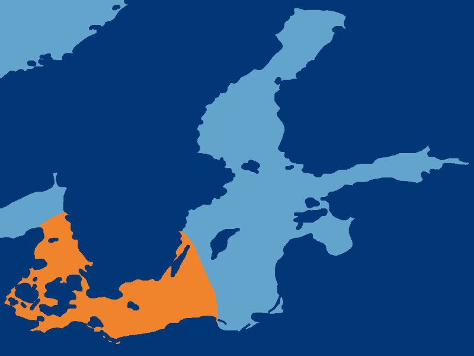
>
> __Verbreitung:__ Verbreitet in der westlichen und zentralen Ostsee bis Öland.
>
> __Häufigkeit:__ häufig
>
> __Gefährdung:__ unklar

## Blauer Wittling

<article class="main-info">

_D-Blauer Wittling;_
_GB-Blue whiting;_
_DK-Blåhvilling;_
_PL-Błękitek, putasu;_
_EST-Põhjaputassuu;_
_RU-Северная путассу;_
_FIN-Mustakitaturska;_
_S-Kolmule_

### Erkennungsmerkmale

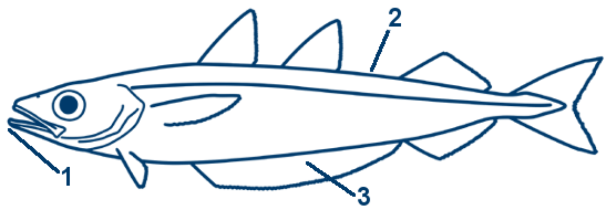

1. Unterkiefer leicht vorstehend.
2. Großer Zwischenraum zwischen zweiter und dritter Rückenflosse (mindestens so lang wie die zweite Rückenflosse).
3. Erste Afterflosse etwa viermal so lang, wie die zweite Rückenflosse; setzt etwa auf selber Höhe an, wie die erste Rückenflosse.

* 3 Rücken- und 2 Afterflossen.
* Auge sehr groß (mehr als die halbe Kopfhöhe).
* Flanken hellblau bis weißlich; Rücken dunkler.

Meist 20 bis 30 cm, maximal bis zu 45 cm lang.

### Ähnliche Arten

* [Wittling](#wittling) - zweite und dritte Rückenflosse berühren sich; erste Afterflosse nur etwa 1½-mal so lang wie zweite Rückenflosse.
* [Köhler](#köhler) - zweite und dritte Rückenflosse berühren sich fast; erste Afterflosse nur geringfügig länger als zweite Rückenflosse.
* [Pollack](#pollack) - zweite und dritte Rückenflosse berühren sich fast; erste Afterflosse nur geringfügig länger als zweite Rückenflosse.
* [Schellfisch](#schellfisch) - Maul deutlich unterständig; großer schwarzer Fleck über der Mitte der Brustflosse; erste Afterflosse nur geringfügig länger als zweite Rückenflosse.

### Lebensweise

Lebt in großen Schwärmen im Freiwasser von 100 bis 1000 m Tiefe.
Folgt dem täglichen Rhythmus des Planktons: steigt nachts an die Oberfläche und hält sich tagsüber in tieferen Wasserschichten auf.

### Ernährung

Frisst for allem freischwimmende Krebstiere; seltener kleiner Fische oder Tintenfische.

### Bedeutung

Wird in großen Mengen zu Fischmehl verarbeitet.

</article>

<!-- class="sub-info" -->
> #### Micromesistius poutassou
>
> __Familie:__ Gadidae
>
> __Ordnung:__ Gadiformes
>
> 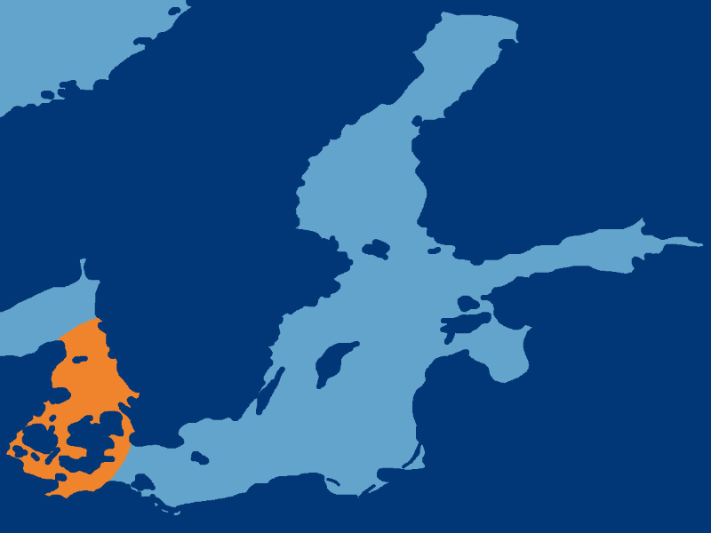
>
> __Verbreitung:__ Kommt in der westlichen Ostsee vor.
>
> __Häufigkeit:__ regelmäßig
>
> __Gefährdung:__ nicht gefährdet

## Pollack

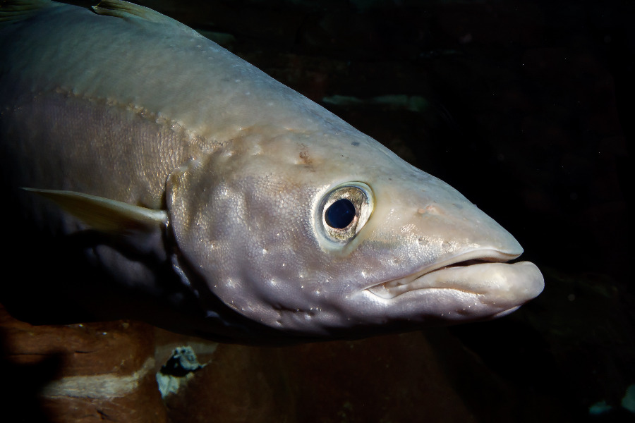
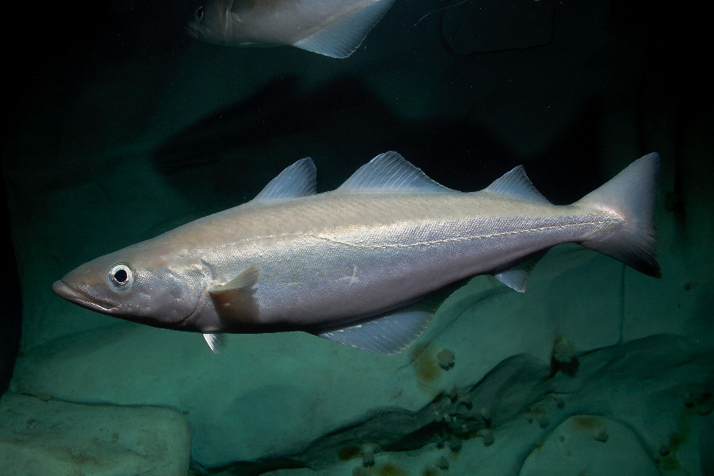

<article class="main-info">

_D-Pollack, Steinköhler;_
_GB-Pollock;_
_DK-Lubbe;_
_PL-Rdzawiec;_
_LV-Pollaks;_
_EST-Pollak;_
_RU-Серебристая сайда;_
_FIN-Lyyraturska;_
_S-Lyrtorsk_

### Erkennungsmerkmale

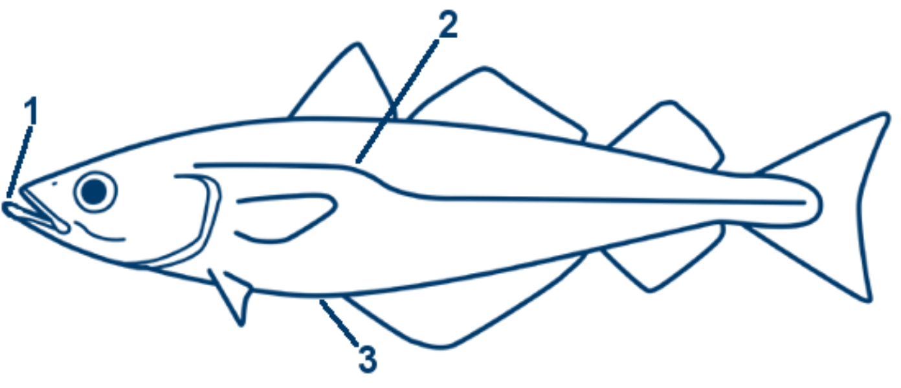

1. Deutlich oberständiges Maul.
2. Seitenlinie über der Brustflosse stark gebogen.
3. Anus unterhalb der vorderen Hälfte der ersten Rückenflosse.

* 3 Rücken- und 2 Afterflossen.
* Körper hell gelblich bis grünlich; Rücken dunkler.
* Jungtiere manchmal mit orange-bräunlichen Streifen.

Meist 30 bis 60 cm, maximal bis zu 130 cm lang und 10 kg schwer.

### Ähnliche Arten

* [Köhler](#köhler) - Seitenlinie gerade und weiß hervorgehoben; After liegt unter dem hinteren Ende der ersten Rückenflosse; Mundhöhle oft schwarz (beim Pollack nie schwarz).
* [Wittling](#wittling) - Maul unterständig; kleiner schwarzer Fleck über der Basis der Brustflosse.
* [Blauer Wittling](#blauer-wittling) - weiter Abstand zwischen zweiter und dritter Rückenflosse (berühren sich fast beim Pollack); erste Afterflosse etwa 4-mal so lang wie zweite Rückenflosse.
* [Schellfisch](#schellfisch) - Maul deutlich unterständig; mit Kinnbartel; großer schwarzer Fleck über der Mitte der Brustflosse.

### Lebensweise

Lebt in kleinen Gruppen über Hartgrund oberhalb von 100 m Tiefe.
Für die Fortpflanzung bilden sich größere Schwärme in größeren Tiefen (bis etwa 150 m).
Jungtiere halten sich eher küstennah auf.

### Ernährung

Ernährt sich vor allem von kleinen Schwarmfischen, wie Hering, Sprotte und Sandaal; daneben auch Tintenfische und Garnelen.

### Bedeutung

Hohe ökonomische Bedeutung.

### Gefährdung

Im Ostseeraum stark befischt.

</article>

<!-- class="sub-info" -->
> #### Pollachius pollachius
>
> __Familie:__ Gadidae
>
> __Ordnung:__ Gadiformes
>
> 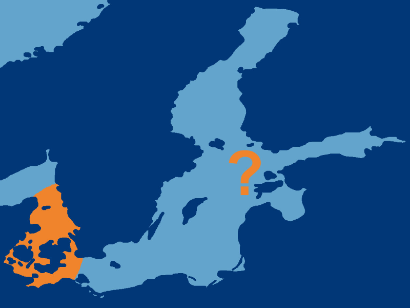
>
> __Verbreitung:__ Kommt in der westlichen Ostsee vor; ab und zu auch bis in die östliche Ostsee vordringend.
>
> __Häufigkeit:__ häufig
>
> __Gefährdung:__ nicht gefährdet

## Köhler

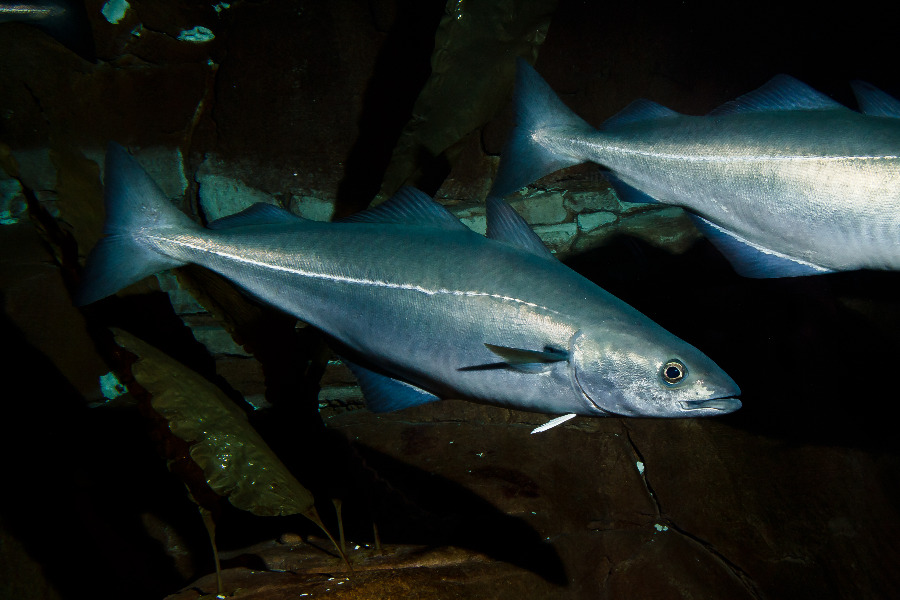
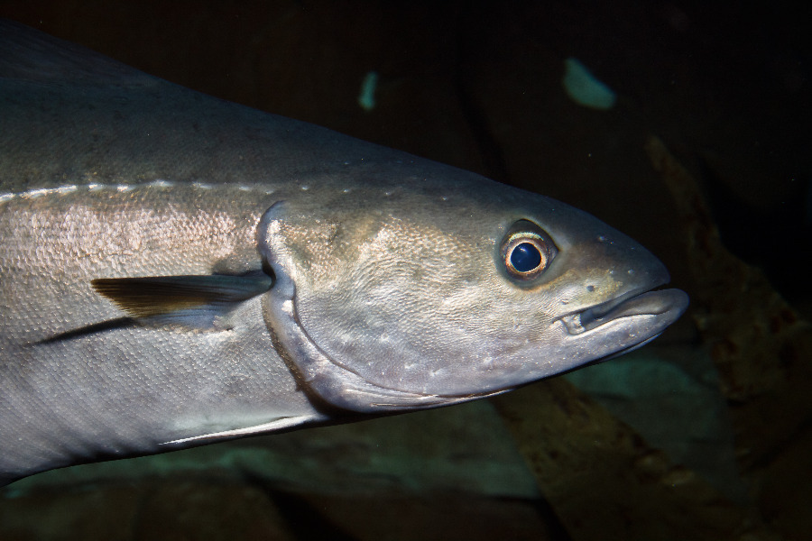

<article class="main-info">

_D-Köhler, Seelachs;_
_GB-Saithe;_
_DK-Sej;_
_PL-Czarniak;_
_LT-Ledjūrio menkė, saida;_
_LV-Saida;_
_EST-Põhjaatlandi süsikas;_
_RU-Сайда;_
_FIN-Seiti;_
_S-Gråsej;_

### Erkennungsmerkmale

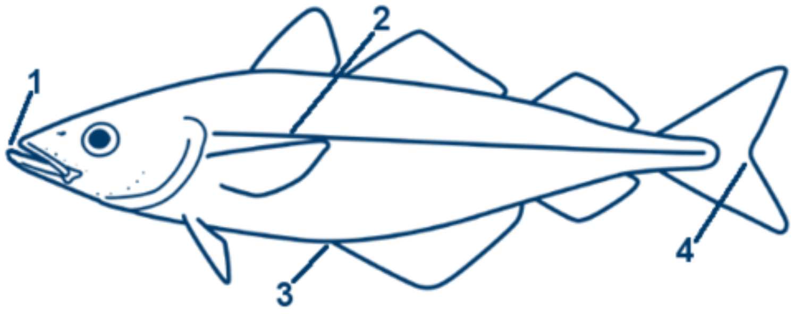

1. Maul oberständig.
2. Seitenlinie weiß hervorgehoben, kaum gebogen.
3. After unter dem Ende der ersten Rückenflosse.
4. Schwanzflosse gegabelt.

* Drei Rückenflossen und 2 Afterflossen.
* Körper gräulich, bräunlich oder grünlich; Bauchseite heller.

Meist 60 bis 90 cm, maximal bis zu 130 cm Länge und 10 Kg Gewicht.

### Ähnliche Arten

* [Pollack](#pollack) - Seitenlinie über der Brustflosse deutlich nach oben gebogen; After liegt unter der vorderen Hälfte der ersten Rückenflosse; Schwanzflosse höchstens leicht eingebuchtet; Mundhöhle nie schwarz (beim Köhler häufig schwarz).
* [Wittling](#wittling) - Maul unterständig; kleiner schwarzer Fleck über der Basis der Brustflosse.
* [Schellfisch](#schellfisch) - Maul deutlich unterständig; mit Kinnbartel; großer schwarzer Fleck über der Mitte der Brustflosse.

### Lebensweise

Meist in Schwärmen in der gesamten Wassersäule bis in 200 m Tiefe.
Unternimmt weite Wanderungen, bei denen er oft seiner Beute folgt.
Kann bis zu 30 Jahre alt werden.

### Ernährung

Frisst als Jungtier Krebstiere.
Erwachsene fressen fast ausschließlich kleine Schwarmfische wie Sprotten und (kleine) Heringe.

### Bedeutung

Stark befischt.

</article>

<!-- class="sub-info" -->
> #### Pollachius virens
>
> __Familie:__ Gadidae
>
> __Ordnung:__ Gadiformes
>
> 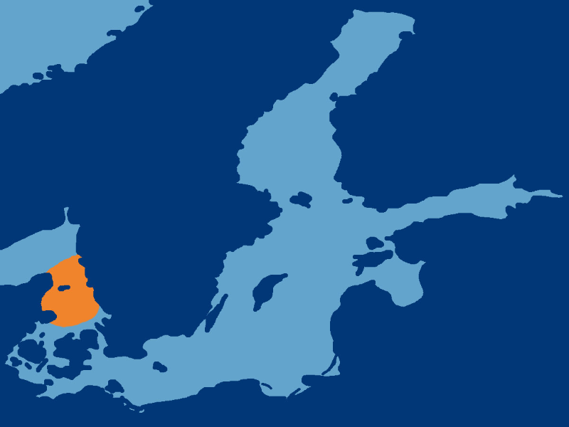
>
> __Verbreitung:__ Häufig im Kattegat; seltener in die zentrale Ostsee vordringend.
>
> __Häufigkeit:__ regelmäßig
>
> __Gefährdung:__ unklar

## Franzosendorsch

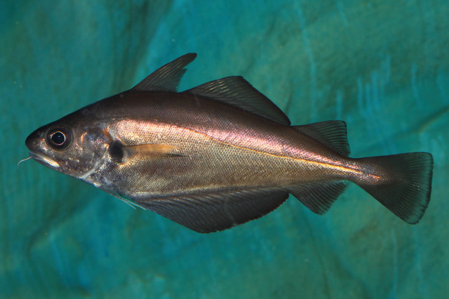
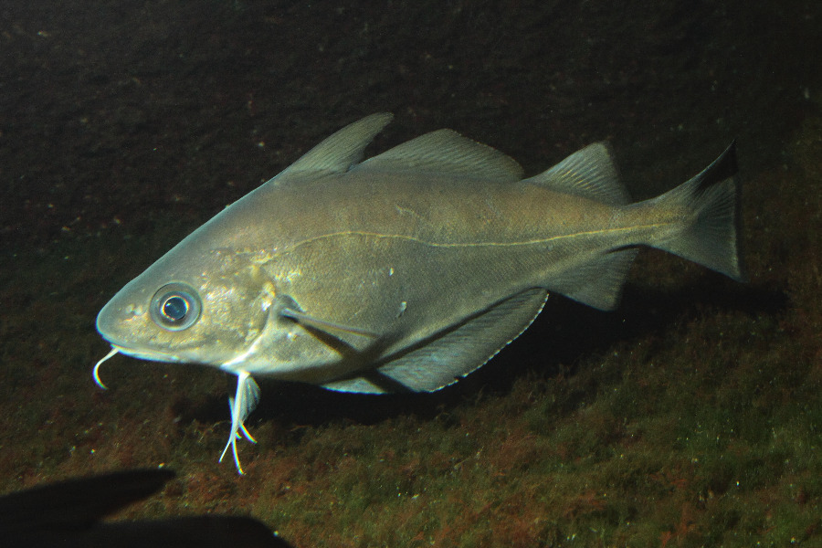
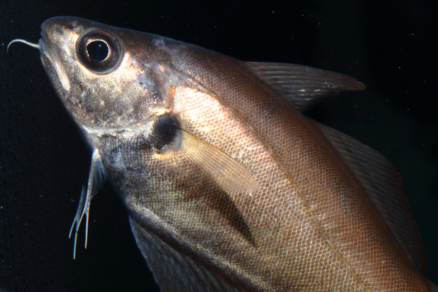

<article class="main-info">

_D-Franzosendorsch;_
_GB-Pouting, bib;_
_DK-Skægtorsk;_
_PL-Bielmik;_
_EST-Harilik tursik;_
_RU-Тресочка;_
_FIN-Partaturska;_
_S-Skäggtorsk_

### Erkennungsmerkmale

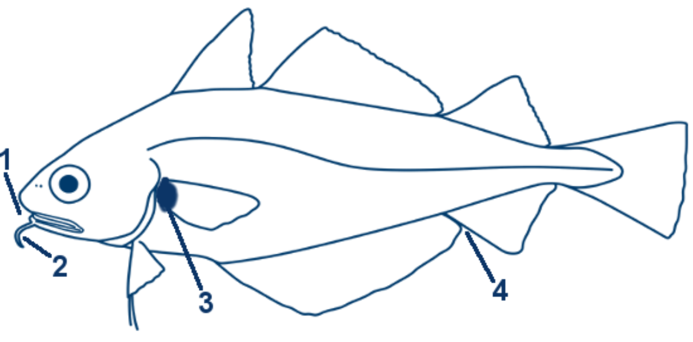

1. Leicht unterständiges Maul.
2. Lange Kinnbartel vorhanden.
3. Brustflossenbasis mit auffälligem schwarzen Fleck.
4. Erste und zweite Rückenflosse stoßen aneinander (ohne Zwischenraum).

* 3 Rücken- und 2 Afterflossen.
* Körper relativ hoch (mehr als eineinhalbfache Kopfhöhe).
* Flanken bräunlich, manchmal mit dunklen Streifen; Bauch weiß.

Meist 15 bis 20 cm, maximal bis zu 45 cm lang.

### Ähnliche Arten

* [Zwergdorsch](#zwergdorsch) - Körper schlanker, weniger als 1½-mal Kopfhöhe; nur kleiner schwarzer Fleck über der Brustflossenbasis; Basen der Afterflossen berühren sich nicht.
* [Stintdorsch](#stintdorsch) - Körper viel schlanker; nur sehr kleine Kinnbartel; nur kleiner schwarzer Fleck über der Brustflossenbasis; Basen der Afterflossen berühren sich nicht; Maul leicht oberständig.
* [Dorsch](#dorsch) - Seitenlinie weiß hervorgehoben; deutlicher Abstand zwischen erster und zweiter Afterflosse.
* [Wittling](#wittling) - Bartel sehr klein oder fehlend.

### Lebensweise

Lebt küstennah bis in 100 m Tiefe, selten bis zu 300 m Tiefe; dringt auch ins Brackwasser vor.
Vor allem die Jungtiere bilden Schwärme; Erwachsene leben gelegentlich als Einzelgänger.

### Ernährung

Frisst kleine bodenlebende Wirbellose und kleine Fische.

### Bedeutung

Wird zu Fischmehl verarbeitet; in Südeuropa auch als Speißefisch genutzt.

</article>

<!-- class="sub-info" -->
> #### Trisopterus luscus
>
> __Familie:__ Gadidae
>
> __Ordnung:__ Gadiformes
>
> 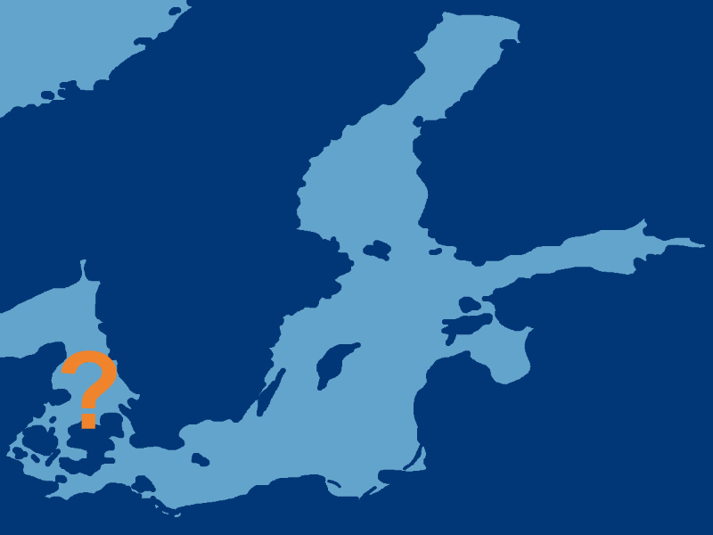
>
> __Verbreitung:__ Irrgast in der westlichen Ostsee.
>
> __Häufigkeit:__ sehr selten
>
> __Gefährdung:__ unklar

## Zwergdorsch

<article class="main-info">

_D-Zwergdorsch;_
_GB-Poor cod;_
_DK-Glyse;_
_PL-Karlik;_
_EST-Väike tursik;_
_RU-Капелан;_
_FIN-Pikkuturska;_
_S-Glyskolja_

### Erkennungsmerkmale

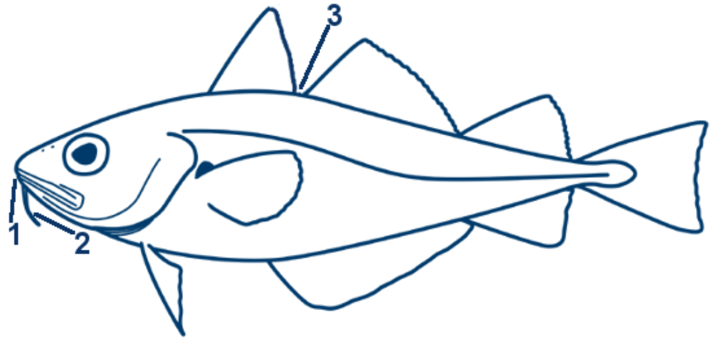

1. Maul leicht unterständig.
2. Lange Kinnbartel vorhanden.
3. Kleiner Zwischenraum zwischen den Basen der ersten und zweiten Rückenflossen.

* 3 Rücken- und 2 Afterflossen.
* Körper mäßig hochrückig (weniger als eineinhalb mal Kopfhöhe).
* Flanken kupferfarben, bräunlich bis gelblich; Bauchseite silbern hell.

Meist 10 bis 20 cm, maximal bis zu 35 cm lang.

### Ähnliche Arten

* [Franzosendorsch](#franzosendorsch) - Körper höher, mehr als 1½-mal Kopfhöhe; Basis der Brustflosse mit markantem schwarzem Fleck; Basen der Afterflossen berühren sich.
* [Stintdorsch](#stintdorsch) - Körper schlanker; nur sehr kleine Kinnbartel; Maul leicht oberständig.
* [Dorsch](#dorsch) - Seitenlinie weiß hervorgehoben; deutlicher Abstand zwischen erster und zweiter Afterflosse.
* [Wittling](#wittling) - Bartel sehr klein oder fehlend.

### Lebensweise

Lebt in kleinen Schwärmen über Weichgrund bis in 300 m Tiefe; meist standorttreu.

### Ernährung

Frisst kleine Wirbellose: vor allem bodenlebende Krebstiere.

### Bedeutung

Wird zu Fischmehl verarbeitet.

</article>

<!-- class="sub-info" -->
> #### Trisopterus minutus
>
> __Familie:__ Gadidae
>
> __Ordnung:__ Gadiformes
>
> 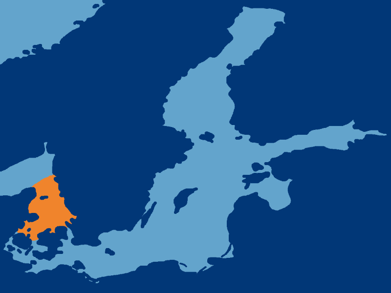
>
> __Verbreitung:__ Kommt im Kattegat vor.
>
> __Häufigkeit:__ selten
>
> __Gefährdung:__ unklar

## Stintdorsch

<article class="main-info">

_D-Stintdorsch;_
_GB-Norway pout;_
_DK-Spærling;_
_PL-Okowiel;_
_EST-Norra tursik;_
_RU-Тресочка Эсмарка;_
_FIN-Harmaaturska;_
_S-Vitlinglyra_

### Erkennungsmerkmale

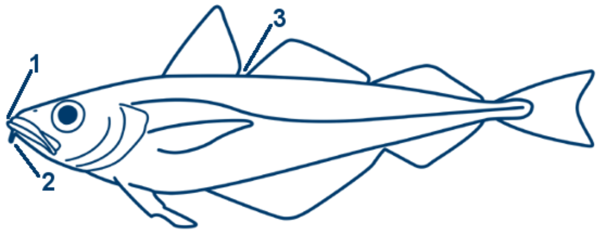

1. Leicht oberständiges Maul.
2. Sehr kleine Kinnbartel.
3. Basen von erster und zweiter Rückenflosse getrennt (mit Zwischenraum).

* 3 Rücken- und 2 Afterflossen.
* Körper schlank.
* Flanken silbern; Rücken dunkelbraun; Bauch heller.

Meist 15 bis 20 cm, maximal bis zu 25 cm lang.

### Ähnliche Arten

* [Zwergdorsch](#zwergdorsch) - Maul leicht unterständig; lange Kinnbartel.
* [Franzosendorsch](#franzosendorsch) - lange Kinnbartel; Basis der Brustflosse mit markantem schwarzem Fleck; Basen der Afterflossen berühren sich; Maul leicht unterständig.
* [Wittling](#wittling) - Maul leicht unterständig.
* [Blauer Wittling](#blauer-wittling) - weiter Abstand zwischen zweiter und dritter Rückenflosse (berühren sich fast beim Stintdorsch); erste Afterflosse etwa 4-mal so lang wie zweite Rückenflosse.

### Lebensweise

Lebt in großen Schwärmen über Weichgrund und im Freiwasser bis in 200 m Tiefe.
Die Fortpflanzung findet im Frühjahr in tieferen Wasserschichten statt.

### Ernährung

Frisst vor allem Planktonkrebschen und gelegentlich kleine Fische.

### Bedeutung

Wird zu Fischmehl verarbeitet.

</article>

<!-- class="sub-info" -->
> #### Trisopterus esmarkii
>
> __Familie:__ Gadidae
>
> __Ordnung:__ Gadiformes
>
> 
>
> __Verbreitung:__ Kommt im Kattegat vor.
>
> __Häufigkeit:__ sehr häufig
>
> __Gefährdung:__ unklar

## Grauer Knurrhahn

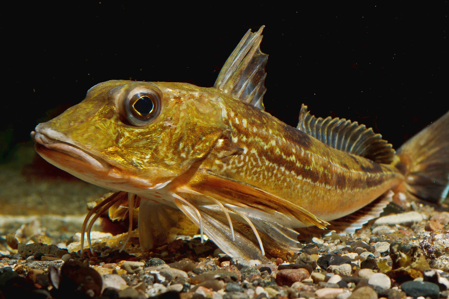
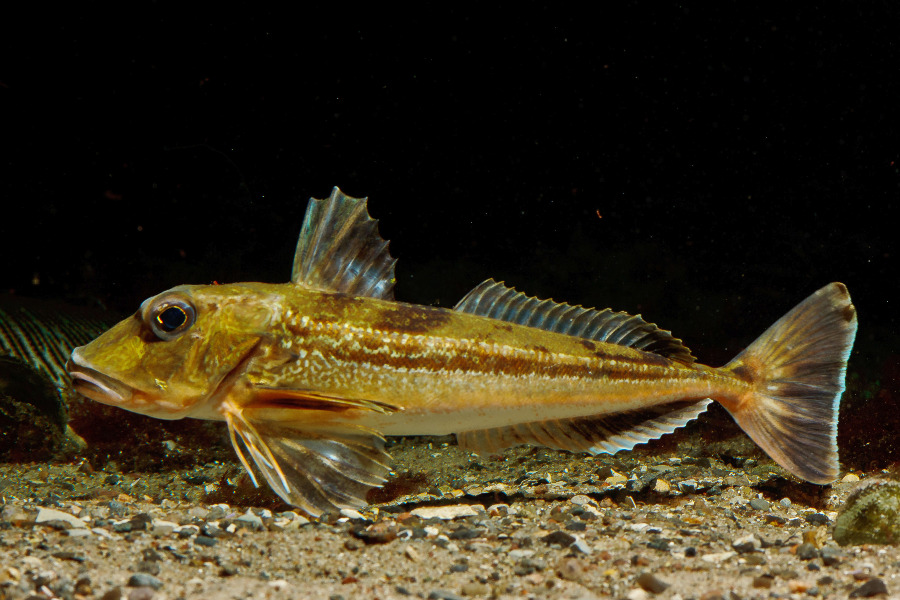
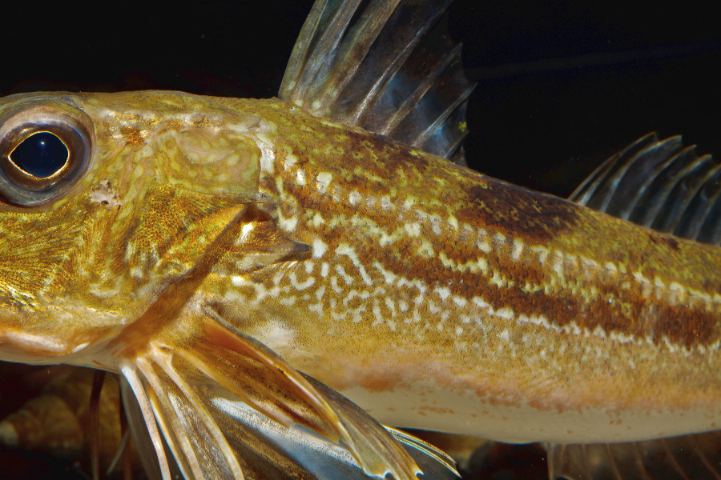
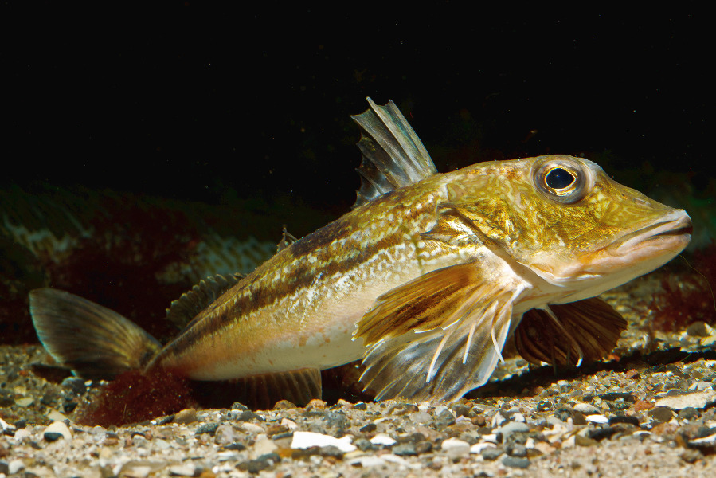

<article class="main-info">

_D-Grauer Knurrhahn;_
_GB-Grey gurnard;_
_DK-Grå knurhane;_
_PL-Kurek szary;_
_EST-Hallmerikukk;_
_RU-Серая тригла;_
_FIN-Kyhmykurnusimppu;_
_S-Knorrhane_

### Erkennungsmerkmale

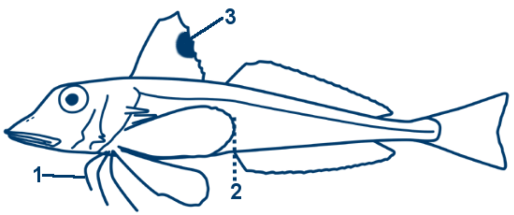

1. Jede Brustflosse besitzt drei frei bewegliche Flossenstrahlen.
2. Brustflossen kurz (höchstens den Ansatz der Afterflosse erreichen).
3. Häufig mit dunklem Fleck auf der ersten Rückenflosse.

* Kopf mit kräftigen Knochenplatten bedeckt.
* Körper von hellbraun bis dunkelbraun; Rücken dunkler, Bauch weißlich.

Meist 30 cm, maximal bis zu 50 cm lang.

### Ähnliche Arten

* [Roter Knurrhahn](#roter-knurrhahn) - größere Brustflossen, reichen bis über den Ansatz der Afterflosse; Brustflossen mit markanten blauen Rändern; Seitenlinie fühlt sich glatt an; Körper rötlich.

### Lebensweise

Kommt meist über Weich- und Mischgrund in Tiefen bis 150 m vor; nachts auch im Freiwasser; während der Sommermonate auch in Küstennähe.
Laicht im Spätsommer.

### Ernährung
Frisst bodenbewohnende Wirbellose und kleine Fische.

### Bedeutung

Speißefisch, der kommerziell befischt wird.

</article>

<!-- class="sub-info" -->
> #### Eutrigla gurnardus
>
> __Familie:__ Triglidae
>
> __Ordnung:__ Scorpaeniformes
>
> 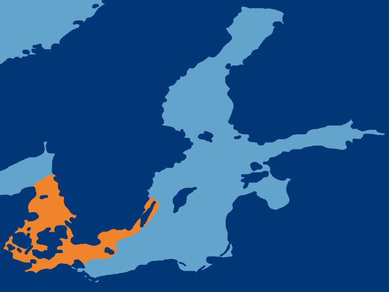
>
> __Verbreitung:__ Kommt in der westlichen Ostsee und im Süden Schwedens vor.
>
> __Häufigkeit:__ regelmäßig
>
> __Gefährdung:__ unklar

## Roter Knurrhahn

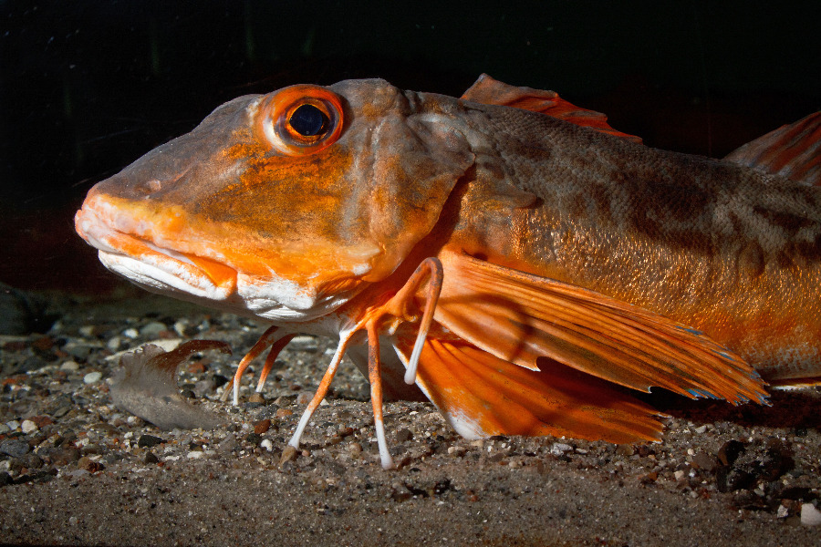
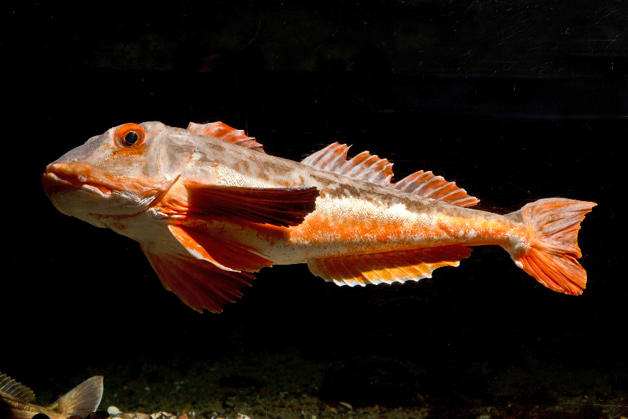

<article class="main-info">

_D-Roter Knurrhahn;_
_GB-Tub gurnard;_
_DK-Rød knùrhane;_
_PL-Kurek czerwony;_
_EST-Ruuge merikukk;_
_RU-Жёлтая тригла;_
_FIN-Isokurnusimppu;_
_S-Fenknot_

### Erkennungsmerkmale

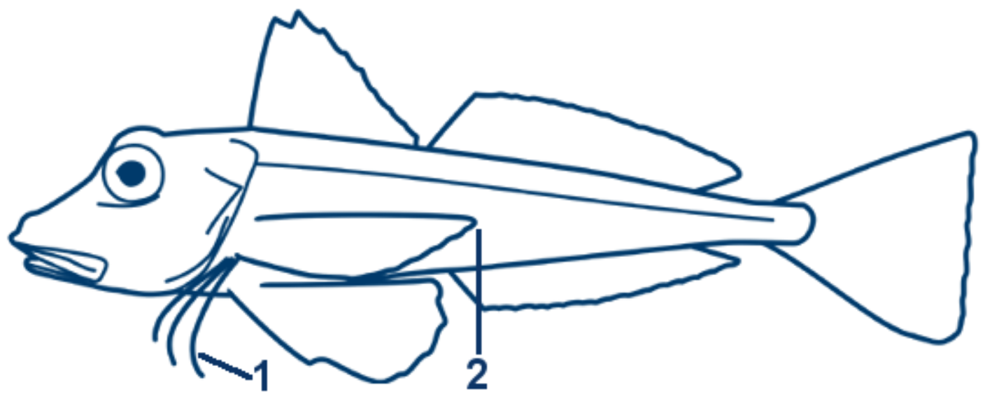

1. Jede Brustflosse mit drei freien beweglichen Flossenstrahlen.
2. Lange Brustflossen (reichen bis hintern den Ansatz der Afterflosse).

* Innenseite der Brustflosse mit auffallend blauer Zeichnung.
* Kopf mit starken Knochenplatten bedeckt.
* Körper rot oder rötlich; Bauch weißlich.

Meist 35 cm, maximal bis zu 75 cm lang.

### Ähnliche Arten

* [Grauer Knurrhahn](#grauer-knurrhahn) - kürzere Brustflossen, die nicht über den Ansatz der Afterflosse reichen; (oft) mit dunklem Fleck auf der ersten Rückenflosse; Seitenlinie fühlt sich rauh an; Körper bräunlich oder gräulich.

### Lebensweise

Kommt vor allem über Weich- und Mischgründen bis in 300 m Tiefe vor.
Gelegentlich in Brackwasser oder sogar Süßwasser vordringend.
Laicht vom Früh- bis Spätsommer.
Wirb bis zu 15 Jahre alt.

### Ernährung

Frisst vor allem kleine Fische wie Sprotten; daneben Fischbrut und Krebstiere.

### Bedeutung

Beliebter Speißefisch.

</article>

<!-- class="sub-info" -->
> #### Chelidonichthys lucerna
>
> __Familie:__ Triglidae
>
> __Ordnung:__ Scorpaeniformes
>
> 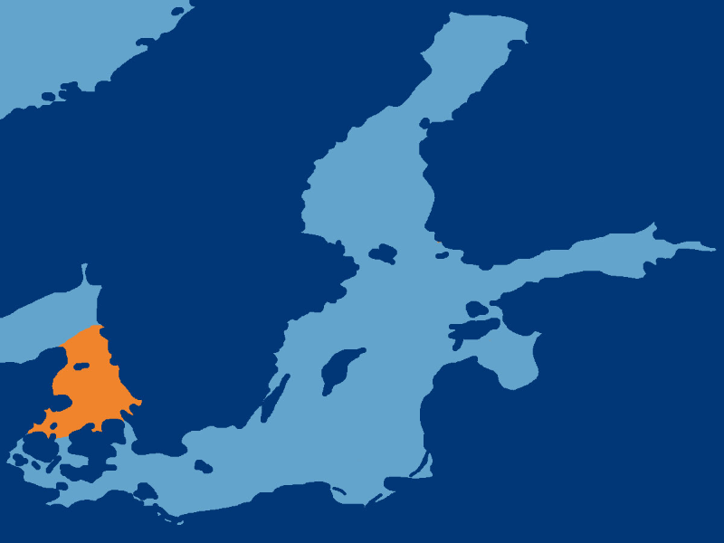
>
> __Verbreitung:__ Kommt im Kattegat vor.
>
> __Häufigkeit:__ regelmäßig
>
> __Gefährdung:__ unklar

## Gemeine Seezunge

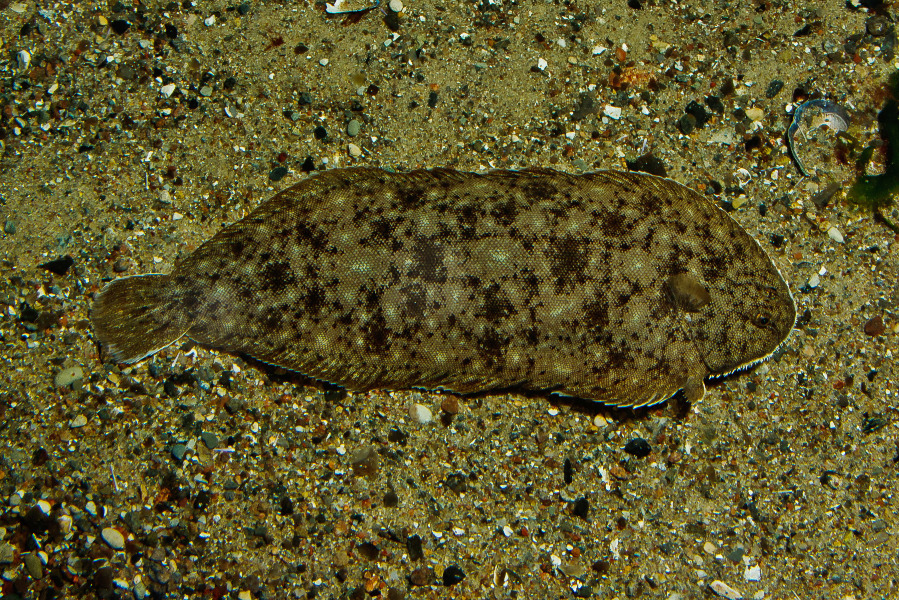
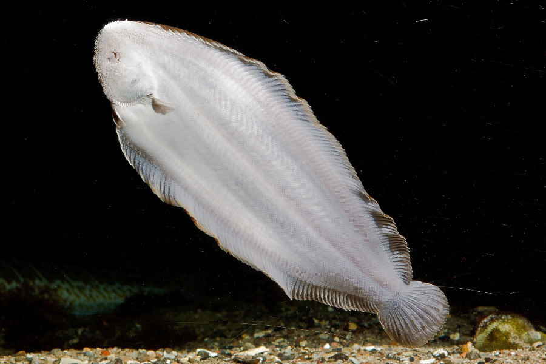
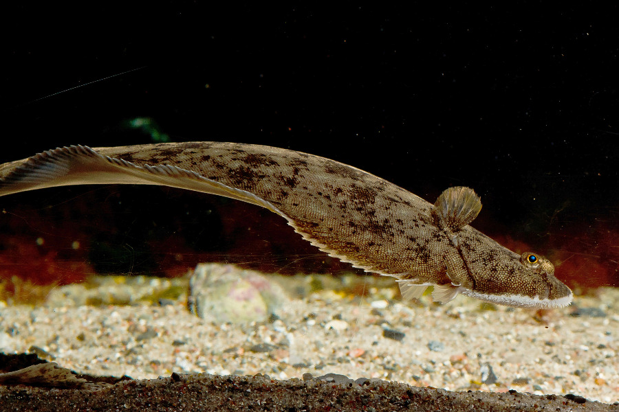
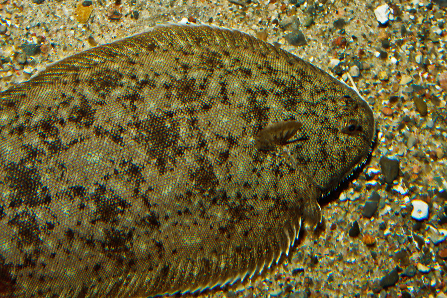
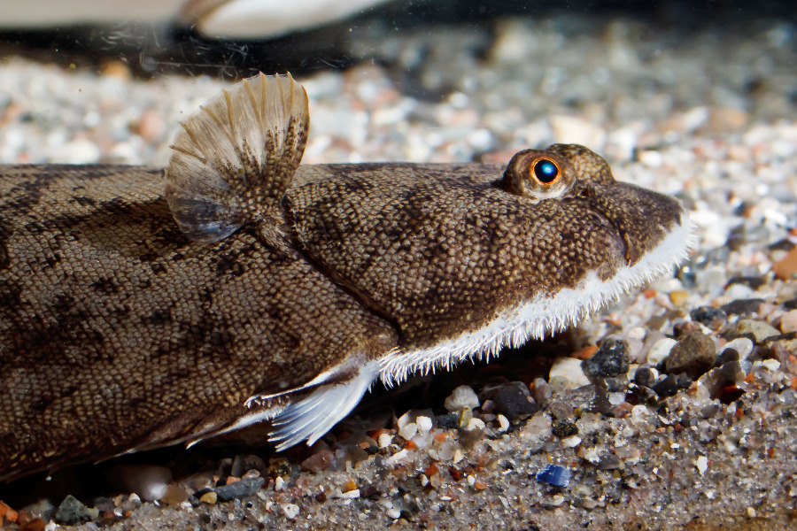

<article class="main-info">

_D-Seezunge;_
_GB-Common sole, Dover sole, black sole;_
_DK-Søtunge;_
_PL-Sola zwyczajna;_
_EST-Søtunge;_
_RU-Европейская солея;_
_FIN-Meriantura;_
_S-Sjötunga_

### Erkennungsmerkmale

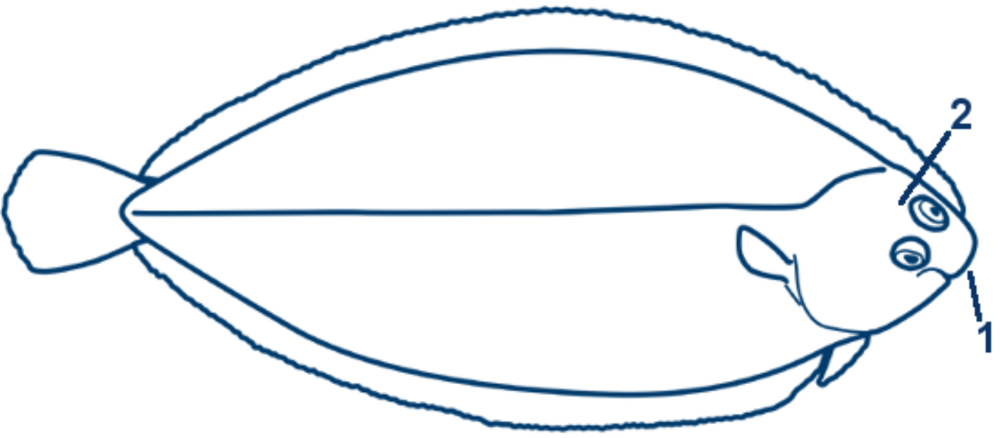

1. Maul unterständig.
2. Beide Augen auf der rechten Körperseite.

* Fransenartige Anhänge am Maul.
* Brustflosse auf der Blindseite normal entwickelt und oft mit einem schwarzen Rand.
* Augenseite dunkelbraun; Blindseite weiß.

Meist 20 bis 35 cm, maximal bis zu 70 cm lang.

### Ähnliche Arten

* [Zwergzunge](#zwergzunge) - stark zurückgebildete Brustflosse auf der Blindseite (nur 1 bis 2 Strahlen); markantes Streifenmuster auf Rücken- und Afterflosse.
* [Hundszunge](#hundszunge) - Maul endständig; Rückenflosse beginnt über dem Auge (bei der gemeinen Seezunge davor).

### Lebensweise

Bodenlebend auf weichem Untergrund bis in 150 m Tiefe.
Laicht im Frühling im Flachwasser (in etwa 40 m Tiefe); 150.000 Eier pro Weibchen.
Jungfische wechseln nach 4 bis 6 Wochen von einer freischwimmenden Lebensweise zum Bodenleben.
Junge Seezungen leben nahe der Küste und wandern auch in die Unterläufe von Flüssen.

### Ernährung

Frisst bodenlebende Krebstiere, Würmer und dünnschalige Muscheln.

### Bedeutung

Hoch, sehr geschätzer Speißefisch.

### Gefährdung

Stark befischt.

</article>

<!-- class="sub-info" -->
> #### Solea solea
>
> __Familie:__ Soleidae
>
> __Ordnung:__ Pleuronectiformes
>
> 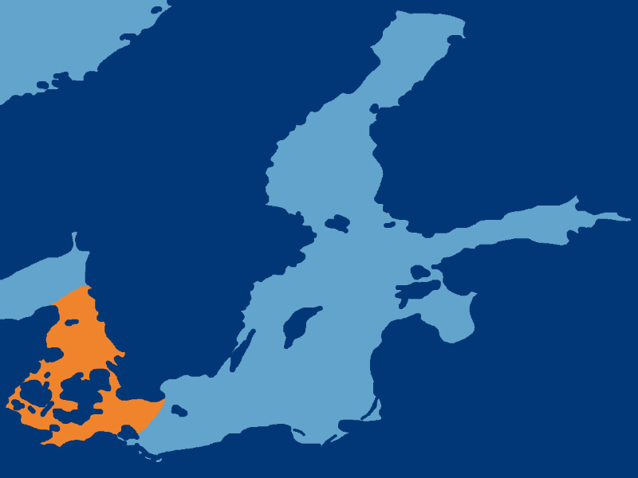
>
> __Verbreitung:__ Kommt nur in der westlichen Ostsee vor.
>
> __Häufigkeit:__ sehr häufig
>
> __Gefährdung:__ unklar

## Zwergzunge

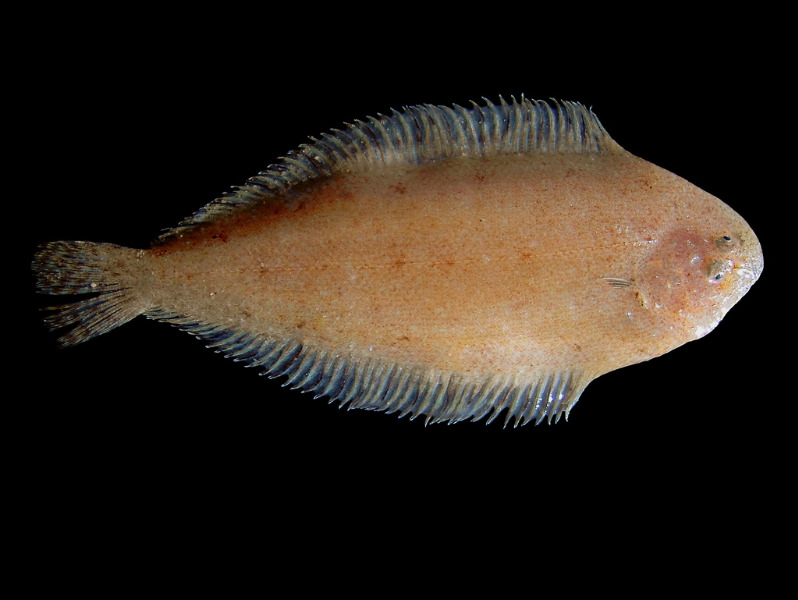
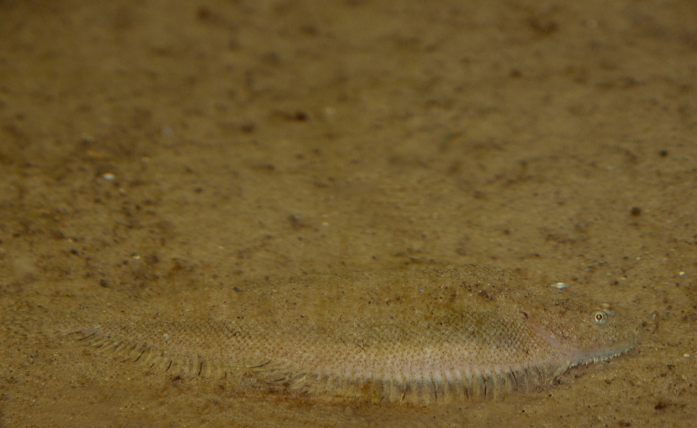

<article class="main-info">

_D-Zwergzunge;_
_GB-Solenette;_
_DK-Glastunge;_
_PL-Soletka;_
_EST-Kääbuskeel;_
_FIN-Anturainen;_
_S-Småtunga_

### Erkennungsmerkmale

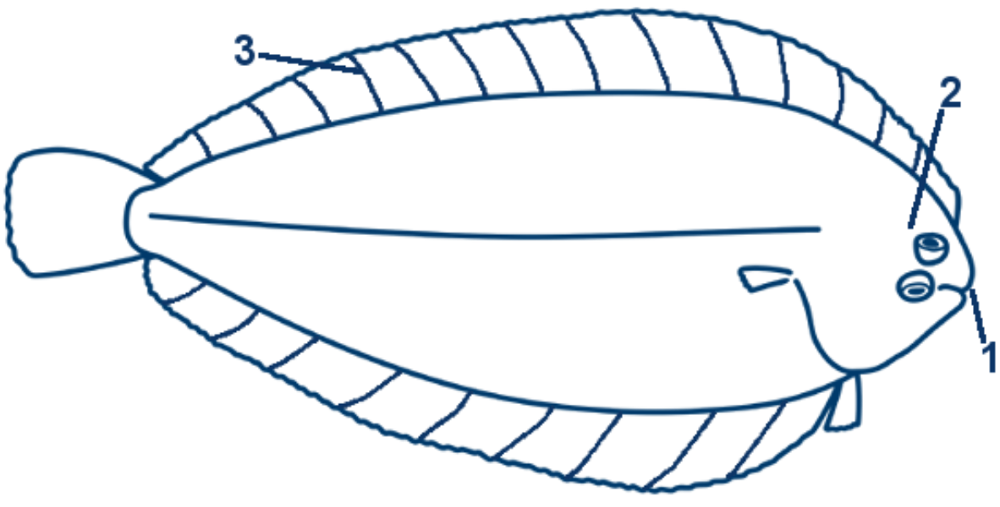

1. Maul unterständig.
2. Beide Augen auf der rechten Körperseite.
3. Rücken- und Afterflosse mit auffälligen schwarzen Streifen: etwa jeder sechste Flossenstrahl ist schwarz.

* Brustflosse auf der Blindseite stark reduziert (nur 1 bis 2 Flossenstrahlen).
* Oberseite sandfarben, gelblich bis bräunlich; Unterseite weiß.

Bis zu 15 cm lang.

### Ähnliche Arten

* [Gemeine Seezunge](#gemeine-seezunge) - Brustflosse auf der Blindseite nicht rückgebildet; ohne Streifenmuster auf Rücken- und Afterflosse.
* [Hundszunge](#hundszunge) - Maul endständig; Rückenflosse beginnt über dem Auge (bei der Zwergzunge davor).

### Lebensweise

Bodenlebend auf Sandgründen bis in 450 m Tiefe.

### Ernährung

Frisst vor allem kleine bodenlebende Krebse, aber auch Würmer und dünnschalige Muscheln.

### Bedeutung

Ohne wirtschaftliche Bedeutung.

</article>

<!-- class="sub-info" -->
> #### Buglossidium luteum
>
> __Familie:__ Soleidae
>
> __Ordnung:__ Pleuronectiformes
>
> 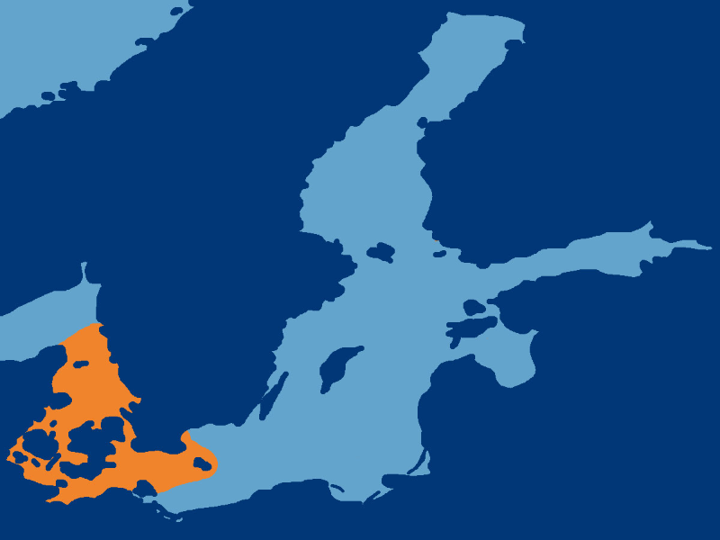
>
> __Verbreitung:__ westliche Ostsee
>
> __Häufigkeit:__ häufig
>
> __Gefährdung:__ nicht gefährdet

## Hundszunge

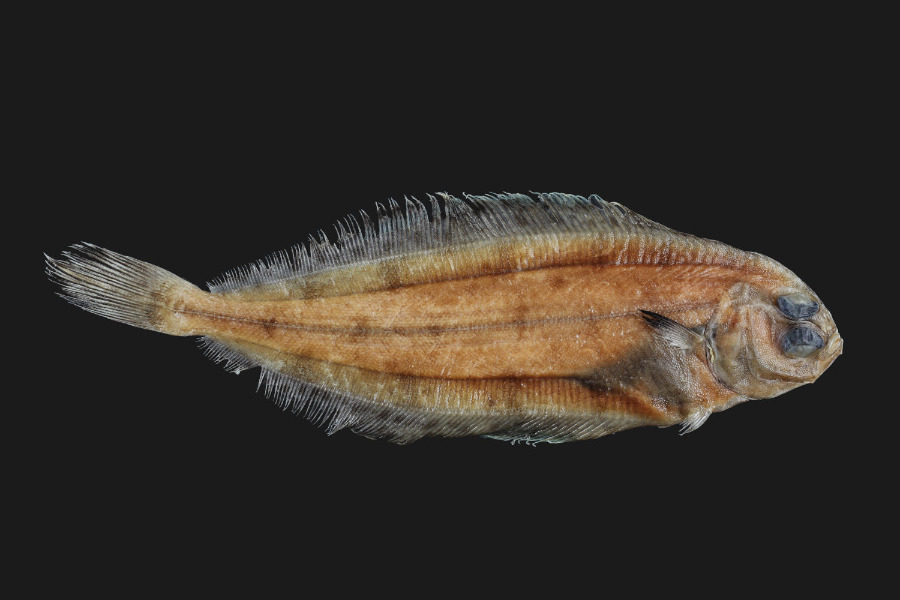
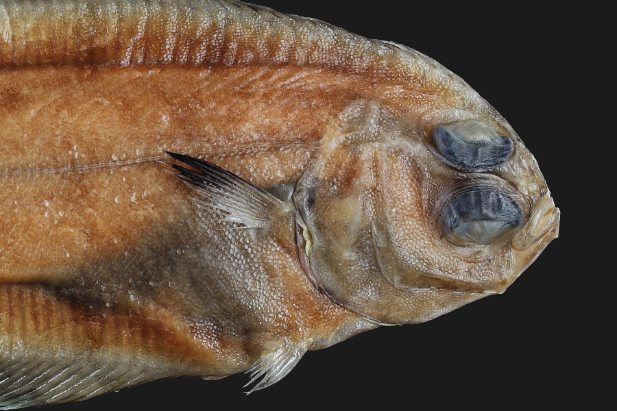

<article class="main-info">

_D-Hundszunge, Zungenbutt;_
_GB-Witch flounder;_
_DK-Skærising;_
_PL-Szkarlacica;_
_EST-Harilik pikklest;_
_RU-Камбала длинная ;_
_FIN-Mustaeväkampela;_
_S-Rödtunga_

### Erkennungsmerkmale

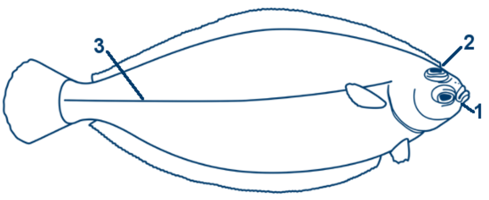

1. Maul klein (kürzer als Augendurchmesser).
2. Rückenflosse beginnt über den Augen.
3. Seitenlinie gerade.

* Körper abgeplattet, beide Augen auf der rechten Körperseite.
* Große Schleimporen auf der Blindseite des Kopfes.
* Oberseite bräunlich oder gräulich, gelgentlich mit dunklen Flecken.

Meist kleiner als 40 cm, maximal bis zu 60 cm lang.

### Ähnliche Arten

* [Lammzunge](#lammzunge) - beide Augen auf der linken Körperseite; Maul größer.
* [Doggerscharbe](#doggerscharbe) - Maul viel größer; Oberfläche rauh (bei der Hundszunge sehr glatt).
* [Rotzunge](#rotzunge) - Seitenlinie leicht gebogen; keine Schleimgefüllten Kanäle auf der Blindseite des Kopfes.
* [Gemeine Seezunge](#gemeine-seezunge) - Maul unterständig; Rückenflosse beginnt vor dem Auge.
* [Zwergzunge](#zwergzunge) - Maul unterständig; Rückenflosse beginnt vor dem Auge.

### Lebensweise

Lebt auf schlammigem Meeresgrund unterhalb 50 m Tiefe.
Wird bis 25 Jahre alt, laicht zwischen März und September.

### Ernährung

Kleine Bodentiere wie Schlangensterne, Würmer und Krebstiere als auch kleine Fische.

### Bedeutung

Speißefisch.

</article>

<!-- class="sub-info" -->
> #### Glyptocephalus cynoglossus
>
> __Familie:__ Pleuronectidae
>
> __Ordnung:__ Pleuronectiformes
>
> 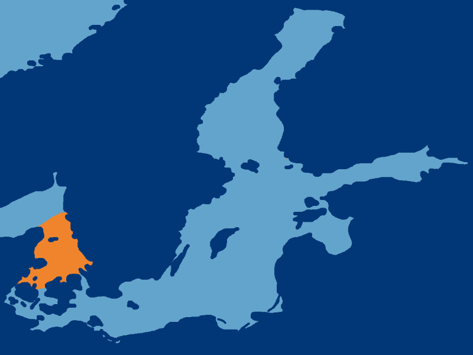
>
> __Verbreitung:__ Kattegat
>
> __Häufigkeit:__ selten
>
> __Gefährdung:__ nicht gefährdet

## Kliesche

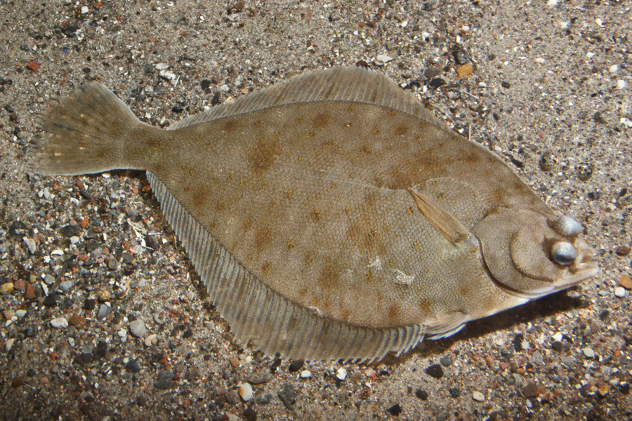
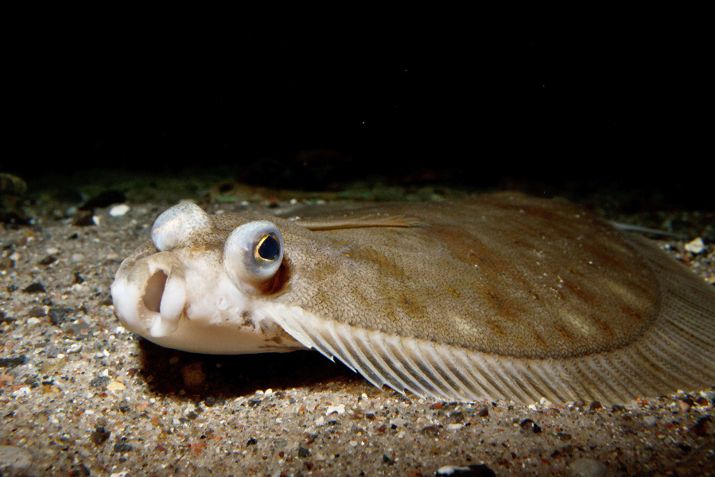
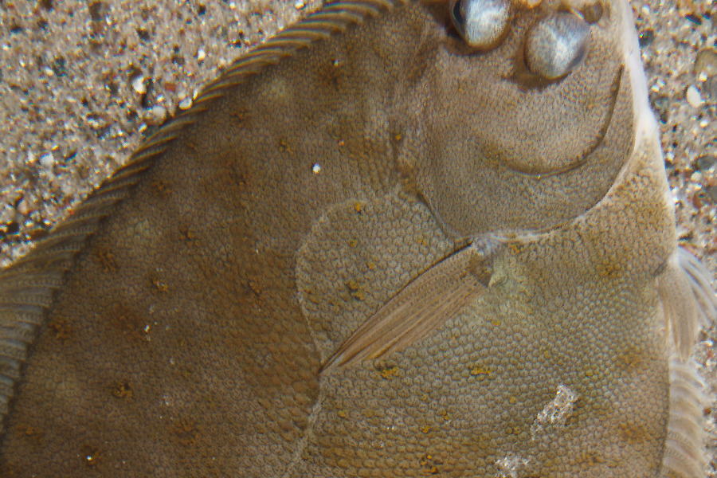
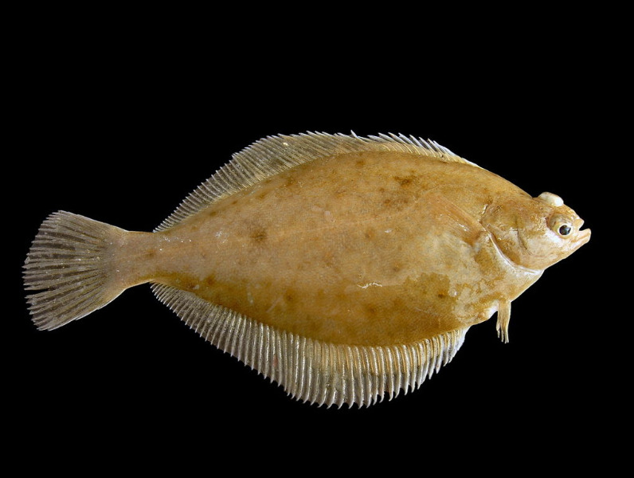

<article class="main-info">

_D-Kliesche;_
_GB-Common dab;_
_DK-Ising;_
_PL-Zimnica;_
_LT-Gelsvapelekė plekšnė;_
_LV-Gludā limanda;_
_EST-Soomuslest;_
_RU-Ершоватка;_
_FIN-Hietakampela;_
_S-Sandskädda_

### Erkennungsmerkmale

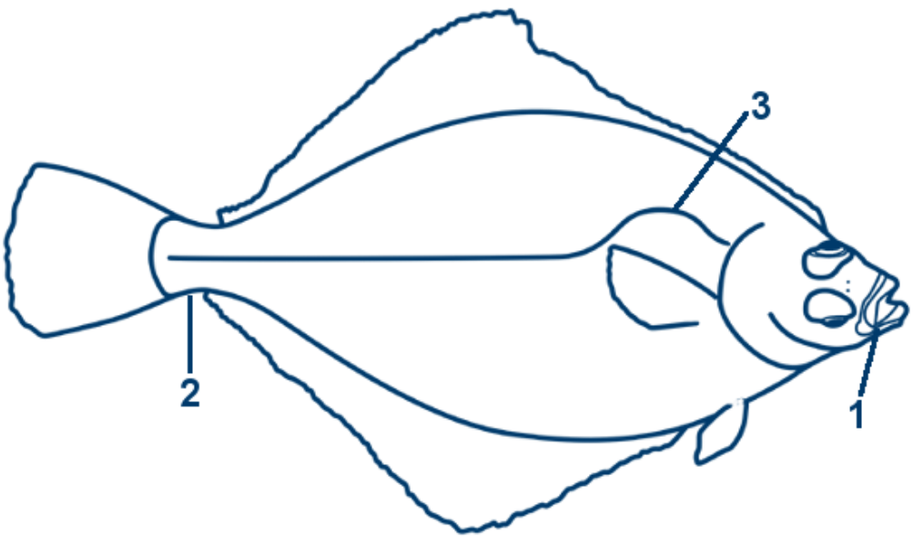

1. Maul klein (etwa so lang wie der Augendurchmesser).
2. Langer Schwanzstiel.
3. Seitenlinie mit auffälligem Bogen über der Brustflosse.

* Beide Augen auf der rechten Körperseite.
* Oberseite hell oder dunkelbraun, häufig mit unregelmäßigen dunklen und orange-roten Punkten und Flecken; Unterseite weiß.

Meist unter 30 cm, maximal bis zu 40 cm lang.

### Ähnliche Arten

* [Flunder](#flunder) - Knochenhöcker entlang der Basen von Rücken- und Afterflosse; Seitenlinie nur wenig gebogen.
* [Scholle](#scholle) - Knochenhöcker hinter den Augen; Seitenlinie nur wenig gebogen.
* [Rotzunge](#rotzunge) - kurzer Schwanzstiel; Seitenlinie nur wenig gebogen.
* [Doggerscharbe](#doggerscharbe) - Maul größer; Seitenlinie nur wenig gebogen.

### Lebensweise

Lebt auf Sandböden von 5 bis in 200 m Tiefe.
Laicht in der Ostsee während der Sommermonate.

### Ernährung
Frisst kleine Fische und bodenlebende Oragnismen wie Krebstiere und Schlangensterne.

### Bedeutung

Wirtschaftlich Bedeutend; wird häufig zu Filets verarbeitet.

</article>

<!-- class="sub-info" -->
> #### Limanda limanda
>
> __Familie:__ Pleuronectidae
>
> __Ordnung:__ Pleuronectiformes
>
> 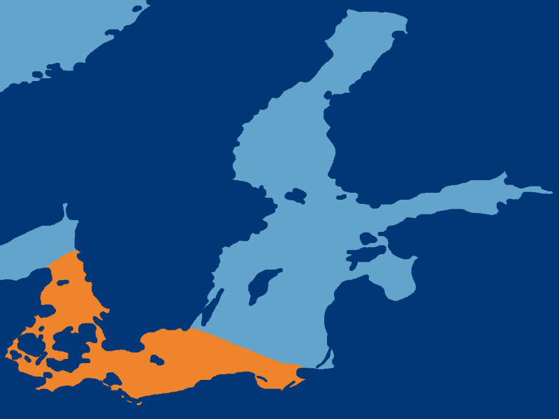
>
> __Verbreitung:__ westliche und südliche Ostsee
>
> __Häufigkeit:__ häufig
>
> __Gefährdung:__ unklar

## Flunder

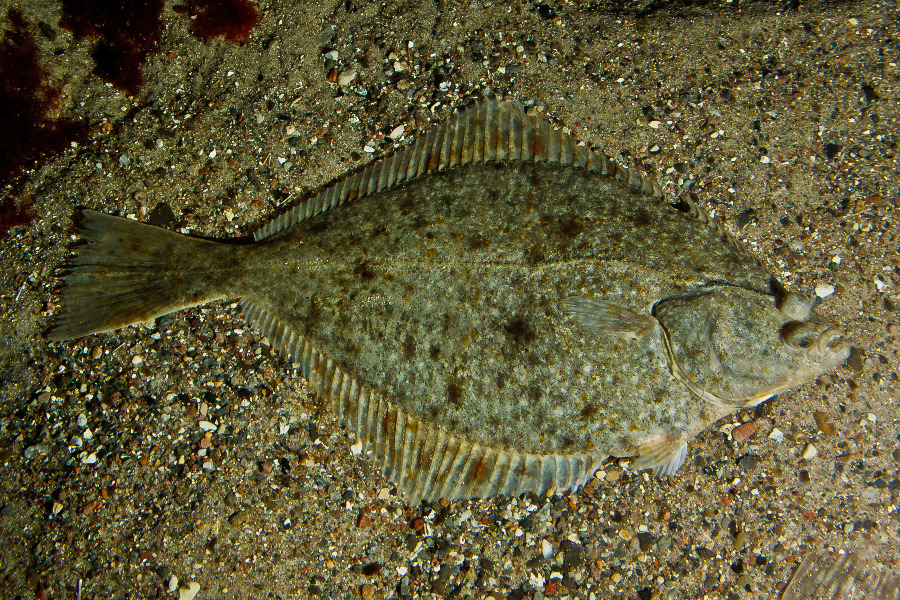
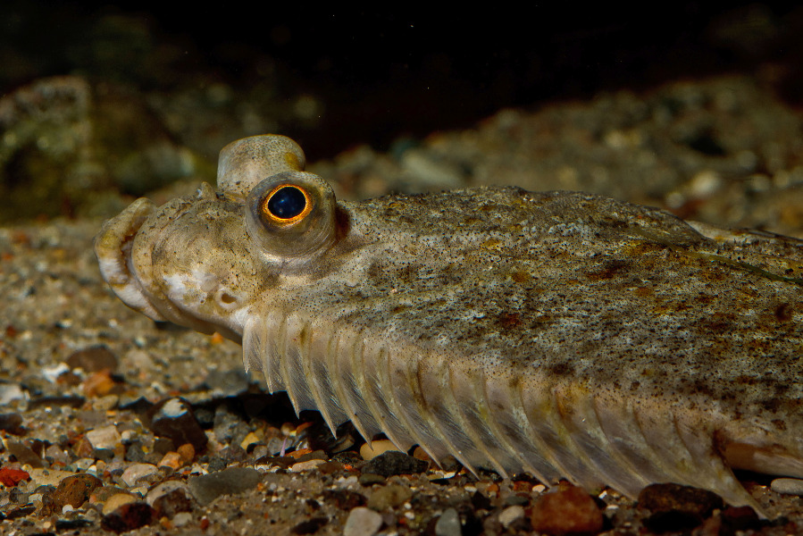
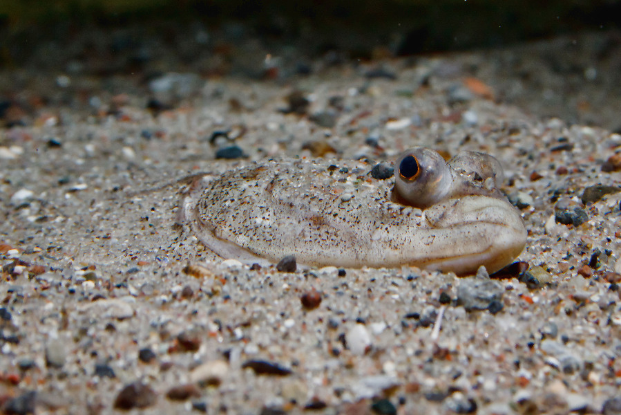
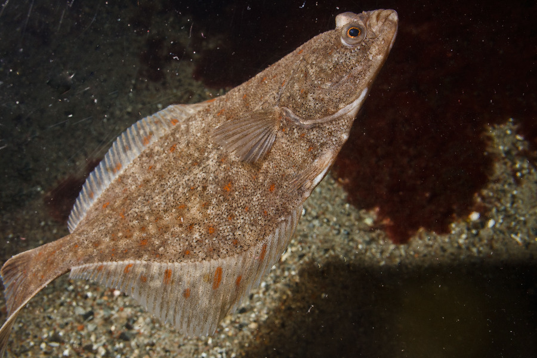
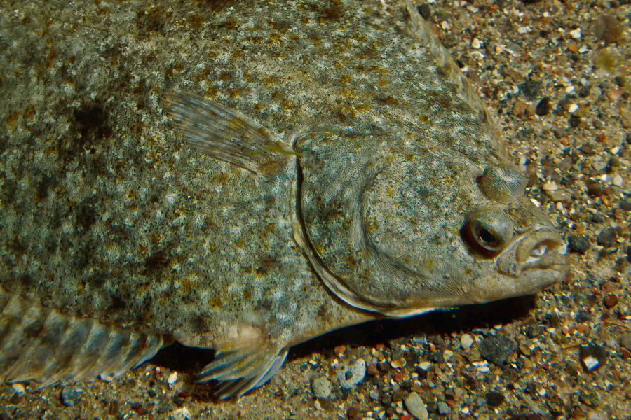

<article class="main-info">

_D-Flunder;_
_GB-Flounder;_
_DK-Skrubbe;_
_PL-Stornia, flądra;_
_LT-Upinė plekšnė;_
_LV-Plekste;_
_EST-Lest;_
_RU-Речная камбала;_
_FIN-Kampela;_
_S-Skrubbskädda_

### Erkennungsmerkmale

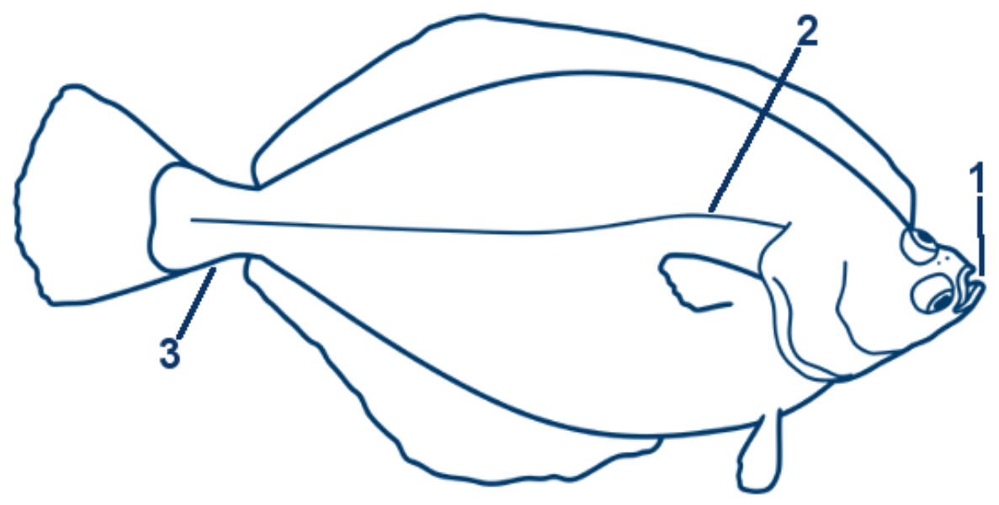

1. Maul klein (etwa so lang wie der Augendurchmesser).
2. Seitenlinie gerade und mit knöchernen Höchern.
3. Langer Schwanzsstiel.

* Knöcherne Höcker entlang der Basen von Rücken- und Afterflosse.
* Bei 70% der Tiere sind beide Augen auf der rechten Körperseite, bei den restlichen 30% auf der linken.
* Oberseite hellbraun oder gräulich bis dunkel grünlich; oft mit roten Flecken (die an die Scholle erinnern); Unterseite weiß.

Meist bis 30 cm, maximal bis zu 50 cm lang.

### Ähnliche Arten

* [Scholle](#scholle) - Knochenhöcker hinter den Augen ziehen nicht bis auf den Körper; ohne Knochenhöcker an den Basen von Rücken- und Afterflosse; fühlt sich glatt an (die Flunder fühlt sich rauh an).
* [Kliesche](#kliesche) - Seitenlinie über der Brustflosse stark gebogen; ohne Knochenhöcker an den Basen von Rücken- und Afterflosse.
* [Rotzunge](#rotzunge) - kurzer Schwanzstiel; ohne Knochenhöcker an den Basen von Rücken- und Afterflosse.
* [Doggerscharbe](#doggerscharbe) - Maul größer; ohne Knochenhöcker an den Basen von Rücken- und Afterflosse.

### Lebensweise

Lebt bevorzugt auf Weichgründen bis in 100 m Tiefe; Jungtiere wandern auch flussaufwärts.
Nachtaktiv, tags meist im Sand vergraben.
Laicht in der Ostsee meist im Bornholmbecken.

### Ernährung

Frisst vor allem bodenlebende Wirbellose wie Krebse und Muscheln; daneben auch kleine Fische wie Grundeln.

### Bedeutung

Meist mit Kiemennetzen befischt.

</article>

<!-- class="sub-info" -->
> #### Platichthys flesus
>
> __Familie:__ Pleuronectidae
>
> __Ordnung:__ Pleuronectiformes
>
> 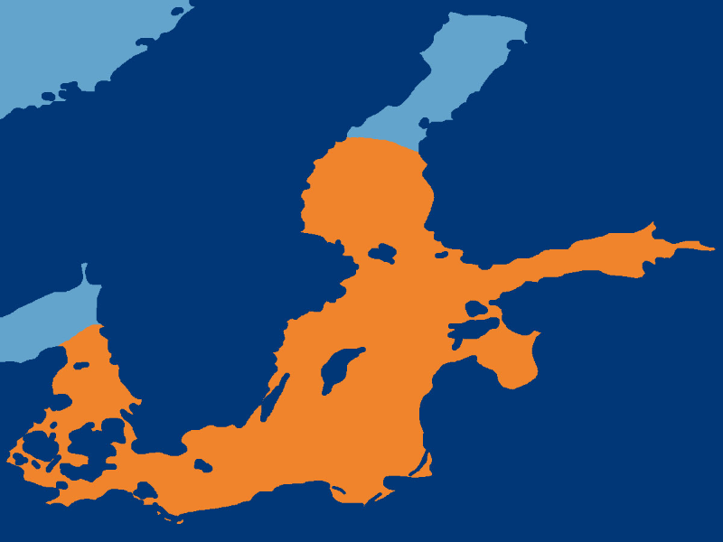
>
> __Verbreitung:__ Kommt in der gesamten Ostsee vor, mit Ausnahme des nördlichsten Teils des bottnischen Meerbusens.
>
> __Häufigkeit:__ sehr häufig
>
> __Gefährdung:__ unklar

## Rotzunge

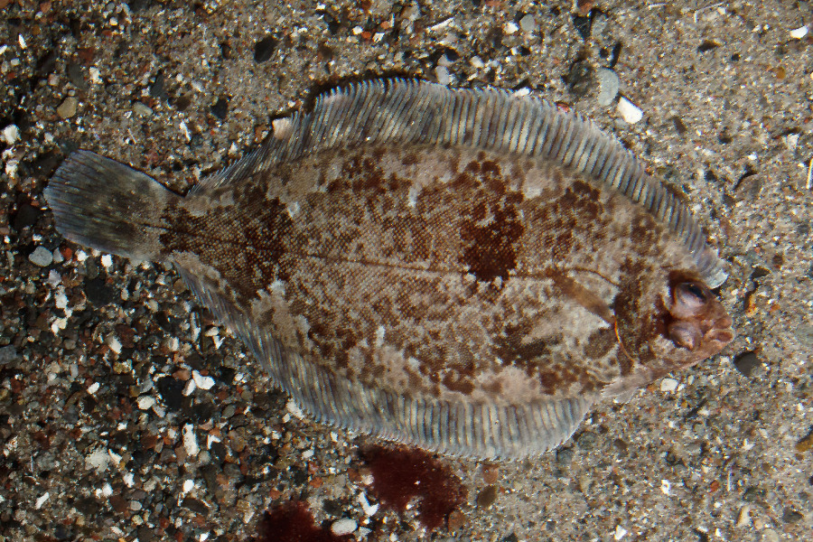
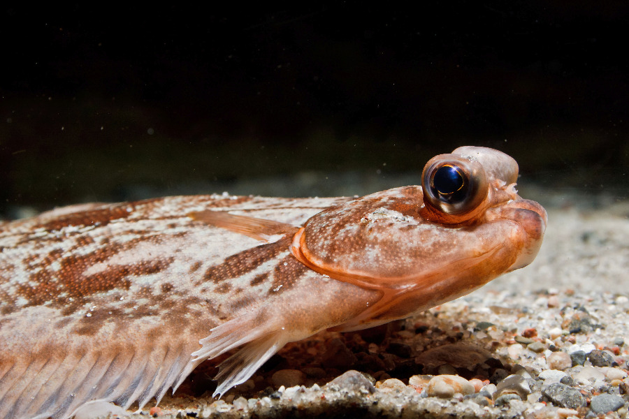

<article class="main-info">

_D-Rotzunge;_
_GB-Lemon sole;_
_DK-Rødtunge;_
_PL-Złocica;_
_EST-Harilik väikesuulest;_
_RU-Камбала малоротая;_
_FIN-Pikkupääkampela;_
_S-Bergtunga_

### Erkennungsmerkmale

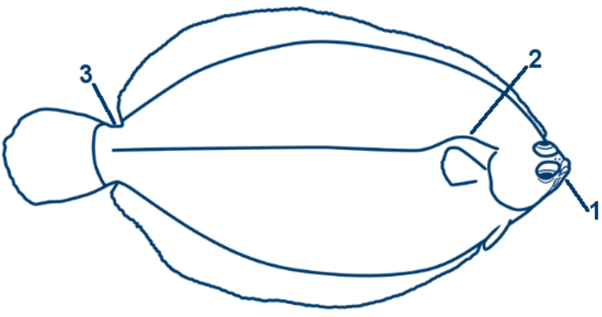

1. Maul sehr klein (kleiner als Augendurchmesser).
2. Seitenlinie leicht gebogen über der Brustflosse.
3. Kurzer Schwanzstiel.

* Beide Augen auf der rechten Körperseite.
* Oberfläche rötlich-bräunlich marmoriert mit dunklen Flecken; Unterseite weiß.

Meist 30 bis 40 cm, maximal bis zu 60 cm lang und 2 kg schwer.

### Ähnliche Arten

* [Hundszunge](#hundszunge) - Seitenlinie fast gerade; schleimgefüllte Kanäle auf der Kopfunterseite.
* [Lammzunge](#lammzunge) - Augen auf der linken Körperseite; Maul größer.
* [Doggerscharbe](#doggerscharbe) - Maul viel größer.
* [Scholle](#scholle) - langer Schwanzstiel; Knochenhöcker hinter den Augen.
* [Flunder](#flunder) - langer Schwanzstiel; Knochenhöcker an den Basen von Rücken- und Afterflosse.
* [Kliesche](#kliesche) - langer Schwanzstiel; Seitenlinie über der Brustflosse stark gebogen.

### Lebensweise

Auf Hartgründen (Fels, Stein, Muschelbetten, etc.) bis in 100 m selten bis 200 m Tiefe lebend.

### Ernährung

Frisst bodenlebende Wirbellose, vor allem Würmer.

### Bedeutung

Beliebter Speißefisch.

</article>

<!-- class="sub-info" -->
> #### Microstomus kitt
>
> __Familie:__ Pleuronectidae
>
> __Ordnung:__ Pleuronectiformes
>
> 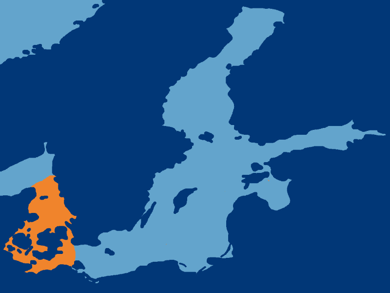
>
> __Verbreitung:__ Verbreitung: Kommt in der westlichen Ostsee vor.
>
> __Häufigkeit:__ selten
>
> __Gefährdung:__ nicht gefährdet

## Scholle

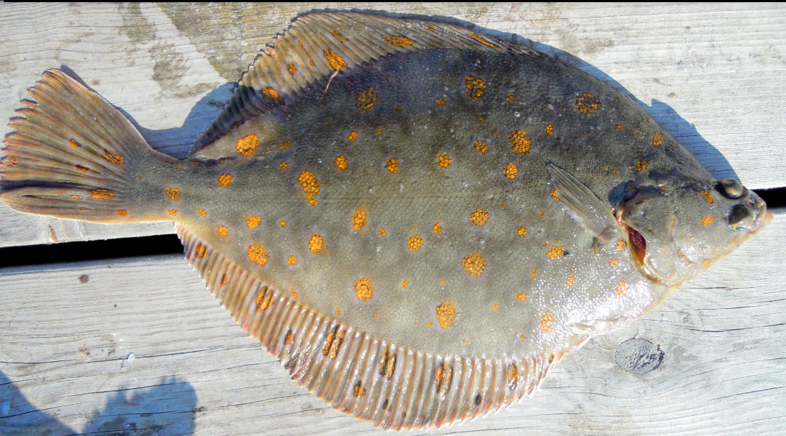
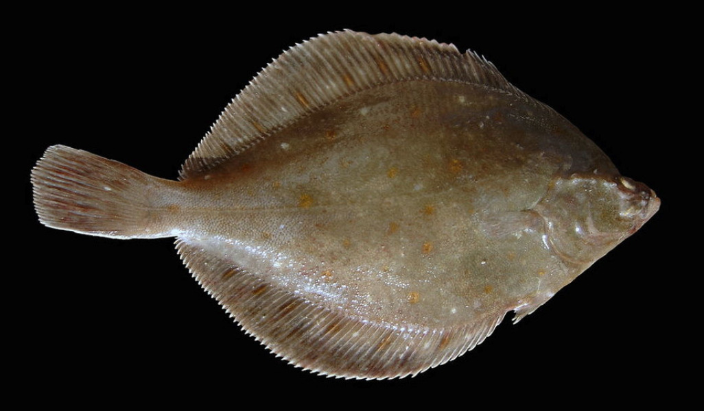
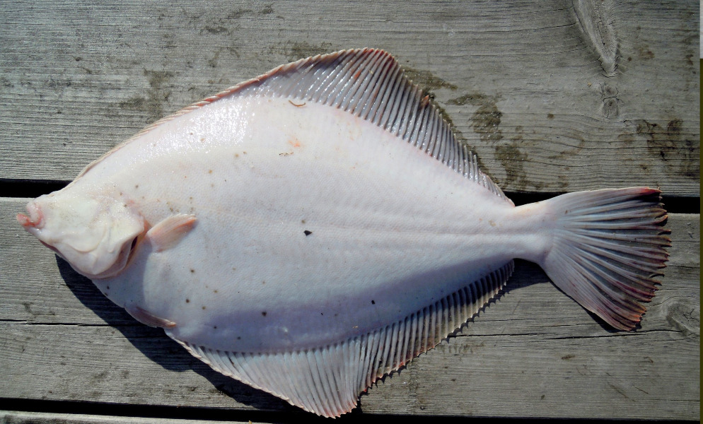
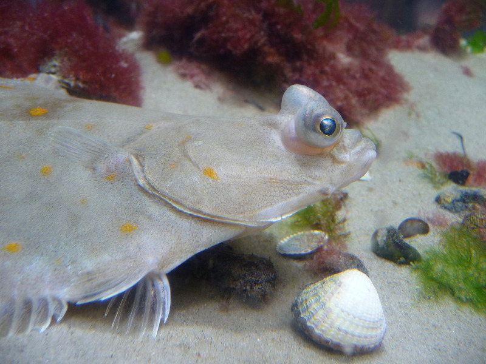

<article class="main-info">

### Erkennungsmerkmale

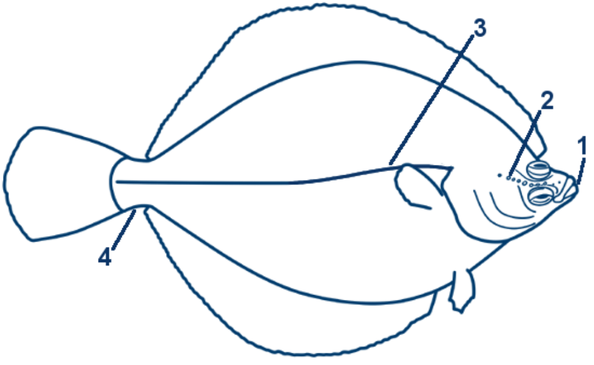

1. Maul klein (etwa so lang wie der Augendurchmesser).
2. 4 bis 7 knöcherne Auswüchse in einer Reihe vom Augenzwischenraum zur Seitenlinie.
3. Seitenlinie gerade, ohne knöcherne Auswüchse.
4. Langer Schwanzstiel.

* Beide Augen auf der rechten Körperseite.
* Oberseite bräunlich bis gräulich mit auffälligen orangenen Flecken; Unterseite weiß.

Meist 30 bis 40 cm, maximal bis zu 60 cm lang.

### Ähnliche Arten

* [Flunder](#flunder) - Knochenhöcker an den Basen der Rücken- und Afterflosse und entlang der Seitenlinie; fühlt sich rau an (die Scholle fühlt sich glatt an).
* [Kliesche](#kliesche) - Seitenlinie über der Brustflosse stark nach oben gebogen; keine könchernen Höcker hinter den Augen.
* [Rotzunge](#rotzunge) - kurzer Schwanzstiel; keine knöchernen Höcker hinter den Augen.
* [Doggerscharbe](#doggerscharbe) - Maul größer; keine könchernen Höcker hinter den Augen.

### Lebensweise

Bodenlebend auf sandigen und gemischten Untergründen bis in 100 m selten auch bis in 200 m Tiefe.
Wechsel von der freischwimmenden Larve zum Bodenleben erfolgt im Alter von 1 bis 2 Monaten.
Wird bis zu 50 Jahre alt.

### Ernährung

Frisst vor allem Muscheln, Schnecken und Würmer; größere Tiere fressen auch kleinere Fische.

### Bedeutung

Wirtschaftlich bedeutendster Plattfisch in Europa; beliebter Speißefisch; auch in Aquakultur gezüchtet.

</article>

<!-- class="sub-info" -->
> #### Pleuronectes platessa
>
> __Familie:__ Pleuronectidae
>
> __Ordnung:__ Pleuronectiformes
>
> 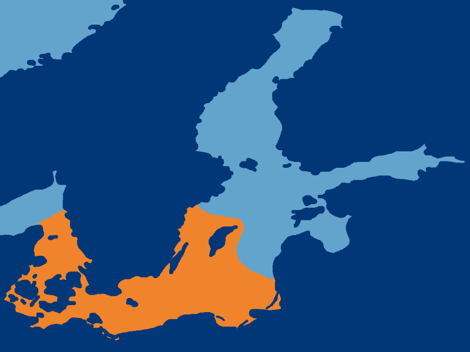
>
> __Verbreitung:__ westliche und zentrale Ostsee
>
> __Häufigkeit:__ sehr häufig
>
> __Gefährdung:__ nicht gefährdet

## Steinbutt

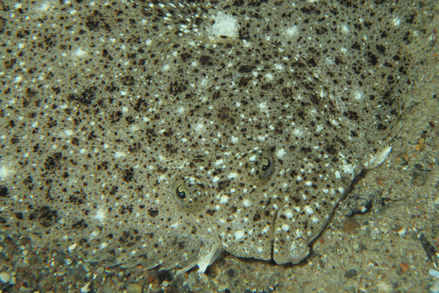
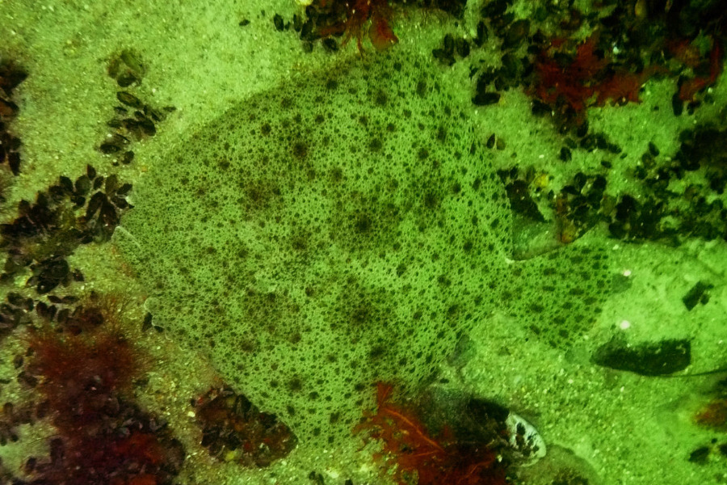

<article class="main-info">

_D-Steinbutt;_
_GB-Turbot;_
_DK-Pighvar;_
_PL-Skarp;_
_LT-Paprastasis otas;_
_LV-Akmeņplekste;_
_EST-Harilik kammeljas;_
_RU-Тюрбо;_
_FIN-Piikkikampela;_
_S-Piggvar_

### Erkennungsmerkmale

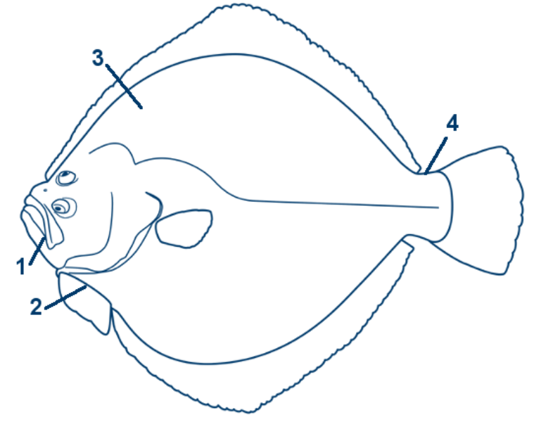

1. Maul groß (ein Vielfaches des Augendurchmessers).
2. Bauchflossen mit langer Basis.
3. Kräftige knöcherne Auswüchse auf der gesamten Oberseite.
4. Ausgeprägter Schwanzstiel.

* Beide Augen auf der linken Körperseite.
* Färbung sehr variabel: Oberseite hell bis dunkelbraun, gräulich oder sandfarben, mit dunklen bis grünen Flecken; Unterseite weißlich.

Meist unter 50 cm, maximal bis zu 100 cm lang und 25 kg schwer.

### Ähnliche Arten

* [Glattbutt](#glattbutt) - ohne knöcherne Höcker auf der Körperoberseite; am Beginn der Rückenflosse einige freie Flossenstrahlen; Körper weniger dick und länglicher.
* [Haarbutt](#haarbutt) - ohne knöcherne Höcker auf der Körperoberseite; Bauch- und Afterflossen verwachsen; Rücken- und Afterflosse mit Schwanzflosse verbunden.

### Lebensweise

Bodenlebend auf Sand- und Steingründen bis in 70 m Tiefe.

### Ernährung

Frisst bodenlebende Fische, Muscheln und Krebse.

### Bedeutung

Wirtschaftlich wichtig, aber nicht in großen Mengen; erzielt hohe Preise.

</article>

<!-- class="sub-info" -->
> #### Scophthalmus maximus
>
> __Familie:__ Scophthalmidae
>
> __Ordnung:__ Pleuronectiformes
>
> 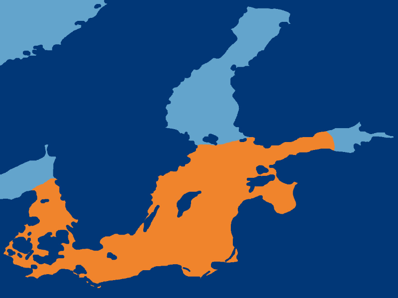
>
> __Verbreitung:__ küstennah in der gesamten Ostsee, mit Ausnahme des bottnischen Meerbusens
>
> __Häufigkeit:__ häufig
>
> __Gefährdung:__ nicht gefährdet

## Glattbutt

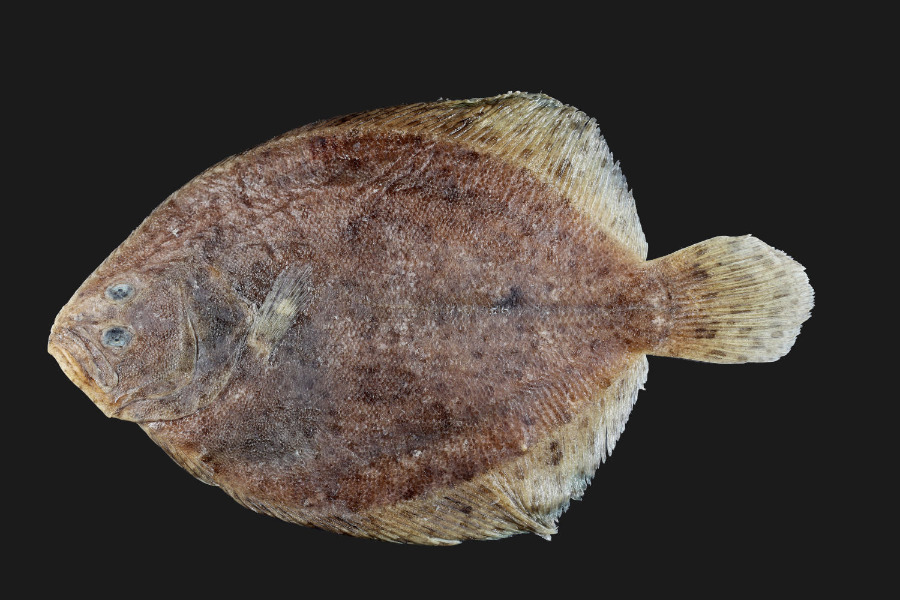
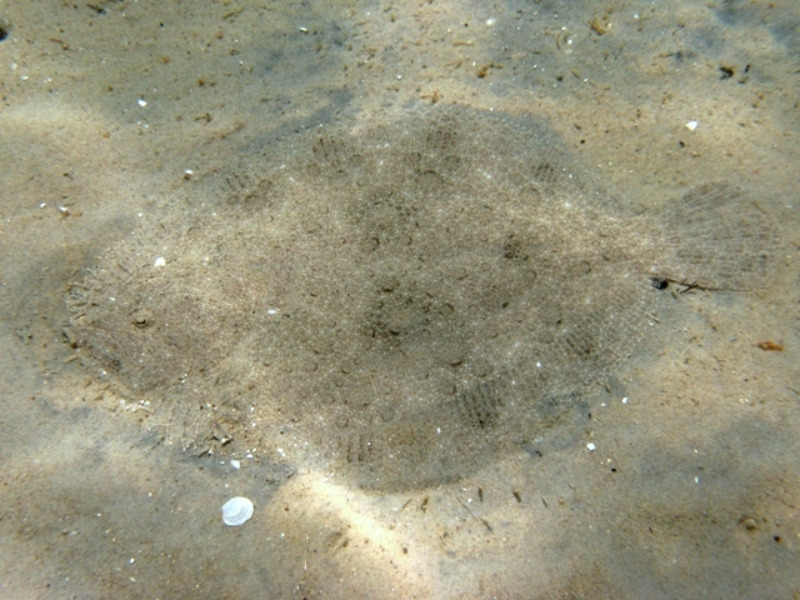
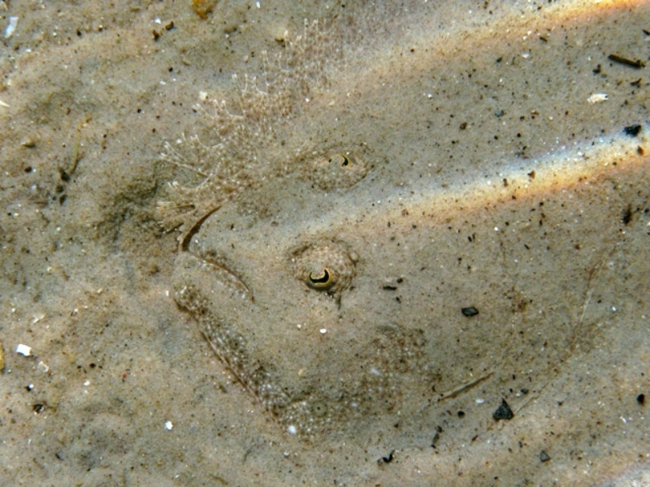
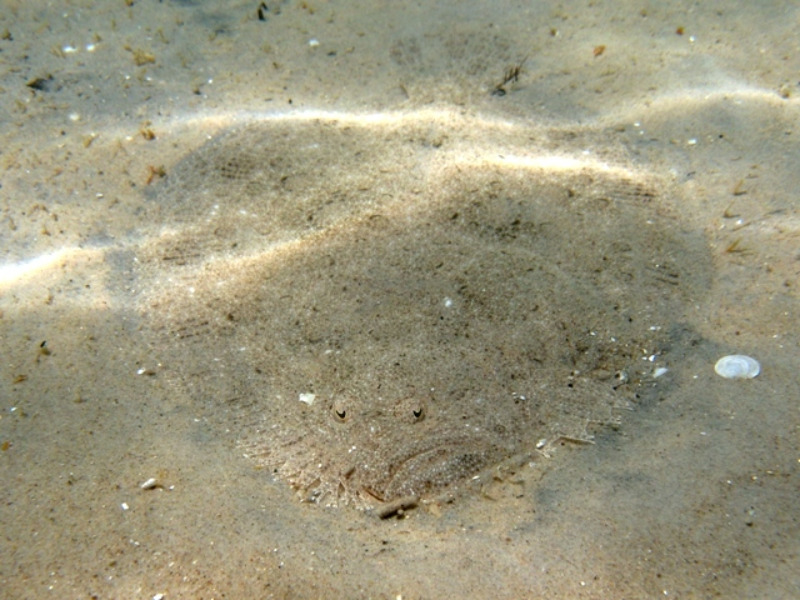
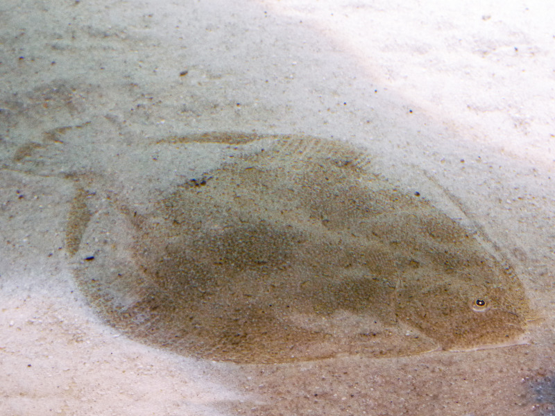

<article class="main-info">

_D-Glattbutt;_
_GB-Brill;_
_DK-Slethvar;_
_PL-Nagład;_
_EST-Sile kammeljas;_
_RU-Гладкий ромб;_
_FIN-Silokampela;_
_S-Slätvar_

### Erkennungsmerkmale

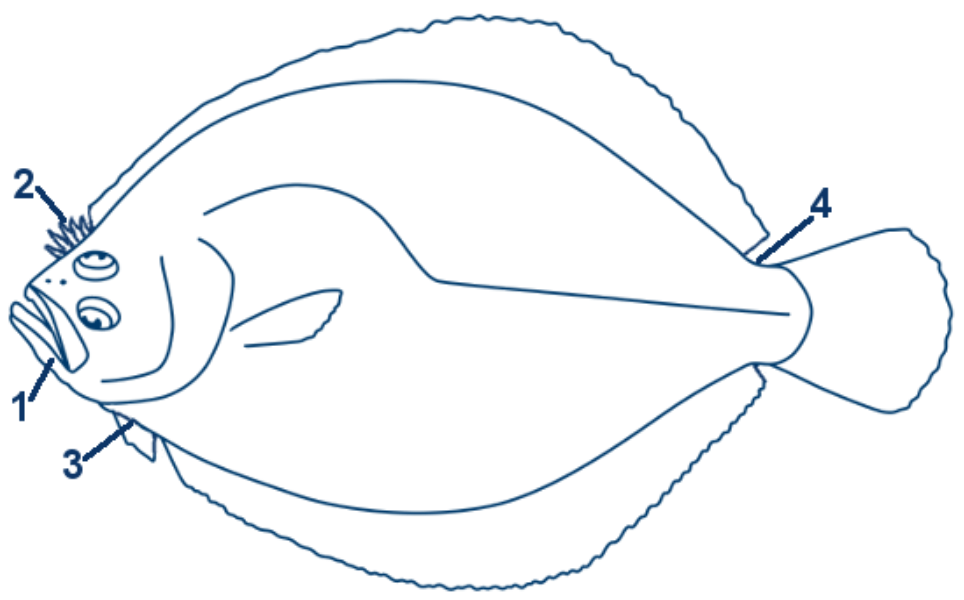

1. Maul groß (ein Vielfaches des Augendurchmessers).
2. Erste Strahlen der Rückenflosse freistehend.
3. Bauchflossen mit langer Basis.
4. Ausgeprägter Schwanzstiel.

* Beide Augen auf der linken Körperseite.
* Körperoberfläche mit kleinen Schuppen bedeckt (fühlt sich glatt an).
* Färbung sehr variabel: Oberseite dunkel, bräunlich oder grünlich, mit hellen und dunklen Flecken; Unterseite weißlich.

Meist unter 60 cm, maximal bis zu 75 cm lang und 8 kg schwer.

### Ähnliche Arten

* [Steinbutt](#steinbutt) - knöcherne Höcker auf der Körperoberseite; Körper dicker und weniger langgestreckt.
* [Haarbutt](#haarbutt) - Bauchflossen mit Afterflosse verwachsen; Rücken- und Afterflosse mit Schwanzflosse verbunden.

### Lebensweise

Lebt auf sandigen und gemischten Böden.

### Ernährung

Frisst vor allem bodenlebende Fische, wie Sandaale und Grundeln, sowie Krebstiere.

### Bedeutung

Beliebter Speißefisch.

</article>

<!-- class="sub-info" -->
> #### Scophthalmus rhombus
>
> __Familie:__ Scophthalmidae
>
> __Ordnung:__ Pleuronectiformes
>
> 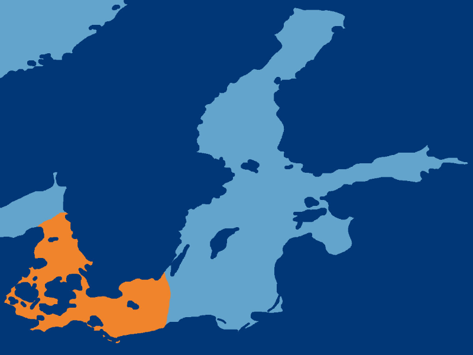
>
> __Verbreitung:__ westliche Ostsee, sowie westlicher Teil der zentralen Ostsee
>
> __Häufigkeit:__ regelmäßig
>
> __Gefährdung:__ nicht gefährdet

## Haarbutt

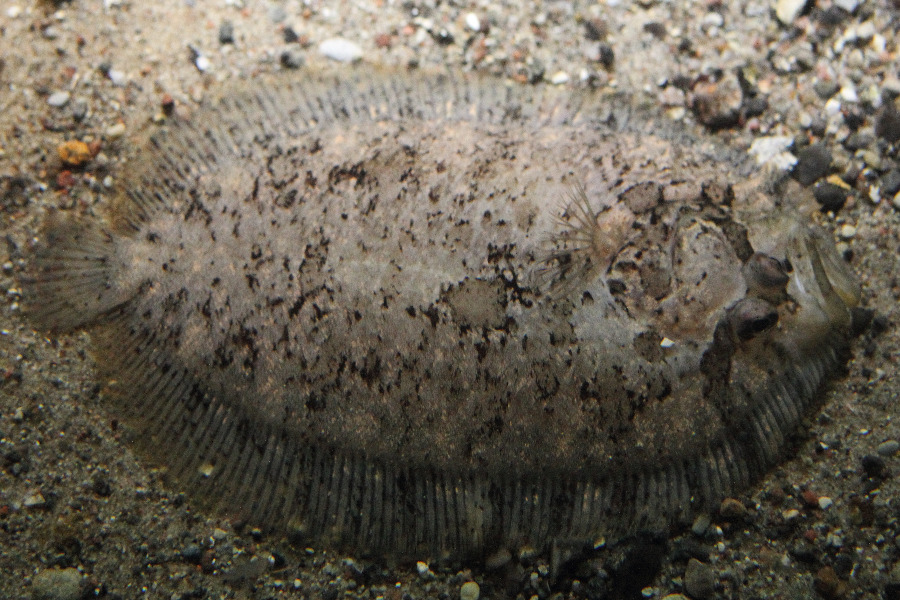
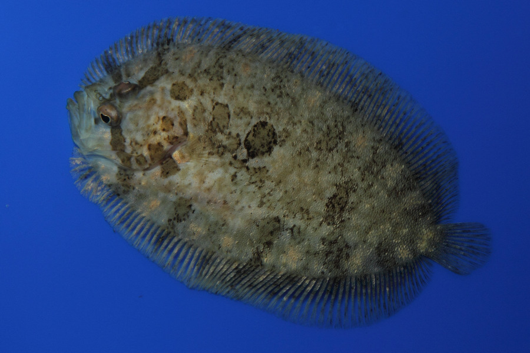
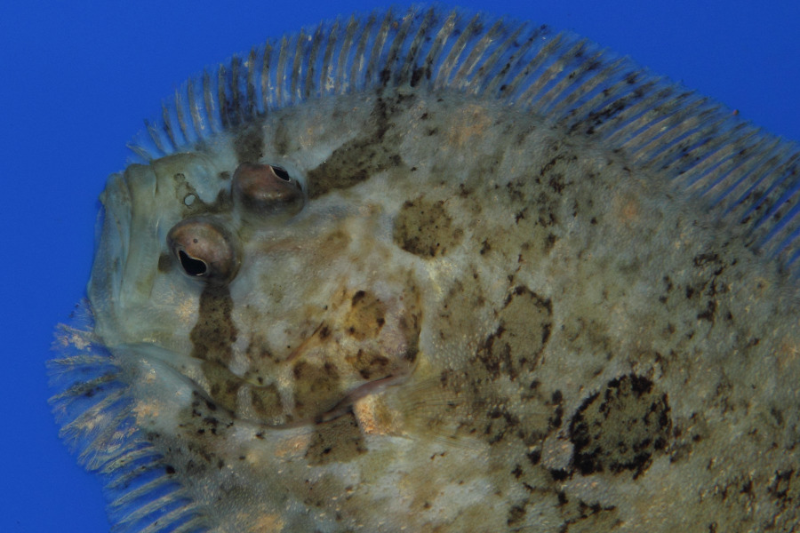

<article class="main-info">

_D-Haarbutt;_
_GB-Topknot;_
_DK-Hårhvarre;_
_PL-Ptera;_
_EST-Karvik-täppkammeljas;_
_FIN-Kalliokampela;_
_S-Bergvar_

### Erkennungsmerkmale

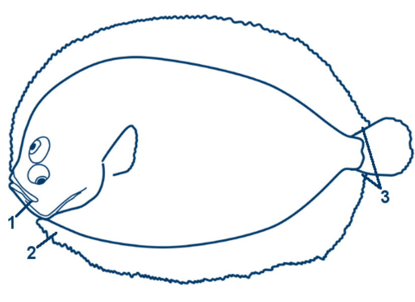

1. Maul groß (ein Vielfaches des Augendurchmessers).
2. Bauch- und Afterflossen zusammengewachsen.
3. Rücken- und Afterflosse mit der Schwanzflosse verbunden.

* Beide Augen auf der linken Körperseite.
* Körperoberseite bräunlich mit dunklen unregelmäßigen Flecken und mit einem markanten Streiifen durch die Augen; Unterseite weißlich.

Bis zu 25 cm lang.

### Ähnliche Arten

* [Steinbutt](#steinbutt) - kräftige, knöcherne Höcker auf der Körperoberseite; Bauchflossen nicht mit der Afterflosse verschmolzen.
* [todo: Steinbutt](#steinbutt) - erste Strahlen der Rückenflosse frei; Bauchflossen nicht mit der Afterflosse verschmolzen.
* [Lammzunge](#lammzunge) - Rücken- und Afterflosse nicht mit Schwanzflosse verbunden; Rückenflosse beginnt über den Augen (beim Haarbutt am Oberkiefer).

### Lebensweise

Bodenlebend auf Steinen und Felsen, die mit Algen überwachsen sind; kann sich an Oberflächen festheften.

### Ernährung

Frisst kleine Fische und Krebschen.

### Bedeutung

Ohne wirtschaftliche Bedeutung.

</article>

<!-- class="sub-info" -->
> #### Zeugopterus punctatus
>
> __Familie:__ Scophthalmidae
>
> __Ordnung:__ Pleuronectiformes
>
> 
>
> __Verbreitung:__ Kommt in der westlichen Ostsee vor.
>
> __Häufigkeit:__ häufig
>
> __Gefährdung:__ nicht gefährdet

## Aalmutter

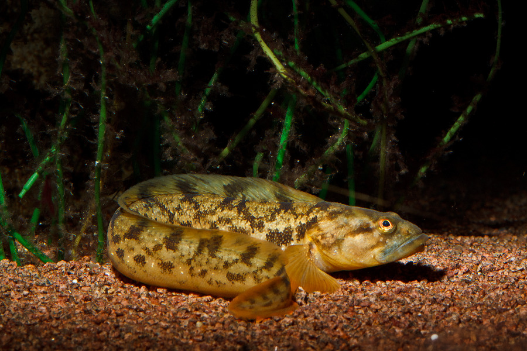
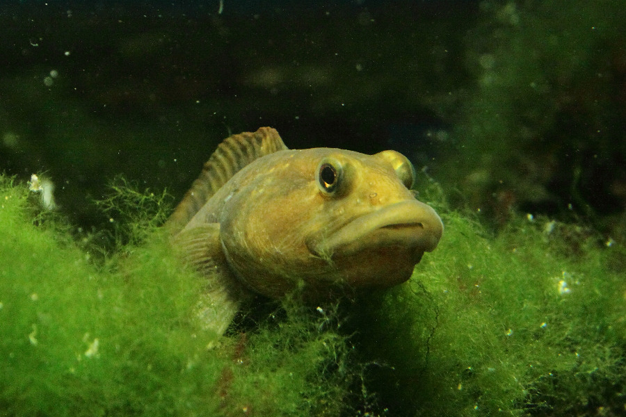

<article class="main-info">

_D-Aalmutter;_
_GB-Eelpout;_
_DK-Ålekvabbe;_
_PL-Węgorzyca;_
_LT-Paprastoji gyvavedė vėgėlė;_
_LV-Lucītis;_
_EST-Emakala;_
_RU-Европейская бельдюга;_
_FIN-Kivinilkka;_
_S-Tånglake, ålkusa_

### Erkennungsmerkmale

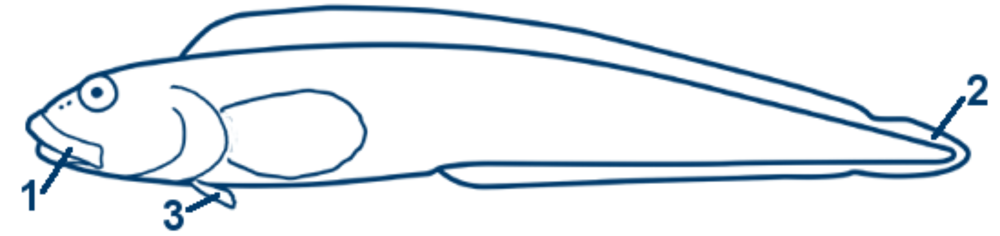

1. Maul mit auffallend großen Lippen.
2. Keine ausgeprägte Schwanzflosse (Rücken-, Schwanz- und Afterflosse bilden einen durchgängigen Saum).
3. Bauchflossen sehr klein, fast fadenförmig.

* Körper bräunlich bis gelblich gefärbt mit Streifen und Flecken auf Rücken und Seiten.

Meist 30 bis 40 cm, maximal bis 50 cm lang.

### Ähnliche Arten

* [Spitzschwanz-Schlangenstachelrücken](#spitzschwanz-schlangenstachelrücken) - Schwanzspitze spitz auslaufend; schlanker, Körper deutlich länger.
* [Butterfisch](#butterfisch) - Schwanzflosse rundlich und nicht mit Rücken- und Afterflosse verschmolzen; schwarze Augenflecken auf dem Rücken.

### Lebensweise

Lebt bodennah in Seegraswiesen oder algenbewachsenen Flachwasserbereichen; kommt auch in Gezeitentümpeln und Brackwasser vor.
Wird mit 2 bis 3 Jahren geschlechtsreif.
Nach einer Tragezeit von 4 Monaten werden 30 bis 400 vollentwickelte Junge geboren.

### Ernährung

Ernährt sich von verschiedenen bodenlebenden Wirbellosen; größere Individuen fressen auch kleinere Fische.

### Bedeutung

Essbar, jedoch keine wirtschaftliche Bedeutung.

### Gefährdung

Vermutlich nicht gefährdet.

</article>

<!-- class="sub-info" -->
> #### Zoarces viviparus
>
> __Familie:__ Zoarcidae
>
> __Ordnung:__ Perciformes
>
> 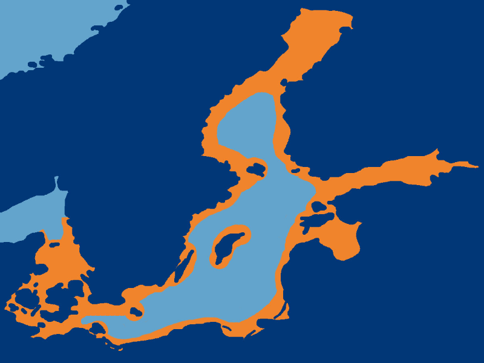
>
> __Verbreitung:__ Kommt küstennah in der gesamten Ostsee vor.
>
> __Häufigkeit:__ sehr häufig
>
> __Gefährdung:__ nicht gefährdet

## Spitzschwanz-Schlangenstachelrücken

<article class="main-info">

_D-Spitzschwanz-Stachelrücken, Spitzschwanz-Schlangenstachelrücken;_
_GB-Snakeblenny, Bandfisch;_
_DK-Spidshalet langebarn;_
_PL-Taśmiak długi;_
_LT-Nėginis liumpenas;_
_LV-Lentzivs;_
_EST-Suttlimusk;_
_RU-Minogovidniy lyumpen;_
_FIN-Elaska;_
_S-Spetsstjärtat långebarn;_

### Erkennungsmerkmale

1. Sehr kleine Bauchflossen.
2. Lange Afterflosse (etwa 2/3 der Körperlänge).
3. Schwanzflosse schlank und zugespitzt.

* Körper gelblich bis braun mit unregelmäßig verteilten dunklen Flecken.

Meist 30 bis 35 cm, max. bis zu 50 cm lang.

### Ähnliche Arten

* [Aalmutter](#aalmutter) - ohne klar erkennbare Schwanzflosse; Lippen dicker.
* [Butterfisch](#butterfisch) - Schwanzflosse rundlich; schwarze Augenflecken auf dem Rücken (keine schwarzen Flecken auf den Seiten).

### Lebensweise

Bodenlebend in Höhlen im Weichgrund von 30 bis 200 m Tiefe.
Geschlechtsreif mit 3 Jahren.
Von Dezember bis Januar werden 600 bis 1100 Eier in den Boden gelegt.

### Ernährung

Ernährt sich von Krebschen, Würmern und anderen Wirbellosen.

### Bedeutung

Ohne wirtschaftliche Bedeutung.

</article>

<!-- class="sub-info" -->
> #### Lumpenus lampretaeformis
>
> __Familie:__ Lumpenidae
>
> __Ordnung:__ Perciformes
>
> 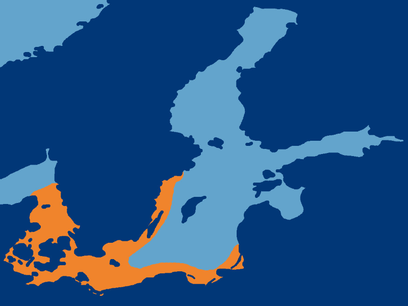
>
> __Verbreitung:__ Kommt in der westlichen und südlichen Ostsee, sowie in Südschweden vor.
>
> __Häufigkeit:__ regelmäßig
>
> __Gefährdung:__ unklar

## Butterfisch

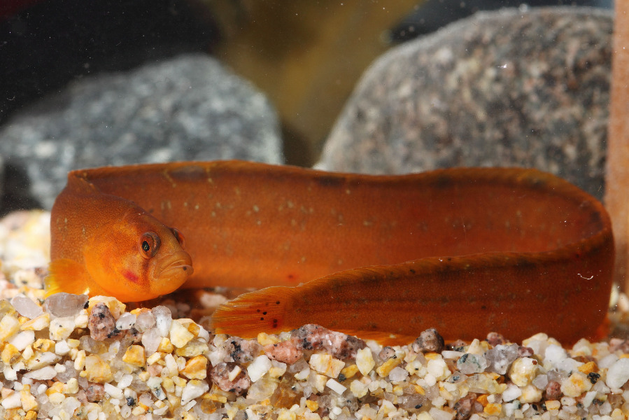
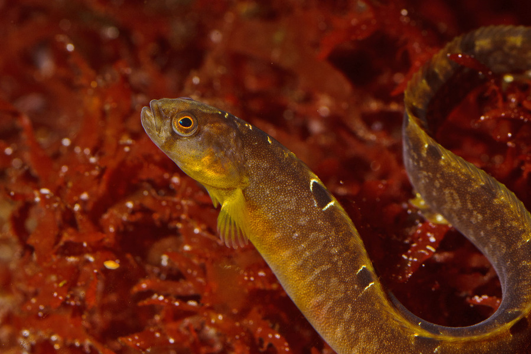
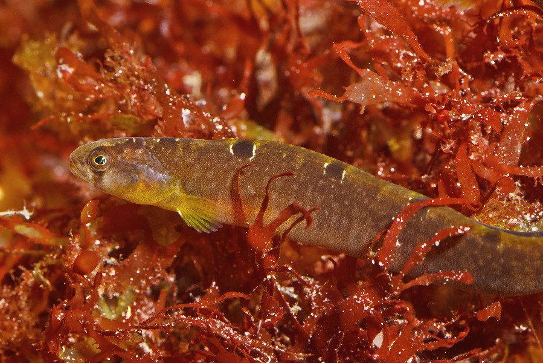
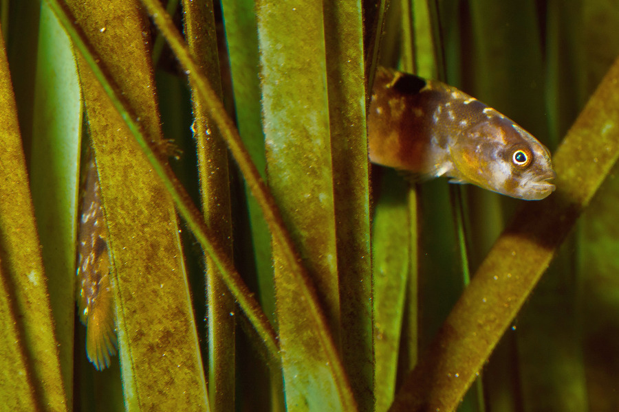

<article class="main-info">

_D-Butterfisch;_
_GB-Rock gunnel;_
_DK-Tangspræl;_
_PL-Ostropłetwiec;_
_LT-Taukžuvė;_
_LV-Taukzivs;_
_EST-Võikala;_
_RU-Обыкновенный маслюк;_
_FIN-Teisti;_
_S-Tejstefisk_

### Erkennungsmerkmale

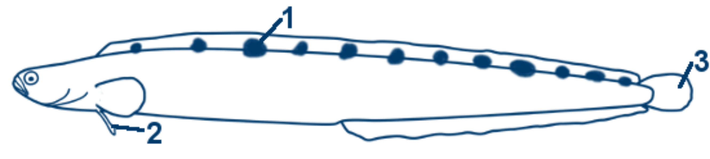

1. Auffällige schwarze Flecken mit weißen Rändern entlang der Rückenflossenbasis.
2. Bauchflossen sehr schwach entwickelt.
3. Schwanzflosse gerundet.

* Körper bräunlich, gelegentlich mit unregelmäßiger Musterung.

Meist unter 20 cm, max. bis zu 30 cm lang.

### Ähnliche Arten

* [Aalmutter](#aalmutter) - ohne klar erkennbare Schwanzflosse; Lippen dicker.
* [Spitzschwanz-Schlangenstachelrücken](#spitzschwanz-schlangenstachelrücken) - Schwanzsspitze spitz auslaufend; schlanker, Körper deutlich länger.

### Lebensweise

Lebt bodenorientiert auf sandigen und kiesigen Gründen, die mit Algen bewachsen sind; vom Flachwasser bis in 30 m Tiefe.
Geschlechtsreif mit 3 Jahren.
Im Herbst und Winter werden die Eier in Paketen zwischen Steinen und Muschelschalen abgelegt.
Im Anschluss werden die Eier 2 Monate lang von den Eltern verteidigt.

### Ernährung

Bevorzugt Amphipoden und Asseln, frisst aber auch alle anderen kleinen Wirbellosen.

### Bedeutung

Bildet eine wichtige Nahrungsgrundlage für viele wirtschaftlich wichtige Fische.

</article>

<!-- class="sub-info" -->
> #### Pholis gunellus
>
> __Familie:__ Pholidae
>
> __Ordnung:__ Perciformes
>
> 
>
> __Verbreitung:__ Kommt küstennah in der gesamten Ostsee vor.
>
> __Häufigkeit:__ regelmäßig
>
> __Gefährdung:__ nicht gefährdet

## Gestreifter Seewolf

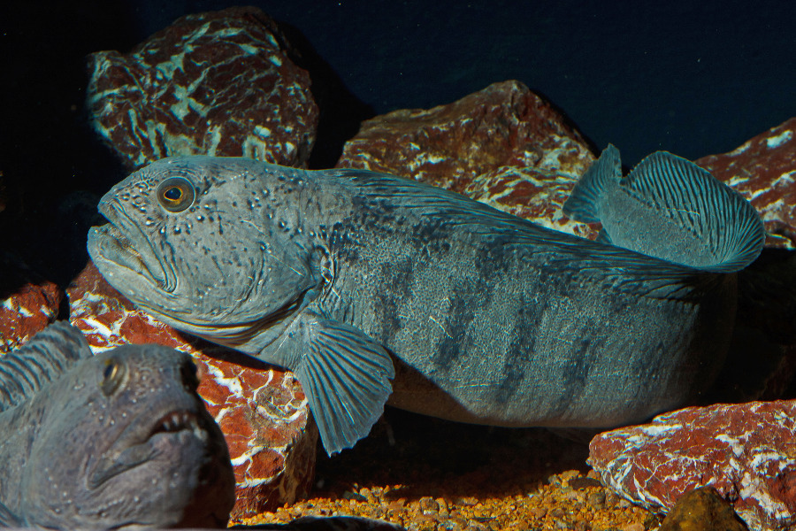
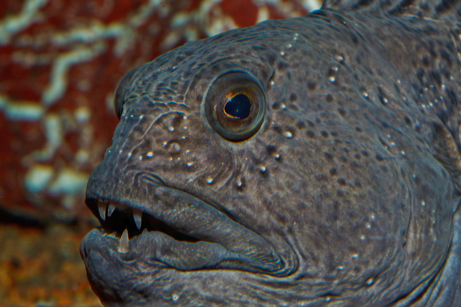
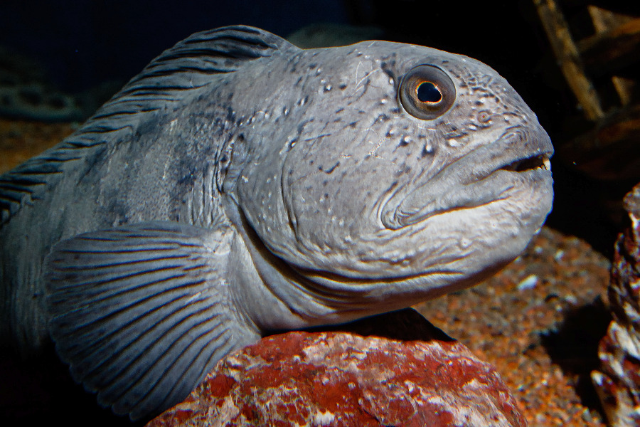
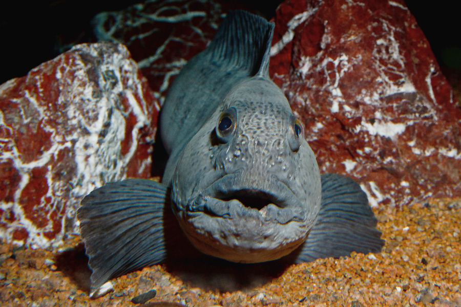

<article class="main-info">

_D-Gestreifter Seewolf;_
_GB-Wolffish, catfish, sea cat;_
_DK-Havkat;_
_PL-Zębacz pasiasty;_
_LT-Paprastoji vilkžuvė;_
_RU-Полосатая зубатка;_
_FIN-Merikissa;_
_S-Havskatt_

### Erkennungsmerkmale

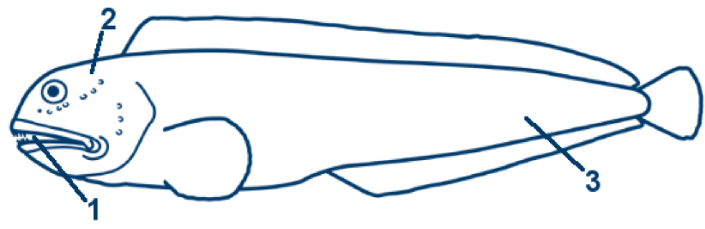

1. Starke Bezahnung mit gekrümmten Zähnen in Ober und Unterkiefer.
2. Großer, rundlicher Kopf.
3. Körper wird durchgängig schlanker zur Schwanzflosse hin.

* Ohne Bauchflossen.
* Körper grau, braun-rot oder bläulich mit dunklen Streifen, die sich bis auf die Rückenflosse ziehen.

Meist 50 bis 80 cm, maximal bis zu 150 cm lang.

### Ähnliche Arten

* [Butterfisch](#butterfisch) - schwarze Augenflecken auf dem Rücken; kleine Bauchflossen vorhanden; sehr viel kleiner bleibend.

### Lebensweise

Bodenbewohnende Art, die Weich- und Steingründe in 100 bis 150 m Tiefe bevorzugt.
Wird mit etwa 7 Jahren geschlechtsreif.
Zwischen Oktober und Januar werden etwa 3.000 bis 24.000 Eier in kleinen Portionen zwischen Steine und Seegras abgelegt.

### Ernährung

Ernährt sich von hartschaligen bodenlebenden Tieren, wie Krebsen, Muscheln, Schnecken und Seeigeln.

### Bedeutung

Beliebter Speisefisch; in Großbritannien vermarktet als "Scotch halibut", "Scarborough woof", oder auch einfach "Woof"; eine beliebte Fischart für Fish and Chips.

</article>

<!-- class="sub-info" -->
> #### Anarhichas lupus
>
> __Familie:__ Anarhichadidae
>
> __Ordnung:__ Perciformes
>
> 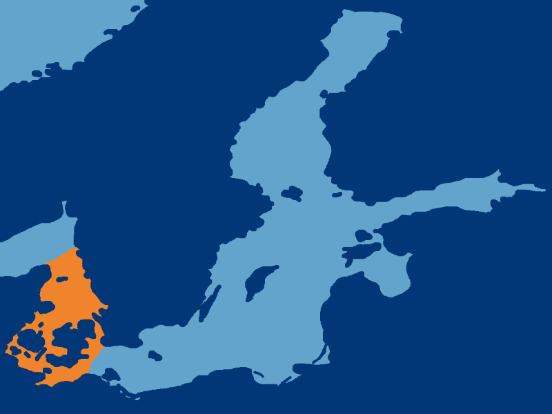
>
> __Verbreitung:__ Kommt in der westlichen Ostsee vor.
>
> __Häufigkeit:__ selten
>
> __Gefährdung:__ unklar

## Kleiner Sandaal

<article class="main-info">

_D-Kleiner Sandaal;_
_GB-Lesser sand-eel;_
_DK-Havtobis;_
_PL-Dobijak niebieski;_
_EST-Meritobias;_
_RU-Evropeyskaya peschanka;_
_FIN-Merituulenkala;_
_S-Havstobis_

### Erkennungsmerkmale

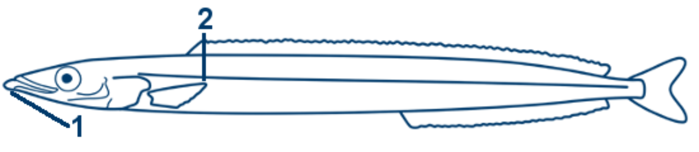

1. Langezogener Kopf mit spitzer Schnauze und vorstehendem Unterkiefer.
2. Spitze der Brustflosse überragt leicht den Ansatz der Rückenflosse.

* Ohne Bauchflossen.
* Körper silbern; Rücken bläulich-grünlich.

Meist etwa 15 cm, maximal bis zu 20 cm lang.

### Ähnliche Arten

* [Tobiasfisch](#tobiasfisch) - regelmäßig angeordnete Schuppen in der Bauchregion (beim Tobiasfisch unregelmäßig).
* [Grosser Sandaal](#grosser-sandaal) - schwarzer Fleck auf der Mitte des Oberkiefers; Brustflosse reicht nur bis zur Rückenflosse.

### Lebensweise

Tagsüber im Sand vergraben; nachts in großen Schwärmen auf Nahrungssuche.
Bevorzugt küstennahe Habitate mit sandigem Untergrund, dringt aber auch in Ästuare vor.
Im Herbst oder Frühling werden 3.800 bis 22.000 Eier in Paketen auf Sandboden abgelegt.

### Ernährung

Ernährt sich von Zooplankton und großen Diatomeen.

### Bedeutung

Wird in großen Mengen zu Fischmehl verarbeitet.
Wichtiger Nahrungsfisch für größere Fischarten und Seevögel.

</article>

<!-- class="sub-info" -->
> #### Ammodytes marinus
>
> __Familie:__ Ammodytidae
>
> __Ordnung:__ Perciformes
>
> 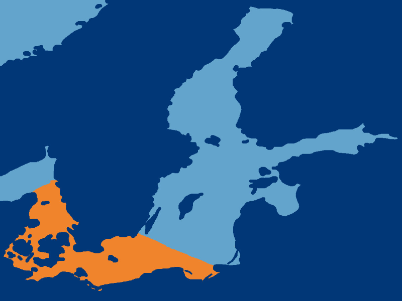
>
> __Verbreitung:__ Kommt in der westlichen südlichen Ostsee vor.
>
> __Häufigkeit:__ selten
>
> __Gefährdung:__ unklar

## Tobiasfisch

<article class="main-info">

_D-Tobiasfisch;_
_GB-Small sandeel;_
_DK-Kysttobis;_
_PL-Tobiasz;_
_LT-Mažasis tobis;_
_LV-Tūbīte;_
_EST-Väike tobias;_
_RU-Балтийская песчанка;_
_FIN-Pikkutuulenkala;_
_S-Kusttobis_

### Erkennungsmerkmale

1. Langezogener Kopf mit zugespitzer Schnauze und hervorragendem Unterkiefer.
2. Spitze der Brustflosse reicht etwas über den Ansatz der Rückenflosse.

* Keine Bauchflossen.
* Körper silbern; Rücken bläulich-grünlich.

Maximal bis zu 25 cm lang, meist deutlich kleiner.

### Ähnliche Arten

* [Kleiner Sandaal](#kleiner-sandaal) - unregelmäßig angeordnete Schuppen in der Bauchregion (beim kleinen Sandaal regelmäßig).
* [Grosser Sandaal](#grosser-sandaal) - schwarzer Fleck auf der Mitte des Oberkiefers; Spitze der Brustflosse reicht nur bis zur Rückenflosse.

### Lebensweise

Tagsüber im Sand vergraben; nachts in großen Schwärmen auf Nahrungssuche.
Pflanzt sich im Winter fort.

### Ernährung
Ernährt sich von Zooplankton und großen Diatomeen.

### Bedeutung

Bedeutender Fisch für die Fischmehlproduktion; etwa 1 Million Tonnen werden in Europa jedes Jahr verarbeitet.
Sehr wichtige Art im Nahrungsnetz für größere Fische und Vögel.

</article>

<!-- class="sub-info" -->
> #### Ammodytes tobianus
>
> __Familie:__ Ammodytidae
>
> __Ordnung:__ Perciformes
>
> 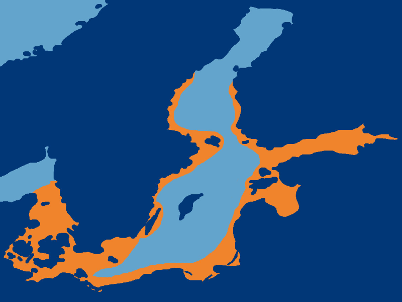
>
> __Verbreitung:__ Mit Ausnahme des nördlichen bottnischen Meerbusens, küstennah in der gesamten Ostsee verbreitet.
>
> __Häufigkeit:__ häufig
>
> __Gefährdung:__ nicht gefährdet

## Grosser Sandaal

<article class="main-info">

_D-Grosser Sandaal;_
_GB-Great sand eel;_
_DK-Tobiskonge;_
_PL-Dobijak;_
_LT-Didysis tobis;_
_LV-Nigliŋš;_
_EST-Suurtobias;_
_RU-Песчанка болшая;_
_FIN-Isotuulenkala;_
_S-Kungstobis_

### Erkennungsmerkmale

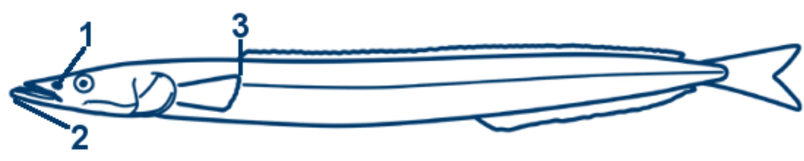

1. Schwarzer Fleck (etwas kleiner als das Auge) über der mitte des Oberkiefers.
2. Langgestreckter Kopf mit spitzer Schnauze und vorstehendem Unterkiefer.
3. Spitze der Brustflosse reicht bis zum Ansatz der Rückenflosse (aber nicht darüber hinaus).

* Ohne Bauchflossen.
* Körper silbern; Rücken bläulich-grünlich.

Meist 20 bis 30 cm, maximal bis 40 cm lang.

### Ähnliche Arten

* [Tobiasfisch](#tobiasfisch) - kein schwarzer Fleck auf der Mitte des Oberkiefers; Spitze der Brustflosse überragt leicht den Ansatz der Rückenflosse.
* [Kleiner Sandaal](#kleiner-sandaal) - kein schwarzer Fleck auf der Mitte des Oberkiefers; Spitze der Brustflosse überragt leicht den Ansatz der Rückenflosse.

### Lebensweise

Lebst küstennah über Sandgrund bis in 60 m Tiefe; auch in Ästuaren; laicht im Sommer.

### Ernährung

Ernährt sich von Zooplankton; ab einer Größe von 10 cm auch von kleineren Fischen.

### Bedeutung

Wird in großen Mengen zu Fischmehl verarbeitet.
Wichtiger Nahrungsfisch für größere Fischarten und Seevögel.

</article>

<!-- class="sub-info" -->
> #### Hyperoplus lanceolatus
>
> __Familie:__ Ammodytidae
>
> __Ordnung:__ Perciformes
>
> 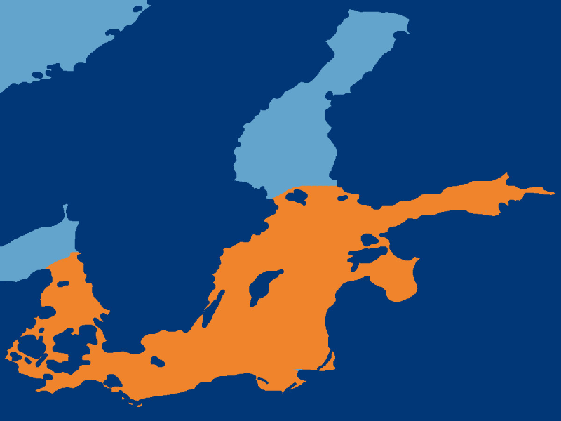
>
> __Verbreitung:__ Kommt küstennah in der gesamten Ostsee vor, mit Ausnahme des bottnischen Meerbusens.
>
> __Häufigkeit:__ regelmäßig
>
> __Gefährdung:__ unklar

## Wolfsbarsch

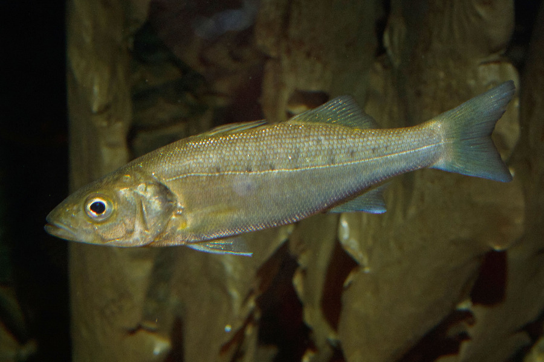
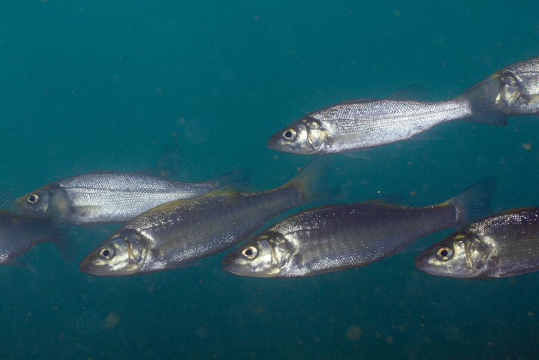

<article class="main-info">

_D-Wolfsbarsch;_
_GB-European bass;_
_DK-Havbars;_
_PL-Labraks;_
_EST-Harilik huntahven;_
_RU-Обыкновенный лаврак;_
_FIN-Meribassi;_
_S-Havsabborre_

### Erkennungsmerkmale

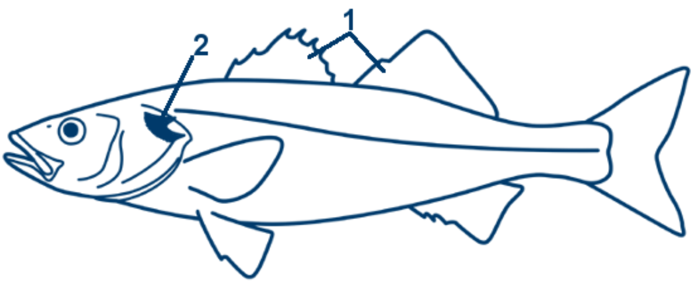

1. Zwei gleich lange Rückenflossen, die nahe beieinander stehen.
2. Dunkler Fleck auf dem Kiemendeckel.

* Körper silbern; Rücken bläulich-grün bis golden.

Meist 40 bis 80 cm; maximal bis zu 1 m lang.

### Ähnliche Arten

* [Adlerfisch](#adlerfisch) - Schwanzflosse rund; After- und erste Rückenflosse viel kürzer als zweite Rückenflosse.
* [Zander](#zander) - Körper länglicher; Kopf spitzer; Bauchseite weiß oder weißlich (silbern beim Wolfsbarsch)
* [Flussbarsch](#flussbarsch) - Schwarzer Fleck am Hinterrand der ersten Rückenflosse; Flanken mit Streifen.

### Lebensweise

Räuberischer Schwarmfisch, der küstennah lebt und im Sommer auch in Ästuare vordringt.
Laicht im Frühjahr; Jungtiere formen große Schulen.

### Ernährung

Ernährt sich vor allem von Garnelen und Weichtieren, aber auch von Fischen.

### Bedeutung

Wichtiger Speisefisch, der auch gerne von Anglern gefangen wird; wird frisch und geräuchert angeboten.

</article>

<!-- class="sub-info" -->
> #### Dicentrarchus labrax
>
> __Familie:__ Moronidae
>
> __Ordnung:__ Perciformes
>
> 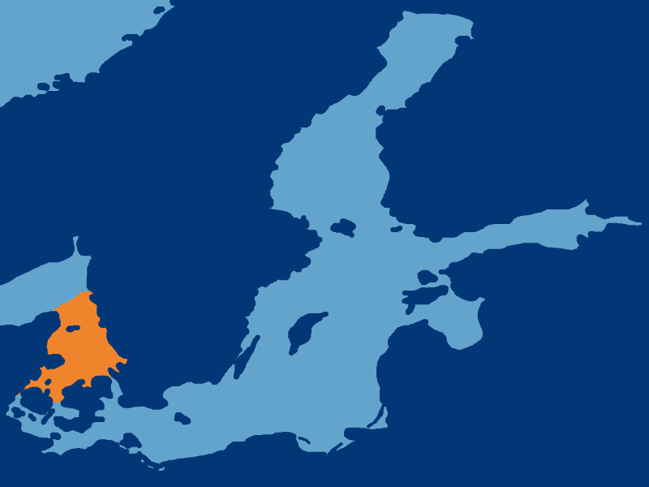
>
> __Verbreitung:__ Kommt im Kattegat vor.
>
> __Häufigkeit:__ regelmäßig
>
> __Gefährdung:__ nicht gefährdet

## Goldmaid

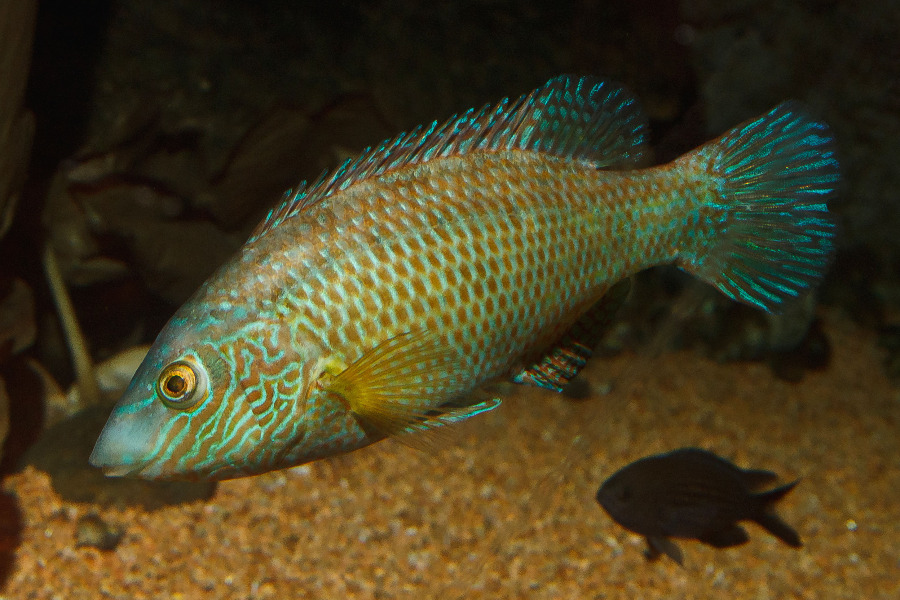
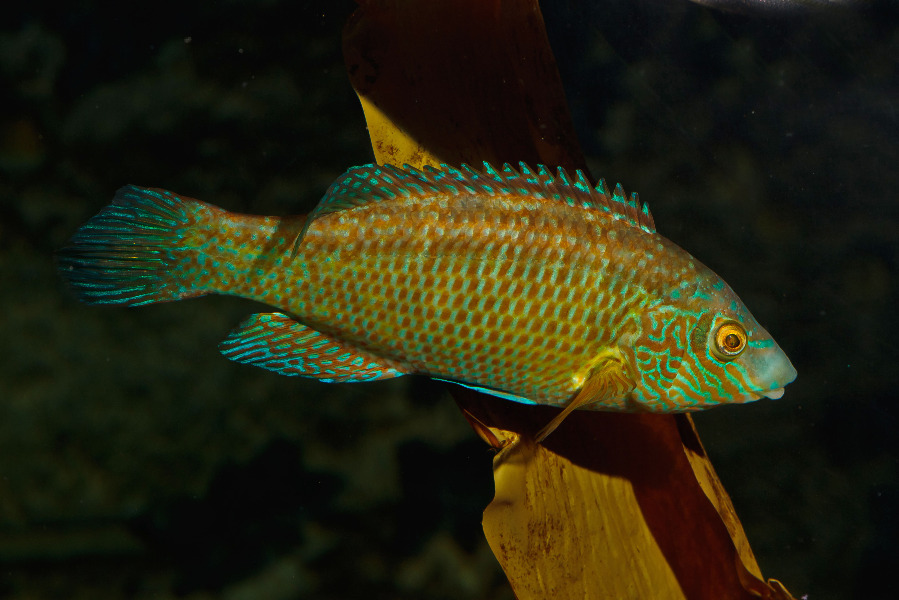
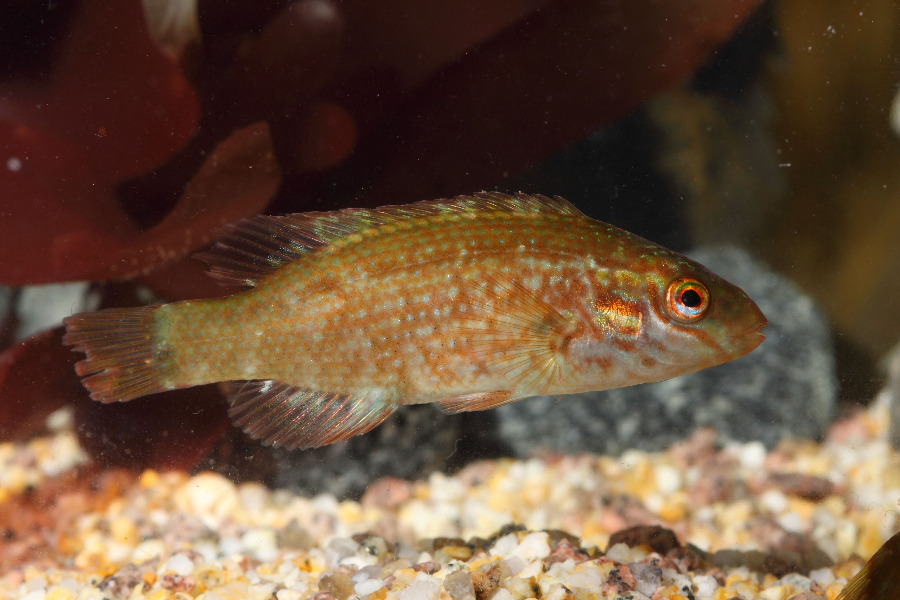

<article class="main-info">

_D-Goldmaid;_
_GB-Corkwing wrasse;_
_DK-Savgylte;_
_PL-Wargacz melops;_
_LT-Tamsiadryžė žaliažuvė;_
_EST-Lauk-sälkhuulkala;_
_RU-Темнополосая зеленушка;_
_S-Skärsnultra_

### Erkennungsmerkmale

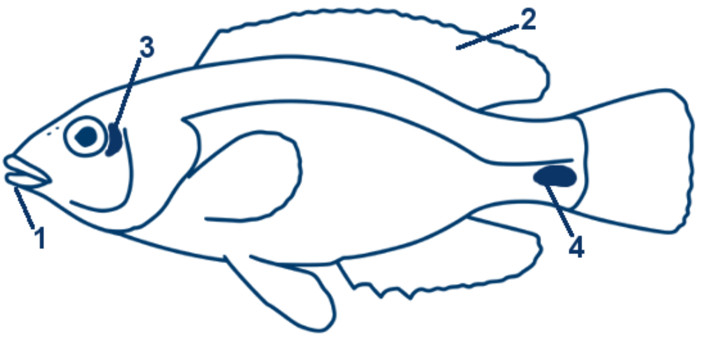

1. Dicke, fleischige Lippen.
2. Lange, nicht unterteilte Rückenflosse, mit Stachelstrahlen im vorderen Teil.
3. Blauschwarzer, bohnenförmiger Fleck hinter dem Auge.
4. Schwarzer Fleck im unteren Bereich des Schwanzstiels.

* Mit sehr bunter Färbung: glänzend grün, gelb oder rötlich mit dunkleren, braunen Flecken.

Meist 15 bis 20 cm, max. bis zu 28 cm lang.

### Ähnliche Arten

* [Klippenbarsch](#klippenbarsch) - schwarzer Fleck am Beginn der Rückenflossen und im oberen Teil des Schwanzstiels.
* [Gefleckter Lippfisch](#gefleckter-lippfisch) - helle Flecken auf Schuppen und Flossen; ohne markante schwarze Flecken.

### Lebensweise

Kommt küstennah an Felsen und Seegras vor.
Lebt häufig in Gruppen mit gemischtem Alter.
Die Männchen bauen zwischen Steinen Nester aus Algen.
Wird bis zu 9 Jahre alt.

### Ernährung

Frisst Krebse, Weichtiere, Moostierchen und Würmer.

### Bedeutung

Ohne wirtschaftliche Bedeutung.

</article>

<!-- class="sub-info" -->
> #### Symphodus melops
>
> __Familie:__ Labridae
>
> __Ordnung:__ Perciformes
>
> 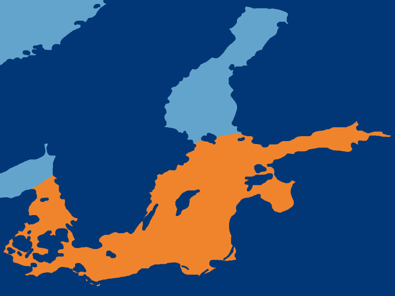
>
> __Verbreitung:__ Kommt küstennah in der gesamten Ostsee vor, mit Ausnahme des Bottnischen Meerbusens.
>
> __Häufigkeit:__ häufig
>
> __Gefährdung:__ nicht gefährdet

## Klippenbarsch

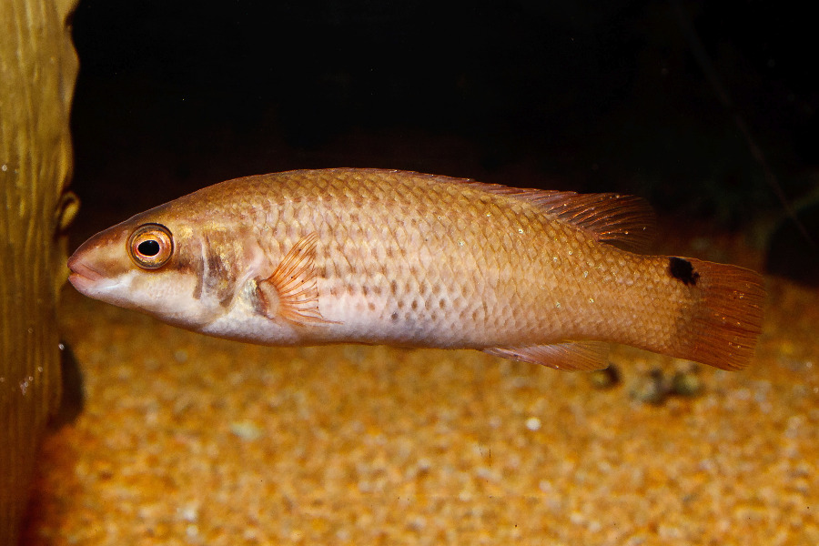
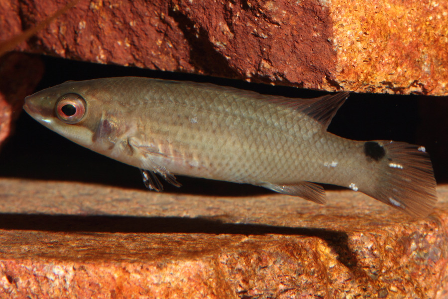

<article class="main-info">

_D-Klippenbarsch;_
_GB-Goldsinny wrasse;_
_DK-Havkarusse;_
_PL-Wargacz skalik;_
_EST-Kaljukullak;_
_RU-Гребенчатый губан;_
_FIN-Kivihuulikala;_
_S-Stensnultra;_

### Erkennungsmerkmale

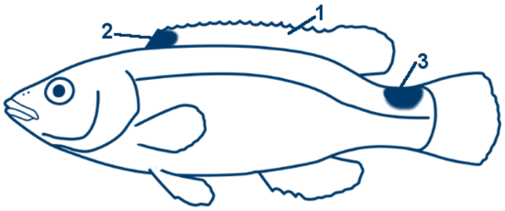

1. Lange, ungeteilte Rückenflossen mit Stachelstrahlen im vorderen Teil.
2. Schwarzer Fleck am Beginn der Rückenflosse.
3. Schwarzer Fleck am oberen Rand des Schwanzstiels.

* Körper meist rötlich bis orange, seltener gräulich oder grünlich; ohne auffällige Musterungen.

Meist 10 bis 12 cm, maximal bis zu 18 cm lang.

### Ähnliche Arten

* [Goldmaid](#goldmaid) - dickere Lippen; dunkler Fleck hinter dem Auge und auf der unteren Hälfte des Schwanzstiels.
* [Gefleckter Lippfisch](#gefleckter-lippfisch) - dickere Lippen; helle Flecken auf Schuppen und Flossen.

### Lebensweise

Lebt in felsigen Umgebungen und in Seegraswiesen in Tiefen bis zu 50 m Tiefe.
Das Laichareal wird vom Männchen verteidigt.
Pflanzt sich während der Sommermonate fort.
Wird mit 2 Jahren geschlechtsreif.

### Ernährung

Frisst Krebstiere, Schnecken und Moostierchen.

### Bedeutung

Ohne wirtschaftliche Bedeutung.

</article>

<!-- class="sub-info" -->
> #### Ctenolabrus rupestris
>
> __Familie:__ Labridae
>
> __Ordnung:__ Perciformes
>
> 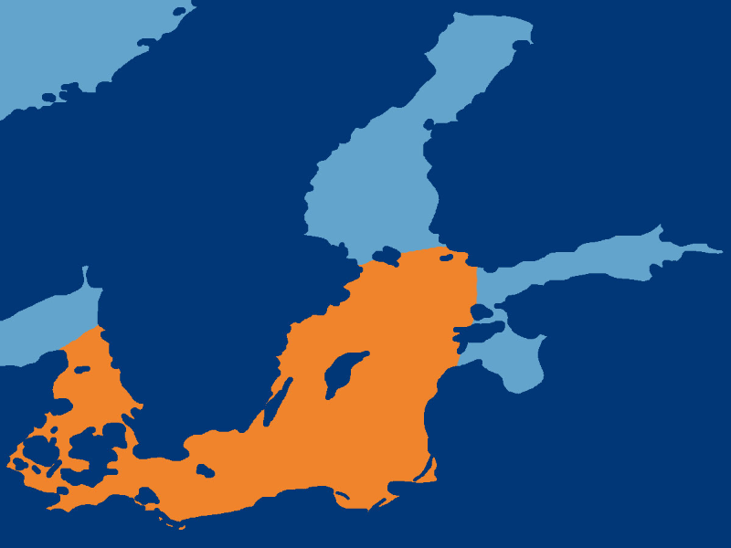
>
> __Verbreitung:__ Kommt küstennah in der gesamten Ostsee vor, mit Ausnahme des Bottnischen Meerbusens, dem Golf von Riga und dem Golf von Finland.
>
> __Häufigkeit:__ sehr häufig
>
> __Gefährdung:__ nicht gefährdet

## Gefleckter Lippfisch

<article class="main-info">

_D-Gefleckter Lippfisch;_
_GB-Ballan wrasse;_
_DK-Berggylte;_
_PL-Wargacz kniazik;_
_LT-Vaivorykštinė lūpažuvė;_
_EST-Laiguline huulkala;_
_RU-Радужный губан;_
_FIN-Viherhuulikala;_
_S-Berggylta_

### Erkennungsmerkmale

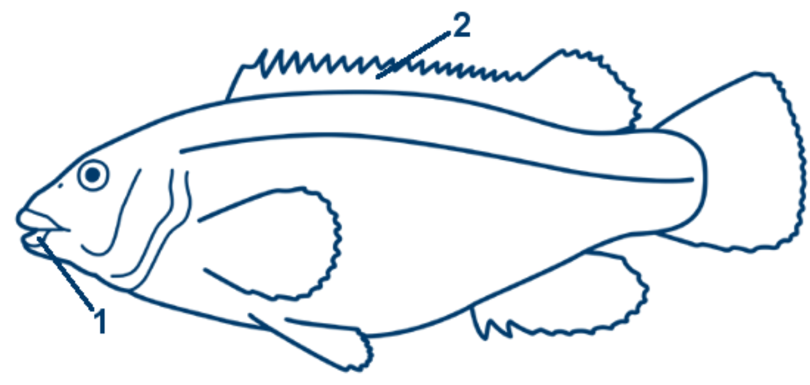

1. Sehr dicke, fleischige Lippen.
2. Lange ungeteilte Rückenflosse mit Stachelstrahlen in der vorderen Hälfte.

* Kräftige grünliche oder rötliche Färbung mit weißen Punkten auf dem ganzen Körper (auf jeder Schuppe), und auch auf Kopf und Flossen.
  Keinen auffälligen dunklen Flecken.

Meist 30 bis 50 cm, maximal bis zu 60 cm lang.

### Ähnliche Arten

* [Goldmaid](#goldmaid) - dunkler Fleck hinter dem Auge und auf der unteren Hälfte des Schwanzstiels.
* [Klippenbarsch](#klippenbarsch) - dünnere Lippen; schwarzer Fleck am Beginn der Rückenflossen und im oberen Teil des Schwanzstiels.

### Lebensweise

Kommt an Riffen, Felsblöcken und Seegraswiesen in flachen Gewässern bis in in 20 m Tiefe vor.
Weibchen legen ihre Eier in Nester aus Algen; die Nester werden von Männchen in Verstecken gebaut.
Wird mit etwa 2 Jahren geschlechtsreif; vermehrt sich während der Sommermonate.

### Ernährung

Bevorzugt Krebse und Weichtiere.

### Bedeutung

Nur geringe wirtschaftliche Bedeutung.

</article>

<!-- class="sub-info" -->
> #### Labrus bergylta
>
> __Familie:__ Labridae
>
> __Ordnung:__ Perciformes
>
> 
>
> __Verbreitung:__ Kommt küstennah in der gesamten Ostsee vor, mit Ausnahme des Bottnischen Meerbusens, dem Golf von Riga und dem Golf von Finnland.
>
> __Häufigkeit:__ regelmäßig
>
> __Gefährdung:__ nicht gefährdet

## Streifenbarbe

<article class="main-info">

_D-Streifenbarbe;_
_GB-Striped red mullet, Striped mullet, surmullet;_
_DK-Stribet mulle;_
_PL-Barwena;_
_EST-Vahemere meripoisur;_
_RU-Полосатая барабуля;_
_FIN-Keltajuovamullo;_
_S-Mulle_

### Erkennungsmerkmale

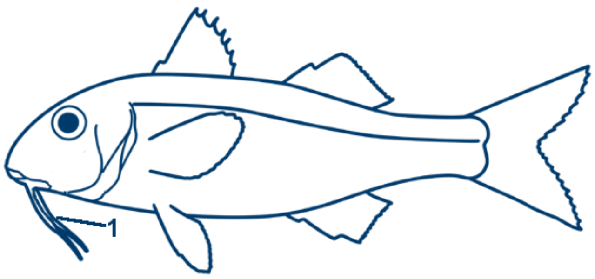

1. Zwei lange Barteln am Kinn.

* Zwei klar getrennte Rückenflossen.
* Körper hell mit rot-braunen Längsstreifen vom Auge bis zur Schwanzflosse; Färbung stark von der Stimmung abhängig: auch ohne Streifen oder mit großen roten Flecken.

Meist 20 to 25 cm, maximal bis zu 40 cm lang.

### Ähnliche Arten

\- Unverwechselbar

### Lebensweise

Bodenlebende über Sand- und Weichgrund bis in 100 m Tiefe.
Kommt einzeln oder in Gruppen von bis zu 50 Tieren vor.
Fortpflanzungszeit von Mai bis Juli, Geschlechtsreife mit 2 Jahren.

### Ernährung

Ernährt sich vor allem von kleinen Krebschen, Weichtieren und Würmern; größere Individuen fressen auch kleinere bodenlebende Fische.

### Bedeutung

Geschätzer Speißefisch.

</article>

<!-- class="sub-info" -->
> #### Mullus surmuletus
>
> __Familie:__ Mullidae
>
> __Ordnung:__ Perciformes
>
> 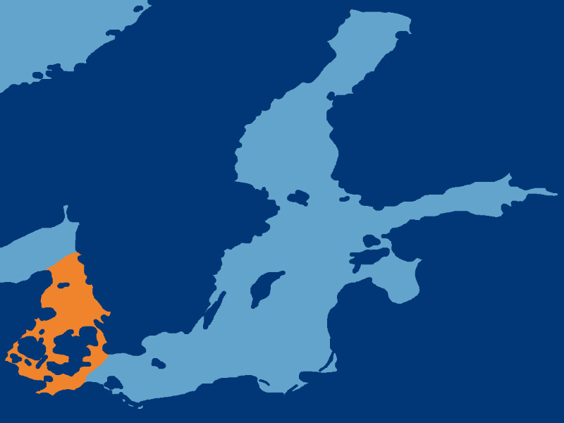
>
> __Verbreitung:__ Kommt in der westlichen Ostsee vor.
>
> __Häufigkeit:__ regelmäßig
>
> __Gefährdung:__ nicht gefährdet

## Vierhörniger Seeskorpion

<article class="main-info">

_D-Vierhörniger Seeskorpion;_
_GB-Fourhorn sculpin;_
_DK-Hornulk;_
_PL-Kur rogacz;_
_LT-Ragys;_
_LV-Cetrragu buļļzivs;_
_EST-Merihärg;_
_RU-Четырёхрогий керчак;_
_FIN-Härkäsimppu;_
_S-Hornsimpa_

### Erkennungsmerkmale

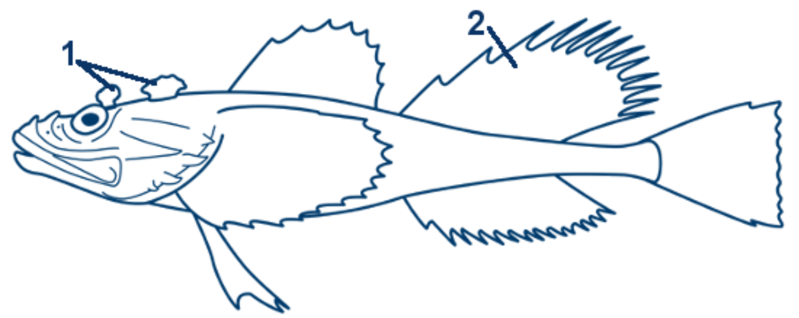

1. Vier gelblich-grüne Hörner auf dem Kopf.
2. Zweite Rückenflosse größer als erste.
3. Einheitlich grünlich oder braun-grau mit hellen Flecken und Streifen.

Für gewöhnlich 15 to 25 cm, maximal bis zu 37 cm lang.

### Ähnliche Arten

* [Seeskorpion](#seeskorpion) - ohne Hörner auf dem Kopf.
* [Seebull](#seebull) - ohne Hörner auf dem Kopf.

### Lebensweise

Bodenlebend: bevorzugt Weichgrund bis in 20 m Tiefe.
2000 bis 18000 grün-schwarze Eier werden zwischen November und Januar gelegt.

### Ernährung

Frisst vor allem Asseln und Würmer.

### Bedeutung

Ohne Bedeutung in der Ostsee; von lokaler Bedeutung in arktischen Gewässern.

</article>

<!-- class="sub-info" -->
> #### Myoxocephalus quadricornis
>
> __Familie:__ Myoxocephalus quadricornis
>
> __Ordnung:__ Scorpaeniformes
>
> 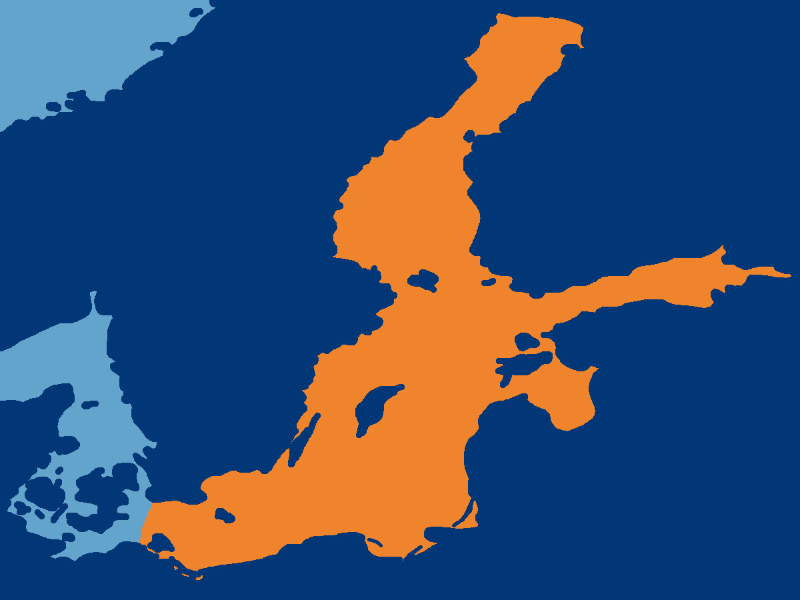
>
> __Verbreitung:__ Kommt in der östlichen Ostsee bis etwa Rügen vor.
>
> __Häufigkeit:__ selten
>
> __Gefährdung:__ unklar

## Seebull

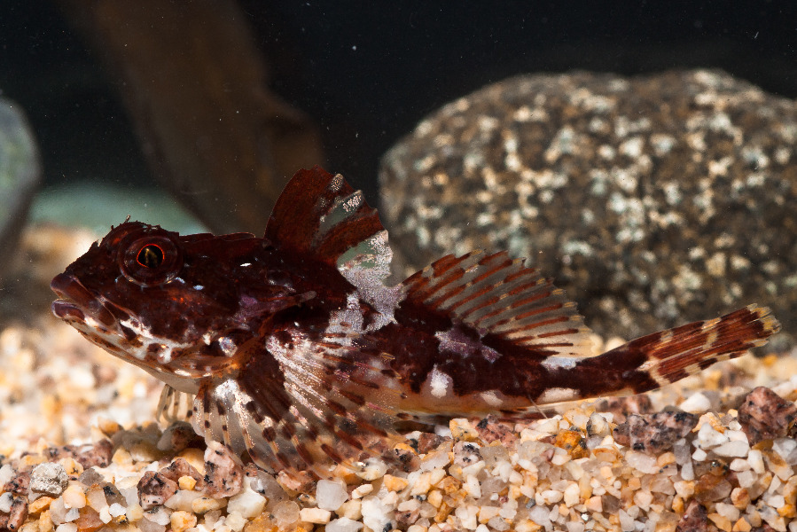
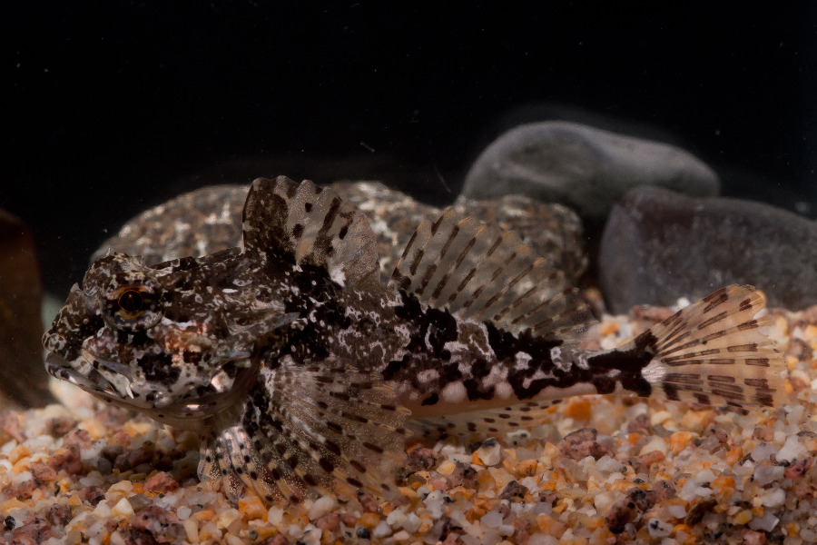
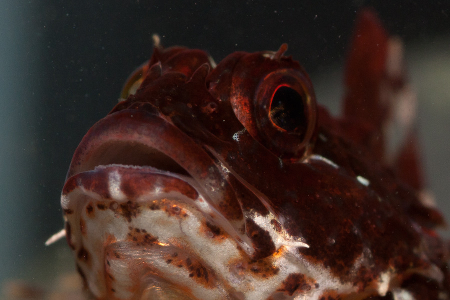
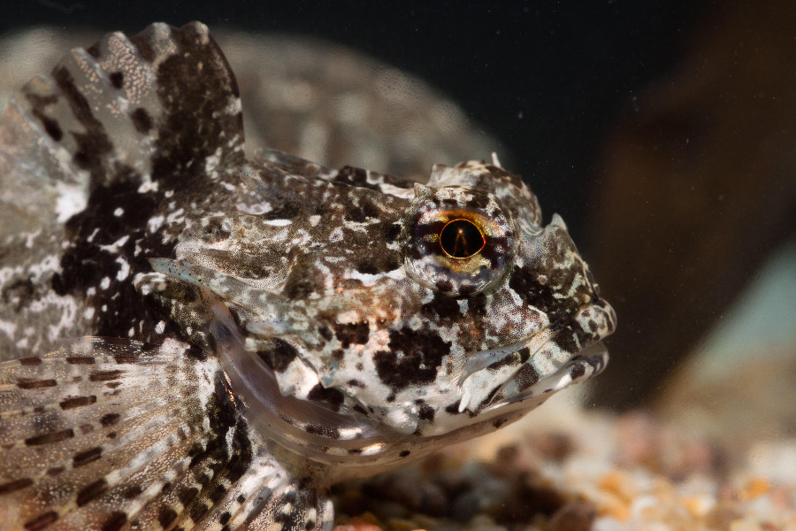

<article class="main-info">

_D-Seebull;_
_GB-Longspines sea-scorpion, longspined bullhead;_
_DK-Langtornet Ulk;_
_PL-Kur głowacz;_
_EST-Meripühvel;_
_RU-Бычок-буйвол;_
_FIN-Piikkisimppu;_
_S-Oxsimpa_

### Erkennungsmerkmale

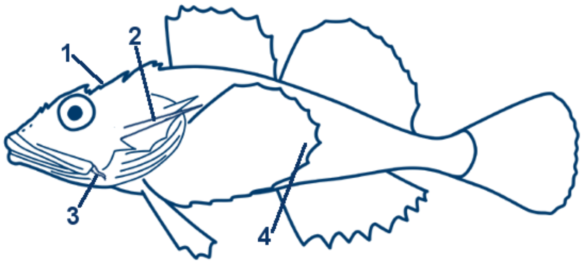

1. Kopf stark gepanzert mit Dornen auf der Kopfoberseite.
2. Oberster Dorn auf dem Vorkiemendeckel reicht bis hinter den Kiemendeckel.
3. 1 bis 2 kleine Barteln an der Maulspalte.
4. Brustflossen fächerartig vergrößert, bis zur zweiten Rückenflosse reichend.

* Köper oliv-braun mit vier dunklen breiten Streifen auf der Flanke; Flossen gefleckt; während der Fortpflanzungszeit Bauch der Männchen gelb-orange, bei den Weibchen blau-grün.

Meist 12 bis 15 cm, maximal bis zu 18 cm lang.

### Ähnliche Arten

* [Seeskorpion](#seeskorpion) - Bauch mit weißen Flecken; kürzere Dornen auf dem Vorkiemendeckel; ohne Barteln.
* [Vierhörniger Seeskorpion](#vierhörniger-seeskorpion) - 4 Hörner auf dem Kopf; Körper mehr oder weniger einheitlich gefärbt.

### Lebensweise

Bodenlebend: bevorzugt steinige Habitate bis in 30 m (selten 100 m) Tiefe; kommt auch in Seegraswiesen und Gezeitentümpeln vor.
Geschlechtsreif mit 2 Jahren; Fortpflanzungszeit von Februar bis Mai.

### Ernährung

Ernährt sich von Fischbrut, Schlangensternen, Schnecken und Krebstieren.

### Bedeutung

Ohne wirtschaftliche Bedeutung.

</article>

<!-- class="sub-info" -->
> #### Taurulus bubalis
>
> __Familie:__ Cottidae
>
> __Ordnung:__ Scorpaeniformes
>
> 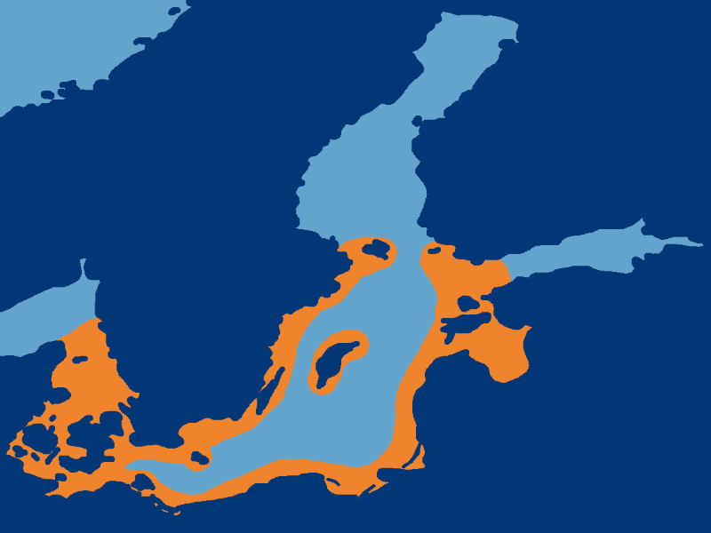
>
> __Verbreitung:__ Kommt küstennah in der gesamten Ostsee vor, mit Ausnahme des Bottnischen Meerbusens und dem Golf von Finland.
>
> __Häufigkeit:__ häufig
>
> __Gefährdung:__ nicht gefährdet

## Seeskorpion

<article class="main-info">

_D-Seeskorpion;_
_GB-Bull-rout, Shorthorn sculpin;_
_DK-Ulk;_
_PL-Kur diabeł;_
_LT-Builis;_
_LV-Ziemeļu buļļzivs;_
_EST-Nolgus;_
_RU-Европейский керчак;_
_FIN-Isosimppu;_
_S-Rötsimpa;_

### Erkennungsmerkmale

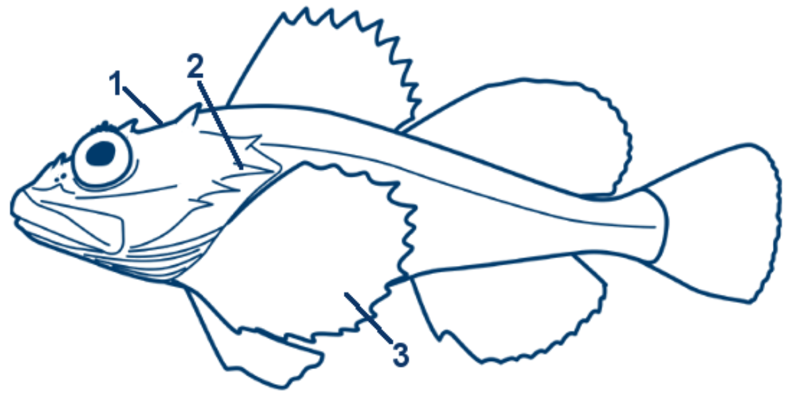

1. Kopf stark gepanzert mit Dornen auf der Kopfoberseite.
2. Zwei Stacheln auf dem Vorkiemendeckel, die nicht zum Ende des Kiemendeckels reichen.
3. Brustflossen fächerartig vergrößert und bis zur zweiten Rückenflosse reichend.

* Dunkle Flecken auf Kopf und Rücken; Seiten gelblich mit weißlichen Flecken.
  In der Fortpflanzungszeit Bauch der Männchen rot mit weißen Flecken.

Meist 12 bis 20 cm, bis zu 30 cm in der Ostsee, maximal bis zu 60 cm in der Arktis.

### Ähnliche Arten

* [Seebull](#seebull) - Dorn auf dem Vorkiemendeckel reicht bis hinter den Kiemendeckel; 1 bis 2 kleine Barteln an der Maulspalte.
* [Vierhörniger Seeskorpion](#vierhörniger-seeskorpion) - 4 Hörner auf dem Kopfe; Körper mehr oder weniger einheitlich gefärbt.

### Lebensweise

Bodenlebend: bevorzugt steinige und gemischte Habitate; gelegentlich in Seegrasbetten; auch in kaum salzigem Wasser.
Erreicht die Geschlechtsreife mit 2 Jahren; hat eine interne Befruchtung; die Brut wird in Paketen abgegeben.

### Ernährung

Ernährt sich von Fischbrut, Fischlarven und Krebstieren.

### Bedeutung

Nicht kommerziell befischt; wird als Köderfisch verwendet; Speisefisch in Grönland

</article>

<!-- class="sub-info" -->
> #### Myoxocephalus scorpius
>
> __Familie:__ Cottidae
>
> __Ordnung:__ Scorpaeniformes
>
> 
>
> __Verbreitung:__ In der gesamten Ostsee verbreitet.
>
> __Häufigkeit:__ häufig
>
> __Gefährdung:__ nicht gefährdet

## Schiffshalter

<article class="main-info">

_D-Schiffshalter;_
_GB-Common remora, shark sucker;_
_DK-Sugefisk;_
_PL-Remora;_
_LT-Ryklių prielipos;_
_EST-Haihoidja;_
_RU-Обыкновенная рыба-прилипало;_
_FIN-Remora;_
_S-Sugfisk_

### Erkennungsmerkmale

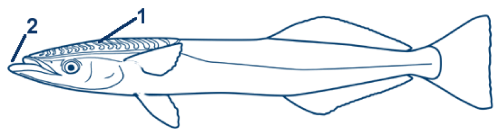

1. Erste Rückenflosse in eine Saugscheibe umgewandelt; diese liegt über dem Kopf und reicht bis auf die Höhe der Brustflossen.
2. Vorstehender Unterkiefer.

* Körper dunkel grau-braun.

Meist 40 cm, maximal bis zu 80 cm lang.

### Ähnliche Arten

\- Unverwechselbar

### Lebensweise

Kommt bis in 100 m Tiefe vor; meist an der Unterseite von Haien oder Rochen angeheftet, aber auch an anderen großen Fischen und Schildkröten.
Remoras können gelegentlich auch freischwimmend angetroffen werden.

### Ernährung

Ernährt sich von Futterresten und Parasiten (meist Krebstieren) ihrer Transportwirte.

### Bedeutung

Ohne wirtschaftliche Bedeutung.

</article>

<!-- class="sub-info" -->
> #### Remora remora
>
> __Familie:__ Echeneidae
>
> __Ordnung:__ Carangiformes
>
> 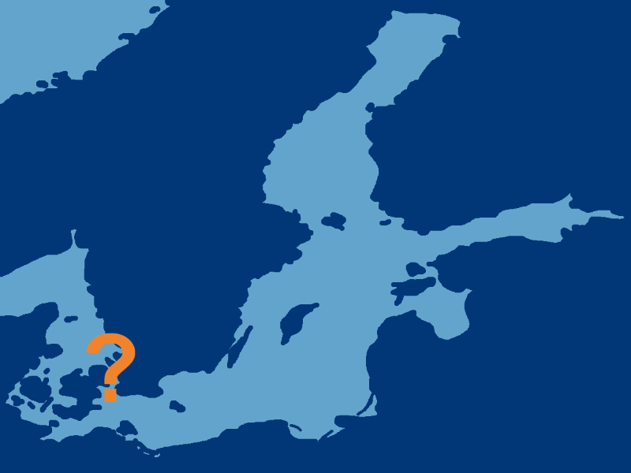
>
> __Verbreitung:__ Als Irrgast bis Öresund.
>
> __Häufigkeit:__ sehr selten
>
> __Gefährdung:__ nicht gefährdet

## Stöcker

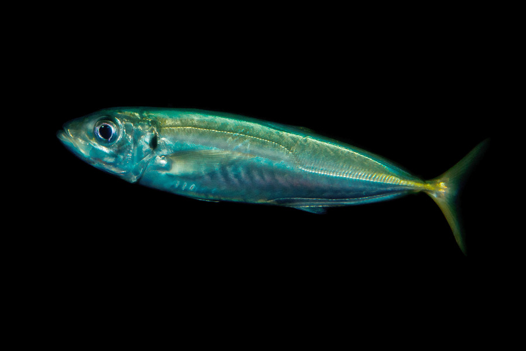
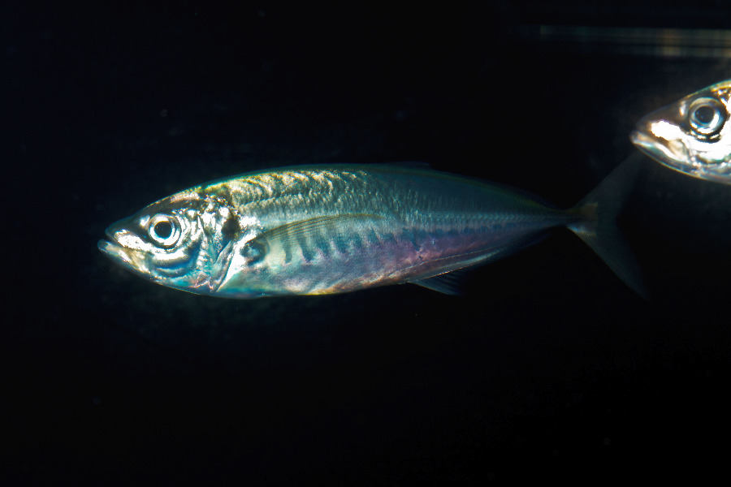
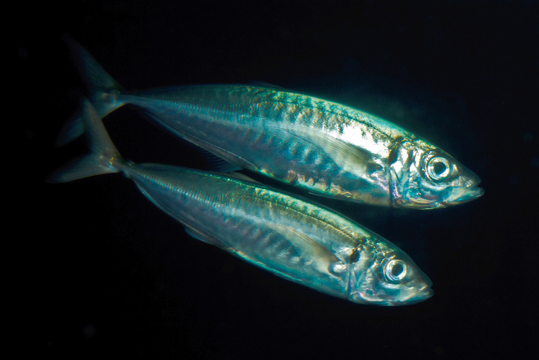

<article class="main-info">

_D-Stöcker, Pferdemakrele, Bastardmakrele, Holzmakrele;_
_GB-Horse mackerel;_
_DK-Hestemakrel;_
_PL-Ostrobok;_
_LT-Paprastoji stauridė;_
_EST-Harilik stauriid;_
_RU-Обыкновенная ставрида;_
_FIN-Piikkimakrilli;_
_S-Taggmakrill_

### Erkennungsmerkmale

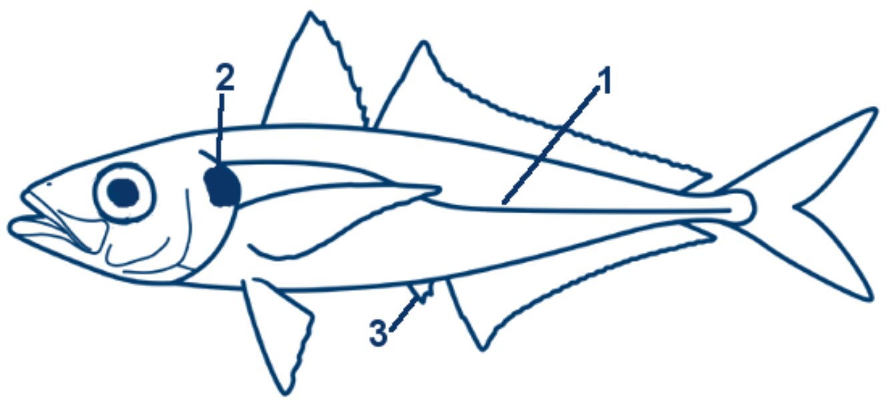

1. Große, plattenartige Schuppen entlang der Seitenlinie.
2. Schwarzer Fleck am oberen hinteren Ende des Kiemendeckels.
3. Die 3 ersten Stacheln stehen getrennt von der Afterflosse.

* Färbung silber glänzend; Rücken dunkler.

Meist 20 bis 30 cm, max. bis zu 40 cm lang.

### Ähnliche Arten

* [Makrele](#makrele) - kleine Flösselchen hinter Rücken- und Afterflosse; Rücken blau-grünlich mit dunklen Streifen.
* [Gabelmakrele](#gabelmakrele) - freie Stacheln statt erste Rückenflosse.

### Lebensweise

Lebt in großen Schwärmen, während des Sommers küstennah.
Wird mit 3 bis 4 Jahren geschlechtsreif.
Weibchen legen bis zu 130.000 Eier; Jungtiere halten sich gerne unter Quallen auf.

### Ernährung

Ernährt sich von Fischen, Krebsen und kleinen Tintenfischen.

Bedeutung

In Nordeuropa zu Fischmehl verarbeitet; in Südeuropa als Speißefisch genutzt (frisch, geräuchert oder als Konserve).

</article>

<!-- class="sub-info" -->
> #### Trachurus trachurus
>
> __Familie:__ Carangidae
>
> __Ordnung:__ Carangiformes
>
> 
>
> __Verbreitung:__ Kommt im Kattegat vor.
>
> __Häufigkeit:__ regelmäßig
>
> __Gefährdung:__ nicht gefährdet

## Gabelmakrele

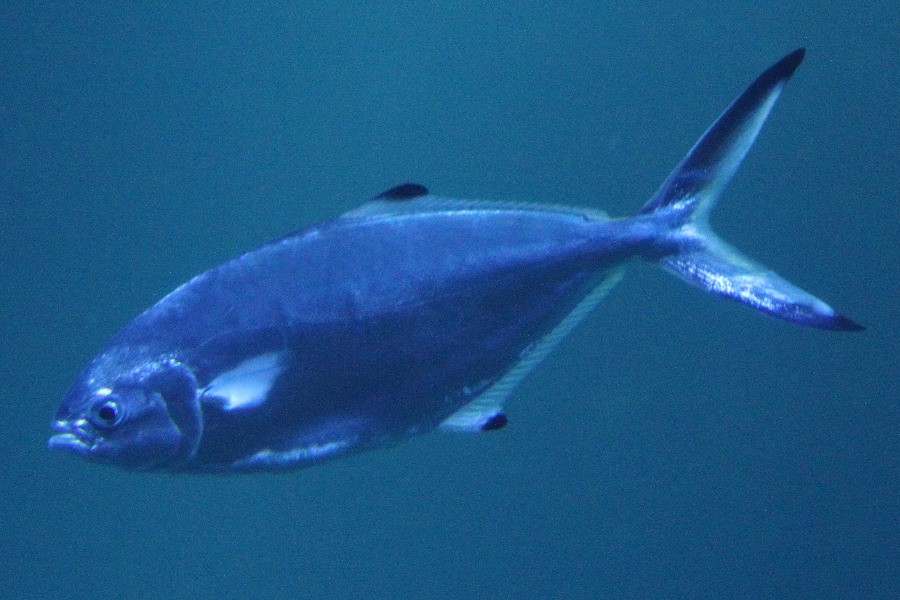
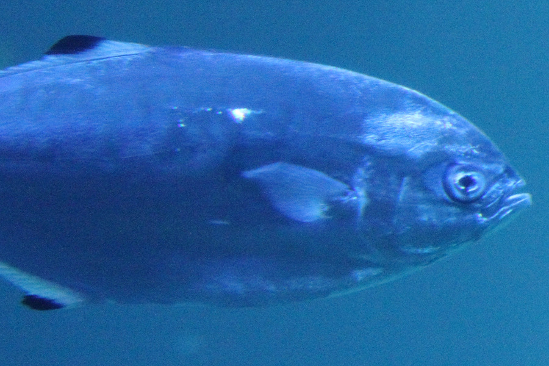

<article class="main-info">

_D-Gabelmakrele, Palometa;_
_GB-Pompano;_
_DK-Gaffelmakrel;_
_PL-Glałka;_
_LT-Europinis pompanas ;_
_RU-Помпано;_
_S-Pompano_

### Erkennungsmerkmale

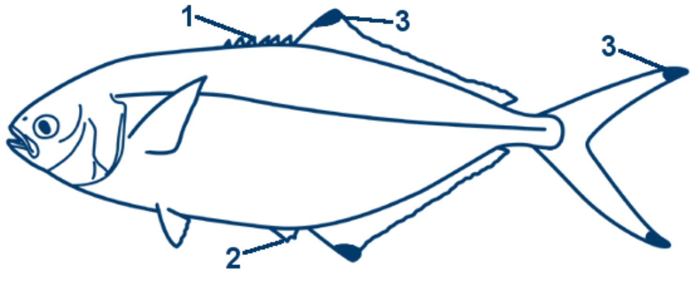

1. 6 frei stehende Stacheln vor der Rückenflosse.
2. Erste Stacheln der Afterflosse stehen separat.
3. Rücken-, After- und Schwanzflosse mit schwarzen Spitzen.

* (Häufig) 3 bis 5 schwarze, ovale Flecken entlang der Seitenlinie.
* Färbung silber glänzend mit weißlichem Schimmer.

Meist 30 cm, maximal bis zu 70 cm lang.

### Ähnliche Arten

* [Stöcker](#stöcker) - mit zwei Rückenflossen.

### Lebensweise

Lebt küstennah in kleinen Gruppen, in klarem Wasser.
Laicht im Sommer; Eier werden im Freiwasser abgegeben.

### Ernährung

Frisst Fische, Krebstiere und Schnecken.

### Bedeutung

In Südeuropa von wirtschaftlicher Bedeutung; in Nordeuropa ohne kommerzielle Bedeutung.

</article>

<!-- class="sub-info" -->
> #### Trachinotus ovatus
>
> __Familie:__ Carangidae
>
> __Ordnung:__ Carangiformes
>
> 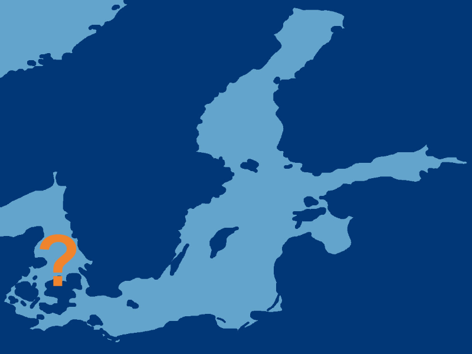
>
> __Verbreitung:__ Kommt als Irrgast in der westlichen ostsee vor.
>
> __Häufigkeit:__ sehr selten
>
> __Gefährdung:__ nicht gefährdet

## Brachsenmakrele

<article class="main-info">

_D-Brachsenmakrele;_
_GB-Atlantic pomfret;_
_DK-Havbrasen;_
_PL-Brama;_
_EST-Atlandi merilatikas;_
_RU-Атлантический морской лещ;_
_FIN-Merilahna;_
_S-Havsbraxen_

### Erkennungsmerkmale

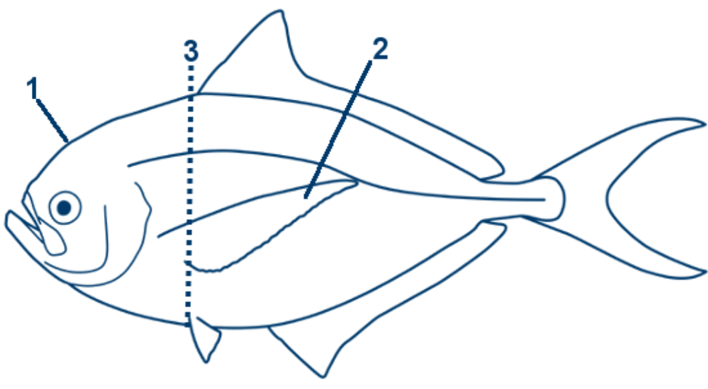

1. Kopfprofil gerundet.
2. Lange sichelförmige Brustflossen.
3. Bauch-, Brust- und Rückenflosse entspringen etwa auf derselben Höhe.

* Rücken- und Afterflosse mit Schuppen bedeckt.
* Seitlich abgeflacht, Körper hoch, mit einheitlicher schwarzer (bis schwarzsilberner) Färbung.

Meist 40 bis 55 cm, maximal bis zu 70 cm lang.

### Ähnliche Arten

* [Segelflossen-Brachsenmakrele](#segelflossen-brachsenmakrele) - Kopfprofil flach bis konvex; Bauchflosse beginnt deutlich vor der Rückenflosse.
* [Langflossen Brachsenmakrele](#langflossen-brachsenmakrele) - vordere Teile der Rücken und Afterflosse stark verlängert.
* [Silberbrassen](#silberbrassen) - Rücken- und Afterflosse entspringen auf derselben Höhe; Auge größer als Maullänge.

### Lebensweise

Unternimmt größere Wanderungen; kommt in kleinen Schwärmen auch oberflächennah vor; selten küstennah; bevorzugt Kontinentalhänge.
Laichzeit von August bis September in größeren Tiefen; Jungtiere halten sich vermutlich in tieferen Wasserschichten auf.

### Ernährung

Ernährt sich von kleineren Fischen und Krebsen.

### Bedeutung

Wird mit Langleinen in 90 bis 100 m Tiefe gefangen; vor allem in Spanien gefrohren oder frisch angeboten.
Wird auch als Köder in der Schwertfischfischerei verwendet.

</article>

<!-- class="sub-info" -->
> #### Brama brama
>
> __Familie:__ Bramidae
>
> __Ordnung:__ Perciformes
>
> 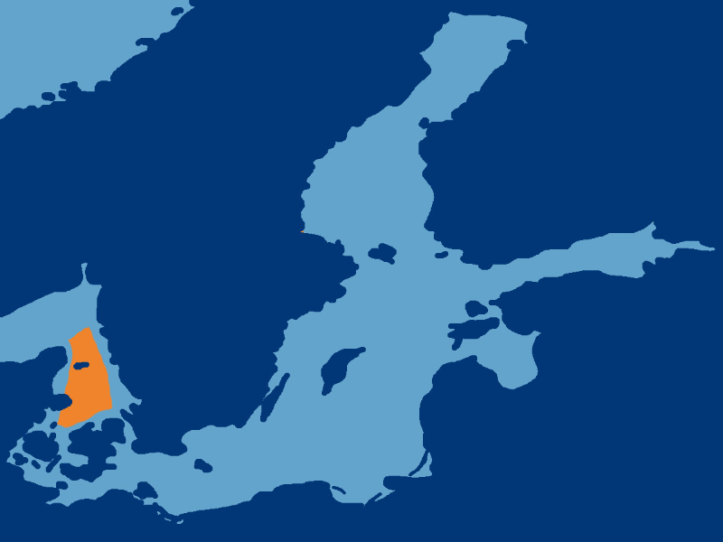
>
> __Verbreitung:__ Kommt im Kattegat vor.
>
> __Häufigkeit:__ selten
>
> __Gefährdung:__ nicht gefährdet

## Segelflossen-Brachsenmakrele

<article class="main-info">

_D-Segelflossen-Brachsenmakrele;_
_GB-Rough pomfret;_
_DK-Højfinnet havbrasen;_
_EST-Kare ogamerilatik;_
_RU-Малый морской лещ;_
_S-Högfenad havsbraxen_

### Erkennungsmerkmale

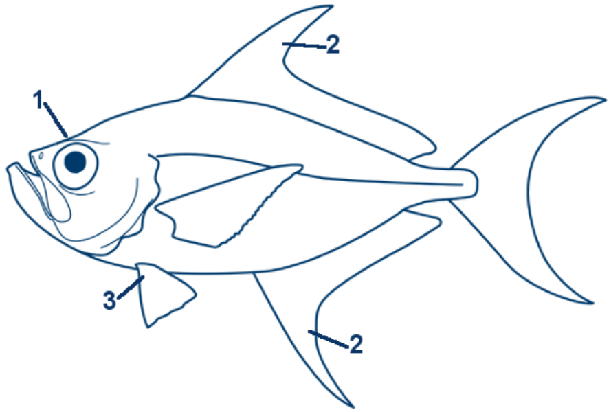

1. Profil über den Augen gerade oder sogar leicht nach innen gebogen.
2. Rücken- und Afterflosse sichelartig ausgezogen.
3. Bauchflossen beginnen deutlich vor der Rückenflosse.

* Rücken- und Afterflosse mit Schuppen bedeckt.
* Körper hoch und seitlich abgeflacht; mit einheitlich silbern-brauner bis silbern-schwarzer Färbung.

Bis zu 50 cm lang.

### Ähnliche Arten

* [Brachsenmakrele](#brachsenmakrele) - Kopfprofil gerundet; Bauch-, Brust- und Rückenflosse beginnen auf derselben Höhe.
* [Langflossen Brachsenmakrele](#langflossen-brachsenmakrele) - Kopfprofil stark nach außen gewölbt.
* [Silberbrassen](#silberbrassen) - Rücken- und Afterflosse entspringen auf derselben Höhe; Auge größer als Maullänge.

### Lebensweise

Kommt an den Kontinentalhängen vor, nicht küstennah; bevorzugt wärmere Gewässer.
Die Fortpflanzung findet vor allem in den Subtropen statt.

### Ernährung

Ernährt sich von kleineren Fischen und Krebsen.

### Bedeutung

Ohne wirtschaftliche Bedeutung, da nirgendwo häufig.

</article>

<!-- class="sub-info" -->
> #### Taractes asper
>
> __Familie:__ Bramidae
>
> __Ordnung:__ Perciformes
>
> 
>
> __Verbreitung:__ Als seltener Irrgast in der westlichen Ostsee.
>
> __Häufigkeit:__ sehr selten
>
> __Gefährdung:__ unklar

## Langflossen Brachsenmakrele

<article class="main-info">

_D-Langflossen-Brachsenmakrele;_
_GB-Big-scale pomfret ;_
_DK-Langfinnet havbrasen;_
_PL-Największe gatunki;_
_FIN-Sirppipomfretti;_
_S-Långfenad havsbraxen_

### Erkennungsmerkmale

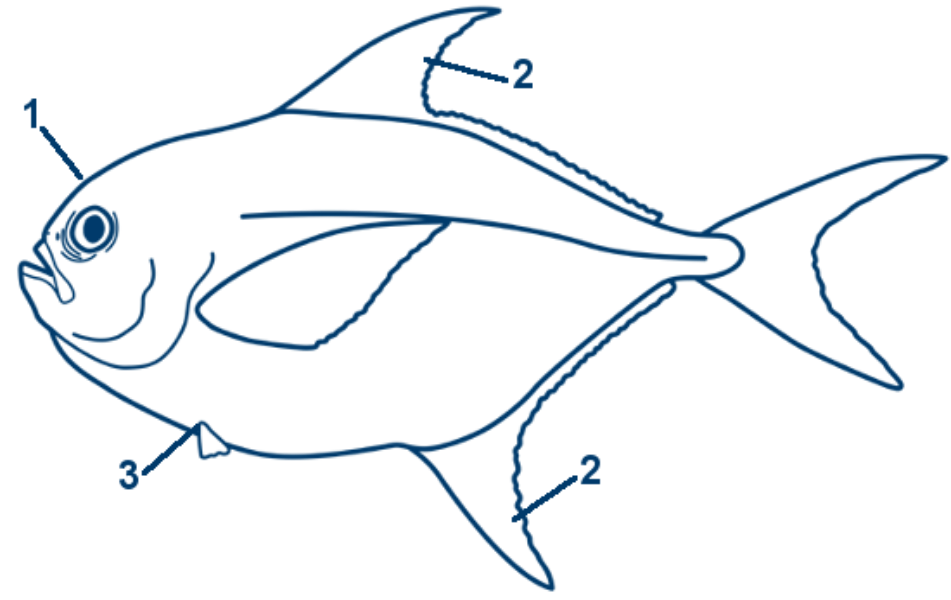

1. Kopfprofil über den Augen sehr stark nach außen gekrümmt.
2. Rücken- und Afterflosse sichelförmig ausgezogen.
3. Bauchflossen beginnen vor der Rückenflosse.

* Rücken- und Afterflosse mit Schuppen bedeckt.
* Körper hoch und seitlich zusammengedrückt; Färbung einheitlich silbern-schwarz bis bläulich; Flossen oft mit weißen Rändern.

Bis zu 100 cm lang.

### Ähnliche Arten

* [Brachsenmakrele](#brachsenmakrele) - Bauch-, Brust- und Rückenflosse beginnen auf derselben Höhe; vorderer Teil der Afterflosse nur wenig verlängert.
* [Segelflossen-Brachsenmakrele](#segelflossen-brachsenmakrele) - Kopfprofil flach oder nach innen gebogen.
* [Silberbrassen](#silberbrassen) - Rücken- und Afterflosse entspringen auf derselben Höhe; Auge größer als Maullänge.

### Lebensweise

Unternimmt große Wanderungen, vor allem im Freiwasser, selten küstennah.
Erwachsene häufig als Einzelgänger, Jungtiere in kleineren Schwärmen.
Die Fortpflanzung findet vor allem in den Subtropen statt.

### Ernährung

Frisst Krebstiere und Tintenfische.

### Bedeutung

Ohne wirtschaftliche Bedeutung, da nirgendwo häufig.

</article>

<!-- class="sub-info" -->
> #### Taractichthys longipinnis
>
> __Familie:__ Bramidae
>
> __Ordnung:__ Perciformes
>
> 
>
> __Verbreitung:__ Seltener Irrgast in der westlichen Ostsee.
>
> __Häufigkeit:__ sehr selten
>
> __Gefährdung:__ unklar

## Silberbrassen

<article class="main-info">

_D-Silberbrassen;_
_GB-Silver pomfret, Atlantic fanfish;_
_DK-Sølvbrasen;_
_PL-Brama srebrzysta;_
_EST-Harilik purilatikas;_
_RU-Атлантический серебристый морской лещ;_
_S-Fengömmare_

### Erkennungsmerkmale

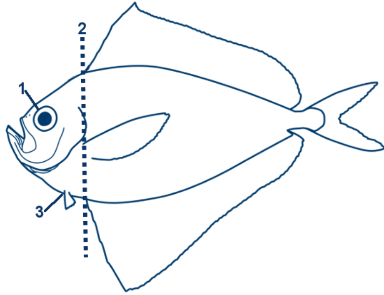

1. Auge sehr groß (größer als Schnauzenlänge).
2. Rücken-, Brust- und Afterflosse entspringen etwa auf derselben Höhe.
3. Bauchflossen entspringen vor der Rückenflosse.

* Rücken- und Afterflosse mit Schuppen bedeckt; nicht sichelartig ausgezogen.
* Körper hoch und seitlich zusammengedrückt; einheitlich silbern bis kupferfarben.

Bis zu 46 cm lang.

### Ähnliche Arten

* [Brachsenmakrele](#brachsenmakrele) - Afterflosse beginnt deutlich hinter dem Rückenflossenansatz; Afterflosse weniger lang ausgezogen als Rückenflosse.
* [Segelflossen-Brachsenmakrele](#segelflossen-brachsenmakrele) - Afterflosse beginnt deutlich hinter dem Rückenflossenansatz; vordere Teile von Rücken- und Afterflosse stark ausgezogen.
* [Langflossen Brachsenmakrele](#langflossen-brachsenmakrele) - Afterflosse beginnt deutlich hinter dem Rückenflossenansatz; vordere Teile von Rücken- und Afterflosse stark ausgezogen.

### Lebensweise

Unternimmt saisonale Wanderungen; lebt im offenen Wasser bis in Tiefen von 400 m.

### Ernährung

Unbekannt.

### Bedeutung

Ohne wirtschaftliche Bedeutung.

</article>

<!-- class="sub-info" -->
> #### Pterycombus brama
>
> __Familie:__ Bramidae
>
> __Ordnung:__ Perciformes
>
> 
>
> __Verbreitung:__ Irrgast in der westlichen Ostsee.
>
> __Häufigkeit:__ sehr selten
>
> __Gefährdung:__ unklar

## Rote Fleckbrassen

<article class="main-info">

_D-Rote Fleckbrasse, Graubarsch;_
_GB-Red sea bream, Blackspot seabream;_
_DK-Blankesten;_
_PL-Morlesz;_
_EST-Mustlaik-besuugo;_
_RU-Краснопёрый пагель;_
_FIN-Pikkupagelli;_
_S-Fläckpagell_

### Erkennungsmerkmale

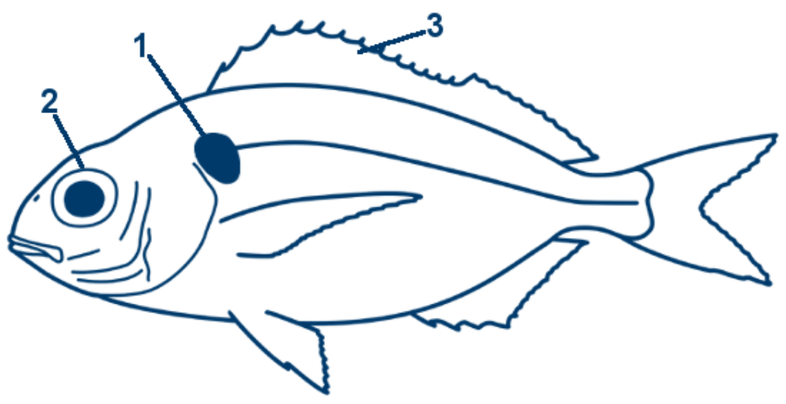

1. Großer schwarzer Fleck über der Basis der Brustflosse.
2. Augendurchmesser größer als Schnauzenlänge.
3. Eine lange Rückenflosse mit Stacheln im vorderen Teil.

* Körper silbern-rot, mit stärker gefärbten Flossen.

Meist 20 bis 25 cm, max. bis zu 60 cm lang.

### Ähnliche Arten

* [Brandbrassen](#brandbrassen) - ohne schwarzen Fleck über der Brustflossenbasis; Augendurchmesser entspricht Schnauzenlänge.

### Lebensweise

Lebt als Schwarmfisch über unterschiedlichen Untergründen bis in Tiefen von 400 m, gelegentlich bis zu 700 m; Jungtiere auch küstennah.
Nach der Geschlechtsreife männlich; mit einer Länge von 20 bis 30 cm in Weibchen umwandelnd.

### Ernährung

Frisst Krebse, Schnecken, Würmer und kleinere Fische.

### Bedeutung

Wirtschaftlich wichtiger Speißefisch.

</article>

<!-- class="sub-info" -->
> #### Pagellus bogaraveo
>
> __Familie:__ Sparidae
>
> __Ordnung:__ Perciformes
>
> 
>
> __Verbreitung:__ Kommt im Kattegat vor; als Irrgast in der westlichen Ostsee.
>
> __Häufigkeit:__ selten
>
> __Gefährdung:__ nicht gefährdet

## Brandbrassen

<article class="main-info">

_D-Streifenbrasse;_
_GB-Black seabram;_
_DK-Havrude;_
_PL-Kantar;_
_LT-Juodosios jūros kantaras;_
_EST-Triibuline hammaskoger;_
_RU-Карась-многозуб;_
_FIN-Meriruutana;_
_S-Havsruda_

### Erkennungsmerkmale

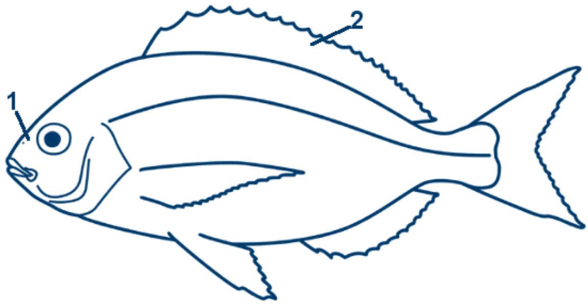

1. Schnauze so lang wie oder länger als Augendurchmesser.
2. Eine lange Rückenflosse mit Stachelstrahlen im vorderen Teil.

* Körper bläulich-silbern (nach dem Tod silbern), gelegentlich mit zahlreichen Querstreifen.

Meist 20 bis 30 cm, max. bis zu 60 cm lang.

### Ähnliche Arten

* [Rote Fleckbrassen](#rote-fleckbrassen) - Augendurchmesser größer als Schnauzenlänge; schwarzer Fleck über der Brustflossenbasis; rötliche Grundfärbung.

### Lebensweise

Lebt über Seegraswiesen und sandigen bis steinigen Untergründen, bis in eine Tiefe von 300 m.
Formt gelegentlich große Schwärme.
Wird mit ein bis zwei Jahren zum Weibchen und später dann zum Männchen.
Laichzeit von Februar bis Mai; die Männchen verteidigen die Eier, die vom Weibchen in eine Grube auf dem Boden gelegt wurden; der Schlupf erfolgt nach etwa 9 Tagen.

### Ernährung

Frisst Algen und Seegras, sowie kleine Krebstiere und andere Wirbellose.

### Bedeutung

Wichtiger Speisefisch.

</article>

<!-- class="sub-info" -->
> #### Spondyliosoma canthurus
>
> __Familie:__ Sparidae
>
> __Ordnung:__ Perciformes
>
> 
>
> __Verbreitung:__ Kommt im Kattegat bis zum Öresund vor.
>
> __Häufigkeit:__ selten
>
> __Gefährdung:__ unklar

## Adlerfisch

<article class="main-info">

_D-Adlerfisch, Umberfisch;_
_GB-Meagre, croaker;_
_DK-Ørnefisk, orłoryb;_
_PL-Kulbin;_
_EST-Harilik hõbekotkaskala;_
_RU-Обыкновенный серебристый горбыль;_
_FIN-Kotkakala;_
_S-Havsgös_

### Erkennungsmerkmale

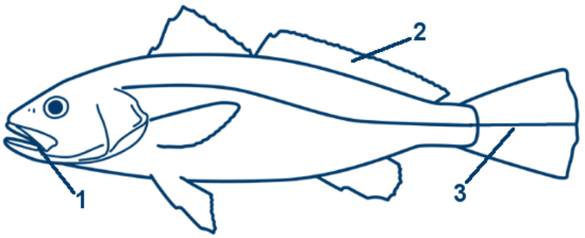

1. Niedrig sitzendes großes Maul.
2. Zweite Rückenflosse mehr als zwei mal so lang als erste.
3. Seitenlinie erstreckt sich bis auf die Schwanzflosse.

* Flanken silbern, Bauch weiß, Rücken grau-braun.

Meist etwa 50 cm, max. bis zu 200 cm lang.

### Ähnliche Arten

* [Wolfsbarsch](#wolfsbarsch) - zwei gleich lange Rückenflossen; schwarzer Fleck am Ende des Kiemendeckels; Schwanzflosse gegabelt.

### Lebensweise

Hält sich oft in der Nähe von Wracks und Felsen über Sandgrund auf, aber auch nahe der Oberfläche.
Jungtiere bilden Schwärme.
Adlerfische folgen oft Meeräschenschwärmen.
Laichzeit im Frühling und Sommer, nahe der Küste.
Unternimmt temperaturabhängige Wanderungen.

### Ernährung

Frisst fische und schwimmende Krebstiere.

### Bedeutung

Wichtiger Speiße- und Sportfisch.

</article>

<!-- class="sub-info" -->
> #### Argyrosomus regius
>
> __Familie:__ Sciaenidae
>
> __Ordnung:__ Perciformes
>
> 
>
> __Verbreitung:__ Kommt als Irrgast im Kattegat und Öresund vor.
>
> __Häufigkeit:__ selten
>
> __Gefährdung:__ unklar

## Flussbarsch

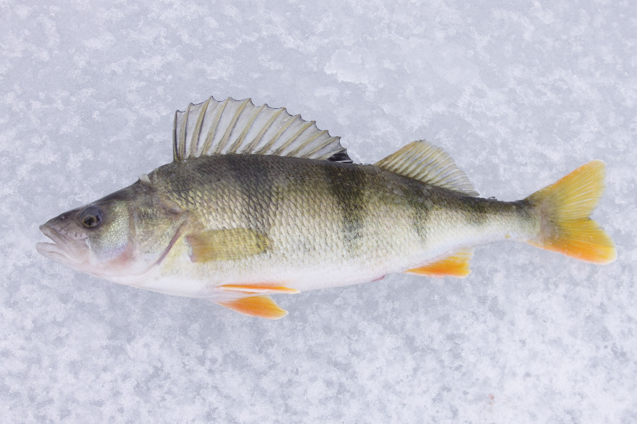
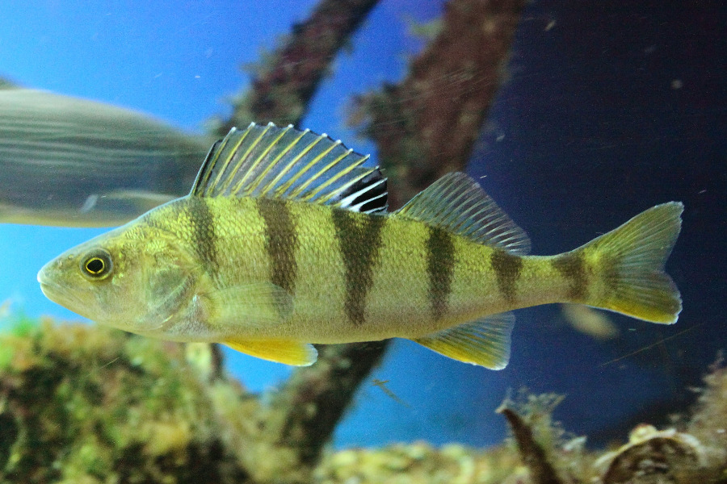
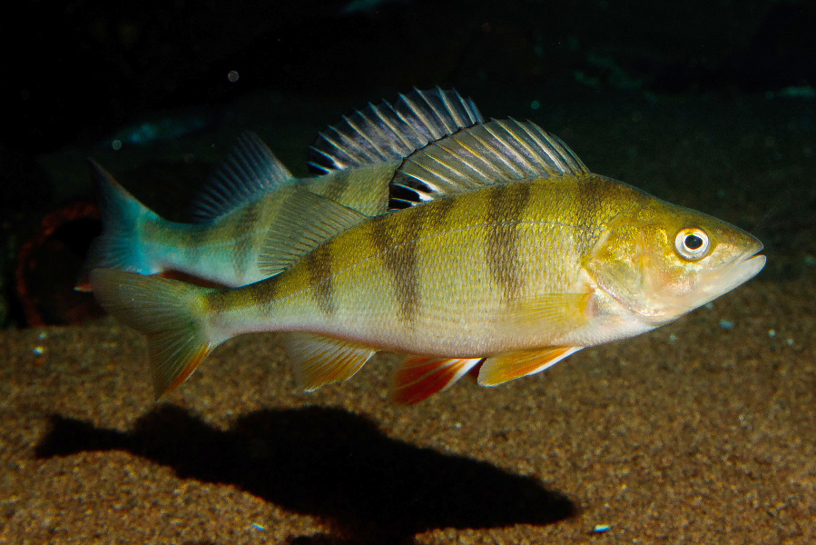

<article class="main-info">

_D-Flussbarsch;_
_GB-Perch, European perch;_
_DK-Aborre;_
_PL-Okoń pospolity;_
_LT-Ešerys;_
_LV-Asaris;_
_EST-Ahven;_
_RU-Речной окунь;_
_FIN-Ahven;_
_S-Abborre_

### Erkennungsmerkmale

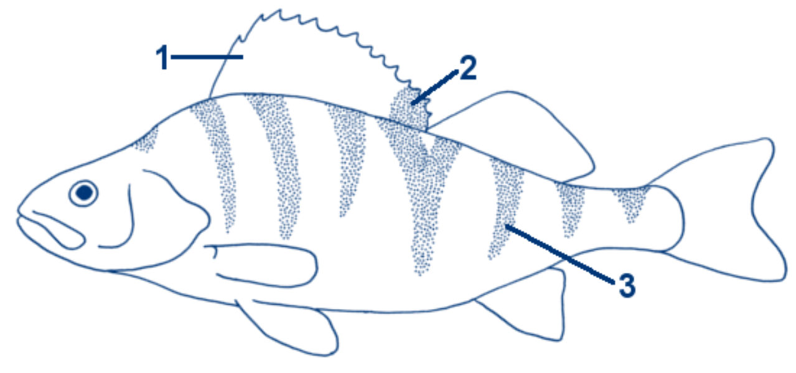

1. Zwei Rückenflossen; die erste mit starken Stacheln.
2. Schwarzer Fleck im hinteren Teil der ersten Rückenflosse.
3. Seiten mit 5 bis 8 schwarzen Streifen, die sich bis auf die untere Körperhälfte erstrecken, aber nicht bis auf den Bauch.

* Körpergrundfarbe bräunlich bis gelblich; Bauch- und Afterflossen orange bis rot.

Meist 20 bis 30 cm, maximal bis 60 cm lang.

### Ähnliche Arten

* [Kaulbarsch](#kaulbarsch) - beide Rückenflossen gehen ineinander über; viele kleine schwarze Flecken auf Rücken- und Afterflosse.
* [Zander](#zander) - viele kleine Flecken auf Rücken- und Schwanzflosse; Kopf länger.
* [Wolfsbarsch](#wolfsbarsch) - einheitlich silbern; Rückenflosse ohne dunklen Fleck.

### Lebensweise

Tagaktiv; hält sich nahe am Boden auf zwischen Pflanzen, Wurzeln und Steinen.
Erwachsene sind Einzelgänger; Jungtiere bilden Schwärme.
Laicht zwischen Februar und Juli.
Flussbarsche benötigen über mehrere Monate weniger als 10°C Wassertemperatur um Laich anzusetzen.

### Ernährung

Frisst kleinere Fische und Insektenlarven.

### Bedeutung

Lokal von hoher wirtschaftlicher Bedeutung.

### Gefährdung

Nicht gefährdet.

</article>

<!-- class="sub-info" -->
> #### Perca fluviatilis
>
> __Familie:__ Percidae
>
> __Ordnung:__ Perciformes
>
> 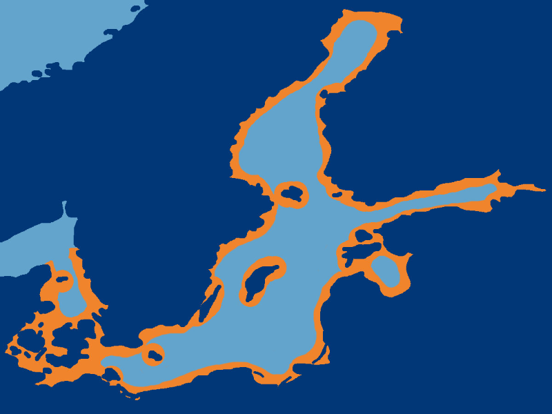
>
> __Verbreitung:__ Kommt küstennah in der gesamten Ostsee vor.
>
> __Häufigkeit:__ sehr häufig
>
> __Gefährdung:__ nicht gefährdet

## Zander

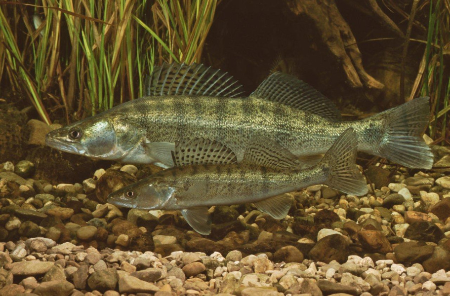
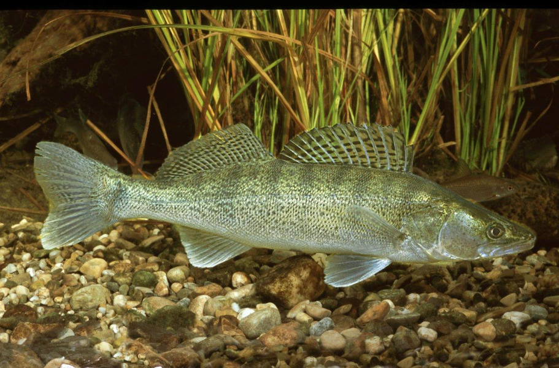

<article class="main-info">

_D-Zander;_
_GB-Pike-perch, zander;_
_DK-Sandart;_
_PL-Sandacz;_
_LT-Starkis;_
_LV-Zandarts;_
_EST-Koha;_
_RU-Обыкновенный судак;_
_FIN-Kuha;_
_S-Gös_

### Erkennungsmerkmale

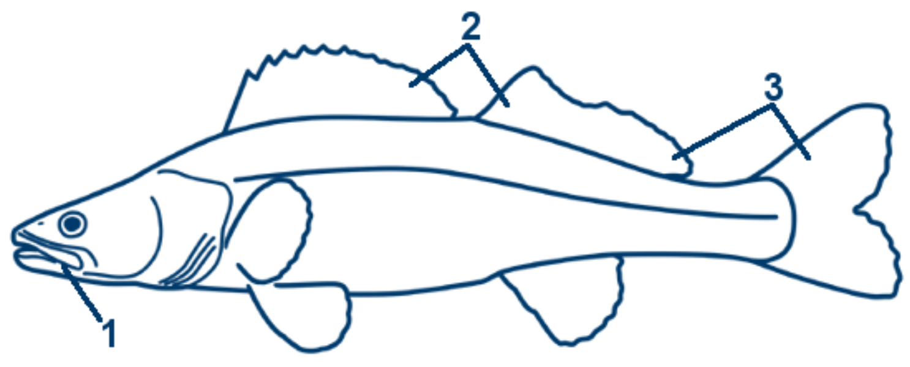

1. Maulspalte reicht bis unter das Auge; Maul mit großen Fangzähnen.
2. Zwei Rückenflosse; erste mit starken Stachelstrahlen.
3. Viele dunkle Flecken auf der Schwanz und Rückenflosse.

* Rücken grünlich bis gräuliche; Bauchseite weißlich; Flanken gelblich-bräunlich mit dunklen Flecken und vertikalen Streifen (mit dem Alter heller werden).

Meist 50 cm, maximal bis zu 100 cm lang.

### Ähnliche Arten

* [Flussbarsch](#flussbarsch) - schwarzer Fleck am Ende der ersten Rückenflosse; Streifenmusterung viel deutlicher ausgeprägt.
* [Kaulbarsch](#kaulbarsch) - beide Rückenflossen miteinander verschmolzen.
* [Wolfsbarsch](#wolfsbarsch) - schwarzer Fleck auf dem Kiemendeckel; Körper einheitlich silbern.

### Lebensweise

Lebt bevorzugt in langsam fließenden Flüssen und Ästuaren, aber auch küstennah in der Ostsee.
Fortpflanzungszeit von April bis Mai; Eier werden in eine Grube am Boden abgelegt und vom Männchen verteidigt.

### Ernährung

Frisst meist Fische unter 10 cm Länge.

### Bedeutung

Beliebter Speiße- und Angelfisch.

### Gefährdung

Nicht gefährdet.

</article>

<!-- class="sub-info" -->
> #### Sander lucioperca
>
> __Familie:__ Percidae
>
> __Ordnung:__ Perciformes
>
> 
>
> __Verbreitung:__ Kommt küstennah in der gesamten Ostsee vor.
>
> __Häufigkeit:__ häufig
>
> __Gefährdung:__ unklar

## Kaulbarsch

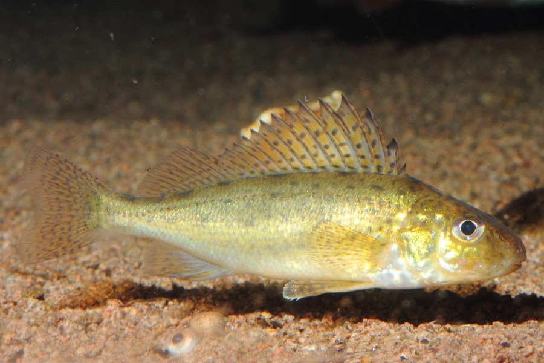
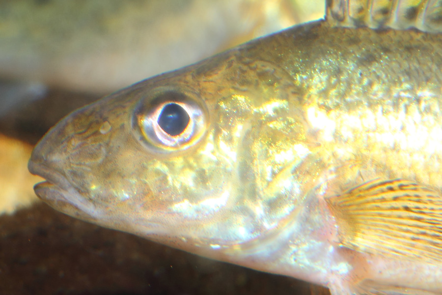

<article class="main-info">

_D-Kaulbarsch;_
_GB-Ruffe;_
_DK-Hork;_
_PL-Jazgarz;_
_LT-Pūgžlys;_
_LV-Ķīsis;_
_EST-Kiisk;_
_RU-Обыкновенный ёрш;_
_FIN-Kiiski;_
_S-Gärs_

### Erkennungsmerkmale

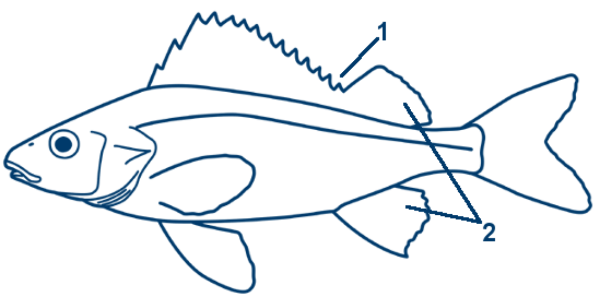

1. Eine Rückenflosse mit Einkerbung und Stacheln im vorderen Teil.
2. Viele schwarze Punkte auf der Rücken- und Afterflosse.

* Körper gelblich oder bräunlich; Rücken grünglich bis grau.

Meist um 12 cm, maximal bis zu 25 cm lang.

### Ähnliche Arten

* [Flussbarsch](#flussbarsch) - beide Rückenflossen nicht verschmolzen; schwarzer Fleck am Ende der ersten Rückenflosse; mit markanter Streifenmusterung auf dem Körper.

### Lebensweise

Lebt vor allem in langsam fließenden Flüssen, aber auch in der Ostsee; auch in sehr trüben Gewässern.
Fortpflanzungszeit von April bis Mai: die Eier werden in einer Grube auf dem Gewässerboden abgelegt und von den Eltern verteidigt.
Geschlechtsreif mit 1 bis 2 Jahren.

### Ernährung

Frisst Insektenlarven, Fischbrut, Würmer und Krebstiere.

### Bedeutung

Speißefisch, aber wegen seiner geringen Größe wenig genutzt; teilweise bei Fischern unbeliebt.

### Gefährdung

Nicht gefährdet.

</article>

<!-- class="sub-info" -->
> #### Gymnocephalus cernua
>
> __Familie:__ Percidae
>
> __Ordnung:__ Perciformes
>
> 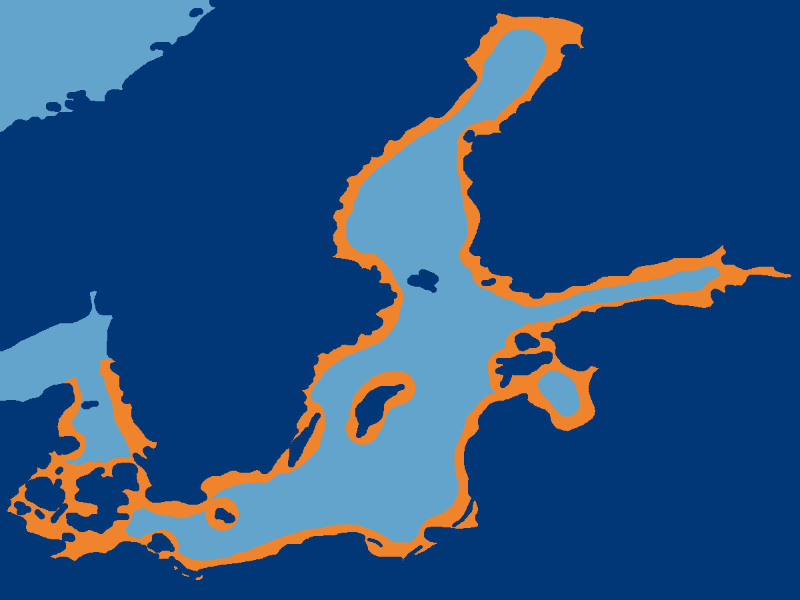
>
> __Verbreitung:__ Kommt küstennah in der gesamten Ostsee vor.
>
> __Häufigkeit:__ häufig
>
> __Gefährdung:__ unklar

## Steinpicker

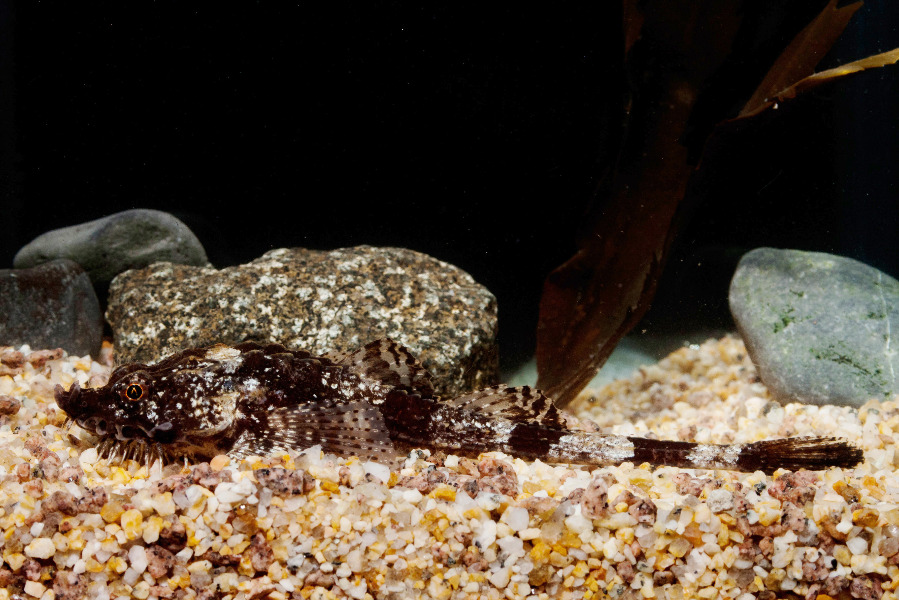
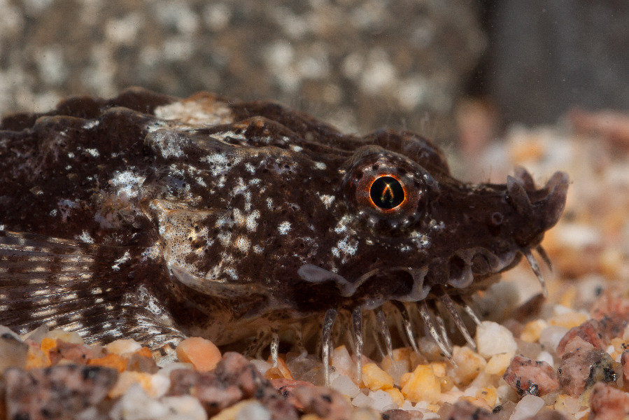

<article class="main-info">

_D-Steinpicker;_
_GB-Hooknose;_
_DK-Panserulk;_
_PL-Lisica;_
_EST-Rüühärg;_
_RU-Европейская лисичка;_
_FIN-Partasimppu;_
_S-Skäggsimpa_

### Erkennungsmerkmale

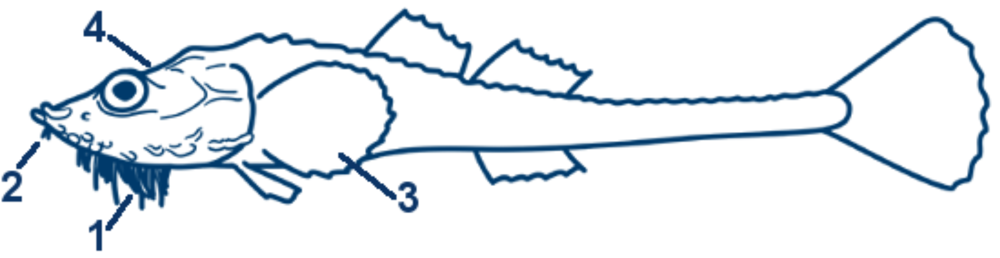

1. Viele Barteln auf der Kopfunterseite.
2. Zwei Paar Dornen auf der Schnauzenspitze.
3. Brustflossen fächerförmig vergrößert.
4. Kopf leicht abgeplattet.

Meist 13 bis 15 cm, maximal 21 cm lang.

### Ähnliche Arten

\- Unverwechselbar

### Lebensweise

Schwer zu entdeckender, bodenlebender Fisch.
Bevorzugt sandige Untergründe nahe der Küste und in Ästuaren; im Winter auch in tieferen Wasserschichten.
Geschlechtsreife mit einem Jahr; Eier werden auf Seegras zwischen Februar und April abgelegt.
Die Eier brauchen mit 10 bis 11 Monaten sehr lange für ihre Entwicklung.
Maximales Alter bis 3 Jahre.

### Ernährung

Frisst Krebstiere und Würmer.

### Bedeutung

Ohne wirtschaftliche Bedeutung.

</article>

<!-- class="sub-info" -->
> #### Agonus cataphractus
>
> __Familie:__ Agonidae
>
> __Ordnung:__ Scorpaeniformes
>
> 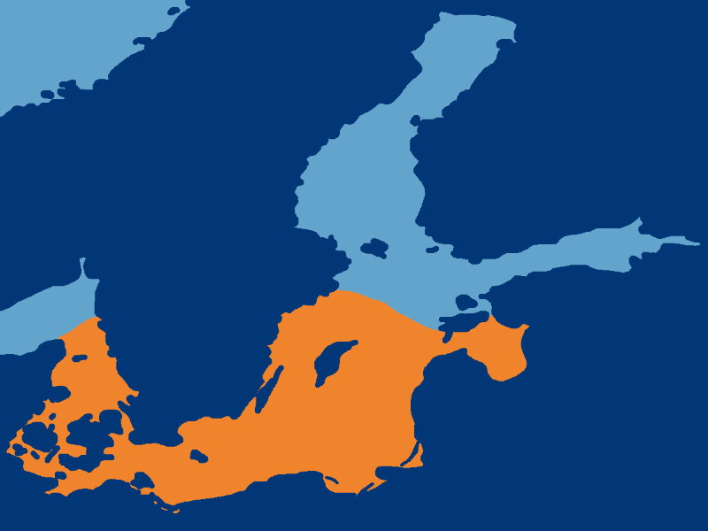
>
> __Verbreitung:__ Kommt in der westlichen und zentralen Ostsee vor.
>
> __Häufigkeit:__ regelmäßig
>
> __Gefährdung:__ unklar

## Vierbärtige Seequappe

<article class="main-info">

_D-Vierbärtelige Seequappe;_
_GB-Fourbeard rockling;_
_DK-Firtrådet havkvabbe;_
_PL-Motela;_
_LT-Keturūsė vėgėlė;_
_LV-Jūrasvēdzele;_
_EST-Nelipoiseluts;_
_RU-Chetyrekhusyi nalim;_
_FIN-Neliviiksimade;_
_S-Fyrtömmad skärlånga_

### Erkennungsmerkmale

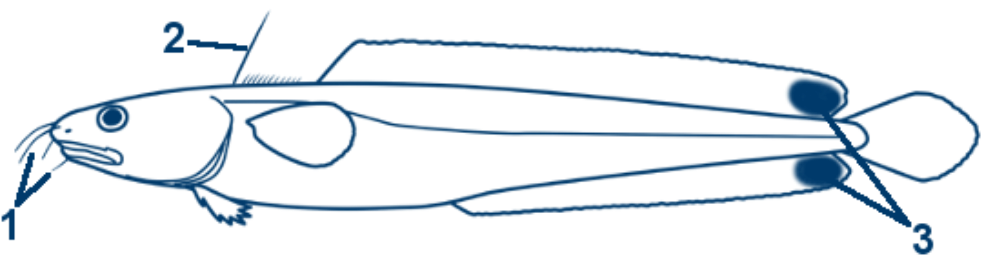

1. Drei Barteln an der Schnauze und eine am Kinn vorhanden.
2. Erste Rückenflosse mit langem ersten Flossenstrahl, der länger ist als die Strahlen der zweiten Rückenflosse.
3. Dunkler Fleck im hinteren Teil von der zweiten Rückenflosse und der Afterflosse.

* Körper länglich.

Meist 30 bis 35 cm, maximal bis zu 40 cm lang.

### Ähnliche Arten

* [Nördliche Seequappe](#nördliche-seequappe) - vier Barteln auf der Schnauze und eine am Kinn, Flossen ohne dunkle Flecken.
* [Leng](#leng) - nur eine Bartel am Kinn, keine Barteln an der Schnauze.
* [Quappe](#quappe) - nur eine Bartel am Kinn, keine Barteln an der Schnauze.

### Lebensweise

Lebt über schlammigen Böden bis in 650 m Tiefe; vor allem nachtaktiv.
Erreicht ein Alter bis zu 9 Jahren.
Pflanzt sich zwischen Mai und August fort.

### Ernährung

Ernährt sich vor allem von Krebstieren.

### Bedeutung

Häufiger Beifang in Schleppnetzen, aber ohne kommerzielle Bedeutung.

</article>

<!-- class="sub-info" -->
> #### Enchelyopus cimbrius
>
> __Familie:__ Lotidae
>
> __Ordnung:__ Gadiformes
>
> 
>
> __Verbreitung:__ Kommt in der westlichen und zentralen Ostsee vor.
>
> __Häufigkeit:__ regelmäßig
>
> __Gefährdung:__ nicht gefährdet

## Nördliche Seequappe

<article class="main-info">

_D-Nordische Seequappe;_
_GB-Northern rockling;_
_DK-Nordlig havkvabbe;_
_EST-Põhja-viiepoiseluts;_
_RU-Severniy pyatiusiy nalim;_
_FIN-Viisiviiksimade;_
_S-Nordlig skärlånga_

### Erkennungsmerkmale

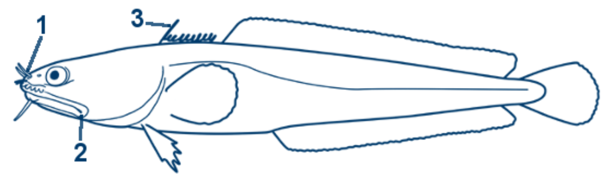

1. Vier Barteln am Oberkiefer und eine Bartel am Kinn.
2. Maulöffnung reicht deutlich bis hinter das Auge.
3. Längster Flossenstrahl der ersten Rückenflosse kürzer als längste Strahlen der zweiten Rückenflosse.

* Körper mäßig langgestreckt.
* Dunkle braun, Bauch heller.

Maximal bis zu 20 cm Länge.

### Ähnliche Arten

* [Vierbärtige Seequappe](#vierbärtige-seequappe) - drei Barteln auf der Schnauze und eine am Kinn, zweite Rückenflosse und Afterflosse hinten mit dunklem Fleck.
* [Leng](#leng) - nur eine Kinnbartel, keine Barteln auf der Schnauze

### Lebensweise

Lebt vorallem über Sandgründen in Tiefen bis zu 90 m.

### Ernährung

Frisst Krebstiere und Würmer.

### Bedeutung

Ohne wirtschaftliche Bedeutung

</article>

<!-- class="sub-info" -->
> #### Ciliata septentrionalis
>
> __Familie:__ Lotidae
>
> __Ordnung:__ Gadiformes
>
> 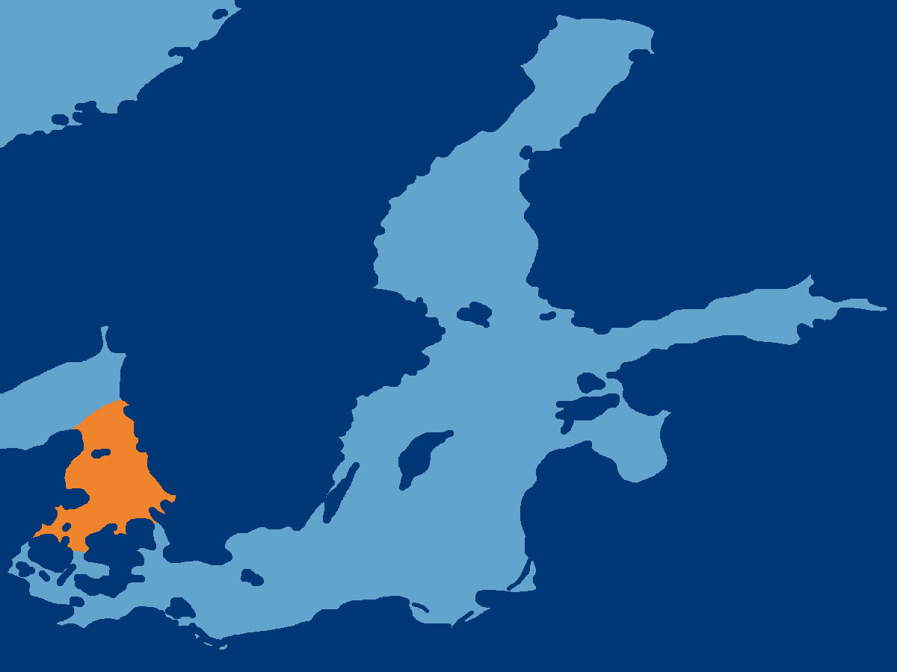
>
> __Verbreitung:__ Kommt im Kattegat vor.
>
> __Häufigkeit:__ sehr häufig
>
> __Gefährdung:__ nicht gefährdet

## Froschdorsch

<article class="main-info">

_D-Froschdorsch;_
_GB-Tadpole fish;_
_DK-Sortvels;_
_PL-Żabogłów;_
_EST-Konnluts;_
_RU-Konnluts;_
_FIN-Mustaturska;_
_S-Paddtorsk_

### Erkennungsmerkmale

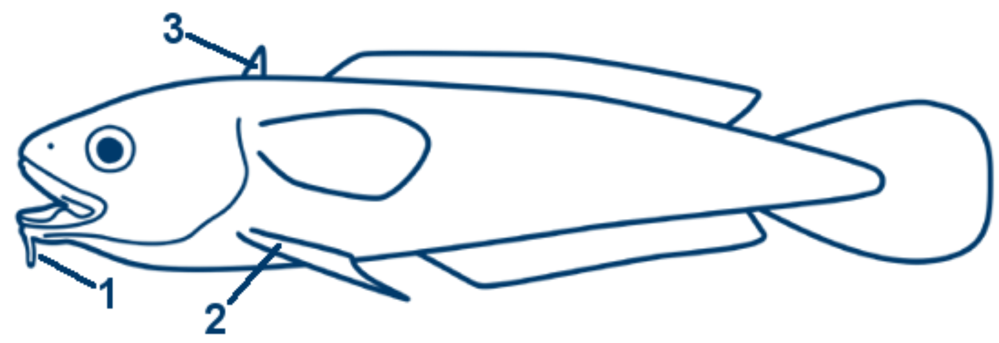

1. Eine kleine Kinnbartel.
2. Bauchflossen nahe der Kehle und fadenähnlich.
3. Erste Rückenflosse sehr klein.

* Keine freistehenden Filamente hinter der ersten Rückenflosse.
* Körper kaulquappenartig mit großem Kopf.
* Körper dunkelbraun bis schwarz; Flossen mit weißen Rändern.

Bis zu 30 cm lang, meist kleiner bleibend.

### Ähnliche Arten

* [Quappe](#quappe) - Kopf schlanker und Körper länger; erste Rückenflosse gut entwickelt.

### Lebensweise

Geht nachts auf Jagd; tagsüber in Verstecken wie kleinen Höhlen und Schiffwracks.
Standorttreue Einzelgänger.
Meist im Flachwasser, aber gelegentlich bis in 100 m Tiefe.

### Ernährung

Ernährt sich vor allem von Wirbellosen, wie Seesternen, Krebsen, Würmern und Weichtieren, aber auch kleineren Fischen.

### Bedeutung

Ohne wirtschaftliche Bedeutung.

</article>

<!-- class="sub-info" -->
> #### Raniceps raninus
>
> __Familie:__ Ranicipitidae
>
> __Ordnung:__ Gadiformes
>
> 
>
> __Verbreitung:__ Regelmäßig im Kattegat, aber nur selten in die westliche Ostsee vordringend.
>
> __Häufigkeit:__ häufig
>
> __Gefährdung:__ unklar

## Gabeldorsch

<article class="main-info">

_D-Gabeldorsch;_
_GB-Greater forkbeard;_
_DK-Skælbrosme;_
_PL-Widlak bialy ;_
_EST-Suur niituimluts;_
_RU-Hалим морской;_
_FIN-Suomuturska;_
_S-Fjällbrosme_

### Erkennungsmerkmale

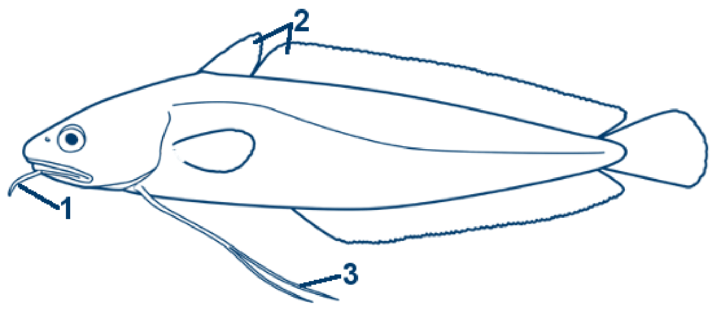

1. Eine Kinnbartel.
2. Zwei Rückenflossen: erste lang ausgezogen, oft mit einem schwarzen Fleck.
3. Bauchflossen lang ausgezogen, fadenförmig und bis hinter den Ansatz der Afterflosse reichend.

* Körper hellbraun (nach dem Tod weißlich bis gräulich).

Meist 40 bis 45 cm, maximal bis zu 1 m lang.

### Ähnliche Arten

* [Leng](#leng) - Bauchflossen reichen nicht bis zum Ende der Brustflossen.

### Lebensweise

Lebt in 100 bis 450 m tiefe über lockerem Grund; Jungtiere auch im Flachwasser.
Wird bis zu 20 Jahre alt.

### Ernährung

Abhängig von der Größe wechselt die Nahrung von kleinen Krebschen zu Fischen.

### Bedeutung

Häufig zu Fischmehl berarbeitet.
Vor allem in Südeuropa auch als Speißefisch genutzt.

</article>

<!-- class="sub-info" -->
> #### Phycis blennoides
>
> __Familie:__ Phycidae
>
> __Ordnung:__ Gadiformes
>
> 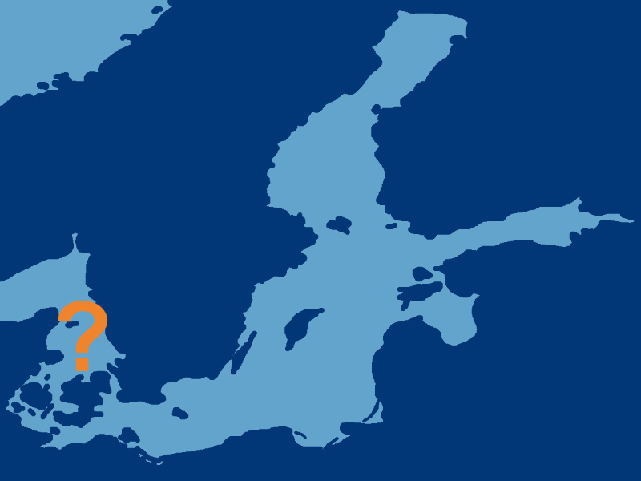
>
> __Verbreitung:__ Seltener Gast im Kattegat.
>
> __Häufigkeit:__ selten
>
> __Gefährdung:__ nicht gefährdet

## Leng

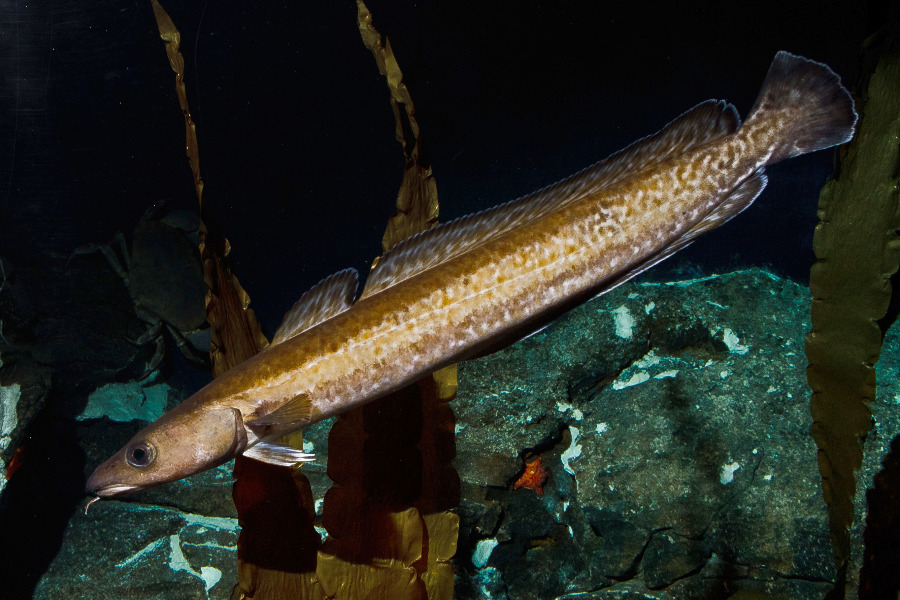
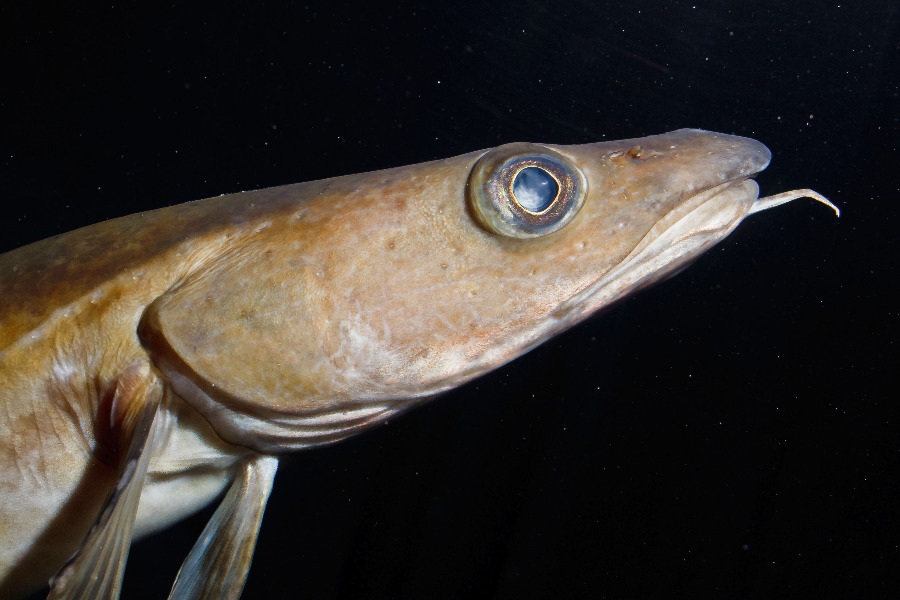
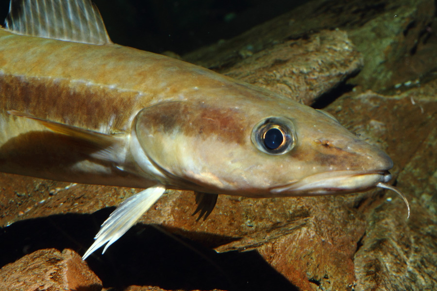

<article class="main-info">

_D-Leng;_
_GB-Ling;_
_DK-Lange;_
_PL-Molwa;_
_EST-Harilik molva;_
_RU-Мольва;_
_FIN-Molva;_
_S-Långa_

### Erkennungsmerkmale

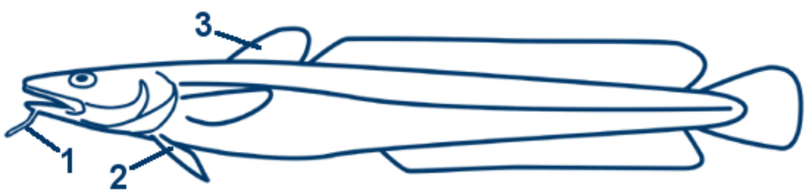

1. Eine lange Kinnbartel.
2. Erste Rückenflosse nicht fadenartig verlängert.
3. Bauchflossen kehlständig, nicht fadenartig verlängert.

* Zähne zum Teil sehr groß.
* Körper länglich.
* Körper bräunlich bis grünlich.

Bis zu 200 cm lang.

### Ähnliche Arten

* [Quappe](#quappe) - vorderes Nasenloch röhrenartig ausgezogen; keine Seitenlinienporen auf dem Kopf sichtbar (gut sichtbar beim Leng); Körper stark marmoriert.
* [Vierbärtige Seequappe](#vierbärtige-seequappe) - mehrere Barteln auf der Schnauze; erste Rückenflossen sehr niedrig, bis auf einen langezogenen Strahl.
* [Nördliche Seequappe](#nördliche-seequappe) - mehrere Barteln auf der Schnauze; erste Rückenflossen sehr niedrig, bis auf einen langezogenen Strahl.

### Lebensweise

Laicht zwischen März und Juli.
Jungtiere im küstennahen Freiwasser; während Erwachsene bodennah in Tiefen von 100 bis 400 m leben.

### Ernährung

Ernährt sich von Fischen, aber auch Tintenfischen, Krebsen und Seesternen.

### Bedeutung

Wirtschaftlich bedeutender Speißefisch; auch bei Fischern beliebt.

### Gefährdung

Lokal gefährdet wegen Überfischung.

</article>

<!-- class="sub-info" -->
> #### Molva molva
>
> __Familie:__ Lotidae
>
> __Ordnung:__ Gadiformes
>
> 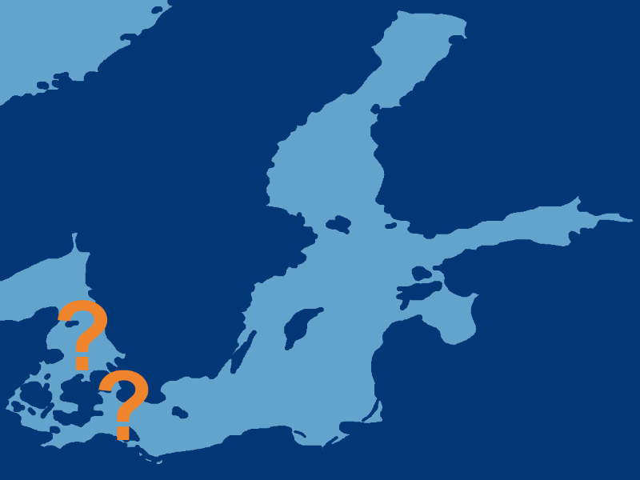
>
> __Verbreitung:__ Als Irrgast im Kattegat und der westlichen Ostsee.
>
> __Häufigkeit:__ selten
>
> __Gefährdung:__ nicht gefährdet

## Quappe

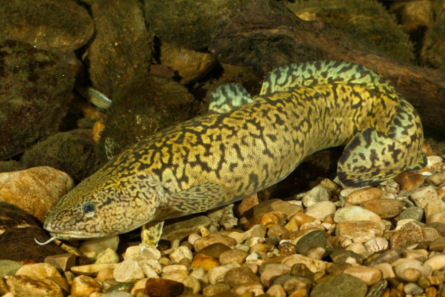
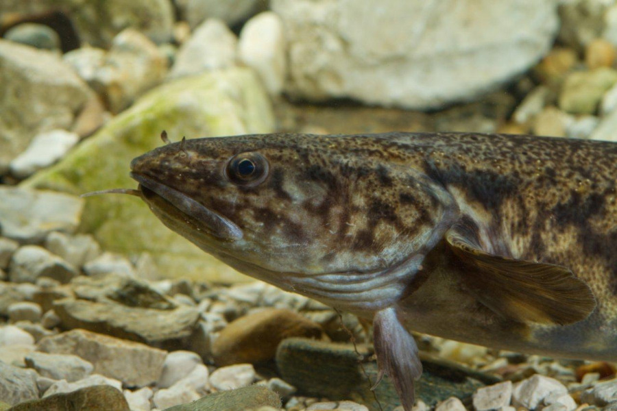
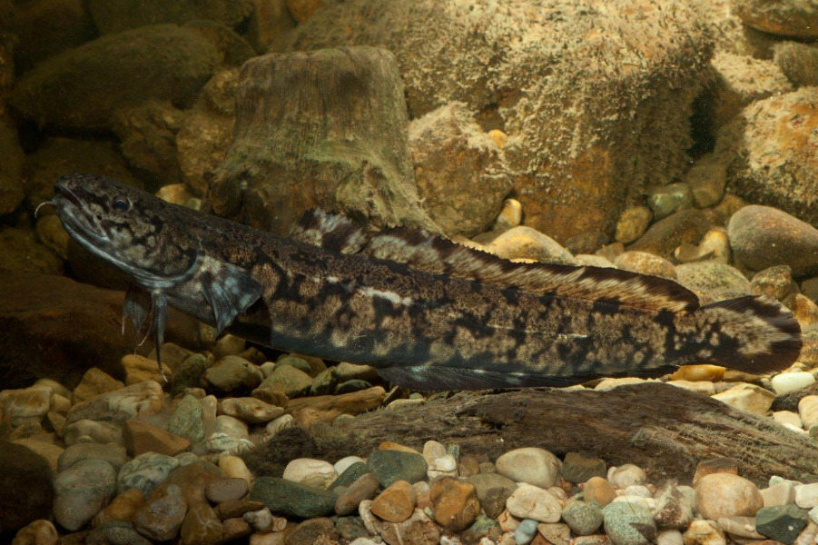
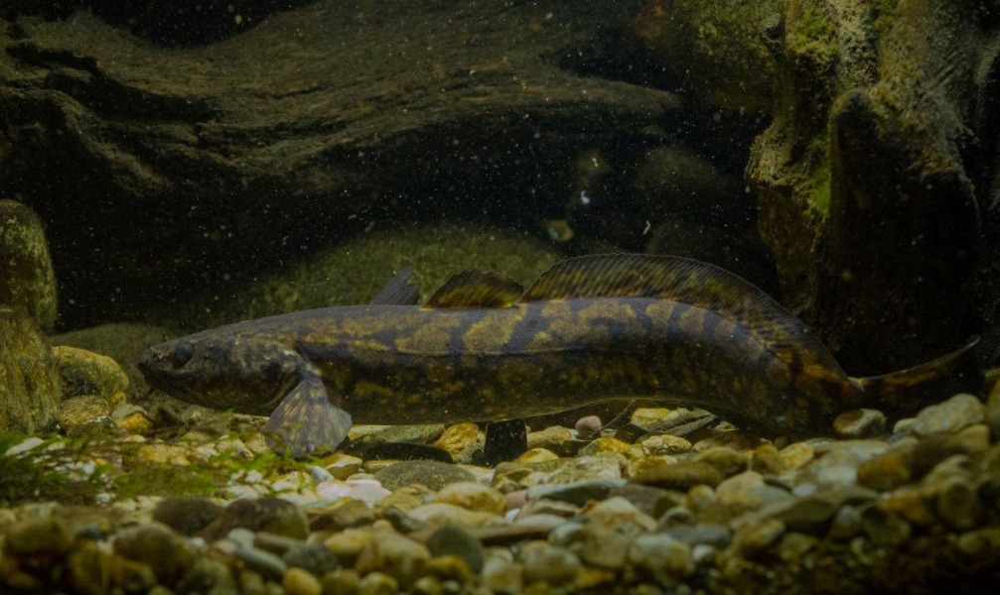

<article class="main-info">

_D-Quappe, Aaluappe, Trüsche, Rutte;_
_GB-Burbot;_
_DK-Kvabbe;_
_PL-Miętus;_
_LT-Vėgėlė;_
_LV-Vēdzele;_
_EST-Luts;_
_RU-Налим;_
_FIN-Made;_
_S-Lake_

### Erkennungsmerkmale

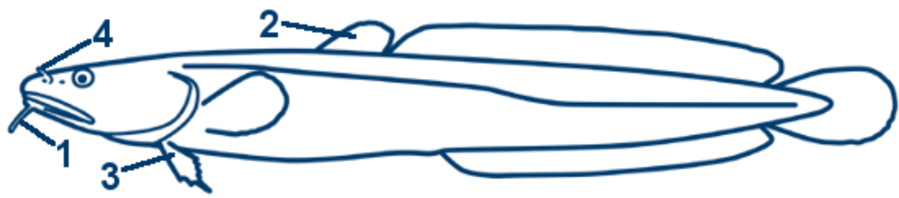

1. Eine Kinnbartel.
2. Erste Rückenflosse nicht fadenartig verlängert.
3. Bauchflossen kehlständig, nicht fadenartig verlängert.
4. Vorderes Nasenloch mit kleinem Nasententakel.

* Körper langgezogen.
* Körper dunkelbraun mit gelblicher Marmorierung.

Meist 30 bis 50 cm, maximal bis 150 cm lang.

### Ähnliche Arten

* [Leng](#leng) - vorderes Nasenloch nicht ausgezogen; selten marmorierte Körpermusterung; Poren der Seitenlinie gut sichtbar auf dem Kopf (bei der Aalquappe nicht sichtbar).
* [Froschdorsch](#froschdorsch) - erste Rückenflosse sehr klein; Bauchflossen fadenartig; einheitlich dunkel gefärbt.

### Lebensweise

Lebt im Süß- und Brackwasser; nachtaktiv, tagsüber meist versteckt unter Steinen und Wurzeln.
Laicht oberflächennah zwischen Januar und März.

### Ernährung

Ernährt sich abhängig vom Habitat von Insektenlarven, Weichtieren und Krebsen, sowie von anderen Wirbellosen.
Erwachsene Quappen fressen auch vermehrt kleine Fische.

### Bedeutung

Beliebter Angelfisch.

### Gefährdung

Generell stark gefährdet, vor allem durch Gewässerverbauungen.

</article>

<!-- class="sub-info" -->
> #### Lota lota
>
> __Familie:__ Lotidae
>
> __Ordnung:__ Gadiformes
>
> 
>
> __Verbreitung:__ Kommt küstennah in der gesamten Ostsee vor.
>
> __Häufigkeit:__ selten
>
> __Gefährdung:__ gefährdet

## Meerengel

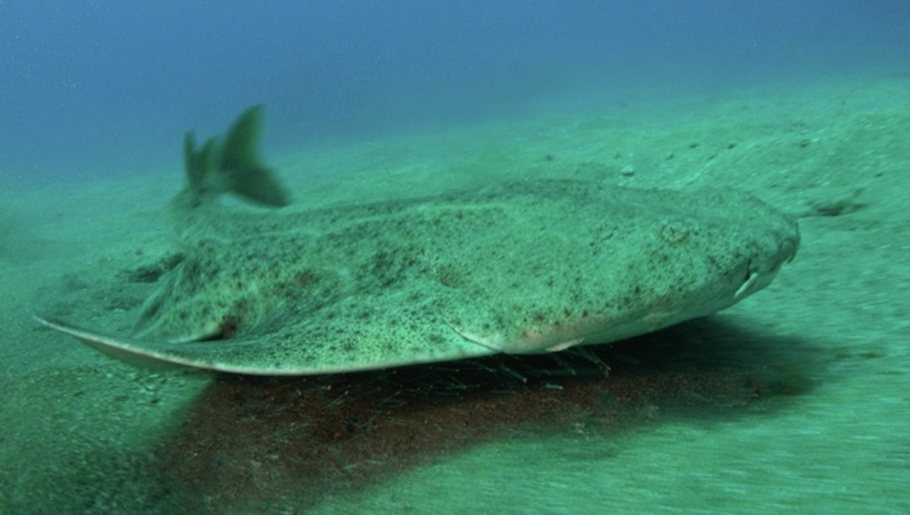
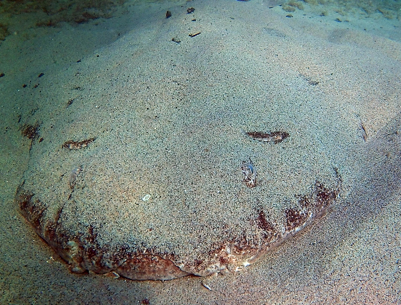

<article class="main-info">

_D-Meerengel, Engelshai;_
_GB-Angelshark;_
_DK-Havengel;_
_PL-Raszpla zwyczajna, anioł morski;_
_EST-Ingelhai;_
_RU-Европейский морской ангел;_
_FIN-Merienkeli;_
_S-Havsängel_

### Erkennungsmerkmale

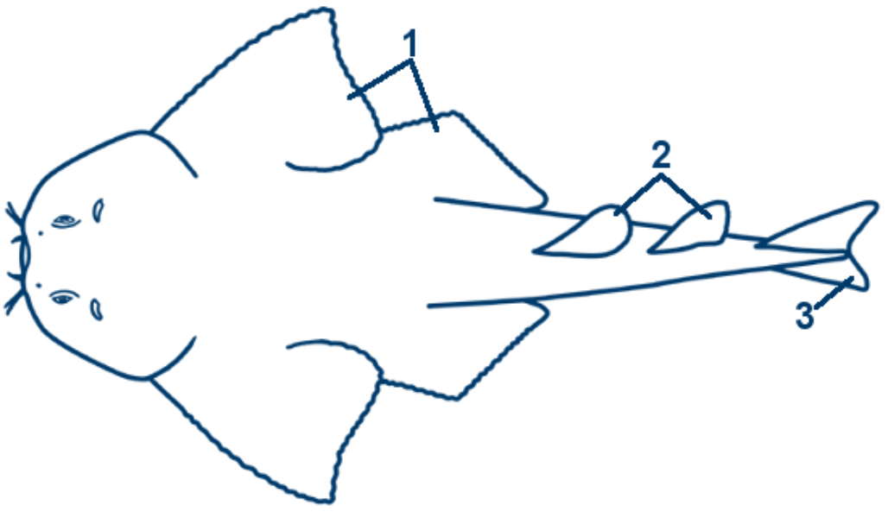

1. Brust- und Bauchflossen groß und flügelartig.
2. Zwei Rückenflossen ähnlicher Größe; die erste Rückenflosse hinter den Brustflossen.
3. Unterer Teil der Schwanzflosse größer als oberer Teil.

* Vorderkörper stark abgeplattet und rochenähnlich.
* Marmoriert mit weißen und schwarzen Flecken.

Meistens 90 bis 120 cm, maximal 250 cm lang.

### Ähnliche Arten

\- unverwechselbar

### Lebensweise

Bodenlebender Hai, der sich gerne im Substrat eingräbt; bevorzugt Sand- und Schlammböden in Tiefen von 5 bis 100 m Tiefe, gelegentlich küstennah und Ästuare.
Geschlechtsreif ab etwa 1,5 m.
Nach einer Tragzeit von 8 bis 10 Monaten werden etwa 30 cm lange Jungtiere geboren.

### Ernährung

Ernährt sich vor allem von Plattfischen, Rochen, Krebsen und Weichtieren.

### Bedeutung

Früher gezielt befischt; heutzutage Beifang vor allem in Schleppnetzen.

### Gefährdung

Vom Aussterben bedroht; starke Populationsabnahme wegen Beifang.

</article>

<!-- class="sub-info" -->
> #### Squatina squatina
>
> __Familie:__ Squatinidae
>
> __Ordnung:__ Squatiniformes
>
> 
>
> __Verbreitung:__ Kattegat; Irrgast in der westlichen Ostsee.
>
> __Häufigkeit:__ sehr selten
>
> __Gefährdung:__ gefährdet

## Ährenfisch

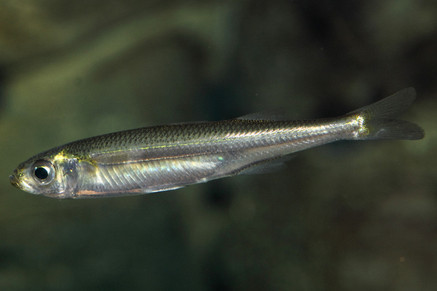
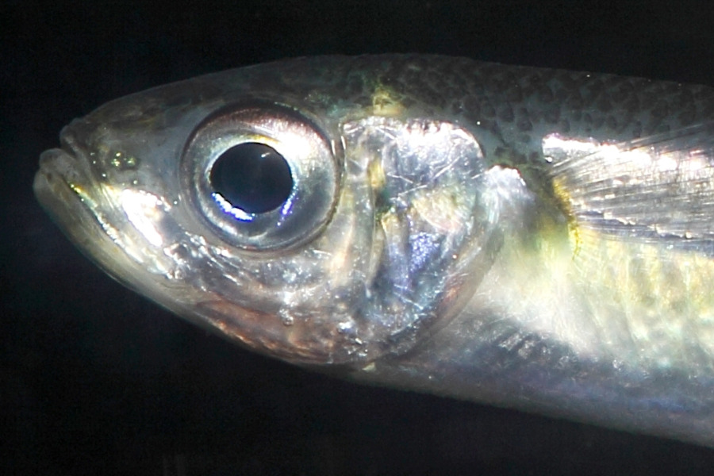
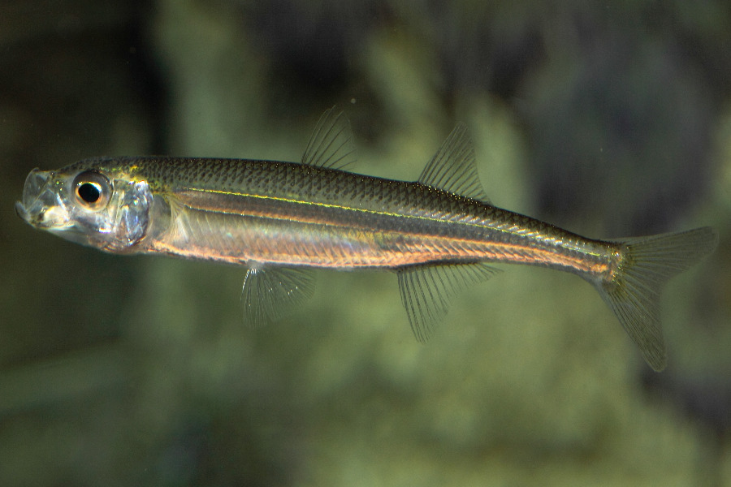

<article class="main-info">

_D-Ährenfisch;_
_GB-Sand smelt;_
_DK-Stribefisk;_
_PL-Ateryna;_
_EST-Ateriin;_
_RU-Западноевропейская атерина;_
_FIN-Hopeakylki;_
_S-Prästfisk_

### Erkennungsmerkmale

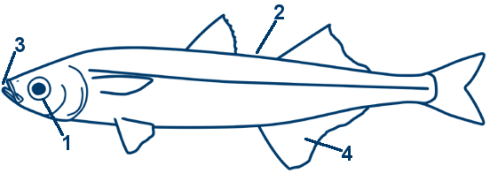

1. Große Augen.
2. Weiter Abstand zwischen den Rückenflossen.
3. Maulspalte steil nach oben gerichtet.
4. Afterflosse genau gegenüber der etwa gleichtroßen zweiten Rückenflosse.

* Silberner Streifen entlang der Körperseite.

Meist unter 14 cm, maximal bis zu 20 cm lang.

### Ähnliche Arten

* [Ukelei](#ukelei) - nur eine Rückenflosse; Bauchflossen bauchständig.
* [Stint](#stint) - mit Fettflosse; Bauchflosse bauchständig.

### Lebensweise

Küstennah lebender Schwarmfisch; auch in Ästuaren und Brackwasser.
Eier werden von April bis Juni abgelegt und mit klebrigen Fäden an Steinen befestigt.

### Ernährung

Frisst tierisches Plankton, wie kleine Krebstierchen und Fischlarven.

### Bedeutung

Wird zu Fischmehl verarbeitet und als Köderfisch verwendet.

</article>

<!-- class="sub-info" -->
> #### Atherina presbyter
>
> __Familie:__ Atherinidae
>
> __Ordnung:__ Atheriniformes
>
> 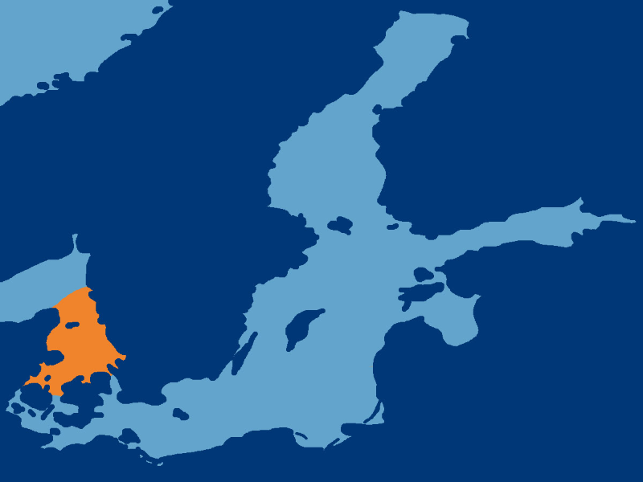
>
> __Verbreitung:__ Kommt im Kattegat vor.
>
> __Häufigkeit:__ regelmäßig
>
> __Gefährdung:__ nicht gefährdet

## Seehecht

<article class="main-info">

_D-Seehecht;_
_GB-Hake;_
_DK-Kulmule;_
_PL-Morszczuk;_
_EST-Merluus;_
_RU-Mерлуза;_
_FIN-Kummeliturska;_
_S-Kummel_

### Erkennungsmerkmale

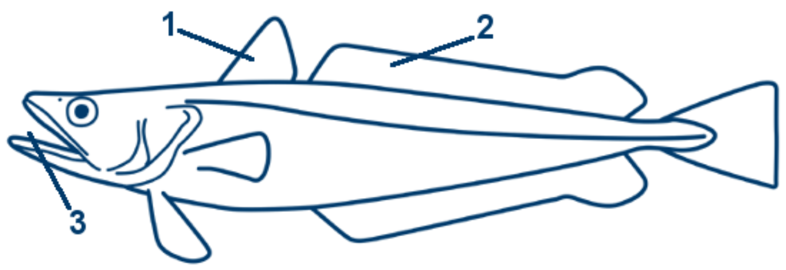

1. Erste Rückenflosse ziemlich kurz.
2. Zweite Rückenflosse und Afterflosse sehr lang.
3. Kräftige Bezahnung.

* Körper meist gräulich mit hellerem Bauch.

Meist 30 bis 70 cm, maximal bis zu 130 cm lang.

### Ähnliche Arten

* [Köhler](#köhler) - drei Rückenflossen und zwei Afterflossen.
* [Wittling](#wittling) - drei Rückenflossen und zwei Afterflossen.

### Lebensweise

Hält sich tags bodennah in 70 bis 400 m tiefe auf; jagd nachts im Freiwasser.

### Ernährung

Ernährt sich von Freiwasserfischen und größeren Krebstieren.

### Bedeutung

Sehr geschätzer Speißefisch.

</article>

<!-- class="sub-info" -->
> #### Merluccius merluccius
>
> __Familie:__ Merlucciidae
>
> __Ordnung:__ Gadiformes
>
> 
>
> __Verbreitung:__ Kommt im Kattegat vor.
>
> __Häufigkeit:__ regelmäßig
>
> __Gefährdung:__ unklar

## Schwarzgrundel

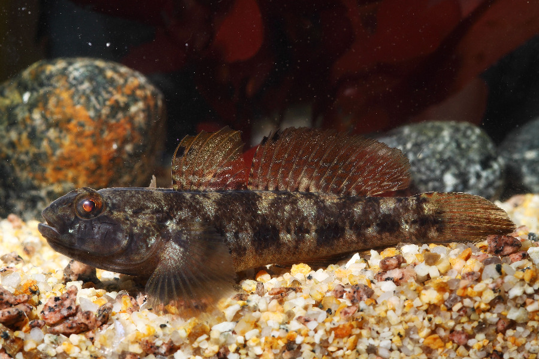
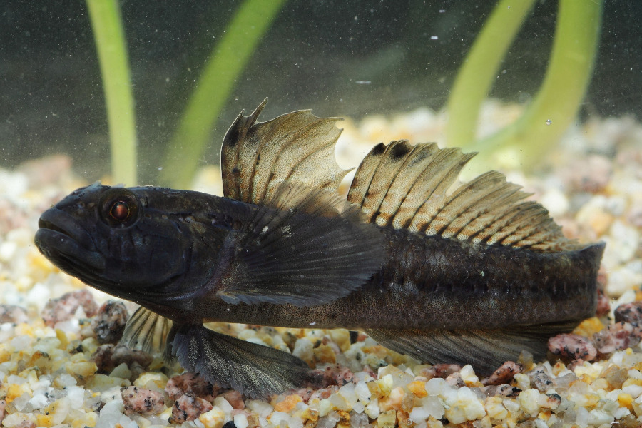
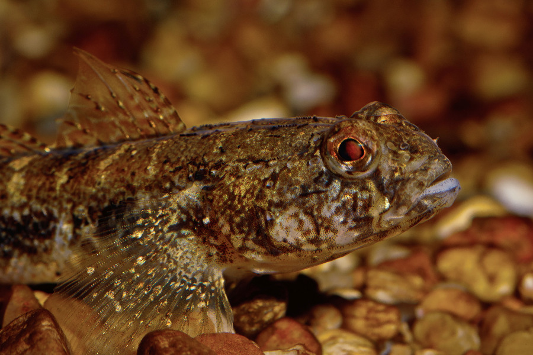
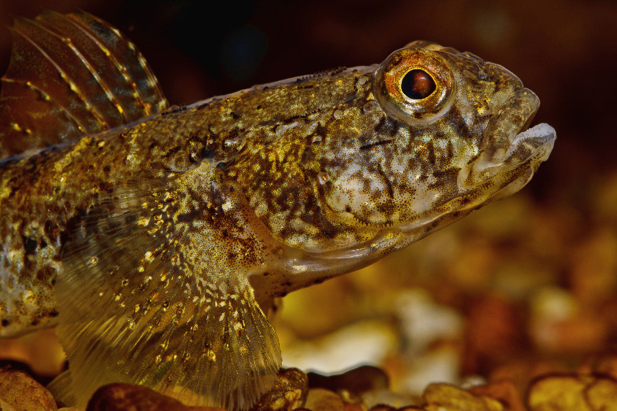

<article class="main-info">

_D-Schwarzgrundel;_
_GB-Black goby;_
_DK-Sortkutling;_
_PL-Babka czarna;_
_LT-Juodasis grundalas;_
_LV-Melnais jūrasgrundulis;_
_EST-Must mudil;_
_RU-Чёрный бычок;_
_FIN-Mustatokko;_
_S-Svart smörbult_

### Erkennungsmerkmale

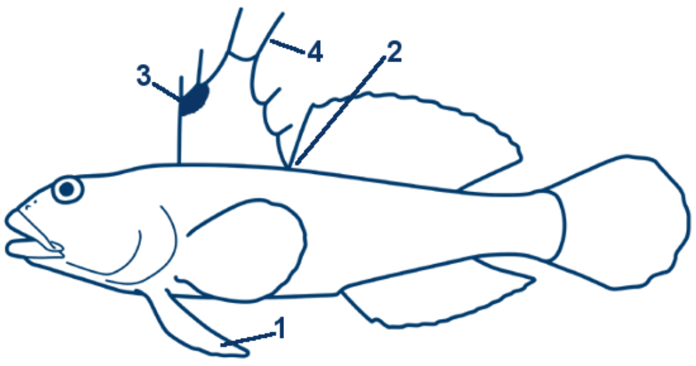

1. Bauchflossen zu einer Saugscheibe verschmolzen.
2. Erste und zweite Rückenflossen berühren sich.
3. Vorderer oberer Teil der Rückenflosse schwarz.
4. Flossenstrahlen der ersten Rückenflosse häufig verlängert.

* Augen stehen dicht beieinander.
* Körper braun marmoriert mit dunklen Flecken; Männchen werden während der Paarungszeit dunkelbraun bis schwarz.

Meist bis 12 cm, maximal bis zu 18 cm lang.

### Ähnliche Arten

* [Schwarzmaulgrundel](#schwarzmaulgrundel) - dunkler Fleck im unteren hinteren Bereich der ersten Rückenflosse; Nacken erst nach Höhe des Vorkiemendeckels beschuppt (bereits davor bei der Schwarzgrundel).
* [Strandgrundel](#strandgrundel) - Rückenflossen getrennt; Körper heller.
* [Sandgrundel](#sandgrundel) - Rückenflossen getrennt; Körper heller; dunkler Fleck im hinteren Teil der ersten Rückenflosse.
* [Fleckengrundel](#fleckengrundel) - Rückenflossen getrennt; Körper heller; Rückenflossen mit zwei Reihen dunkler Punkte.

### Lebensweise

Lebt auf schlammig-sandigem Untergrund und zwischen Algen in bis zu 40 m Tiefe; oft in brackigem und auch verschmutztem Wasser; laicht in der Ostsee zwischen Mai und August, heftet dabei die Eier an Muschelschalen.
Die Männchen bewachen den Laich und fächeln Frischwasser zu.

### Ernährung

Ernährt sich von bodenlebenden Organismen wie Würmern und Flohkrebsen.

### Bedeutung

Wegen ihrer Häufigkeit eine wichtige Beute für größere, wirtschaftlich wichtige Fische wie Aal und Dorsch; wird als Köderfisch verwendet.

### Bermerkung

Grundelarten sind sich häufig sehr ähnlich, besonders bei schlecht gefärbten Exemplaren oder Jungtieren.
Oft ist es auch dem Spezialisten kaum möglich die Art mit Sicherheit zu bestimmen.

</article>

<!-- class="sub-info" -->
> #### Gobius niger
>
> __Familie:__ Gobiidae
>
> __Ordnung:__ Gobiiformes
>
> 
>
> __Verbreitung:__ Kommt küstennah in der gesamten Ostsee vor, mit Ausnahme des bottnischen Meerbusens.
>
> __Häufigkeit:__ sehr häufig
>
> __Gefährdung:__ nicht gefährdet

## Schwarzmaulgrundel

<article class="main-info">

_D-Schwarzmundgrundel;_
_GB-Round goby;_
_DK-Sortmundet kutling;_
_PL-Babka śniadogłowa;_
_LT-Apvalusis grundalas;_
_LV-Apaļais jūrasgrundulis;_
_EST-Ümarmudil;_
_RU-Бычок-кругляк;_
_FIN-Mustatäplätokko;_
_S-Svartmunnad smörbult_

### Erkennungsmerkmale

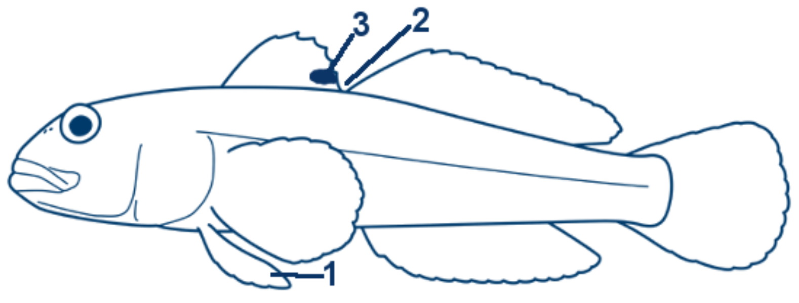

1. Bauchflossen zu einer Saugscheibe verwachsen.
2. Basen der beiden Rückenflossen berühren sich.
3. Hinterer unterer Teil der ersten Rückenflosse dunkel.

* Augen eng beeinander stehend.
* Körper gräulich bis bräunlich, mit dunklen Punkten marmoriert; brütende Männchen tiefschwarz.

Meist bis 15 cm, maximal bis 25 cm Länge.

### Ähnliche Arten

* [Schwarzgrundel](#schwarzgrundel) - dunkler Fleck im vorderen oberen Bereich der ersten Rückenflosse; Männchen mit verlängerter ersten Rückenflosse; Nacken vollständig beschuppt.

### Lebensweise

Bevorzugt flaches Brackwasser, überlebt aber auch im Süßwasser.
Laicht in den Sommermonaten auf Hartsubstrat, wie Steinen und Muscheln; das Männchen bewacht das Gelege.

### Ernährung

Wirbellose Bodentiere und Fische.

### Bedeutung

Wird bisher wirtschaftlich kaum genutzt.

### Gefährdung

Gebietsfremde Art, die möglicherweise negative Auswirkungen auf die Lebewesen der Ostsee hat.

### Bermerkung
Die Schwarzmaulgrundel wurde in den 1990er Jahren das erste mal in der Ostsee nachgewiesen.
Seit dem breitet sie sich stark aus.

</article>

<!-- class="sub-info" -->
> #### Neogobius melanostomus
>
> __Familie:__ Gobiidae
>
> __Ordnung:__ Gobiiformes
>
> 
>
> __Verbreitung:__ Küstennahe südliche Ostsee.
>
> __Häufigkeit:__ häufig
>
> __Gefährdung:__ nicht gefährdet

## Schwimmgrundel

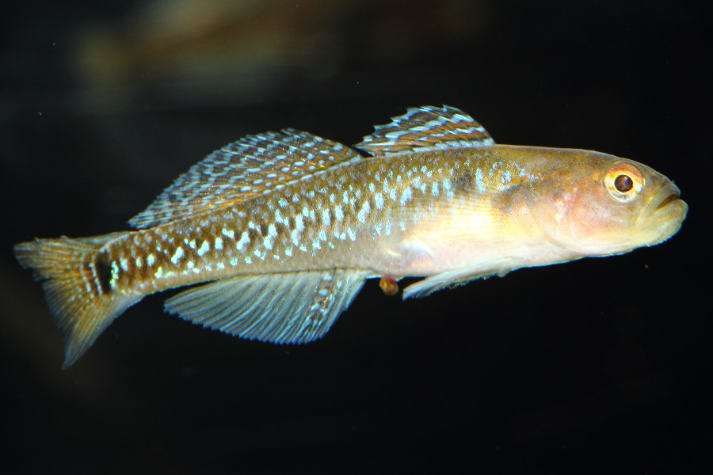
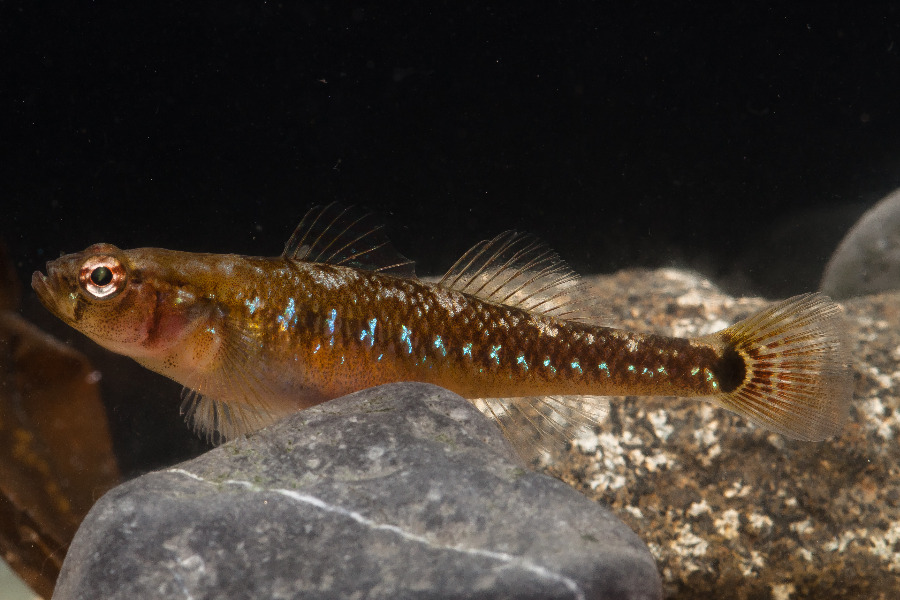
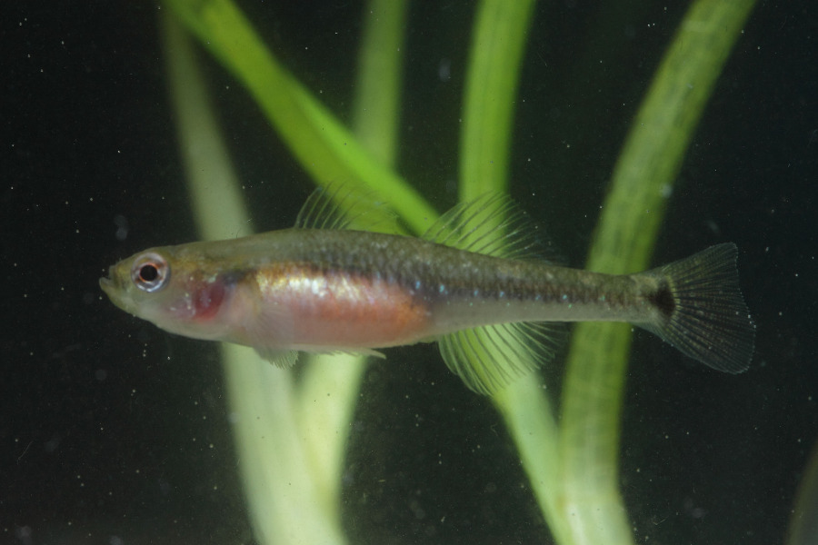
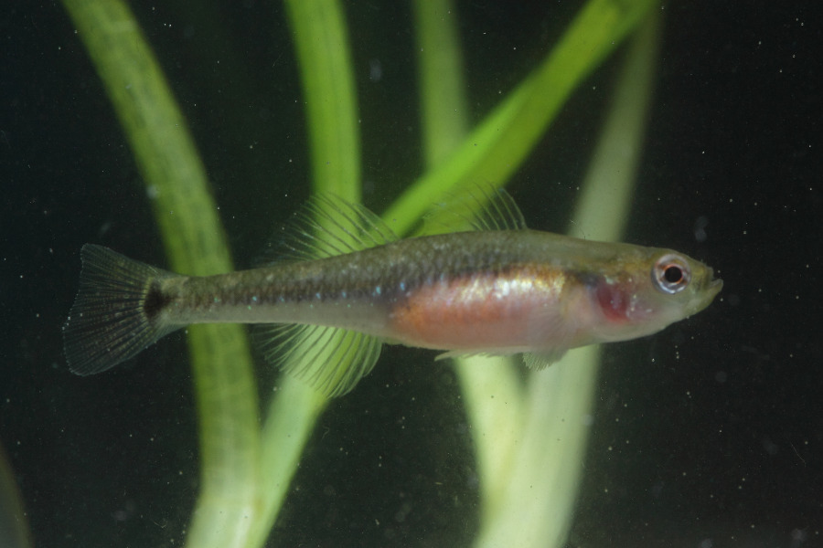

<article class="main-info">

_D-Schwimmgrundel, Zweifleckgrundel, Schnappkühling;_
_GB-Two-spotted goby;_
_DK-Toplettet kutling;_
_PL-Babka czarnoplamka;_
_LT-Dvidėmis grundalėlis;_
_LV-Divplankumu jūrasgrundulis;_
_EST-Kirju mudil;_
_FIN-Seitsenruototokko;_
_S-Sjustrålig smörbult_

### Erkennungsmerkmale

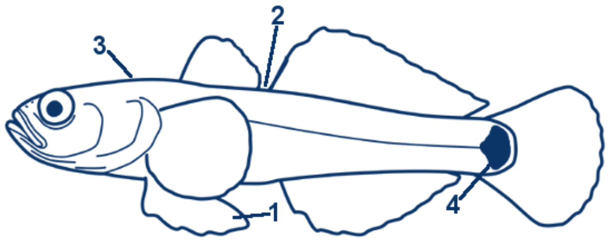

1. Bauchflossen zu einer Saugscheibe verwachsen.
2. Basen der beiden Rückenflossen deutlich voneinander getrennt.
3. Nacken unbeschuppt.
4. Dunkler, gelb umrandeter Fleck am Schwanzansatz.

* Augen weit getrennt stehend.
* Körper bräunlich bis gelblich, mit blauen Punkten auf der Seite, Männchen mit dunklem Fleck im Bereich der Brustflosse.

Meist 4 bis 5 cm, maximal bis 6 cm Länge.

### Ähnliche Arten

* [Sandgrundel](#sandgrundel) - markanter dunkler Fleck mit heller Umrandung am Schwanzansatz fehlt; mit dunklem Fleck am Ende der ersten Rückenflosse.
* [Strandgrundel](#strandgrundel) - markanter dunkler Fleck mit heller Umrandung am Schwanzansatz fehlt; mit dunklem Fleck am Ende der ersten Rückenflosse.
* [Fleckengrundel](#fleckengrundel) - Rückenflossen mit Doppelreihe dunkler Punkte; Körperseite mit 4 bis 5 dunklen Flecken.
* [Glasgrundel](#glasgrundel) - durchsichtig, ohne Körpermusterung.

### Lebensweise

Kommt in Schwärmen freischwimmend über Algen vor.
Eier werden von April bis August an Pflanzen geheftet.

### Ernährung

Tierisches Plankton, wie kleine Krebschen.

### Bedeutung

Ohne wirtschaftliche Bedeutung.

### Bermerkung

Grundelarten sind sich häufig sehr ähnlich, besonders bei schlecht gefärbten Exemplaren oder Jungtieren.
Oft ist es auch dem Spezialisten kaum möglich die Art mit Sicherheit zu bestimmen.

</article>

<!-- class="sub-info" -->
> #### Gobiusculus flavescens
>
> __Familie:__ Gobiidae
>
> __Ordnung:__ Gobiiformes
>
> 
>
> __Verbreitung:__ Gesamte küstennahe Ostsee, außer finnischer und bottnischer Meerbusen.
>
> __Häufigkeit:__ sehr häufig
>
> __Gefährdung:__ nicht gefährdet

## Sandgrundel

<article class="main-info">

_D-Sandgrundel;_
_GB-Sand goby;_
_DK-Sandkutling;_
_PL-Babka mała;_
_LT-Smėlinis grundalas;_
_LV-Mazais jūrasgrundulis;_
_EST-Väike mudil;_
_RU-Малый бычок-бубырь;_
_FIN-Hietatokko;_
_S-Sandstubb;_

### Erkennungsmerkmale

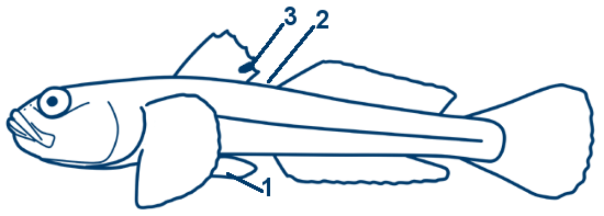

1. Bauchflossen zu einer Saugscheibe verwachsen.
2. Basen der beiden Rückenflossen deutlich voneinander getrennt.
3. dunkler Fleck am Ende der ersten Rückenflosse.

* Rücken bereits vor der ersten Rückenflosse beschuppt.
* Vorderrand der Saugscheibe gesägt.
* Körper sandfarben-bräunlich mit unregelmäßiger dunklerer Musterung.

Meist 4 bis 6 cm, maximal bis 9 cm Länge.

### Ähnliche Arten

* [Strandgrundel](#strandgrundel) - Rücken vor der ersten Rückenflosse ohne Schuppen; Bauchflossenrand (Saugscheibe) vorne glatt.
* [Fleckengrundel](#fleckengrundel) - markante Doppelreihe schwarzer Flecken auf der Rückenflosse; Bauchflossenrand (Saugscheibe) vorne glatt.
* [Schwimmgrundel](#schwimmgrundel) - dunkler, gelb umrandeter Fleck am Schwanzstiel.

### Lebensweise

Laicht zwischen Februar und Juli meist in Muschelschalen ab; das Männchen bewacht das Gelege.
Die Tiere werden mit 7 bis 12 Monaten geschlechtsreif und erreichen ein Alter von 2 Jahren.

### Ernährung

Kleine Bodentiere.

### Bedeutung

Durch ihre Häufigkeit wichtiges Beutetier größerer, wirtschaftlich bedeutender Fische wie Aal und Dorsch.

### Bermerkung

Grundelarten sind sich häufig sehr ähnlich, besonders bei schlecht gefärbten Exemplaren oder Jungtieren.
Oft ist es auch dem Spezialisten kaum möglich die Art mit Sicherheit zu bestimmen.

</article>

<!-- class="sub-info" -->
> #### Pomatoschistus minutus
>
> __Familie:__ Gobiidae
>
> __Ordnung:__ Gobiiformes
>
> 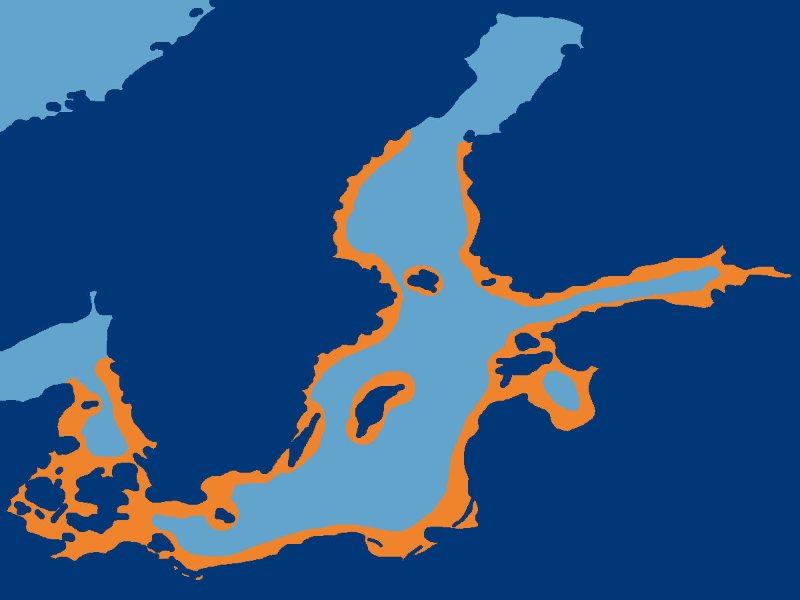
>
> __Verbreitung:__ Gesamte Ostsee, außer nördlicher Bottnischer Meerbusen.
>
> __Häufigkeit:__ sehr häufig
>
> __Gefährdung:__ nicht gefährdet

## Strandgrundel

<article class="main-info">

_D-Strandgrundel, Schlammgrundel;_
_GB-Common goby;_
_DK-Lerkutling;_
_PL-Babka piaskowa;_
_LT-Paplūdimių grundalas;_
_LV-Jūrasgrundulis;_
_EST-Pisimudil;_
_RU-Обыкновенный бычок-бубырь;_
_FIN-Liejutokko;_
_S-Lerstubb_

### Erkennungsmerkmale

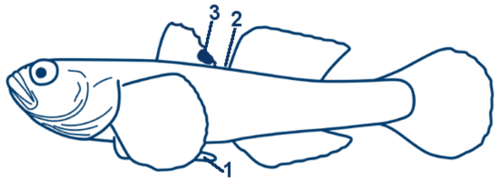

1. Bauchflossen zu einer Saugscheibe verwachsen.
2. Basen der beiden Rückenflossen deutlich voneinander getrennt.
3. dunkler Fleck am Ende der ersten Rückenflosse.

* Rücken erst hinter der ersten Rückenflosse beschuppt.
* Vorderrand der Saugscheibe glatt.
* Körper sandfarben-bräunlich mit unregelmäßiger dunklerer Musterung; oft mit dunklem Fleck am Ansatz der Brustflosse.

Meist 4 bis 5 cm, maximal bis 7 cm Länge.

### Ähnliche Arten

* [Sandgrundel](#strandgrundel) - Rücken bereits vor der ersten Rückenflosse beschuppt; Bauchflossenrand (Saugscheibe) vorne gesägt.
* [Fleckengrundel](#fleckengrundel) - markante Doppelreihe schwarzer Flecken auf der Rückenflosse.
* [Schwimmgrundel](#schwimmgrundel) - dunkler, gelb umrandeter Fleck am Schwanzstiel.

### Lebensweise

Vorwiegend im küstennahen Flachwasser, bis 12 m Tiefe, auf Sand- und Schlammgründen.
Laicht im Sommer unter Muschelschalen ab; das Männchen bewacht das Gelege.

### Ernährung

Kleine Wirbellose, wie Flohkrebse und Würmer.

### Bedeutung

Durch ihre Häufigkeit wichtiges Beutetier größerer, wirtschaftlich bedeutender Fische wie Aal und Dorsch.

### Bermerkung

Grundelarten sind sich häufig sehr ähnlich, besonders bei schlecht gefärbten Exemplaren oder Jungtieren.
Oft ist es auch dem Spezialisten kaum möglich die Art mit Sicherheit zu bestimmen.

</article>

<!-- class="sub-info" -->
> #### Pomatoschistus microps
>
> __Familie:__ Gobiidae
>
> __Ordnung:__ Gobiiformes
>
> 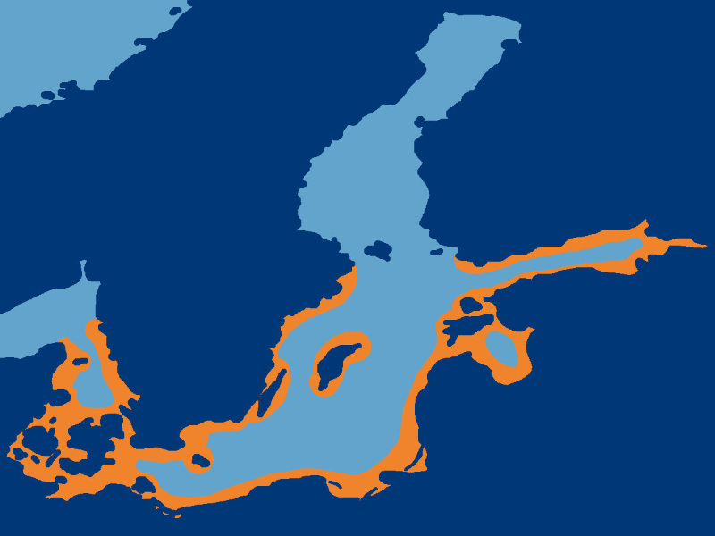
>
> __Verbreitung:__ Gesamte küstennahe Ostsee, außer bottnischer Meerbusen.
>
> __Häufigkeit:__ häufig
>
> __Gefährdung:__ nicht gefährdet

## Fleckengrundel

<article class="main-info">

_D-Fleckengrundel, Bändergrundel;_
_GB-Painted goby;_
_DK-Spættet kutling;_
_PL-Babka pisana;_
_EST-Laikmudilake;_
_RU-бычок покрашенный;_
_FIN-Kivikkotokko;_
_S-Bergstubb_

### Erkennungsmerkmale

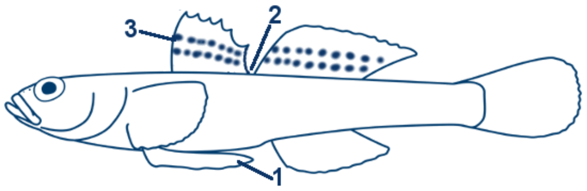

1. Bauchflossen zu einer Saugscheibe verwachsen.
2. Basen der beiden Rückenflossen nur wenig voneinander getrennt.
3. Doppelreihe dunkler Flecken auf den Rückenflossen.

* Vorderrand der Saugscheibe glatt.
* Körper gräulich, bräunlich bis gelblich mit unregelmäßigen dunklen Flecken auf der Seite.

Meist 4 bis 5 cm, maximal bis 6 cm Länge.

### Ähnliche Arten

* [Sandgrundel](#sandgrundel) - Bauchflossenrand (Saugscheibe) vorne gesägt; Rückenflossen ohne Zeichnung, außer einem dunklem Fleck am Ende der ersten Rückenflosse.
* [Strandgrundel](#strandgrundel) - Rückenflossen ohne Zeichnung, außer einem dunklem Fleck am Ende der ersten Rückenflosse.
* [Schwimmgrundel](#schwimmgrundel) - dunkler, gelb umrandeter Fleck am Schwanzstiel.

### Lebensweise

Bevorzugt Hartgründe und meidet Brackwasser.
Lebt bodenbezogen im flachen Wasser bis 50 m Tiefe.
Laicht im Frühsommer.

### Ernährung

Kleine Bodentiere, vor allem Krebstiere.

### Gefährdung

In der Ostsee möglicherweise durch Habitatzerstörung (Kiesabbau) gefährdet.

### Bermerkung

Grundelarten sind sich häufig sehr ähnlich, besonders bei schlecht gefärbten Exemplaren oder Jungtieren.
Oft ist es auch dem Spezialisten kaum möglich die Art mit Sicherheit zu bestimmen.

</article>

<!-- class="sub-info" -->
> #### Pomatoschistus pictus
>
> __Familie:__ Gobiidae
>
> __Ordnung:__ Gobiiformes
>
> 
>
> __Verbreitung:__ Kattegat und westliche Ostsee.
>
> __Häufigkeit:__ regelmäßig
>
> __Gefährdung:__ unklar

## Glasgrundel

<article class="main-info">

_D-Glasgrundel, Kristallgrundel, Weißgrundel, Glaskühling;_
_GB-Transparent goby;_
_DK-Glaskutling;_
_PL-Babka przezroczysta;_
_EST-Väike plankmudil;_
_RU-Афия;_
_FIN-Kuultotokko;_
_S-Klarbult_

### Erkennungsmerkmale

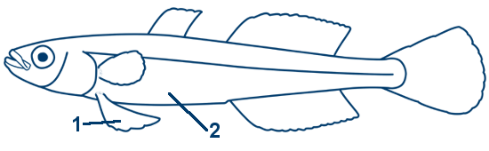

1. Bauchflossen zu einer Saugscheibe verwachsen.
2. Körper schuppenlos und durchsichtig

* Männchen mit zwei vergrößerten Zähen am Unterkiefer und zweistrahliger großer erster Rückenflosse; Weibchen nur mit kleiner ersten Rückenflosse.

Meist bis 5 cm, Weibchen maximal bis 6 cm, Männchen bis 8 cm Länge.

### Ähnliche Arten

* [Schwimmgrundel](#schwimmgrundel) - dunkler, gelb umrandeter Fleck am Schwanzstiel.

### Lebensweise

Lebt im Flachwasser, meist in dichten Schwärmen.
Einjähriger Fisch, der seine Eier zwischen Juni und August in Muschelschalen oder Behausungen von Röhrenwürmern ablegt; Männchen bewacht das Gelege.

### Ernährung

Tierisches Plankton.

### Bermerkung

Grundelarten sind sich häufig sehr ähnlich, besonders bei schlecht gefärbten Exemplaren oder Jungtieren.
Oft ist es auch dem Spezialisten kaum möglich die Art mit Sicherheit zu bestimmen.

</article>

<!-- class="sub-info" -->
> #### Aphia minuta
>
> __Familie:__ Gobiidae
>
> __Ordnung:__ Gobiiformes
>
> 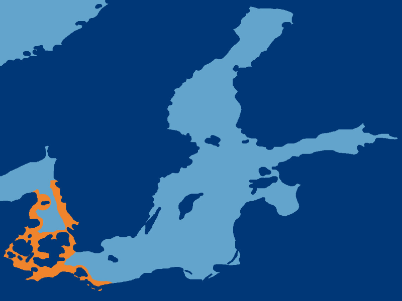
>
> __Verbreitung:__ Kattegat, westliche und südliche Ostsee.
>
> __Häufigkeit:__ regelmäßig
>
> __Gefährdung:__ unklar

# Impressum

<article>

Angaben gemäß § 5 TMG: 
Deutsches Meeresmuseum 
Museum für Meereskunde und Fischerei · Aquarium 
Stiftung des bürgerlichen Rechts 
Katharinenberg 14-20 
18439 Stralsund

Vertreten durch: 
Direktorium: Prof. Dr. Burkard Baschek, Andreas Tanschus

Kontakt: 
Telefon: +49 3831 2650 210 
Telefax: +49 3831 2650 209 
E-Mail: info@meeresmuseum.de

Umsatzsteuer-ID: 
Umsatzsteuer-Identifikationsnummer gemäß §27 a Umsatzsteuergesetz: 
DE 162 772 269 
Steuernummer: 082/126/00068

Verantwortlich für den Inhalt nach § 55 Abs. 2 RStV: 
Dr. Timo Moritz

Konzeption 
Dr. Timo Moritz

Hinweis auf EU-Streitschlichtung 
Die Europäische Kommission stellt eine Plattform zur Online-Streitbeilegung (OS) bereit: http://ec.europa.eu/consumers/odr  
Unsere E-Mail-Adresse finden sie oben im Impressum. 
Quelle: https://www.e-recht24.de

Haftungsausschluss (Disclaimer)

### Haftung für Inhalte

Als Diensteanbieter sind wir gemäß § 7 Abs.1 TMG für eigene Inhalte auf diesen Seiten nach den allgemeinen Gesetzen verantwortlich.
Nach §§ 8 bis 10 TMG sind wir als Diensteanbieter jedoch nicht verpflichtet, übermittelte oder gespeicherte fremde Informationen zu überwachen oder nach Umständen zu forschen, die auf eine rechtswidrige Tätigkeit hinweisen.
Verpflichtungen zur Entfernung oder Sperrung der Nutzung von Informationen nach den allgemeinen Gesetzen bleiben hiervon unberührt.
Eine diesbezügliche Haftung ist jedoch erst ab dem Zeitpunkt der Kenntnis einer konkreten Rechtsverletzung möglich.
Bei Bekanntwerden von entsprechenden Rechtsverletzungen werden wir diese Inhalte umgehend entfernen.

### Haftung für Links

Unser Angebot enthält Links zu externen Webseiten Dritter, auf deren Inhalte wir keinen Einfluss haben.
Deshalb können wir für diese fremden Inhalte auch keine Gewähr übernehmen.
Für die Inhalte der verlinkten Seiten ist stets der jeweilige Anbieter oder Betreiber der Seiten verantwortlich.
Die verlinkten Seiten wurden zum Zeitpunkt der Verlinkung auf mögliche Rechtsverstöße überprüft.
Rechtswidrige Inhalte waren zum Zeitpunkt der Verlinkung nicht erkennbar.
Eine permanente inhaltliche Kontrolle der verlinkten Seiten ist jedoch ohne konkrete Anhaltspunkte einer Rechtsverletzung nicht zumutbar.
Bei Bekanntwerden von Rechtsverletzungen werden wir derartige Links umgehend entfernen.

### Urheberrecht

Die durch die Seitenbetreiber erstellten Inhalte und Werke auf diesen Seiten unterliegen dem deutschen Urheberrecht.
Die Vervielfältigung, Bearbeitung, Verbreitung und jede Art der Verwertung außerhalb der Grenzen des Urheberrechtes bedürfen der schriftlichen Zustimmung des jeweiligen Autors bzw. Erstellers.
Downloads und Kopien dieser Seite sind nur für den privaten, nicht kommerziellen Gebrauch gestattet.
Soweit die Inhalte auf dieser Seite nicht vom Betreiber erstellt wurden, werden die Urheberrechte Dritter beachtet.
Insbesondere werden Inhalte Dritter als solche gekennzeichnet.Sollten Sie trotzdem auf eine Urheberrechtsverletzung aufmerksam werden, bitten wir um einen entsprechenden Hinweis.
Bei Bekanntwerden von Rechtsverletzungen werden wir derartige Inhalte umgehend entfernen.

</article>