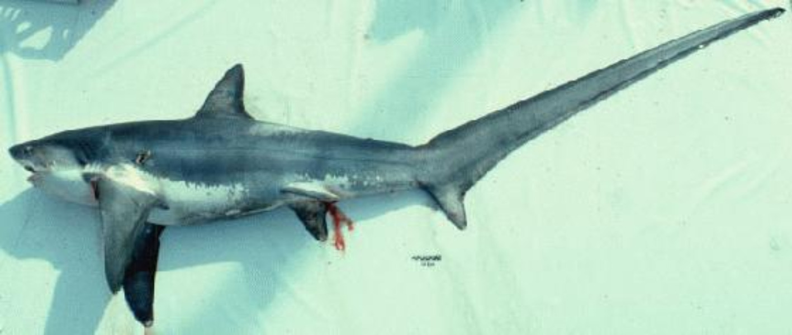

<!--
author:   Your Name

email:    your@mail.org

version:  0.0.1

language: en

narrator: US English Female

comment:  Try to write a short comment about
          your course, multiline is also okay.

link:     style.css

-->

# Fischbestimmer

## Dorsch

<article class="main-info">

_D-Dorsch, Kabeljau;_
_GB-Cod; DK-Torsk;_
_PL-Dorz; LT-Mence;_
_LV-Menca;_
_EST-Tursk;_
_RU-Атлантическая треска;_
_FIN-Turska;_
_S-Torsk_

### Erkennungsmerkmale

1. Lange Bartel am Kinn.
2. Maul deutlich unterständig.
3. Seitenlinie deutlich hell hervorgehoben.

* 3 Rücken- und 2 Afterflossen.
* Hellbraun, gelblich oder grünlich mit markantem dunkelbraunem Fleckenmuster.
  Meist 40 bis 70 cm, früher bis 200 cm Länge und über 95 kg Gewicht.

### Ähnliche Arten

- [Wittling](#wittling) - Bartel sehr klein oder fehlend; Seitenlinie nicht weiß.
- [Schellfisch](#schellfisch) - Bartel kleiner; Seitenlinie nicht weiß; mit markantem schwarzen Fleck über der Brustflosse.
- [Franzosendorsch](#franzosendorsch) - Schnauze nur etwa so lang wie Augendurchmesser; Seitenlinie nicht weiß.
- [Zwergdorsch](#zwergdorsch) - Schnauze nur etwa so lang wie Augendurchmesser; Seitenlinie nicht weiß.

### Lebensweise

Meist in Schwärmen bodennah in bis zu 600 m Tiefe.
Laicht im Frühjahr mit bis zu 5 Millionen Eier pro Weibchen.
Jungfische meist in flacherem Wasser.
Die Lebensweisen der verschiedenen Stämme im Atlantik, der Ostsee und Pazifik unterscheidet sich stark.
In der Ostsee stellt das Bornholmer Becken während der Sommermonate den wichtigsten Laichgrund dar.
Lebenserwartung bis 25 Jahre.

### Ernährung

Kleinere Fische, wie Heringe und Sandaale, Krabben, Garnelen, Würmer und Muscheln.

### Bedeutung

Als beliebter Speisefisch kommerziell stark genutzt ; in der Ostsee einer der wichtigsten Nutzfischarten.
Früher vor allem getrocknet als "Stockfisch" und "Klippfisch" gehandelt.

### Gefährdung

Bestände rückläufig; vor allem durch Fischerei, aber auch wegen Gewässerverschmutzung und Habitatzerstörung.

</article>

<!-- class="sub-info" -->
> #### Gadus morhua
>
> Familie: Gadidae
>
> Ordnung: Gadiformes
>
> 
>
> Verbreitung: Gesamte Ostsee, außer im nördlichen Bottnischen Meerbusen.
>
> Häufigkeit:  sehr häufig
>
> Gefährdung:  nicht gefährdet

## Seehase

<article class="main-info">

_D-Seehase;_
_GB-Lumpsucker, Lumpfish;_
_DK-Stenbider;_
_PL-Tasza;_
_LT-Ciegorius;_
_LV-Zaķzivs;_
_EST-Merivarblane;_
_RU-Пинагор;_
_FIN-Rasvakala;_
_S-Sjurygg_

### Erkennungsmerkmale

1. Reihen von Knochendornen auf Rücken und Flanken.
2. Bauchflossen sind zu einer Saugscheibe umgewandelt.

- Jungtiere mit zwei Rückenflossen; die erste wird während des Wachstums von einem Hautkamm umwachsen.
- Körper massig und hochrückig.
  Männchen meist 30 bis 40 cm, Weibchen meist über 50 cm, max. 61cm Länge; in der Ostsee meist kleiner bleibend.

### Ähnliche Arten

Unverwechselbar

### Lebensweise

Lebt auf steinigen bis felsigen Böden in 20 bis 200m, max. 400 m Tiefe, wo er sich mit seiner Saugscheibe festsaugen kann.
Laicht im Frühjahr, das Gelege von bis zu 350.000 Eiern wird vom Männchen bewacht.
Die Wintermonate verbringen sie in größeren Tiefen.

### Ernährung

Krebstiere, Rippenquallen und kleine Fische; gelegentlich pflanzliches Material.

### Bedeutung

Wirtschaftliche Bedeutung als Speisefisch; seine Eier werden als "deutscher Kaviar" gehandelt.

### Gefährdung

Vermutlich nicht gefährdet.

### Bermerkung

Meist sind Seehasen gräulich oder grünlich gefärbt, doch während der Fortpflanzungszeit werden die Männchen leuchtend rot.

</article>

<!-- class="sub-info" -->
> #### Cyclopterus lumpus
>
> Familie: Cyclopteridae
>
> Ordnung: Scorpaeniformes
>
> 
>
> Verbreitung: Häufig in der gesamten Ostsee mit Ausnahme des finnischen und bottnischen Meerbusens.
>
> Häufigkeit:  sehr häufig
>
> Gefährdung:  nicht gefährdet

## Meerneunauge

<article class="main-info">

_D-Meerneunauge;_
_GB-Sea lamprey, great sea lamprey, green sea lamprey;_
_DK-Havlempret;_
_PL-Minóg morski;_
_LT-Upinė nėgė;_
_LV-Jūras nēģis;_
_EST-Merisutt;_
_RU-Минога морская;_
_FIN-Merinahkiainen;_
_S-Havsnejonöga_

### Erkennungsmerkmale

1. Mundscheibe mit zahlreichen kleinen Hornzähne.

- 7 Kiemenöffnungen (pro Seite) und eine einzelne Nasenöffnung.
- Keine paarigen Flossen.
- Körper meist deutlich marmoriert.

Meist 70 bis 90 cm, selten bis 120 cm; etwa 5 cm im Durchmesser.

### Ähnliche Arten

- [Flussneunauge](#flussneunauge) - drei Paar große Hornzähne beiderseits der Maulöffnung; Körper einheitlich gefärbt; nur etwa daumendick.
- [Aal](#aal) - paarige Brustflossen; Kiemendeckel und nur eine äußere Kiemenöffnung.
- [Conger](#conger) - paarige Brustflossen; Kiemendeckel und nur eine äußere Kiemenöffnung.

### Lebensweise

Die laichreifen Erwachsenen wandern flussaufwärts. Sie pflanzen sich nur einmal im Leben fort.
Die Larven, die sogenannten Querder, leben drei bis fünf Jahre in Sand- oder Schlammgrund eingegraben und ernähren sich filtrierend von Kleinstpartikeln.
Nach der Umwandlung zum Erwachsenen wandern sie zurück ins Meer und leben dort bis zur Geschlechtsreife etwa drei bis vier Jahre lang.

### Ernährung

Saugt sich mit der Mundscheibe an Fische an, um sich von deren Blut und kleingeraspelten Gewebe zu ernähren.
Kleinere Fische werden teilweise auch komplett gefressen.

### Bedeutung

Geschätzter Speisefisch; wegen seiner geringen Bestände jedoch kaum wirtschaftlich nutzbar.

### Gefährdung

Gefährdet durch Flussverbauung (z.B. Wasserkraftwerke) und Gewässerverschmutzung.

</article>

<!-- class="sub-info" -->
> #### Petromyzon marinus
>
> Familie: Petromyzontidae
>
> Ordnung: Petromyzontiformes
>
> 
>
> Verbreitung: Ostsee, mit Ausnahme des bottnischen Meerbusens
>
> Häufigkeit: regelmäßig
>
> Gefährdung: gefährdet

## Blauhai

<article class="main-info">

_D-Blauhai;_
_GB-Blue shark, blue pointer;_
_DK-Blåhaj;_
_PL-Zarlacz blekitny;_
_LT-Melsvasis ryklys;_
_EST-Sinihai;_
_RU-Синяя акула;_
_FIN-Sinihai;_
_S-Blåhaj_

### Erkennungsmerkmale

1. Zweite Rückenflosse sehr viel kleiner als die erste.
2. Schwanzstiel ohne seitlichen Kiel.
3. Brustflosse endet deutlich vor der Rückenflosse.

* 5 Kiemenspalten, schlanker Körper.
* Rücken leuchtend blau (nach dem Tod zu grau erblassend), Bauch weiß.
  Meist unter 3 m, max. 3,8 m Länge

### Ähnliche Arten

- [Heringshai](#heringshai) - Körper deutlich massiger; Brustflosse endet unter dem Beginn der Rückenflosse, mit stark ausgebildetem seitlichen Schwanzkiel.
- [Gemeiner Dornhai](#gemeiner-dornhai) - mit Dornen an den Rückenflossen; ohne Afterflosse.

### Lebensweise

Lebt oberflächennah im offenen Meer und ist hauptsächlich nachtaktiv.
Nach einer Tragzeit von 9 bis 12 Monaten schwankt die Zahl der lebend geborenen Jungen sehr stark, zwischen 4 und 135 Stück.

### Ernährung

Vor allem Schwarmfisch wie Hering und Makrele, aber auch Kalmare, andere Wirbellose und gelegentlich kleinere Haie.

### Bedeutung

Beliebte Zielart von Sportanglern. Als Speisefisch von geringer Bedeutung, jedoch häufig zur Gewinnung von Haiflossen gefangen.

### Gefährdung

Stark befischte Haiart; außerdem sehr häufiger Beifang von Langleinenfischerei, Schlepp- und Kiemennetzen. 

</article>

<!-- class="sub-info" -->
> #### Prionace glauca
>
> Familie: Carcharhinidae
>
> Ordnung: Carchariniformes
>
> 
>
> Verbreitung: Irrgast in der westlichen Ostsee
>
> Häufigkeit: sehr selten
>
> Gefährdung: nicht gefährdet

## Flussneunauge

<article class="main-info">

_D-Flussneunauge;_
_GB-River lamprey;_
_DK-Almindelig flodlampret;_
_PL-Minóg rzeczny;_
_LT-Upinė nėgė;_
_LV-Upes nēģis;_
_EST-Jõesilm;_
_RU-Речная минога;_
_FIN-Nahkiainen;_
_S-Flodnejonöga_

### Erkennungsmerkmale

1. Beiderseits der Mundöffnung drei große Hornzähne.

* Sieben Kiemenöffnungen (pro Seite) und eine einzelne Nasenöffnung.
* Keine paarigen Flossen.
* Körper ohne Musterung; bläulicher bis bräunlicher Rücken scharf vom hellen Bauch abgegrenzt.

Meist 30 bis 40 cm, selten bis 50 cm Länge; etwa daumendick.

### Ähnliche Arten

* [Meerneunauge](#meerneunauge) - sehr viele kleine Hornzähne auf der Mundscheibe; Körper meist marmoriert;
  deutlich größer und dicker werdend.
* [Aal](#aal) - paarige Brustflossen; Kiemendeckel und nur eine äußere Kiemenöffnung.
* [Conger](#conger) - paarige Brustflossen; Kiemendeckel und nur eine äußere Kiemenöffnung.

### Lebensweise

Die laichreifen Erwachsenen wandern flussaufwärts. Sie pflanzen sich nur einmal im Leben fort.
Die Larven, die sogenannten Querder, leben bis zu vier Jahre in Sand- oder Schlammgrund eingegraben und ernähren sich filtrierend von Kleinstpartikeln.
Nach der Umwandlung zum Erwachsenen leben sie bis zur Geschlechtsreife etwa zwei Jahre im küstennahen Meer.

### Ernährung

Saugt sich mit der Mundscheibe an Fische an, um sich von deren Blut und kleingeraspeltem Gewebe zu ernähren.

### Bedeutung

Nur in wenigen Regionen von wirtschaftlicher Bedeutung, z.B. in Lettland.

### Gefährdung

Laichwanderungen werden durch Flussverbauungen (z.B. Wasserkraftwerke) stark behindert.
Durch ihre Langlebigkeit sind die Larven sehr empfindlich gegenüber Wasserverschmutzung.

</article>

<!-- class="sub-info" -->
> #### Lampetra fluviatilis
>
> Familie: Petromyzontidae
>
> Ordnung: Petromyzontiformes
>
> 
>
> Verbreitung: in der gesamten Ostsee, vor allem küstennah
>
> Häufigkeit: regelmäßig
>
> Gefährdung: gefährdet

## Heringshai

<article class="main-info">

_D-Heringshai;_
_GB-Porbeagle;_
_DK-Sildehaj;_
_PL-Lamna śledziowa;_
_EST-Harilik heeringahai;_
_RU-Атлантическая сельдевая акула;_
_FIN-Sillihai;_
_S-Håbrand_

### Erkennungsmerkmale

1. Zweite Rückenflosse sehr viel kleiner als die erste.
2. Schwanzstiel mit starkem seitlichen Kiel.
3. Brustflosse endet direkt unter der Rückenflosse.

* 5 Kiemenspalten, massiger Körper.
* Rücken dunkel- bis blau-grau, Bauch weiß.

Meist 2,2 bis 2,6 m, max. 3,7 m Länge und 200 kg Gewicht.

### Ähnliche Arten

* [Blauhai](#blauhai) - viel schlanker; Brustflosse endet deutlich vor dem Beginn der Rückenflosse; ohne Schwanzkiel.
* [Gemeiner Dornhai](#gemeiner-dornhai) - mit Dornen an den Rückenflossen; ohne Schwanzkiel; ohne Afterflosse.

### Lebensweise

Lebt oberflächennah im offenen Meer, gelegentlich auch bis in 700 m Tiefe.
Nach einer Tragzeit von 8 Monaten werden 1 bis 5 Junge mit bis zu 60 cm Länge geboren.
Die Jungen ernähren sich im Mutterleib von unbefruchteten Eiern.

### Ernährung

Vor allem Schwarmfische, wie Heringe und Makrelen, zuweilen aber auch Dornhaie, Dorsche und Plattfische.
Jagt gelegentlich in Gruppen.

### Bedeutung

Beliebter Speisefisch mit hoher wirtschaftlicher Bedeutung.

### Gefährdung

Durch seine langsame Reproduktionsrate und ungeregelte Fangraten gefährdet.
Häufiger Beifang bei Netz- und Langleinenfischerei.

</article>

<!-- class="sub-info" -->
> #### Lamna nasus
>
> Familie: Lamnidae
>
> Ordnung: Lamniformes
>
> 
>
> Verbreitung: sehr selten in der westlichen Ostsee, als Irrgast bis in die zentrale Ostsee
>
> Häufigkeit: sehr selten
>
> Gefährdung: nicht gefährdet

## Fuchshai

<article class="main-info">

_D-Fuchshai, Drescherhai;_
_GB-Tresher shark, common tresher;_
_DK-Rævehaj;_
_PL-Kosogon;_
_EST-Harilik rebashai;_
_RU-Обыкновенная морская лисица;_
_FIN-Kettuhai;_
_S-Rävhaj_

### Erkennungsmerkmale

1. Oberer Schwanzlappen erreicht etwa die Länge des restlichen Körpers. 

*  Rückenfärbung variabel bläulich, gräulich, bräunlich bis schwärzlich; Bauch hell.

Männchen meist bis 4 m, Weibchen meist bis 5,5 m, max. 6 m Länge.

### Ähnliche Arten

### Lebensweise

Lebt oberflächennah in offen Meer und ist tagaktiv; Jungtiere sind häufiger in Küstennähe.
Nach 9 bis 12 Monaten Tragzeit werden 2 bis 4 Jungen lebend geboren.
Gilt als menschenscheu.

### Ernährung

Hauptsächlich von kleineren Schwarmfischen wie Makrelen und Heringen, jedoch auch Kalmaren und Krebstieren.

### Bedeutung

Hoher wirtschaftlicher Nutzen der Flossen und als Speisefisch.

### Gefährdung

Durch steigende wirtschaftliche Nutzung als weltweit gefährdet eingeschätzt.

</article>

<!-- class="sub-info" -->
> #### Alopias vulpinus
>
> Familie: Alopiidae
>
> Ordnung: Lamniformes
>
> 
>
> Verbreitung: Sehr selten im Kattegat.
>
> Häufigkeit: sehr selten
>
> Gefährdung: gefährdet

## Glattrochen

<article class="main-info">

_D-Glattrochen;_
_GB-Common skate, blue skate;_
_DK-Skade;_
_PL-Płaszczka naga, raja gładka;_
_EST-Sile tiibrai;_
_RU-Гладкий скат;_
_FIN-Silorausku;_
_S-Slätrocka_

### Erkennungsmerkmale

1. Schnauze spitz (der vordere Körperrand berührt eine Linie von den Flügelspitzen zur Schnauze nicht).
2. nur eine Reihe Dornen auf dem Schwanzrücken (nicht auf dem Körperrücken; Jungtiere ohne Dornen).
3. auch zwischen den beiden Rückenflossen stehen Dornen.

* Oberseite variabel gefärbt, bräunlich mit hellen Flecken; Unterseite hellgrau.

Meist 100 cm, bis max. 150 cm Länge.

### Ähnliche Arten

* [Chagrinrochen](#chagrinrochen) - eine Reihe Dornen auf dem Nacken und zwei parallele Dornenreihen auf dem Schwanz.
* [Nagelrochen](#nagelrochen) - Schnauze stumpf; eine kräftige Dornenreihe auf Rücken und Schwanz.
* [Sternrochen](#sternrochen) - Schnauze stumpf; eine kräftige Dornenreihe auf Rücken und Schwanz.

### Lebensweise

Bodenbewohner auf Sand- und Weichböden meist bis 200 m tiefe. Langsam wachsend, erreichen der Geschlechtsreife erst nach 11 Jahren. Jungtiere schlüpfen nach 5 bis 10 Monaten aus Eiern.

### Ernährung

Als Jungtiere vorwiegend von bodenbewohnenden Weichtieren, als ausgewachsene Tiere hauptsächlich von Fischen.

### Bedeutung

Wirtschaftlich wichtigste Rochenart als Speisefisch in Nordwesteuropa.
In Deutschland unter dem Namen "Seeforelle" vermarktet.

### Gefährdung

Durch starke wirtschaftliche Nutzung und sehr langsamer Reproduktionsrate selten geworden.

</article>

<!-- class="sub-info" -->
> #### Dipturus batis
>
> Familie: Rajidae
>
> Ordnung: Rajiformes
>
> 
>
> Verbreitung: Kattegat; sehr selten in der westlicher Ostsee.
>
> Häufigkeit: selten
>
> Gefährdung: unklar

## Atlantischer Stör

<article class="main-info">

_D-Atlantischer Stör;_
_GB-Atlantic sturgeon;_
_DK-Vestatlantisk stør;_
_PL-Jesiotr ostronosy;_
_LT-Aštriašnipis eršketas;_
_EST-Atlandi tuur;_
_RU-Американский атлантический осётр;_
_FIN-Sinisampi;_
_S-Atlantisk stör_

### Erkennungsmerkmale

1. Schnauze eher lang (Strecke von der Schnauzenspitze bis zum Auge etwa gleich lang wie vom Auge bis zum Ende des Kiemendeckels).
2. zahlreiche Hautverknöcherungen (Dentikel) an der Flanke zwischen den Rücken- und Seitenschildern.

* Vier nicht-gefiederte Barteln an der Schnauzenunterseite.

Meistens 2 bis 3 m, bis max. 4,3 m Länge.

### Ähnliche Arten

* [Sibirischer Stör](#sibirischer-stör) - keine Dentikel zwischen Rücken- und Seitenschildern.
* [Waxdick](#waxdick) - Schnauze kurz.
* [Sterlet](#sterlet) - Barteln gefiedert.

### Lebensweise

Erwachsene Tiere wandern zum Laichen vom Meer flussaufwärts.
Je Saison können 800.000 bis 2.400.000 Eier über steinigem Grund abgegeben werden.
Nach 1 bis 3 Jahren wandern die Jungstöre ins Meer.
Erst nach 8 bis 30 Jahren erreichen sie die Geschlechtsreife.

### Ernährung

Weichtiere, Krebstiere, Würmer, Sandaale und Mückenlarven.

### Bedeutung

Bis Ende des 19. Jahrhunderts stark wirtschaftlich als Speisefisch und wegen des Kaviars genutzt.

### Gefährdung

Durch Flüssverschmutzung und -verbauung, Überfischung und sehr langsame Reproduktionsrate als weltweit stark gefährdet eingestuft.
In der Ostsee ausgestorben.

### Bermerkung

Für die Aquakultur wurden Stör-Hybriden (Kreuzungen von verschiedenen Arten) gezüchtet, die auch als Gefangenschaftsflüchtlinge vereinzelt in der Ostsee vorkommen.
Oft kann nur der Fachmann diese Hybriden erkennen und bestimmen.
Aktuell gibt es Wiederansiedlungsprojekte in Deutschland.

</article>

<!-- class="sub-info" -->
> #### Acipenser oxyrinchus
>
> Familie: Acipenseridae
>
> Ordnung: Acipenseriformes
>
> 
>
> Verbreitung: Ehemals gesamte küstennahe Ostsee, seit den 1980er Jahren hier ausgestorben; Einzelnachweis 1996 bei der Insel Saareema / Estland.
>
> Häufigkeit: sehr selten
>
> Gefährdung: gefährdet

## Aal

<article class="main-info">

_D-Aal, Flussaal, Gelbaal, Blankaal;_
_GB-Eel, common eel, european eel;_
_DK-Ål;_
_PL-Węgorz europejski;_
_LT-Ungurys;_
_LV-Zutis;_
_EST-Angerjas;_
_RU-Речной угорь;_
_FIN-Ankerias;_
_S-Europeisk ål_

### Erkennungsmerkmale

1. Maul oberständig (der Unterkiefer überragt den Oberkiefer).
2. die Rückenflosse beginnt weit hinter dem Ende der Brustflosse.

* Kopfform variabel: zugespitzt oder breit; Färbung von hellgrau, bis dunkelgrau und gelb, Bauch heller.

Meist 30 bis 50 cm, max. bis 130 cm Länge.

### Ähnliche Arten

* [Conger](#conger) - Maul unterständig; Rückenflosse beginnt etwa da wo die Brustflosse endet.
* [Meerneunauge](#meerneunauge) - sieben äußere Kiemenöffnungen, keine Brustflossen.
* [Flussneunauge](#flussneunauge) - sieben äußere Kiemenöffnungen, keine Brustflossen.

### Lebensweise

Die laichreifen Erwachsenen wandern flussabwärts ins Meer und ziehen in die über 5.000 km entfernte Sargassosee.
Sie pflanzen sich nur einmal im Leben fort und sterben danach.
Die Larven driften mit dem Golfstrom nach Europa; die Jungaale wandern in die Flüsse und deren Mündungsbereiche und wachsen dort heran.

### Ernährung

Alle Arten von bodenlebenden Organismen, Fischlaich, Fische und Aas.

### Bedeutung

Hohe wirtschaftliche Bedeutung als Speisefisch.

### Gefährdung

Durch wirtschaftliche Nutzung, sehr langsame Reproduktionsraten und Flussverbauungen, die die Laichwanderungen stark behindern, ist der Flussaal stark gefährdet.
Der Aal kann nicht in Gefangenschaft nachgezogen werden. 

</article>

<!-- class="sub-info" -->
> #### Anguilla anguillla
>
> Familie: Anguillidae
>
> Ordnung: Anguilliformes
>
> 
>
> Verbreitung: gesamte Ostsee mit Ausnahme der zentralen Bereiche
>
> Häufigkeit: regelmäßig
>
> Gefährdung: gefährdet

## Conger

<article class="main-info">

_D-Conger, Meeraal;_
_GB-Conger, european conger;_
_DK-Conger;_
_PL-Conger;_
_EST-Harilik meriangerjas;_
_RU-Конгеры;_
_FIN-Meriankerias;_
_S-Havsål, conger_

### Erkennungsmerkmale

1. Maul unterständig (der Oberkiefer überragt den Unterkiefer).
2. Rückenflosse beginnt etwa am Ende der Brustflosse.

Meist 1 bis 1,5 m, bis max. 3 m Länge.

### Ähnliche Arten

* [Aal](#aal) - Maul oberständig; Rückenflosse beginnt weit hinter dem Ende der Brustflosse.
* [Meerneunauge](#meerneunauge) - sieben äußere Kiemenöffnungen, keine Brustflossen.
* [Flussneunauge](#flussneunauge) - sieben äußere Kiemenöffnungen, keine Brustflossen.

### Lebensweise

Erreichen der Geschlechtsreife mit 5 bis 15 Jahren.
Die Elterntiere sterben nach dem Laichen im offenen Meer.
Nach dem Schlüpfen 1 bis 2 jähriges Larvenstadium im Freiwasser.
Ab einer Länge von 15 cm deutliche Aalgestalt.

### Ernährung

Fische, Krebse und Tintenfische.

### Bedeutung

Kommerzielle Nutzung als Speisefisch.

### Gefährdung

Vermutlich nicht gefährdet.

</article>

<!-- class="sub-info" -->
> #### Conger conger
>
> Familie: Congridae
>
> Ordnung: Anguilliformes
>
> 
>
> Verbreitung: westliche Ostsee
>
> Häufigkeit: selten
>
> Gefährdung: unklar